# Peripheral arterial disease

*Categories: Clinical knowledge > Emergency medicine > Cardiovascular disorders > Peripheral arterial disease*

[Original Article Link](https://coursology-qbank.com/amboss/article/ch0a1f)

---

## Summary

Peripheral arterial disease (<u>PAD</u>) is a condition characterized by the atherosclerotic narrowing of peripheral <u>arteries</u>, most commonly of the lower extremities. Lower extremity <u>PAD</u> may be asymptomatic or manifest with <u>intermittent claudication</u>, <u>chronic limb-threatening ischemia</u> (<u>CLTI</u>), or <u>acute limb ischemia</u> (<u>ALI</u>), which is a surgical emergency that is described in a separate article. In the absence of acute <u>ischemia</u>, the first-line diagnostic test for <u>PAD</u> is the <u>resting ankle-brachial index</u> (<u>ABI</u>). Imaging (e.g., <u>MR angiography</u>, <u>CT angiography</u>, <u>duplex ultrasonography</u>) is indicated if <u>revascularization</u> is planned or if the diagnosis remains uncertain. <u>Structured exercise therapy</u> and modification of <u>cardiovascular risk factors</u> may improve <u>intermittent claudication</u> significantly; <u>cilostazol</u>, a <u>vasodilator</u>, may be considered for symptomatic relief. <u>Revascularization</u> is indicated in patients with limb <u>ischemia</u> and those with life-limiting <u>claudication</u> despite exercise therapy. Additionally, <u>management of atherosclerotic cardiovascular disease</u> should be initiated in all patients.

<u>Carotid artery stenosis</u> and <u>chronic mesenteric ischemia</u> are less common types of peripheral arterial disease and are covered separately.

---

## Epidemiology

* <u>Prevalence</u>: 10–12 million in the US [[1]](https://coursology-qbank.com/amboss/article/0Nde-J0)

* <u>Prevalence</u> increases with age, starting from the age of 40

* <u>Incidence</u> is highest among African American individuals, followed by Hispanic and non-Hispanic White individuals.

* Peak <u>incidence</u>: : 60–80 years of age

* Sex: <u>♂</u> = <u>♀</u> [[2]](https://coursology-qbank.com/amboss/article/Etc82V0)

> [!TIP]
> Peripheral arterial disease is equally common in women and men. [[2]](https://coursology-qbank.com/amboss/article/Etc82V0)

Epidemiological data refers to the US, unless otherwise specified.

---

## Etiology

<u>PAD</u> is caused by <u>atherosclerosis</u>.

* Risk factors for PAD

* Smoking is one of the most important <u>risk factors</u>.

* See “<u>Risk factors for atherosclerosis</u>.”

* Risk amplifiers for <u>PAD</u>: increase the risk of severe cardiovascular events and/or <u>amputation</u> in patients with <u>PAD</u> [[1]](https://coursology-qbank.com/amboss/article/0Nde-J0)

* Age ≥ 75 years

* <u>Diabetes mellitus</u>

* <u>End-stage renal disease</u>

* Ongoing use of <u>tobacco products</u>

* <u>Depression</u>

* <u>ASCVD</u> in ≥ 2 vascular areas (i.e., peripheral, coronary, and/or cerebrovascular arterial beds)

* <u>Microvascular</u> disease (e.g., <u>retinopathy</u>, neuropathy)

> [!NOTE]
> <u>PAD</u> usually coexists with <u>coronary artery disease</u>.

---

## Pathophysiology

<u>Atherosclerosis</u> in the aorta and peripheral <u>arteries</u> →;  narrowing of the arterial lumen → insufficient tissue <u>perfusion</u> ; <u>distal</u> to the occlusion → <u>PAD</u>

---

## Clinical features

Up to 20–50% of patients with <u>PAD</u> are asymptomatic.

### Symptoms

#### Intermittent claudication

* Seen in approx. 10–35% of patients

* <u>Pain</u>, cramps, or <u>paresthesia</u> <u>distal</u> to arterial occlusion

* Femoropopliteal disease (most common): typically causes calf <u>claudication</u>

* Aortoiliac disease (<u>Leriche syndrome</u>)

* Level of the <u>aortic bifurcation</u> or bilateral occlusion of the <u>iliac arteries</u>

* Typically causes a triad of bilateral buttock, hip, or thigh <u>claudication</u>; <u>erectile dysfunction</u>; and absent or diminished femoral pulses

* Infrapopliteal disease: typically causes foot <u>claudication</u>

* Worsens upon exertion

* Completely relieved by rest or lowering affected limbs (typically within 10 minutes)  [[1]](https://coursology-qbank.com/amboss/article/0Nde-J0)

* Reproducible on asking the patient to walk the same distance at which symptoms typically occur

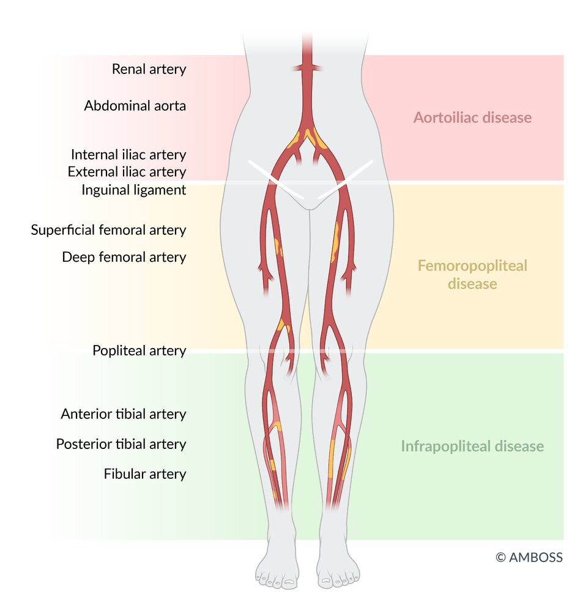

Localization of arterial occlusion in PAD

#### Rest pain

* <u>Rest pain</u> occurs as disease progresses and indicates severe <u>ischemia</u>.

* Typically occurs first in the toes and forefoot

* Worsens with reclining (e.g., while sleeping)

* Improves on hanging feet off the bed or on standing

#### Other symptoms [[1]](https://coursology-qbank.com/amboss/article/0Nde-J0)

* Difficulty walking due to symptoms other than <u>claudication</u>, e.g.:

* Lower extremity muscular discomfort requiring > 10 minutes of rest to resolve

* Painless leg <u>weakness</u>, numbness, or fatigue

* <u>Erectile dysfunction</u>

### Examination findings

* Lower extremity lesions, e.g.:

* Nonhealing or slow-healing wounds (see “<u>Arterial ulcers</u>”)

* <u>Gangrenous necrosis</u> (e.g., <u>wet gangrene</u> and/or <u>dry gangrene</u>)

* Trophic changes

* ↓ <u>Skin</u> temperature, ↓ perspiration

* ↓ <u>Hair</u> on legs, ↓ <u>nail</u> growth, <u>brittle nails</u>

* <u>Atrophied</u> muscles

* Dry <u>atrophic</u>, shiny <u>skin</u> and/or bluish <u>skin</u> discoloration

* <u>Livedo reticularis</u> (advanced disease)

* Absent or diminished pulses (i.e., <u>brachial artery</u>, <u>radial artery</u>, <u>popliteal artery</u>, and <u>dorsalis pedis artery</u>)

* Buerger sign ;   [[3]](https://coursology-qbank.com/amboss/article/35YSPp)[[4]](https://coursology-qbank.com/amboss/article/4Ec3DV0)

* With the patient in the <u>supine position</u>, elevate the lower limbs to a 45° angle at the hip.

* Evaluate for <u>pallor</u> of the feet.

* Ask the patient to sit up with their legs off of the examination table in the <u>dependent position</u>.

* Evaluate the time taken for the color to return to the feet and for the <u>veins</u> to become distended.

* Positive <u>Buerger sign</u>

* <u>Skin</u> <u>pallor</u> on limb elevation

* Reactive <u>hyperemia</u> on limb dependency

* A venous filling time of > 20 seconds may indicate advanced <u>ischemia</u>.

* <u>Bruit</u>: over the affected <u>artery</u> may be heard in > 60–70% of cases with <u>PAD</u>

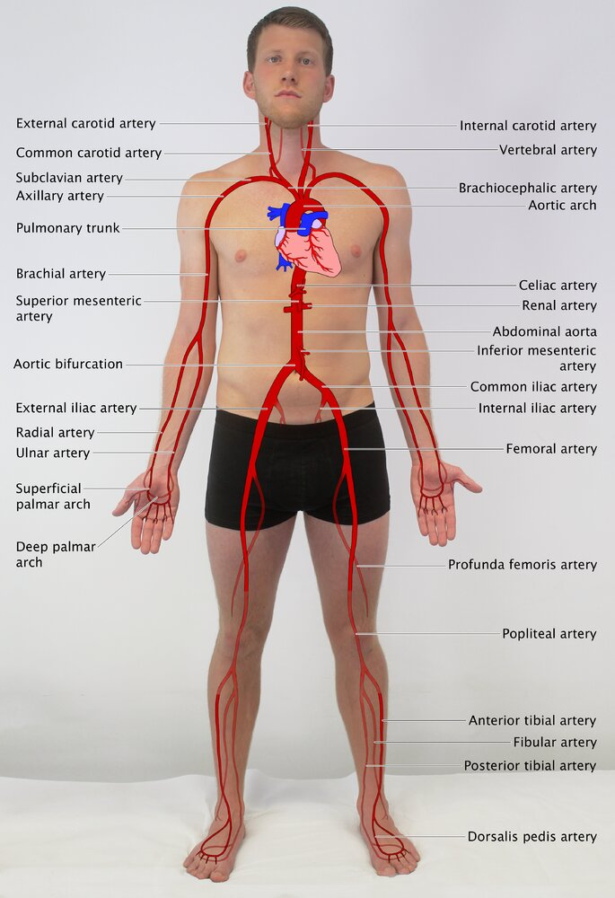

Major arteries of the body

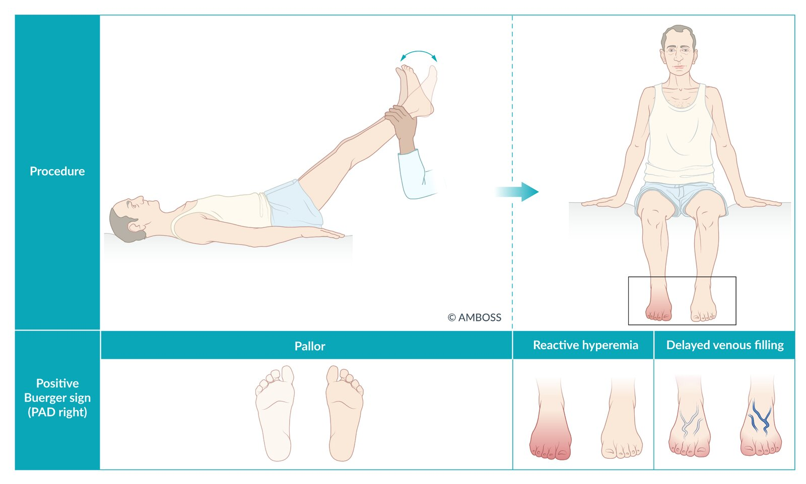

Buerger test (Buerger sign)

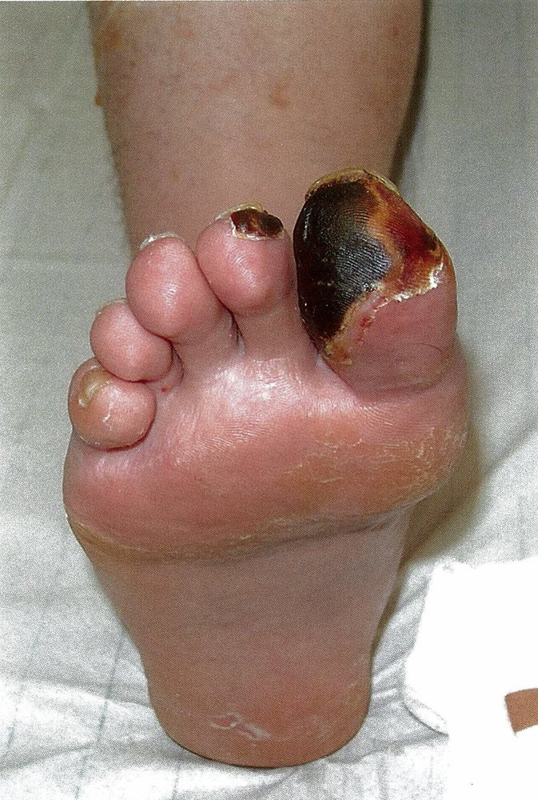

Dry gangrene

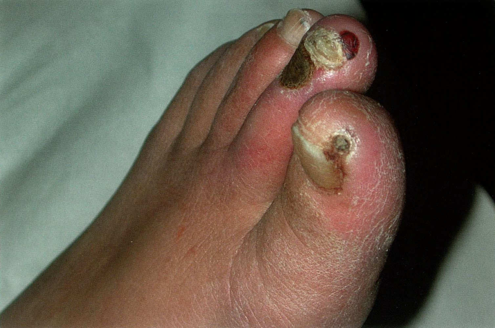

Dry necrosis

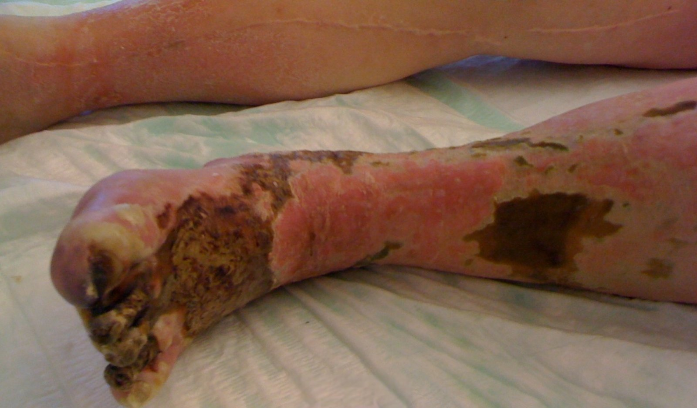

Necrosis in stage IV peripheral arterial disease

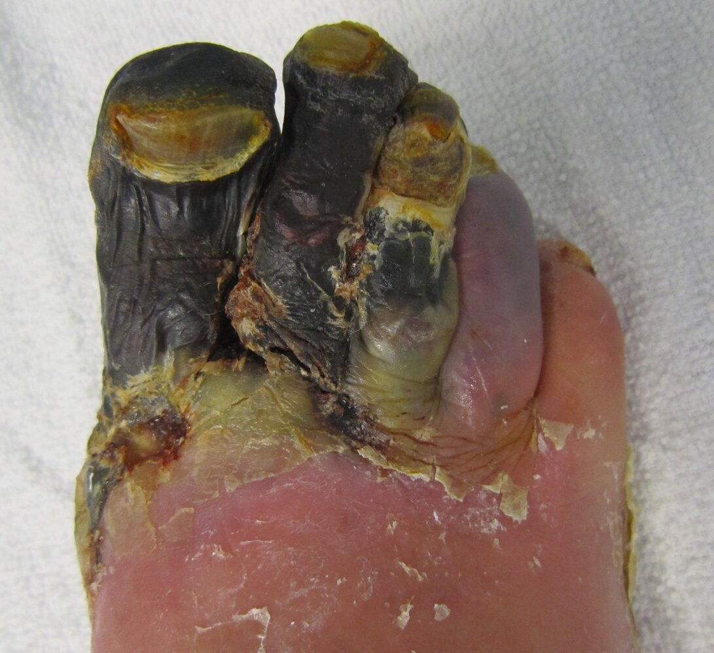

Dry gangrene in peripheral arterial disease

---

## Classification

### Clinical subsets of <u>PAD</u> [[1]](https://coursology-qbank.com/amboss/article/0Nde-J0)

The following subsets apply to patients with confirmed <u>PAD</u>.

* Asymptomatic <u>PAD</u>

* Chronic symptomatic <u>PAD</u> (includes <u>intermittent claudication</u>)

* Chronic limb-threatening ischemia: characterized by <u>rest pain</u>, nonhealing lower extremity wounds, and/or <u>gangrene</u> for > 2 weeks [[1]](https://coursology-qbank.com/amboss/article/0Nde-J0)

* <u>Acute limb ischemia</u>

### Classification systems

See also: “Overview of classification systems in peripheral <u>artery</u> disease” in “Tips and Links.” [[5]](https://coursology-qbank.com/amboss/article/b2cHTb0)

#### Wound, <u>Ischemia</u>, and foot Infection (WIfI) classification [[6]](https://coursology-qbank.com/amboss/article/-UcDfb0)[[7]](https://coursology-qbank.com/amboss/article/X2c9Tb0)

* Purpose

* Quantification of <u>disease burden</u>

* Evaluation of the risks and benefits of <u>revascularization</u> procedures

* Description

* The following factors are assigned values from 0 (normal) to 3 (severe abnormality):

* Wound (W): depth and tissue involvement of existing <u>ulcers</u>

* <u>Ischemia</u> (I): ankle systolic blood pressure and/or tissue oxygenation

* Foot Infection (fI): local and systemic signs of infection

* The benefit of <u>revascularization</u> and the risk of <u>amputation</u> can be estimated based on the three derived values.

#### Fontaine classification  [[5]](https://coursology-qbank.com/amboss/article/b2cHTb0)

* Stage I: asymptomatic

* Stage II: <u>pain</u> on exertion

* Stage III: <u>pain</u> at rest

* Stage IV: <u>necrosis</u>, <u>gangrene</u>

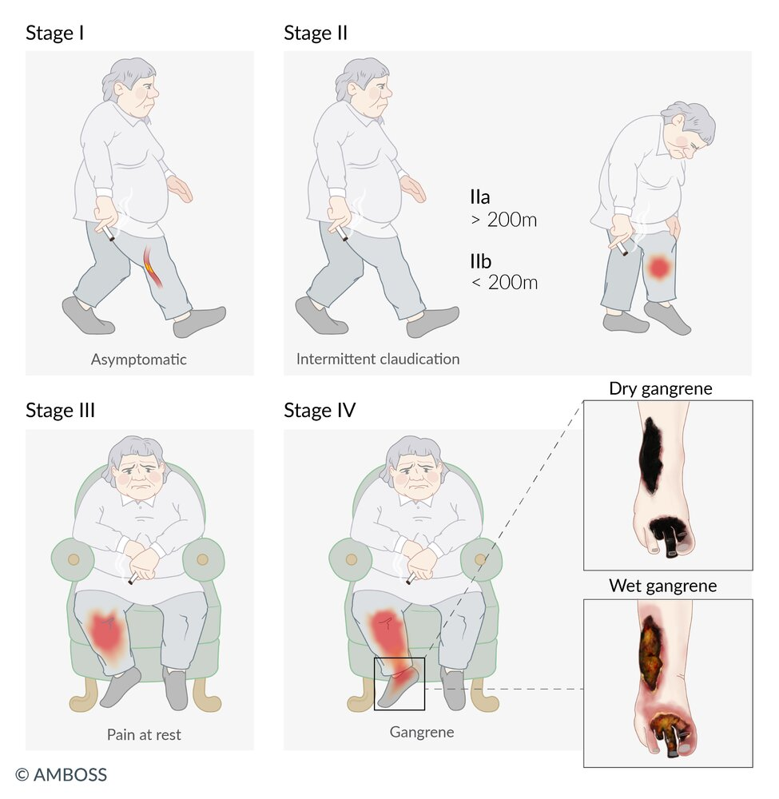

Fontaine classification of peripheral arterial disease (PAD)

#### Other classification systems [[5]](https://coursology-qbank.com/amboss/article/b2cHTb0)

* <u>Rutherford classification</u>

* <u>Global</u> Limb Anatomic Staging System

* TransAtlantic Inter-Society Consensus

* Angiosome classification

---

## Diagnosis

<u>Diagnosis of acute limb ischemia</u> is discussed separately.

### Approach

* Perform a comprehensive history and <u>physical examination</u> in patients with <u>risk factors for PAD</u>; examination should include: 

* Lower extremity pulses

* <u>Skin</u> (e.g., wounds, trophic changes, <u>pallor</u>, rubor)

* Assessment for <u>peripheral neuropathy</u>

* <u>Capillary refill time</u>

* In patients with <u>clinical features of PAD</u>, measure <u>resting ABI</u>.

* <u>PAD</u> is confirmed if <u>ABI</u> is ≤ 0.9.

* If <u>ABI</u> is > 0.9: Confirm <u>PAD</u> with additional testing (e.g., <u>exercise ABI</u>, <u>toe-brachial index</u>) based on clinical presentation.

* Obtain imaging if:

* The diagnosis remains uncertain

* <u>Revascularization</u> is planned

> [!WARNING]
> <u>ALI</u> is an imminently limb-threatening emergency. Treatment should not be delayed to investigate the underlying cause (see “<u>Treatment of ALI</u>”). [[10]](https://coursology-qbank.com/amboss/article/zUcrfb0)

### Ankle-brachial index (<u>ABI</u>) [[1]](https://coursology-qbank.com/amboss/article/0Nde-J0)[[6]](https://coursology-qbank.com/amboss/article/-UcDfb0)[[10]](https://coursology-qbank.com/amboss/article/zUcrfb0)

<u>ABI</u> is the <u>ratio</u> of systolic ankle blood pressure to systolic brachial blood pressure.

#### Resting ABI

* Indications

* First-line diagnostic test for suspected nonacute <u>PAD</u> (i.e., <u>intermittent claudication</u>, <u>rest pain</u>, or nonhealing <u>ulcers</u> or <u>gangrene</u> in the lower limbs)  [[11]](https://coursology-qbank.com/amboss/article/S2cySb0)

* Screening for <u>patients at increased risk for PAD</u> [[1]](https://coursology-qbank.com/amboss/article/0Nde-J0)

* Technique

* Ask the patient to rest in the <u>supine position</u> for approx. 10 minutes.

* Place blood pressure cuffs on the ankles and arms.

* Locate the <u>pulse</u> using a Doppler.

* Inflate the cuff until the <u>pulse</u> is no longer audible on the Doppler device, then inflate the cuff by a further 20 mm Hg.

* Deflate the cuff slowly and note the pressure at which the <u>pulse</u> is audible again.

* Ankle pressure

* Measure the systolic pressure of the <u>dorsalis pedis</u> and <u>posterior tibialis</u> <u>arteries</u> bilaterally.

* Note the higher systolic pressure of either the <u>dorsalis pedis</u> or the <u>posterior tibial artery</u> of each leg.

* Brachial pressure

* Measure the systolic pressure of the <u>brachial arteries</u> bilaterally.

* Note the higher brachial blood pressure of either arm.

* Calculate the <u>ABI</u> for each leg: Divide the highest ankle pressure by the highest brachial pressure.

* Ancillary studies: Either or both may be used with <u>resting ABI</u> to support the diagnosis. [[1]](https://coursology-qbank.com/amboss/article/0Nde-J0)

* <u>Pulse</u> volume recording

* Doppler waveforms

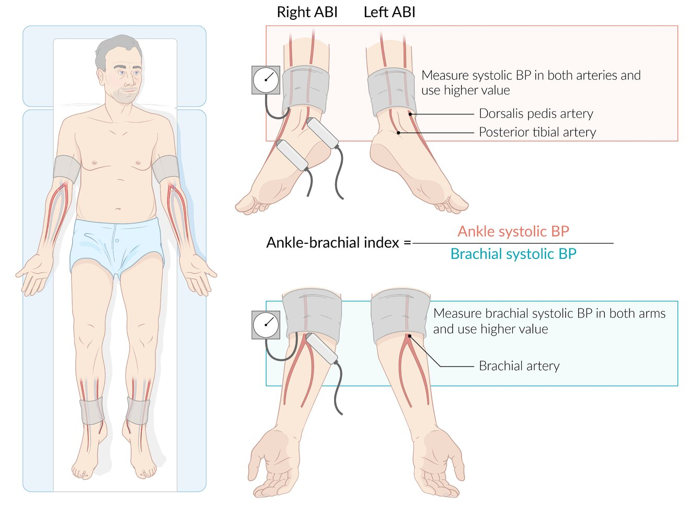

Ankle-brachial index (ABI)

|  <u>Resting ankle-brachial index</u> interpretation in patients with suspected <u>PAD</u> [[1]](https://coursology-qbank.com/amboss/article/0Nde-J0)[[6]](https://coursology-qbank.com/amboss/article/-UcDfb0)  |  |  |
| --- | --- | --- |
|  | Interpretation | Next steps |
| > 1.4 |  * <u>Medial calcific sclerosis</u> with noncompressible vascular wall  [[12]](https://coursology-qbank.com/amboss/article/a2cQTb0)   |   * All patients: Obtain <u>toe-brachial index</u> with waveforms.  * Signs of <u>CLTI</u>: Measure tissue <u>perfusion</u> with transcutaneous oximetry (TcPO2) and/or <u>skin</u> <u>perfusion</u> pressure (<u>SPP</u>).    |
|  1–1.4 [[13]](https://coursology-qbank.com/amboss/article/R2clhb0)  |  * Normal   |   * No signs of <u>CLTI</u>: Obtain <u>exercise ABI</u>.  * Signs of <u>CLTI</u>: Consider <u>toe-brachial index</u> with waveforms, TcPO2, and/or <u>SPP</u>.    |
| 0.91–0.99 |  * Borderline   |  |
| ≤ 0.9 |  * Abnormal (<u>PAD</u> confirmed)   |   * No signs of <u>CLTI</u>: Consider <u>exercise ABI</u> to evaluate functional limitations.  * Signs of <u>CLTI</u>: Consider <u>toe-brachial index</u>, TcPO2, <u>SPP</u>, and/or other measures of local <u>perfusion</u> in patients with nonhealing wounds or <u>gangrene</u>.    |

> [!TIP]
> A low <u>ABI</u> (≤ 0.9) and a high <u>ABI</u> (> 1.4) are associated with an increased risk of all-cause and cardiovascular mortality. [[14]](https://coursology-qbank.com/amboss/article/LtcwVV0)

#### Exercise ABI [[15]](https://coursology-qbank.com/amboss/article/ujcpXc0)

* Description: <u>ABI</u> testing after extended exercise of the lower extremity

* Indications

* Suspicion of <u>PAD</u> in patients with a normal or borderline <u>resting ABI</u>

* Confirmed <u>PAD</u> with <u>ABI</u> ≤ 0.9 (to evaluate functional status) [[1]](https://coursology-qbank.com/amboss/article/0Nde-J0)

* Findings: Either of the following is consistent with <u>PAD</u>.

* Postexercise decrease in <u>ABI</u> of > 20%

* Postexercise decrease in ankle systolic blood pressure of > 30 mm Hg

### Toe-brachial index with waveforms [[1]](https://coursology-qbank.com/amboss/article/0Nde-J0)[[12]](https://coursology-qbank.com/amboss/article/a2cQTb0)[[16]](https://coursology-qbank.com/amboss/article/i2cJhb0)

* Definition: the <u>ratio</u> of systolic blood pressure in the first toe to systolic brachial blood pressure

* Indications

* Resting <u>ABI</u> > 1.4 and suspected <u>PAD</u>

* Suspicion of <u>CLTI</u>

* <u>CLTI</u> with nonhealing wounds: to assess the need for <u>revascularization</u>

* Findings: <u>Toe-brachial index</u> ≤ 0.7 is consistent with <u>PAD</u>.

### Measures of tissue <u>perfusion</u> [[1]](https://coursology-qbank.com/amboss/article/0Nde-J0)

* Indications

* Suspicion of <u>CLTI</u>

* <u>CLTI</u> with nonhealing wounds: to assess the need for <u>revascularization</u>

* Modalities

* Transcutaneous oximetry

* <u>Skin</u> <u>perfusion</u> pressure

### Imaging [[1]](https://coursology-qbank.com/amboss/article/0Nde-J0)[[17]](https://coursology-qbank.com/amboss/article/yHddGr0)

* Indications [[18]](https://coursology-qbank.com/amboss/article/P2cW3b0)

* Patients with a planned <u>revascularization</u> procedure  [[1]](https://coursology-qbank.com/amboss/article/0Nde-J0)

* May be considered in symptomatic patients if the diagnosis of <u>PAD</u> is uncertain

* Modalities [[19]](https://coursology-qbank.com/amboss/article/Dtc1fV0)

* <u>MR angiography</u> with IV contrast

* <u>CT angiography</u> with IV contrast

* <u>Duplex ultrasound</u>: Elevated peak systolic <u>velocity</u> (PSV) and PSV <u>ratio</u> suggest <u>PAD</u>.

* <u>Catheter angiography</u>

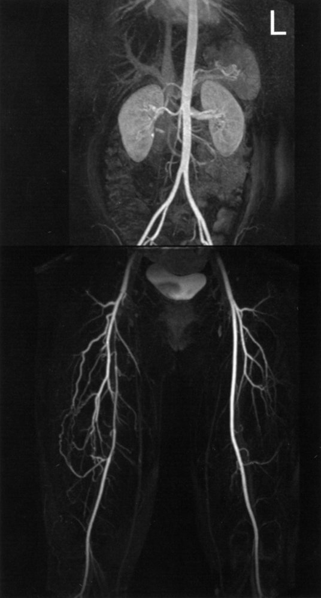

Stenosis of the superficial femoral artery

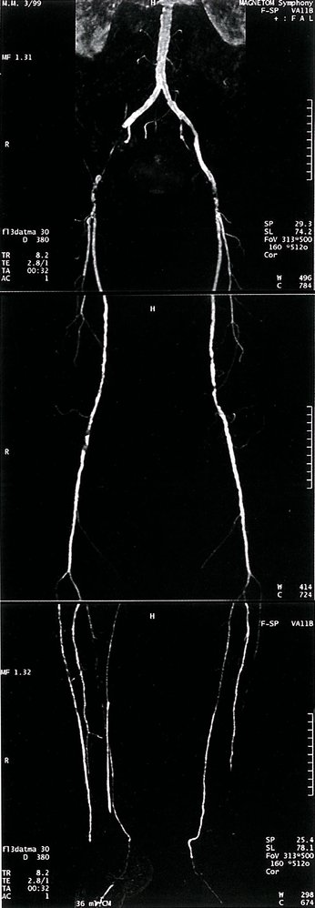

Multilevel peripheral arterial disease of the lower limbs

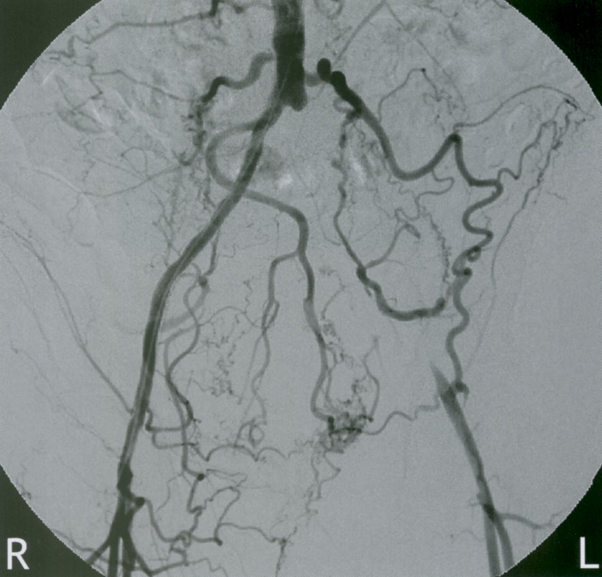

Peripheral arterial disease with iliac occlusion

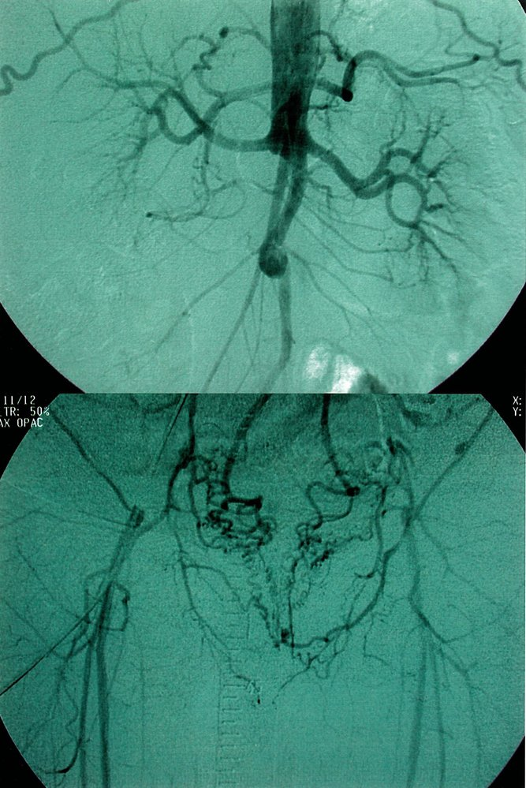

Aortoiliac occlusive disease

---

## Differential diagnoses

| Differential diagnosis of claudication |  |  |  |  |
| --- | --- | --- | --- | --- |
|  |  |  | Patient characteristics | Clinical features |
| Arterial occlusion or narrowing | <u>Vasculitides</u> | <u>Takayasu arteritis</u> |   * Asian females  * 15–45 years    |   * <u>Fever</u>, <u>malaise</u>, <u>arthralgia</u>  * <u>Syncope</u>, <u>angina pectoris</u>  * Impaired <u>vision</u>    |
| <u>Thromboangiitis obliterans</u> |   * 20–40 years  * More common in males before the age of 45 years [[20]](https://coursology-qbank.com/amboss/article/C0XqR9)  * Significant history of tobacco consumption (e.g., smoking, chewing, vaping)    |   * <u>Migratory thrombophlebitis</u>  * <u>Intermittent claudication</u>, often limited to feet, calves and/or hands  * <u>Raynaud syndrome</u>    |  |  |
| (Lower-extremity) <u>fibromuscular dysplasia</u> |  |  * Middle-aged women   |   * Gradual onset of symptoms  * Rarely affects the extremities, leading to <u>intermittent claudication</u>, <u>CLI</u>, and <u>blue toe syndrome</u>    |  |
| <u>Popliteal aneurysm</u> |  |  * Similar <u>risk factors</u> as <u>PAD</u>   |   * Chronic lower limb <u>ischemia</u> may manifest like <u>PAD</u>  * <u>ALI</u> (<u>6 Ps</u>)  * <u>Blue toe syndrome</u>: small vessel occlusion caused by <u>embolus</u>    |  |
| <u>Arterial embolism</u> |  |  * Young patients without <u>atherosclerotic risk factors</u>   |   * Sudden onset of symptoms  * <u>6 Ps</u>    |  |
|  Popliteal entrapment syndrome  |  |  * Most commonly affects young men < 30 years   |  * <u>Intermittent claudication</u>   |  |
|  Cystic adventitial disease  |  |  * Generally affects men between 30–50 years   |  * Foot pulses may be present during rest and absent following exercise [[21]](https://coursology-qbank.com/amboss/article/230T3f)   |  |
| Mimics of arterial occlusion | <u>Deep vein thrombosis</u> |  |   * > 60 years old  * History of <u>immobilization</u>, <u>obesity</u>, <u>hereditary thrombophilia</u> or <u>malignancy</u>    |   * Swelling  * Warmth  * <u>Erythema</u>  * Progressive tenderness  * Dull <u>pain</u>: worsened by walking, improved by resting    |
| <u>Spinal stenosis</u> |  |  * Middle-aged to older patients   |   * <u>Neurogenic claudication</u>  * Accompanied by <u>weakness</u> or numbness  * Bilateral or unilateral leg and <u>back pain</u>  * Improved with lumbar <u>flexion</u>    |  |
| <u>Diabetic neuropathy</u> |  |   * Middle-aged to older patients  * High <u>BMI</u>    |   * Progressive symmetrical loss of or abnormal sensation in the <u>distal</u> lower extremities (glove and stocking sensation)  * Normal <u>ABI</u>  * Neuropathic <u>diabetic foot</u>: warm, dry <u>skin</u>, palpable foot pulses    |  |

### Chronic exertional compartment syndrome [[22]](https://coursology-qbank.com/amboss/article/mG1V-R0)[[23]](https://coursology-qbank.com/amboss/article/Wp1Po30)[[24]](https://coursology-qbank.com/amboss/article/_615n30)

* Definition: recurrent reversible increase in pressure within a fascial compartment that results in <u>pain</u> and/or neurological symptoms due to compromised <u>perfusion</u>

* Etiology: repetitive physical activity (e.g., athletes, military trainees)

* Clinical features

* Location: lower legs (most common), forearms, feet

* Muscle <u>pain</u>, tightness, <u>weakness</u>, and swelling exacerbated by exercise and relieved with rest

* <u>Paresthesia</u>, numbness, and/or transient nerve palsy (e.g., <u>foot drop</u>) may occur.

* Diagnostics

* Symptoms reliably provoked by repetitive activity

* <u>Invasive compartment pressure measurements</u> before and after exercise

* Noninvasive testing: used mainly to evaluate for differential diagnoses [[23]](https://coursology-qbank.com/amboss/article/Wp1Po30)

* <u>Radiography</u>

* <u>Bone scintigraphy</u>

* <u>MRI</u>

* Treatment

* <u>Conservative management</u>: avoidance of provocative activities, gait retraining

* Elective <u>fasciotomy</u> if <u>conservative management</u> fails

The differential diagnoses listed here are not exhaustive.

---

## Treatment

<u>Treatment of ALI</u> and complications of <u>PAD</u> (i.e., <u>arterial ulcers</u>, <u>wet gangrene</u>, and <u>dry gangrene</u>) are discussed separately.

### General principles [[1]](https://coursology-qbank.com/amboss/article/0Nde-J0)[[6]](https://coursology-qbank.com/amboss/article/-UcDfb0)[[25]](https://coursology-qbank.com/amboss/article/02ceTb0)

* All patients

* Start preventive measures (e.g., <u>management of ASCVD</u>).

* Offer <u>supportive care</u> (e.g., preventive foot care).

* Patients with chronic symptomatic <u>PAD</u>

* Start <u>structured exercise therapy</u>.

* Prescribe <u>antithrombotic therapy</u>.

* If symptoms persist, consider <u>cilostazol</u> (for <u>intermittent claudication</u>) and/or <u>revascularization</u>.

* Provide multidisciplinary <u>wound care</u> for nonhealing wounds or <u>gangrene</u>.

* For patients with <u>CLTI</u>: 

* Refer for <u>revascularization</u> if the limb is viable.

* Provide <u>wound care</u> as needed (e.g., for <u>arterial ulcers</u>).

* Consider <u>amputation</u> in patients with life-threatening complications (e.g., <u>sepsis</u>). [[1]](https://coursology-qbank.com/amboss/article/0Nde-J0)

### Structured exercise therapy [[1]](https://coursology-qbank.com/amboss/article/0Nde-J0)[[25]](https://coursology-qbank.com/amboss/article/02ceTb0)

* Indication: : recommended for all patients with chronic symptomatic <u>PAD</u> (e.g., <u>intermittent claudication</u>)

* Key elements

* A qualified <u>health care professional</u> designs and supervises an individualized exercise routine.

* The patient exercises (e.g., walks or bikes) until <u>pain</u> becomes moderate or severe.

* They then rest until the <u>pain</u> subsides and resume exercise.

* 60-minute sessions are repeated 3 times a week for a minimum of 12 weeks.  [[1]](https://coursology-qbank.com/amboss/article/0Nde-J0)

* Setting: a medical setting (e.g., for <u>cardiac rehabilitation</u>) or standalone facility with medical supervision

> [!TIP]
> Exercise therapy may improve <u>claudication</u> but not the <u>ABI</u>, as therapy primarily promotes collateral blood circulation. [[26]](https://coursology-qbank.com/amboss/article/5tciVV0)

### Prevention of progression and complications [[1]](https://coursology-qbank.com/amboss/article/0Nde-J0)[[27]](https://coursology-qbank.com/amboss/article/I8XYL-)

Start <u>management of ASCVD</u> in all patients, as patients with <u>PAD</u> have an increased risk of further <u>ASCVD</u> events (e.g., <u>MI</u> or <u>stroke</u>).

* <u>Lifestyle modifications for ASCVD prevention</u>:  (e.g., <u>smoking cessation</u>)

* <u>Counseling on smoking cessation</u> should occur at every visit for all patients with <u>PAD</u> who smoke.

* Recommend avoiding passive smoke inhalation.

* <u>Antithrombotic therapy</u>: recommended for symptomatic <u>PAD</u>   [[1]](https://coursology-qbank.com/amboss/article/0Nde-J0); 

* Preferred options

* Single <u>antiplatelet therapy</u>: <u>aspirin</u>;  (<u>off-label</u>) DOSAGE or <u>clopidogrel</u>  DOSAGE or <u>ticagrelor</u> [[1]](https://coursology-qbank.com/amboss/article/0Nde-J0)[[6]](https://coursology-qbank.com/amboss/article/-UcDfb0)[[28]](https://coursology-qbank.com/amboss/article/Z2cZTb0)

* OR low-dose <u>rivaroxaban</u>  DOSAGE PLUS <u>low-dose aspirin</u>  [[1]](https://coursology-qbank.com/amboss/article/0Nde-J0)

* <u>Dual antiplatelet therapy</u> (e.g., <u>aspirin</u> PLUS <u>clopidogrel</u>) may be considered after <u>revascularization</u>.

* Lipid-lowering therapy

* Start <u>high-intensity statin therapy</u> in all patients with <u>PAD</u>.

* Consider adding <u>ezetimibe</u> ± a <u>PCSK9 inhibitor</u> (e.g., in patients with <u>very high-risk ASCVD</u>  or inadequate response to <u>statin</u> monotherapy). [[1]](https://coursology-qbank.com/amboss/article/0Nde-J0)[[29]](https://coursology-qbank.com/amboss/article/q2cCib0)

* See also “<u>Lipid-lowering therapy for ASCVD</u>.”

* Management of comorbidities

* <u>Management of hypertension</u>

* Initiate <u>antihypertensives</u> in all patients with <u>PAD</u> and <u>hypertension</u>; <u>ACE inhibitors</u> or <u>ARBs</u> are preferred. [[1]](https://coursology-qbank.com/amboss/article/0Nde-J0)

* Aim for a target systolic blood pressure of < 130 mm Hg and <u>diastolic</u> blood pressure of < 80 mm Hg. [[1]](https://coursology-qbank.com/amboss/article/0Nde-J0)

* <u>Management of diabetes mellitus</u> 

* Provide <u>lifestyle recommendations for patients with diabetes mellitus</u>. [[1]](https://coursology-qbank.com/amboss/article/0Nde-J0)

* Recommended <u>antihyperglycemic treatment</u>: <u>GLP-1 agonists</u> and/or <u>SGLT-2 inhibitors</u> [[1]](https://coursology-qbank.com/amboss/article/0Nde-J0)[[9]](https://coursology-qbank.com/amboss/article/0sdetr0)

* Glycemic goals should be individualized. [[9]](https://coursology-qbank.com/amboss/article/0sdetr0)

* <u>Routine vaccinations</u>: <u>SARS-CoV-2</u> and annual <u>influenza vaccinations</u> are recommended for all patients with <u>PAD</u>.

> [!TIP]
> Intensive <u>management of ASCVD</u> and its <u>risk factors</u> improves outcomes in <u>PAD</u> and prevents <u>ischemic</u> events in other arterial beds, including the <u>coronary arteries</u>. [[10]](https://coursology-qbank.com/amboss/article/zUcrfb0)

### <u>Vasodilator</u> therapy [[1]](https://coursology-qbank.com/amboss/article/0Nde-J0)[[6]](https://coursology-qbank.com/amboss/article/-UcDfb0)

* Indications

* <u>Intermittent claudication</u> to improve symptoms and functional status

* May be considered after <u>revascularization</u> of <u>femoropopliteal disease</u> to reduce the risk of re-stenosis

* Agent: <u>cilostazol</u>  DOSAGE (a <u>phosphodiesterase type 3 inhibitor</u> with <u>vasodilatory</u>, antiplatelet, and antithrombotic properties) [[1]](https://coursology-qbank.com/amboss/article/0Nde-J0)[[30]](https://coursology-qbank.com/amboss/article/82cOjb0)

* <u>Absolute contraindication</u>: <u>congestive heart failure</u> of any severity

> [!TIP]
> <u>Cilostazol</u> improves <u>claudication</u> symptoms and walking distance but has not been shown to decrease <u>major cardiovascular events</u>. [[1]](https://coursology-qbank.com/amboss/article/0Nde-J0)

### <u>Revascularization</u> [[1]](https://coursology-qbank.com/amboss/article/0Nde-J0)[[6]](https://coursology-qbank.com/amboss/article/-UcDfb0)[[31]](https://coursology-qbank.com/amboss/article/ZfcZkb0)

The primary goal of <u>revascularization</u> is to improve blood flow in at least one <u>artery</u> to the foot to prevent <u>pain</u> and tissue loss.

* Indications [[1]](https://coursology-qbank.com/amboss/article/0Nde-J0)

* <u>CLTI</u> (if the limb is viable)

* Chronic symptomatic <u>PAD</u> with lifestyle-limiting <u>claudication</u> despite optimal medical therapy and <u>structured exercise therapy</u>

* Modalities [[1]](https://coursology-qbank.com/amboss/article/0Nde-J0)[[32]](https://coursology-qbank.com/amboss/article/efcxOb0)[[33]](https://coursology-qbank.com/amboss/article/Ufcblb0)

* Endovascular or surgical <u>revascularization</u>

* The choice of procedure depends on the location and morphology of the arterial disease and the patient's comorbidities.

| <u>Revascularization</u> procedures for peripheral arterial disease |  |  |
| --- | --- | --- |
|  | Endovascular <u>revascularization</u> | Surgical <u>revascularization</u> |
| Procedures |   * <u>Percutaneous transluminal angioplasty</u>  * May be combined with <u>stent</u> placement and/or <u>atherectomy</u>    |   * Peripheral artery bypass surgery: Open surgical bypass of the vascular stenosis with an <u>autologous</u> <u>vein</u> or prosthetic material  * <u>Endarterectomy</u> (may be combined with endovascular treatment)    |
|  Indications [[10]](https://coursology-qbank.com/amboss/article/zUcrfb0)[[32]](https://coursology-qbank.com/amboss/article/efcxOb0)[[33]](https://coursology-qbank.com/amboss/article/Ufcblb0)  |  * Consider in the following situations:   * Short segment disease: stenosis < 10 cm or occlusion < 5 cm  * <u>Aortoiliac disease</u>  * High-risk patients  [[10]](https://coursology-qbank.com/amboss/article/zUcrfb0)[[32]](https://coursology-qbank.com/amboss/article/efcxOb0)[[33]](https://coursology-qbank.com/amboss/article/Ufcblb0)   |   * Consider in low- and average-risk patients  with any of the following: [[10]](https://coursology-qbank.com/amboss/article/zUcrfb0)[[32]](https://coursology-qbank.com/amboss/article/efcxOb0)[[33]](https://coursology-qbank.com/amboss/article/Ufcblb0)  * Extensive and complex disease: long segment lesions (> 10 cm); multifocal lesions  * Lesions of the common <u>femoral artery</u>  * Purely <u>infrapopliteal disease</u>  * Chronic total occlusion  * Unsuccessful endovascular <u>revascularization</u> [[10]](https://coursology-qbank.com/amboss/article/zUcrfb0)[[32]](https://coursology-qbank.com/amboss/article/efcxOb0)[[33]](https://coursology-qbank.com/amboss/article/Ufcblb0)    |

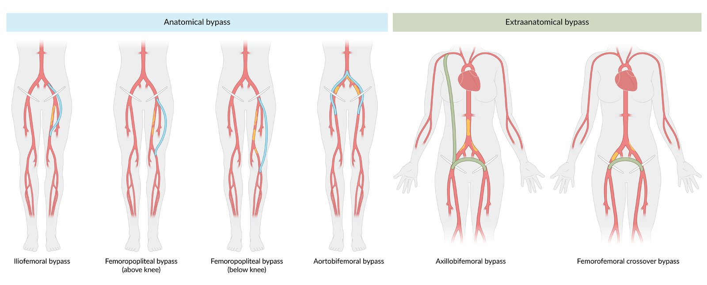

Overview of peripheral artery bypass surgeries

### <u>Supportive care</u> [[1]](https://coursology-qbank.com/amboss/article/0Nde-J0)[[6]](https://coursology-qbank.com/amboss/article/-UcDfb0)

* Foot care[[1]](https://coursology-qbank.com/amboss/article/0Nde-J0)

* All patients with <u>PAD</u> should be educated on how to examine their feet and foot care.

* Inspection is recommended at every visit (at least annually).  [[1]](https://coursology-qbank.com/amboss/article/0Nde-J0)

* Recommend therapeutic footwear for patients with a high risk for <u>ulcers</u>.

* <u>Hyperbaric oxygen therapy</u> may be an option for patients with CTLI and nonhealing <u>diabetic foot ulcers</u>.

* Refer to a specialist if possible, especially for patients with any sign of a foot infection.

* <u>Analgesia</u>

* Complex <u>pain</u> is common in patients with limb <u>ischemia</u>.

* Adequate <u>treatment of pain</u> and/or referral to <u>pain management</u> service helps preserve the patient's quality of life.

* <u>Wound management</u>

* <u>Wet gangrene</u> or <u>sepsis</u>

* Initiate <u>broad-spectrum antibiotics</u>.

* Immediate <u>surgery</u> consult for <u>amputation</u>

* <u>Dry gangrene</u>: Urgent vascular <u>surgery</u> referral for possible <u>revascularization</u> prior to <u>amputation</u>.

* Nonhealing <u>ulcers</u>:Interdisciplinary care recommended to attempt complete <u>wound healing</u>

* Consider adjunctive therapies (e.g., intermittent pneumatic compression) in patients unfit for <u>revascularization</u>. [[1]](https://coursology-qbank.com/amboss/article/0Nde-J0)

### <u>Amputation</u> [[1]](https://coursology-qbank.com/amboss/article/0Nde-J0)[[6]](https://coursology-qbank.com/amboss/article/-UcDfb0)

* <u>Wet gangrene</u>, unsalvageable limb: Urgent <u>amputation</u> may be required, especially in patients with <u>sepsis</u>.

* <u>Dry gangrene</u>: Consult vascular <u>surgery</u> to evaluate for <u>revascularization</u> prior to <u>amputation</u>.

* After successful <u>revascularization</u>, <u>amputation</u> of unsalvageable regions may be performed (staged procedure). [[10]](https://coursology-qbank.com/amboss/article/zUcrfb0)

* In high-risk patients with <u>CLTI</u> or <u>ALI</u> and limited <u>life expectancy</u>, <u>amputation</u> may be considered as the primary treatment modality (i.e., without <u>revascularization</u>).

---

## Complications

Apart from <u>ALI</u>, which is described in a separate article, the following complications can occur due to <u>PAD</u>.

### Arterial ulcer

* Definition: : <u>ulceration</u> caused by impaired blood flow to the lower extremities

* Clinical features 

* Punched-out <u>ulcer</u> with well-defined borders [[34]](https://coursology-qbank.com/amboss/article/4ba3FQ)

* Usually involves the foot, particularly pressure points (e.g., <u>lateral malleolus</u>, tips of the toes)

* Often causes severe <u>pain</u>

* Infection of <u>ulcers</u> → <u>sepsis</u>

* Differential diagnosis: See “<u>Differential diagnosis of leg ulcers</u>.”

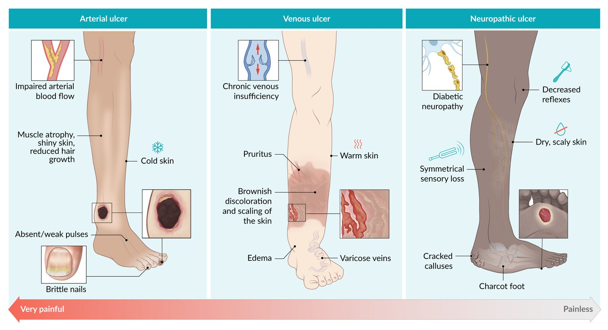

Features of arterial, venous, and neuropathic ulcers

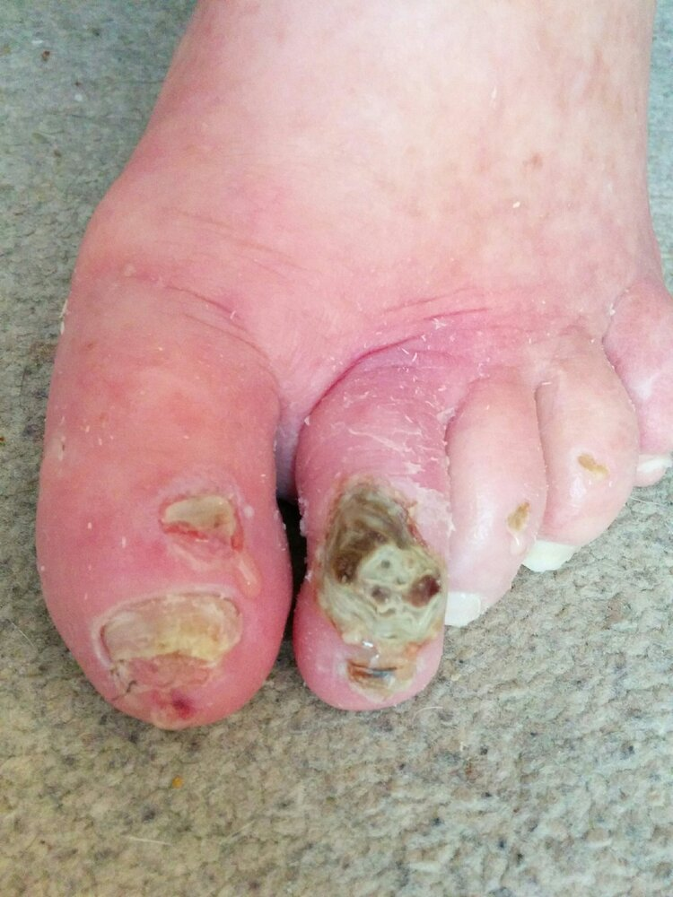

Ischemic ulcers

### Dry gangrene

* Definition: a type of <u>gangrenous necrosis</u> caused by <u>ischemia</u> that is characterized by <u>coagulative necrosis</u> on histopathologic examination

* Clinical features 

* Areas with gray-black discoloration showing a clear demarcation between <u>necrotic</u> and viable tissue

* Autoamputation is possible.

* Diagnosis: based on clinical features

* Management

* Limb salvage

* Wrap the wound with bulky dry gauze.

* <u>Revascularization</u>

* In case of unsuccessful limb salvage: surgical <u>amputation</u>

* Complications: <u>wet gangrene</u>

Dry gangrene in peripheral arterial disease

Toe necrosis

### Wet gangrene

* Definition: a type of <u>gangrenous necrosis</u> caused by <u>superinfection</u> that is characterized by coagulative and <u>liquefactive necrosis</u> on histopathologic examination

* Clinical features

* <u>Edema</u>

* <u>Blistering</u>

* Discharge or a moist appearance

* Rapid spread of infection

* Diagnosis: based on clinical features

* Management

* <u>Analgesia</u>

* <u>Surgical debridement</u>, drainage, and/or <u>amputation</u> of infected and <u>necrotic</u> tissue

* <u>Broad-spectrum antibiotics</u>

* <u>Revascularization</u> (after managing local infection)

* In case of unsuccessful limb salvage: surgical <u>amputation</u>

* Complications: <u>sepsis</u>

We list the most important complications. The selection is not exhaustive.

---

## Prevention

See “Prevention of <u>atherosclerotic cardiovascular disease</u>.”

---