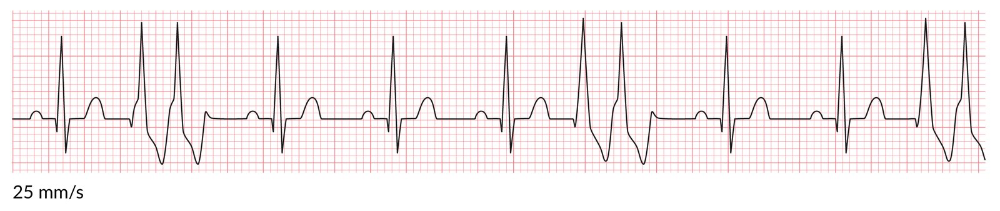
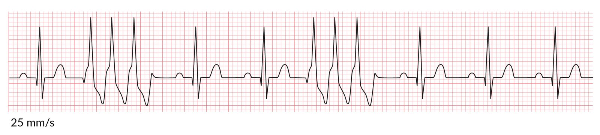
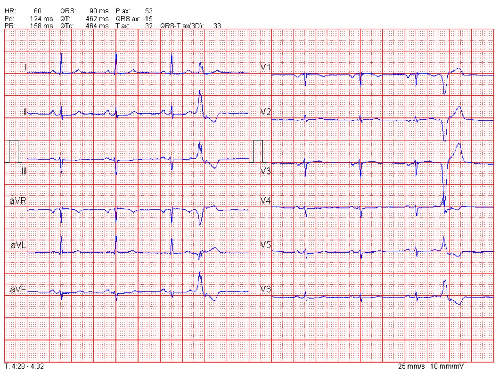
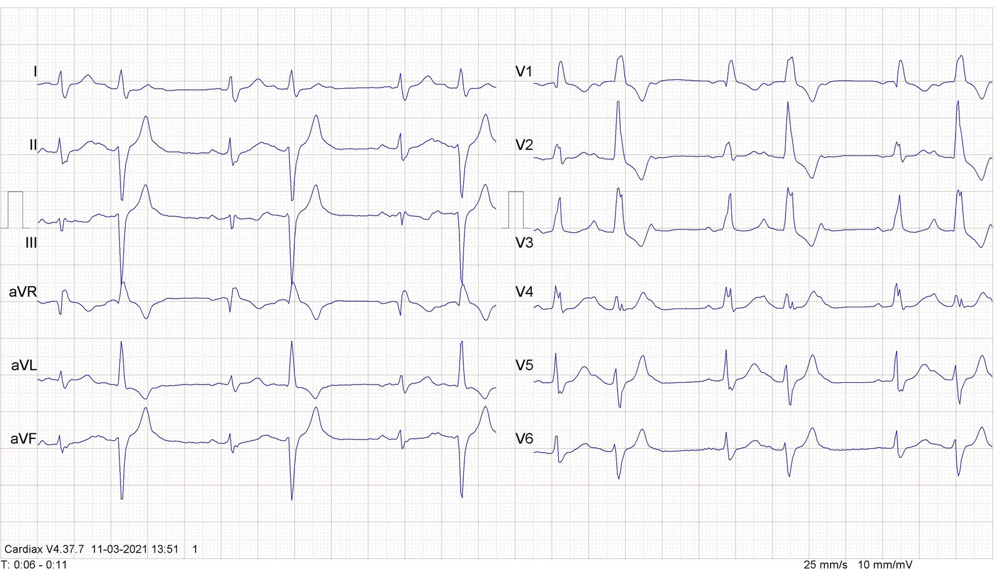
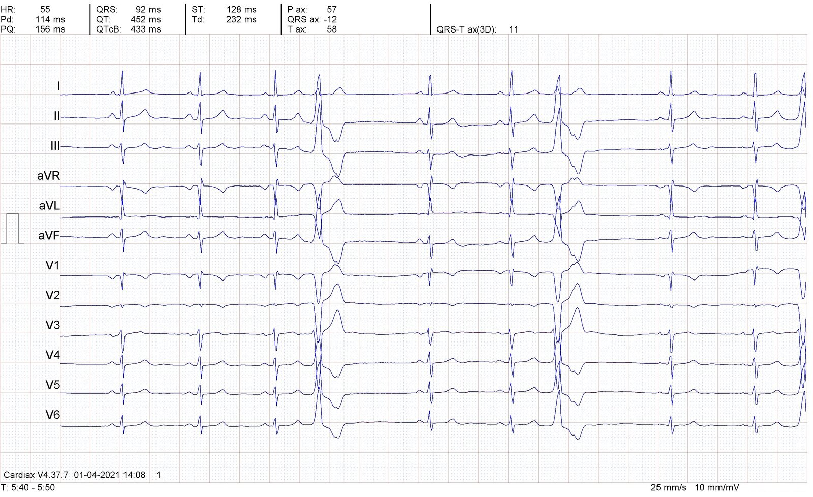

# Premature ventricular contractions

*Categories: Clinical knowledge > Emergency medicine > Cardiovascular disorders > Premature ventricular contractions*

[Original Article Link](https://coursology-qbank.com/amboss/article/8S0OYf)

---

## Summary

A premature <u>ventricular complex</u> (<u>PVC</u>) is an abnormal early electrical firing caused by an <u>ectopic focus</u> in the ventricles. <u>PVCs</u> do not always lead to a contraction. Common causes of <u>PVCs</u> include <u>electrolyte</u> imbalances, cardiovascular disease, and certain medications. <u>PVCs</u> occur in the majority of adults, and <u>prevalence</u> increases with age. They are often discovered incidentally during an <u>ECG</u> for another indication. Most <u>PVCs</u> are asymptomatic, but some individuals present with symptoms such as <u>dizziness</u> or <u>palpitations</u>. <u>ECG</u> findings include <u>wide QRS complexes</u> and <u>compensatory pauses</u> that can be random or have consistent patterns, such as <u>couplets</u> or <u>bigeminy</u>. Most individuals do not require treatment unless they have an underlying condition (e.g., <u>myocarditis</u>, <u>electrolyte</u> abnormalities). <u>Antiarrhythmic drugs</u> or, in some cases, <u>catheter ablation</u> should be considered for individuals with frequent <u>PVCs</u> that cause significant symptoms, as they are at risk for <u>sudden cardiac death</u>.

---

## Etiology

* Modifiable [[1]](https://coursology-qbank.com/amboss/article/kIYm1q)[[2]](https://coursology-qbank.com/amboss/article/OAWIPL0)

* <u>Electrolyte</u> imbalances (e.g., <u>hypokalemia</u>, <u>hypomagnesemia</u>)

* <u>Caffeine</u>  [[2]](https://coursology-qbank.com/amboss/article/OAWIPL0)

* <u>Alcohol</u>

* Drugs (e.g., <u>digoxin</u>)

* <u>High blood pressure</u>

* Physical inactivity

* Smoking

* Nonmodifiable [[1]](https://coursology-qbank.com/amboss/article/kIYm1q)[[2]](https://coursology-qbank.com/amboss/article/OAWIPL0)

* Cardiovascular disease (e.g., <u>coronary artery disease</u>, <u>myocarditis</u>)

* Older age

* Above-average height

* Reduced <u>LVEF</u>

* <u>Idiopathic</u> [[1]](https://coursology-qbank.com/amboss/article/kIYm1q)[[2]](https://coursology-qbank.com/amboss/article/OAWIPL0)

---

## Pathophysiology

* The extra, abnormal heartbeats in <u>PVC</u> are caused by <u>ectopic foci</u> within the ventricles.

* ↓ <u>Diastolic</u> filling time → ↓ <u>stroke volume</u>

---

## Clinical features

* Most patients are asymptomatic. [[3]](https://coursology-qbank.com/amboss/article/3_WSLL0)

* Frequent <u>PVCs</u> may lead to <u>lightheadedness</u>, <u>dizziness</u>, and/or <u>palpitations</u>. [[3]](https://coursology-qbank.com/amboss/article/3_WSLL0)

* <u>Irregular heartbeat</u>

* Skipped or forceful beat  [[2]](https://coursology-qbank.com/amboss/article/OAWIPL0)

* <u>Syncope</u> (rare) [[2]](https://coursology-qbank.com/amboss/article/OAWIPL0)

* <u>Heart failure symptoms</u> (in patients with <u>PVC</u>-induced <u>cardiomyopathy</u>) [[3]](https://coursology-qbank.com/amboss/article/3_WSLL0)

---

## Diagnosis

### Approach [[2]](https://coursology-qbank.com/amboss/article/OAWIPL0)[[3]](https://coursology-qbank.com/amboss/article/3_WSLL0)[[4]](https://coursology-qbank.com/amboss/article/xBYE17)

A 12-lead <u>ECG</u> confirms the diagnosis.

* Obtain <u>BMP</u> and <u>magnesium</u> levels to asses for <u>electrolyte</u> imbalances.

* Consider additional <u>laboratory studies</u> (e.g., <u>TSH</u>, <u>urine drug screen</u>).

* Specialized testing (e.g., <u>Holter monitor</u>, <u>cardiac imaging</u>) may be indicated to:

* Rule out underlying structural disease

* Assess <u>PVC</u> burden, i.e., the <u>proportion</u> of <u>PVCs</u> per total number of beats

### <u>ECG</u> [[2]](https://coursology-qbank.com/amboss/article/OAWIPL0)[[3]](https://coursology-qbank.com/amboss/article/3_WSLL0)

* Common characteristics 

* QRS duration ≥ 120 ms with a blocklike QRS morphology 

* <u>Right ventricular</u> premature beat: similar configuration to <u>left bundle branch block</u>

* <u>Left ventricular</u> premature beat: similar configuration to <u>right bundle branch block</u>

* There is no <u>P wave</u> before a premature <u>QRS complex</u>.

* <u>Compensatory pause</u> after the <u>PVC</u>

* <u>Prematurity</u>: The complex occurs earlier than predicted by the prior sinus pattern.

* <u>T wave</u> and <u>ST segment abnormalities</u>

* Additional characteristics [[3]](https://coursology-qbank.com/amboss/article/3_WSLL0)

* <u>PVC</u> patterns

* Single <u>PVC</u>

* Couplet: two <u>PVCs</u> in a row

* Triplet: three <u>PVCs</u> in a row

* Bigeminy: one extrasystole after every sinus beat

* Trigeminy: one extrasystole after every two sinus beats

* <u>R-on-T phenomenon</u> and short-coupled <u>PVCs</u>: <u>PVCs</u> before the peak of the <u>T wave</u> [[1]](https://coursology-qbank.com/amboss/article/kIYm1q)

* Occur during the vulnerable phase of the <u>ventricular action potential</u>

* Can lead to <u>torsades de pointes</u> or <u>ventricular fibrillation</u>

> [!TIP]
> A 1-minute <u>rhythm strip</u> may help identify <u>PVCs</u> on <u>ECG</u>. [[2]](https://coursology-qbank.com/amboss/article/OAWIPL0)

Premature ventricular complex (PVC) couplets

Premature ventricular complex (PVC) triplets

Premature ventricular complex

ECG rhythm strip with frequent premature ventricular complexes (PVCs)

Ventricular bigeminy and ventricular tachycardia

Bigeminy

Trigeminy

### <u>Laboratory studies</u> [[3]](https://coursology-qbank.com/amboss/article/3_WSLL0)

* All patients: <u>BMP</u> and <u>magnesium</u> level

* Symptomatic patients with no identified cause

* <u>TSH</u>

* <u>Urine drug screen</u>

* <u>Cardiac biomarkers</u>

* Serum <u>digoxin</u> level (if indicated)

### Specialized testing [[2]](https://coursology-qbank.com/amboss/article/OAWIPL0)[[3]](https://coursology-qbank.com/amboss/article/3_WSLL0)

#### Indications [[2]](https://coursology-qbank.com/amboss/article/OAWIPL0)[[3]](https://coursology-qbank.com/amboss/article/3_WSLL0)

* Frequent <u>PVCs</u>: e.g., > 30 <u>PVCs</u> per hour or <u>PVC</u> burden > 20%  [[3]](https://coursology-qbank.com/amboss/article/3_WSLL0)[[4]](https://coursology-qbank.com/amboss/article/xBYE17)

* Symptomatic <u>PVCs</u>: especially symptoms that limit physical activity or are otherwise concerning (e.g., <u>syncope</u>)

* Concerning <u>patient history</u>  [[2]](https://coursology-qbank.com/amboss/article/OAWIPL0)

* <u>PVCs</u> arising from the <u>right ventricle</u>  [[2]](https://coursology-qbank.com/amboss/article/OAWIPL0)

> [!TIP]
> <u>PVCs</u> are a common incidental finding on routine <u>ECGs</u>. No advanced workup is required in asymptomatic patients without indications for additional testing.

#### Modalities [[2]](https://coursology-qbank.com/amboss/article/OAWIPL0)

* <u>Ambulatory ECG monitoring</u>: : e.g., 24-hour <u>Holter monitor</u>, wearable <u>ECG</u> patch

* To determine morphology and <u>PVC</u> burden

* Can help match symptoms to the occurrence of <u>PVCs</u>

* Longer recording intervals (e.g., up to 6 days) may be required for accurate assessment of <u>PVC</u> burden.

* <u>Exercise stress test</u>

* To determine morphology and risk for developing other <u>ventricular arrhythmias</u>

* <u>PVCs</u> occurring during exercise testing are associated with an increased risk of <u>death</u>.  [[4]](https://coursology-qbank.com/amboss/article/xBYE17)

* <u>Cardiac imaging</u>

* <u>Echocardiography</u>: to evaluate cardiac structure and function in all patients referred for clinical evaluation of <u>PVCs</u>

* <u>Cardiac MRI</u>

* To evaluate for structural abnormalities or underlying cardiac infiltrative disease (e.g., <u>sarcoidosis</u>)

* Can help <u>ablation</u> procedure planning

---

## Treatment

### Approach [[2]](https://coursology-qbank.com/amboss/article/OAWIPL0)

* Treat underlying diseases (e.g., <u>CAD</u>, <u>myocarditis</u>, <u>heart failure</u>).

* Treat <u>electrolyte</u> abnormalities (e.g., <u>hypokalemia</u>, <u>hypomagnesemia</u>).

* Specific treatment, i.e., <u>antiarrhythmic drugs</u>, and/or <u>catheter ablation</u>

* Most patients do not require any treatment.

* Usually reserved for patients with;  reduced <u>LVEF</u>, significant symptoms, and/or frequent <u>PVCs</u> (i.e., <u>PVC</u> burden > 5–10%)

* Refer to cardiology for treatment initiation.

* <u>Expectant management</u>: Consider for asymptomatic patients with normal <u>LVEF</u>.

* Low <u>PVC</u> burden (< 5%): routine monitoring during primary care visits

* High <u>PVC</u> burden (> 5–10%): refer to cardiology for annual clinical evaluation and <u>echocardiogram</u>

> [!TIP]
> <u>Beta blockers</u>, <u>CCBs</u>, or <u>catheter ablation</u> are considered first-line strategies for treating <u>PVCs</u>. The optimal approach should be based on <u>shared decision-making</u>. [[2]](https://coursology-qbank.com/amboss/article/OAWIPL0)

### <u>Antiarrhythmic drugs</u> [[2]](https://coursology-qbank.com/amboss/article/OAWIPL0)[[4]](https://coursology-qbank.com/amboss/article/xBYE17)

* Indications include:

* Reduced <u>LVEF</u>

* Normal <u>LVEF</u> with significant symptoms  and/or high <u>PVC</u> burden

* First line

* <u>Beta blockers</u>, e.g., <u>bisoprolol</u> (<u>off-label</u>) DOSAGE OR <u>metoprolol</u> (<u>off-label</u>) DOSAGE  [[2]](https://coursology-qbank.com/amboss/article/OAWIPL0)[[4]](https://coursology-qbank.com/amboss/article/xBYE17)

* OR <u>nondihydropyridine calcium channel blockers</u>: <u>diltiazem</u> OR <u>verapamil</u>

* Second line: if first-line treatment is unsuccessful and <u>catheter ablation</u> is not possible or unsuccessful [[2]](https://coursology-qbank.com/amboss/article/OAWIPL0)

* <u>Class IC antiarrhythmics</u>, e.g., <u>flecainide</u>, <u>propafenone</u>  [[2]](https://coursology-qbank.com/amboss/article/OAWIPL0)[[5]](https://coursology-qbank.com/amboss/article/bzWHrL0)

* <u>Sotalol</u>

* <u>Amiodarone</u>

* <u>Mexiletine</u>

### <u>Catheter ablation</u>  [[2]](https://coursology-qbank.com/amboss/article/OAWIPL0)[[4]](https://coursology-qbank.com/amboss/article/xBYE17)

Indications for <u>catheter ablation</u> include:

* Symptomatic patients who prefer nonpharmacological treatment

* Frequent <u>PVCs</u> (<u>PVC</u> burden ≥ 5–10%) in patients with reduced <u>LVEF</u> [[2]](https://coursology-qbank.com/amboss/article/OAWIPL0)

* Lack of response to or intolerance of first-line pharmacotherapy

> [!TIP]
> <u>Catheter ablation</u> has higher success rates in patients with monomorphic <u>PVCs</u> than in patients with polymorphic <u>PVCs</u>. [[2]](https://coursology-qbank.com/amboss/article/OAWIPL0)

---