# Valvular heart diseases

*Categories: Clinical knowledge > Emergency medicine > Cardiovascular disorders > Valvular heart diseases*

[Original Article Link](https://coursology-qbank.com/amboss/article/-S0DXf)

---

## Summary

Valvular <u>heart</u> diseases (VHDs) comprise a group of conditions that affect the <u>heart valves</u>. Valvular defects are either acquired or congenital and manifest as stenosis and/or insufficiency (<u>regurgitation</u>) of the valves. Acquired defects, which are primarily found in the left <u>heart</u>, are the most common form of VHD and often occur secondary to infections (postinflammatory), degenerative processes, or underlying <u>heart</u> disease. The type of valvular disease determines the type of cardiac <u>stress</u> and subsequent symptoms. Valvular stenosis leads to a greater pressure load and <u>concentric hypertrophy</u>, while insufficiencies are characterized by <u>volume overload</u> and <u>eccentric hypertrophy</u> of the preceding <u>heart</u> cavities. Diagnostic procedures typically include <u>ECGs</u>, <u>chest x-ray</u>, and <u>echocardiograms</u>. Management consists of medical therapy for symptoms (e.g., due to <u>heart failure</u>) as well as interventional or surgical procedures to repair, reconstruct, or replace valves.

---

## Epidemiology

* <u>Aortic stenosis</u>

* Most common valve defect in industrialized countries

* Mostly degenerative

* Degenerative stenosis usually becomes symptomatic after the age of 75 and is most common in men.

* <u>Aortic stenosis</u> in young people is usually secondary to congenital defects (e.g., <u>bicuspid aortic valve</u>).

* <u>Aortic regurgitation</u>

* Age of onset: 40–60 years

* Severity increases with age

* <u>Mitral stenosis</u>: symptom onset between 20 and 39 years [[1]](https://coursology-qbank.com/amboss/article/pGXLZ-)

* <u>Mitral regurgitation</u>

* Overall <u>prevalence</u> of 0.6 to 2.4 %

* Second most common valve defect

* More common in women

* <u>Tricuspid valve</u> defects: occur in < 1% of the population

* <u>Pulmonary valve</u> defects: rare outside of congenital conditions

Epidemiological data refers to the US, unless otherwise specified.

---

## Etiology

Valvular <u>heart</u> defects may either be acquired or congenital. Acquired defects are more common and typically occur secondary to infections (postinflammatory), degenerative processes, or <u>heart</u> disease.

|  Etiology of valvular <u>heart</u> conditions [[2]](https://coursology-qbank.com/amboss/article/FrbgQE)[[3]](https://coursology-qbank.com/amboss/article/YuXnp-)  |  |  |  |
| --- | --- | --- | --- |
|  |  | Valve stenosis | Valve <u>regurgitation</u> |
| Left <u>heart</u> | <u>Mitral valve</u> |   * <u>Rheumatic fever</u>  * Rheumatic diseases (e.g., <u>SLE</u>, <u>RA</u>)    |   * <u>Mitral valve prolapse</u>  * <u>Dilated cardiomyopathy</u>  * <u>Ischemic heart disease</u> (e.g., following <u>myocardial infarction</u>)  * Degenerative calcification  * <u>Rheumatic fever</u>  * <u>Infective endocarditis</u>    |
| Aortic valve |   * Degenerative calcification (most common)  * Rheumatic <u>endocarditis</u>  * Congenital (e.g., unicuspid, bicuspid, or <u>hypoplastic</u> valve)    |   * Acute: <u>infective endocarditis</u>, <u>aortic dissection</u> type A, chest trauma  * Chronic  * <u>Bicuspid aortic valve</u>  * <u>Connective tissue diseases</u> (e.g., <u>Marfan syndrome</u>, <u>Ehlers-Danlos syndrome</u>)  * <u>Rheumatic fever</u>  * Rheumatic diseases (e.g., <u>Behcet disease</u>, <u>RA</u>, <u>SLE</u>)    |  |
| Right <u>heart</u> | <u>Tricuspid valve</u> |   * <u>Rheumatic fever</u>  * <u>Infective endocarditis</u> (mostly IV drug abuse)    |   * <u>Right ventricular</u> dilation (e.g., in <u>right-sided heart failure</u>), pressure overload  * <u>Infective endocarditis</u> (IV drug use)  * <u>Rheumatic fever</u>  * <u>Connective tissue diseases</u> (e.g., <u>Marfan syndrome</u>)  * <u>Carcinoid syndrome</u>  * <u>Pulmonary hypertension</u> (<u>cor pulmonale</u>; secondary to <u>mitral stenosis</u>)  * <u>Left-sided heart failure</u>    |
| <u>Pulmonary valve</u> |   * Congenital  * <u>Carcinoid syndrome</u>    |   * <u>Pulmonary hypertension</u> (e.g., <u>tetralogy of Fallot</u>, <u>ventricular septal defects</u>)  * <u>Dilated cardiomyopathy</u>    |  |

---

## Clinical features

All valvular defects can eventually lead to <u>symptoms of heart failure</u> as a result of excessive strain on the ventricles.

### <u>Physical examination</u>

* Complete <u>heart</u> examination: see <u>cardiovascular examination</u> and <u>auscultation of the heart</u> for details.

| Auscultation in valvular defects |  |  |  |
| --- | --- | --- | --- |
|  | Maximum point |  <u>Murmur</u>   | Characteristics |
|  <u>Aortic stenosis</u>    |   * <u>Aortic valve</u> (parasternal 2nd right <u>intercostal space</u>)  * <u>Erb point</u>    |  * Harsh crescendo-decrescendo <u>systolic ejection</u> <u>murmur</u>   |   * Radiation to the carotids  * Soft <u>S2</u>  * Possibly <u>ejection click</u>    |
|  <u>Aortic regurgitation</u>    |   * <u>Aortic valve</u> (parasternal 2nd right <u>ICS</u>)  * <u>Erb point</u>    |   * <u>Diastolic</u> <u>murmur</u> with a decrescendo  * Possible additional quiet systolic <u>murmur</u>    |   * Immediately following the 2nd<u>heart</u> sound (“immediate <u>diastolic</u> <u>murmur</u>”)  * Austin Flint <u>Murmur</u>    |
|  <u>Mitral stenosis</u>    |  * <u>Heart</u> apex (midclavicular 5th left <u>ICS</u>)   |  * Delayed <u>diastolic</u> <u>murmur</u> with a decrescendo   |   * “Tympanic” 1st<u>heart</u> sound  * Mitral opening <u>murmur</u>/<u>opening snap</u> (OS)    |
| <u>Mitral valve prolapse</u> |  * <u>Heart</u> apex (midclavicular 5th left <u>ICS</u>)   |  * Late-systolic crescendo   |   * Midsystolic high-frequency click (due to the tensing of the <u>chordae tendinae</u>)  * Loudest before <u>S2</u>    |
|  <u>Mitral regurgitation</u>    |   * <u>Heart</u> apex (midclavicular 5th left <u>ICS</u>)  * Left <u>axilla</u>    |   * <u>Holosystolic murmur</u>  * 3rd<u>heart</u> sound audible  * Quiet 1st<u>heart</u> sound    |   * Blowing  * Radiation into the <u>axilla</u>    |
| <u>Pulmonary stenosis</u> |  * <u>Pulmonary valve</u> (parasternal 2nd left <u>ICS</u>)   |  * Crescendo-decrescendo ejection systolic <u>murmur</u>   |   * Possible radiation into the back  * Possible early systolic pulmonary <u>ejection click</u> and/or widely split 2nd<u>heart</u> sound    |
| Pulmonary regurgitation |  * <u>Pulmonary valve</u> (parasternal 2nd left <u>ICS</u>)   |  * <u>Diastolic</u> <u>murmur</u> with a decrescendo   |  * Graham Steell murmur: high-frequency decrescendo <u>diastolic</u> <u>murmur</u>   |
|  Tricuspid stenosis (extremely rare) |  * <u>Tricuspid valve</u> (parasternal 4th left <u>ICS</u>)   |   * Delayed <u>diastolic</u> <u>murmur</u> with a decrescendo  * Possible pre-systolic crescendo    |  |
|  Tricuspid regurgitation     |  * <u>Tricuspid valve</u> (parasternal 4th left <u>ICS</u>)   |  * <u>Holosystolic murmur</u>   |  * Augmentation of the <u>murmur</u>'s intensity with inspiration (Carvallo sign)   |

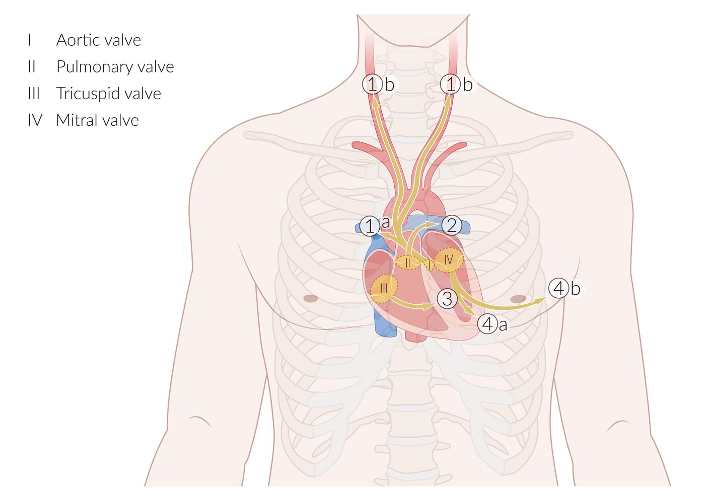

Anatomical locations and auscultatory sites for heart valves

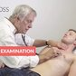

Cardiovascular Examination - Clinical Examination of the Heart

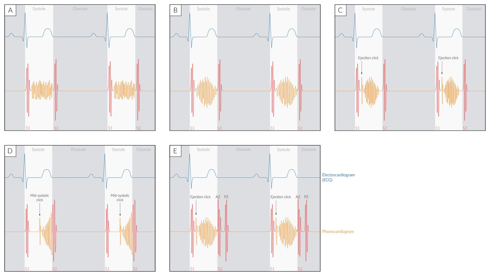

Phonocardiogram of systolic heart murmurs

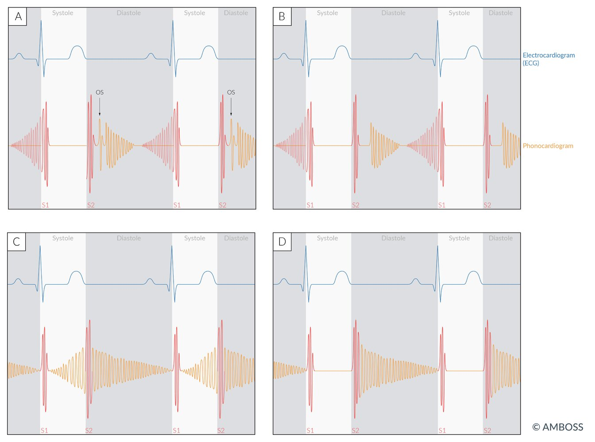

Phonocardiogram of diastolic murmurs

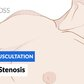

Aortic Stenosis (AS) - Heart Auscultation - Episode 1

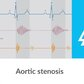

Aortic stenosis - Heart Murmur - Clinical examination | Δ AMBOSS

Aortic Regurgitation (AR) - Heart Auscultation - Episode 2

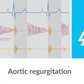

Aortic regurgitation - Heart murmur -  Clinical examination | Δ AMBOSS

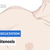

Mitral Stenosis (MS) - Heart Auscultation - Episode 3

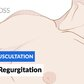

Mitral Regurgitation (MR) - Heart Auscultation - Episode 4

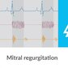

Mitral regurgitation - Heart murmur - Clinical examination | Δ AMBOSS

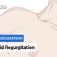

Tricuspid Regurgitation (TR) - Heart Auscultation - Episode 12

References:[[4]](https://coursology-qbank.com/amboss/article/U30b3f)[[5]](https://coursology-qbank.com/amboss/article/8rbOQE)

---

## Medical treatment

### <u>Supportive care</u> [[6]](https://coursology-qbank.com/amboss/article/-FXDk-)

* Screen for and manage other <u>traditional atherosclerotic cardiovascular disease risk factors</u>.

* Manage complications, e.g., <u>treatment of heart failure</u>.

* Consider indications for <u>endocarditis prophylaxis</u> before procedures that may cause <u>bacteremia</u>.

* <u>Secondary prevention</u> of <u>rheumatic fever</u> if indicated (see “Prevention” in “<u>Acute rheumatic fever</u>”)

* Prevention of <u>thromboembolism</u> if indicated (e.g., <u>anticoagulant therapy after heart valve replacement</u>)

### Monitoring for disease progression [[6]](https://coursology-qbank.com/amboss/article/-FXDk-)

Monitor all patients without indications for intervention at diagnosis.

* Repeat <u>patient history</u> and <u>physical examination</u> annually.

* Obtain <u>TTE</u> follow-up at fixed intervals depending on the type and severity of valve defect.

* Consider advanced studies and/or referral for valve intervention depending on findings.

---

## Interventional treatment

### <u>Valve repair</u> [[6]](https://coursology-qbank.com/amboss/article/-FXDk-)

* Valve reconstruction

* Annuloplasty [[7]](https://coursology-qbank.com/amboss/article/2q0TBS)

* A ring-shaped device is attached to the outside of the valve opening to reestablish the shape and function of the valve.

* Commonly used to treat <u>mitral valve regurgitation</u> [[8]](https://coursology-qbank.com/amboss/article/1I12bR0)

* Leaflet repair: involves the use of a clip device; may be performed in patients with <u>mitral valve regurgitation</u>

* Valvuloplasty

* A procedure performed in patients with valvular stenosis (e.g., <u>aortic valve stenosis</u> or <u>mitral stenosis</u>) to separate fused or calcified valve leaflets.

* Approach

* Percutaneous balloon valvuloplasty: A balloon is advanced into the target valve (either transfemorally or transapically) and inflated, opening the stenotic valve.

* Open <u>commissurotomy</u>: open surgical procedure to separate fused and/or calcified leaflets

### <u>Prosthetic heart valve replacement</u> [[6]](https://coursology-qbank.com/amboss/article/-FXDk-)

|  Overview of prosthetic heart valve replacement options [[6]](https://coursology-qbank.com/amboss/article/-FXDk-)  |  |  |
| --- | --- | --- |
|  |  Mechanical prosthetic valve  |  Biological prosthetic valve  |
| Indications |   * Younger patients  * Patients < 50 years who require <u>aortic valve replacement</u>  [[6]](https://coursology-qbank.com/amboss/article/-FXDk-)  * Patients < 65 years who require <u>mitral valve</u> replacement  * Patients taking <u>anticoagulants</u>  * Patients with a high surgical risk for reintervention    |   * Older patients (≥ 65 years of age), [[6]](https://coursology-qbank.com/amboss/article/-FXDk-)  * Patients with a high risk of bleeding  * Patients who are currently pregnant or have a desire to carry a <u>pregnancy</u> in the future    |
| Advantages |  * Valve has a long lifespan.   |  * Anticoagulation is only necessary for 3 months after <u>surgery</u>.   |
| Disadvantages |  * Life-long anticoagulation is necessary (e.g., with a <u>vitamin K</u> <u>antagonist</u>).   |  * Short lifespan due to <u>sclerotic</u> degeneration (<u>biological prosthetic valves</u> may need to be replaced every 10 years)  [[6]](https://coursology-qbank.com/amboss/article/-FXDk-)   |

> [!TIP]
> The choice of mechanical vs. <u>bioprosthetic valve</u> replacement should be based on shared-decision making, patient age and preference, presence of comorbidities (e.g., conditions that increase the patient's surgical risk), and ability to take anticoagulation.

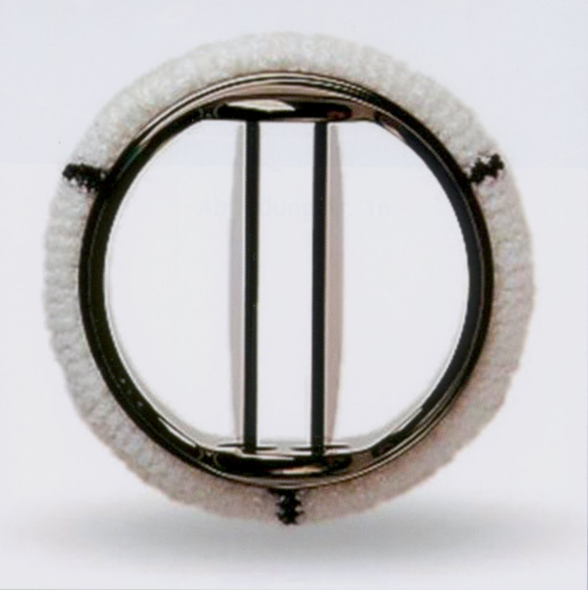

Bileaflet mechanical prosthetic heart valve

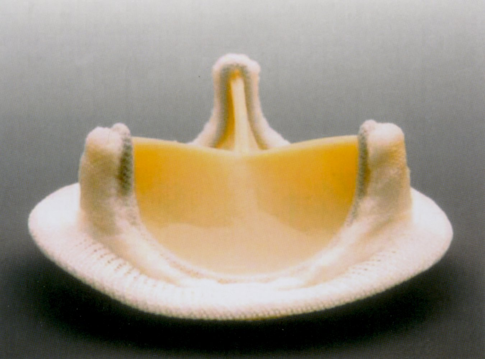

Biological prosthetic heart valve

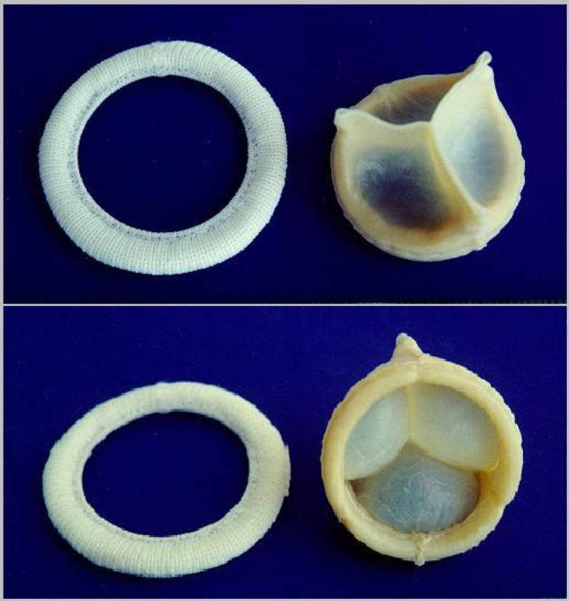

Bioprosthetic heart valve

#### Replacement route

The approach depends on the type of valve (e.g., mechanical vs. bioprosthetic) and the patient's surgical risk.

* Surgical <u>heart valve</u> replacement: may be done in conjunction with a <u>CABG</u> in suitable patients who require both procedures

* Transcatheter aortic valve replacement (<u>TAVR</u>)

* A minimally invasive, percutaneous procedure that utilizes an endovascular technique to replace the <u>aortic valve</u>.

* A collapsible replacement valve is inserted via a catheter and placed over the native valve.

* Once the replacement valve is expanded, it displaces the old valve and assumes its function.

* Transcatheter <u>mitral valve</u> replacement

### Complications of heart valve intervention [[6]](https://coursology-qbank.com/amboss/article/-FXDk-)[[9]](https://coursology-qbank.com/amboss/article/incJG10)

* Patient-prosthesis mismatch

* Caused by implantation of a <u>prosthetic valve</u> with a functional area that is too small for the cardiac demand of the patient

* Leads to <u>left ventricle</u> <u>hypertrophy</u> and impaired exercise capacity

* Increased risk of other cardiac events (e.g., <u>arrhythmia</u>, <u>MI</u>) and increased mortality

* Prosthetic valve thrombosis [[10]](https://coursology-qbank.com/amboss/article/ppXLq_)[[11]](https://coursology-qbank.com/amboss/article/meWVz40)

* Etiology

* <u>Mechanical valves</u> are more <u>prone</u> to <u>thrombosis</u> than <u>biological prosthetic valves</u>.

* Ιnsufficient anticoagulatory therapy after valve replacement

* Clinical features

* <u>Signs of acute heart failure</u> due to valve dysfunction (e.g., <u>dyspnea</u>, fatigue, <u>peripheral edema</u>)

* New <u>murmur</u> consistent with valve obstruction and/or <u>regurgitation</u>

* <u>Thromboembolic event</u> (e.g., <u>TIA</u>)

* Diagnostics

* First-line imaging: transthoracic or <u>transesophageal echocardiography</u> [[11]](https://coursology-qbank.com/amboss/article/meWVz40)

* If <u>echocardiography</u> is negative: <u>cardiac CT</u> to assess leaflet anatomy and motility

* Treatment: anticoagulation and <u>fibrinolysis</u>, surgical valve replacement

* <u>Prosthetic valve</u> dysfunction: e.g., paravalvular leak

* <u>Prosthetic valve</u> stenosis or <u>regurgitation</u>: Clinical presentation is similar to native valve disease.

* Cardiac complications: e.g., <u>prosthetic valve endocarditis</u>, <u>heart failure</u>, <u>pericarditis</u>, <u>high-grade AV block</u>, <u>atrial fibrillation</u>  [[6]](https://coursology-qbank.com/amboss/article/-FXDk-)

* Vascular complications: e.g., bleeding, <u>femoral artery</u> dissection, <u>hemolytic anemia</u> in patients with a <u>mechanical valve</u> , <u>thromboembolism</u>  [[6]](https://coursology-qbank.com/amboss/article/-FXDk-)

* Other: e.g., <u>stroke</u>, <u>acute kidney injury</u>

### <u>Preoperative risk assessment</u> [[6]](https://coursology-qbank.com/amboss/article/-FXDk-)

* Prior to any valve procedure, preoperative testing includes:

* <u>Coronary angiography</u> to assess coronary anatomy

* CT imaging

* Dental examination to assess the risk of infection

* Additional evaluations may be required prior to open <u>surgery</u>: Refer for <u>preoperative testing for high-risk surgery</u>.

### Post-procedure follow-up [[6]](https://coursology-qbank.com/amboss/article/-FXDk-)

* Monitor patients for recurrent or persistent symptoms and <u>complications of heart valve intervention</u>.

* Obtain <u>TTE</u> to evaluate valve and cardiac function.

* 1–3 months after valve procedure  [[6]](https://coursology-qbank.com/amboss/article/-FXDk-)

* At fixed intervals thereafter depending on type of valve replacement

#### Anticoagulant therapy after heart valve replacement [[6]](https://coursology-qbank.com/amboss/article/-FXDk-)

* <u>Mechanical valve replacement</u>

* Lifelong anticoagulation with a <u>vitamin K antagonist</u> (<u>VKA</u>) to a target <u>INR</u>  [[6]](https://coursology-qbank.com/amboss/article/-FXDk-)

* <u>Bridging anticoagulation</u> is recommended when <u>VKA</u> is interrupted (e.g., for <u>surgery</u>) for patients with:

* <u>Aortic valve replacement</u> and additional <u>risk factors</u> for <u>thromboembolism</u>

* <u>Mitral valve</u> replacement

* <u>Biological valve replacement</u>

* Anticoagulation with <u>VKA</u> for 3–6 months after intervention

* <u>Low-dose aspirin</u> DOSAGE after discontinuing <u>VKA</u> can be beneficial.

* In patients with <u>atrial fibrillation</u> and a <u>bioprosthetic valve</u> replacement > 3 months prior, a non-<u>vitamin K</u> <u>oral anticoagulant</u> (<u>NOAC</u>) may be considered  based on the <u>CHA2DS2-VASc score</u>.

> [!WARNING]
> Insufficient anticoagulation increases the risk of <u>thromboembolism</u>, while excessive anticoagulation with <u>VKA</u> increases bleeding risk significantly. In patients with a <u>mechanical valve</u> and uncontrollable hemorrhage, <u>anticoagulation reversal</u> may be indicated.

---