# Dermatophyte infections

*Categories: Clinical knowledge > Emergency medicine > Dermatologic disorders > Dermatophyte infections*

[Original Article Link](https://coursology-qbank.com/amboss/article/Hf0Kn2)

---

## Summary

<u>Dermatophyte</u> infections (tinea) are caused by keratinophilic fungi, most commonly of the <u>Trichophyton</u>, <u>Microsporum</u>, and <u>Epidermophyton</u> genera, and affect the <u>skin</u>, <u>hair</u>, and <u>nails</u>. Depending on the site of infection, the clinical manifestations, differential diagnoses, and management may differ. In general, clinical features include well-defined lesion(s) with <u>pruritus</u>, <u>scaling</u>, and <u>erythema</u>. Visual inspection may be adequate for diagnosing <u>dermatophyte</u> infections involving the <u>skin</u> (e.g., <u>tinea pedis</u>, <u>tinea corporis</u>, and <u>tinea cruris</u>), for which topical treatment is usually sufficient. If the diagnosis remains uncertain or if systemic therapy is likely needed (e.g., for suspected <u>tinea capitis</u> or <u>tinea unguium</u>), additional testing is necessary to confirm the diagnosis, e.g., <u>KOH test</u> or fungal culture. Systemic <u>antifungal</u> therapy is usually required for weeks to months, and patients require monitoring for potential adverse effects of therapy. Reinfection is common; screen and treat close contacts and advise patients on infection prevention measures (e.g., not sharing towels and keeping <u>skin</u> clean, cool, and dry).

<u>Tinea versicolor</u>, despite its name, is not caused by <u>dermatophytes</u> and is discussed in another article.

---

## Etiology

### Causative pathogens [[1]](https://coursology-qbank.com/amboss/article/Bedza60)[[2]](https://coursology-qbank.com/amboss/article/iTdJq60)

* <u>Dermatophytes</u> are fungi that infect keratinized tissue and belong to the <u>Trichophyton</u> (most common), <u>Microsporum</u>, and <u>Epidermophyton</u> genera.

* The most common causative <u>pathogen</u> of <u>dermatophyte</u> infection is Trichophyton rubrum.

### <u>Risk factors</u> [[1]](https://coursology-qbank.com/amboss/article/Bedza60)[[2]](https://coursology-qbank.com/amboss/article/iTdJq60)

* Risk factors common to all dermatophyte infections include:

* <u>Diabetes mellitus</u>

* <u>Immunodeficiency</u> (e.g., <u>HIV</u>, <u>trisomy 21</u>)

* Poor circulation, <u>peripheral arterial disease</u>

* <u>Maceration</u> of <u>skin</u> (e.g., due to <u>excessive sweating</u>)

* Additional <u>risk factors</u> specific to the site of infection are detailed in the relevant sections.

### Transmission [[1]](https://coursology-qbank.com/amboss/article/Bedza60)

* Indirect contact with <u>fomites</u> (e.g., combs, towels, shoes)

* Direct <u>skin</u>-to-<u>skin</u> transmission with infected individuals or animals

---

## Clinical features

* Features vary based on site of infection; see relevant sections under “Subtypes and variants” for details. [[1]](https://coursology-qbank.com/amboss/article/Bedza60)[[2]](https://coursology-qbank.com/amboss/article/iTdJq60)

* In general, clinical features include well-defined lesion(s) with <u>pruritus</u>, <u>scaling</u>, and <u>erythema</u>.

* Lesions may be accompanied by an id reaction (a type of <u>hypersensitivity reaction</u>); manifestations include: [[1]](https://coursology-qbank.com/amboss/article/Bedza60)

* Widespread pruritic lesions (<u>papular</u>, <u>vesicular</u>, or <u>eczematous</u>)

* Often located at sites distant from the fungal infection

* Can occur after initiation of therapy

* Rare features include:

* Majocchi granuloma [[1]](https://coursology-qbank.com/amboss/article/Bedza60)[[3]](https://coursology-qbank.com/amboss/article/FpdgrI0)

* Rare granulomatous <u>dermal</u> reaction to fungal infection of <u>hair follicle</u> and surrounding tissue

* Manifestations are variable and include perifollicular <u>pustules</u>, <u>nodules</u>, or <u>papules</u> within an <u>erythematous</u> <u>plaque</u>.

* May develop after <u>tinea corporis</u> is treated with <u>topical corticosteroids</u>

* Tinea incognito [[1]](https://coursology-qbank.com/amboss/article/Bedza60)[[4]](https://coursology-qbank.com/amboss/article/MSdMZp0)

* <u>Dermatophyte</u> infection with an atypical presentation (e.g., no <u>scaling</u> at the border of lesions, reduced <u>erythema</u>)

* May occur in patients with <u>immunosuppression</u> or after using <u>topical steroids</u> [[1]](https://coursology-qbank.com/amboss/article/Bedza60)[[2]](https://coursology-qbank.com/amboss/article/iTdJq60)[[4]](https://coursology-qbank.com/amboss/article/MSdMZp0)

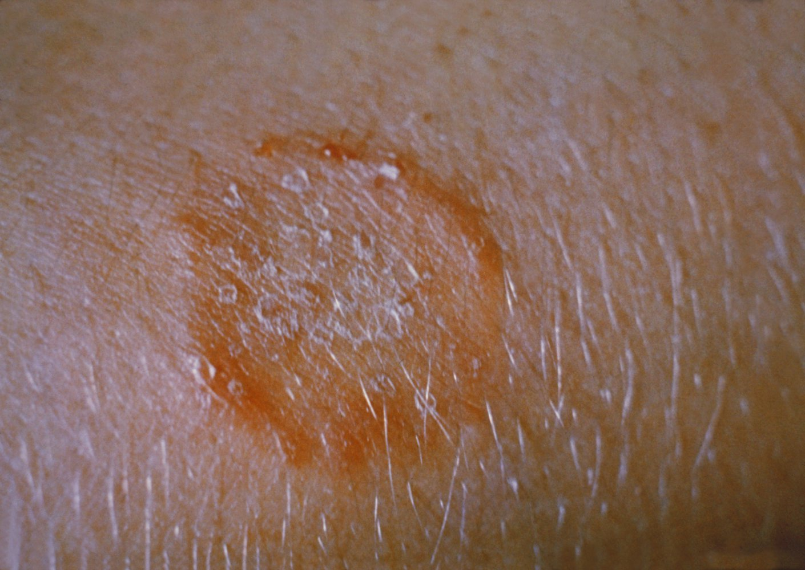

Tinea corporis

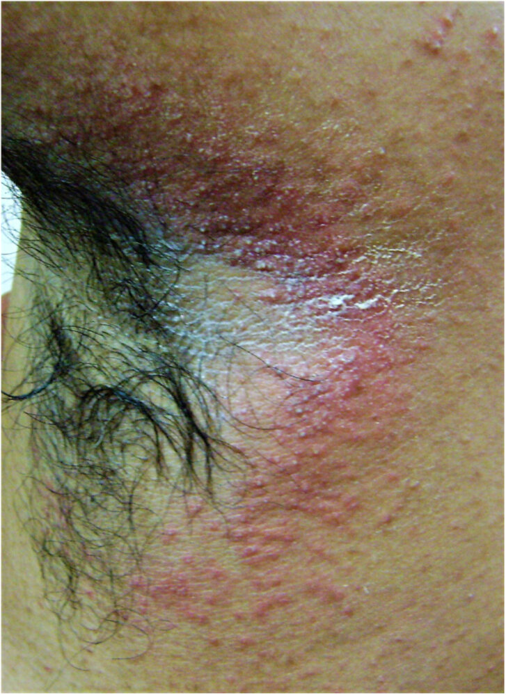

Tinea incognito

> [!TIP]
> Worsening of symptoms of an undifferentiated cutaneous lesion following empiric treatment with <u>topical steroids</u> suggests a <u>dermatophyte</u> infection. [[2]](https://coursology-qbank.com/amboss/article/iTdJq60)

---

## Differential diagnoses

See also relevant sections under “Subtypes and variants” for differential diagnoses specific to the site of involvement.

* <u>Impetigo</u>

* Dermatitides (e.g., <u>seborrheic dermatitis</u>, <u>atopic dermatitis</u>, <u>contact dermatitis</u>)

* <u>Pityriasis versicolor</u>

* <u>Herald patch</u> (<u>pityriasis rosea</u>)

* Cutaneous <u>candidiasis</u>

* <u>Erythrasma</u>

* <u>Psoriasis</u>

* <u>Intertrigo</u>

* <u>Nummular eczema</u>

* <u>Erythema multiforme</u>

* <u>Granuloma annulare</u>

The differential diagnoses listed here are not exhaustive.

---

## Management

### Diagnosis [[2]](https://coursology-qbank.com/amboss/article/iTdJq60)[[5]](https://coursology-qbank.com/amboss/article/USdb_60)

* <u>Tinea corporis</u>, <u>tinea cruris</u>, and <u>tinea pedis</u> are usually <u>diagnosed clinically</u>.

* Indications for diagnostic testing

* Diagnostic uncertainty

* Patients requiring systemic therapy (e.g., <u>tinea capitis</u>, <u>tinea unguium</u>, severe or refractory infection)

* Diagnostic tests

* <u>KOH test</u>: branching segmented <u>hyphae</u>, spores   [[2]](https://coursology-qbank.com/amboss/article/iTdJq60)[[5]](https://coursology-qbank.com/amboss/article/USdb_60)

* Fungal culture: high <u>accuracy</u> but results take 2–6 weeks  [[2]](https://coursology-qbank.com/amboss/article/iTdJq60)

* <u>Wood lamp examination</u> [[1]](https://coursology-qbank.com/amboss/article/Bedza60)[[2]](https://coursology-qbank.com/amboss/article/iTdJq60)

* Used as an adjunct to KOH or fungal culture for suspected <u>Microsporum</u> spp.

* Findings [[6]](https://coursology-qbank.com/amboss/article/XJd9sI0)

* Blue-green fluorescence of <u>Microsporum</u> spp.

* <u>Trichophyton</u> tonsurans does not fluoresce.

* <u>False negatives</u> may occur if the patient has recently bathed.

* <u>Skin biopsy</u> or <u>nail</u> <u>biopsy</u> : higher <u>sensitivity</u> when used in combination with KOH and/or fungal testing

> [!TIP]
> For patients with widespread <u>dermatophyte</u> infection, consider working up for underlying <u>immunosuppression</u>, e.g., <u>HIV testing</u>.

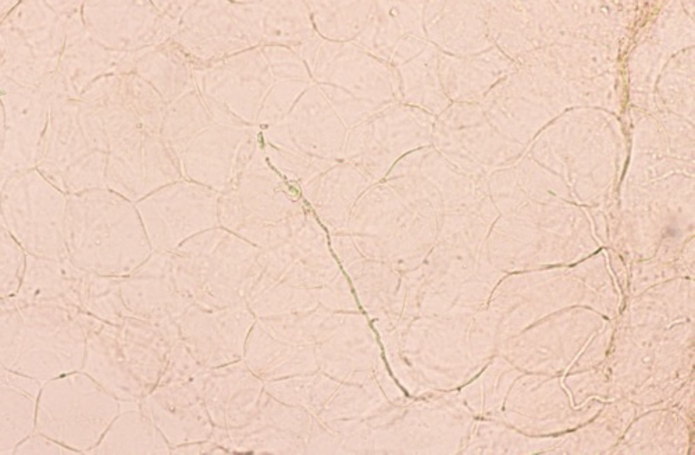

Fungal hyphae

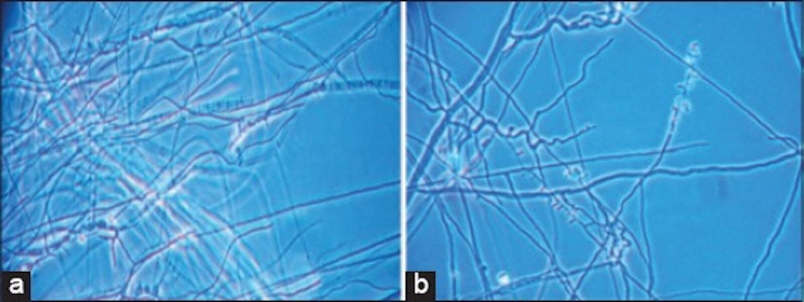

Trichophyton species (dermatophytes)

### Treatment [[1]](https://coursology-qbank.com/amboss/article/Bedza60)[[2]](https://coursology-qbank.com/amboss/article/iTdJq60)

* Start <u>antifungal</u> therapy.

* Optimize management of any concurrent <u>immunosuppression</u>.

* Reassess after 2–4 weeks to determine response.  [[1]](https://coursology-qbank.com/amboss/article/Bedza60)

* Monitor patients on systemic therapy for potential adverse effects.

* See specific sections for further information.

> [!WARNING]
> Because <u>dermatophytes</u> are resistant to <u>nystatin</u>, it should not be used for the <u>treatment of dermatophyte infections</u>. [[2]](https://coursology-qbank.com/amboss/article/iTdJq60)[[7]](https://coursology-qbank.com/amboss/article/yJdd9I0)

#### Topical antifungal therapy for dermatophyte infections [[1]](https://coursology-qbank.com/amboss/article/Bedza60)[[2]](https://coursology-qbank.com/amboss/article/iTdJq60)[[8]](https://coursology-qbank.com/amboss/article/kSdm-60)

##### Indications

* <u>Tinea pedis</u>

* <u>Tinea corporis</u>

* <u>Tinea cruris</u>

* <u>Tinea unguium</u> in children

* Adjunct to systemic therapy in <u>tinea capitis</u>

* Alternative to systemic therapy in patients who prefer or require topical treatment

##### Agents

* <u>Azoles</u> (e.g., <u>miconazole</u>;  DOSAGE , <u>clotrimazole</u> DOSAGE) [[1]](https://coursology-qbank.com/amboss/article/Bedza60)

* <u>Tolnaftate</u> DOSAGE [[1]](https://coursology-qbank.com/amboss/article/Bedza60)

* <u>Ciclopirox</u> DOSAGE [[1]](https://coursology-qbank.com/amboss/article/Bedza60)

* <u>Terbinafine</u> DOSAGE [[1]](https://coursology-qbank.com/amboss/article/Bedza60)

> [!TIP]
> For topical therapy, calculate the <u>finger-tip unit</u> to prescribe a quantity sufficient for the treatment duration. [[9]](https://coursology-qbank.com/amboss/article/bG1HBR0)

#### Systemic antifungal therapy for dermatophyte infections [[1]](https://coursology-qbank.com/amboss/article/Bedza60)[[2]](https://coursology-qbank.com/amboss/article/iTdJq60)[[8]](https://coursology-qbank.com/amboss/article/kSdm-60)

##### Indications

* <u>Tinea capitis</u>

* <u>Tinea barbae</u>

* <u>Tinea unguium</u> in adults

* Unsuccessful topical treatment (refractory disease)

* Extensive spread (e.g., in patients with <u>immunodeficiency</u>)

* <u>Majocchi granuloma</u> [[3]](https://coursology-qbank.com/amboss/article/FpdgrI0)

##### Agents

* <u>Terbinafine</u> granules DOSAGEor tablets (<u>off-label</u>) DOSAGE [[1]](https://coursology-qbank.com/amboss/article/Bedza60)[[2]](https://coursology-qbank.com/amboss/article/iTdJq60)

* <u>Griseofulvin</u> suspension (<u>off-label</u>) DOSAGE or tablets (<u>off-label</u>) DOSAGE  [[1]](https://coursology-qbank.com/amboss/article/Bedza60)[[2]](https://coursology-qbank.com/amboss/article/iTdJq60)[[10]](https://coursology-qbank.com/amboss/article/2Q1Tvg0)

* <u>Fluconazole</u> (<u>off-label</u>) DOSAGE [[1]](https://coursology-qbank.com/amboss/article/Bedza60)[[2]](https://coursology-qbank.com/amboss/article/iTdJq60)[[10]](https://coursology-qbank.com/amboss/article/2Q1Tvg0)

> [!WARNING]
> <u>Griseofulvin</u> is <u>teratogenic</u> and associated with a risk of <u>chromosomal abnormalities</u>. It is contraindicated in <u>pregnancy</u>, and both male and female individuals should use <u>contraception</u> for 6 months after stopping <u>griseofulvin</u>. [[10]](https://coursology-qbank.com/amboss/article/2Q1Tvg0)

> [!WARNING]
> Oral <u>ketoconazole</u> is not recommended for treating <u>dermatophyte</u> infections due to the risk of severe side effects, including <u>hepatotoxicity</u> and <u>adrenal insufficiency</u>. [[2]](https://coursology-qbank.com/amboss/article/iTdJq60)

##### Laboratory monitoring [[2]](https://coursology-qbank.com/amboss/article/iTdJq60)

Monitor patients on systemic antifungal therapy for adverse effects, which can be serious and include <u>hepatotoxicity</u>.

* Baseline studies

* Not routinely required before initiating treatment with <u>griseofulvin</u>

* Obtain baseline <u>CBC</u> and <u>liver chemistries</u> before initiating treatment with other systemic <u>antifungals</u>.

* Obtain serum <u>creatinine</u> levels before initiating treatment with <u>fluconazole</u>.

* Serial monitoring

* All patients: Monitor <u>CBC</u> and <u>liver chemistries</u> every 4–8 weeks while on systemic <u>antifungal</u> therapy.

* Patients taking <u>griseofulvin</u>: Monitor serum <u>creatinine</u> levels every 8 weeks.

### <u>Infection control</u> measures [[1]](https://coursology-qbank.com/amboss/article/Bedza60)[[2]](https://coursology-qbank.com/amboss/article/iTdJq60)

Advise all patients on measures to prevent transmission of dermatophyte infections or reinfection. See also relevant sections for measures specific to the site of infection.

* Identify and treat <u>dermatophyte</u> infections in other areas.

* Advise patients not to share items that could spread infection (e.g., shoes, towels, combs, hats).

* Use a separate towel to dry infected areas.

* Examine and treat close household contacts; advise veterinary assessment and treatment of pets.

* <u>Transmission precautions</u> are usually no longer required once patients start treatment.

---

## Subtypes and variants

The clinical presentation, differential diagnoses, and <u>management of dermatophyte infections</u> vary by site of infection.

---

## Tinea capitis

<u>Tinea capitis</u> is a <u>dermatophyte</u> infection of the <u>hair</u> of the scalp. It  mainly occurs in prepubertal children but can affect individuals at any age. [[1]](https://coursology-qbank.com/amboss/article/Bedza60)

### Pathogens [[1]](https://coursology-qbank.com/amboss/article/Bedza60)

* Most commonly caused by T. tonsurans

* <u>Microsporum</u> canis and <u>Microsporum</u> audouinii (<u>zoonotic</u> transmission) account for < 5% of cases in the United States. [[1]](https://coursology-qbank.com/amboss/article/Bedza60)

### Clinical features [[1]](https://coursology-qbank.com/amboss/article/Bedza60)[[2]](https://coursology-qbank.com/amboss/article/iTdJq60)

* Round, pruritic scaly <u>plaques</u> with broken <u>hair shafts</u> (black dot pattern) or loss of <u>hair</u> (gray patch pattern) in affected areas

* Regional <u>lymphadenopathy</u> (postauricular, suboccipital, cervical) may be present.

* Severe manifestations include:

* Kerion: characterized by a deep, boggy <u>plaque</u> with <u>pustules</u>

* Tinea favus: characterized by <u>scarring alopecia</u> and crusting; caused by chronic infection with <u>Trichophyton</u> schoenleinii

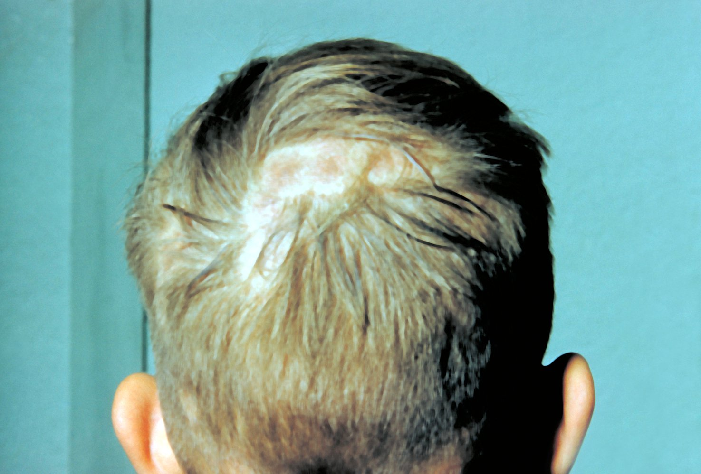

Tinea capitis

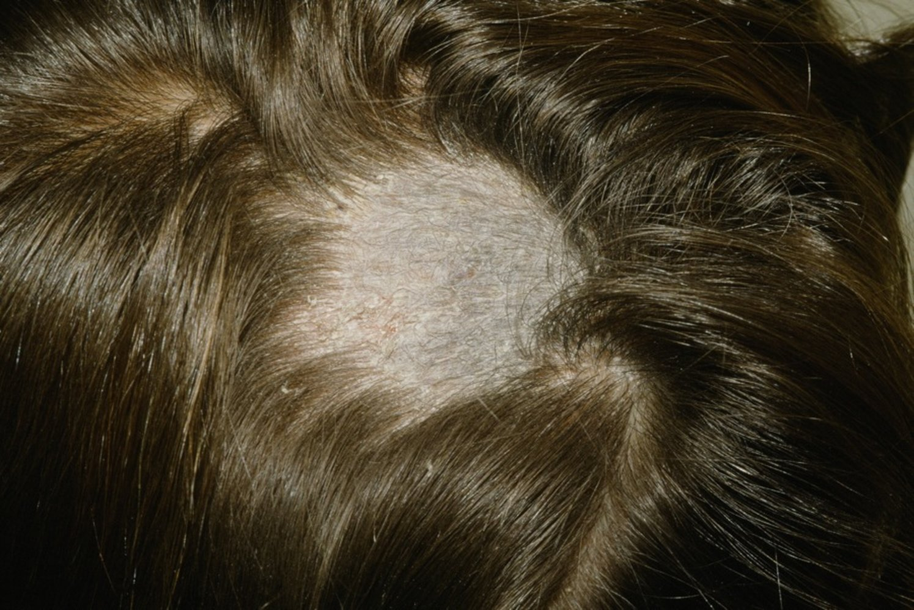

Tinea capitis

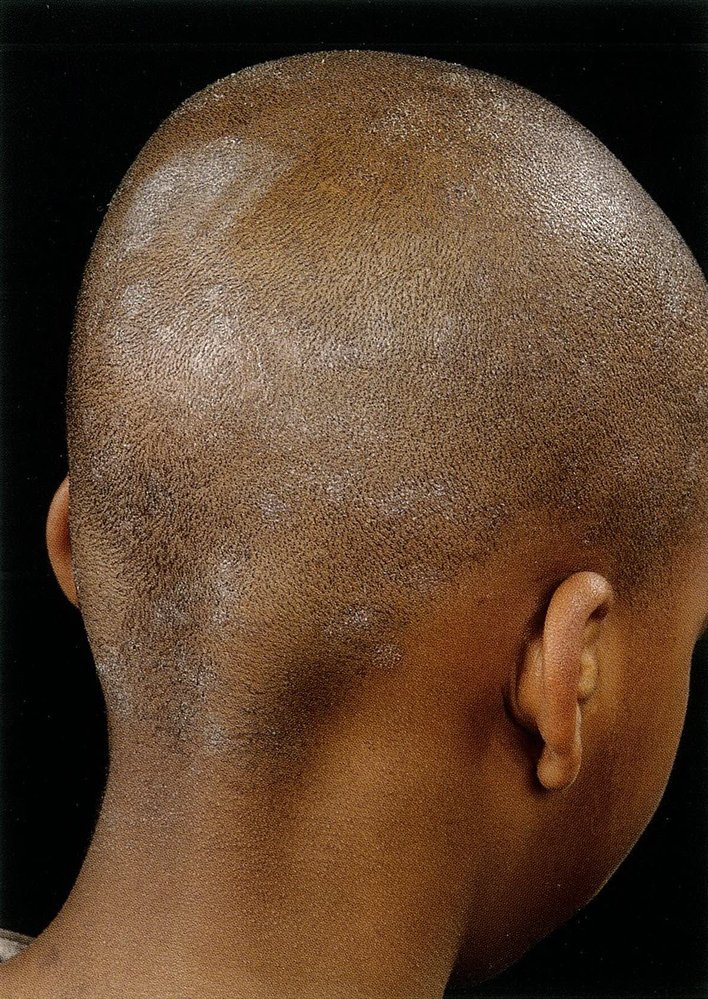

Tinea capitis

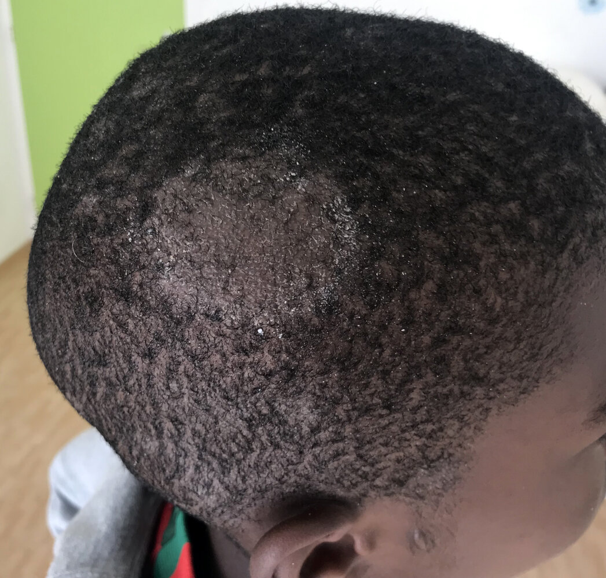

Tinea capitis

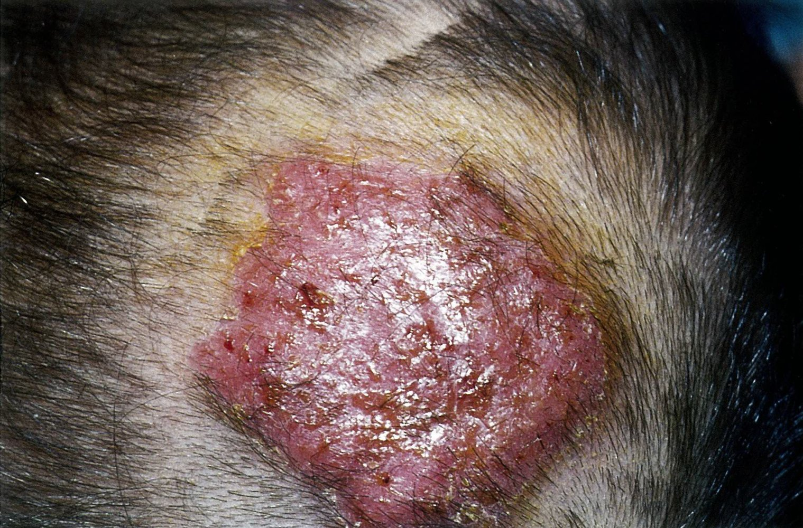

Kerion

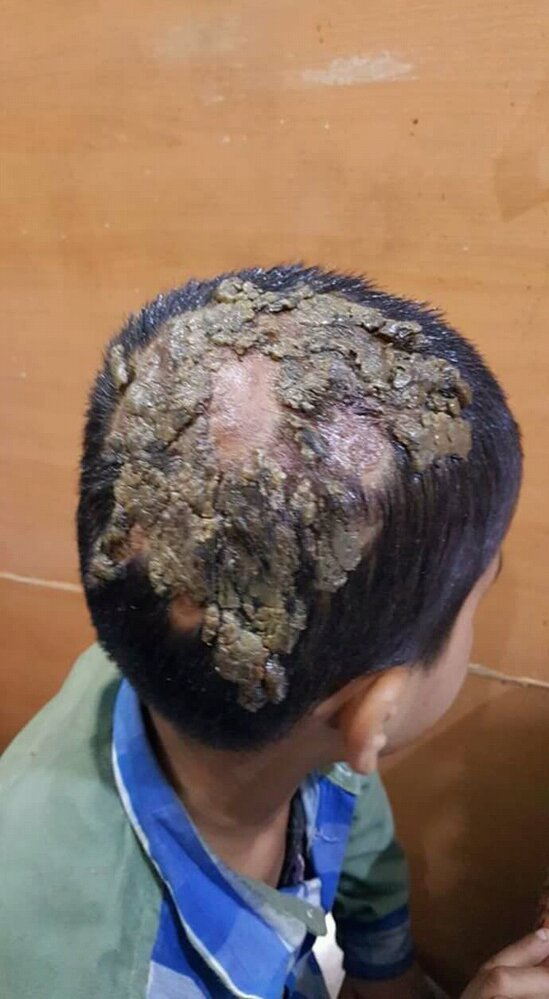

Favus

### Management

#### Diagnosis [[1]](https://coursology-qbank.com/amboss/article/Bedza60)[[2]](https://coursology-qbank.com/amboss/article/iTdJq60)

* Diagnostic tests (e.g., <u>KOH test</u>, fungal culture) are indicated for all patients.

* <u>Dermoscopy</u> can show comma, corkscrew, and zigzag <u>hairs</u>. [[1]](https://coursology-qbank.com/amboss/article/Bedza60)[[11]](https://coursology-qbank.com/amboss/article/NTd-I60)[[12]](https://coursology-qbank.com/amboss/article/_gd5B60)

> [!TIP]
> <u>False-negative</u> rates in fungal cultures of <u>kerion</u> are high; consider sampling any concurrent noninflammatory lesions of <u>tinea capitis</u> to improve <u>sensitivity</u>. [[2]](https://coursology-qbank.com/amboss/article/iTdJq60)[[13]](https://coursology-qbank.com/amboss/article/cJdaGI0)

> [!TIP]
> T. tonsurans does not produce fluorescence under <u>Wood lamp</u>. [[6]](https://coursology-qbank.com/amboss/article/XJd9sI0)[[10]](https://coursology-qbank.com/amboss/article/2Q1Tvg0)

#### Treatment [[1]](https://coursology-qbank.com/amboss/article/Bedza60)[[2]](https://coursology-qbank.com/amboss/article/iTdJq60)[[10]](https://coursology-qbank.com/amboss/article/2Q1Tvg0)

* All patients: Initiate <u>systemic antifungal therapy for dermatophyte infections</u>. 

* Therapy may be initiated empirically while awaiting culture results.

* Treat for ≥ 6 weeks; continue treatment for 2 weeks after symptoms resolve.  [[1]](https://coursology-qbank.com/amboss/article/Bedza60)[[2]](https://coursology-qbank.com/amboss/article/iTdJq60)[[10]](https://coursology-qbank.com/amboss/article/2Q1Tvg0)

* Patients with <u>kerion</u> [[1]](https://coursology-qbank.com/amboss/article/Bedza60)

* Prompt treatment with systemic <u>griseofulvin</u> is recommended. [[2]](https://coursology-qbank.com/amboss/article/iTdJq60)

* Wet compresses can be used to soften and remove crusts.

* Consider <u>antibiotics</u> if secondary bacterial infection is confirmed; see “<u>Antibiotic therapy for skin and soft tissue infections</u>.”

* Some experts suggest systemic <u>corticosteroid</u> therapy for severe cases to minimize the risk of <u>scarring alopecia</u>.

> [!TIP]
> <u>Griseofulvin</u> is preferred for patients with <u>tinea capitis</u> due to <u>Microsporum</u> spp. infection and those with <u>kerion</u>. When available, <u>terbinafine</u> is preferred for the treatment of <u>tinea capitis</u> due to <u>Trichophyton</u> spp. [[2]](https://coursology-qbank.com/amboss/article/iTdJq60)[[10]](https://coursology-qbank.com/amboss/article/2Q1Tvg0)

#### Prevention of transmission [[1]](https://coursology-qbank.com/amboss/article/Bedza60)[[2]](https://coursology-qbank.com/amboss/article/iTdJq60)[[10]](https://coursology-qbank.com/amboss/article/2Q1Tvg0)

* Prescribe topical <u>antifungal</u> shampoo (e.g., <u>selenium</u> sulfide or <u>ketoconazole</u> ) for:

* Infected individuals: as adjunctive therapy for 2 weeks to reduce transmission [[1]](https://coursology-qbank.com/amboss/article/Bedza60)[[2]](https://coursology-qbank.com/amboss/article/iTdJq60)

* Asymptomatic close contacts: 2–4 weeks to prevent infection  [[2]](https://coursology-qbank.com/amboss/article/iTdJq60)[[10]](https://coursology-qbank.com/amboss/article/2Q1Tvg0)

* <u>Disinfect</u> or replace items that have been in contact with the patient's head.

* Recommend evaluation and treatment of any pets.

* See also “<u>Infection control measures for dermatophyte infections</u>.”

> [!TIP]
> Children receiving treatment do not need to be removed from school or daycare. [[1]](https://coursology-qbank.com/amboss/article/Bedza60)

### Differential diagnoses [[1]](https://coursology-qbank.com/amboss/article/Bedza60)[[2]](https://coursology-qbank.com/amboss/article/iTdJq60)

* Dermatitides (e.g., <u>seborrheic dermatitis</u>, <u>atopic dermatitis</u>, <u>contact dermatitis</u>)

* <u>Alopecia areata</u>

* <u>Trichotillomania</u>

* <u>Lice infestation</u>

* <u>Discoid lupus</u>

* See also “<u>Differential diagnoses of dermatophyte infections</u>.”

> [!TIP]
> Broken <u>hair shafts</u> within a scaly lesion and associated <u>posterior cervical lymphadenopathy</u> are characteristic features of <u>tinea capitis</u> and can help distinguish it from common differential diagnoses. [[1]](https://coursology-qbank.com/amboss/article/Bedza60)[[2]](https://coursology-qbank.com/amboss/article/iTdJq60)

### Prognosis

* <u>Hair</u> usually regrows completely.

* Protracted infection and <u>kerion</u> may result in permanent <u>scarring alopecia</u>. [[1]](https://coursology-qbank.com/amboss/article/Bedza60)

---

## Tinea barbae

<u>Tinea barbae</u> is a rare <u>dermatophyte</u> infection affecting the <u>hair</u> of the beard. Individuals working with animals are at increased risk. [[14]](https://coursology-qbank.com/amboss/article/0Sdey60)[[15]](https://coursology-qbank.com/amboss/article/lPWvUl0)[[16]](https://coursology-qbank.com/amboss/article/ZSdZy60)

### Pathogens [[14]](https://coursology-qbank.com/amboss/article/0Sdey60)[[15]](https://coursology-qbank.com/amboss/article/lPWvUl0)[[16]](https://coursology-qbank.com/amboss/article/ZSdZy60)

* Most commonly <u>T. verrucosum</u> and T. mentagrophytes (<u>zoonotic</u> transmission)

* Less commonly, <u>T. rubrum</u> causes <u>tinea barbae</u>.

### Clinical features [[15]](https://coursology-qbank.com/amboss/article/lPWvUl0)

* <u>Erythematous</u> <u>papules</u>, patches, and <u>pustules</u>, and crusting around the <u>hair</u> (<u>kerion</u>-like <u>plaques</u>)

* Loss of <u>hair</u> within the lesions

* <u>Lymphadenopathy</u> may be present if there is long-standing or secondary infection.

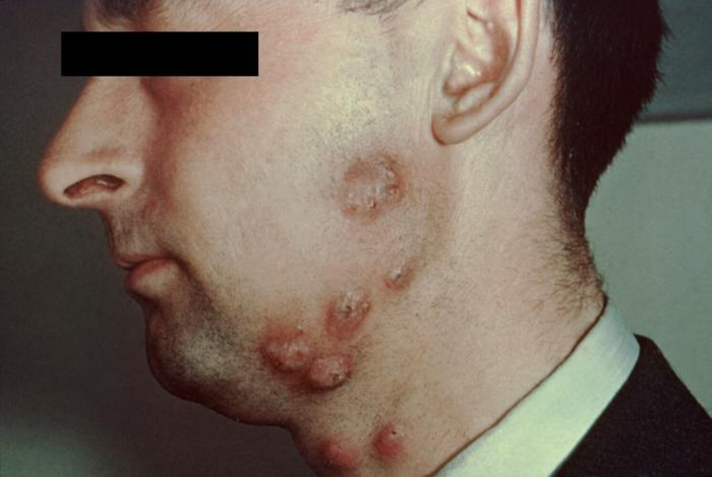

Tinea barbae

### Management

* Diagnosis: Confirmatory studies and/or <u>dermatoscopy</u> are recommended.  [[16]](https://coursology-qbank.com/amboss/article/ZSdZy60)

* Treatment: systemic <u>antifungal</u> therapy; same as for <u>tinea capitis</u> [[15]](https://coursology-qbank.com/amboss/article/lPWvUl0)

* See also “<u>Management of dermatophyte infections</u>.”

### Differential diagnoses [[15]](https://coursology-qbank.com/amboss/article/lPWvUl0)

* Bacterial <u>folliculitis</u>

* <u>Perioral dermatitis</u>

* <u>Pseudofolliculitis barbae</u>

* <u>Contact dermatitis</u>

* <u>Herpes simplex</u>

* <u>Acne vulgaris</u>

* <u>Rosacea</u>

* See also “<u>Differential diagnoses of dermatophyte infections</u>.”

---

## Tinea corporis

<u>Tinea corporis</u> is a <u>dermatophyte</u> infection of the <u>skin</u> of the face, torso, and limbs (excluding hands and feet).

### Pathogens [[1]](https://coursology-qbank.com/amboss/article/Bedza60)[[17]](https://coursology-qbank.com/amboss/article/updprI0)

* Most commonly caused by <u>T. rubrum</u>

* More recently, the number of infections caused by T. indotineae is increasing.

### Clinical features [[1]](https://coursology-qbank.com/amboss/article/Bedza60)

* Round, pruritic, initially <u>erythematous</u> <u>plaque</u>(s)

* Develops into a round pruritic <u>plaque</u> with central clearing and a <u>scaling</u>, raised border (<u>ringworm</u> appearance)

Tinea corporis

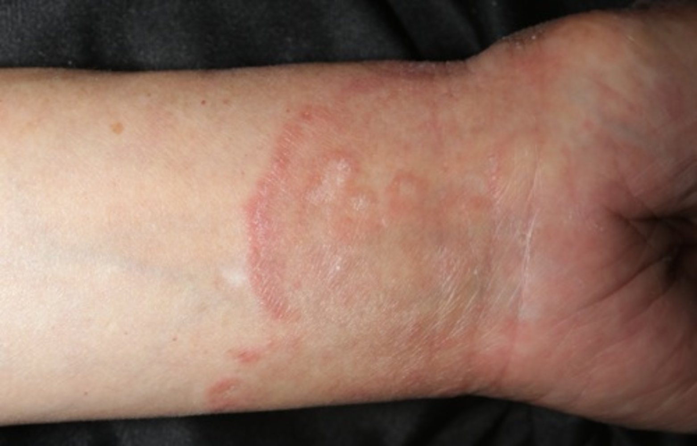

Tinea corporis

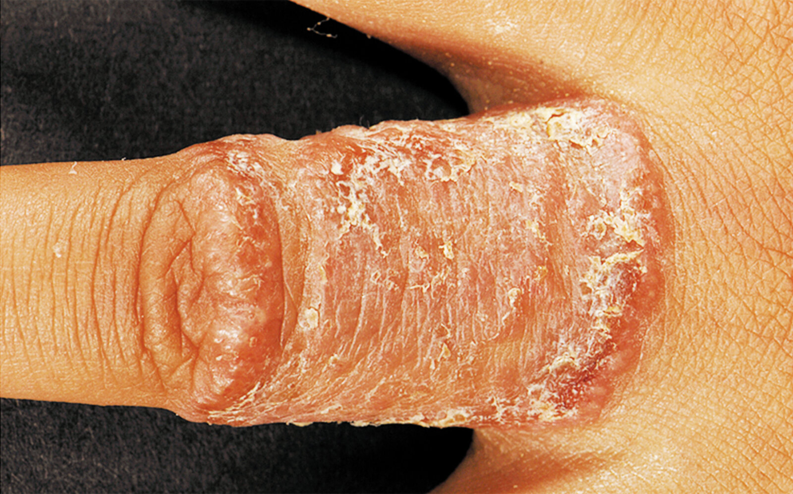

Tinea corporis

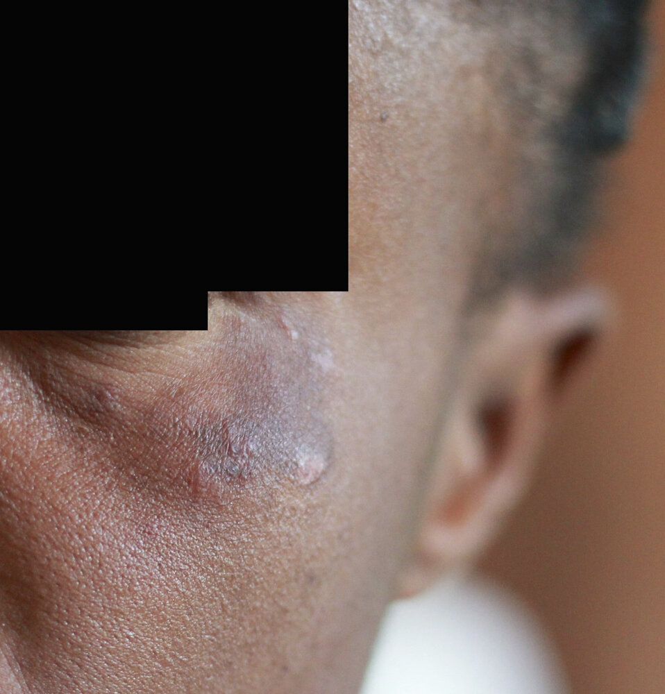

Tinea corporis

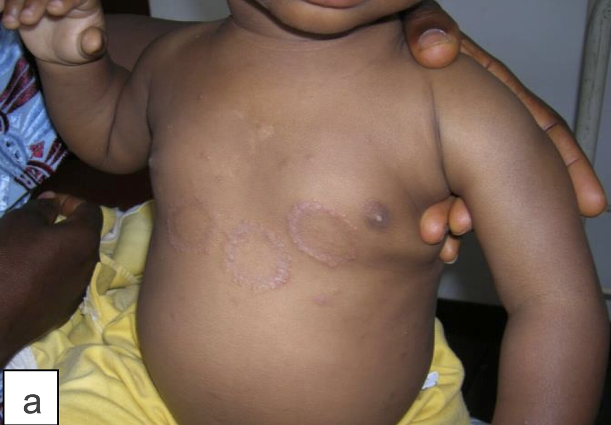

Tinea corporis

### Management [[1]](https://coursology-qbank.com/amboss/article/Bedza60)[[2]](https://coursology-qbank.com/amboss/article/iTdJq60)

* Diagnosis is usually clinical.

* Treatment

* Mild and moderate infections

* Start <u>topical antifungal therapy for dermatophyte infections</u>.

* Continue therapy for 2–4 weeks after symptoms resolve.  [[1]](https://coursology-qbank.com/amboss/article/Bedza60)

* Refractory and/or severe infections

* Start <u>systemic antifungal therapy for dermatophyte infections</u>.

* Continue therapy for 1–3 months [[18]](https://coursology-qbank.com/amboss/article/Wk1P5S0)

* See also “<u>Management of dermatophyte infections</u>” for details;  on <u>infection control</u> measures, monitoring, and follow-up.

> [!WARNING]
> Do not use combination <u>antifungal</u> and <u>topical steroid</u> creams because combination creams are less effective and can lead to <u>Majocchi granuloma</u>. [[1]](https://coursology-qbank.com/amboss/article/Bedza60)

### Differential diagnoses [[1]](https://coursology-qbank.com/amboss/article/Bedza60)[[2]](https://coursology-qbank.com/amboss/article/iTdJq60)

See “<u>Differential diagnoses of dermatophyte infections</u>.”

---

## Tinea cruris

<u>Tinea cruris</u> (<u>jock itch</u>) is a <u>dermatophyte</u> infection of the inguinal, genital, and/or perianal area.

### Etiology [[1]](https://coursology-qbank.com/amboss/article/Bedza60)

* Pathogens: most commonly <u>T. rubrum</u>, T. mentagrophytes, and <u>Epidermophyton</u> floccosum

* <u>Risk factors</u> include:

* Male sex

* <u>Obesity</u>

* Tight-fitting clothes

* Noncotton underwear

* <u>Tinea pedis</u> or <u>tinea unguium</u>

* See also “<u>Risk factors common to all dermatophyte infections</u>.”

### Clinical features [[1]](https://coursology-qbank.com/amboss/article/Bedza60)

* Pruritic <u>erythematous</u> or <u>hyperpigmented</u> <u>plaques</u> that spread <u>centrifugally</u>

* Similar to <u>tinea corporis</u> but often without central clearing

* <u>Scaling</u>, raised border

* Spares the <u>scrotum</u>  [[1]](https://coursology-qbank.com/amboss/article/Bedza60)[[2]](https://coursology-qbank.com/amboss/article/iTdJq60)

### Management [[1]](https://coursology-qbank.com/amboss/article/Bedza60)

* Diagnosis is usually clinical.

* Treatment is the same as for <u>tinea corporis</u>.

* Measures to prevent reinfection

* Concurrent treatment of <u>tinea pedis</u> and <u>tinea unguium</u>

* Wearing loose-fitting clothing

* Measures to prevent spread of infection

* To others: Avoid sharing of towels.

* <u>Autoinoculation</u>: Advise patients to dry the groin area before the feet.

* See also “<u>Management of dermatophyte infections</u>.”

### Differential diagnoses [[1]](https://coursology-qbank.com/amboss/article/Bedza60)[[2]](https://coursology-qbank.com/amboss/article/iTdJq60)

See “<u>Differential diagnoses of dermatophyte infections</u>.”

---

## Tinea pedis

<u>Tinea pedis</u> (athelete's foot) is a <u>dermatophyte</u> infection of the foot and is the most common type of <u>dermatophyte</u> infection. [[1]](https://coursology-qbank.com/amboss/article/Bedza60)[[19]](https://coursology-qbank.com/amboss/article/RbbltH)

### Etiology

* Pathogens: most commonly <u>T. rubrum</u>, T. mentagrophytes, T. interdigitale, and E. floccosum [[1]](https://coursology-qbank.com/amboss/article/Bedza60)[[17]](https://coursology-qbank.com/amboss/article/updprI0)

* <u>Risk factors</u> [[1]](https://coursology-qbank.com/amboss/article/Bedza60)

* Occlusive, tight footwear

* Use of public showers, swimming pools, and locker areas

* See also “<u>Risk factors common to all dermatophyte infections</u>.”

### Clinical features [[1]](https://coursology-qbank.com/amboss/article/Bedza60)

* Interdigital (most common): chronic, pruritic, <u>erythematous</u> <u>scaling</u> and <u>erosions</u> between the toes and/or fingers

* Moccasin: confluent <u>hyperkeratotic</u> thickening of the <u>skin</u> on soles of feet

* <u>Vesicular</u>: pruritic or painful <u>vesicular lesions</u> and <u>erythema</u>, often on the <u>medial</u> foot

* May be accompanied by <u>tinea unguium</u>, <u>tinea manuum</u>, or <u>tinea cruris</u>

* May be complicated by secondary bacterial <u>superinfection</u> (e.g., <u>erysipelas</u>)

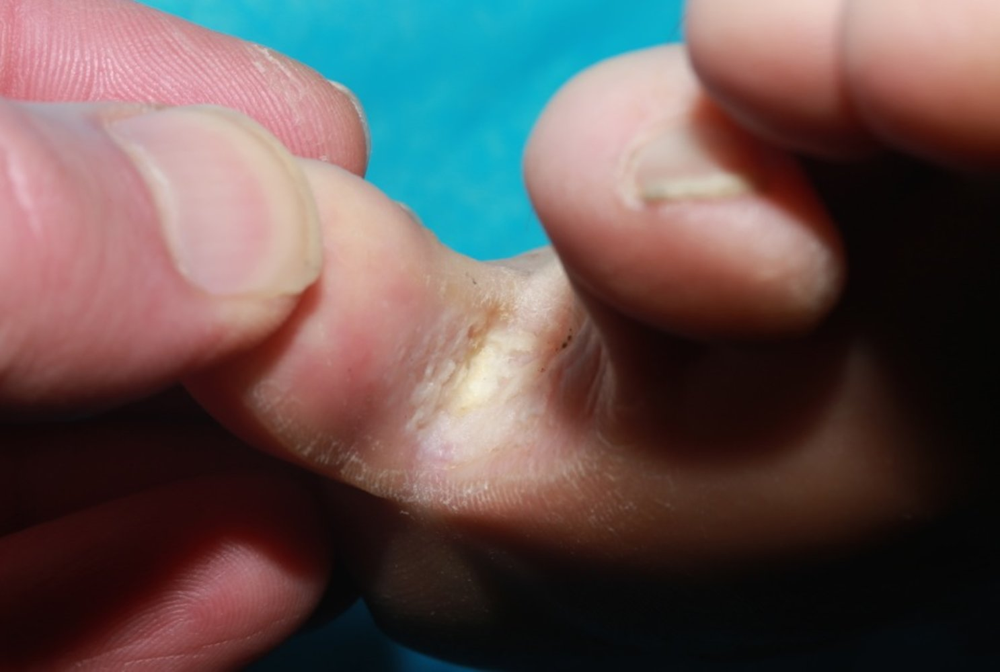

Interdigital tinea pedis

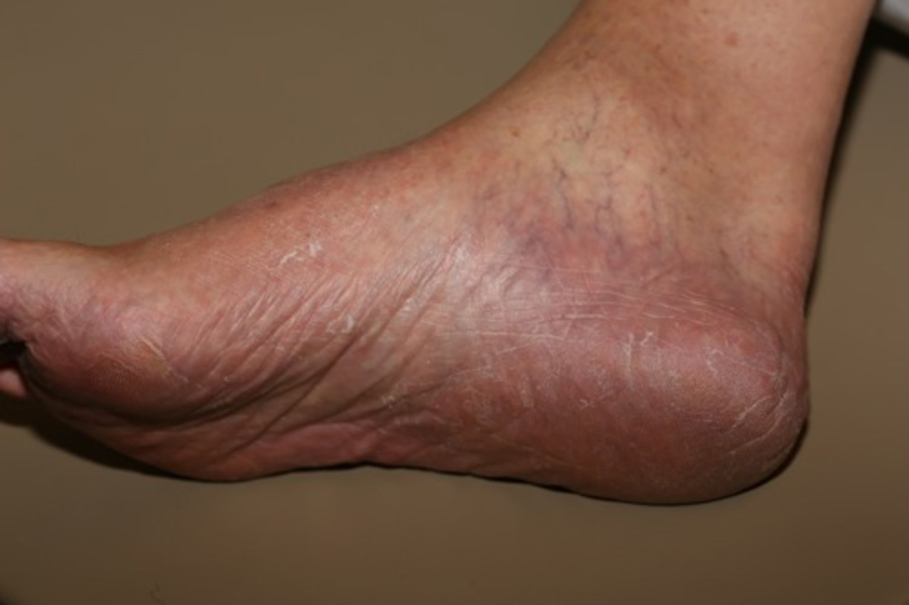

Tinea pedis

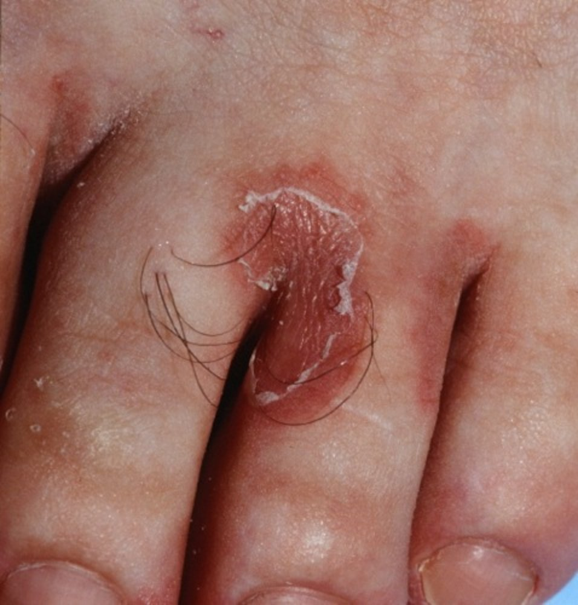

Tinea pedis

Tinea pedis (athlete's foot)

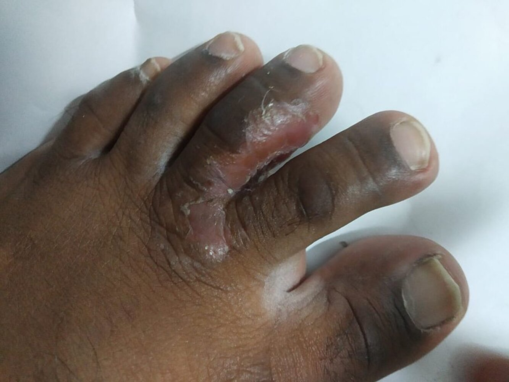

Tinea pedis

### Management [[1]](https://coursology-qbank.com/amboss/article/Bedza60)[[2]](https://coursology-qbank.com/amboss/article/iTdJq60)

* Diagnosis is usually clinical.

* Treatment [[1]](https://coursology-qbank.com/amboss/article/Bedza60)[[2]](https://coursology-qbank.com/amboss/article/iTdJq60)

* Mild infection: Start <u>topical antifungal therapy for dermatophyte infections</u>.

* Severe or refractory infection: Start <u>systemic antifungal therapy for dermatophyte infections</u>.

* Duration: 2 weeks for mild infections; longer for severe infections [[1]](https://coursology-qbank.com/amboss/article/Bedza60)

* Advise patients to avoid swimming pools, locker rooms, and showers until treatment has been completed.

* Prevention of reinfection: Advise patients on the following measures. [[1]](https://coursology-qbank.com/amboss/article/Bedza60)

* Drying between each toe

* Foot powders and <u>antifungal</u> treatment of shoes

* Open shoes in warm, humid weather

* Breathable socks

* Footwear for public showers, locker rooms, and swimming pools

* See also “<u>Management of dermatophyte infections</u>.”

### Differential diagnoses [[1]](https://coursology-qbank.com/amboss/article/Bedza60)[[2]](https://coursology-qbank.com/amboss/article/iTdJq60)

* See “<u>Differential diagnoses of dermatophyte infections</u>.”

* Additional conditions to consider for patients with <u>tinea pedis</u> include:

* <u>Dyshidrotic eczema</u>

* Juvenile <u>plantar</u> dermatosis

* Palmoplantar keratoderma

---

## Tinea unguium

<u>Tinea unguium</u> is a <u>dermatophyte</u> infection of the <u>nail</u> and is the most common cause of <u>onychomycosis</u>.

### Etiology

* Most commonly <u>T. rubrum</u>, T. mentagrophytes, and E. floccosum [[1]](https://coursology-qbank.com/amboss/article/Bedza60)[[22]](https://coursology-qbank.com/amboss/article/3i1Srg0)

* <u>Risk factors</u> [[1]](https://coursology-qbank.com/amboss/article/Bedza60)[[8]](https://coursology-qbank.com/amboss/article/kSdm-60)

* Age > 60 years

* Repeated <u>nail</u> injury

* Chronic use of tobacco

* <u>Peripheral vascular disease</u>

* See also “<u>Risk factors common to all dermatophyte infections</u>”

### Clinical features [[1]](https://coursology-qbank.com/amboss/article/Bedza60)[[8]](https://coursology-qbank.com/amboss/article/kSdm-60)

* Discolored (white, gray, or yellow), thickened, distorted, and <u>brittle nails</u>

* Left untreated, <u>nail</u> structure may be completely lost. [[22]](https://coursology-qbank.com/amboss/article/3i1Srg0)

* May be associated with <u>tinea pedis</u> and/or <u>tinea manuum</u>

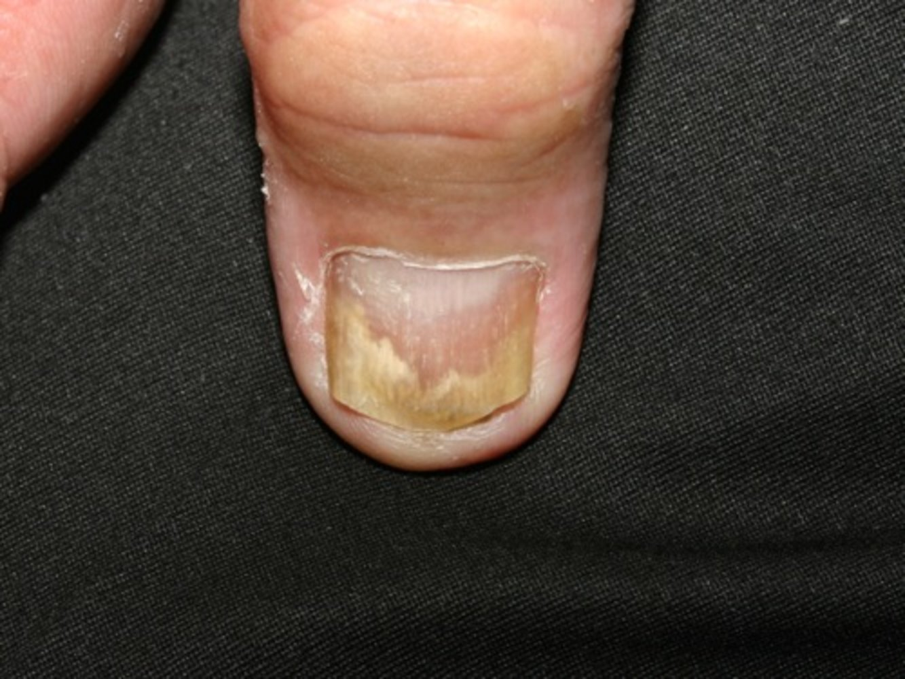

Onychomycosis

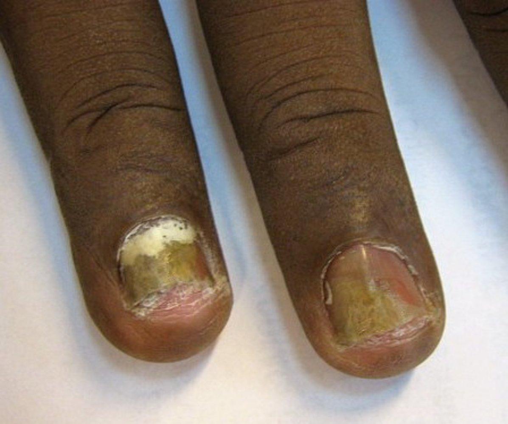

Onychomycosis

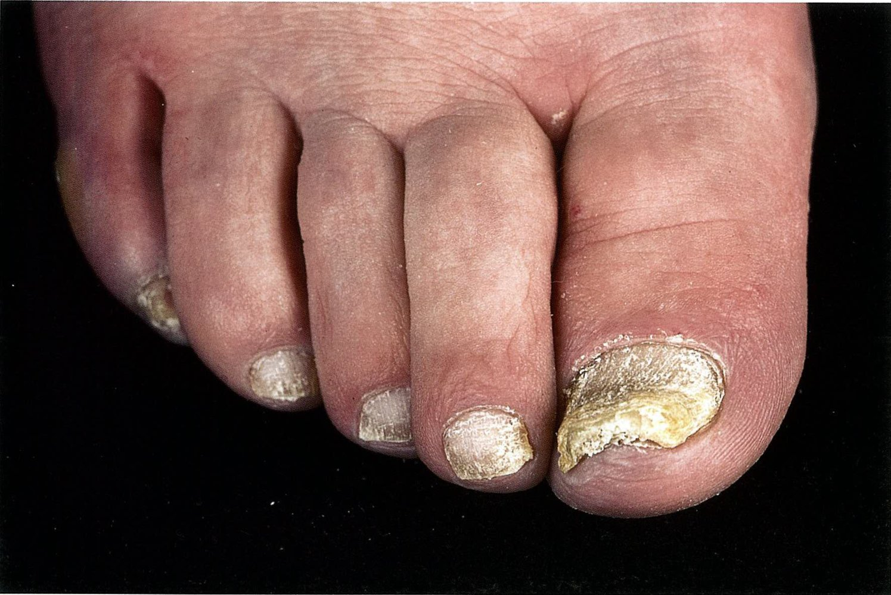

Tinea unguium

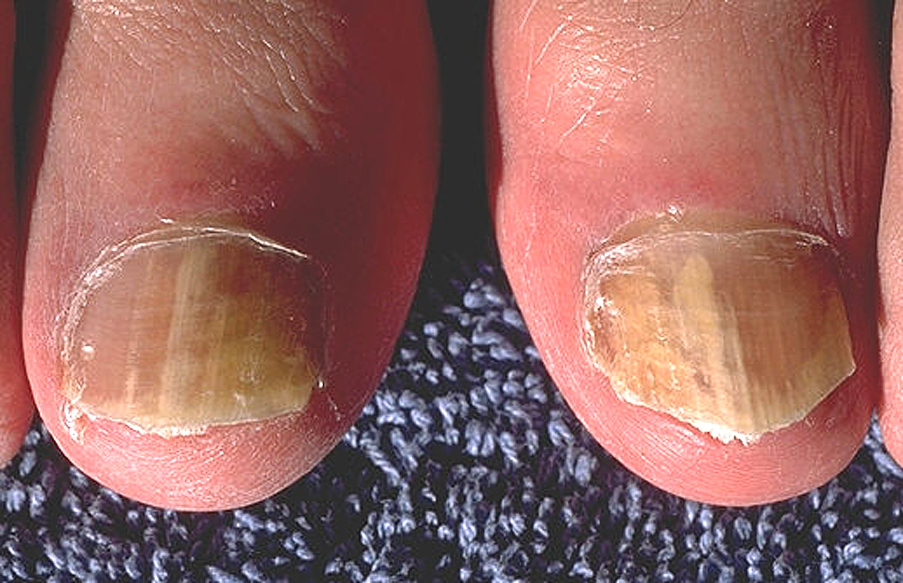

Tinea unguium (onychomycosis) of both big toe nails

### Diagnosis [[1]](https://coursology-qbank.com/amboss/article/Bedza60)[[8]](https://coursology-qbank.com/amboss/article/kSdm-60)

* Diagnostic confirmation is recommended before initiating treatment.

* Any or all of the following studies can be used to confirm the diagnosis.

* <u>KOH test</u>

* Fungal culture with or without <u>PAS</u> staining

* <u>NAAT</u> of <u>nail</u> <u>clippings</u> or subungual debris

### Treatment [[1]](https://coursology-qbank.com/amboss/article/Bedza60)[[8]](https://coursology-qbank.com/amboss/article/kSdm-60)

* <u>Tinea unguium</u> may be treated with systemic and/or topical therapy.

* Treatment <u>efficacy</u> may be improved by:

* Frequent <u>nail</u> <u>trimming</u> and <u>debridement</u> [[1]](https://coursology-qbank.com/amboss/article/Bedza60)[[8]](https://coursology-qbank.com/amboss/article/kSdm-60)

* Combining topical treatment with laser therapy  [[8]](https://coursology-qbank.com/amboss/article/kSdm-60)

* Toenail removal is recommended for refractory or severe infection. [[8]](https://coursology-qbank.com/amboss/article/kSdm-60)

#### Topical therapy

* Indications [[1]](https://coursology-qbank.com/amboss/article/Bedza60)[[8]](https://coursology-qbank.com/amboss/article/kSdm-60)

* Pediatric patients

* Infections that do not involve the <u>nail</u> matrix

* Prophylaxis against recurrence

* Options

* Efinaconazole DOSAGE [[1]](https://coursology-qbank.com/amboss/article/Bedza60)[[8]](https://coursology-qbank.com/amboss/article/kSdm-60)

* Tavaborole DOSAGE [[1]](https://coursology-qbank.com/amboss/article/Bedza60)[[8]](https://coursology-qbank.com/amboss/article/kSdm-60)

* <u>Ciclopirox</u> lacquer DOSAGE [[1]](https://coursology-qbank.com/amboss/article/Bedza60)[[8]](https://coursology-qbank.com/amboss/article/kSdm-60)

* Duration of therapy: 24 weeks for fingernails; 48 weeks for toenails [[8]](https://coursology-qbank.com/amboss/article/kSdm-60)

#### Systemic therapy

Obtain baseline <u>laboratory studies</u> before initiating treatment and monitor patients for adverse effects. See “<u>Monitoring patients taking systemic antifungal therapy</u>.”

* Most effective agents

* <u>Terbinafine</u> tablets (<u>off-label</u> in children) DOSAGE [[1]](https://coursology-qbank.com/amboss/article/Bedza60)[[8]](https://coursology-qbank.com/amboss/article/kSdm-60)

* <u>Itraconazole</u> (<u>off-label</u> in children)

* Toenail infections DOSAGE (continuous dosing) [[1]](https://coursology-qbank.com/amboss/article/Bedza60)[[8]](https://coursology-qbank.com/amboss/article/kSdm-60)[[23]](https://coursology-qbank.com/amboss/article/tTdXs60)[[24]](https://coursology-qbank.com/amboss/article/BJdzwI0)

* Fingernail infections DOSAGE (pulsed dosing) [[1]](https://coursology-qbank.com/amboss/article/Bedza60)[[8]](https://coursology-qbank.com/amboss/article/kSdm-60)[[23]](https://coursology-qbank.com/amboss/article/tTdXs60)[[24]](https://coursology-qbank.com/amboss/article/BJdzwI0)

* Duration of therapy

* Until the entire <u>nail</u> grows out

* Typically 6 weeks for fingernails and 12 weeks for toenails [[1]](https://coursology-qbank.com/amboss/article/Bedza60)[[8]](https://coursology-qbank.com/amboss/article/kSdm-60)

> [!TIP]
> Systemic <u>antifungal</u> therapy is more effective than topical therapy but requires monitoring for potential adverse effects.

#### Prevention of reinfection [[1]](https://coursology-qbank.com/amboss/article/Bedza60)[[8]](https://coursology-qbank.com/amboss/article/kSdm-60)

* Disinfecting shoes and socks

* Keeping toenails short and feet cool and dry

* Early treatment of <u>tinea pedis</u>

* Consider prophylactic treatment with a topical <u>antifungal</u> twice a week for recurrent infections.

* See also “<u>Infection control measures for dermatophyte infections</u>.”

### Differential diagnoses [[2]](https://coursology-qbank.com/amboss/article/iTdJq60)[[8]](https://coursology-qbank.com/amboss/article/kSdm-60)

* Recurrent <u>nail</u> trauma

* <u>Paronychia</u>

* <u>Herpetic whitlow</u>

* Noninfective <u>onycholysis</u>

* <u>Psoriasis</u>

* <u>Lichen planus</u>

---