# Hypersensitivity reactions

*Categories: Clinical knowledge > Emergency medicine > Dermatologic disorders > Hypersensitivity reactions*

[Original Article Link](https://coursology-qbank.com/amboss/article/ek0x5T)

---

## Summary

A hypersensitivity reaction (HSR) is an exaggerated and/or pathological <u>immune response</u> to <u>exogenous</u> or <u>endogenous</u> substances. HSRs are commonly classified into four types. <u>Type I HSRs</u> (e.g., food and pollen <u>allergies</u>, <u>asthma</u>, <u>anaphylaxis</u>) are immediate <u>allergic reactions</u>. <u>Type II HSRs</u> (e.g., <u>autoimmune hemolytic anemia</u>, <u>Goodpasture syndrome</u>) are cytotoxic; tissue-specific <u>antibodies</u> cause destruction of cells in these tissues. <u>Type III HSRs</u> (e.g., many <u>vasculitides</u> and <u>glomerulonephritides</u>) are <u>immune complex</u>-mediated; tissue damage is caused by <u>antigen-antibody complex</u> deposition. <u>Type IV HSRs</u> (e.g., <u>TB</u> <u>skin</u> tests, <u>contact dermatitis</u>) are delayed and cell-mediated and are the only HSRs that involve sensitized <u>T lymphocytes</u> rather than <u>antibodies</u>. In practice, many hypersensitivity syndromes are mixed reactions, meaning that they do not fit into a single reaction type. Nonallergic HSRs (e.g., <u>pseudoallergies</u>) are caused by <u>mast cell</u> activation and <u>histamine</u> release after the first exposure to a trigger substance (e.g., radiocontrast media).

See also “<u>Anaphylaxis</u>,” “<u>Urticaria</u>,” “<u>Angioedema</u>,” and “<u>Drug hypersensitivity reactions</u>.”

---

## Overview

### Definitions

* Hypersensitivity reaction: an exaggerated and/or pathological <u>immune response</u> to foreign or self <u>antigens</u> [[1]](https://coursology-qbank.com/amboss/article/oP10fS0)

* <u>Allergy</u>: an abnormal immunological response to an otherwise harmless environmental stimulus (e.g., food, pollen, animal dander)

* Autoimmune disease: an abnormal immunological response directed against self-<u>antigens</u>

* <u>Drug hypersensitivity reaction</u>: group of adverse drug effects that resemble an <u>allergy</u> (may be allergic or nonallergic) [[2]](https://coursology-qbank.com/amboss/article/KP1UfS0)

### Stages

* <u>Sensitization (immunology)</u>: initial asymptomatic contact with an <u>antigen</u>

* Effect: harmful <u>immune response</u> following subsequent <u>antigen</u> contact

### Classification

* Traditionally categorized into four types based on immunological mechanisms

* Reactions may be heterogeneous (i.e., syndromes do not fit into a single category). [[1]](https://coursology-qbank.com/amboss/article/oP10fS0)[[2]](https://coursology-qbank.com/amboss/article/KP1UfS0)

|  Hypersensitivity classification [[3]](https://coursology-qbank.com/amboss/article/p30Ljf)[[4]](https://coursology-qbank.com/amboss/article/2gYTuo)  |  |  |  |
| --- | --- | --- | --- |
|  |  Summary of pathophysiology  | Examples |  |
|  Type I: immediate    |   * Preformed <u>IgE antibodies</u> coating <u>mast cells</u> and <u>basophils</u> are crosslinked by contact with free <u>antigen</u>.  * Cell <u>degranulation</u> results in the release of <u>histamine</u> and other inflammatory mediators.    |   * Allergic or <u>anaphylactic</u> <u>transfusion reactions</u> (e.g., in patients with <u>IgA</u> deficiency)  [[5]](https://coursology-qbank.com/amboss/article/PXaWyQ)  * <u>Anaphylaxis</u>  * Drug reactions (e.g., <u>penicillin</u>, <u>muscle relaxants</u>)  * <u>Food allergies</u> (e.g., nuts, shellfish, eggs, soy, wheat)  * Insect venom <u>allergies</u> (e.g., bee, wasp)  * Reactions to inhaled or other environmental <u>allergens</u> (e.g., dust <u>mites</u>, animal dander, pollen, latex) → <u>asthma</u>, <u>allergic rhinitis</u>, <u>atopy</u>  [[6]](https://coursology-qbank.com/amboss/article/jXa_BQ)    |  |
|  Type II: cytotoxic    |   * <u>IgM</u> or <u>IgG antibodies</u> bind to <u>antigens</u> on the cells of particular tissue types.  * <u>Complement system</u> activation and lysis or <u>phagocytosis</u> of cells  * <u>Antibody</u>-dependent cell-mediated cytotoxicity (e.g., by <u>natural killer cells</u>)  * <u>Antibody</u> interference with normal cell function    |   * Destruction of cells  * <u>Acute hemolytic transfusion reaction</u>  * <u>Autoimmune hemolytic anemia</u>  * <u>Hemolytic disease of the fetus and newborn</u>  * <u>Immune thrombocytopenia</u> (<u>ITP</u>)  * Drug-induced <u>neutropenia</u> and <u>agranulocytosis</u> (e.g., caused by <u>methimazole</u>, <u>sulfasalazine</u>, <u>trimethoprim/sulfamethoxazole</u>)  * <u>Pernicious anemia</u>  * Inflammation  * <u>Goodpasture syndrome</u>  * <u>Rheumatic fever</u>  * <u>Hyperacute transplant rejection</u>  * Impaired cellular function  * <u>Graves disease</u>  * <u>Bullous pemphigoid</u>  * <u>Pemphigus vulgaris</u>  * <u>Myasthenia gravis</u>    |  |
|  Type III: <u>immune complex</u>    |   * <u>IgG antibodies</u> bind to circulating <u>antigens</u>.  * <u>Immune complex</u> formation and deposition in particular tissues  * Deposits in tissue activate the <u>complement system</u> and attract <u>neutrophils</u>  * Neutrophilic lysis or <u>phagocytosis</u> of cells    |   * <u>Serum sickness</u>  * <u>Serum sickness-like reaction</u> (atypical without circulating immune-complex involvement)  * <u>Arthus reaction</u>  * Drug-induced <u>hypersensitivity vasculitis</u>  * <u>Hypersensitivity pneumonitis</u>  * <u>Polyarteritis nodosa</u> (<u>PAN</u>)  * <u>Poststreptococcal glomerulonephritis</u>  * <u>IgA nephropathy</u>  * <u>Membranous nephropathy</u>  * <u>Systemic lupus erythematosus</u> (<u>SLE</u>)    |  |
|  Type IV: delayed (<u>T-cell</u> mediated)    |   * Contact of <u>antigen</u> with presensitized <u>T lymphocytes</u>  * Presensitized <u>CD4+ T cells</u> recognize <u>antigens</u> on <u>antigen</u>-presenting cells → release of inflammatory <u>cytokines</u> → activation of <u>macrophages</u>  * Presensitized <u>CD8+ T cells</u> recognize <u>antigens</u> on somatic cells → cell-mediated cytotoxicity    |   * Acute and chronic <u>transplant rejection</u>  * <u>Graft-versus-host</u> disease  * <u>Contact dermatitis</u> (e.g., <u>nickel</u>, <u>poison ivy</u>, rubber gloves, cosmetics)  * Mantoux <u>tuberculin skin test</u> for <u>latent tuberculosis</u>  * <u>Candida</u> <u>skin</u> test  * Drug reactions, including:  * <u>Stevens-Johnson syndrome</u>  * <u>Toxic epidermal necrolysis</u>  * <u>Drug reaction with eosinophilia and systemic symptoms</u> (<u>DRESS</u>)  * <u>Multiple sclerosis</u>  * <u>Hashimoto's thyroiditis</u>*  * <u>Rheumatoid arthritis</u>*  * <u>Type 1 diabetes mellitus</u>*    |  * <u>Autoantibodies</u> present   |

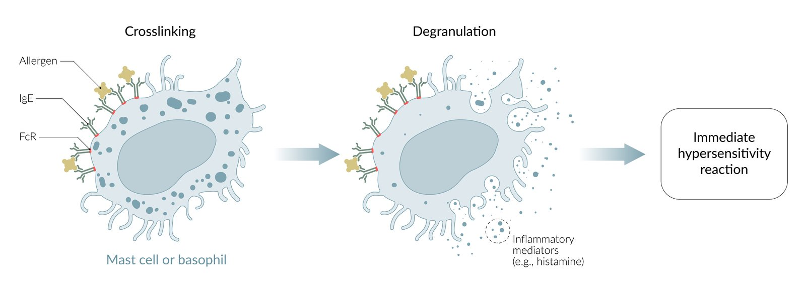

Type I hypersensitivity reaction

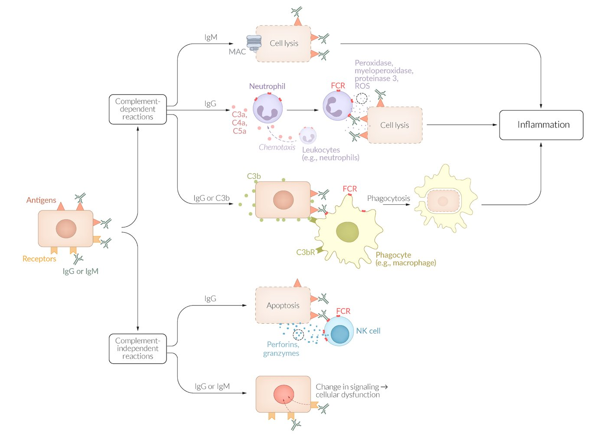

Type II hypersensitivity reaction

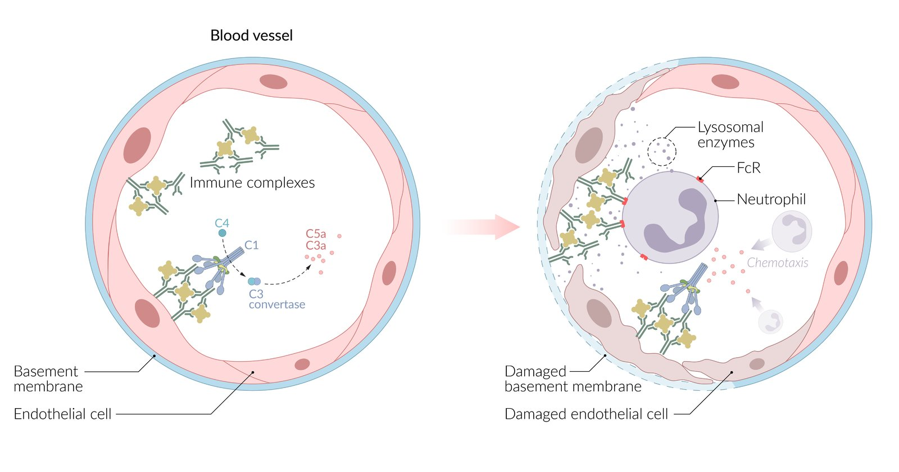

Type III hypersensitivity reaction

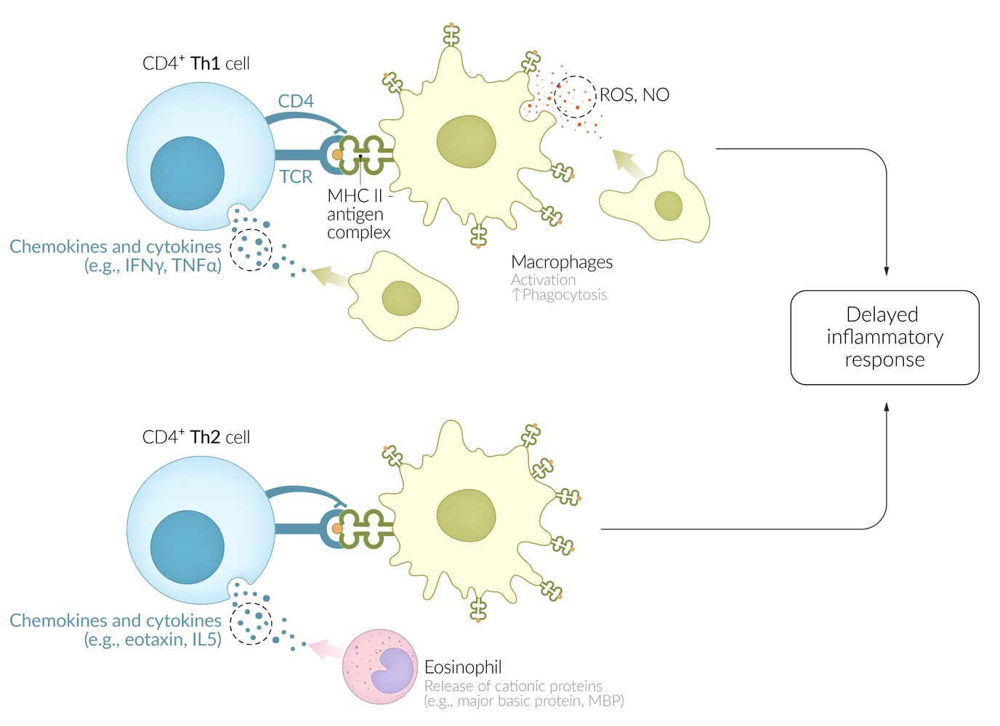

CD4-mediated type IV hypersensitivity reaction

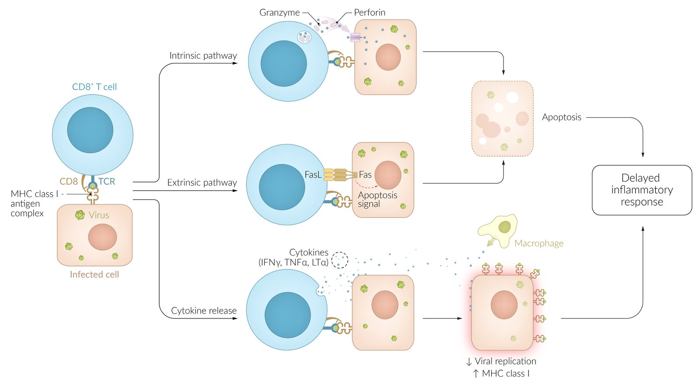

CD8-mediated type IV hypersensitivity reaction

> [!TIP]
> All four types of HSRs can be drug-induced.

> [!TIP]
> Type I and IV HSRs most commonly manifest cutaneously. [[7]](https://coursology-qbank.com/amboss/article/hcYcXL)

> [!NOTE]
> To remember the HSRs, think ACID: A – Allergic/Anaphylactic/Atopic (Type I); C – Cytotoxic (Type II); I – Immune complex deposition (Type III); D – Delayed (Type IV).

---

## Type I hypersensitivity reaction

### Overview

* <u>Type I hypersensitivity reactions</u> are referred to as “immediate reactions.”

* <u>Antibody</u>-mediated; include <u>anaphylactic</u> and <u>atopic</u> <u>immune responses</u>

* See “<u>Hypersensitivity classification</u>” for specific causes of <u>type I hypersensitivity</u>.

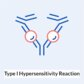

Immediate response: Type I Hypersensitivity Reaction

### Pathophysiology

1. * <u>IgE</u> is formed as a result of prior sensitization (i.e., previous contact with the <u>antigen</u>) and coats <u>mast cells</u> and <u>basophils</u>.
2. * Subsequent encounter with <u>antigen</u> results in an <u>IgE</u>-mediated reaction by preformed <u>IgE antibodies</u>: free <u>antigen</u> binds to two adjacent <u>IgE antibodies</u> (crosslinking) → <u>degranulation</u> of cells
3. * Release of histamine and other mediators (e.g., <u>prostaglandin</u>, <u>platelet-activating factor</u>, <u>leukotrienes</u>, <u>heparin</u>, <u>tryptase</u>), leading to:

* ↑ <u>Smooth muscle</u> contraction → <u>bronchospasm</u>, abdominal cramping

* Peripheral <u>vasodilation</u> and ↑ vascular permeability → <u>hypovolemia</u>, <u>hypotension</u>

* Extravasation of <u>capillary</u> blood → <u>erythema</u>

* Fluid shift into the <u>interstitial space</u> → <u>edema</u>, <u>pulmonary edema</u>

* <u>Pruritus</u>
4. * <u>Mast cell</u> secretion of <u>cytokines</u> and other proinflammatory mediators → <u>eosinophil</u> and <u>neutrophil</u> <u>chemotaxis</u> → late-phase reaction → inflammation and tissue damage

Type I hypersensitivity reaction

> [!NOTE]
> Type I is Fast and Furious.

#### Cross-reactive hypersensitivity [[8]](https://coursology-qbank.com/amboss/article/LnYwFp)[[9]](https://coursology-qbank.com/amboss/article/onY08p)

* Description: Individuals with <u>allergies</u> may also react to substances that contain particles that are similar to the main <u>antigen</u>.

* Examples (primary allergen – cross-reactant <u>allergen</u>)

* Pollen – various foods (e.g., apple, hazelnut, carrot, kiwi, apricots, peaches)

* <u>Mites</u> – crustaceans

* Latex – exotic fruits (e.g., banana, avocado, kiwi)

* Bird dander – egg yolk

* Cat dander – pork

### Timing

* Immediate reaction: <u>allergic reaction</u> within minutes of contact with the <u>antigen</u>

* Late-phase reaction: occurs hours after immediate reaction for a duration of 24–72 hours

### Examples

* <u>Anaphylaxis</u>: <u>pruritus</u>, <u>edema</u>, <u>rash</u>, <u>rhinitis</u>, <u>bronchospasm</u>, and abdominal cramping

* <u>Angioedema</u>: due to <u>mast cell</u> activation in the <u>dermis</u> and/or <u>subcutaneous tissue</u>

* <u>Urticaria</u>: well-circumscribed, raised, pruritic, and <u>erythematous</u> <u>plaques</u> with a round, oval, or <u>serpiginous</u> shape

* Atopy  

* Genetic predisposition to producing <u>IgE antibodies</u> against certain harmless environmental <u>allergens</u> (e.g., pollen, <u>mites</u>, <u>molds</u>, certain foods)

* Associated conditions: <u>asthma</u>, <u>atopic dermatitis</u>, <u>allergic rhinitis</u>, <u>allergic conjunctivitis</u>, <u>food allergies</u>

* <u>Allergic conjunctivitis</u>

* <u>Allergic rhinitis</u>

* Allergic <u>asthma</u>

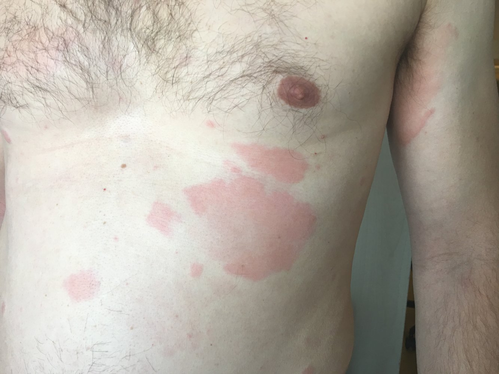

Urticaria

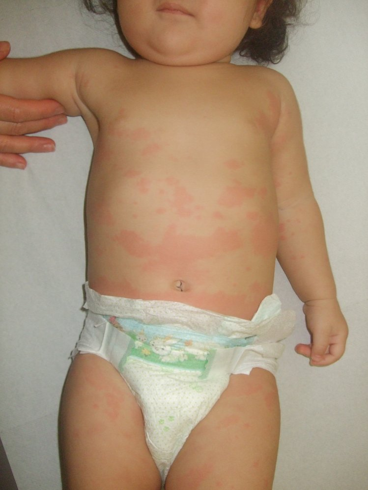

Urticaria

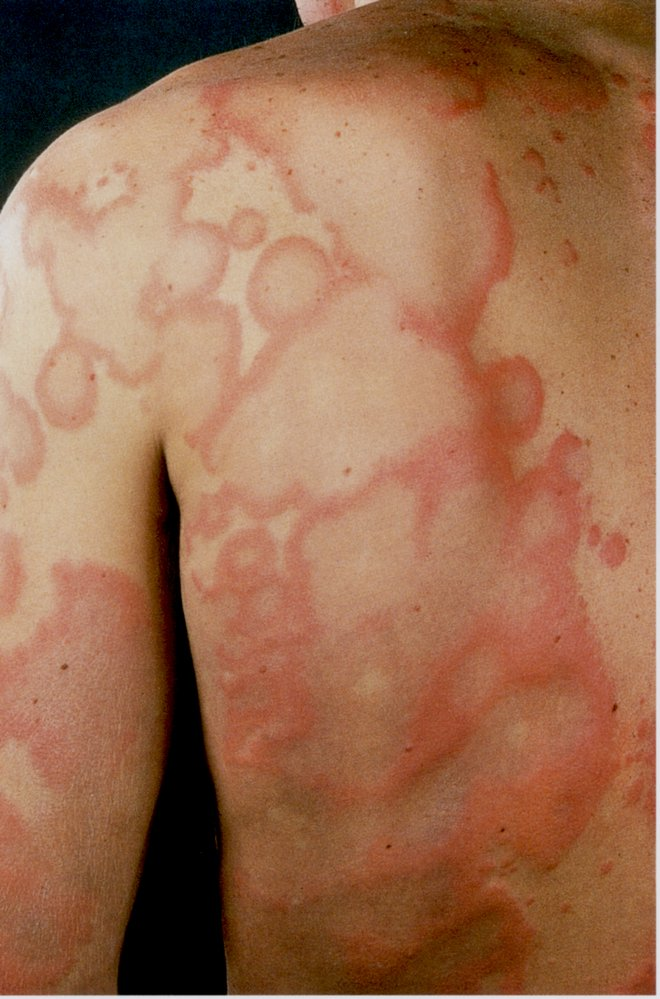

Urticaria

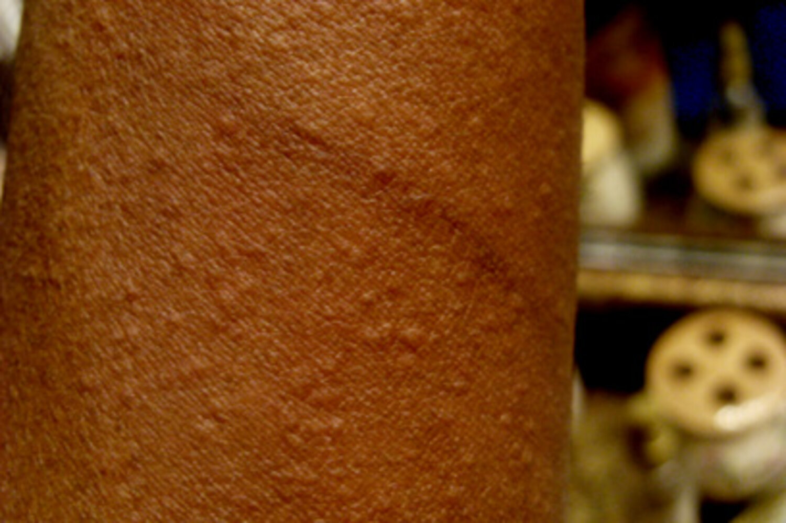

Cholinergic urticaria

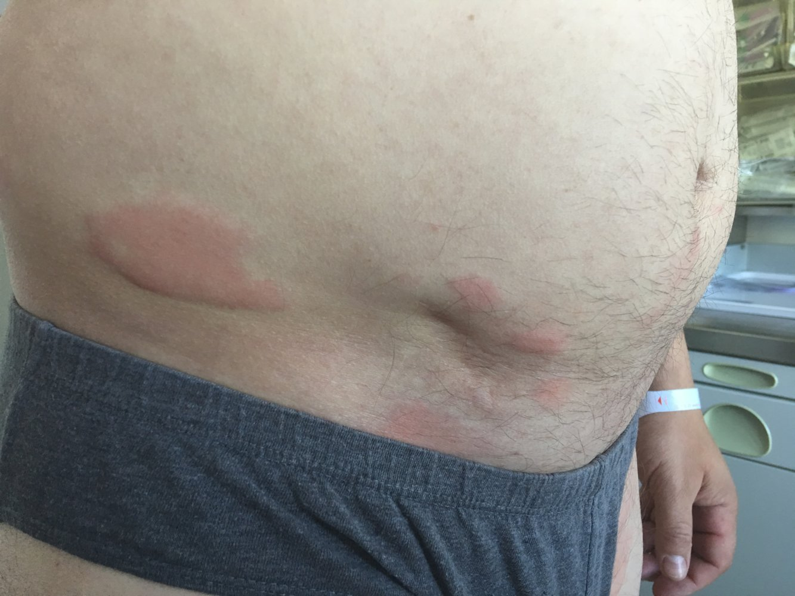

Urticaria (hives)

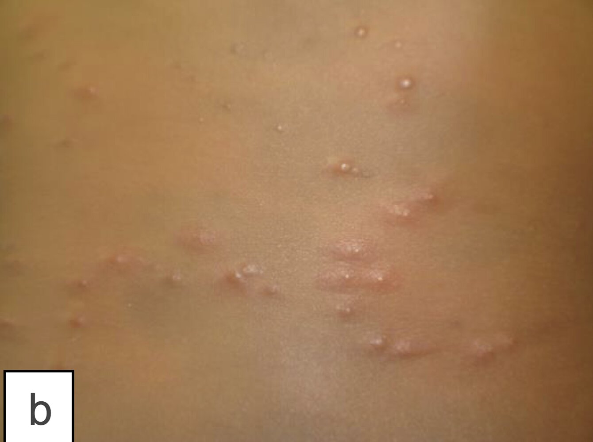

Papular urticaria

Atopy fact sheet

### Diagnostics for type I HSRs [[10]](https://coursology-qbank.com/amboss/article/st0tU3)

<u>Allergy</u>-specific diagnostic testing should only be obtained in patients with a clinical history consistent with a HSR; it is not intended for screening purposes.

#### In vivo allergy skin tests [[11]](https://coursology-qbank.com/amboss/article/T416iS0)

* Approach

* Stop the following medications prior to <u>skin</u> testing: [[11]](https://coursology-qbank.com/amboss/article/T416iS0)

* <u>H1-antihistamines</u> and <u>β-adrenergic</u> drugs: 5-days before testing

* <u>Glucocorticoids</u>: Timing depends on dose and duration of use.

* For <u>drug hypersensitivity reactions</u> (DHRs): Perform 4–6 weeks after both the resolution of initial symptoms and clearance of the suspected drug. [[11]](https://coursology-qbank.com/amboss/article/T416iS0)

* Description

* Small amounts of the following substances introduced into the <u>skin</u>:

* Suspected <u>allergen</u>

* <u>Histamine</u>-containing solution: positive control (always produces <u>wheal</u>)

* Saline: negative control (never produces <u>wheal</u>)

* Reaction should be measured:

* After 15–20 minutes for immediate reactions

* After 24 and 72 hours for nonimmediate reactions  [[12]](https://coursology-qbank.com/amboss/article/5n1iFh0)

* Positive result  [[11]](https://coursology-qbank.com/amboss/article/T416iS0)

* <u>Allergen</u> <u>wheal</u> size ≥ <u>histamine</u> control

* OR diameter of <u>allergen</u> <u>wheal</u> increases by > 3 mm [[11]](https://coursology-qbank.com/amboss/article/T416iS0)

* Modalities

* Skin prick test  

* An <u>allergen</u> solution is applied through a <u>skin</u> prick (e.g., of the <u>volar</u> forearm).

* First-line test for <u>immediate DHRs</u> (safest and easiest) [[2]](https://coursology-qbank.com/amboss/article/KP1UfS0)

* Scratch test 

* An <u>allergen</u> is applied to a scratch (∼ 1 cm) on the <u>skin</u>.

* Comparable to <u>prick test</u>

* Intradermal test

* Intradermal injection of small amounts of the <u>allergen</u>

* Can be used to diagnose immediate and nonimmediate HSRs [[2]](https://coursology-qbank.com/amboss/article/KP1UfS0)[[13]](https://coursology-qbank.com/amboss/article/_P15hS0)

* More sensitive than <u>skin prick test</u>; higher risk of <u>false positives</u> [[11]](https://coursology-qbank.com/amboss/article/T416iS0)

* May lead to <u>anaphylaxis</u> in <u>IgE</u>-mediated HSRs [[11]](https://coursology-qbank.com/amboss/article/T416iS0)

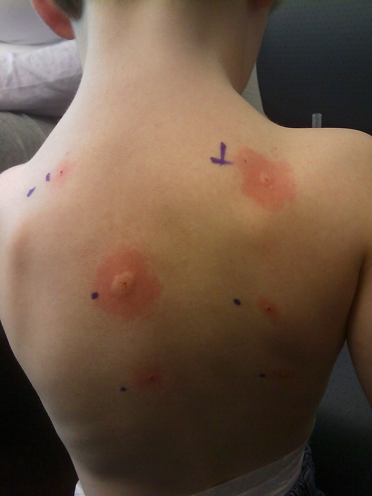

Positive skin prick test

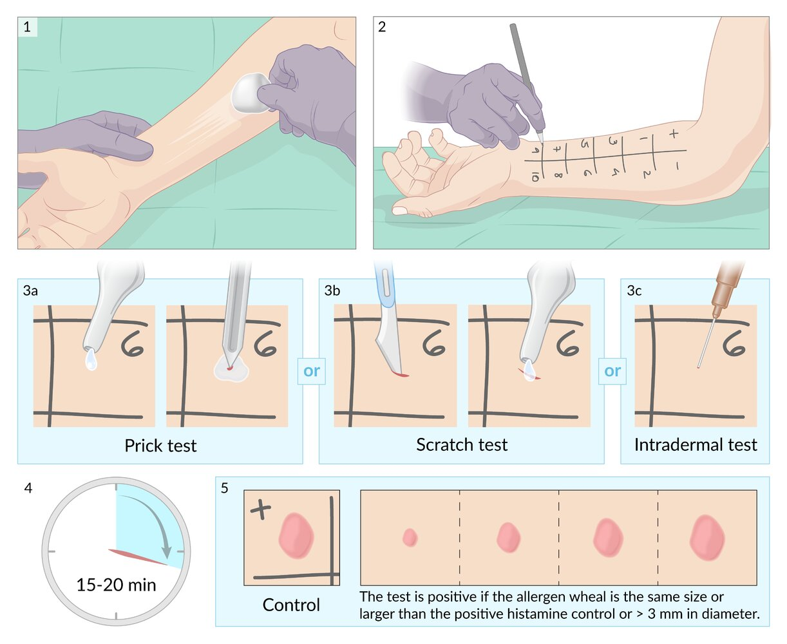

Skin prick test

#### Hypersensitivity blood tests (in vitro)

* Tryptase 

* A relatively specific marker of <u>mast cell</u> activation

* Elevated levels indicate an increased risk of severe reactions.

* Allergen-specific IgE test (<u>sIgE</u>)

* Indicated in patients with known allergic triggers and clinical symptoms

* Preferable to <u>skin</u> testing in patients at high risk of <u>anaphylaxis</u>

* Quantitatively assessed using <u>enzyme-linked immunosorbent assay</u> (<u>ELISA</u>)

* Total <u>IgE</u> levels (nonspecific)

* Often elevated in patients with allergic conditions

* Normal serum <u>IgE</u> levels do not exclude <u>allergy</u>.

* Basophil activation test [[13]](https://coursology-qbank.com/amboss/article/_P15hS0)[[14]](https://coursology-qbank.com/amboss/article/Un1bsh0)

* <u>Flow cytometry</u> is used to measure <u>basophil</u> <u>degranulation</u> following exposure to <u>allergens</u> and controls.

* More precise than <u>allergen-specific IgE test</u>

* Less invasive and lower risk than provocation tests

* Is not widely available

### Treatment

Treatment of <u>type I hypersensitivity reactions</u> depends on the cause of the reaction (see “<u>Hypersensitivity classification</u>” above).

* Drug reactions: Remove the offending drug.

* Severe reactions: emergency resuscitation; see “<u>Management of anaphylaxis</u>”

* Moderate reactions (more pronounced <u>urticaria</u>/<u>angioedema</u>, <u>fever</u>, <u>arrhythmia</u>, <u>bronchospasm</u>): <u>antihistamines</u> with or without <u>glucocorticoids</u>

* Mild reactions (mild <u>urticaria</u>/<u>angioedema</u>, GI symptoms, <u>tremor</u>, <u>palpitations</u>, <u>headache</u>, <u>cough</u>): <u>expectant management</u> with or without <u>antihistamines</u>

* See “<u>Drug hypersensitivity reactions</u>."

* Emergency self‑management for patients with known <u>allergic reactions</u> 

* <u>Epinephrine autoinjectors</u>, <u>antihistamines</u>, <u>corticosteroids</u>

* <u>Anaphylaxis emergency action plan</u>

* <u>Urticaria</u>: see “<u>Management of urticaria</u>.”

> [!TIP]
> Preventative treatment (i.e., contact prevention and avoidance of offending agents) is the most effective form of management for <u>allergies</u>.

#### Allergen immunotherapy (desensitization)

* Indication

* Documented <u>IgE</u>-mediated <u>allergy</u> (e.g., <u>allergic rhinitis</u>, <u>allergic asthma</u>, <u>allergy</u> to wasp or bee venom)

* Significant symptoms and inadequate relief from symptomatic therapy and exposure prophylaxis

* Significant symptoms despite symptomatic therapy and avoidance of the <u>allergen</u>

* Method

* Only available for some <u>allergens</u> but can be quite effective

* Application of specific <u>antigen</u> in subclinical dose (subcutaneous, <u>mucosal</u>)

* Slow escalation of dose

* Goal: ↑ production of <u>IgG antibodies</u> instead of excessive <u>IgE</u> production (<u>isotype switching</u>) [[15]](https://coursology-qbank.com/amboss/article/XnY97p)

* Duration of treatment: at least 3 years

* Prognosis

* Success in up to ⅔ of patients

* Younger patients see comparatively more benefits.

* Higher success rates in patients with <u>sensitivity</u> to only one <u>allergen</u> (monovalent) as opposed to patients with <u>sensitivity</u> to many <u>allergens</u> (polyvalent)

---

## Type II hypersensitivity reaction

### Overview

* <u>Type II hypersensitivity reactions</u>, or “cytotoxic reactions,” are <u>antibody</u>-mediated and responsible for a number of autoimmune disorders.

* Clinical features, diagnostics, and treatment depend on the underlying etiology (see “<u>Hypersensitivity classification</u>” above).

* Distribution of disease: often limited to a particular tissue type

* Diagnosis may involve <u>autoantibody</u> testing (see “<u>Antibody diagnosis of autoimmune diseases</u>”) and the <u>Coombs test</u>.

### Pathophysiology

<u>IgM</u> and <u>IgG</u> mistakenly bind to surface <u>antigens</u> of the cells in the body, which results in:

* Cellular destruction

* <u>Antibody</u>-dependent cell-mediated cytotoxicity (<u>NK cells</u> or <u>macrophages</u>)

* <u>Target cell</u> <u>opsonization</u> → <u>phagocytosis</u> and/or <u>complement</u> activation

* Inflammation

* <u>Fc</u>-<u>receptor</u> mediated <u>immune cell</u> activation

* <u>Antibodies</u> bind to cellular surfaces → activation of the <u>complement system</u>

* Impaired cellular function
* <u>Antibodies</u> bind to cell surface <u>receptors</u> → inhibition or activation of downstream signaling pathways → impaired cellular function

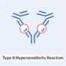

Antibody-Dependent Cell-Mediated Cytotoxicity: Type II Hypersensitivity Reaction

Type II hypersensitivity reaction

> [!NOTE]
> Type II is cy-2-toxic and consists of 2 components (<u>antigen</u> and <u>antibody</u>)

### Examples

* <u>Hemolysis</u>

* <u>Acute hemolytic transfusion reaction</u>

* <u>Autoimmune hemolytic anemia</u>

* <u>Hemolytic disease of the newborn</u>

* Systemic disorders

* <u>Goodpasture syndrome</u>

* <u>Rheumatic fever</u>

* <u>Myasthenia gravis</u>

* <u>Graves disease</u>

* <u>Skin</u> disorders

* <u>Bullous pemphigoid</u>

* <u>Pemphigus vulgaris</u>

---

## Type III hypersensitivity reaction

### Overview

* <u>Type III hypersensitivity reactions</u>, also referred to as <u>immune complex</u> reactions, are <u>antibody</u>-mediated.

* Clinical features, diagnostics, and treatment depend on the underlying etiology (see “<u>Hypersensitivity classification</u>” above).

* Distribution of disease: systemic

### Pathophysiology

1. * <u>Antigen</u> (e.g., the molecules of a drug in circulation) binds to <u>IgG</u> to form an <u>immune complex</u> (<u>antigen-antibody complex</u>)
2. * <u>Immune complexes</u> are deposited in tissue, especially <u>blood vessels</u> → initiation of <u>complement cascade</u> → release of <u>lysosomal</u> enzymes from <u>neutrophils</u> → <u>cell death</u> → inflammation → <u>vasculitis</u>

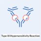

Immune Complex-Mediated Hypersensitivity: Type III Hypersensitivity Reaction

Type III hypersensitivity reaction

> [!NOTE]
> To remember Type III, think of three things stuck together: <u>antigen</u> + <u>antibody</u> + <u>complement</u>

### Examples

* <u>Vasculitis</u>

* <u>Polyarteritis nodosa</u>

* Drug-induced <u>hypersensitivity vasculitis</u>

* Nephropathy

* <u>Poststreptococcal glomerulonephritis</u>

* <u>IgA nephropathy</u>

* <u>Membranous nephropathy</u>

* <u>Rheumatoid arthritis</u>

* <u>Hypersensitivity pneumonitis</u>

* <u>Systemic lupus erythematosus</u> (e.g., <u>lupus nephritis</u>, <u>hypertension</u>, <u>thrombosis</u>)

* <u>Serum sickness</u> and <u>serum sickness-like reactions</u>

* <u>Arthus reaction</u>

---

## Arthus reaction

### Overview [[16]](https://coursology-qbank.com/amboss/article/qnYC8p)[[17]](https://coursology-qbank.com/amboss/article/i41JQS0)

* A local subacute <u>type III hypersensitivity reaction</u>.

* Typically caused by <u>vaccination</u> against <u>tetanus</u> and/or <u>diphtheria</u>.   [[17]](https://coursology-qbank.com/amboss/article/i41JQS0)

### Pathophysiology

Intradermal <u>antigen</u> injection in a presensitized individual (previously exposed to the <u>antigen</u>, with preformed, <u>antigen</u>-specific <u>IgG</u> in the serum) → formation of <u>antigen</u>-<u>antibody</u> complexes in the <u>skin</u> → <u>complement</u> activation → local inflammation and possibly <u>necrosis</u>

### Clinical features

* <u>Cutaneous small-vessel vasculitis</u> [[17]](https://coursology-qbank.com/amboss/article/i41JQS0)

* Localized swelling, <u>erythema</u>, hemorrhage

* Occasional <u>superficial</u> <u>skin</u> <u>necrosis</u> a few hours after booster <u>vaccination</u>

* The reaction typically peaks after 12–36 hours.

### Differential diagnoses [[17]](https://coursology-qbank.com/amboss/article/i41JQS0)

* Injection site reaction unrelated to hypersensitivity

* <u>Abscess</u>

* <u>Cellulitis</u>

* Shoulder injury related to <u>vaccine</u> administration

### Diagnostics [[16]](https://coursology-qbank.com/amboss/article/qnYC8p)[[17]](https://coursology-qbank.com/amboss/article/i41JQS0)

* Increased <u>tetanus</u> and <u>diphtheria</u> <u>antibody</u> levels in the serum support the diagnosis.

* Consider <u>skin biopsy</u> to rule out differential diagnoses. [[17]](https://coursology-qbank.com/amboss/article/i41JQS0)

### Treatment

* The reaction is <u>self-limited</u>.

* Symptomatic relief of swelling (e.g., cold compresses, <u>NSAIDs</u>, limb elevation)

### Prevention

* Reaction to <u>tetanus toxoid</u>: Observe a 10-year interval between <u>tetanus</u> toxoid-containing <u>vaccines</u>.

* Reaction to <u>diphtheria</u> toxoid: Administer <u>tetanus toxoid</u> rather than <u>Tdap vaccine</u>.

> [!TIP]
> Evidence of <u>vasculitis</u> on <u>histology</u> differentiates between a true <u>Arthus reaction</u> and an injection site reaction unrelated to hypersensitivity. [[17]](https://coursology-qbank.com/amboss/article/i41JQS0)

---

## Type IV hypersensitivity reaction

### Overview

* <u>Type IV hypersensitivity reactions</u> are delayed and cell-mediated.

* See “<u>Hypersensitivity classification</u>” for the specific causes of <u>type IV hypersensitivity</u>.

* Clinical features, diagnostics, and treatment depend on the underlying etiology.

### Pathophysiology

Compared to type I-III hypersensitivity reactions, which are <u>antibody</u>-mediated, type IV reactions are mediated by <u>T cells</u>. <u>Type IV hypersensitivity reactions</u> involve two major steps:

1. * <u>T cell</u> sensitization: <u>skin</u> penetration by the <u>antigen</u> → uptake of the <u>antigen</u> by Langerhans cell → migration to <u>lymph</u> nodes → formation of sensitized <u>T lymphocytes</u>
2. * Presensitized <u>T cell</u> response (after repeated contact with the <u>antigen</u>)

* <u>CD4+ T cells</u> recognize <u>antigens</u> on <u>antigen-presenting cells</u> → release of inflammatory <u>lymphokines</u> <u>cytokines</u> (e.g., <u>IFNγ</u>, TNF α) → <u>macrophages</u> activation → <u>phagocytosis</u> of <u>target cells</u>

* <u>CD8+ T cells</u> recognize <u>antigens</u> on somatic cells → cell-mediated cytotoxicity → direct cell destruction

CD4-mediated type IV hypersensitivity reaction

CD8-mediated type IV hypersensitivity reaction

> [!NOTE]
> To remember the specifics of type IV hypersensitivity reaction, think of the 5 Ts: T cells, Transplant rejection, TB <u>skin</u> tests, “Touching” (contact) dermatitis, Terminal (last; delayed).

### Examples

* <u>Severe cutaneous adverse reactions</u> (SCAR)

* <u>DRESS</u>

* <u>Stevens-Johnson syndrome</u> (<u>SJS</u>)

* <u>Toxic epidermal necrolysis</u> (TEN)

* <u>Acute generalized exanthematous pustulosis</u> (<u>AGEP</u>)

* Exanthematous drug eruption: <u>morbilliform</u> <u>rash</u> on the trunk and <u>proximal</u> extremities 

* Associated symptoms include <u>pruritus</u> and low-grade <u>fever</u>

* Typical onset 5-14 days after drug exposure

* Most commonly caused by <u>antibiotics</u>, e.g., “<u>ampicillin</u> <u>rash</u>” following <u>ampicillin</u> administration for <u>infectious mononucleosis</u>

* Resolves after discontinuation of the offending drug

* <u>Allergic contact dermatitis</u>: local drug reaction following topical application of drug

* <u>Skin</u> tests

* <u>Candida</u> <u>skin</u> test (to test the immune function of <u>T cells</u>)

* Mantoux <u>tuberculin skin test</u> for <u>latent tuberculosis</u>

* Systemic disorders

* <u>Hashimoto thyroiditis</u>

* <u>Multiple sclerosis</u>

* <u>Type 1 diabetes mellitus</u>

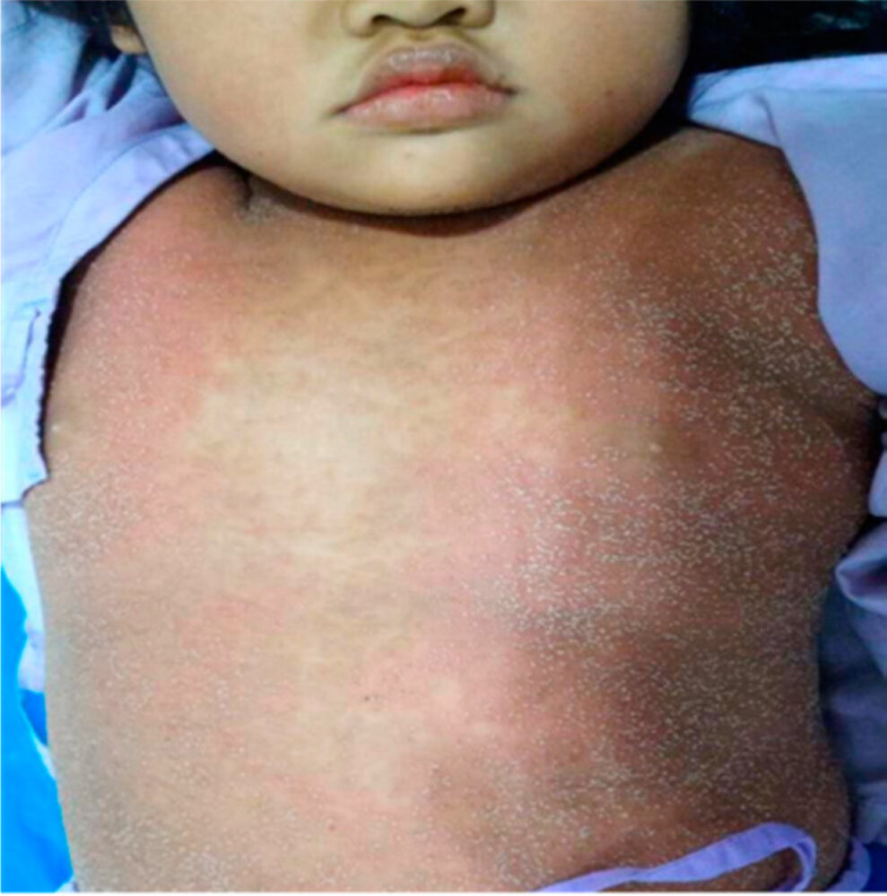

Acute generalized exanthematous pustulosis (AGEP)

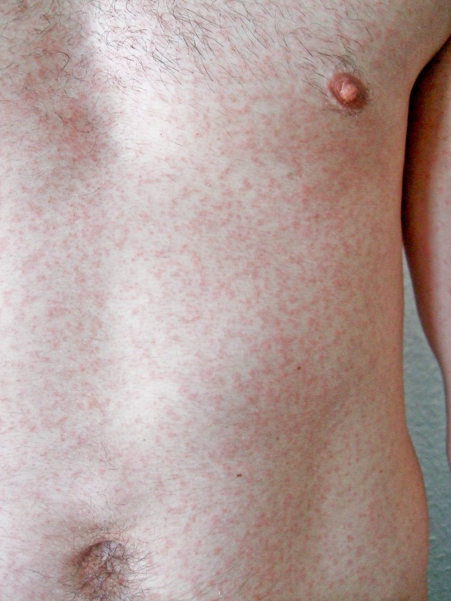

Drug eruption (1/2)

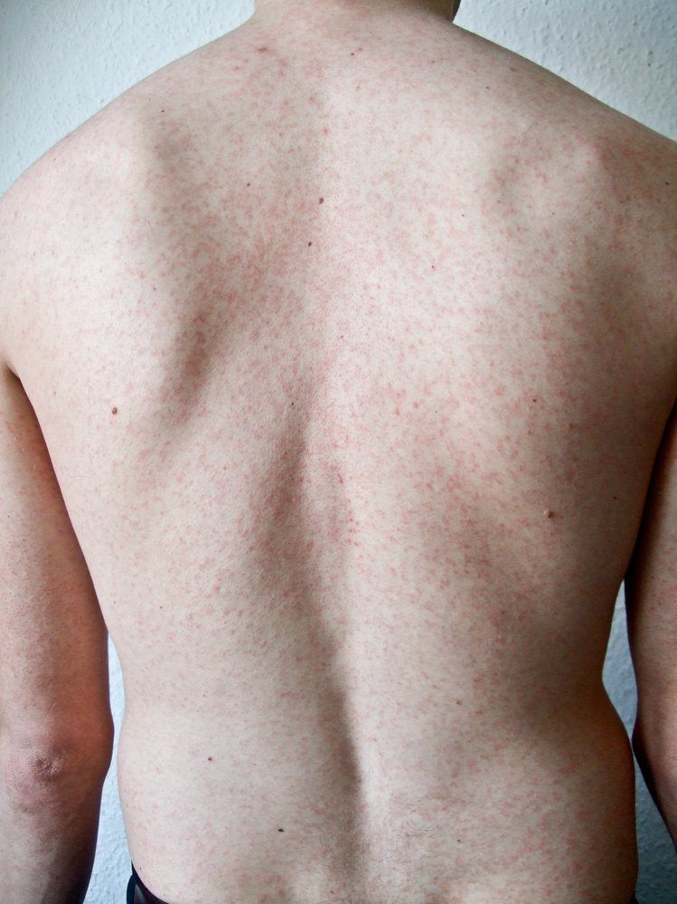

Drug eruption (2/2)

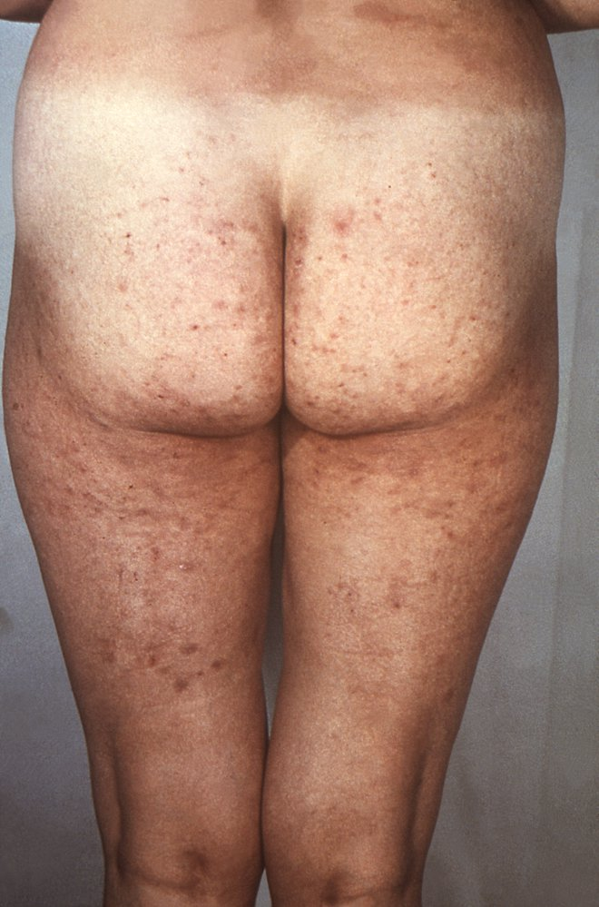

Drug eruption

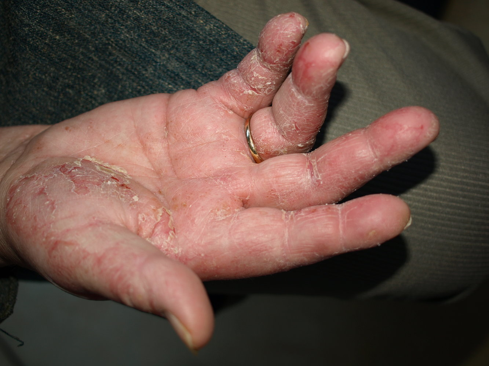

Drug eruption

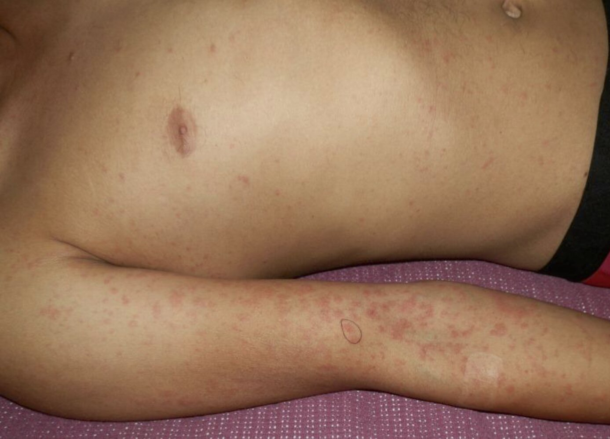

Morbilliform drug eruption

---

## Nonallergic hypersensitivity

### Pseudoallergy

* Description: : an <u>IgE</u>-independent reaction that is clinically indistinguishable from <u>type I hypersensitivity</u>

* Etiology

* Radiocontrast media

* Narcotics

* <u>Vancomycin</u>, <u>NSAIDs</u>

* Pathophysiology

* Substances cause direct (or <u>complement</u>-mediated in case of anaphylactoid reaction) <u>mast cell</u> activation and subsequent release of <u>histamine</u> not mediated by <u>immunoglobulin</u>.

* In contrast to true <u>anaphylactic</u> reactions, no sensitization to <u>allergens</u> is required (i.e., first contact can already lead to <u>anaphylactic shock</u>)

* Clinical features: <u>urticaria</u>, <u>pruritus</u>, <u>edema</u>, <u>hypotension</u>, or even symptoms of <u>anaphylactic shock</u>

* Diagnostics: <u>clinical diagnosis</u>

* Treatment

* Minor reactions

* Avoidance of offending drug

* <u>Antihistamines</u> for <u>pruritus</u> or <u>urticaria</u>

* <u>Pseudoallergy</u> with <u>anaphylactic</u> characteristics: See “<u>Anaphylaxis</u>.”

---