# Melanoma

*Categories: Clinical knowledge > Emergency medicine > Dermatologic disorders > Melanoma*

[Original Article Link](https://coursology-qbank.com/amboss/article/qk0CKT)

---

## Summary

Melanoma, a <u>malignancy</u> arising from <u>melanocytes</u>, is the most common cause of <u>skin</u> cancer-related <u>death</u>. <u>Risk factors</u> include UV radiation exposure (especially in individuals with light <u>skin</u>), <u>dysplastic nevi</u>, a <u>family history</u> of melanoma, and <u>immunosuppression</u>. Melanoma is most commonly cutaneous in origin, but may also arise in <u>mucosal</u> surfaces and in the <u>uvea</u>. There are four main histological subtypes of melanoma. <u>Superficial spreading melanoma</u> is the most common, while <u>nodular melanoma</u> tends to grow rapidly in depth and has the worst prognosis of all the subtypes. Clinical features concerning for melanoma include asymmetry, border irregularity, color variegation, diameter > 6 mm, and evolving size, shape, and/or color over time (i.e., the <u>ABCDE criteria</u>). <u>Full-thickness excisional biopsy</u> of <u>skin</u> lesions is the best diagnostic test for melanoma and should be performed immediately in all patients with suspicious lesions. Additional diagnostic and staging tests (e.g., <u>sentinel lymph node biopsy</u> and/or imaging) may be indicated in certain patients. <u>Tumor</u> thickness is a key prognostic factor. Treatment is primarily surgical and includes wide excision of the lesion with <u>surgical margins</u> determined by the <u>tumor</u> thickness. Systemic drug therapy (e.g., with <u>immune checkpoint inhibitors</u>, <u>BRAF inhibitors</u>, and <u>MEK inhibitors</u>) or <u>radiation therapy</u> may be indicated in patients with <u>metastatic</u> or unresectable disease.

---

## Epidemiology

* Most common cause of <u>skin</u> cancer-related <u>death</u>  [[1]](https://coursology-qbank.com/amboss/article/3lWS9l0)[[2]](https://coursology-qbank.com/amboss/article/RlWl9l0)

* <u>Incidence</u> is higher among individuals who are: [[3]](https://coursology-qbank.com/amboss/article/ilWJ9l0)

* Non-Hispanic White

* Male

* ≥ 75 years of age

Epidemiological data refers to the US, unless otherwise specified.

---

## Etiology

### Risk factors for cutaneous melanoma [[4]](https://coursology-qbank.com/amboss/article/ncW7140)[[5]](https://coursology-qbank.com/amboss/article/94WNll0)

* UV radiation exposure (e.g., nonadherence to <u>photoprotective measures</u>, previous episodes of <u>sunburn</u>, use of tanning beds)  [[6]](https://coursology-qbank.com/amboss/article/C4Wqll0)

* Light <u>skin</u> types  [[7]](https://coursology-qbank.com/amboss/article/Vv1G_i0)

* Precursor lesions, including:  [[8]](https://coursology-qbank.com/amboss/article/w4Whll0)

* <u>Dysplastic nevi</u>

* Giant <u>congenital nevi</u>

* Personal or <u>family history</u> of melanoma or other <u>skin</u> cancer  [[5]](https://coursology-qbank.com/amboss/article/94WNll0)

* Predisposing inherited <u>skin</u> conditions (e.g., <u>xeroderma pigmentosum</u>, <u>familial atypical multiple mole melanoma syndrome</u>)

* Genetic mutations, including:

* <u>BRAF</u> <u>gene</u> mutations

* Seen in 50% of melanomas [[9]](https://coursology-qbank.com/amboss/article/0bWeHP0)

* V600E mutation (most common): an <u>activating mutation</u> in the <u>BRAF</u> <u>gene</u> that substitutes <u>glutamic acid</u> for <u>valine</u> at <u>amino acid</u> position 600 [[10]](https://coursology-qbank.com/amboss/article/MdbMqs)

* <u>CDKN2A</u> <u>gene mutations</u>

* <u>Immunosuppression</u>

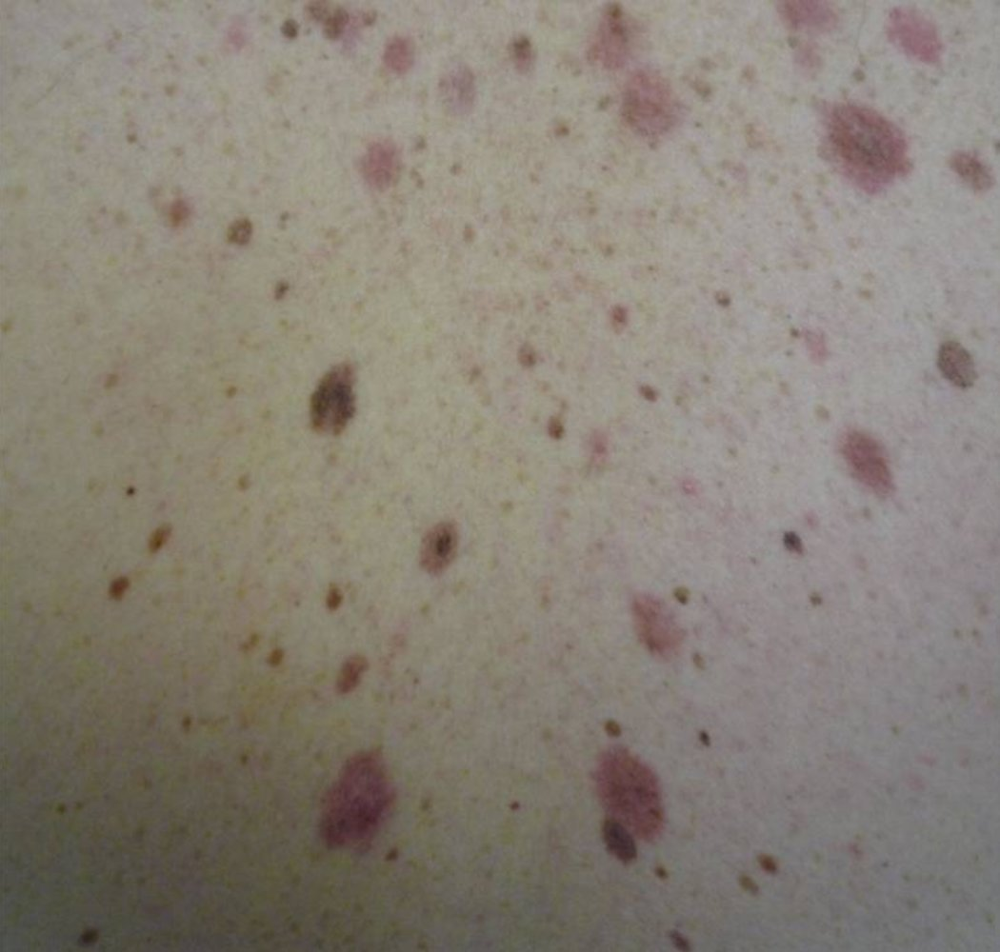

Atypical nevi (dysplastic nevi)

---

## Clinical features

The following are general features of <u>cutaneous melanoma</u>. See “<u>Types of melanoma</u>” for specific features of various melanoma subtypes.

### ABCDE criteria [[11]](https://coursology-qbank.com/amboss/article/ZbWZHP0)

The following <u>skin</u> lesion characteristics are concerning for melanoma:

* A = Asymmetry

* B = Border (irregular border with indistinct margins)

* C = Color (variegated pigmentation within the same lesion)

* D = Diameter > 6 mm

* E = Evolving (a lesion that changes in size, shape, or color over time)

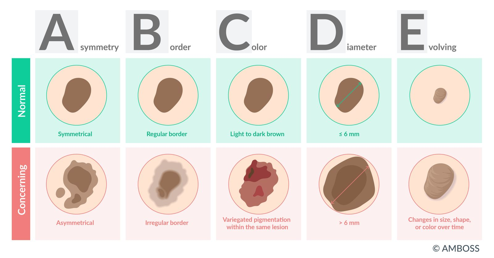

ABCDE-criteria melanoma

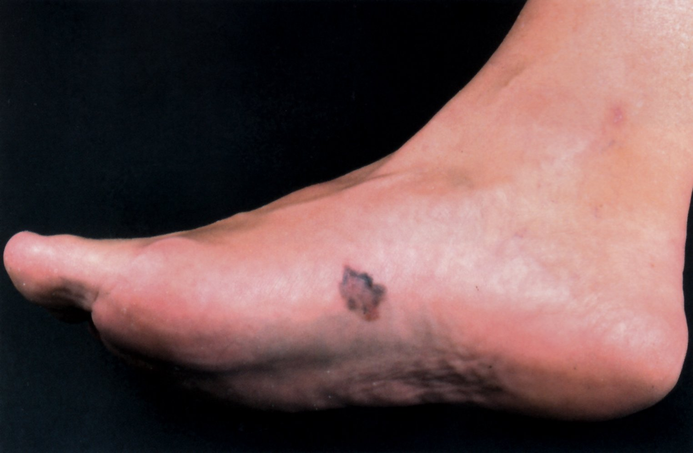

Melanoma

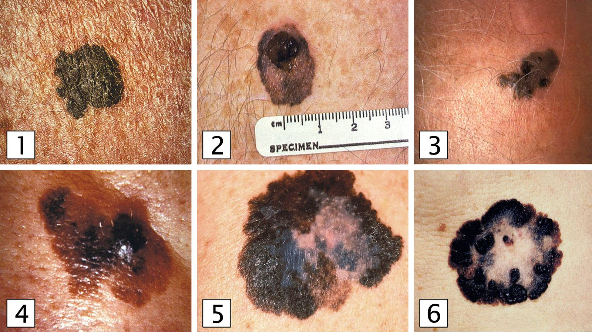

Superficial spreading melanoma

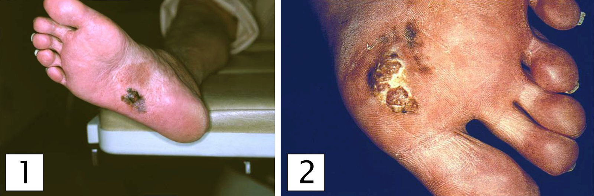

Acral lentiginous melanoma

### Other signs and symptoms [[11]](https://coursology-qbank.com/amboss/article/ZbWZHP0)[[12]](https://coursology-qbank.com/amboss/article/b0WHeP0)

* Ugly duckling sign: A <u>nevus</u> that appears different from other <u>nevi</u> in the same patient should be considered suspicious.  [[13]](https://coursology-qbank.com/amboss/article/7FW4jM0)

* <u>Pruritus</u>

* Bleeding or <u>ulceration</u>

---

## Subtypes and variants

### By site of origin [[14]](https://coursology-qbank.com/amboss/article/B4Wzll0)[[15]](https://coursology-qbank.com/amboss/article/UHWbp50)

* Cutaneous melanoma originates from <u>melanocytes</u> in the <u>epidermis</u>.

* Noncutaneous melanoma (much less common)

* Mucosal melanoma originates from <u>melanocytes</u> in <u>mucosal</u> membranes, most commonly in:

* Head and neck

* Anorectal and female genital regions

* <u>Uveal melanoma</u> originates from <u>melanocytes</u> in the <u>uvea</u>.

Benign choroidal nevus

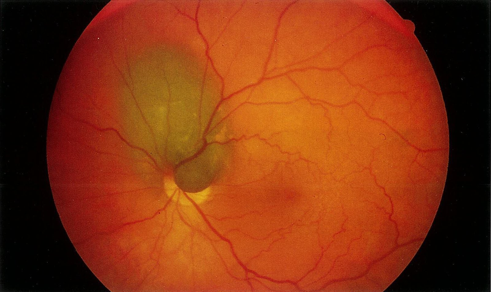

Choroidal melanoma

### By <u>histology</u> [[11]](https://coursology-qbank.com/amboss/article/ZbWZHP0)[[16]](https://coursology-qbank.com/amboss/article/lPWvUl0)

Both cutaneous melanomas and <u>mucosal melanomas</u> may be categorized by these subtypes.

|  Histological subtypes of melanoma [[11]](https://coursology-qbank.com/amboss/article/ZbWZHP0)[[16]](https://coursology-qbank.com/amboss/article/lPWvUl0)  |  |  |  |  |
| --- | --- | --- | --- | --- |
|  | <u>Epidemiology</u> | Typical sites | Clinical appearance | Growth |
|  Lentigo maligna  [[17]](https://coursology-qbank.com/amboss/article/NWd-lK0)  |  * Peak <u>incidence</u> between 65 and 80 years of age   [[17]](https://coursology-qbank.com/amboss/article/NWd-lK0)   |  * Sun-exposed areas (e.g., face, neck)   |   * Darkly pigmented <u>macule</u>  * Irregular borders and varying size  * Gradual growth, color irregularities, surrounding island-like speckling    |   * Premalignant lesion  * Slow growth  * Upto 50% of untreated lesions may transform into <u>lentigo maligna melanoma</u>. [[17]](https://coursology-qbank.com/amboss/article/NWd-lK0)    |
|  Superficial spreading melanoma    |  * ∼ 70% of all melanomas   |   * Back, chest, head, neck (in men)  * Legs (in women)    |   * Flat irregular lesion with irregular borders  * Sometimes with nodular segments  * Variable pigmentation    |  * Relatively slow horizontal growth   |
|  Nodular melanoma    |  * 15–30% of all melanomas   |   * Blue-black <u>nodules</u> with smooth borders (may less commonly be an <u>amelanotic melanoma</u>)  * <u>Ulceration</u> with bleeding may be present    |  * Fast growth in depth  [[18]](https://coursology-qbank.com/amboss/article/_HW5G50)   |  |
|  Lentigo maligna melanoma    |   * < 10% of all melanomas [[4]](https://coursology-qbank.com/amboss/article/ncW7140)  * Often arises from <u>lentigo maligna</u> in older adults    |  * Sun-exposed <u>skin</u> areas (esp. the face and forearms)   |  * Development of the following within a <u>lentigo maligna</u> lesion:  * <u>Papules</u> or <u>nodules</u>  * Variegated colors of red, blue, and white   |  * Relatively slow horizontal growth   |
|  Acral lentiginous melanoma   |   * < 5% of all melanomas  * Most common melanoma in dark-skinned and Asian individuals    |   * Palms and soles  * <u>Nail</u> beds (<u>subungual melanoma</u>)    |  * Irregularly shaped <u>macule</u> with variegated colors including black, brown, and blue   |  * Slow horizontal growth   |

> [!TIP]
> <u>Nodular melanomas</u> have a rapid vertical growth rate and may be better identified by use of the EFG criteria (Elevation, Firmness to touch, Growth) than the more general <u>ABCDE criteria</u>. [[19]](https://coursology-qbank.com/amboss/article/COWqul0)

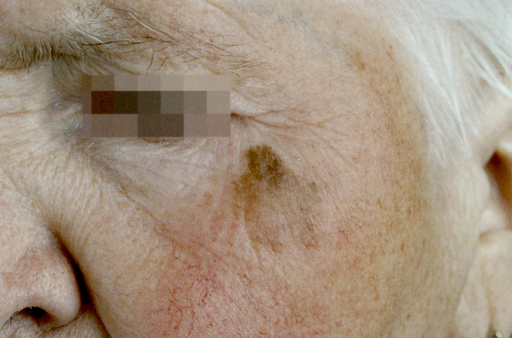

Lentigo maligna

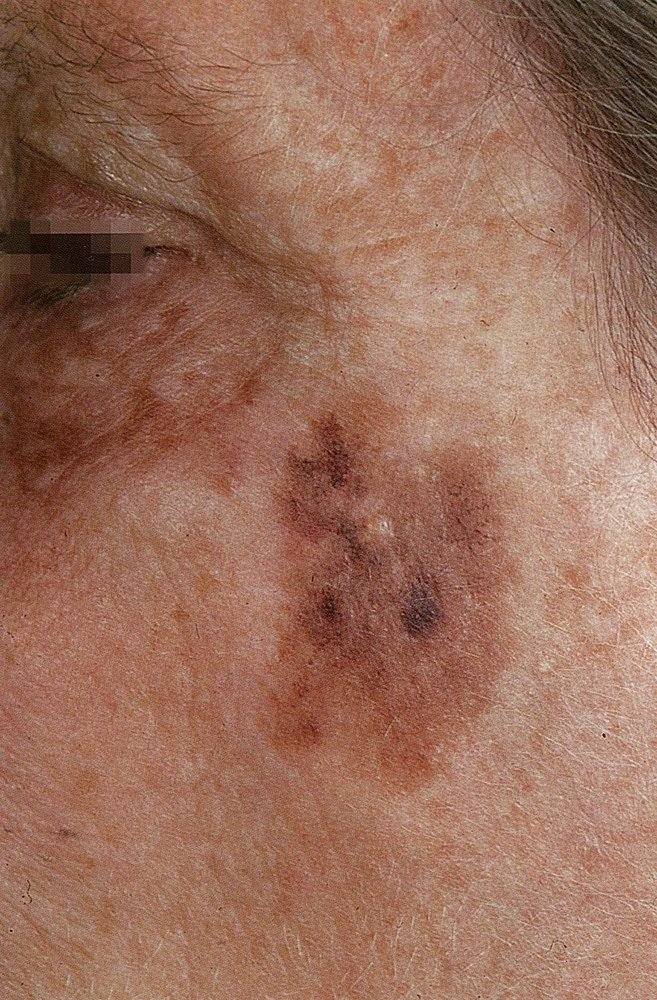

Intraepithelial precancerous skin lesion: lentigo maligna

Superficial spreading melanoma

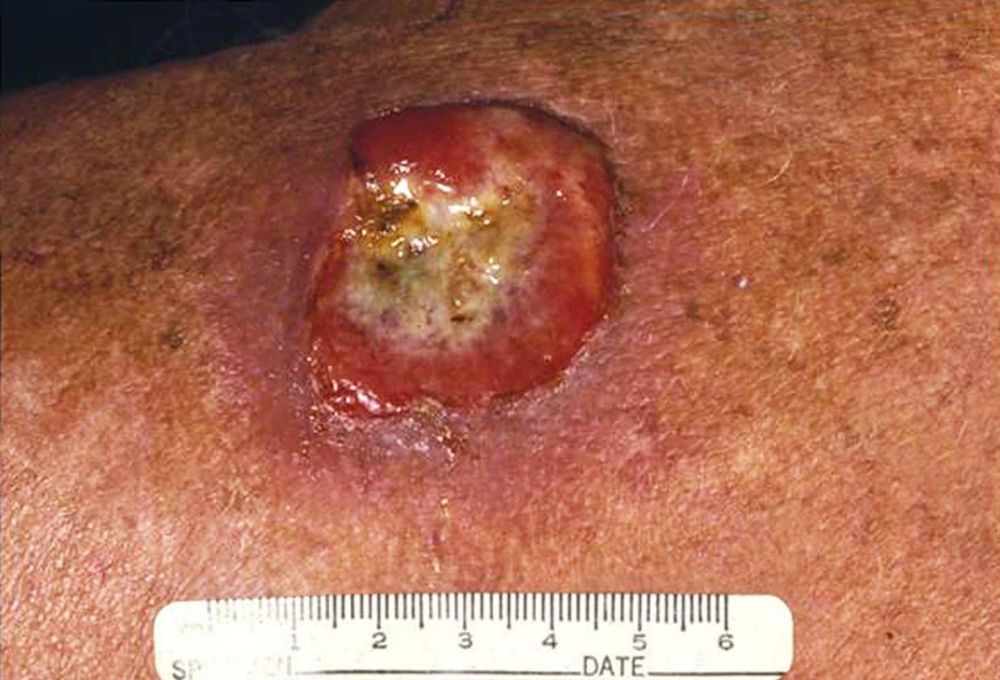

Nodular melanoma

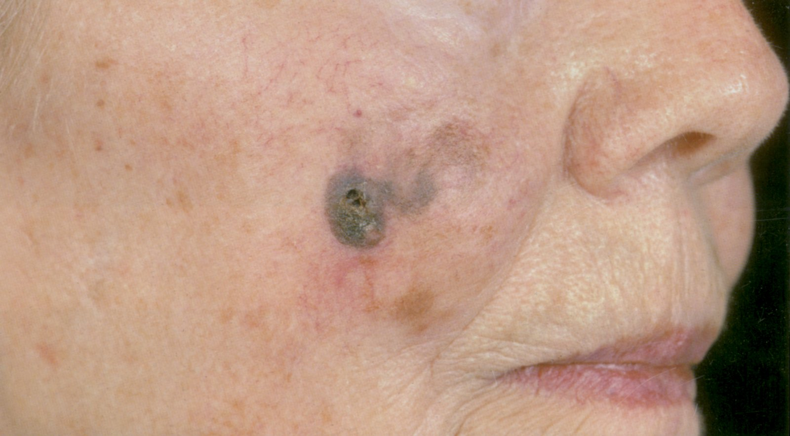

Lentigo maligna melanoma

Acral lentiginous melanoma

#### Amelanotic melanoma [[16]](https://coursology-qbank.com/amboss/article/lPWvUl0)

* Any of the other histological subtypes may present; , less commonly, as <u>amelanotic melanoma</u>.

* <u>Melanocytes</u> in the lesion produce little to no pigment, causing the color to range from <u>skin</u>-colored to bright pink or red.   [[20]](https://coursology-qbank.com/amboss/article/XtW9XM0)

* Diagnosis typically requires histological confirmation.

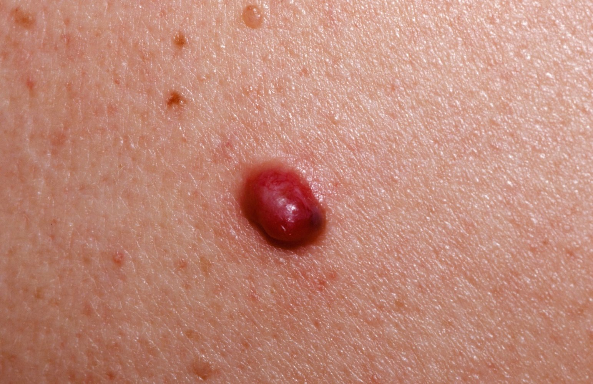

Amelanotic melanoma

### Genitourinary melanoma (GU melanoma) [[21]](https://coursology-qbank.com/amboss/article/tKcXRW0)

#### Overview

* Rare (< 5%)

* Approx. 45% of all <u>mucosal melanomas</u>

* Most commonly affects female individuals (approx. 90%)

* Cause remains unknown.

* Expression of cell biomarkers such as <u>PD-1</u> and <u>PD-L1</u> in vulvar melanoma is significantly higher than in cutaneous melanomas.

* Prognosis is generally poor.

#### Types of GU melanoma

| Overview of GU melanoma types |  |  |  |  |
| --- | --- | --- | --- | --- |
| Characteristics | Female genital melanoma | Male genital melanoma |  | Urological <u>mucosal melanoma</u> |
| <u>Epidemiology</u> |  * Rare: ∼ 1% of all melanomas, 5% of vaginal malignancies [[22]](https://coursology-qbank.com/amboss/article/1Lc2910)[[23]](https://coursology-qbank.com/amboss/article/cLca910)   |  * Rare: ∼ 1% of all primary <u>penile carcinomas</u>   |  |   * <u>♀</u> > <u>♂</u>  * Peak age of onset: 7th decade    |
|  * Peak age of onset: 6th decade   |  |  |  |  |
| Classification |   * Vulvar melanoma  * Vaginal melanoma    |   * GU <u>cutaneous melanoma</u> (e.g., <u>penis</u>, <u>scrotum</u>)  * GU <u>mucosal melanoma</u> (e.g., <u>glans penis</u>, urethral meatus)    |  |   * Renal melanoma  * Ureteral melanoma  * <u>Bladder</u> melanoma  * Urethral melanoma    |
| Clinical features |   * Black lesion with irregular borders, most commonly located on the <u>labia minora</u>, <u>labia majora</u>, or clitoral hood  * <u>Pain</u>, <u>dysuria</u>, bleeding, <u>dyspareunia</u>, and/or <u>pruritus</u>    |   * Dark lesion with irregular borders with or without <u>ulceration</u>, most commonly located on the <u>penis</u> and <u>scrotum</u> or the <u>glans penis</u> and urethral meatus  * <u>Hematuria</u>, <u>dysuria</u>, <u>urinary obstruction</u>    |  |  * <u>Hematuria</u>, <u>dysuria</u>, <u>urinary obstruction</u>, incontinence   |
| Diagnosis |  * Clinical presentation and histopathological confirmation   |  |  |  |
| Treatment |  * Surgical resection with an adequate margin   |  * Preferably organ-sparing <u>surgery</u>   |  |  * Depending on the type of cancer, surgical management involves, TUR, <u>wide local excision</u>, cystectomy, and/or <u>nephrectomy</u>   |

### Subungual melanoma [[24]](https://coursology-qbank.com/amboss/article/llWvCl0)[[25]](https://coursology-qbank.com/amboss/article/YsWnt50)

* Rare subtype of cutaneous <u>acral lentiginous melanoma</u> that develops within the <u>nail</u> unit

* Commonly manifests as <u>melanonychia</u> (a brown to black longitudinal band), with additional features suggestive of <u>malignancy</u>:

* Extension of pigmentation proximally or laterally to involve the <u>nail</u> folds (Hutchinson sign of the nail)

* Width of pigmentation > 3 mm with triangular shape (<u>distal</u> tapering)

* <u>Nail</u> <u>dystrophy</u>, fissuring, or splitting [[16]](https://coursology-qbank.com/amboss/article/lPWvUl0)

* Involvement of a single <u>nail</u>

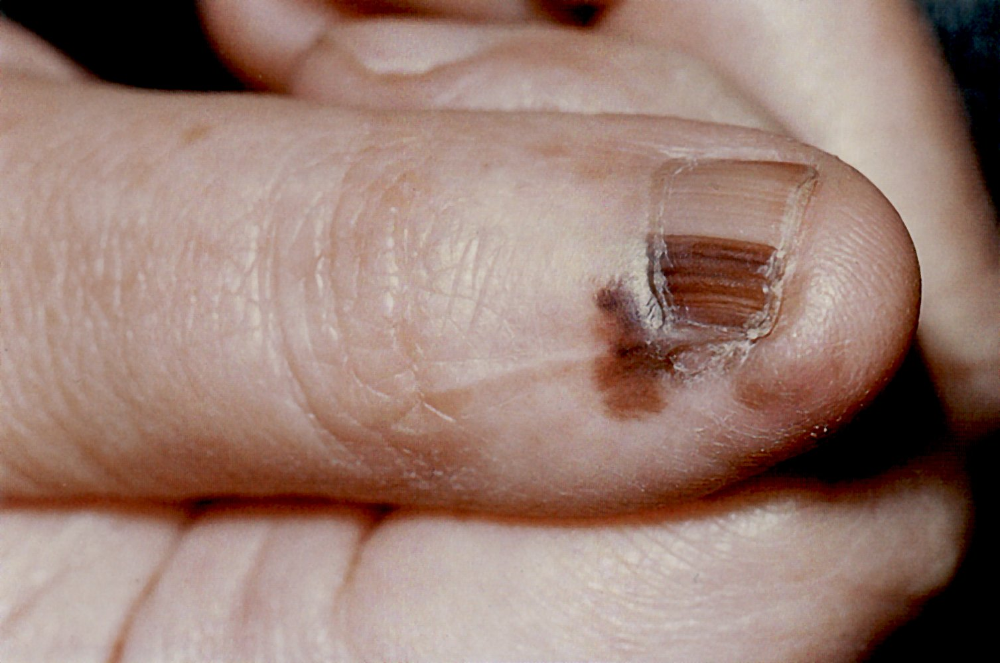

Acral lentiginous melanoma

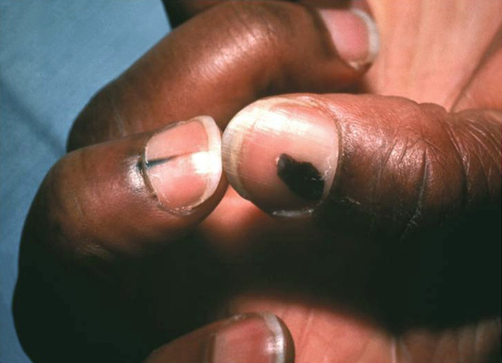

Acral lentiginous melanoma

---

## Diagnosis

### Approach [[11]](https://coursology-qbank.com/amboss/article/ZbWZHP0)[[26]](https://coursology-qbank.com/amboss/article/wYWhrP0)[[27]](https://coursology-qbank.com/amboss/article/tjcXXc0)

* Individuals with suspicious <u>skin</u> lesion(s)

* Assess for <u>clinical features of melanoma</u>.

* Use <u>dermoscopy</u> (if available) to obtain a magnified view of the lesion(s).

* Confirm the diagnosis with a <u>skin biopsy</u> of the lesion.

* Individuals with <u>biopsy</u>-confirmed melanoma: See “<u>Melanoma staging</u>.”

### <u>Skin biopsy</u> [[26]](https://coursology-qbank.com/amboss/article/wYWhrP0)[[27]](https://coursology-qbank.com/amboss/article/tjcXXc0)

* <u>Full-thickness excisional biopsy</u>: preferred for all suspicious lesions [[27]](https://coursology-qbank.com/amboss/article/tjcXXc0)

* The sample should include:

* The full depth of the lesion (i.e., avoid transection of the lesion)

* 1–3 mm <u>surgical margins</u>

* Methods

* Fusiform (elliptical) excision <u>biopsy</u>

* <u>Punch biopsy</u>

* <u>Deep shave biopsy</u>

* Incisional (partial) <u>biopsy</u>

* May be performed for certain lesions (e.g., on the face or digits, or that are large in size)

* If the full thickness of the lesion is not captured on <u>biopsy</u>, accurate <u>melanoma staging</u> may not be possible.

> [!WARNING]
> <u>Excisional biopsy</u> of suspected melanoma should encompass the full depth of the lesion, as lesion depth is important for staging and prognostic purposes. [[27]](https://coursology-qbank.com/amboss/article/tjcXXc0)

> [!TIP]
> Clearly document the lesion dimensions, size of <u>surgical margins</u>, and type of <u>biopsy</u> to guide subsequent management. [[11]](https://coursology-qbank.com/amboss/article/ZbWZHP0)[[27]](https://coursology-qbank.com/amboss/article/tjcXXc0)

---

## Pathology

* Atypical <u>melanocytes</u> may be:  [[28]](https://coursology-qbank.com/amboss/article/3OWSHl0)

* <u>Epithelioid cells</u> with large eosinophilic nucleoli and eosinophilic <u>cytoplasm</u>

* <u>Hyperchromatic</u>, <u>spindle-shaped cells</u>

* Negative prognostic features

* Increased Breslow depth (thickness from the <u>stratum granulosum</u> to the lowest detectable <u>tumor</u> cell, which correlates with the risk of <u>metastasis</u>)  [[27]](https://coursology-qbank.com/amboss/article/tjcXXc0)

* <u>Ulceration</u>

* High <u>mitotic rate</u>

* <u>Melanoma microsatellitosis</u>

* Malignant cells at the margins of the <u>biopsy</u> specimen

* Specialized studies: may be obtained in select cases.

* Atypical lesions : to confirm the diagnosis (e.g., by testing for expression of <u>s100-protein</u>, a <u>tumor marker</u> for melanoma) [[29]](https://coursology-qbank.com/amboss/article/0fWekk0)

* <u>Metastatic</u> disease: to help determine treatment choices (e.g., by testing for <u>BRAF</u> mutations)

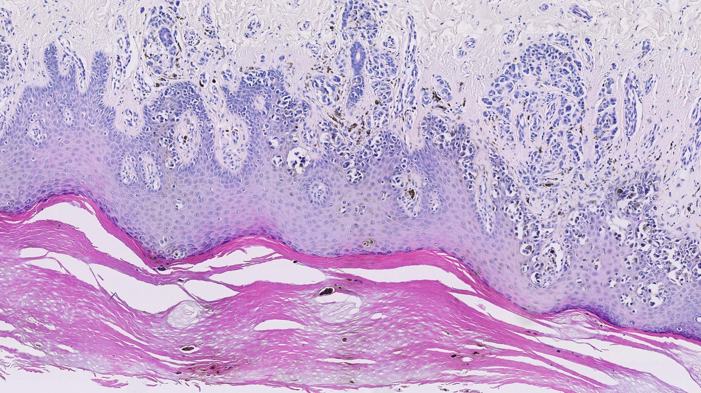

Melanoma

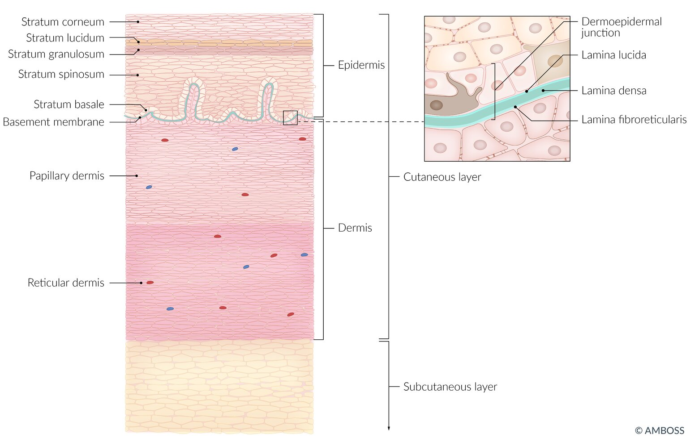

Layers of the skin

---

## Staging

### Determination of stage

* Perform a comprehensive clinical evaluation, including:

* History of recent systemic symptoms (e.g., weight loss) or <u>headaches</u>

* Total body <u>skin examination</u> for other suspicious lesions

* <u>Lymph node examination</u> in the areas surrounding the melanoma

* Obtain additional studies as needed for <u>melanoma staging</u>, e.g.:

* <u>Sentinel lymph node biopsy</u>

* <u>Laboratory studies</u>

* Imaging

#### <u>Sentinel lymph node biopsy</u> (<u>SLNB</u>) [[26]](https://coursology-qbank.com/amboss/article/wYWhrP0)[[27]](https://coursology-qbank.com/amboss/article/tjcXXc0)

<u>SLNB</u> is recommended in certain patients, after careful discussion of risks and benefits and with the involvement of surgical oncology.

* Offer <u>SLNB</u> for <u>cutaneous melanoma</u>  ≥ 1 mm in depth.

* Consider <u>SLNB</u> for <u>cutaneous melanoma</u> that is:

* 0.8–1.0 mm in depth

* < 0.8 mm in depth with concerning features  [[27]](https://coursology-qbank.com/amboss/article/tjcXXc0)

> [!TIP]
> <u>SLNB</u> is not indicated in patients with <u>cutaneous melanoma</u> < 0.8 mm in depth without <u>ulceration</u> or other concerning features. [[27]](https://coursology-qbank.com/amboss/article/tjcXXc0)

#### Additional studies [[27]](https://coursology-qbank.com/amboss/article/tjcXXc0)

* Not routinely recommended in asymptomatic patients with <u>stage II melanoma</u> or lower

* Indicated to evaluate for <u>metastasis</u> in select patients, e.g., with:

* Signs or symptoms of <u>metastatic</u> disease

* Positive <u>SLNB</u>

* May include:

* <u>Laboratory studies</u>, e.g., <u>CBC</u>, <u>BMP</u>, <u>liver chemistries</u>

* Imaging, e.g.:

* CT or <u>PET-CT</u> of the chest, abdomen, and <u>pelvis</u>

* <u>MRI</u> <u>brain</u>

* <u>Lymph node</u> US

* <u>Bone scintigraphy</u>

> [!TIP]
> <u>LDH</u> is not used to evaluate for <u>metastasis</u>, but may be used as a prognostic indicator in patients with <u>stage IV melanoma</u>. [[27]](https://coursology-qbank.com/amboss/article/tjcXXc0)

### <u>AJCC staging of cutaneous melanoma</u>

Melanoma is staged using the American <u>Joint</u> Committee for Cancer (AJCC) <u>TNM staging</u> system.

|  AJCC staging of cutaneous melanoma (2018) [[27]](https://coursology-qbank.com/amboss/article/tjcXXc0)[[30]](https://coursology-qbank.com/amboss/article/kC1mHQ0)  |  |  |  |
| --- | --- | --- | --- |
|  | <u>Tumor</u> characteristics (T) |  Regional spread (N)   | Distant <u>metastasis</u> (M) |
| <u>Stage 0 melanoma</u> |  * <u>Tumor in situ</u>   |  * None   |  * None   |
| <u>Stage I melanoma</u> |   * IA: <u>Breslow depth</u> < 0.8 mm without <u>ulceration</u>  * IB: <u>Breslow depth</u> < 0.8 mm with <u>ulceration</u>, <u>Breslow depth</u> 0.8–1.0 mm with or without <u>ulceration</u>, or <u>Breslow depth</u> 1.0–2.0 mm without <u>ulceration</u>    |  |  |
| <u>Stage II melanoma</u> |   * <u>IIA</u>: <u>Breslow depth</u> 1.0–2.0 mm with <u>ulceration</u>, or <u>Breslow depth</u> 2.0–4.0 mm without <u>ulceration</u>  * <u>IIB</u>: <u>Breslow depth</u> 2.0–4.0 mm with <u>ulceration</u>, or <u>Breslow depth</u> > 4.0 mm without <u>ulceration</u>  * <u>IIC</u>: <u>Breslow depth</u> > 4.0 mm with <u>ulceration</u>    |  |  |
| <u>Stage III melanoma</u> |  * Any <u>Breslow depth</u>   |  * Present   |  |
| <u>Stage IV melanoma</u> |  * Any <u>Breslow depth</u>   |  * May or may not be present   |  * Present   |

---

## Differential diagnoses

### Benign <u>skin</u> lesions [[31]](https://coursology-qbank.com/amboss/article/Dz11Ej0)

These may include:

* <u>Seborrheic keratosis</u>

* <u>Cherry angioma</u>

* <u>Angiokeratoma</u>

* <u>Dermatofibroma</u>

* Irritated benign <u>nevi</u>

* <u>Solar lentigo</u>

> [!TIP]
> Benign <u>skin</u> lesions can resemble melanomas; <u>biopsy</u> should be performed to rule out melanoma. [[32]](https://coursology-qbank.com/amboss/article/1YW2LP0)

Seborrheic keratosis

Capillary hemangioma of the skin (cherry angioma)

Angiokeratomas

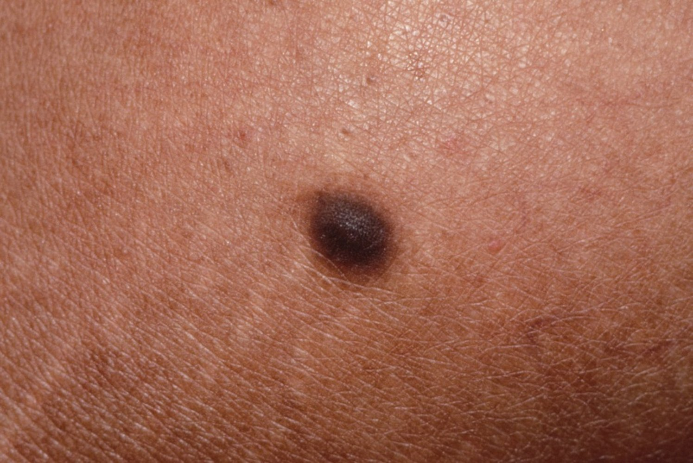

Dermatofibroma

Dermatofibroma

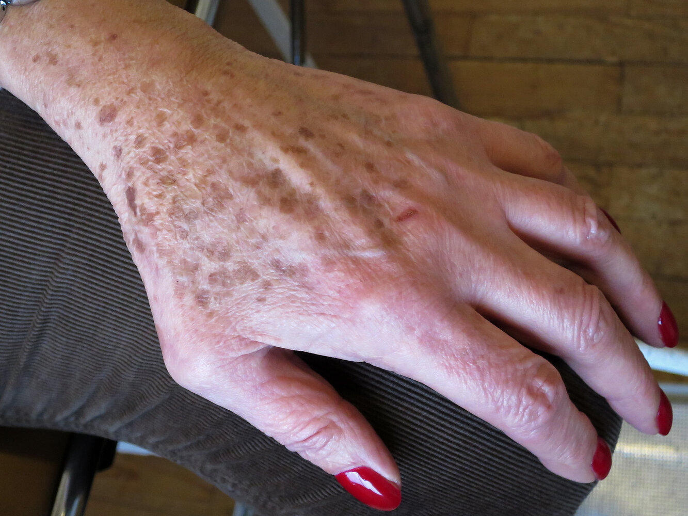

Solar lentigo

### <u>Precancerous skin lesions</u> [[32]](https://coursology-qbank.com/amboss/article/1YW2LP0)

These may include:

* <u>Actinic keratosis</u>

* <u>Dysplastic nevi</u>

* <u>Bowen's disease</u>

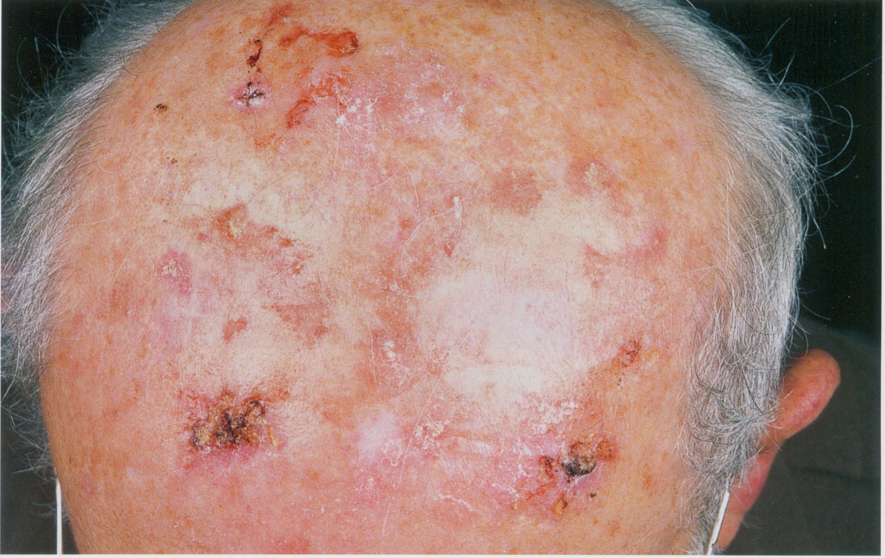

Actinic keratosis of the scalp

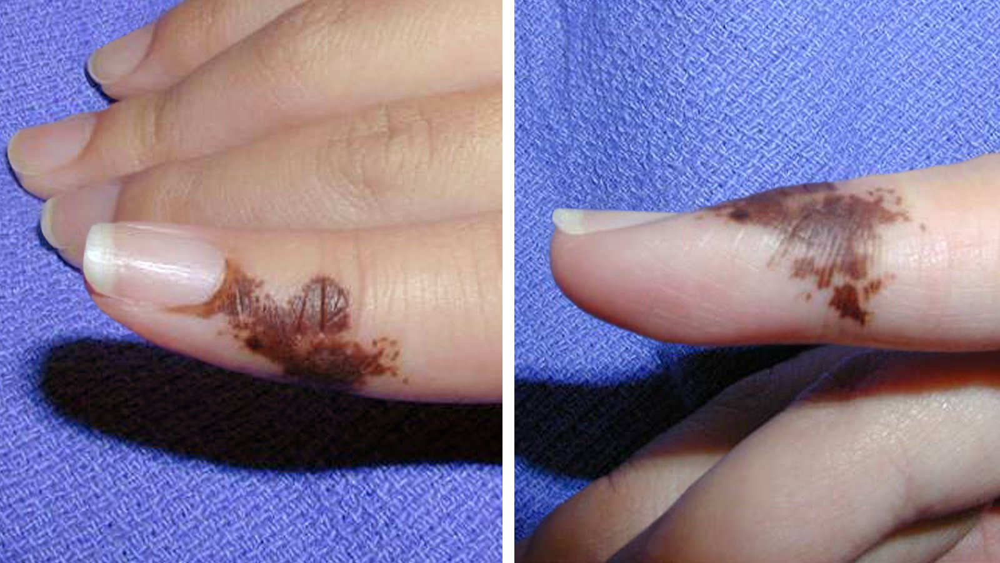

Atypical nevus

Bowen disease

### Other <u>skin</u> cancers [[16]](https://coursology-qbank.com/amboss/article/lPWvUl0)[[32]](https://coursology-qbank.com/amboss/article/1YW2LP0)

|  Overview of common skin cancers [[16]](https://coursology-qbank.com/amboss/article/lPWvUl0)[[32]](https://coursology-qbank.com/amboss/article/1YW2LP0)  |  |  |  |
| --- | --- | --- | --- |
|  |  <u>Cutaneous melanoma</u>  [[11]](https://coursology-qbank.com/amboss/article/ZbWZHP0)[[12]](https://coursology-qbank.com/amboss/article/b0WHeP0)  |  <u>Cutaneous squamous cell carcinoma</u>  |  <u>Basal cell carcinoma</u> (<u>BCC</u>) [[33]](https://coursology-qbank.com/amboss/article/-1WDj40)  |
| Color |  * Brown, black (variable pigmentation)   |  * Red   |   * Pink or red  * Pigmented BCCs may be brown, black, or blue.    |
| Morphology |  * Irregular <u>macule</u>, <u>nodule</u>, or patch   |   * Early stages: rough, scaly <u>plaque</u>  * Late stages: smooth, firm <u>papule</u>, <u>plaque</u>, or <u>nodule</u>    |  * Varies based on <u>BCC subtype</u>, e.g.:  * Pearly <u>papule</u> or <u>nodule</u> in <u>nodular BCC</u>  * Thin and scaly <u>plaque</u> in <u>superficial BCC</u>   |
| Location |  * Varies between <u>types of melanoma</u>, e.g.:  * Trunk, head, neck, and legs in <u>superficial</u> spreading and <u>nodular melanoma</u>  * Palms, soles, and <u>nail</u> beds in <u>acral lentiginous melanoma</u> [[14]](https://coursology-qbank.com/amboss/article/B4Wzll0)   |  * Usually sun-exposed areas, e.g.:  * Forearms  * Back of hands  * Head and neck, including <u>ears</u> and lower lip   |  * Usually sun-exposed areas; most commonly on the head and neck   |
| Other characteristic features |   * Growth rate is generally:  * Fast and vertical in <u>nodular melanoma</u>  * Slow and horizontal in other melanomas  * <u>ABCDE criteria</u>    |   * <u>Hyperkeratosis</u>  * Nonhealing lesion  * Central <u>ulceration</u>  * Bleeding with minor trauma    |   * <u>Superficial</u> <u>telangiectasias</u>  * Rolled edges  * Central <u>atrophy</u>  * Nonhealing lesion with slow growth rate    |

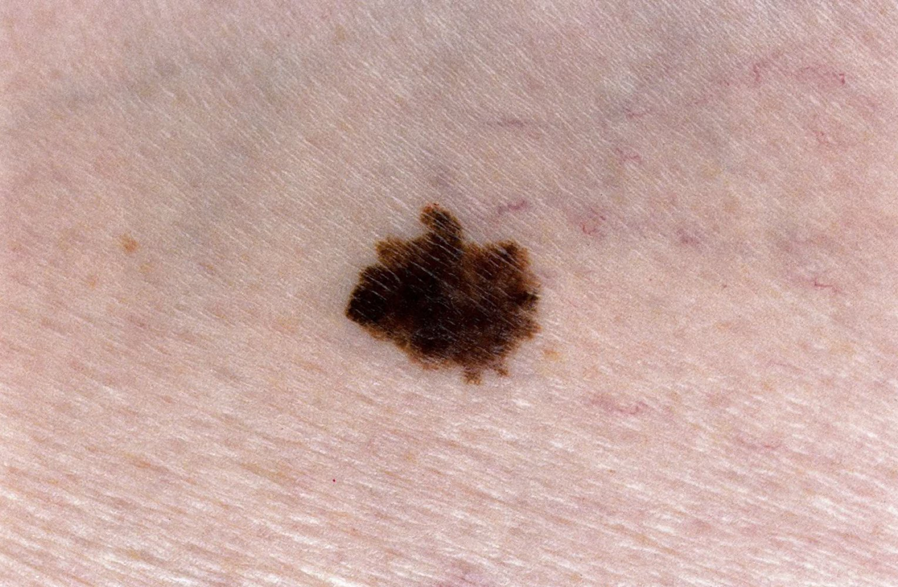

Superficial spreading melanoma

Squamous cell carcinoma

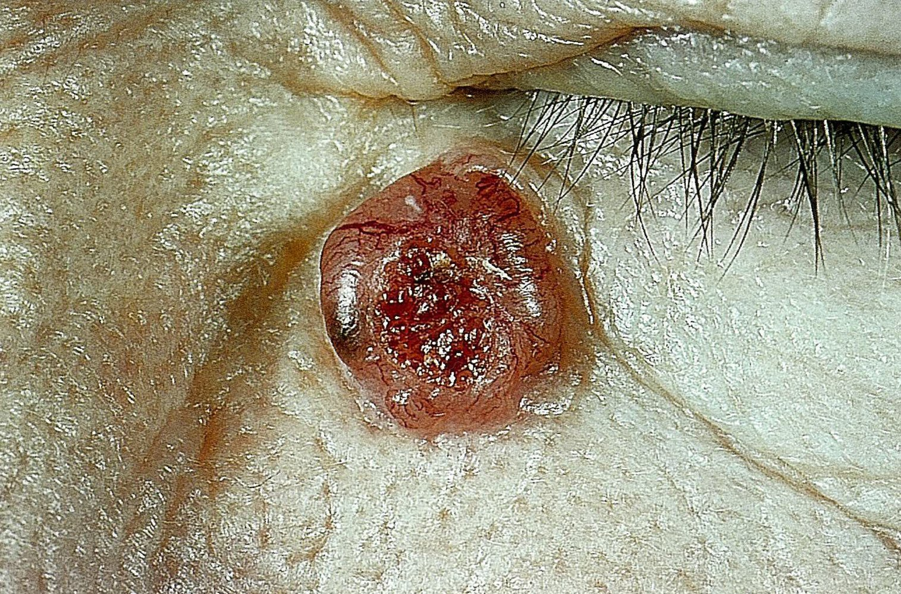

Basal cell carcinoma

The differential diagnoses listed here are not exhaustive.

---

## Treatment

### Approach [[9]](https://coursology-qbank.com/amboss/article/0bWeHP0)[[26]](https://coursology-qbank.com/amboss/article/wYWhrP0)[[27]](https://coursology-qbank.com/amboss/article/tjcXXc0)

* Establish <u>multidisciplinary cancer care</u>, including referrals to specialists (e.g., dermatology, <u>surgery</u>, oncology, and/or radiation oncology) for:

* Complete surgical excision of the cutaneous lesion, if possible  [[34]](https://coursology-qbank.com/amboss/article/lOWvsl0)

* Consideration of additional <u>medical therapy for melanoma</u> for specific indications, e.g., <u>metastatic</u> or unresectable disease

* Ensure regular <u>follow-up care for melanoma</u> based on disease stage.

* Educate patients on: [[35]](https://coursology-qbank.com/amboss/article/HOWKFl0)

* Self-examination for new or changing <u>skin</u> lesions and/or <u>lymphadenopathy</u>

* <u>Photoprotective measures</u>

* Increased risk of melanoma in family members

### <u>Wide local excision</u> [[9]](https://coursology-qbank.com/amboss/article/0bWeHP0)[[26]](https://coursology-qbank.com/amboss/article/wYWhrP0)[[27]](https://coursology-qbank.com/amboss/article/tjcXXc0)[[36]](https://coursology-qbank.com/amboss/article/mWdVNK0)

* Indicated for nearly all patients

* Excision should be performed with <u>surgical margins</u> determined by the <u>Breslow depth</u>.

| Recommended <u>surgical margins</u> for invasive melanoma resection |  |
| --- | --- |
| <u>Breslow depth</u> | <u>Surgical margin</u> |
| <u>Tumor in situ</u> |  * 0.5–1 cm   |
| ≤ 1 mm |  * 1 cm   |
| > 1 mm and ≤ 2 mm |  * 1–2 cm   |
| > 2 mm |  * 2 cm   |

> [!TIP]
> First-line treatment for melanoma is prompt, complete excision of the <u>tumor</u>. [[11]](https://coursology-qbank.com/amboss/article/ZbWZHP0)[[27]](https://coursology-qbank.com/amboss/article/tjcXXc0)

> [!TIP]
> Tissue-sparing <u>Mohs micrographic surgery</u> may alternatively be considered for <u>lentigo maligna</u> on certain areas of the head and neck (e.g., face, <u>ears</u>, or scalp). [[27]](https://coursology-qbank.com/amboss/article/tjcXXc0)[[36]](https://coursology-qbank.com/amboss/article/mWdVNK0)

### Medical therapy for melanoma [[9]](https://coursology-qbank.com/amboss/article/0bWeHP0)[[26]](https://coursology-qbank.com/amboss/article/wYWhrP0)[[27]](https://coursology-qbank.com/amboss/article/tjcXXc0)[[37]](https://coursology-qbank.com/amboss/article/8YWOIP0)

#### Systemic drug therapy

* Indications

* Complete surgical resection not possible

* <u>Stage IV melanoma</u>

* <u>Adjuvant therapy</u> for <u>stage III melanoma</u>

* Regimens may include either or both of the following therapies:

* <u>Immune checkpoint inhibitor</u> combination therapy, e.g.:

* Anti-<u>CTLA-4</u> <u>monoclonal antibodies</u> (<u>ipilimumab</u>)

* PLUS anti <u>PD-1</u> <u>monoclonal antibodies</u> (<u>nivolumab</u> or <u>pembrolizumab</u>)

* Targeted combination therapy in patients with <u>BRAF</u> mutations, e.g.:

* <u>BRAF kinase inhibitors</u> (e.g., <u>vemurafenib</u>; , <u>dabrafenib</u>)

* PLUS <u>MEK kinase inhibitors</u> (e.g., <u>trametinib</u>, cobimetinib)  [[9]](https://coursology-qbank.com/amboss/article/0bWeHP0)

* Adverse effects

* More common with <u>immune checkpoint inhibitor</u> therapy (see “<u>Adverse effects of immunosuppressants</u>”)

* Management may include: [[9]](https://coursology-qbank.com/amboss/article/0bWeHP0)[[27]](https://coursology-qbank.com/amboss/article/tjcXXc0)

* Dosing adjustments

* Topical or oral <u>glucocorticoids</u>

* <u>Antihistamines</u>

#### Other therapies

* <u>Lentigo maligna</u> that cannot be resected  may be treated with nonsurgical options such as: [[17]](https://coursology-qbank.com/amboss/article/NWd-lK0)[[38]](https://coursology-qbank.com/amboss/article/lWdvlK0)[[39]](https://coursology-qbank.com/amboss/article/5WdiNK0)

* Topical <u>imiquimod</u>

* <u>Radiation therapy</u>

* <u>Cryotherapy</u>, <u>laser ablation</u> (limited evidence)

* <u>Expectant management</u> may be considered in individuals with limited <u>life expectancy</u>.

* <u>Metastatic</u> disease may be treated with <u>radiation therapy</u> for <u>palliation</u> or if systemic therapy cannot be used. [[40]](https://coursology-qbank.com/amboss/article/lGWvz50)

### Follow-up care for melanoma  [[27]](https://coursology-qbank.com/amboss/article/tjcXXc0)

#### Dermatologic examinations

* All patients should have lifelong follow-up with a dermatologist, focusing on: 

* Monitoring for melanoma recurrence

* Screening for new primary melanoma

* Tailor frequency of visits to disease stage, e.g., as shown in the table below.

|  Follow-up dermatologic examination schedule for <u>cutaneous melanoma</u> [[27]](https://coursology-qbank.com/amboss/article/tjcXXc0)  |  |
| --- | --- |
| Disease stage | Recommendation |
| <u>Stage 0 melanoma</u> |   * Every 6–12 months for 1–2 years  * Then annually    |
| <u>Stage I melanoma</u> and <u>stage IIA melanoma</u> |   * Every 6–12 months for 2–5 years  * Then annually    |
| <u>Stage IIB melanoma</u> and higher |   * Every 3–6 months for 2 years  * Then every 6 months for 3–5 years  * Then annually    |

#### Surveillance imaging

Surveillance imaging to detect occult <u>metastasis</u> may be performed in select patients for up to 3–5 years after diagnosis.

* <u>Lymph node ultrasound</u> surveillance is recommended if:

* <u>SLNB</u> is positive  [[26]](https://coursology-qbank.com/amboss/article/wYWhrP0)[[27]](https://coursology-qbank.com/amboss/article/tjcXXc0)

* <u>SLNB</u> was indicated but not performed  [[27]](https://coursology-qbank.com/amboss/article/tjcXXc0)

* Other modalities

* May be considered in asymptomatic patients with <u>stage IIB melanoma</u> or higher  [[27]](https://coursology-qbank.com/amboss/article/tjcXXc0)

* May include:

* <u>MRI</u> <u>brain</u>

* CT or <u>PET-CT</u> of the chest, abdomen, and <u>pelvis</u>

* <u>Chest x-ray</u> (less preferred)

> [!TIP]
> Patients with positive <u>SLNB</u> (i.e., <u>stage III melanoma</u>) are now typically managed with <u>lymph node ultrasound</u> surveillance instead of complete <u>lymph node dissection</u>. [[26]](https://coursology-qbank.com/amboss/article/wYWhrP0)[[27]](https://coursology-qbank.com/amboss/article/tjcXXc0)

---

## Complications

### <u>Metastatic</u> disease [[41]](https://coursology-qbank.com/amboss/article/NcY-cL)

* <u>Metastatic</u> melanoma may spread to <u>lymph nodes</u>, <u>liver</u>, <u>lung</u>, <u>brain</u>, and bone

* May also <u>metastasize</u> to locations not typically affected by <u>metastatic</u> malignancies [[42]](https://coursology-qbank.com/amboss/article/lcYvcL)

* Up to 5% of <u>metastatic</u> cases have no known primary <u>tumor</u>.

* Characteristic black pigmentation

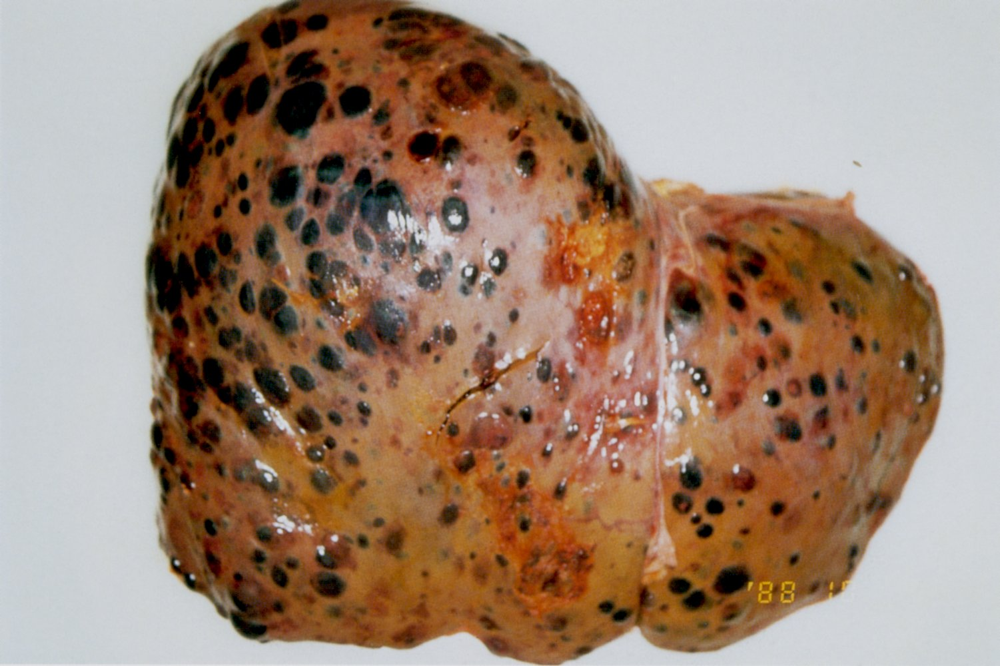

Metastatic melanoma of the liver

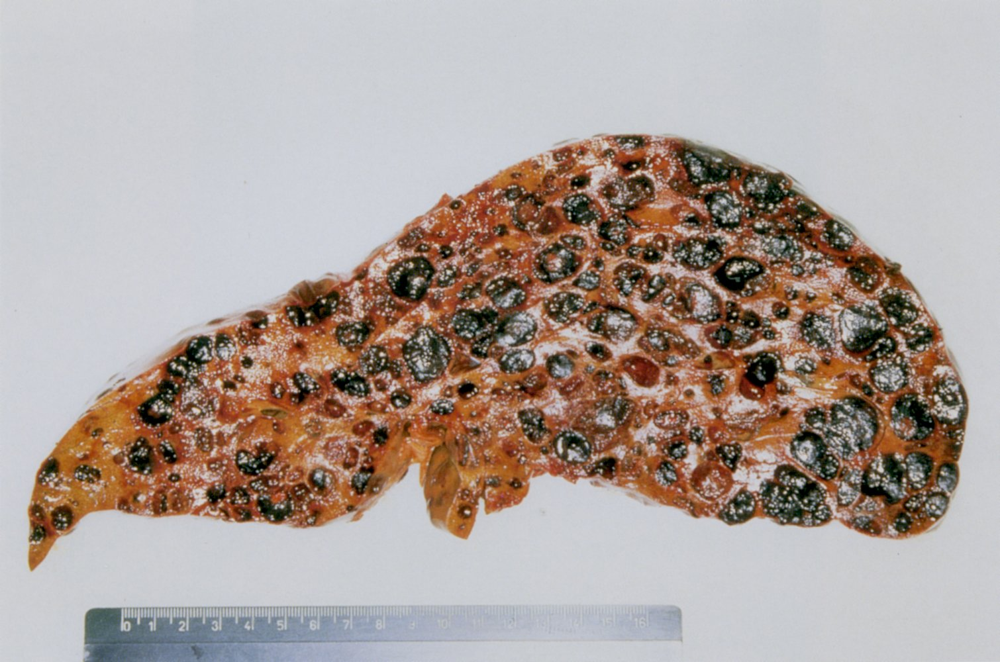

Metastatic melanoma of the liver

Most common routes of metastasis with TNM classification

We list the most important complications. The selection is not exhaustive.

---

## Prognosis

* Negative prognostic features

* Increased <u>Breslow depth</u> (thickness from the <u>stratum granulosum</u> to the lowest detectable <u>tumor</u> cell, which correlates with the risk of <u>metastasis</u>) [[27]](https://coursology-qbank.com/amboss/article/tjcXXc0)

* <u>Ulceration</u>

* High <u>mitotic rate</u>

* <u>Melanoma microsatellitosis</u>

* Malignant cells at the margins of the <u>biopsy</u> specimen

> [!TIP]
> <u>Lentigo maligna</u>, the premalignant lesion of <u>lentigo maligna melanoma</u>, has excellent prognosis if treated appropriately. [[39]](https://coursology-qbank.com/amboss/article/5WdiNK0)

---