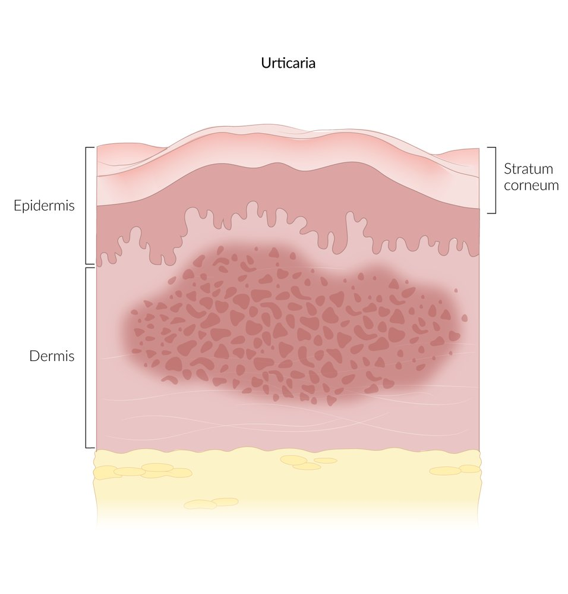
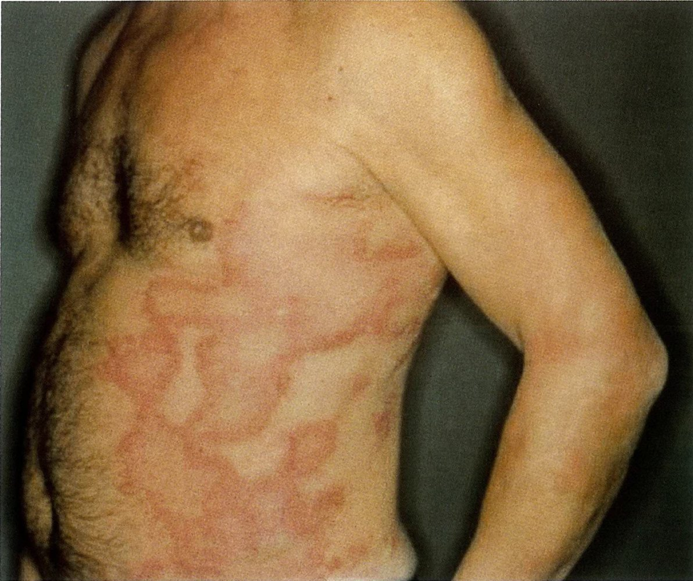
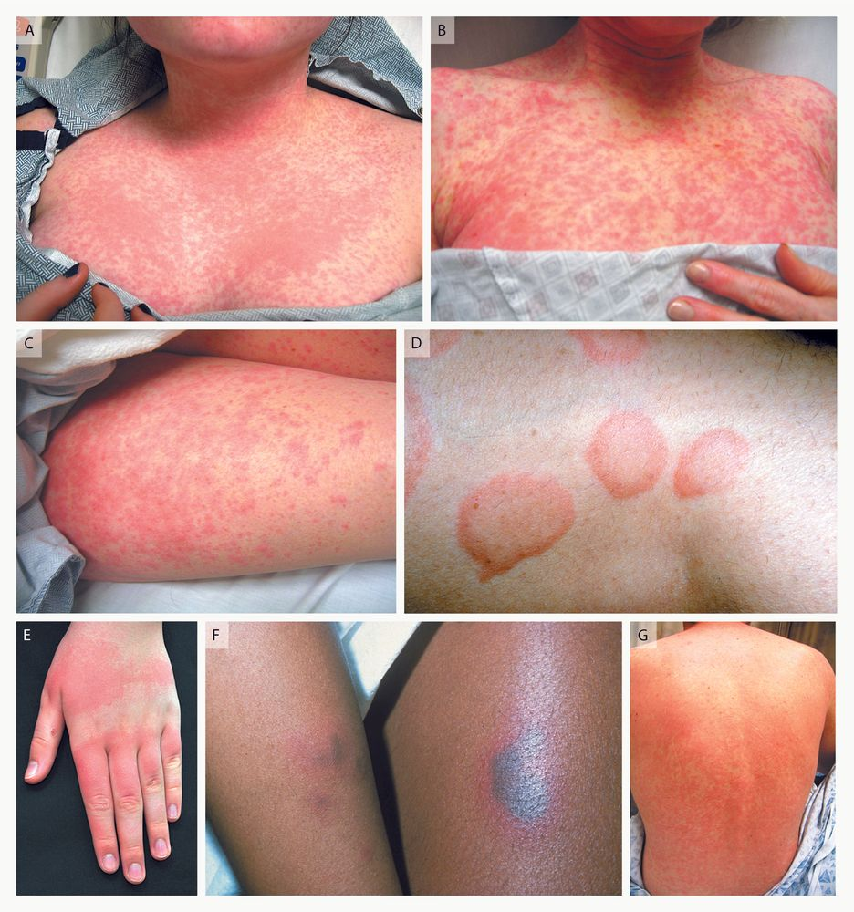
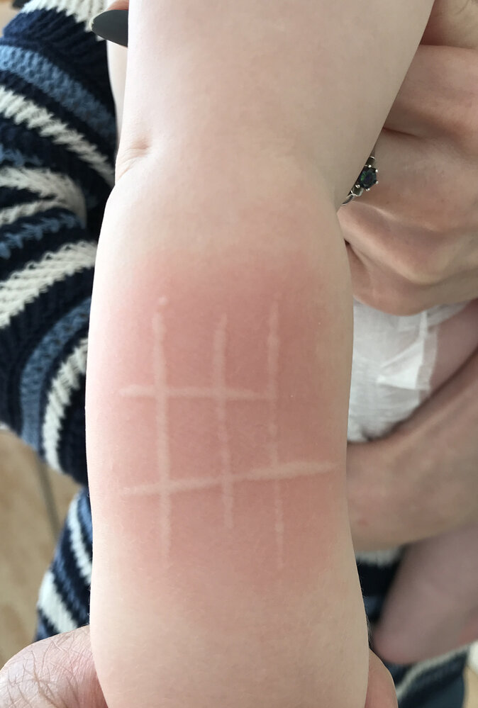

# Urticaria

*Categories: Clinical knowledge > Emergency medicine > Dermatologic disorders > Urticaria*

[Original Article Link](https://coursology-qbank.com/amboss/article/xt0Ef3)

---

## Summary

Urticaria is an inflammatory <u>skin</u> disorder characterized by <u>hives</u> (<u>wheals</u>) with or without <u>angioedema</u>. Urticaria is classified as acute (≤ 6 weeks duration) or chronic (> 6 weeks duration). Causes of urticaria vary and include <u>food allergies</u>, environmental factors (e.g., cold, heat), and systemic conditions (e.g., <u>vasculitis</u>, infections, <u>malignancy</u>). <u>Acute urticaria</u> is often <u>self-limited</u>, and a trigger may not be identified. <u>Chronic urticaria</u> usually requires further testing (e.g., <u>in vivo allergy skin tests</u>) to establish the cause and assess for underlying conditions (e.g., autoimmune diseases). The mainstay of treatment is <u>second-generation antihistamines</u> and avoidance of identified triggers and/or management of underlying conditions.

---

## Definitions

* Urticaria: : an inflammatory <u>skin</u> disorder characterized by <u>hives</u> with or without <u>angioedema</u> [[1]](https://coursology-qbank.com/amboss/article/HP1KTS0)

* <u>Hives</u>:  (<u>wheals</u>): well-circumscribed, pruritic, and <u>erythematous</u> <u>plaques</u> (round, oval, or <u>serpiginous</u>) that can be several centimeters in diameter [[1]](https://coursology-qbank.com/amboss/article/HP1KTS0)

* <u>Acute urticaria</u>: urticaria that lasts ≤ 6 weeks [[1]](https://coursology-qbank.com/amboss/article/HP1KTS0)

* <u>Chronic urticaria</u>: continuous or intermittent urticaria that lasts > 6 weeks [[1]](https://coursology-qbank.com/amboss/article/HP1KTS0)

---

## Etiology

Urticaria may be spontaneous or induced. [[2]](https://coursology-qbank.com/amboss/article/yjdd1J0)

### <u>Type I hypersensitivity reaction</u> (HSR) and <u>pseudoallergy</u> [[2]](https://coursology-qbank.com/amboss/article/yjdd1J0)

* Foods, especially the <u>big 9 food allergens</u>, i.e.: [[3]](https://coursology-qbank.com/amboss/article/UOdb7J0)

* Animal products: milk, eggs, fish, shellfish

* Legumes: tree nuts, peanuts, soybeans

* Other: wheat, sesame

* <u>Insect stings</u> or bites, e.g., <u>Hymenoptera stings</u>

* Contact <u>allergens</u>, e.g., latex

* Medications (<u>IgE</u> or non-<u>IgE</u>-mediated), e.g.:

* <u>Sulfonamides</u>

* <u>Antibiotics</u>, e.g., <u>beta-lactams</u>, <u>vancomycin</u>

* <u>Anticonvulsants</u>

* <u>NSAIDs</u>, <u>opioids</u>

* <u>Chemotherapy agents</u>

* Radiocontrast media

### <u>Physical urticaria</u> triggers [[2]](https://coursology-qbank.com/amboss/article/yjdd1J0)

* Cold exposure

* Sunlight

* Pressure

* Vibration

### Infectious diseases (infection-induced urticaria) [[2]](https://coursology-qbank.com/amboss/article/yjdd1J0)

* <u>Viruses</u>, e.g., <u>rotavirus</u>, <u>rhinovirus</u>, <u>HBV</u>, <u>HCV</u>, <u>EBV</u>, <u>HSV</u>, <u>parvovirus B19</u>

* Bacteria, e.g., <u>Mycoplasma pneumoniae</u>, group A <u>streptococcus</u>, <u>Helicobacter pylori</u>

* Parasitic infections, e.g., <u>Anisakis</u> simplex, <u>Plasmodium falciparum</u>

### Systemic conditions [[2]](https://coursology-qbank.com/amboss/article/yjdd1J0)

* <u>Cutaneous small-vessel vasculitis</u> (<u>CSVV</u>)

* <u>Multiple myeloma</u>

### Hormonal changes [[2]](https://coursology-qbank.com/amboss/article/yjdd1J0)

* <u>Pregnancy</u>

* <u>Menstruation</u>

* Hormonal therapies

* <u>Thyroid disease</u>

### Other [[2]](https://coursology-qbank.com/amboss/article/yjdd1J0)

* <u>Cholinergic urticaria</u>: heat, exercise, sweating

* Emotional <u>stress</u>

* <u>Aquagenic urticaria</u> (water)

---

## Pathophysiology

* Trigger (urticaria may occur spontaneously) → <u>mast cell</u> activation and <u>degranulation</u> in the <u>superficial</u> <u>dermis</u> → <u>microvasculature</u> hyperpermeability → <u>edema</u> [[1]](https://coursology-qbank.com/amboss/article/HP1KTS0)

* <u>Pseudoallergy</u> causes direct release of vasoactive substances from <u>mast cells</u> without <u>IgE</u> involvement. [[4]](https://coursology-qbank.com/amboss/article/6nYj8p)

> [!TIP]
> Urticaria is not always a <u>type I HSR</u>. [[1]](https://coursology-qbank.com/amboss/article/HP1KTS0)[[4]](https://coursology-qbank.com/amboss/article/6nYj8p)

Urticaria (primary lesion)

---

## Clinical evaluation

### Focused history [[1]](https://coursology-qbank.com/amboss/article/HP1KTS0)[[5]](https://coursology-qbank.com/amboss/article/_jd51J0)[[6]](https://coursology-qbank.com/amboss/article/kMcmK10)

* Approximate date of onset (acute vs. chronic)

* Recent exposures, e.g.:

* New foods (e.g., in <u>infants</u>)

* Medical interventions (e.g., imaging studies with contrast, <u>vaccinations</u>, medications)

* Travel or time spent in nature

* Duration and associated symptoms

* <u>Typical hives</u>

* Lesions resolve within 24 hours [[1]](https://coursology-qbank.com/amboss/article/HP1KTS0)[[5]](https://coursology-qbank.com/amboss/article/_jd51J0)

* Pruritis or a burning sensation

* <u>Atypical hives</u>

* Lesions persist > 24–48 hours

* May be painful

* Personal and/or <u>family history</u>

* Urticaria or isolated <u>angioedema</u> (including any treatment received)

* <u>Atopy</u>

* <u>Type I HSR</u> (e.g., to food, medications, latex)

* Systemic diseases (e.g., <u>RA</u>, <u>SLE</u>, <u>T1DM</u>)

### Focused examination [[1]](https://coursology-qbank.com/amboss/article/HP1KTS0)[[5]](https://coursology-qbank.com/amboss/article/_jd51J0)[[6]](https://coursology-qbank.com/amboss/article/kMcmK10)

* <u>Clinical features of angioedema</u>, e.g., facial <u>edema</u>, <u>inspiratory stridor</u>

* Typical hives 

* Well-circumscribed, <u>erythematous</u> round, oval, or <u>serpiginous</u> <u>plaques</u>

* Variable size: may be several centimeters in diameter

* Blanchable with pressure

* No residual <u>hyperpigmentation</u>

* Atypical hives

* <u>Purpuric</u> (may indicate an underlying systemic condition)

* Residual <u>hyperpigmentation</u>

* Assess for <u>dermographism</u>.

* Record the distribution of the lesions, e.g., limited to exposed areas in patients with <u>physical urticaria</u>.

* Ask for pictures if there are no lesions at the time of evaluation.

> [!TIP]
> Features of <u>atypical hives</u> include duration more than 24–48 hours for an individual lesion, <u>pain</u>, residual <u>hyperpigmentation</u>, and <u>purpura</u>, and they may suggest an underlying systemic condition (e.g., <u>CSVV</u>). [[1]](https://coursology-qbank.com/amboss/article/HP1KTS0)[[2]](https://coursology-qbank.com/amboss/article/yjdd1J0)

Urticaria

Urticaria

Urticaria

Urticaria (hives)

Urticaria

Urticaria

---

## Diagnosis

The following applies to <u>hives</u> with or without <u>angioedema</u>. For isolated <u>angioedema</u>, see “<u>Angioedema</u>.”

### Approach [[1]](https://coursology-qbank.com/amboss/article/HP1KTS0)[[2]](https://coursology-qbank.com/amboss/article/yjdd1J0)[[5]](https://coursology-qbank.com/amboss/article/_jd51J0)[[6]](https://coursology-qbank.com/amboss/article/kMcmK10)

* <u>Acute urticaria</u>

* Routine diagnostic studies are not indicated for spontaneous, <u>typical hives</u>.

* Obtain targeted testing for patients with:

* <u>Atypical hives</u>

* Identified potential triggers (e.g., <u>food allergy</u>, <u>drug hypersensitivity reaction</u>, infection)

* <u>Chronic urticaria</u>: There is no consensus on the optimal evaluation of <u>chronic urticaria</u>; consult an allergist. [[5]](https://coursology-qbank.com/amboss/article/_jd51J0)

* <u>Typical hives</u> and suspected <u>chronic spontaneous urticaria</u>: initial diagnostic tests followed by targeted testing

* <u>Atypical hives</u> or suspected <u>chronic inducible urticaria</u>: targeted testing based on clinical suspicion

### Initial diagnostic tests [[5]](https://coursology-qbank.com/amboss/article/_jd51J0)

* <u>CBC with differential</u>

* <u>Inflammatory markers</u>, e.g., <u>CRP</u>, <u>ESR</u>

* Specialized testing: <u>anti-TPO</u>, total <u>IgE</u>

* Consider additional tests, e.g., <u>liver</u> enzymes, <u>LDH</u>, <u>TSH</u> [[1]](https://coursology-qbank.com/amboss/article/HP1KTS0)

### Targeted testing [[1]](https://coursology-qbank.com/amboss/article/HP1KTS0)[[5]](https://coursology-qbank.com/amboss/article/_jd51J0)

* <u>Allergy testing</u>

* <u>Hypersensitivity blood tests</u>

* <u>In vivo allergy skin tests</u>

* Challenge tests (e.g., <u>graded challenge test</u>, <u>oral food challenge</u>) to rule out unlikely drug or food <u>hypersensitivity reactions</u>

* Physical urticaria provocation tests: based on the suspected cause or trigger [[2]](https://coursology-qbank.com/amboss/article/yjdd1J0)[[5]](https://coursology-qbank.com/amboss/article/_jd51J0)

* Scratching the <u>skin</u> for suspected <u>dermographism</u>

* Ice cube in a plastic bag for suspected <u>cold urticaria</u>

* Exercise or hot bath for suspected <u>cholinergic urticaria</u>

* Autoimmune disease workup

* <u>Laboratory studies</u>

* <u>ANAs</u>, <u>ANCA</u>, RF, <u>complement</u> levels

* <u>Thyroid autoantibodies</u>

* <u>Skin biopsy</u>: if <u>vasculitis</u> is suspected

* Infectious disease workup

* <u>Hepatitis B serology</u> and <u>hepatitis C serology</u>

* <u>HIV screening</u>

* Stool analysis for <u>ova</u> and <u>parasites</u>

* <u>Malignancy</u> workup

* Serum and <u>urine protein electrophoresis</u> for <u>multiple myeloma</u>

* <u>Biopsy</u> of affected organs, e.g., <u>bone marrow biopsy</u> for <u>leukemia</u>

---

## Management

### General principles [[1]](https://coursology-qbank.com/amboss/article/HP1KTS0)[[5]](https://coursology-qbank.com/amboss/article/_jd51J0)[[6]](https://coursology-qbank.com/amboss/article/kMcmK10)

* Provide symptomatic <u>management of urticaria</u> with a <u>second-generation antihistamine</u> (e.g., <u>cetirizine</u>).

* Educate patients on avoidance of identified triggers and nonspecific triggers such as <u>stress</u> and <u>NSAIDs</u>. [[5]](https://coursology-qbank.com/amboss/article/_jd51J0)

* A trigger for <u>acute urticaria</u> may not be identified; most cases are <u>self-limited</u>. [[5]](https://coursology-qbank.com/amboss/article/_jd51J0)

* Management of <u>chronic spontaneous urticaria</u> consists of identifying and treating underlying conditions, e.g., infections, <u>malignancy</u>.

* Follow-up should be performed after 2–6 weeks to assess the response. [[1]](https://coursology-qbank.com/amboss/article/HP1KTS0)

### Symptomatic urticaria management [[2]](https://coursology-qbank.com/amboss/article/yjdd1J0)[[5]](https://coursology-qbank.com/amboss/article/_jd51J0)[[6]](https://coursology-qbank.com/amboss/article/kMcmK10)

* <u>Second-generation antihistamines</u>: first line

* Indications: acute;  (<u>off-label</u>) and <u>chronic urticaria</u>

* Agents: <u>cetirizine</u> DOSAGE , <u>loratadine</u> DOSAGE , OR <u>fexofenadine</u> DOSAGE

* Use should be scheduled rather than on demand until <u>hives</u> resolve.

* <u>Glucocorticoids</u> (in consultation with a specialist) [[2]](https://coursology-qbank.com/amboss/article/yjdd1J0)[[5]](https://coursology-qbank.com/amboss/article/_jd51J0)

* Indication: severe urticaria exacerbations

* Short courses (< 10 days) of <u>systemic glucocorticoids</u> (e.g., <u>prednisone</u>) may be considered.

* Additional therapy: combination therapy with <u>second-generation antihistamines</u>

* Indication: refractory <u>chronic urticaria</u>

* Agents

* <u>Omalizumab</u> (<u>off-label</u>)  [[5]](https://coursology-qbank.com/amboss/article/_jd51J0)

* <u>Cyclosporine</u> (<u>off-label</u>) [[2]](https://coursology-qbank.com/amboss/article/yjdd1J0)

* Other agents, e.g., <u>montelukast</u>, <u>famotidine</u>, biologic agents (low level of evidence)

> [!TIP]
> Approximately 60% of <u>acute urticaria</u> cases resolve within 1 week. [[2]](https://coursology-qbank.com/amboss/article/yjdd1J0)

> [!WARNING]
> <u>First-generation antihistamines</u> should be used with caution, especially in older adults and children, due to their potential serious adverse effects (e.g., sedation, <u>motor function</u> impairment). [[1]](https://coursology-qbank.com/amboss/article/HP1KTS0)[[5]](https://coursology-qbank.com/amboss/article/_jd51J0)

---

## Mimics

* <u>Atopic dermatitis</u>

* <u>Fixed drug eruptions</u>

* <u>Contact dermatitis</u>

* <u>Erythema multiforme</u>

* <u>Papular</u> urticaria

* <u>IgA vasculitis</u>

* <u>Pityriasis rosea</u>

* <u>Viral exanthem</u>

* <u>Urticaria pigmentosa</u>

* <u>CSVV</u>, e.g., urticarial <u>vasculitis</u>  [[7]](https://coursology-qbank.com/amboss/article/hcYcXL)

* <u>Cryoglobulinemic vasculitis</u>

* See also “<u>Overview of annular skin lesions</u>.”

Papular urticaria

---