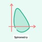
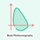
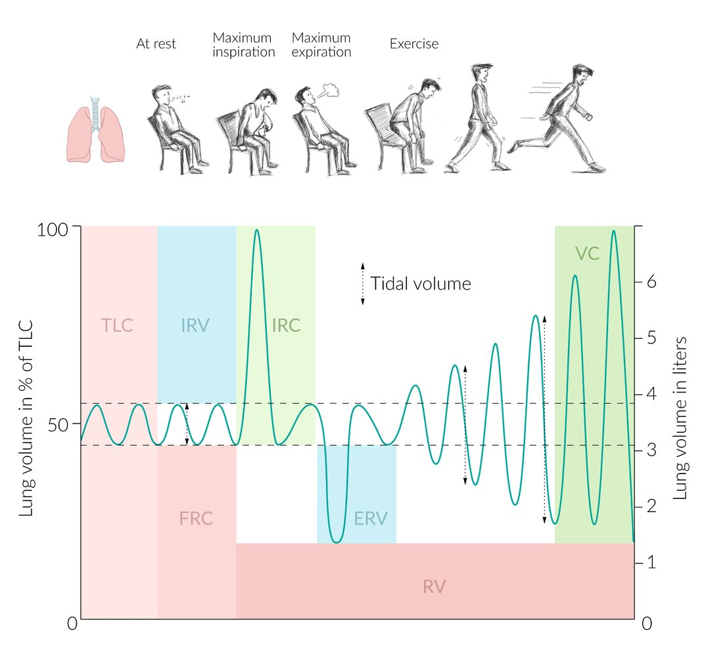
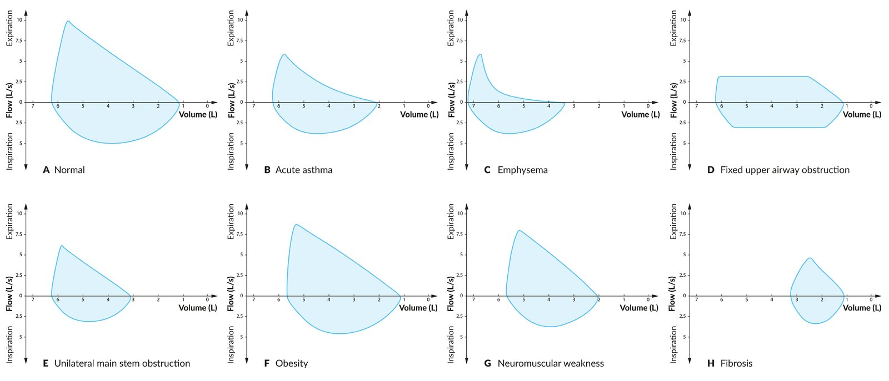
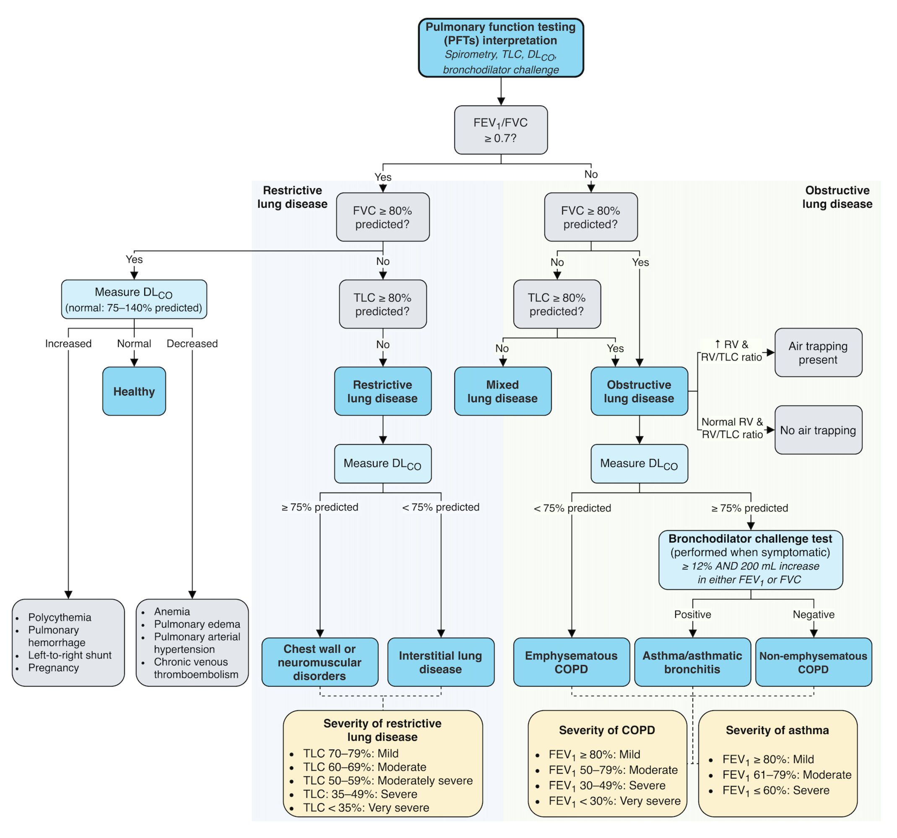
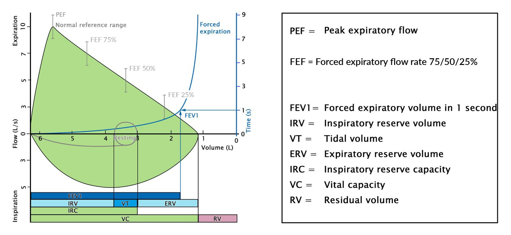
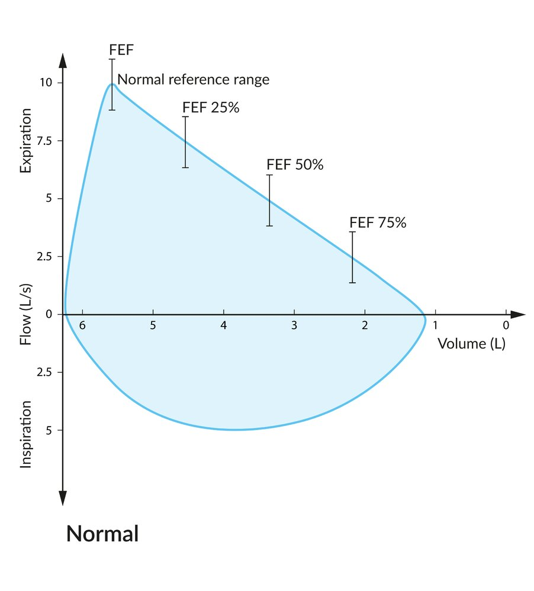

# Pulmonary function testing

*Categories: Clinical knowledge > Emergency medicine > Diagnostics > Pulmonary function testing*

[Original Article Link](https://coursology-qbank.com/amboss/article/Fl0gAT)

---

## Summary

Pulmonary function tests (PFTs) measure <u>lung volumes</u> and other metrics of pulmonary function. They can be used to diagnose ventilatory disorders and differentiate between obstructive and <u>restrictive lung diseases</u>. The most common PFT is <u>spirometry</u>, which requires the patient to breathe forcefully through their mouth into an external device. This simple and cost-effective test measures both dynamic and static <u>lung</u> volume (with the exception of <u>residual volume</u> and <u>total lung capacity</u>) and airflow rates. <u>Full-body plethysmography</u> measures both <u>residual volume</u> and <u>total lung capacity</u> in a sealed chamber. <u>Single-breath diffusing capacity</u> helps determine if the alveolar membrane is thickened (e.g., in <u>pulmonary fibrosis</u>) or destroyed (e.g., in <u>emphysema</u>), and if the pulmonary vasculature is affected (e.g., in <u>pulmonary hypertension</u>).

Spirometry: Procedure and Results

Body Plethysmography: Procedure, Purpose, and Uses

Pulmonary Function Testing: Pathological Findings

---

## PFT interpretation

### General principles [[2]](https://coursology-qbank.com/amboss/article/fJ1kt30)[[3]](https://coursology-qbank.com/amboss/article/HJ1Kv30)

* The first step in <u>PFT interpretation</u> is confirming the <u>validity</u> of the measurements.

* <u>Spirometry</u> and <u>body plethysmography</u> measure <u>lung volumes</u> and can differentiate between <u>obstructive vs. restrictive lung diseases</u>.

* Additional testing may be indicated to further characterize the disease and narrow down the differential diagnosis, e.g.:

* <u>Single-breath diffusing capacity</u>

* <u>Bronchial challenge testing</u> or <u>bronchodilator responsiveness testing</u>

* <u>Respiratory muscle function</u> testing

* A diagnosis cannot be made based on PFT results alone.

> [!TIP]
> Correlate PFT results with a detailed history and findings from a comprehensive <u>physical examination</u> and additional diagnostic studies.

### Normal <u>lung volumes</u>

Normal <u>lung volumes</u> depend on age, height, and sex.  The values listed below are for a healthy young adult. [[1]](https://coursology-qbank.com/amboss/article/Fp1gr30)[[2]](https://coursology-qbank.com/amboss/article/fJ1kt30)[[3]](https://coursology-qbank.com/amboss/article/HJ1Kv30)

|  Normal <u>lung volumes</u> [[4]](https://coursology-qbank.com/amboss/article/iJ1JF30)  |  |  |
| --- | --- | --- |
|  | Definition | Normal range |
| <u>Total lung capacity</u> (TLC) | Volume of air in the <u>lungs</u> after maximal inhalation   | 6–6.5 L |
| <u>Vital capacity</u> (<u>VC</u>) | Difference in <u>lung</u> volume between maximal exhalation and maximal inhalation   | 4.5–5 L |
| <u>Residual volume</u> (RV) | Volume of air that remains in the <u>lungs</u> after maximal exhalation | 1–1.5 L |
| <u>Tidal volume</u> (TV) | Volume of air that is inhaled and exhaled in a normal breath at rest |  ∼ 500 mL or 7 mL/kg  |
| <u>Inspiratory reserve volume</u> (<u>IRV</u>) | Maximum volume of air that can still be forcibly inhaled following the inhalation of a normal TV | 3–3.5 L |
| <u>Inspiratory capacity</u> (IC) | Maximum volume of air that can be inhaled after the exhalation of a normal TV   | 3.5–4 L |
| <u>Expiratory reserve volume</u> (<u>ERV</u>) | Maximum volume of air that can still be forcibly exhaled after the exhalation of a normal TV | 1.5 L |
| <u>Expiratory capacity</u> (EC) | Maximum volume of air that can be exhaled after the inspiration of a normal TV    | 2 L |
| <u>Functional residual capacity</u> (<u>FRC</u>) | Volume of air that remains in the <u>lungs</u> after the exhalation of a normal TV   | 2.5–3 L |

Physiological lung volumes

### Altered PFTs  [[2]](https://coursology-qbank.com/amboss/article/fJ1kt30)[[3]](https://coursology-qbank.com/amboss/article/HJ1Kv30)

#### Approach

* Assess <u>lung volumes</u> (on <u>spirometry</u> and/or <u>body plethysmography</u>): to determine the main pattern of disease

* ↓ <u>FEV1/FVC ratio</u>

* Normal or ↑ TLC: <u>obstructive lung disease</u>

* ↓ TLC: mixed obstructive and <u>restrictive lung disease</u> (e.g., <u>COPD</u> plus <u>obesity</u>, or <u>silicosis</u>)

* ↓ <u>FVC</u> and ↓ TLC: <u>restrictive lung disease</u>

* Assess <u>lung</u> <u>diffusion capacity</u> (by measuring <u>DLCO</u>)

* To further characterize obstructive and <u>restrictive lung diseases</u>

* Abnormal <u>DLCO</u> in patients with normal <u>lung volumes</u> suggests one of the following:

* Pulmonary vascular diseases (e.g., <u>pulmonary hypertension</u>)

* Other systemic disorders (e.g., <u>anemia</u>)

* Early <u>interstitial lung disease</u>

* See “<u>Interpretation of DLCO</u>.”

* Determine disease severity: 

* Using either <u>z-scores</u> or fixed values; see “Severity assessment.”

* See also “<u>Classification of asthma severity</u>” and “<u>COPD classification</u>.”

* Consider specialized testing in <u>obstructive lung disease</u>.

* <u>Bronchodilator responsiveness test</u> to assess the reversibility of the obstruction

* <u>Bronchoprovocation test</u> to assess <u>airway</u> hyperresponsiveness

* Correlate results: with clinical, laboratory, and imaging findings; see “Differential diagnoses”

|  PFT findings in obstructive vs. restrictive lung diseases  [[2]](https://coursology-qbank.com/amboss/article/fJ1kt30)[[5]](https://coursology-qbank.com/amboss/article/Ev08bR)[[6]](https://coursology-qbank.com/amboss/article/1LX29A)  |  |  |  |
| --- | --- | --- | --- |
|  |  | <u>Obstructive lung disease</u> | <u>Restrictive lung disease</u> |
| Spirometric findings | <u>FEV1</u> |  ↓ < 80% of the predicted value or the <u>LLN</u>  | Normal or ↓ |
| <u>FEV1/FVC</u> |  ↓ (because ↓ in <u>FEV1</u> > ↓ in <u>FVC</u>)   | Normal or ↑ (because ↓ in <u>FEV1</u> is proportional to ↓ in <u>FVC</u>) |  |
| <u>VC</u> |  ↓ < 80% of the predicted value or the <u>LLN</u>  | ↓ |  |
| <u>Flow-volume loop</u> |  Air trapping: scalloping of the expiratory limb; seen in conditions such as <u>emphysema</u> and in patients who have undergone a <u>pneumectomy</u>    |  Narrow <u>flow-volume loop</u>   |  |
| <u>Plethysmograph</u> findings | RV |  ↑ ≥ 120% of the predicted value or the <u>ULN</u>  |  Normal or ↓   |
| <u>FRC</u> | ↑ | ↓ |  |
| TLC | Normal or ↑  | ↓ |  |
| <u>Airway resistance</u> | ↑ | Normal |  |
| <u>Lung compliance</u> | Normal | Normal (extrinsic causes) or ↓ (intrinsic causes)  |  |
| <u>DLCO</u> |  | Variable (e.g., ↓ in <u>emphysema</u>, ↑ or normal in <u>bronchial asthma</u>, normal in <u>chronic bronchitis</u>) | Variable (e.g., normal with extrinsic causes, ↓ with intrinsic causes) |

Flow-volume loop in obstructive and restrictive lung diseases

Flow-volume loop in obstructive lung diseases

Flow-volume loop in restrictive lung disease

Overview of flow-volume loops

Differential diagnoses of pulmonary function testing (PFTs)

#### Severity assessment [[7]](https://coursology-qbank.com/amboss/article/JJ1sE30)[[8]](https://coursology-qbank.com/amboss/article/ws1hCR0)

For patients with obstructive or <u>restrictive lung diseases</u>, disease severity may be assessed using either:

* <u>Z-scores</u>

* Based on <u>LLN</u> (i.e., 5th <u>percentile</u>) and <u>ULN</u> (i.e., 95th <u>percentile</u>) across different age groups

* Higher diagnostic <u>accuracy</u> than fixed values

* Fixed values 

* Based on average values in healthy middle-aged men (e.g., <u>FEV1</u> > 80% of predicted) [[7]](https://coursology-qbank.com/amboss/article/JJ1sE30)

* May lead to inaccurate results  [[8]](https://coursology-qbank.com/amboss/article/ws1hCR0)

> [!TIP]
> The American Thoracic Society and European Respiratory Society recommend the use of <u>z-scores</u> to assess disease severity. However, despite their limitations, fixed values are still recommended by the <u>Global</u> Initiative for Chronic Obstructive <u>Lung</u> Disease. [[7]](https://coursology-qbank.com/amboss/article/JJ1sE30)[[8]](https://coursology-qbank.com/amboss/article/ws1hCR0)

### Differential diagnoses [[5]](https://coursology-qbank.com/amboss/article/Ev08bR)

#### Obstructive lung disease

* Definition: increased resistance to airflow caused by narrowing of <u>airways</u>

* Etiology

* <u>COPD</u> (<u>chronic bronchitis</u>, <u>emphysema</u>)

* Bronchial <u>asthma</u>

* <u>Bronchiectasis</u>, <u>cystic fibrosis</u>

* Narrowing of extrathoracic <u>airways</u>: laryngeal tumors, <u>vocal cord palsy</u>

* Diagnostic findings

* Imaging findings

* Hyperlucency of <u>lung tissue</u>

* Horizontal <u>ribs</u> and widened <u>intercostal spaces</u>

* Increased <u>anteroposterior diameter</u>

* <u>Diaphragm</u> pushed down and flattened

* <u>A-a gradient</u>: ↑

#### Restrictive lung disease

* Definition: impaired ability of the <u>lungs</u> to expand (as a result of reduced <u>lung compliance</u>)

* Intrinsic causes (<u>parenchymal</u> diseases)

* <u>Interstitial lung disease</u>

* <u>Sarcoidosis</u>

* <u>Pneumoconioses</u>

* <u>ARDS</u>

* <u>Idiopathic pulmonary fibrosis</u>

* <u>Hypersensitivity pneumonitis</u>

* <u>Granulomatosis with polyangiitis</u>

* Pulmonary <u>Langerhans cell histiocytosis</u>

* <u>Radiation-induced lung injury</u>

* <u>Drug-induced interstitial lung disease</u> (e.g., due to <u>MTX</u>, <u>bleomycin</u>, <u>busulfan</u>, <u>amiodarone</u>)

* Alveolar (e.g., <u>pneumonia</u>, <u>pulmonary edema</u>, hemorrhage)

* Extrinsic causes (i.e., extrapulmonary conditions that change the mechanics of respiration)

* Diseases of the <u>pleura</u> and <u>pleural cavity</u> (e.g., chronic <u>pleural effusion</u>, pleural adhesions, <u>pneumothorax</u>)

* Deformities of the thorax/mechanical limitation;  (e.g., <u>kyphoscoliosis</u>; , <u>ankylosing spondylitis</u>, <u>obesity</u>, <u>ascites</u>, <u>pregnancy</u>)

* <u>Respiratory muscle weakness</u>;  (e.g., <u>phrenic nerve</u> palsy, <u>myasthenia gravis</u>, <u>polio</u>, <u>GBS</u>, <u>ALS</u>, <u>myopathies</u>): See “<u>Respiratory muscle function</u>.” [[9]](https://coursology-qbank.com/amboss/article/cLXa9A)

* Diagnostic findings

* Imaging findings: depends on the underlying disease (can be normal)

* <u>Interstitial lung disease</u>: reticular opacities (sign of <u>fibrosis</u>)

* <u>Pleural effusion</u>: unilateral blunting of the <u>costophrenic angle</u>

* <u>Pneumothorax</u>: unilateral <u>pleural line</u> with reduced/absent <u>lung markings</u>

* <u>A-a gradient</u>

* Normal (extrinsic causes)

* ↑ (intrinsic causes)

#### Other

* Pulmonary vascular diseases

* <u>Pulmonary hypertension</u>

* <u>Pulmonary embolism</u>

* <u>Hepatopulmonary syndrome</u>

* Systemic disorders

* <u>Carboxyhemoglobinemia</u> (e.g., due to smoking)

* <u>Anemia</u>

* <u>Polycythemia</u>

* Mild <u>heart failure</u> and left-to-right cardiac shunts

* Diagnostic findings

* Imaging findings: depend on the underlying disease (can be normal)

* Normal <u>lung volumes</u> on <u>spirometry</u> and plethysmography

* Abnormal <u>DLCO</u> findings; see also “<u>Interpretation of DLCO</u>.”

---

## Spirometry

### Indications

<u>Spirometry</u> is the best initial test for the evaluation of pulmonary function; see “Indications” above.

### Procedure [[5]](https://coursology-qbank.com/amboss/article/Ev08bR)

* The patient breathes forcefully through their mouth into an external device.

* Four phases of inspiration and expiration are measured to determine <u>lung volumes</u> and airflow rates.  [[1]](https://coursology-qbank.com/amboss/article/Fp1gr30)

* Maximal inspiration: measures <u>vital capacity</u> (<u>VC</u>)

* Forced rapid expiration: measures <u>forced expiratory volume</u> in 1 second (<u>FEV1</u>)

* Continued complete expiration for up to 15 seconds: measures <u>expiratory vital capacity</u> (<u>EVC</u>) and <u>forced vital capacity</u> (<u>FVC</u>)

* Repeat maximal inspiration: measures <u>inspiratory vital capacity</u> (IVC)

* <u>Flow-volume loops</u> (i.e., graphical representation of <u>spirometry</u> results) are generated to demonstrate inspiratory and expiratory airflow (y-axis) against <u>lung</u> volume (x-axis)

* Can be combined with exercise to assess cardiopulmonary performance and metabolism (i.e., <u>CPET</u>)

### Parameters

|  Spirometry parameters [[5]](https://coursology-qbank.com/amboss/article/Ev08bR)[[7]](https://coursology-qbank.com/amboss/article/JJ1sE30)[[10]](https://coursology-qbank.com/amboss/article/9v0NXR)  |  |  |
| --- | --- | --- |
| Parameter | Definition |  Reference value  [[5]](https://coursology-qbank.com/amboss/article/Ev08bR)[[7]](https://coursology-qbank.com/amboss/article/JJ1sE30)[[10]](https://coursology-qbank.com/amboss/article/9v0NXR)  |
| Peak expiratory flow (<u>PEF</u>) |  * The maximum airflow rate attained during forced expiration (in L/second)   |  * ≥ 80% of the predicted average value or ≥ <u>LLN</u>   |
|  Vital capacity (<u>VC</u>)  |  * The change in <u>lung</u> volume between maximum inspiration and maximum expiration; can be measured using:  * Forced vital capacity (<u>FVC</u>): the maximum volume of air that can be forcefully expired after maximal inspiration (during forced respiratory maneuvers)  * Inspiratory vital capacity (IVC): the maximum volume of air that can be inspired after maximal expiration (during slow respiratory maneuvers)  * Expiratory vital capacity (<u>EVC</u>): the maximum volume of air that can be expired after maximal inspiration (during slow respiratory maneuvers)   |  * Approximately 4.5–5 L   |
| Forced expiratory volume in 1 second (<u>FEV1</u>) |  * The maximum volume of air that can be expired (forced expiratory volume) in the first second of forced expiration after maximum inspiration   |   * ≥ 80% of the predicted average value or ≥ <u>LLN</u>  * Or > 75% of <u>vital capacity</u>    |
|  FEV1/FVC ratio   |  * <u>Ratio</u> of <u>FEV1</u> to <u>FVC</u>   |  * ≥ 0.7 or ≥ <u>LLN</u>   |
|  Forced expiratory flow rate at 75%,50%, and 25% of <u>vital capacity</u> (FEF75%, FEF50%, FEF25%)  |  * Average airflow rates observed during forced expiration when 75% (FEF25%), 50% (FEF50%), and 25% (FEF75%) of the <u>vital capacity</u> remains in the <u>lungs</u>.   |  * ≥ 65% of the predicted average value or ≥ <u>LLN</u> [[11]](https://coursology-qbank.com/amboss/article/uv0pbR)   |

> [!TIP]
> I<u>VC</u>, <u>EVC</u>, and <u>FVC</u> values are similar in young healthy individuals. However, I<u>VC</u> > <u>EVC</u> > <u>FVC</u> in patients with <u>obstructive lung disease</u>. [[12]](https://coursology-qbank.com/amboss/article/Fv0gbR)[[13]](https://coursology-qbank.com/amboss/article/8v0ObR)

Physiological flow-volume loop

Normal flow-volume loop

Overview of flow-volume loops

### Interpretation

See “<u>PFT findings in obstructive vs. restrictive lung diseases</u>.”

---

## Specialized testing in obstructive lung disease

Specialized tests (i.e., <u>bronchial challenge tests</u> and/or <u>bronchodilator responsiveness testing</u>) may help distinguish <u>bronchial asthma</u> from other causes of <u>obstructive lung disease</u>.

| <u>Specialized tests in obstructive lung disease</u> |  |  |
| --- | --- | --- |
|  |  <u>Bronchial challenge test</u> (methacholine challenge test) [[14]](https://coursology-qbank.com/amboss/article/fq1kB30)  |  Bronchodilator responsiveness testing (<u>postbronchodilator test</u>) [[1]](https://coursology-qbank.com/amboss/article/Fp1gr30)[[2]](https://coursology-qbank.com/amboss/article/fJ1kt30)[[15]](https://coursology-qbank.com/amboss/article/D611M30)  |
| Indication |  * Patients with suspected <u>airway</u> hyperresponsiveness   |  * Patients with <u>airway obstruction</u>: to differentiate (partly) reversible obstruction from irreversible obstruction   |
| Procedure |  * PFTs are performed before and after the administration of increasing doses of <u>methacholine</u>.   |  * <u>FEV1</u> and <u>airway resistance</u> are measured before and after the inhalation of a fast-acting <u>bronchodilator</u> (e.g., <u>albuterol</u>, <u>ipratropium bromide</u>). [[1]](https://coursology-qbank.com/amboss/article/Fp1gr30)   |
| Interpretation |   * Based on the dose of <u>methacholine</u> that results in ≥ 20% reduction in <u>FEV1</u> from baseline [[14]](https://coursology-qbank.com/amboss/article/fq1kB30)  * A reaction to low doses of <u>methacholine</u> suggests <u>airway</u> hyperresponsiveness (e.g., <u>bronchial asthma</u>).    |  * Positive response (i.e., the obstruction has a reversible component): defined as an increase in <u>FEV1</u> by ≥ 200 mL and ≥ 12% of the initial value  [[2]](https://coursology-qbank.com/amboss/article/fJ1kt30)[[15]](https://coursology-qbank.com/amboss/article/D611M30)[[16]](https://coursology-qbank.com/amboss/article/Nfd-m60)  * Usually indicates <u>asthma</u>  * May also be the result of a reversible component of <u>airway obstruction</u> in <u>COPD</u> [[1]](https://coursology-qbank.com/amboss/article/Fp1gr30)   |

> [!WARNING]
> Medications that reverse <u>bronchospasm</u> (e.g., <u>epinephrine</u>, <u>atropine</u>) should be kept at hand during the <u>methacholine challenge test</u> because the test may trigger a <u>life-threatening asthma</u> attack!

> [!TIP]
> In an indirect <u>bronchial challenge test</u>, bronchoconstriction may be induced by exercise, <u>hyperventilation</u>, or <u>mannitol</u>. [[17]](https://coursology-qbank.com/amboss/article/l61vO30)

---

## Single-breath diffusing capacity

<u>Single-breath diffusing capacity</u> measures the ability of the <u>alveoli</u> to transfer gases to the pulmonary <u>capillaries</u>.

### Indications [[4]](https://coursology-qbank.com/amboss/article/iJ1JF30)[[19]](https://coursology-qbank.com/amboss/article/Qq1uy30)

* <u>Restrictive lung disease</u> to differentiate between:

* Intrapulmonary (e.g., <u>interstitial lung disease</u>) causes

* Extrapulmonary (e.g., <u>pleural effusion</u>, <u>respiratory muscle weakness</u>) causes

* Intraparenchymal <u>lung</u> disease: to monitor disease progression

* <u>Hypoxemia</u> that remains unexplained after <u>spirometry</u> (e.g., due to <u>pulmonary embolism</u>)

### Procedure [[19]](https://coursology-qbank.com/amboss/article/Qq1uy30)

* The patient inhales an inert gas (e.g., helium) and a low concentration of <u>carbon monoxide</u> (CO).

* The patient then holds their breath for ∼ 10 seconds.

* On exhalation, the concentration of CO in the breath is measured.

### Parameters [[19]](https://coursology-qbank.com/amboss/article/Qq1uy30)

Results are highly dependent on <u>hemoglobin concentration</u>; reference values are therefore routinely adjusted.

* Carbon monoxide transfer coefficient (<u>KCO</u>): the amount of CO per unit time per unit <u>partial pressure</u> that is transferred from the <u>alveolus</u> to the pulmonary <u>capillary</u>

* Diffusing capacity of the lung for carbon monoxide (<u>DLCO</u>) : the product of <u>KCO</u> and total alveolar volume (VA)

> [!TIP]
> Certain activities, body positions, and physiologic states (e.g., exercise, <u>supine position</u>, <u>pregnancy</u>, <u>obesity</u>) can increase pulmonary blood volume thereby increasing <u>DLCO</u>.

### Interpretation

|  Interpretation of DLCO [[2]](https://coursology-qbank.com/amboss/article/fJ1kt30)[[4]](https://coursology-qbank.com/amboss/article/iJ1JF30)[[20]](https://coursology-qbank.com/amboss/article/1q12x30)  |  |  |  |
| --- | --- | --- | --- |
|  | <u>Obstructive lung disease</u> (↓ <u>FEV1/FVC</u> <u>ratio</u>) | <u>Restrictive lung disease</u> (↓ TLC) |  Other (no obstruction or restriction) |
|  ↓ <u>DLCO</u>   |  * <u>Emphysema</u>   |   * Late <u>interstitial lung disease</u>  * <u>Pneumonectomy</u> (↑ <u>KCO</u>)  * <u>Pulmonary edema</u>: e.g., as a result of severe <u>congestive heart failure</u> [[21]](https://coursology-qbank.com/amboss/article/-v0DcR)  * <u>Obesity</u>  [[22]](https://coursology-qbank.com/amboss/article/VLXG9A)    |   * Pulmonary vascular diseases (↓ <u>KCO</u>)  * <u>Pulmonary hypertension</u>  * <u>Pulmonary embolism</u>  * <u>Hepatopulmonary syndrome</u>  * Early <u>interstitial lung disease</u>  * Preexisting <u>carboxyhemoglobinemia</u> (e.g., due to smoking)  * <u>Anemia</u>    |
| Normal <u>DLCO</u> |   * <u>Chronic bronchitis</u>  * <u>Bronchial asthma</u>  * <u>Alpha-1 antitrypsin deficiency</u> [[23]](https://coursology-qbank.com/amboss/article/0D0e1R)  * <u>Bronchiectasis</u>, <u>cystic fibrosis</u> [[24]](https://coursology-qbank.com/amboss/article/aD0Q1R)    |   * <u>Respiratory muscle weakness</u>  * Pleural disorders  * Thoracic cage deformities  * <u>Obesity</u>    |  * Healthy individual   |
| ↑ <u>DLCO</u> |  * <u>Bronchial asthma</u>   |  * <u>Obesity</u>   |   * <u>Polycythemia</u>  * Mild <u>heart failure</u> and left-to-right cardiac shunts    |

---

## Respiratory muscle function testing

### Indication [[4]](https://coursology-qbank.com/amboss/article/iJ1JF30)[[25]](https://coursology-qbank.com/amboss/article/Oq1IA30)

Consider for <u>restrictive lung disease</u> to diagnose and monitor patients with <u>respiratory muscle weakness</u>.

### Procedure [[25]](https://coursology-qbank.com/amboss/article/Oq1IA30)

Test of inspiratory (e.g., <u>diaphragm</u>, <u>external intercostal muscles</u>) and expiratory (e.g., abdominal muscles, <u>internal intercostal muscles</u>) muscle function

* The patient inhales and exhales with as much force as possible against a closed mouthpiece or a pressure transducer in one nostril.

* The pressure generated at the mouth or nostril is recorded.

### Parameters [[25]](https://coursology-qbank.com/amboss/article/Oq1IA30)

* Maximal inspiratory pressure (<u>MIP</u>)

* Measure (in cmH2O) to evaluate inspiratory muscle function

* Determined by having the patient inhale with as much force as possible against a closed mouthpiece

* Values below -80 cmH2O in men and below -70 cmH2O in women rule out significant inspiratory <u>muscle weakness</u>.

* Sniff nasal inspiratory pressure (<u>SNIP</u>)

* Measure (in cmH2O) to evaluate inspiratory muscle function

* Determined by having the patient inhale with as much force as possible against a pressure transducer in one nostril .

* Values below -70 cmH2O in men and below -60 cmH2O in women rule out significant inspiratory <u>muscle weakness</u>.

* Maximal expiratory pressure (<u>MEP</u>)

* Measure (in cmH2O) to evaluate expiratory muscle function

* Determined by having the patient exhale with as much force as possible against a closed mouthpiece

* Values above 130 cmH2O in men and above 100 cmH2O in women rule out significant expiratory <u>muscle weakness</u>.

### Interpretation [[25]](https://coursology-qbank.com/amboss/article/Oq1IA30)

Alterations may be seen in:

* <u>Depression</u> of the <u>respiratory center</u> due to:

* Severe metabolic <u>encephalopathy</u>

* <u>Opioid overdose</u>

* <u>Brainstem</u> <u>stroke</u>

* <u>Traumatic brain injury</u>

* <u>Phrenic nerve</u> palsy due to:

* <u>Anterior horn cell</u> disorder (e.g., <u>amyotrophic lateral sclerosis</u>)

* <u>Peripheral neuropathy</u> (e.g., <u>Guillain-Barré syndrome</u>)

* <u>Myasthenia gravis</u>

* <u>Myopathies</u>;  (e.g., <u>thyrotoxic myopathy</u>, <u>muscular dystrophy</u>)

---