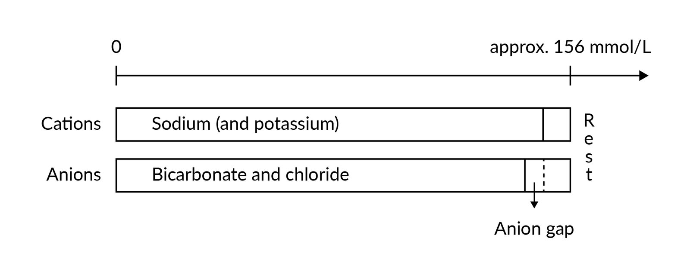
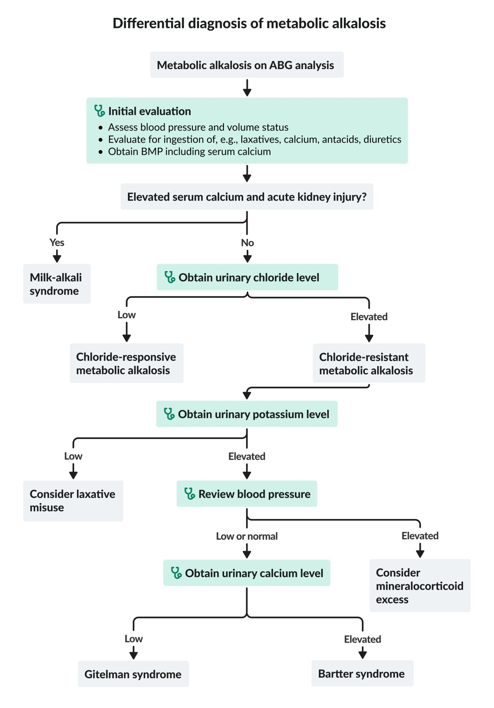

# Acid-base disorders

*Categories: Clinical knowledge > Emergency medicine > Endocrine and metabolic disorders > Acid-base disorders*

[Original Article Link](https://coursology-qbank.com/amboss/article/zL0rZS)

---

## Summary

Acid-base disorders are characterized by changes in the concentration of hydrogen ions (H+) in the body. Increased H+ concentration (<u>acidosis</u>) can lead to an abnormally low <u>blood pH</u> (<u>acidemia</u>) and decreased H+ concentration (<u>alkalosis</u>) can lead to an abnormally high <u>blood pH</u> (<u>alkalemia</u>); however, if compensation occurs, <u>acidosis</u> and/or <u>alkalosis</u> may be present without <u>acidemia</u> or <u>alkalemia</u>. <u>Acidosis</u> and <u>alkalosis</u> may be respiratory or metabolic in origin depending on the cause of the imbalance; they can also coexist as <u>mixed acid-base disorders</u>. Diagnosis is made based on <u>arterial blood gas</u> (<u>ABG</u>) results. In <u>metabolic acidosis</u>, calculation of the <u>anion gap</u> can also help determine the cause and reach a precise diagnosis. In <u>metabolic alkalosis</u>, urine <u>chloride</u> (Cl‑) concentration can help identify the cause. Treatment is based on the underlying cause.

---

## Definitions

* Acid-base processes  [[1]](https://coursology-qbank.com/amboss/article/KncU810)

* <u>Acidosis</u>: the processes by which H+ concentration is increased

* <u>Alkalosis</u>: the processes by which H+ concentration is decreased

* pH scale

* A logarithmic scale that expresses the acidity or alkalinity of a solution based on the concentration of H+ (<u>pH</u> = -log[H+])

* Neutral <u>pH</u> is 7; lower values are acidic and higher values are alkaline.

* <u>Blood pH</u> abnormalities

* <u>Acidemia</u>; : abnormally low <u>blood pH</u> (<u>pH</u> < 7.35)

* <u>Alkalemia</u>; : abnormally high <u>blood pH</u> (<u>pH</u> > 7.45)

---

## Pathophysiology

* The Henderson-Hasselbalch equation allows for the calculation of <u>pH</u> from <u>HCO3-</u> and <u>PCO2</u>: <u>pH</u> = 6.1 + log([<u>HCO3-</u>]/[0.03 × <u>pCO2</u>])

* 6.1 = pKa of <u>carbonic acid</u>

* 0.03 = solubility constant of <u>PCO2</u>

|  Pathophysiology of acid-base disorders [[2]](https://coursology-qbank.com/amboss/article/U30b3f) |  |  |  |  |  |
| --- | --- | --- | --- | --- | --- |
|  | Respiratory acidosis | Respiratory alkalosis | Metabolic acidosis |  | Metabolic alkalosis |
|  <u>pH</u>  |  * ↓   |  * ↑   |  * ↓   |  |  * ↑   |
| <u>PCO2</u> |  * ↑   |  * ↓   |  * Expected compensatory response: ↓   |  |  * Expected compensatory response: ↑   |
| <u>HCO3-</u> |  * Expected compensatory response: ↑   |  * Expected compensatory response: ↓   |  * ↓   |  |  * ↑   |
| Mechanism |  * Alveolar <u>hypoventilation</u> → <u>CO2 retention</u>   |  * ↑ <u>Respiratory rate</u> and/or <u>tidal volume</u> → alveolar <u>hyperventilation</u> → CO2 washout   |  * ↑ Production and/or ingestion of H+ or loss of <u>HCO3-</u>   |  |  * Loss of H+ or ↑ production/ingestion of <u>HCO3-</u>   |
| Compensation mechanisms in acid-base disorders |   * Acute compensation: buffers in blood  * Chronic compensation * ↓ Arterial <u>pH</u> (with ↑ <u>PCO2</u>) → ↑ <u>HCO3-</u> via:  * ↑ Reabsorption of <u>HCO3-</u> by the <u>proximal convoluted tubule</u>  * ↑ Excretion of H+ as H2PO4- and NH4+ from the <u>distal convoluted tubule</u> and <u>collecting duct</u>    |   * Acute compensation: buffers in blood  * Chronic compensation: * ↑ Arterial <u>pH</u> (with ↓ <u>PCO2</u>) → ↓ <u>HCO3-</u> via:  * ↓ Reabsorption of <u>HCO3-</u> by the <u>proximal convoluted tubule</u>  * ↓ Renal excretion of H+    |  * ↓ Arterial and <u>CSF</u> <u>pH</u> (with ↓ <u>HCO3-</u>) → ↑ stimulation of the medullary <u>chemoreceptors</u> → ↑ <u>respiratory rate</u> and/or <u>tidal volume</u> (<u>hyperventilation</u>) → ↑ CO2 washout → ↓ <u>PCO2</u>   |  |   * ↑ Arterial and <u>CSF</u> <u>pH</u> (with ↑ <u>HCO3-</u>) → ↓ stimulation of the medullary <u>chemoreceptors</u> → ↓ <u>respiratory rate</u> and/or <u>tidal volume</u> (<u>hypoventilation</u>) → ↑ CO2 retention → ↑ <u>PCO2</u>  * The compensatory process in <u>metabolic alkalosis</u> is not as efficient as the process in <u>metabolic acidosis</u> because <u>hypoventilation</u>-induced <u>hypoxia</u> blunts the decrease in ventilatory drive.    |

Henderson-Hasselbalch equation

Acid-base nomogram

---

## Diagnosis

### Approach to acid-base disorders [[1]](https://coursology-qbank.com/amboss/article/KncU810)[[3]](https://coursology-qbank.com/amboss/article/S6cy4W0)

* Perform an initial clinical evaluation: to help identify the most likely underlying cause

* Order initial <u>laboratory studies</u>: <u>ABG</u>,  <u>BMP</u>  [[4]](https://coursology-qbank.com/amboss/article/bXcH9a0)[[5]](https://coursology-qbank.com/amboss/article/0IceYd0)

* Determine the primary acid-base disorder: i.e., using <u>pH</u>, <u>PCO2</u>, and <u>HCO3-</u>

* Calculate the expected compensatory (or secondary) response.

* <u>Mixed acid-base disorder</u>: The expected compensatory response differs from the laboratory findings.

* No <u>mixed acid-base disorder</u>: The expected compensatory response aligns with the laboratory findings.

* Perform further diagnostic workup (to determine the mechanism and the cause), e.g.:

* In <u>metabolic acidosis</u>: <u>anion gap</u> and <u>delta gap</u>

* In <u>metabolic alkalosis</u>: urinary <u>chloride</u> and <u>potassium</u> levels

> [!TIP]
> Careful clinical evaluation is an important first step in the assessment of acid-base disorders, as it can provide important diagnostic clues that can help determine the underlying cause.

Arterial blood gas analysis

Acid-base nomogram

### Initial blood gas analysis

There are different methods for the assessment of acid-base status; the following method is just one example.

#### Suggested approach

1. * Evaluate blood pH (<u>reference range</u>: 7.35–7.45).
2. * Evaluate <u>HCO3-</u> (<u>reference range</u>: 22–28 mEq/L).
3. * Evaluate PCO2 (<u>reference range</u>: 33–45 mm Hg).

#### Interpretation

* <u>pH</u> < 7.35 (<u>acidemia</u>): Primary disorder is an <u>acidosis</u>.

* ↓ <u>pH</u> and ↓ <u>HCO3-</u>: <u>metabolic acidosis</u>

* ↓ <u>pH</u> and ↑ <u>PCO2</u>: <u>respiratory acidosis</u>

* <u>pH</u> > 7.45 (<u>alkalemia</u>): Primary disorder is an <u>alkalosis</u>.

* ↑ <u>pH</u> and ↑ <u>HCO3-</u>: <u>metabolic alkalosis</u>

* ↑ <u>pH</u> and ↓ <u>PCO2</u>: <u>respiratory alkalosis</u>

#### Further considerations

* Evaluate PO2.

* High: <u>hyperoxemia</u>

* Low: <u>hypoxemia</u>

* See also “<u>Respiratory failure</u>.”

> [!NOTE]
> SMORE: change in <u>PCO2</u> in the Same direction as <u>pH</u> → Metabolic disorder; change in <u>PCO2</u> in the Opposite direction to <u>pH</u> → REspiratory disorder

#### Corrections to central <u>venous blood gas</u> values [[6]](https://coursology-qbank.com/amboss/article/B6czMW0)[[7]](https://coursology-qbank.com/amboss/article/A6cRnW0)

Reference values for <u>venous blood gas</u> (<u>VBG</u>) are different from those for <u>ABG</u>; central <u>VBG</u> results can be corrected to approximate <u>ABG</u>.

* Arterial <u>pH</u> = venous <u>pH</u> + 0.03–0.05 units

* <u>Arterial PCO2</u> = <u>venous PCO2</u> – 5 mm Hg

### Compensation (acid-base) [[1]](https://coursology-qbank.com/amboss/article/KncU810)[[8]](https://coursology-qbank.com/amboss/article/QTYuqo)

* Definition: physiological changes that occur in acid-base disorders in an attempt to maintain normal body <u>pH</u>

* Compensatory changes

* In metabolic disorders: rapid compensation within minutes through changes in <u>minute ventilation</u> (respiratory compensation)

* In respiratory disorders: typically slow compensation over several hours to days through changes in urine <u>pH</u> (metabolic compensation)

* See also “<u>Compensation mechanisms in acid-base disorders</u>.”

* Assessment and interpretation: Calculate the expected compensation; see “Calculation of compensatory response.”

* Primary respiratory disorders

* Measured <u>HCO3-</u> > expected <u>HCO3-</u>: <u>metabolic alkalosis</u> in addition to respiratory disturbance

* Measured <u>HCO3-</u> < expected <u>HCO3-</u>: <u>metabolic acidosis</u> in addition to respiratory disturbance

* Primary metabolic disorders

* Measured <u>PCO2</u> > expected <u>PCO2</u>: <u>respiratory acidosis</u> in addition to metabolic disturbance

* Measured <u>PCO2</u> < expected <u>PCO2</u>: <u>respiratory alkalosis</u> addition to metabolic disturbance

| Calculation of compensatory response |  |  |  |
| --- | --- | --- | --- |
| Primary acid-base disturbance |  |  |  Expected compensation [[1]](https://coursology-qbank.com/amboss/article/KncU810)[[9]](https://coursology-qbank.com/amboss/article/_6c5nW0)  |
|  <u>Metabolic acidosis</u>  |  |  |   * Winter formula: expected <u>PCO2</u> (mm Hg) = (1.5 × <u>HCO3-</u>) + 8 ± 2  * OR (rule of thumb) expected <u>PCO2</u> (mm Hg) = last two digits of the <u>pH value</u>    |
|  <u>Metabolic alkalosis</u>  |  |  |   * Expected <u>PCO2</u> (mm Hg) = [0.7 × (<u>HCO3-</u> - 24)] + 40 ± 2  * OR expected <u>PCO2</u> (mm Hg) = <u>HCO3-</u> + 15    |
|  <u>Respiratory acidosis</u>   |  | Acute |   * Expected <u>HCO3-</u> (mEq/L) = 24 + [0.1 × (<u>PCO2</u> - 40)]  * OR expected <u>HCO3-</u> (mEq/L): <u>HCO3-</u> increases by 1 mEq/L for every 10 mm Hg increase in <u>PCO2</u> above 40 mm Hg.    |
| Chronic |   * Expected <u>HCO3-</u> (mEq/L) = 24 + [0.35 × (<u>PCO2</u> - 40)]  * OR expected <u>HCO3-</u> (mEq/L): <u>HCO3-</u> increases by 4–5 mEq/L for every 10 mm Hg increase in <u>PCO2</u> above 40 mm Hg.    |  |  |
|  <u>Respiratory alkalosis</u>   |  | Acute |   * Expected <u>HCO3-</u> (mEq/L) = 24 - [0.2 × (40 - <u>PCO2</u>)]  * OR expected <u>HCO3-</u> (mEq/L): <u>HCO3-</u> decreases by 2 mEq/L for every 10 mm Hg decrease in <u>PCO2</u> below 40 mm Hg.    |
| Chronic |   * Expected <u>HCO3-</u> (mEq/L) = 24 - [0.4 × (40 - <u>PCO2</u>)]  * OR expected <u>HCO3-</u> (mEq/L): <u>HCO3-</u> decreases by 4–5 mEq/L for every 10 mm Hg decrease in <u>PCO2</u> below 40 mm Hg.    |  |  |

> [!TIP]
> Discordance between the measured compensatory response and the expected compensatory response suggests a secondary acid-base disturbance.

> [!NOTE]
> In primary metabolic disorders, respiratory compensation develops quickly (within hours), whereas metabolic compensation may take 2–5 days to develop in primary respiratory disorders.

---

## Metabolic acidosis

### General principles

* Calculation of the <u>anion gap</u> is the first step in the evaluation of <u>metabolic acidosis</u>.

* Maintenance of electrical neutrality requires that the total concentration of <u>cations</u> approximate that of <u>anions</u>.

* <u>Anion gap</u>: the difference between the concentration of measured <u>cations</u> and measured <u>anions</u>

* <u>High anion gap</u>: increased concentration of organic acids such as <u>lactate</u>, <u>ketones</u> (e.g., <u>beta-hydroxybutyrate</u>, <u>acetoacetate</u>), oxalic acid, formic acid, or glycolic acid, with no compensatory increase in <u>Cl-</u>.

* <u>Normal anion gap</u>: primary loss of <u>HCO3-</u> compensated with ↑ <u>Cl-</u>

* The measured serum <u>sodium</u> (Na+), not the corrected serum Na+, should be used in the formulas, even if <u>glucose</u> levels are high.

* Depending on the results, further evaluation and calculations may be needed (see specific subsections below).

|  <u>Metabolic acidosis</u> formulas [[1]](https://coursology-qbank.com/amboss/article/KncU810)[[10]](https://coursology-qbank.com/amboss/article/wOXhuy)[[11]](https://coursology-qbank.com/amboss/article/oJc0EW0)  |  |  |
| --- | --- | --- |
| Anion gap |  Serum <u>anion gap</u>   |   * [Na+] - ([<u>Cl-</u>] + [<u>HCO3-</u>])  * <u>Reference range</u>: 6–12 mEq/L  * Correction for <u>hypoalbuminemia</u>: Increase the <u>anion gap</u> by 2.5 mEq/L for every 1 g/dL reduction in serum <u>albumin</u>.  * If <u>potassium</u> levels are taken into consideration: ([Na+] + [<u>K+</u>]) - ([<u>Cl-</u>] + [<u>HCO3-</u>]) (<u>reference range</u>: 10–16 mmol/L)    |
|  Urine anion gap   |  * [Urine Na+] + [urine <u>K+</u>] - [urine <u>Cl-</u>]   |  |
| Osmolal gap |  Serum <u>osmolal gap</u>   |   * Measured <u>serum osmolality</u> - calculated <u>serum osmolality</u>  * Calculated <u>serum osmolality</u> = (2 × [Na+]) + ([<u>glucose</u> in mg/dL]/18) + ([<u>BUN</u> in mg/dL]/2.8)    |
| <u>Urine osmolal gap</u> |   * Measured <u>urine osmolality</u> - calculated <u>urine osmolality</u>  * Calculated <u>urine osmolality</u> = (2 × [urine Na+ + urine <u>K+</u>]) + ([urine <u>urea</u> in mg/dL]/2.8) + ([urine <u>glucose</u> in mg/dL]/18)    |  |
| Delta gap |  |   * ∆ <u>Anion gap</u>/∆ <u>bicarbonate</u>  * ∆ <u>Anion gap</u> = measured <u>anion gap</u> - 12  * ∆ <u>Bicarbonate</u> = 24 - measured <u>HCO3-</u>    |
|   * <u>Anion gap</u>: the difference between the concentration of measured <u>cations</u> and measured <u>anions</u>  * <u>Osmolal gap</u>: the difference between the measured <u>osmolality</u> and the calculated <u>osmolality</u>  * <u>Delta gap</u>: a <u>ratio</u> of the change in <u>anion gap</u> to the change in <u>bicarbonate</u>    |  |  |

Anion gap

Anion Gap

Urine Anion Gap

Osmolal Gap

### High anion gap metabolic acidosis [[1]](https://coursology-qbank.com/amboss/article/KncU810)[[11]](https://coursology-qbank.com/amboss/article/oJc0EW0)

Review clinical features and initial studies and follow a stepwise approach to identify the underlying <u>cause of high anion gap metabolic acidosis</u>.

1. * Exclude accumulation of <u>endogenous</u> organic acids.

* Exclude ketoacidosis : Consider measuring <u>ketone</u> levels in urine or serum (e.g., <u>beta-hydroxybutyrate</u>).

* Exclude <u>lactic acidosis</u>: Measure or review <u>lactate</u> levels.

* Exclude <u>uremia</u>: Measure or review <u>BUN</u> and <u>creatinine</u> levels.
2. * Consider accumulation of <u>exogenous</u> organic acids (ingestion) as the cause: e.g., if the cause remains unclear, or initially if the patient is <u>comatose</u>

* Consider obtaining serum or <u>urine toxicology screen</u>.

* Calculate serum <u>osmolal gap</u>: If elevated (≥ 10 mOsm/kg), consider propylene glycol, <u>ethylene glycol</u>, diethylene glycol, <u>methanol</u>, and <u>isopropanol</u> as potential causes.
3. * Calculate the <u>delta gap</u>: to exclude concomitant acid-base disturbances

| Etiology of high anion gap metabolic acidosis |  |
| --- | --- |
| Mechanism | Causes |
| Accumulation of <u>endogenous</u> organic acids |   * Ketoacidosis (e.g., <u>diabetic ketoacidosis</u>, <u>starvation</u> ketoacidosis, <u>alcoholic ketoacidosis</u>)  * Lactic acidosis  * Type A <u>lactic acidosis</u> (related to <u>hypoxia</u>): e.g., caused by <u>septic shock</u>, <u>hypovolemic shock</u>, <u>hypoxemia</u>, <u>carbon monoxide poisoning</u>  * Type B <u>lactic acidosis</u> (not related to <u>hypoxia</u>): e.g., caused by <u>liver</u> failure , <u>seizures</u>, intoxication with <u>methanol</u> or <u>toxic alcohols</u>, <u>toluene</u>, medications such as <u>isoniazid</u> and <u>metformin</u>  * D-<u>lactic acidosis</u>: e.g., caused by <u>short bowel syndrome</u> (can also occur in other forms of <u>malabsorption</u>)  * <u>Renal insufficiency</u>, <u>uremia</u>  * Massive <u>rhabdomyolysis</u>    |
| Accumulation of <u>exogenous</u> organic acids |   * Ingestion of <u>methanol</u> → ↑ formic acid  * Ingestion of <u>ethylene glycol</u> (a component of antifreeze products) → ↑ oxalic acid  * Ingestion of propylene glycol → ↑ <u>lactic acid</u>  * <u>Toluene</u>  [[12]](https://coursology-qbank.com/amboss/article/eOXxry)  * Long-term <u>acetaminophen</u> use → ↑ 5-oxoproline (pyroglutamic acid)  * <u>Salicylate toxicity</u>  * <u>Iron</u> overdose  * <u>Isoniazid</u> (<u>INH</u>) overdose  * Djenkol bean <u>poisoning</u>  * Use of <u>penicillin</u>-derived <u>antibiotics</u>    |

> [!TIP]
> Causes of <u>high anion gap</u> <u>acidosis</u> (<u>MUDPILES</u>): Methanol toxicity, Uremia, Diabetic ketoacidosis, Paraldehyde, Isoniazid or Iron overdose, Inborn error of metabolism, Lactic <u>acidosis</u>, Ethylene glycol toxicity, Salicylate toxicity

#### Concomitant acid-base disturbances [[10]](https://coursology-qbank.com/amboss/article/wOXhuy)[[11]](https://coursology-qbank.com/amboss/article/oJc0EW0)

Calculation of the <u>delta gap</u> can help determine if another acid-base disturbance is present in addition to a <u>high anion gap metabolic acidosis</u>. Cut-off values may vary depending on the source.

* <u>Delta gap</u> < 1 : <u>Hyperchloremic</u> or <u>normal anion gap metabolic acidosis</u> is present in addition to <u>high anion gap metabolic acidosis</u>.  [[10]](https://coursology-qbank.com/amboss/article/wOXhuy)

* <u>Delta gap</u> 1–2 : Only <u>high anion gap metabolic acidosis</u> is present.

* <u>Delta gap</u> > 2  : A <u>metabolic alkalosis</u> is present in addition to <u>high anion gap metabolic acidosis</u>.  [[11]](https://coursology-qbank.com/amboss/article/oJc0EW0)

### Normal anion gap metabolic acidosis

Review clinical features and initial studies and consider further diagnostic workup to determine the underlying <u>cause of normal anion gap metabolic acidosis</u>.

* Calculate the <u>urine anion gap</u>

* Negative <u>urine anion gap</u>: <u>Acidosis</u> is likely due to loss of <u>bicarbonate</u>.

* Positive <u>urine anion gap</u>: <u>Acidosis</u> is likely due to decreased renal acid excretion.

* Consider calculating the <u>urine osmolal gap</u>

* Preferred over <u>urine anion gap</u> if the urine <u>pH</u> is > 6.5 or urine Na+ is < 20 mEq/L

* ↓ Urine osmolal gap (< 80–100 mOsm/kg) suggests impairment in the excretion of urinary ammonium.  [[13]](https://coursology-qbank.com/amboss/article/KJcUEW0)[[14]](https://coursology-qbank.com/amboss/article/_qc5ad0)

| Etiology of normal anion gap metabolic acidosis |  |
| --- | --- |
| Mechanism | Causes |
|  Loss of <u>bicarbonate</u> (negative <u>urine anion gap</u>) |   * <u>Diarrhea</u>  * <u>GI fistulas</u> (e.g., biliary or <u>pancreatic fistula</u>)  * <u>Toluene</u> ingestion  * Medications (e.g., <u>carbonic anhydrase inhibitors</u> such as <u>acetazolamide</u>, <u>spironolactone</u>)  * <u>Type 2 renal tubular acidosis</u>    |
|  Decreased renal acid excretion (positive <u>urine anion gap</u>) |   * <u>Hyperchloremia</u> (e.g., due to excess saline infusion, <u>ammonium chloride</u>)  * <u>Renal failure</u> (early uremic <u>acidosis</u>)  * <u>Addison disease</u>  * Renal tubular <u>acidoses</u>: <u>type 1 renal tubular acidosis</u>, <u>type 4 renal tubular acidosis</u>    |

> [!TIP]
> Causes of <u>normal anion gap acidosis</u> (<u>FUSEDCARS</u>): Fistula (biliary, <u>pancreatic</u>), Ureterogastric conduit, Saline administration, Endocrine (<u>Addison disease</u>, <u>hyperparathyroidism</u>), Diarrhea, Carbonic anhydrase inhibitors, Ammonium <u>chloride</u>, Renal tubular <u>acidosis</u>, Spironolactone

> [!NOTE]
> A neGUTive <u>urine anion gap</u> may be due to GI loss of <u>bicarbonate</u>.

### Abnormal <u>anion gap</u> without <u>metabolic acidosis</u> [[15]](https://coursology-qbank.com/amboss/article/9OXNuy)

* Etiology of low <u>anion gap</u>

* <u>Hypoalbuminemia</u> → ↓ unmeasured <u>anions</u> → ↓ <u>anion gap</u>

* Paraproteinemia (e.g., in <u>multiple myeloma</u>), <u>severe hypercalcemia</u>, severe <u>hypermagnesemia</u>, and/or <u>lithium toxicity</u> → ↑ unmeasured <u>cations</u>  → ↓ <u>anion gap</u>

* Etiology of <u>high anion gap</u>

* Severe <u>hyperphosphatemia</u> → ↑ unmeasured <u>anions</u> → ↑ <u>anion gap</u> [[16]](https://coursology-qbank.com/amboss/article/COXquy)

* <u>Severe hypocalcemia</u> and/or <u>hypomagnesemia</u> → ↓ unmeasured <u>cations</u> → ↑ <u>anion gap</u>

---

## Metabolic alkalosis

### Approach to metabolic alkalosis [[1]](https://coursology-qbank.com/amboss/article/KncU810)

* Assess the patient's blood pressure and <u>volume status</u>.

* Evaluate for ingestions (e.g., <u>laxatives</u>, <u>calcium</u>, alkali load, <u>diuretics</u>).

* Obtain <u>BMP</u> and serum <u>calcium</u>, urinary <u>chloride</u>, and urinary <u>potassium</u> levels.

* Low urine <u>chloride</u> (< 25 mEq/L): <u>chloride-responsive metabolic alkalosis</u>

* High urine <u>chloride</u> (> 40 mEq/L): <u>chloride-resistant metabolic alkalosis</u> ; check urine <u>potassium</u>.

* High urine <u>potassium</u> (> 30 mEq/L): Review blood pressure.

* <u>Elevated blood pressure</u>: Consider <u>mineralocorticoid</u> excess as a potential cause.

* Low or normal blood pressure: Consider <u>Gitelman syndrome</u> or <u>Bartter syndrome</u> as a potential cause.

* Low urine <u>potassium</u> (< 20 mEq/L): Consider <u>laxative abuse</u> as a potential cause.

> [!TIP]
> Elevated <u>calcium</u> with <u>renal failure</u> suggests <u>milk-alkali syndrome</u>.

Differential diagnosis of metabolic alkalosis

### Etiology

|  Etiology of <u>metabolic alkalosis</u> [[1]](https://coursology-qbank.com/amboss/article/KncU810)[[17]](https://coursology-qbank.com/amboss/article/V6cGPW0)  |  |
| --- | --- |
| Mechanism | Causes |
|  Chloride-responsive metabolic alkalosis (urine <u>chloride</u> < 25 mEq/L) |   * <u>Hypovolemia</u> (e.g., contraction alkalosis )  * Gastrointestinal losses: due to <u>vomiting</u>, nasogastric suction, or <u>diarrhea</u>  * Other: hemorrhage  * Renal losses: due to loop or <u>thiazide diuretics</u>  * <u>Cystic fibrosis</u>  * Dietary <u>chloride</u> deficiency with a high alkali dietary load    |
|  Chloride-resistant metabolic alkalosis (urine <u>chloride</u> > 40 mEq/L) |   * Severe <u>magnesium</u> deficiency  * Extreme <u>hypercalcemia</u>, <u>hypokalemia</u>  * High alkali load (e.g., due to <u>antacid</u> use, alkalization therapy)  * Loop or <u>thiazide diuretics</u>  * Other (less common causes)  * Associated with low or normal blood pressure  * <u>Bartter syndrome</u>  * <u>Gitelman syndrome</u>  * Associated with <u>high blood pressure</u>  * Hyperaldosteronism  * <u>Cushing syndrome</u>  * <u>Liddle syndrome</u>  * Licorice ingestion [[18]](https://coursology-qbank.com/amboss/article/UOXb7y)  * Ingestions or drugs [[17]](https://coursology-qbank.com/amboss/article/V6cGPW0)  * <u>Laxative abuse</u>  * Clay ingestion  * <u>Carbenicillin</u>, <u>ampicillin</u>, <u>penicillin</u>  * Recovery from <u>starvation</u>  * <u>Hypoalbuminemia</u>    |

---

## Respiratory disorders

### <u>Respiratory acidosis</u>

* Seen in alveolar <u>hypoventilation</u>; see also “<u>Respiratory insufficiency</u>.”

* Establish the expected chronicity based on clinical presentation using the following rule:

* <u>HCO3-</u> increases by 1 mEq/L for every 10 mm Hg increase in <u>PCO2</u> above 40 mm Hg: suggests <u>acute respiratory acidosis</u>

* <u>HCO3-</u> increases by 4–5 mEq/L for every 10 mm Hg increase in <u>PCO2</u> above 40 mm Hg: suggests chronic <u>respiratory acidosis</u>

* Expected and measured <u>HCO3-</u> values may differ if additional metabolic disturbances are present; see “<u>Compensation (acid-base)</u>.”

|  Etiology of <u>respiratory acidosis</u> [[1]](https://coursology-qbank.com/amboss/article/KncU810) |  |
| --- | --- |
| Mechanism | Causes |
| <u>Acute respiratory acidosis</u> |   * Acute <u>lung</u> disease (e.g., <u>pneumonia</u> , <u>pulmonary edema</u>)  * Acute exacerbation of chronic obstructive <u>airway</u> disease (e.g., <u>COPD</u>, <u>asthma</u>)  * <u>CNS depression</u> due to:  * <u>Head trauma</u>  * <u>Postictal state</u>  * Drug toxicity (e.g., from <u>opiates</u>, <u>barbiturates</u>, <u>benzodiazepines</u>)  * <u>Central sleep apnea</u>    |
| Chronic <u>respiratory acidosis</u> |   * <u>Airway obstruction</u> (e.g., <u>COPD</u>, <u>asthma</u>)  * <u>Respiratory muscle weakness</u>, e.g., due to:  * <u>Myasthenia gravis</u>  * <u>ALS</u>  * <u>Guillain-Barré syndrome</u>  * <u>Poliomyelitis</u>  * <u>Multiple sclerosis</u>  * Severe <u>hypokalemia</u>    |

### <u>Respiratory alkalosis</u>

* Seen in <u>hyperventilation</u>; see also “<u>Respiratory insufficiency</u>.”

* Establish the expected chronicity based on clinical presentation using the following rule:

* <u>HCO3-</u> decreases by 2 mEq/L for every 10 mm Hg decrease in <u>PCO2</u> below 40 mm Hg: suggests <u>acute respiratory alkalosis</u>

* <u>HCO3-</u> decreases by 4–5 mEq/L for every 10 mm Hg decrease in <u>PCO2</u> below 40 mm Hg: suggests chronic <u>respiratory alkalosis</u>

* Expected and measured values may differ if additional metabolic disturbances are present; see “<u>Compensation (acid-base)</u>.”

|  Etiology of <u>respiratory alkalosis</u> [[19]](https://coursology-qbank.com/amboss/article/26cT4W0) |  |
| --- | --- |
| Mechanism | Causes |
| <u>Acute respiratory alkalosis</u> |   * Pulmonary disease (e.g., <u>pneumonia</u>, <u>pulmonary embolism</u>, <u>pulmonary edema</u>, <u>aspiration pneumonitis</u>), <u>interstitial</u> <u>fibrosis</u>  * <u>Pain</u>, <u>anxiety</u>, <u>panic attacks</u>  * <u>Fever</u>  * Drug toxicity (e.g., from <u>salicylate</u> , <u>theophylline</u>, <u>progesterone</u>)  * <u>CNS</u> infections (e.g., <u>meningitis</u>, <u>encephalitis</u>)  * <u>Stroke</u>  * <u>Severe anemia</u>  * <u>Congestive heart failure</u>  * <u>Sepsis</u>  * <u>Hypoxemia</u> (e.g., upon arrival at high altitude)  * <u>Hyperventilation</u> while on <u>mechanical ventilation</u>    |
| Chronic <u>respiratory alkalosis</u> |   * <u>Pulmonary embolism</u> during <u>pregnancy</u>  * <u>Liver</u> failure  * <u>Hyperthyroidism</u>  * <u>Brainstem</u> <u>tumor</u> (may cause central neurogenic <u>hyperventilation</u>)  * <u>Hypoxemia</u> (e.g., after a few days at high altitude)    |

---

## Gastrointestinal disorders

|  Acid-base disturbances associated with GI disorders [[20]](https://coursology-qbank.com/amboss/article/9haNT4)[[21]](https://coursology-qbank.com/amboss/article/KO1UtS0)  |  |  |  |  |
| --- | --- | --- | --- | --- |
| GI disturbance | Acid-base disturbance | <u>Cl-</u> | <u>K+</u> | Na+ |
| Severe <u>diarrhea</u> or <u>laxative</u> use |  <u>Metabolic acidosis</u>   |  ↑   | ↓ |  ↑   |
| Prolonged <u>vomiting</u> or nasogastric suctioning |  <u>Metabolic alkalosis</u>   | ↓ |  ↓   |  ↑   |

> [!NOTE]
> The loss of <u>bicarbonate</u>-rich fluid in severe <u>diarrhea</u> may cause non-<u>anion gap metabolic acidosis</u>.

---

## Treatment

### General considerations [[2]](https://coursology-qbank.com/amboss/article/U30b3f)

* Treatment of acid-base disorders should target the underlying cause.

* Medications (e.g., <u>sodium bicarbonate</u>, <u>acetazolamide</u>) used to correct acid-base abnormalities should be initiated in consultation with a specialist (e.g., nephrologist).

* <u>Mechanical ventilation</u> may be indicated in severe respiratory disorders and severe <u>metabolic acidosis</u>.

* <u>Optimize ventilation in mechanically ventilated patients</u> as needed.

* <u>Electrolyte</u> imbalances should be corrected: See “<u>Disorders of potassium balance</u>” and “<u>Electrolyte repletion</u>.”

### <u>Respiratory acidosis</u>

* Severe <u>acute respiratory acidosis</u>: Consider noninvasive or invasive <u>mechanical ventilation</u>.

* See also “<u>COPD</u>,” “<u>Opioid intoxication</u>,” and “<u>Benzodiazepine overdose</u>.”

### <u>Respiratory alkalosis</u>

* <u>Acute respiratory alkalosis</u> accompanied by <u>increased work of breathing</u>: Consider <u>mechanical ventilation</u>.

* See also “<u>Treatment of congestive heart failure</u>,” “<u>Treatment of pulmonary embolism</u>,” and “<u>Salicylate toxicity</u>.”

### <u>Metabolic acidosis</u>

* Acute severe <u>metabolic acidosis</u>

* Consider intravenous <u>sodium bicarbonate</u>  and <u>mechanical ventilation</u> (see “<u>High-risk indications for mechanical ventilation</u>”)

* See also “<u>Diabetic ketoacidosis</u>” and “<u>Salicylate toxicity</u>.” [[4]](https://coursology-qbank.com/amboss/article/bXcH9a0)[[22]](https://coursology-qbank.com/amboss/article/_PX5hy)

* Chronic <u>metabolic acidosis</u>

* Consider oral <u>sodium bicarbonate</u>

* See also “<u>Chronic kidney disease</u>,” and “<u>Diarrhea</u>.”

### <u>Metabolic alkalosis</u>

* <u>Chloride-responsive metabolic alkalosis</u>

* Start <u>isotonic saline</u> to increase urinary <u>bicarbonate</u> excretion and correct extracellular volume loss

* See “<u>Intravenous fluid therapy</u>” and “Treatment” in “<u>Dehydration and hypovolemia</u>.”

* <u>Chloride-resistant metabolic alkalosis</u>

* Consider <u>bicarbonate</u> excess as a potential cause and administer <u>acetazolamide</u>.

* See also “Cushing Syndrome” and “<u>Primary hyperaldosteronism</u>.”

---