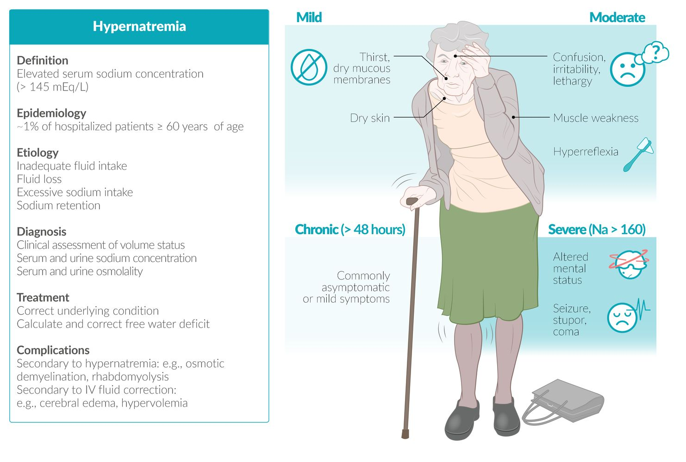
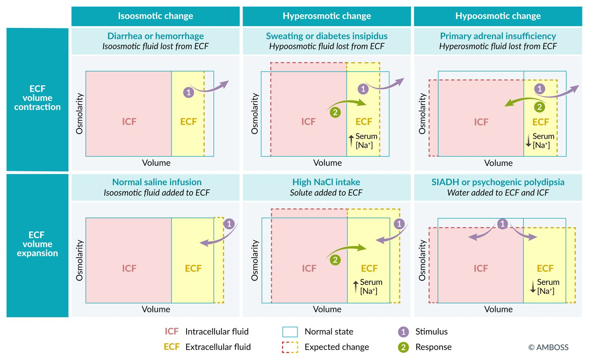
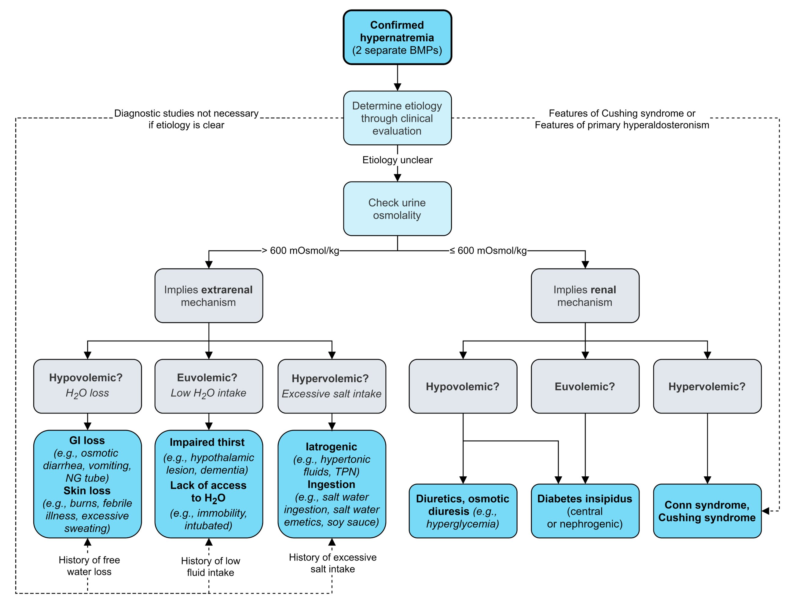
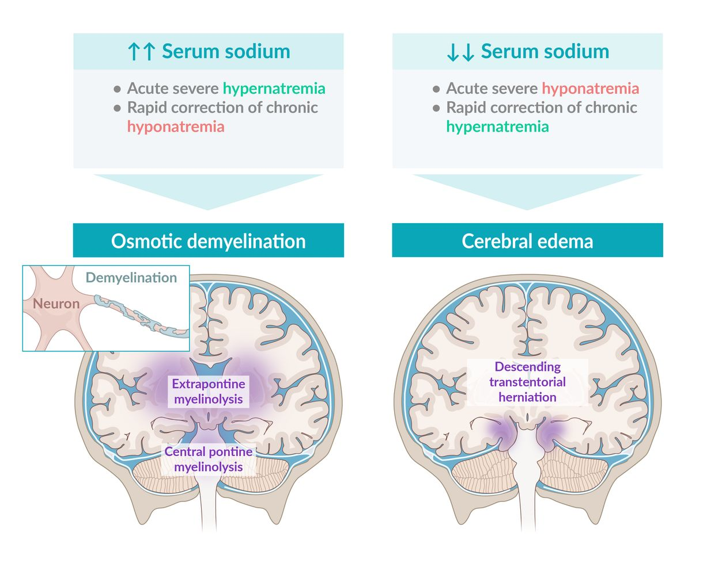

# Hypernatremia

*Categories: Clinical knowledge > Emergency medicine > Endocrine and metabolic disorders > Hypernatremia*

[Original Article Link](https://coursology-qbank.com/amboss/article/Oq0IAS)

---

## Summary

Hypernatremia is defined as a serum <u>sodium</u> concentration exceeding 145 mEq/L. <u>Sodium</u> is the most important osmotically active particle in the <u>extracellular space</u> and closely linked to the body's <u>fluid balance</u>. An increase in the serum <u>sodium</u> concentration is most often due to a <u>free water deficit</u> caused by excessive fluid loss (e.g., <u>diarrhea</u>/<u>vomiting</u>, sweating, increased diuresis) or insufficient water intake (e.g., <u>altered mental status</u>, impaired thirst mechanism). In some cases, hypernatremia is due to a real <u>sodium</u> overload caused by high <u>sodium</u> intake (e.g., hypertonic infusion, drinking sea water) or inadequately high <u>sodium</u> reabsorption by the <u>kidneys</u> (e.g., <u>primary hyperaldosteronism</u>, <u>Cushing syndrome</u>). Symptoms are predominantly neurological and nonspecific (e.g., <u>lethargy</u>, confusion, <u>focal neurological deficits</u>, <u>seizures</u>, <u>coma</u>), and they are often accompanied by signs of cellular <u>dehydration</u> (e.g., dry <u>mucous membranes</u>, decreased salivation). Assessing the patient's <u>volume status</u> (during <u>physical examination</u>) and their renal ability to reabsorb free water (<u>urine osmolality</u>) can help determine the <u>etiology of hypernatremia</u>. Acuity of onset, <u>volume status</u>, and etiology should all be considered in order to determine the appropriate therapeutic approach and avoid complications. In children, a rapid decrease in the serum <u>sodium</u> concentration can cause <u>cerebral edema</u>, which carries the risk of <u>brain herniation</u>. In adults, a relationship between rapid correction and <u>cerebral edema</u> has not been observed; however, guidelines still recommend cautious correction.

Hypernatremia fact sheet

---

## Definitions

* Eunatremia: a normal concentration of <u>sodium</u> in the blood (i.e., 136–145 mEq/L).

* Hypernatremia: elevated serum <u>sodium</u> concentration (> 145 mEq/L)  [[1]](https://coursology-qbank.com/amboss/article/R70llh)[[2]](https://coursology-qbank.com/amboss/article/PtbWdv)

---

## Etiology

In hypernatremia, <u>serum osmolality</u> is always increased, resulting in a hypertonic state. This is either due to a <u>free water deficit</u> (due to low intake or loss) or increased <u>sodium</u> (due to high intake or retention).

### <u>Hypovolemic hypernatremia</u>

* Description: high serum Na+ levels with decreased extracellular volume as a result of hypotonic fluid loss

* Extrarenal cause (manifests with <u>oliguria</u> due to <u>dehydration</u>)

* Gastrointestinal loss;  (e.g. <u>diarrhea</u>  , <u>vomiting</u>, drainage from nasogastric tubes, <u>fistula</u>)

* <u>Dermal</u> fluid loss (e.g., <u>burns</u>, <u>excessive sweating</u>)

* <u>Third-spacing</u> (<u>peritonitis</u>, <u>ascites</u>)

* Renal cause (leads to <u>dehydration</u> due to <u>polyuria</u>)

* <u>Diuretics</u>

* <u>Osmotic diuresis</u> (e.g., <u>hyperglycemia</u>, <u>mannitol</u>; , <u>uremia</u>, high-protein <u>tube feeding</u>, <u>osmotic diuretics</u>)

* Recovery (<u>polyuric</u>) phase of <u>acute tubular necrosis</u>

### <u>Euvolemic hypernatremia</u>

* Description: high serum Na+ levels with normal or minimal changes in extracellular volume as a result of pure water deficit

* Extrarenal causes (manifests with <u>oliguria</u> due to decreased water intake)

* Lack of access to water 

* <u>Altered mental status</u> (e.g., <u>dementia</u>, drug-induced)

* <u>Immobilization</u>

* Physically restrained patients

* Quadriparesis

* Impaired thirst mechanism: primary hypodipsia

* <u>Mechanical ventilation</u>

* Renal cause (causes increased thirst due to <u>polyuria</u>)
* <u>Diabetes insipidus</u> 

* Central: complete or partial lack of <u>ADH</u> secretion

* Nephrogenic: complete or partial resistance to the action of <u>ADH</u>

### <u>Hypervolemic hypernatremia</u>

* Description: high serum Na+ levels with increased extracellular volume as a result of intake of hypertonic water or retention of <u>sodium</u> in excess of water

* Extrarenal causes (initially manifests with <u>polyuria</u> due to <u>fluid overload</u>, followed by <u>dehydration</u> due to <u>polyuria</u>)

* <u>Iatrogenic</u>: excessive infusion of NaCl, <u>sodium bicarbonate</u> solutions, or <u>hypertonic saline</u>; <u>hemodialysis</u>

* Seawater consumption

* Renal causes (causes <u>hypertension</u> and <u>hypokalemia</u> with normal urine output and no <u>fluid overload</u>)

* <u>Primary hyperaldosteronism</u>

* <u>Cushing syndrome</u>

Volume-osmolarity (Darrow-Yannet) diagrams

### Overview of <u>fluid compartment</u> changes

| <u>Volume status</u> | <u>Fluid compartment</u> changes |  |
| --- | --- | --- |
|  <u>Total body water</u>  |  Total body <u>sodium</u>  |  |
| Hypovolemic hypernatremia | ↓↓   | ↓ |
| Euvolemic hypernatremia | ↓   | Normal |
| Hypervolemic hypernatremia | ↑ | ↑↑   |

> [!NOTE]
> Hypernatremia is always a hyperosmolar state!

References:[[3]](https://coursology-qbank.com/amboss/article/nXY7An)

---

## Clinical features

### Acute hypernatremia (onset < 48 hours) [[4]](https://coursology-qbank.com/amboss/article/ltbvdv)[[5]](https://coursology-qbank.com/amboss/article/ELb8z8)

Symptoms are primarily neurological and depend on the severity of hypernatremia.

* Mild symptoms: signs of <u>dehydration</u>

* Decreased salivation

* Dry <u>mucous membranes</u> and <u>skin</u>

* Moderate symptoms

* Confusion

* Irritability, restlessness

* <u>Lethargy</u>

* <u>Muscle weakness</u>

* <u>Hyperreflexia</u>

* Severe symptoms: typically occur only with severe hypernatremia (serum concentration > 160 mEq/L) [[2]](https://coursology-qbank.com/amboss/article/PtbWdv)

* <u>Focal neurological deficits</u>

* <u>Seizures</u>

* Altered consciousness

* <u>Stupor</u>

* <u>Coma</u>

### Chronic hypernatremia (onset > 48 hours ago)

* Often asymptomatic or nonspecific, mild symptoms

* Commonly: signs of <u>dehydration</u> (especially in <u>hypovolemic hypernatremia</u>)

* Rarely: irritability, <u>anorexia</u>, <u>nausea</u>, <u>weakness</u>, and/or <u>altered mental status</u>

---

## Diagnosis

### Approach [[3]](https://coursology-qbank.com/amboss/article/nXY7An)

* Confirm hypernatremia (repeat <u>BMP</u>).

* Determine the etiology through clinical evaluation, and, if unclear, perform diagnostic studies. 

* <u>Patient history</u> (e.g., low fluid intake, <u>diarrhea</u>)

* Clinical assessment of <u>volume status</u> (i.e., <u>hypovolemia</u>, <u>euvolemia</u>, versus <u>hypervolemia</u>) and <u>fluid balance monitoring</u>

* <u>Urine osmolality</u> and urine <u>sodium</u> concentration help differentiate renal causes from extrarenal causes.

* Additional studies as needed (e.g., <u>water deprivation test</u> for <u>diabetes insipidus</u>)

### <u>Laboratory studies</u> [[3]](https://coursology-qbank.com/amboss/article/nXY7An)

* <u>BMP</u>

* Serum <u>sodium</u> concentration (Na+): > 145 mEq/L

* <u>Laboratory findings of hypovolemia</u>

* <u>CBC</u>: <u>Hematocrit</u> level depends on <u>volume status</u>.

* Increased <u>serum osmolality</u> (SOsm)  [[6]](https://coursology-qbank.com/amboss/article/jtb_Wv)

* <u>Urine osmolality</u> (<u>UOsm</u>) ;  [[4]](https://coursology-qbank.com/amboss/article/ltbvdv)

* High <u>UOsm</u> (> 600 mOsmol/kg) supports an extrarenal mechanism.

* Low <u>UOsm</u> (< 600 mOsmol/kg) supports an intrarenal mechanism.

* Urine <u>sodium</u> concentration (UNa) 

* UNa < 20 mEq/L supports <u>hypovolemia</u>. [[3]](https://coursology-qbank.com/amboss/article/nXY7An)

* UNa > 100 mEq/L supports <u>sodium</u> overload. [[4]](https://coursology-qbank.com/amboss/article/ltbvdv)

* <u>Water deprivation test</u> and <u>exogenous</u> <u>ADH</u> challenge, if indicated (see “Diagnostics” in “<u>Diabetes insipidus</u>”)

> [!NOTE]
> In a state of <u>free water deficit</u>, highly concentrated urine (↑ <u>urine osmolality</u>) is a sign of normal <u>kidney function</u>.

> [!NOTE]
> Hypernatremia is always a hypertonic state!

|  Evaluation of hypernatremia [[2]](https://coursology-qbank.com/amboss/article/PtbWdv)[[3]](https://coursology-qbank.com/amboss/article/nXY7An)[[4]](https://coursology-qbank.com/amboss/article/ltbvdv)  |  |  |
| --- | --- | --- |
| Etiology | History and clinical features | Supportive diagnostic findings |
| <u>Urine osmolality</u> > 600 mOsm/kg (extrarenal mechanisms) |  |  |
| GI losses |   * <u>Diarrhea</u>  [[7]](https://coursology-qbank.com/amboss/article/sybtgw)  * <u>Vomiting</u>  * <u>Nasogastric tube</u>  * <u>Enteric</u> <u>fistula</u>    |   * <u>Signs of hypovolemia</u> or <u>AKI</u>  * ↑ <u>Urea</u>, ↑ <u>creatinine</u>  * UNa < 20 mEq/L  * <u>Hyperkalemia</u>  * GI losses: potentially <u>hypokalemia</u>  * Impaired thirst: <u>hypothalamic</u> lesion on <u>brain</u> imaging    |
| <u>Skin</u> losses |   * <u>Febrile</u> illness  * <u>Burns</u>  * <u>Excessive sweating</u>    |  |
| Insufficient access to water |   * <u>Vulnerable populations</u> (e.g., frail elderly patients, long-term care facility residents, <u>infants</u>)  * Immobility  * <u>Endotracheal tube</u> (i.e., intubated)  * Fluid prescription that does not take into account <u>insensible water losses</u>    |  |
|  Impaired thirst  |   * Elderly patients  * <u>Dementia</u>  * No change in recent fluid intake  * <u>B symptoms</u>    |  |
| Excessive salt intake |   * <u>Iatrogenic</u>  [[6]](https://coursology-qbank.com/amboss/article/jtb_Wv)  * Ingestion  [[8]](https://coursology-qbank.com/amboss/article/IEbYCv)[[9]](https://coursology-qbank.com/amboss/article/EEb8xv)    |  * UNa > 100 mEq/L   |
| <u>Urine osmolality</u> < 600 mOsm/kg (intrarenal mechanisms) |  |  |
| <u>Nephrogenic diabetes insipidus</u> |   * History of <u>lithium</u>, <u>aminoglycosides</u>, <u>amphotericin B</u>, <u>colchicine</u>  [[10]](https://coursology-qbank.com/amboss/article/mtbVVv)[[11]](https://coursology-qbank.com/amboss/article/6Ebj9v)  * <u>Polyuria</u>  * <u>Nocturia</u>  * <u>Polydipsia</u>    |   * <u>Hypercalcemia</u>  * <u>Hypokalemia</u>  * Diluted urine (↑ urine volume, ↓ <u>urine osmolality</u> < 800 mOsm/kg)  * <u>Water deprivation test</u>: persistent dilute urine  * <u>Desmopressin</u> challenge: <u>UOsm</u> does not increase.    |
|  <u>Central diabetes insipidus</u> [[6]](https://coursology-qbank.com/amboss/article/jtb_Wv)  |   * Presence of <u>brain</u> trauma, <u>surgery</u>, <u>tumor</u>, or infiltrative disease  * <u>Polyuria</u>  * <u>Nocturia</u>  * <u>Polydipsia</u>    |   * Diluted urine (↑ urine volume, ↓ <u>urine osmolality</u> < 800 mOsm/kg)  * <u>Water deprivation test</u>: persistent dilute urine  * <u>Desmopressin</u> challenge: <u>UOsm</u> increases.    |
| <u>Osmotic diuresis</u> |   * <u>DKA</u> or <u>HHS</u>  * <u>ATN</u> recovery  * <u>Mannitol</u> administration    |   * <u>Hyperglycemia</u>  * <u>Glucosuria</u>  * UNa > 20 mEq/L  [[3]](https://coursology-qbank.com/amboss/article/nXY7An)    |
| <u>Diuretics</u> |  * <u>Loop diuretic</u> use [[10]](https://coursology-qbank.com/amboss/article/mtbVVv)   |   * <u>Hypokalemia</u>  * <u>Hypocalcemia</u>    |
| <u>Primary hyperaldosteronism</u> |   * <u>Hypertension</u>  * <u>Symptoms of hypokalemia</u>    |   * Mild hypernatremia  * <u>Hypokalemia</u>  * <u>Metabolic alkalosis</u>    |
| <u>Cushing syndrome</u> |   * <u>Central obesity</u>, moon facies, <u>dorsocervical fat pad</u>  * <u>Hypertension</u>    |   * <u>Hyperglycemia</u>  * <u>Insulin resistance</u>  * <u>Hypokalemia</u>  * <u>Metabolic alkalosis</u>  * <u>Hyperlipidemia</u>    |

Diagnosis of hypernatremia

---

## Treatment

<u>Treatment of hypernatremia</u> requires replacing the <u>free water deficit</u> with sterile water enterally (oral, <u>nasogastric tube</u>, <u>PEG tube</u>) or <u>5% dextrose</u> in water (<u>D5W</u>) intravenously. All patients should be carefully monitored with serial labs and some may need additional therapies to restore <u>volume status</u>.

### Approach [[2]](https://coursology-qbank.com/amboss/article/PtbWdv)[[4]](https://coursology-qbank.com/amboss/article/ltbvdv)

* <u>Hypovolemic</u> patients: volume resuscitation

* Severe <u>volume depletion</u> or <u>shock</u>: Restore <u>euvolemia</u> with isotonic solutions (e.g., <u>normal saline</u>) before correcting hypernatremia.

* Mild to moderate <u>volume depletion</u>: simultaneous volume resuscitation and hypernatremia correction

* Identify and treat underlying causes

* Prevent ongoing fluid loss: e.g., <u>fever</u> control, symptomatic management of gastrointestinal symptoms

* Treat underlying conditions: e.g., <u>desmopressin</u> for <u>central diabetes insipidus</u>, <u>insulin</u> for <u>hyperglycemia</u> (see “<u>Hyperglycemic crises</u>” for management of severe <u>hyperglycemia</u>)

* Hypernatremia correction

* Determine Na+ correction rates based on whether hypernatremia is acute or chronic.

* Replace the <u>free water deficit</u> orally with water or IV via an effective hypotonic solution (typically <u>D5W</u>, or hypotonic saline).

* Treat complications

* Of disease: <u>Treat acute seizures</u>.

* Of treatment: Begin <u>ICP management</u> if <u>cerebral edema</u> develops.

> [!NOTE]
> The cornerstone of hypernatremia management is replacing the <u>free water deficit</u>.

### Calculation of free water deficit in hypernatremia [[4]](https://coursology-qbank.com/amboss/article/ltbvdv)

Calculations of the <u>free water deficit</u> and ongoing water losses are more accurate than rough estimates. <u>Electrolytes</u> must be carefully monitored during treatment and regimens should be individually tailored.

* Combine <u>free water deficit</u> (FWD) and ongoing losses.

* Estimate the patient's <u>total body water</u> (<u>TBW</u>): <u>TBW</u> (L) = k x weight (kg).

* Calculate FWD (L) = <u>TBW</u> (L) x ((serum Na+ concentration/140)-1).

* Estimate ongoing free water losses (<u>input/output chart</u>, <u>insensible losses</u>).  [[2]](https://coursology-qbank.com/amboss/article/PtbWdv)[[6]](https://coursology-qbank.com/amboss/article/jtb_Wv)

* Timeframe of <u>volume replacement</u>

* Acute hypernatremia: over 24 hours

* Chronic hypernatremia: over 48–72 hours [[12]](https://coursology-qbank.com/amboss/article/kIYm1q)

Total body water (TBW) - Watson formula

Free water deficit (for hypernatremia)

### Correction of free water deficit [[2]](https://coursology-qbank.com/amboss/article/PtbWdv)[[4]](https://coursology-qbank.com/amboss/article/ltbvdv)

* Acute hypernatremia (onset within < 48 hours) 

* Decrease Na+ concentration by 1–2 mEq/L/hour (i.e., replace entire <u>free water deficit</u> in < 24 hours). [[4]](https://coursology-qbank.com/amboss/article/ltbvdv)

* Estimated <u>fluid replacement</u> regimen: ∼ 3 mL/kg/hour of IV <u>D5W</u> or enteral water  [[4]](https://coursology-qbank.com/amboss/article/ltbvdv)

* Chronic hypernatremia (onset within > 48 hours)

* Gradually restore a normal Na+ level by decreasing Na+ concentration by 0.5 mEq/L/hour (max. 10–12 mEq/L per 24 hours).  [[4]](https://coursology-qbank.com/amboss/article/ltbvdv)[[13]](https://coursology-qbank.com/amboss/article/OtbIdv)[[14]](https://coursology-qbank.com/amboss/article/HEbKCv)

* Oral rehydration with free access to water may be sufficient in stable and alert patients.

* Estimated <u>fluid replacement</u> regimen: 1.35 mL/kg/hour of IV <u>D5W</u> or enteral water  [[15]](https://coursology-qbank.com/amboss/article/0_be5w)

* Adjustment of infusion rate

* Fluids other than <u>D5W</u> or sterile water require a different flow rate to provide the same amount of free water.

* Depending on serial Na+ concentration

#### Additional fluid management strategies

* <u>Hypervolemic hypernatremia</u>: Consider <u>loop diuretics</u> (e.g., <u>furosemide</u> oral or IV bolus DOSAGE) alongside <u>free water replacement</u>.  [[16]](https://coursology-qbank.com/amboss/article/4tb3dv)[[17]](https://coursology-qbank.com/amboss/article/vxbAyD)[[18]](https://coursology-qbank.com/amboss/article/y_bdIw)

* Severe renal impairment or refractory <u>fluid overload</u>: Consider nephrology referral for <u>hemodialysis</u>. [[5]](https://coursology-qbank.com/amboss/article/ELb8z8)

* <u>Sodium</u> restriction to < 2 grams per day  [[19]](https://coursology-qbank.com/amboss/article/2pYTKJ)[[20]](https://coursology-qbank.com/amboss/article/eAbxiw)[[21]](https://coursology-qbank.com/amboss/article/2AbTQw)

> [!NOTE]
> Alleviate Acute hypernatremia Aggressively and Correct Chronic hypernatremia Carefully!

### Monitoring and disposition

* Serial <u>BMPs</u> every 1–2 hours for acute hypernatremia; every 4–6 hours for chronic hypernatremia

* Adjust free water infusion rate according to target Na+ correction rates.

* Monitor for <u>hyperglycemia</u>.  [[16]](https://coursology-qbank.com/amboss/article/4tb3dv)

* Replace <u>electrolyte</u> deficiencies (see “<u>Electrolyte repletion</u>").

* Consider <u>ICU</u> admission for patients with severe hypernatremia (Na+> 160 mEq/L) and high-risk symptoms (e.g., <u>seizures</u>).

---

## Complications

### Complications of hypernatremia

* <u>Intracranial hemorrhage</u> 

* Cell <u>dehydration</u> and shrinkage of <u>brain</u> tissue can cause intracranial vessels to rupture.

* Hemorrhages may lead to irreversible neurological deficits.

* <u>Osmotic demyelination syndrome</u>

* <u>Demyelinating</u> <u>brain lesions</u> from the acute rise in serum <u>sodium</u> levels and <u>serum osmolality</u>

* More commonly seen with overcorrection of <u>hyponatremia</u>

* <u>Rhabdomyolysis</u>: Severe hypernatremia can damage <u>the cell</u> membranes of muscle cells.

### Complications of <u>hypernatremia treatment</u>

* <u>Cerebral edema</u>: may develop from rapid correction of chronic hypernatremia  [[4]](https://coursology-qbank.com/amboss/article/ltbvdv)[[13]](https://coursology-qbank.com/amboss/article/OtbIdv)[[14]](https://coursology-qbank.com/amboss/article/HEbKCv)

* <u>Hypervolemia</u> complications: secondary to hypernatremia correction with large-volume IV fluid administration (e.g., <u>noncardiogenic pulmonary edema</u>)

> [!NOTE]
> Correcting dysnatremia too rapidly may cause two complications: From high to low, your <u>brain</u> will blow (<u>cerebral edema</u>); from low to high, your <u>pons</u> will die (<u>osmotic demyelination syndrome</u>).

Neurological complications of dysnatremia

We list the most important complications. The selection is not exhaustive.

---