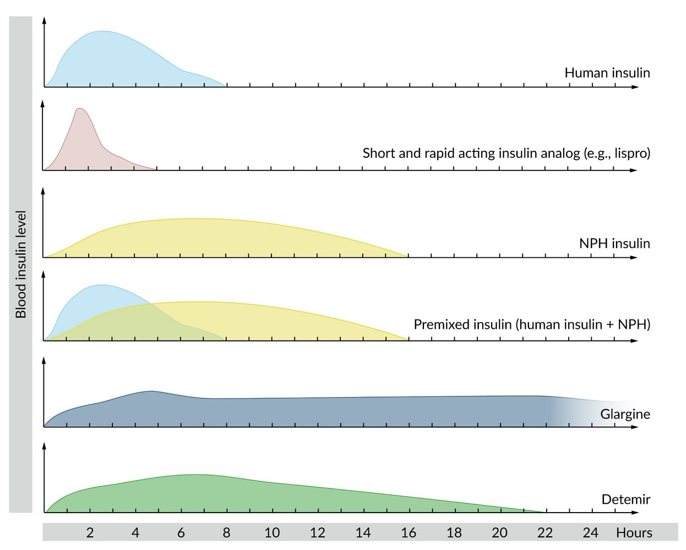

# Hypoglycemia

*Categories: Clinical knowledge > Emergency medicine > Endocrine and metabolic disorders > Hypoglycemia*

[Original Article Link](https://coursology-qbank.com/amboss/article/Pg0Wv2)

---

## Summary

Hypoglycemia, or low blood sugar, has a variety of causes, but most often occurs as a result of <u>insulin therapy</u> or other medications in patients with <u>diabetes</u>. Although hypoglycemic symptoms can appear when blood <u>glucose</u> is < 70 mg/dL, its onset depends largely on individual physiological adaptation mechanisms. Hypoglycemia manifests with autonomic symptoms such as hunger, sweating, and <u>tachycardia</u>, as well as <u>neuroglycopenic symptoms</u> such as confusion, behavioral changes, and <u>somnolence</u>. A change in a patient's mental status should prompt immediate fingerstick blood <u>glucose</u> measurement and treatment if needed, as prolonged hypoglycemia can potentially cause acute <u>brain damage</u>. <u>Glucose</u> is the preferred treatment. Patients who are conscious should receive a fast-acting <u>carbohydrate</u> such as <u>glucose</u> tablets, candy, or fruit juice. Intravenous dextrose or intramuscular <u>glucagon</u> is administered to unresponsive patients.

Hypoglycemia fact sheet

---

## Definitions

The following is consistent with the 2021 American <u>Diabetes</u> Association guidance. [[1]](https://coursology-qbank.com/amboss/article/4-c3xU0)

* Hypoglycemia in patients with <u>diabetes</u>: generally described as ≤ 70 mg/dL (≤ 3.9 mmol/L)  [[1]](https://coursology-qbank.com/amboss/article/4-c3xU0)[[2]](https://coursology-qbank.com/amboss/article/35YSPp)

* Level 1: blood <u>glucose</u> level of 54–70 mg/dL

* Level 2: blood <u>glucose</u> level < 54 mg/dL

* Level 3: hypoglycemia episode with <u>altered mental status</u> or physical impairment requiring assistance to treat

* Hypoglycemia in patients without <u>diabetes</u>: blood <u>glucose</u> level < 55 mg/dL with <u>symptoms of hypoglycemia</u> [[3]](https://coursology-qbank.com/amboss/article/m-cVBU0)

* Whipple triad: helps to confirm the diagnosis of hypoglycemia  [[4]](https://coursology-qbank.com/amboss/article/mXYVAn)[[5]](https://coursology-qbank.com/amboss/article/WsYPFq)

* Low blood <u>glucose</u> levels

* Signs or symptoms consistent with hypoglycemia (see “Clinical features”)

* Relief of symptoms when blood <u>glucose</u> increases after treatment

---

## Etiology

### Diabetic patients [[5]](https://coursology-qbank.com/amboss/article/WsYPFq)[[6]](https://coursology-qbank.com/amboss/article/VsYGFq)

| Causes of hypoglycemia in patients with diabetes |  |
| --- | --- |
| <u>Insulin</u>-related |   * <u>Insulin</u> excess  * Accidental overdose of <u>insulin</u> or noninsulin drugs (e.g., <u>sulfonylureas</u>, <u>meglitinides</u>)  * Wrongly timed medication  * <u>Drug interactions</u>  * <u>Factitious disorder</u>  * <u>Reactive hypoglycemia</u>  * Increased <u>sensitivity</u> to <u>insulin</u>  * Weight loss  * Increase in activity/exercise  * Decreased <u>insulin</u> clearance * <u>Renal failure</u>  * Inability to self-<u>manage diabetes</u> and <u>diabetes medications</u>  * Cognitive impairment and/or limited <u>health literacy</u> [[7]](https://coursology-qbank.com/amboss/article/K-cUyU0)  * <u>Food insecurity</u> [[8]](https://coursology-qbank.com/amboss/article/L-cwBU0)    |
| <u>Glucose</u>-related |   * <u>Fasting</u>/missed meals  * Chronic <u>alcohol</u> use  * Exercise  * Prior episodes of hypoglycemia leading to <u>impaired hypoglycemia awareness</u>  [[9]](https://coursology-qbank.com/amboss/article/M-cMBU0)[[10]](https://coursology-qbank.com/amboss/article/n-c7BU0)    |
|  Acute illness  |   * <u>Sepsis</u>  * Trauma  * <u>Burns</u>  * Organ failure    |

> [!TIP]
> In patients with <u>diabetes</u> who present with hypoglycemia in the absence of medication changes, consider another underlying condition, e.g., acute infection or decreased drug metabolism or drug excretion secondary to new-onset organ impairment. [[11]](https://coursology-qbank.com/amboss/article/KnbU88)

> [!TIP]
> (Relative) overdose of <u>insulin</u> or a noninsulin drug is by far the most common <u>cause of hypoglycemia</u>.

> [!TIP]
> Consider <u>factitious disorder</u> in patients with access to <u>insulin</u> and other <u>diabetes medications</u> (e.g., healthcare professionals), for whom there is no other obvious explanation for hypoglycemia.

Types of insulin

### Nondiabetic patients [[5]](https://coursology-qbank.com/amboss/article/WsYPFq)[[6]](https://coursology-qbank.com/amboss/article/VsYGFq)

| Causes of hypoglycemia in patients without diabetes |  |
| --- | --- |
| Critical illness |   * Hepatic disease (e.g., viral <u>hepatitis</u>, <u>decompensated cirrhosis</u>)  * <u>Renal failure</u>  * <u>Heart failure</u>  * <u>Malnutrition</u>  * <u>Sepsis</u>  * Trauma  * <u>Burns</u>    |
|  Drugs that cause hypoglycemia [[6]](https://coursology-qbank.com/amboss/article/VsYGFq)   |   * Nonselective <u>beta blockers</u>  * <u>Antimalarial drugs</u>: <u>quinine</u>, <u>chloroquine</u>  * <u>Antibiotics</u>: <u>sulfonamides</u>, <u>trimethoprim-sulfamethoxazole</u>, <u>fluoroquinolones</u>  * <u>Antifungal</u> drugs: <u>pentamidine</u>, oxaline  * <u>Analgesics</u>: <u>indomethacin</u>, propoxyphene/dextropropoxyphene  * <u>Antihypertensive drugs</u>: <u>ACE-inhibitors</u>, <u>angiotensin receptor antagonists</u>  * <u>Antiarrhythmics</u>: cibenzoline, <u>disopyramide</u>  * Others: <u>IGF-1</u>, <u>lithium</u>, <u>mifepristone</u>, <u>heparin</u>, <u>6-mercaptopurine</u>    |
| <u>Hormone</u> deficiencies |   * <u>Hypopituitarism</u>  * <u>Adrenal insufficiency</u>    |
| Endogenous hyperinsulinism |   * <u>Insulinoma</u> (most common)  * <u>Noninsulinoma pancreatogenous hypoglycemia syndrome</u> (<u>NIPHS</u>)  * <u>Nonislet cell tumor hypoglycemia</u> (<u>NICTH</u>) due to increased <u>IGF</u>  * Surgical causes, e.g.:  * <u>Gastric bypass surgery</u> (<u>late dumping syndrome</u>)  * Recent <u>gastrectomy</u>, <u>pyloroplasty</u>, or <u>vagotomy</u> [[2]](https://coursology-qbank.com/amboss/article/35YSPp)  * Autoimmune causes, e.g.:  * <u>Insulin</u> autoimmune syndrome (IAS)  * Anti-<u>insulin</u> <u>receptor</u> <u>autoantibodies</u>    |
| <u>Exogenous</u> <u>hyperinsulinism</u> |   * <u>Factitious disorder</u>  * Accidental <u>insulin</u> use    |
|  Genetic and congenital disorders [[12]](https://coursology-qbank.com/amboss/article/aCYQqr)  |   * <u>Congenital hypopituitarism</u>  * <u>Glycogen storage diseases</u>  * <u>Fructose intolerance</u>    |

> [!WARNING]
> Older patients are at risk of developing hypoglycemia regardless of <u>diabetes</u> status, and they are at increased risk of adverse outcomes resulting from hypoglycemic episodes. [[13]](https://coursology-qbank.com/amboss/article/5-ciBU0)

---

## Clinical features

### Threshold for symptoms

* Varies greatly; , but most adults become symptomatic when blood <u>glucose</u> level is less than approx. 50 mg/dL (2.8 mmol/L)

* The threshold of symptoms is especially variable in individuals with <u>type 1 diabetes</u> and those with longstanding <u>type 2 diabetes</u> due to hypoglycemia-associated autonomic failure (<u>HAAF</u>). [[4]](https://coursology-qbank.com/amboss/article/mXYVAn)

* Recurrent hypoglycemia → changes in the counterregulatory autonomic response (e.g., decreased <u>epinephrine</u> release) → lower <u>glucose threshold</u> needed to trigger symptoms → asymptomatic hypoglycemia

* The initial <u>symptom of hypoglycemia</u> in patients with <u>HAAF</u> is often confusion.

* Can also vary due to medication: <u>Beta blockers</u> can mask <u>signs of hypoglycemia</u>.

> [!TIP]
> Educating patients about <u>hypoglycemia unawareness</u> can help them to recognize the onset of autonomic symptoms and minimize the risk of severe hypoglycemia.

### Signs and symptoms

* Neurogenic/autonomic symptoms

* Increased <u>sympathetic</u> activity: <u>tremor</u>, <u>pallor</u>, <u>anxiety</u>, <u>tachycardia</u>, sweating, and <u>palpitations</u>

* Increased <u>parasympathetic</u> activity: hunger, <u>paresthesias</u>, <u>nausea</u>, and <u>vomiting</u>

* Neuroglycopenic symptoms 

* <u>Agitation</u>, confusion, behavioral changes

* Fatigue

* <u>Seizure</u>, <u>focal neurological signs</u>

* <u>Somnolence</u> → <u>obtundation</u> → <u>stupor</u> → <u>coma</u> → <u>death</u>

> [!TIP]
> <u>Beta blockers</u> can mask <u>signs of hypoglycemia</u>.

> [!TIP]
> Hypoglycemia is rare in patients without <u>diabetes</u> and should prompt investigation for an underlying hypoglycemic disorder. [[5]](https://coursology-qbank.com/amboss/article/WsYPFq)

Hypoglycemia fact sheet

---

## Diagnosis

### Approach

* Confirm low blood <u>glucose</u> (via fingerstick or <u>BMP</u>) and check for <u>Whipple triad</u>.

* Investigate any acute illness as a cause (e.g., infection, <u>sepsis</u>, <u>burns</u>).

* <u>Review medications</u> (see “<u>Drugs that cause hypoglycemia</u>”).

* Perform diagnostic workup based on the leading differential diagnosis and whether the patient has <u>diabetes</u>.

> [!TIP]
> Further workup for hypoglycemia is usually only indicated if all features of the <u>Whipple triad</u> are present. [[16]](https://coursology-qbank.com/amboss/article/nd17qf0)

> [!WARNING]
> Do not delay treatment of symptomatic hypoglycemia in favor of formally testing for blood <u>glucose</u> levels (see “Management”).

### Patients with <u>diabetes</u> [[4]](https://coursology-qbank.com/amboss/article/mXYVAn)

* Hypoglycemia in diabetic patients is almost always due to acute illness and/or medications (e.g., <u>insulin</u>) and further workup is generally not indicated.

* Initial workup if no obvious trigger is identified:

* Routine <u>laboratory studies</u>: <u>CBC</u>, <u>BMP</u>, <u>liver chemistries</u>

* <u>Septic workup</u> as directed by clinical suspicion: e.g., <u>CXR</u>, <u>urinalysis</u>, <u>blood cultures</u>

* Consider <u>sulfonylurea</u> and <u>exogenous</u> <u>insulin</u> levels.

### Patients without <u>diabetes</u> [[5]](https://coursology-qbank.com/amboss/article/WsYPFq)

* Rule out critical illness and <u>drugs that cause hypoglycemia</u>.

* Consider other <u>causes of hypoglycemia in nondiabetic patients</u>, e.g., recent <u>gastric bypass surgery</u>.

* In seemingly well patients with no obvious <u>cause of hypoglycemia</u>, assess for <u>insulinoma</u>.

* Obtain initial studies, including <u>insulin</u>, <u>C-peptide</u>, <u>proinsulin</u>, and anti-<u>insulin</u> <u>receptor</u> <u>autoantibodies</u>.

* Consider a <u>glucagon tolerance test</u> and <u>72-hour fasting test</u> to support the diagnosis.

* See “<u>Diagnostics for insulinoma</u>” for details on diagnostic workup for <u>endogenous hyperinsulinism</u>.

> [!NOTE]
> Nonsuppressed serum <u>insulin</u> concentrations with decreased serum <u>C-peptide</u> and <u>proinsulin</u> concentrations are consistent with <u>exogenous</u> <u>insulin</u> use.

---

## Treatment

### Reversing hypoglycemia

Monitor patients regularly for rebound hypoglycemia after treatment.

* Alert and oriented patients

* Oral <u>glucose</u> 15–20 g [[14]](https://coursology-qbank.com/amboss/article/5XYiAn)

* Fast-acting <u>carbohydrates</u> (e.g., <u>glucose</u> tablets, candy, or fruit juice)  [[14]](https://coursology-qbank.com/amboss/article/5XYiAn)

* Patients with <u>altered mental status</u> (or impaired oral intake) [[5]](https://coursology-qbank.com/amboss/article/WsYPFq)

* IV dextrose (e.g., <u>D50W</u>): Repeat after 15 minutes if hypoglycemia persists; multiple doses may be required. [[11]](https://coursology-qbank.com/amboss/article/KnbU88)[[14]](https://coursology-qbank.com/amboss/article/5XYiAn)

* Adults: <u>50% dextrose</u> DOSAGE

* Children (excluding <u>neonates</u>): <u>10% dextrose</u> DOSAGE OR 25% dextrose DOSAGE [[18]](https://coursology-qbank.com/amboss/article/c21agT0)[[19]](https://coursology-qbank.com/amboss/article/d21ogT0)

* IM <u>glucagon</u> DOSAGE: if neither oral nor IV routes of administering <u>glucose</u> are feasible   [[14]](https://coursology-qbank.com/amboss/article/5XYiAn)

> [!TIP]
> For patients with <u>type 1 diabetes</u> presenting with hypoglycemia and using <u>insulin pumps</u>, do not discontinue <u>insulin pumps</u> and <u>treat hypoglycemia</u> as usual. Removing the <u>insulin pump</u> puts patients at risk for <u>diabetic ketoacidosis</u>. [[11]](https://coursology-qbank.com/amboss/article/KnbU88)

> [!WARNING]
> Avoid giving orange juice to patients with <u>CKD</u> on a low-<u>potassium</u> diet as it is high in <u>potassium</u>. [[14]](https://coursology-qbank.com/amboss/article/5XYiAn)

### Adjunctive therapy

* Chronic <u>alcohol dependence</u> and/or <u>malnourishment</u>: Consider IV <u>thiamine</u>.  [[2]](https://coursology-qbank.com/amboss/article/35YSPp)[[15]](https://coursology-qbank.com/amboss/article/HIXKVz)

* Sulfonylurea poisoning: consider <u>octreotide</u> (<u>off label</u>) DOSAGE under specialist guidance to inhibit <u>endogenous</u> <u>insulin</u> release.  [[11]](https://coursology-qbank.com/amboss/article/KnbU88)[[20]](https://coursology-qbank.com/amboss/article/eJdxGI0)[[21]](https://coursology-qbank.com/amboss/article/svdtYH0)

### Treatment of the underlying causes

* <u>Diabetes mellitus</u>: See “<u>Diabetes management</u>” and “<u>Insulin therapy</u>.”

* Other critical illnesses

* See “<u>Sepsis management</u>.”

* See “<u>Adrenal crisis</u>.”

* See “<u>Management of acute liver failure</u>.”

* See “<u>Myxedema coma</u>.”

---