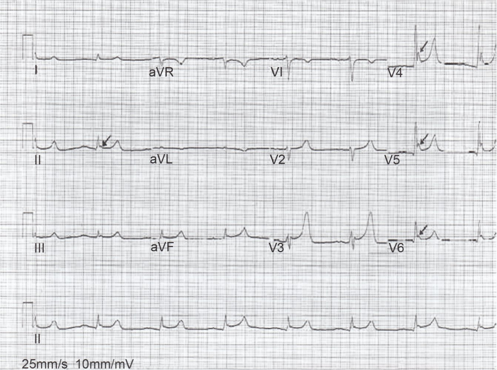
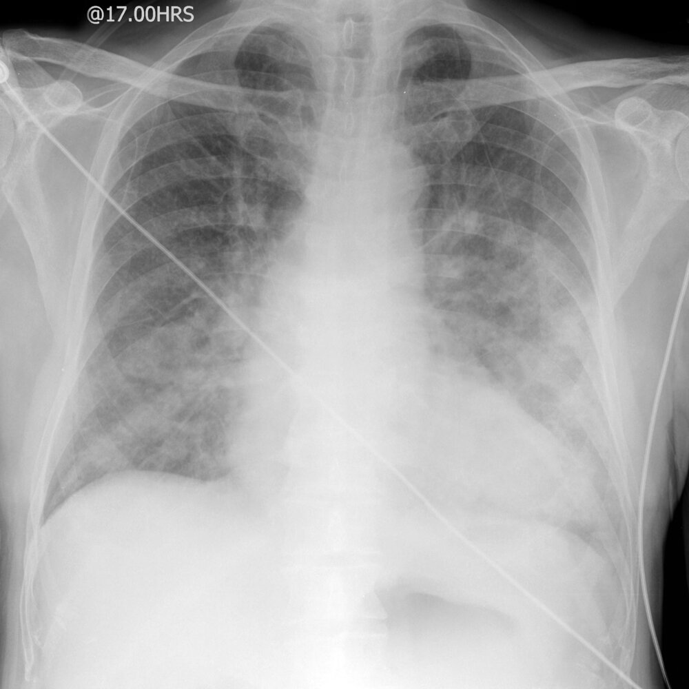
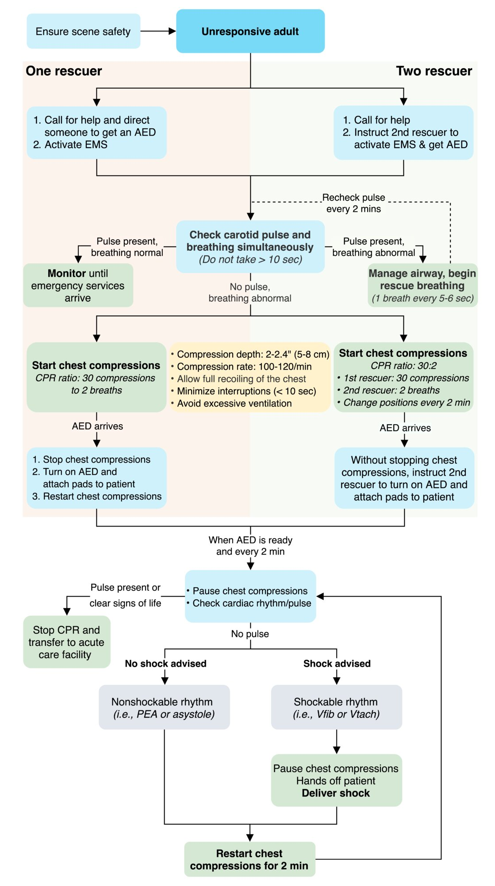
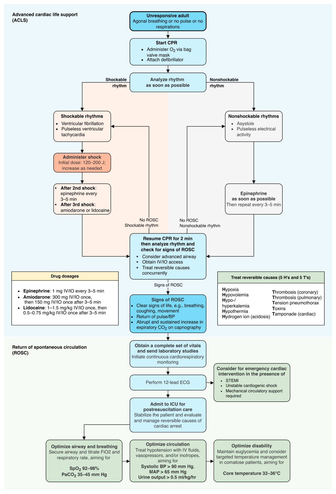

# Drowning

*Categories: Clinical knowledge > Emergency medicine > Environmental disorders > Drowning*

[Original Article Link](https://coursology-qbank.com/amboss/article/AP0RhT)

---

## Summary

Drowning is respiratory impairment and/or the sensation of <u>respiratory distress</u> caused by submersion or immersion in a liquid. It is a leading <u>cause of death</u> in children. <u>Risk factors</u> for drowning include age below 14 years, male sex, <u>alcohol</u> use, risky behavior, and <u>seizure disorder</u>. Clinical features of drowning vary based on the duration of respiratory impairment, the core body temperature, and the <u>effectiveness</u> of initial resuscitation, but may include <u>respiratory distress</u>, neurologic compromise, cardiac instability, and/or <u>hypothermia</u>. Prehospital management begins with the removal of the patient from the water and the initiation of <u>basic life support</u>, if necessary. Further management in the emergency department may include <u>advanced cardiac life support</u> (<u>ACLS</u>), <u>oxygen therapy</u>, <u>advanced airway management</u>, <u>mechanical ventilation</u>, and efforts to <u>treat hypothermia</u>. Complications of drowning include <u>acute lung injury</u>, <u>pulmonary edema</u>, <u>cardiac arrhythmia</u>, and <u>anoxic-ischemic brain injury</u>.

---

## Epidemiology

* <u>Incidence</u> highest in children < 5 years of age [[5]](https://coursology-qbank.com/amboss/article/PnWWtN0)

* Leading cause of <u>unintentional injury</u> <u>death</u> in children aged 1–4 years [[5]](https://coursology-qbank.com/amboss/article/PnWWtN0)

* Second leading cause of <u>unintentional injury</u> <u>death</u> in children aged 5–14 years after <u>motor vehicle accidents</u> [[6]](https://coursology-qbank.com/amboss/article/4nW3tN0)

* Third leading cause of <u>unintentional injury</u> <u>death</u> worldwide [[7]](https://coursology-qbank.com/amboss/article/vnWAEN0)

* > 3500 drowning deaths in the US each year [[1]](https://coursology-qbank.com/amboss/article/X6W9jm0)

* <u>♂</u> > <u>♀</u>  [[8]](https://coursology-qbank.com/amboss/article/Q8cumV0)

Epidemiological data refers to the US, unless otherwise specified.

---

## Etiology

* Patient <u>risk factors</u> [[9]](https://coursology-qbank.com/amboss/article/N5W-4N0)

* Age < 14 years

* Male sex

* <u>Seizure disorder</u>

* Other preexisting medical conditions, e.g., cardiovascular disease, <u>Parkinson disease</u>, <u>dementia</u> [[10]](https://coursology-qbank.com/amboss/article/9nWNvN0)

* Socioeconomic factors: rural residence, poor education, low income [[11]](https://coursology-qbank.com/amboss/article/wnWhvN0)

* Poor or no swimming ability [[11]](https://coursology-qbank.com/amboss/article/wnWhvN0)

* Situational <u>risk factors</u> [[9]](https://coursology-qbank.com/amboss/article/N5W-4N0)

* Ingestion of <u>alcohol</u> or other drugs that <u>alter mentation</u>

* Lack of supervision

* Proximity to bodies of water

* Risky behavior

* <u>Hypothermia</u> or <u>hyperthermia</u> (while swimming or bathing) [[12]](https://coursology-qbank.com/amboss/article/CKcqiW0)

* Residence in an area <u>prone</u> to <u>flooding</u>

---

## Clinical features

Clinical presentation depends on the duration of respiratory impairment, the core body temperature, and the <u>effectiveness</u> of initial resuscitation. [[9]](https://coursology-qbank.com/amboss/article/N5W-4N0)[[12]](https://coursology-qbank.com/amboss/article/CKcqiW0)[[13]](https://coursology-qbank.com/amboss/article/AN1Rdh0)

* Pulmonary

* <u>Dyspnea</u>/<u>apnea</u>

* <u>Cyanosis</u>

* <u>Signs of pulmonary edema</u> (e.g., <u>rales</u>, foam in the <u>airway</u>)

* Cardiovascular

* <u>Hypotension</u>

* <u>Cardiac arrhythmia</u>

* <u>Cardiac arrest</u>

* Neurologic

* <u>Altered mental status</u>

* <u>Loss of consciousness</u>

* Abnormal <u>pupil examination</u>

* <u>Seizures</u>

* Other

* <u>Clinical features of hypothermia</u>

* Gastric distention and/or <u>vomiting</u>

> [!WARNING]
> If the patient has been on a dive, examine them for <u>diving-related injuries</u>, e.g., <u>barotrauma</u> and <u>air embolism</u>.

---

## Diagnosis

### Initial diagnostics [[1]](https://coursology-qbank.com/amboss/article/X6W9jm0)[[9]](https://coursology-qbank.com/amboss/article/N5W-4N0)[[13]](https://coursology-qbank.com/amboss/article/AN1Rdh0)

* <u>Laboratory studies</u>

* <u>Arterial blood gas</u>: may show <u>respiratory failure</u> and/or <u>metabolic acidosis</u>

* <u>CMP</u>, <u>CBC</u>: typically normal

* <u>ECG</u>

* May help determine the precipitating cause of drowning (e.g., <u>arrhythmia</u>, <u>ischemia</u>)

* <u>ECG findings in hypothermia</u> include <u>QTc prolongation</u> and <u>J waves</u>.

* <u>CXR</u>

* May show <u>x-ray</u> findings of <u>pulmonary edema</u> (e.g., bilateral diffuse opacities)  [[14]](https://coursology-qbank.com/amboss/article/76W4mm0)

* Initial <u>CXR</u> may underestimate the degree of pulmonary injury.

* Repeat CXRs are indicated for persistent respiratory symptoms.

Osborne waves (J waves) in hypothermia

Bilateral air space and interstitial disease in acute pulmonary edema

### Additional diagnostics

Further diagnostics may be obtained to determine the precipitating cause of drowning (e.g., <u>seizures</u> or intoxication) and to rule out complications.

* Toxicology studies: ethanol level, <u>urine toxicology screen</u>

* CT head and/or CT <u>cervical spine</u>: to rule out suspected traumatic injury

* CT chest and/or <u>lung</u> <u>ultrasound</u>: to further evaluate pulmonary injuries

* <u>EEG</u>: to rule out subclinical <u>seizures</u> in <u>obtunded</u> patients [[13]](https://coursology-qbank.com/amboss/article/AN1Rdh0)

> [!TIP]
> Obtain an <u>EEG</u> in patients who remain unresponsive after drowning to assess for subclinical <u>seizure</u> activity. [[13]](https://coursology-qbank.com/amboss/article/AN1Rdh0)

---

## Prehospital care

* Notify emergency medical services.

* Maintain personal safety during the rescue.

* Begin immediate <u>basic life support</u> in unresponsive patients if there is: 

* No danger to the rescue team

* No <u>obvious sign of irreversible death</u>

* Submersion time < 60 minutes

* Implement <u>cervical spine precautions</u> only if trauma is suspected.  [[1]](https://coursology-qbank.com/amboss/article/X6W9jm0)[[16]](https://coursology-qbank.com/amboss/article/HnXKuA)

> [!TIP]
> Rescuers should not put their lives at risk to save a drowning person.

> [!TIP]
> Begin <u>basic life support</u> with an emphasis on ventilation immediately after rescue to optimize the chance of successful resuscitation. [[9]](https://coursology-qbank.com/amboss/article/N5W-4N0)

> [!WARNING]
> Use <u>cervical spine precautions</u> only if trauma is suspected to avoid unnecessary delays in <u>airway management</u>. [[1]](https://coursology-qbank.com/amboss/article/X6W9jm0)[[16]](https://coursology-qbank.com/amboss/article/HnXKuA)

Adult basic life support (BLS)

---

## Treatment

### Approach [[1]](https://coursology-qbank.com/amboss/article/X6W9jm0)[[9]](https://coursology-qbank.com/amboss/article/N5W-4N0)[[13]](https://coursology-qbank.com/amboss/article/AN1Rdh0)

* Begin <u>advanced cardiac life support</u> in unresponsive patients.  [[16]](https://coursology-qbank.com/amboss/article/HnXKuA)

* Start continuous cardiac and respiratory monitoring, e.g., <u>SpO2</u>, <u>EtCO2</u>.

* Evaluate for <u>clinical features of respiratory distress</u> and begin <u>respiratory support</u>.

* Localized <u>rales</u>: Begin low-flow oxygen, e.g., <u>nasal cannula</u>.

* <u>Signs of pulmonary edema</u>

* Begin <u>high-flow oxygen</u>, e.g., <u>nonrebreather mask</u>.

* Consider <u>intubation</u> with <u>lung-protective ventilation</u>.

* Goal: <u>SaO2</u> > 92%

* See "<u>Respiratory distress and failure in children</u>" for details.

* Begin <u>management of shock</u> with <u>IV fluid resuscitation</u>.

* Begin <u>treatment of hypothermia</u> if core body temperature is < 32.0°C.

* In unresponsive patients, initiate <u>neuroprotective measures</u> (e.g., <u>therapeutic hypothermia</u>, <u>normoglycemia</u>) and obtain <u>EEG</u>.

> [!WARNING]
> <u>Tympanic membrane</u> temperatures may not be accurate in a patient who has drowned. [[13]](https://coursology-qbank.com/amboss/article/AN1Rdh0)

Advanced cardiac life support (ACLS)

### <u>Respiratory support</u> [[1]](https://coursology-qbank.com/amboss/article/X6W9jm0)[[9]](https://coursology-qbank.com/amboss/article/N5W-4N0)[[17]](https://coursology-qbank.com/amboss/article/DnW1vN0)

<u>Aspiration</u> of fluid into the <u>lung</u> results in <u>surfactant</u> destruction and washout, which can cause <u>acute respiratory distress syndrome</u> (<u>ARDS</u>).

* <u>Management of ARDS</u>

* Use a <u>lung-protective ventilation strategy</u> and maintain <u>SaO2</u> > 92%.

* Avoid <u>permissive hypercapnia</u> to prevent <u>secondary brain injury</u>.

* Use <u>supraglottic airway devices</u> and <u>non-invasive positive-pressure ventilation</u> (<u>NIPPV</u>) with caution.

* <u>Ventilator weaning</u> should generally be delayed for 48 hours.

* Supportive treatment

* Place an <u>orogastric tube</u> in intubated patients to reduce gastric distension and prevent <u>aspiration</u>.

* Consider prophylactic <u>antibiotics</u> only if drowning occurred in water with a high <u>pathogen</u> count, e.g., water containing sewage.

* <u>Corticosteroids</u> are indicated only for the treatment of <u>bronchospasm</u>.

### <u>Hemodynamic support</u> [[9]](https://coursology-qbank.com/amboss/article/N5W-4N0)

* <u>Cardiac arrest</u>: Manage with standard <u>ACLS</u>. [[16]](https://coursology-qbank.com/amboss/article/HnXKuA)

* The presenting rhythm is usually <u>PEA</u> or <u>asystole</u>, but a <u>shockable rhythm</u> is a good prognostic sign.

* For patients with <u>hypothermia</u>, recommendations for <u>hypothermic cardiac arrest</u> apply.

* Consider termination of <u>ACLS</u> if <u>asystole</u> persists after 20 minutes in a fully rewarmed patient. [[17]](https://coursology-qbank.com/amboss/article/DnW1vN0)

* <u>Hemodynamic instability</u>

* Cardiac dysfunction with low <u>cardiac output</u> may occur after drowning.

* Initial treatment: <u>IV fluid resuscitation</u>, correction of <u>hypothermia</u>, and improved oxygenation

* Additional management should be guided by <u>POCUS</u>, <u>echocardiography</u>, and/or advanced <u>cardiac monitoring</u>.

> [!TIP]
> Initiate rewarming and do not withhold life-saving treatment from hypothermic patients who appear <u>clinically dead</u> (e.g., <u>dilated pupils</u>, areflexia, rigidity) without <u>signs of irreversible death</u>. [[16]](https://coursology-qbank.com/amboss/article/HnXKuA)[[18]](https://coursology-qbank.com/amboss/article/jU1_1T0)

### Disposition [[9]](https://coursology-qbank.com/amboss/article/N5W-4N0)[[13]](https://coursology-qbank.com/amboss/article/AN1Rdh0)[[19]](https://coursology-qbank.com/amboss/article/gAcFQU0)

* <u>ICU</u> admission: all patients requiring ongoing respiratory or <u>hemodynamic support</u>

* Hospital admission: all symptomatic patients

* Discharge: Consider for asymptomatic individuals with normal mental status and respiratory function after observation for at least 4–6 hours. [[1]](https://coursology-qbank.com/amboss/article/X6W9jm0)

---

## Complications

* <u>ARDS</u>

* <u>Pulmonary edema</u>

* <u>Pneumothorax</u>

* <u>Acute tubular necrosis</u> (due to <u>hypoxemia</u>)

* <u>Brain death</u>

* <u>Elevated intracranial pressure</u>

* Infection (e.g., <u>pneumonia</u>, <u>meningitis</u>)

* <u>Cardiac arrest</u>

We list the most important complications. The selection is not exhaustive.

---

## Prevention

* Swimming education

* Safety equipment (e.g., life jackets)

* Water rescue training

* Water safety signs posted at potential sites of drowning

* Rescue equipment and personnel (e.g., lifeguards) at recreational swimming locations (e.g., pools, beaches)

* Avoidance of <u>alcohol</u> and drug consumption before swimming

* Installing barriers around potential water hazards (e.g., pools, wells, waterfronts)

* Close supervision of children around water (e.g., during bathing as well as swimming)

---