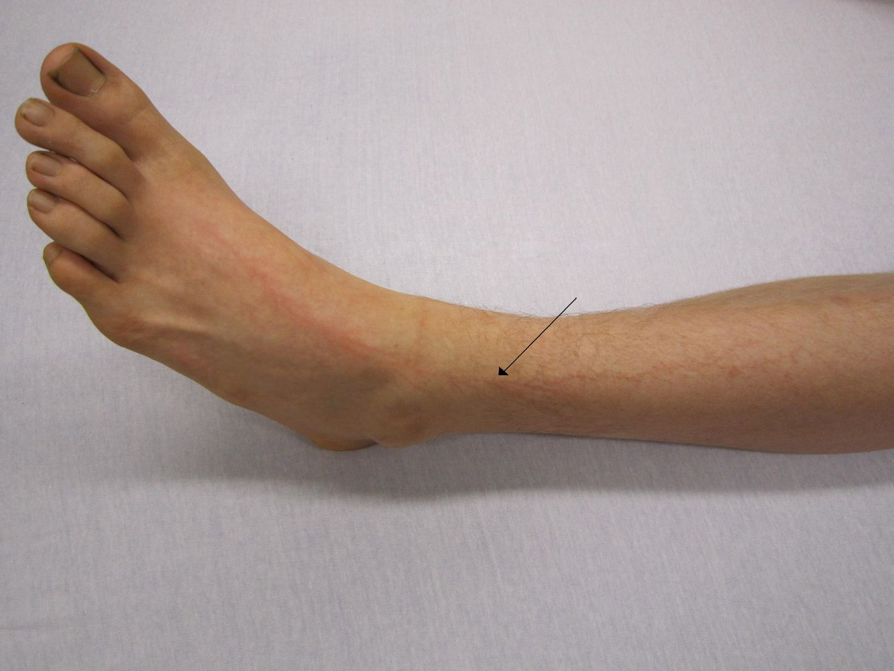
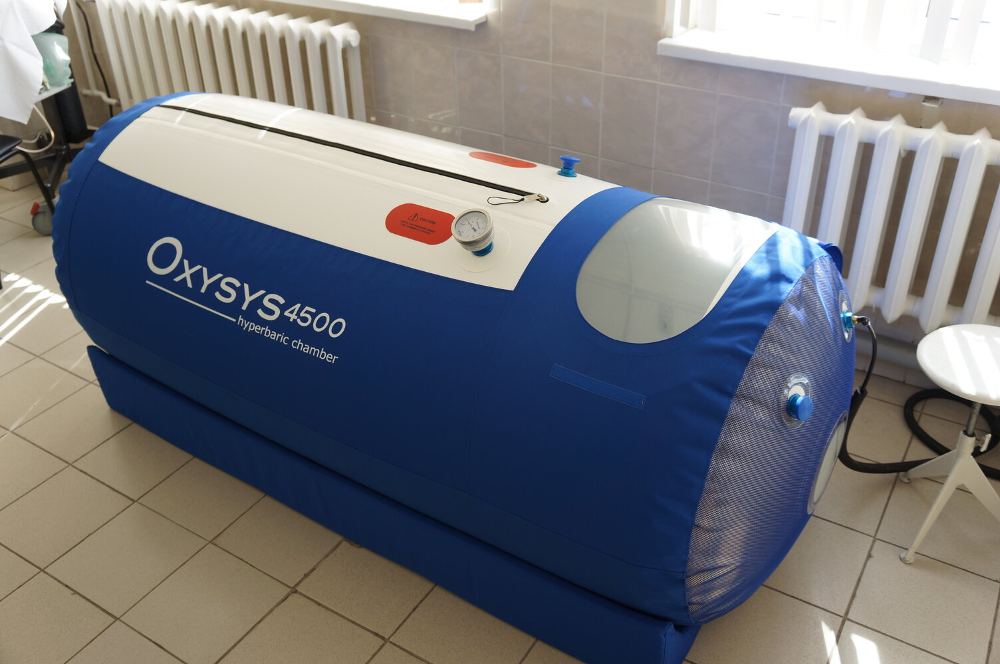
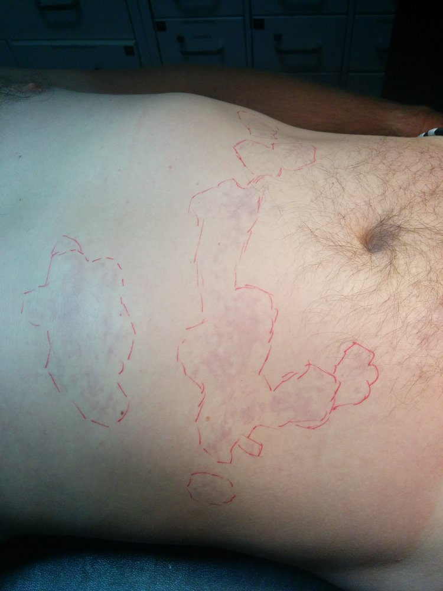

# Environmental pathology

*Categories: Clinical knowledge > Emergency medicine > Environmental disorders > Environmental pathology*

[Original Article Link](https://coursology-qbank.com/amboss/article/Z40Z3T)

---

## Summary

Environmental pathologies are conditions caused by exposure to environmental factors such as extreme temperature, rapid changes in ambient pressure, <u>electricity</u>, wildlife, and environmental and occupational toxins and irritants.

<u>Electrical injuries</u> typically manifest with <u>burns</u>, <u>cardiac dysrhythmias</u>, and/or traumatic injuries. <u>Lightning injuries</u> can manifest with <u>fixed dilated pupils</u>, cardiorespiratory arrest, and characteristic <u>skin</u> findings such as <u>Lichtenberg figures</u>. Individuals with an <u>electrical injury</u> require a thorough assessment for <u>burns</u>, cardiac complications (e.g., with a screening <u>ECG</u>), and traumatic injuries. Management may include <u>ATLS</u>, <u>ACLS</u>, <u>cardiac monitoring</u>, and treatment of complications such as <u>fractures</u>.

<u>High-altitude illnesses</u> result from inadequate <u>acclimatization</u> to the low <u>partial pressure</u> of inspired oxygen found at elevations > 2500 m (> 8,200 ft). Manifestations include <u>acute mountain sickness</u>, <u>high-altitude pulmonary edema</u>, and <u>high-altitude cerebral edema</u>. Management involves descent, <u>supplemental oxygen</u>, and possible pharmacotherapy. Preventative measures include <u>staged ascent</u> and prophylactic medications.

<u>Diving-related illnesses</u> are caused by rapid changes in ambient pressure. <u>Decompression illness</u> is caused by the presence of gas bubbles in the blood or tissue and manifests as musculoskeletal <u>pain</u>, <u>altered mental status</u>, and/or circulatory collapse. Treatment involves 100% oxygen and <u>hyperbaric oxygen therapy</u> (<u>HBOT</u>). <u>Barotrauma</u> is caused by a large pressure difference between the ambient environment and air-filled structures such as the <u>middle ear</u>, sinuses, and/or <u>lungs</u>. Treatment is usually conservative but rare, life-threatening complications (e.g., <u>pneumothorax</u>) may occur.

<u>Agricultural health hazards</u> include <u>green tobacco sickness</u> and <u>anhydrous ammonia</u> <u>poisoning</u>.

Other environmental pathologies are covered in separate articles; see “<u>Overview of environmental pathologies</u>” for links.

---

## Electrical and lightning injuries

### Electrical injury [[1]](https://coursology-qbank.com/amboss/article/PjXW0y)[[2]](https://coursology-qbank.com/amboss/article/rD1ffQ0)[[3]](https://coursology-qbank.com/amboss/article/AN1Rdh0)

#### <u>Epidemiology</u>

* <u>Electrical injuries</u> account for approx. 4% of admissions to specialized burn services. [[4]](https://coursology-qbank.com/amboss/article/jjX_Zy)

* Setting

* Children: most often a household injury

* Adults: most often found in occupational settings

* Workplace-related <u>electrical injuries</u> cause approx. 150 deaths per year in the US. [[5]](https://coursology-qbank.com/amboss/article/mjXVay)

#### Etiology [[1]](https://coursology-qbank.com/amboss/article/PjXW0y)[[3]](https://coursology-qbank.com/amboss/article/AN1Rdh0)

* High-<u>voltage</u> sources (≥ 1000 V): e.g., <u>lightning strike</u>, industrial devices, power supply lines, <u>conducted electrical weapon</u> (<u>CEW</u>)  [[6]](https://coursology-qbank.com/amboss/article/a91QNQ0)

* Low-<u>voltage</u> sources (< 1000 V): e.g., household appliances, extension cords, wall outlets

#### Pathophysiology [[1]](https://coursology-qbank.com/amboss/article/PjXW0y)[[3]](https://coursology-qbank.com/amboss/article/AN1Rdh0)

Electrical current enters the body (entry point), passes through tissues and organs, and exits the body (exit point).

* Types of injuries

* <u>Burns</u> can occur by the following mechanisms:

* Conversion of electrical energy to heat within tissue due to tissue resistance

* Rapid heating of air when high-<u>voltage</u> <u>electricity</u> arcs occur in close proximity to the individual

* Direct <u>electrical injury</u> (e.g., to nerves, cardiac tissue)

* Mechanical trauma (e.g., due to falls or tetanic muscle contraction)

* Injury severity depends on:

* Current

* Direct current (DC): e.g., found in batteries, cars, computers

* <u>Alternating current</u> (AC): found in most household electronic devices (e.g., TV, toaster, washing machine) and wall outlets

* AC is more likely to cause <u>ventricular fibrillation</u>; DC is more likely to cause <u>asystole</u>. [[7]](https://coursology-qbank.com/amboss/article/ut1p2i0)

* Frequency (Hz): Low-frequency AC (< 300 Hz) can cause muscle contractions, which may prolong exposure.

* <u>Voltage</u> (V): High <u>voltage</u> is associated with a higher risk of traumatic injury, deeper <u>skin</u> <u>burns</u>, and higher mortality than low <u>voltage</u>.

* <u>Skin</u> resistance

* Dry <u>skin</u> has the highest resistance.

* <u>Skin</u> submerged in water has the lowest resistance.

> [!TIP]
> AC is more dangerous than DC because it is more likely to cause <u>ventricular fibrillation</u> and muscle contraction, leading to prolonged contact with the electrical source. [[3]](https://coursology-qbank.com/amboss/article/AN1Rdh0)[[8]](https://coursology-qbank.com/amboss/article/KnbU88)

#### Clinical features [[1]](https://coursology-qbank.com/amboss/article/PjXW0y)[[9]](https://coursology-qbank.com/amboss/article/kt1mdi0)

<u>Electrical injury</u> often affects multiple systems, and the extent of visible <u>skin</u> damage does not always correlate with the degree of deep tissue injury.

* <u>Skin</u>: <u>superficial</u> to deep burn

* Musculoskeletal

* Tetanic muscle contraction can lead to <u>rhabdomyolysis</u> or <u>fracture</u>.

* Muscle <u>necrosis</u>

* <u>Acute compartment syndrome</u>

* <u>Fractures</u> (e.g., <u>cervical spine fractures</u>)

* Cardiovascular

* <u>Arrhythmia</u>: e.g., <u>asystole</u>;  , <u>ventricular fibrillation</u>

* <u>Myocardial infarction</u>

* <u>Hypovolemia</u>, e.g., due to <u>burns</u>, traumatic hemorrhage, and/or <u>third spacing</u> in injured tissue [[3]](https://coursology-qbank.com/amboss/article/AN1Rdh0)

* <u>Thrombosis</u>, coagulation, <u>necrosis</u>

* Respiratory: <u>paralysis</u>, <u>respiratory arrest</u>  [[7]](https://coursology-qbank.com/amboss/article/ut1p2i0)

* Renal: <u>acute kidney injury</u> (e.g., <u>pigment-induced AKI</u> due to <u>rhabdomyolysis</u>)

* Neurological

* <u>CNS</u>: <u>loss of consciousness</u>, <u>seizures</u>, <u>head injury</u>, <u>spinal cord injury</u>

* <u>PNS</u>: <u>paresthesia</u>, numbness, <u>muscle weakness</u>

* Ocular: <u>cataracts</u>, retinal injury

> [!WARNING]
> Severe deep tissue and/or organ damage may be present despite little or no apparent <u>skin</u> injury. [[1]](https://coursology-qbank.com/amboss/article/PjXW0y)[[3]](https://coursology-qbank.com/amboss/article/AN1Rdh0)

#### Management of electrical injuries [[1]](https://coursology-qbank.com/amboss/article/PjXW0y)[[2]](https://coursology-qbank.com/amboss/article/rD1ffQ0)[[3]](https://coursology-qbank.com/amboss/article/AN1Rdh0)

##### Prehospital care

* Prioritize provider safety measures.

* Remove the patient from the source of the current.

* Initiate <u>ACLS</u> and <u>ATLS</u> as needed.

* Start <u>IV fluid resuscitation</u>.

* Transport to a specialized trauma or <u>burn center</u>.

##### Initial management

* <u>ABCDE assessment</u>: following the <u>ATLS algorithm</u>

* <u>Airway management</u> including <u>C-spine immobilization</u>

* <u>Mechanical ventilation</u> as needed

* <u>Immediate hemodynamic support</u>

* Immediate diagnostics: <u>ECG</u>   [[7]](https://coursology-qbank.com/amboss/article/ut1p2i0)

* Focused history and <u>physical examination</u>

* History: <u>voltage</u> and type of current, associated trauma (e.g., fall, blast), underlying medical conditions (e.g., <u>heart</u> disease)

* Examination: evaluation for <u>burns</u>, <u>head trauma</u>, <u>eye</u> injury, cardiopulmonary abnormalities, musculoskeletal trauma, and neurological injury

> [!WARNING]
> Anticipate the need for <u>advanced airway management</u> in patients with high-<u>voltage</u> head and/or neck <u>burns</u>, as the injury may be deeper than is apparent on initial examination. [[1]](https://coursology-qbank.com/amboss/article/PjXW0y)

##### High-<u>voltage</u> injury and/or significant symptoms  [[1]](https://coursology-qbank.com/amboss/article/PjXW0y)[[3]](https://coursology-qbank.com/amboss/article/AN1Rdh0)[[7]](https://coursology-qbank.com/amboss/article/ut1p2i0)

* Additional diagnostics

* <u>Laboratory studies</u>: <u>CBC</u>, <u>CMP</u>, <u>urinalysis</u>, <u>CPK</u>, <u>myoglobin</u>

* Imaging based on clinical suspicion: e.g., <u>echocardiography</u> , additional <u>trauma diagnostics</u> [[7]](https://coursology-qbank.com/amboss/article/ut1p2i0)

* Treatment

* <u>IV fluid resuscitation</u> with a goal urine output of 1–1.5 mL/kg/hour  [[1]](https://coursology-qbank.com/amboss/article/PjXW0y)[[3]](https://coursology-qbank.com/amboss/article/AN1Rdh0)

* <u>Pain management</u> as needed

* <u>Burn management</u>: Consult a burn <u>surgeon</u>; consider transfer to a <u>burn center</u>.

* Management of specific injuries and additional consults (e.g., orthopedics, cardiology) as appropriate

* Disposition and monitoring

* Initiate <u>continuous cardiac monitoring</u>.

* Admit to a monitored setting.

> [!WARNING]
> Do not rely on <u>troponin</u> and/or <u>CK-MB</u> levels to screen for cardiac injury, as their diagnostic utility in patients with <u>electrical injury</u> is unknown. [[2]](https://coursology-qbank.com/amboss/article/rD1ffQ0)[[7]](https://coursology-qbank.com/amboss/article/ut1p2i0)

> [!WARNING]
> Frequent reassessment is necessary, as some <u>electrical injuries</u> may have delayed manifestations (e.g., <u>acute compartment syndrome</u>).

##### Low-<u>voltage</u> injury and minimal symptoms  [[1]](https://coursology-qbank.com/amboss/article/PjXW0y)[[3]](https://coursology-qbank.com/amboss/article/AN1Rdh0)

* No additional diagnostics are indicated if symptoms are minimal and localized.

* After providing local <u>wound care</u>, consider discharge with <u>return precautions</u>.

> [!TIP]
> In pregnant patients, consider admission for monitoring (including <u>fetal heart tracing</u>) regardless of symptoms or <u>voltage</u> of injury. [[1]](https://coursology-qbank.com/amboss/article/PjXW0y)[[7]](https://coursology-qbank.com/amboss/article/ut1p2i0)

#### Prevention

* Following workplace safety rules

* Education about potential household and workplace electrical exposures

* Utilization of outlet guards and incorporation of circuit breakers

### Lightning injury [[1]](https://coursology-qbank.com/amboss/article/PjXW0y)[[10]](https://coursology-qbank.com/amboss/article/XNX9-y)

#### <u>Epidemiology</u> [[10]](https://coursology-qbank.com/amboss/article/XNX9-y)

* ∼ 400 <u>lightning injuries</u> per year in the US

* ∼ 40 lightning-related deaths per year in the US

#### Pathophysiology [[3]](https://coursology-qbank.com/amboss/article/AN1Rdh0)[[8]](https://coursology-qbank.com/amboss/article/KnbU88)

* Lightning strikes can be direct or indirect (e.g., transfer of current from struck object or the ground to the individual)

* Very brief (< 1 second) exposure to an intense (> 106 V) electrical discharge → flashover effect (most of the current travels along the outside of the body) → lower risk of deep tissue injury compared with other <u>electrical injuries</u> [[3]](https://coursology-qbank.com/amboss/article/AN1Rdh0)

* Mechanisms of injury

* <u>Blast injury</u>: due to rapid heating and expansion of surrounding air

* Cardiopulmonary arrest: due to transient stunning of the <u>cardiac conduction system</u> and/or the <u>brain stem</u>

* <u>Thermal burns</u>: <u>superficial</u> or, less commonly, deep

#### Clinical features [[3]](https://coursology-qbank.com/amboss/article/AN1Rdh0)[[8]](https://coursology-qbank.com/amboss/article/KnbU88)[[10]](https://coursology-qbank.com/amboss/article/XNX9-y)

* Clothing: often singed, torn, and/or tattered, with melted metal items (e.g., zippers) [[11]](https://coursology-qbank.com/amboss/article/bF1Hgi0)

* <u>Skin</u>: Signs may be minimal or absent despite substantial other injuries.

* <u>Burns</u>: typically <u>superficial</u>

* Lichtenberg figure: branching (fern‑like), <u>erythematous</u> patterns on the <u>skin</u> (<u>pathognomonic</u> for <u>lightning injury</u>)

* Metalization: deposition of metal particles into the <u>skin</u> at sites where metallic objects (e.g., jewelry) are in contact with the body

* Respiratory: central <u>apnea</u>  [[3]](https://coursology-qbank.com/amboss/article/AN1Rdh0)[[10]](https://coursology-qbank.com/amboss/article/XNX9-y)

* Cardiac

* <u>Arrhythmia</u> (common): e.g., <u>ventricular fibrillation</u>, <u>asystole</u>

* <u>QTc prolongation</u>, depressed cardiac contractility, <u>pericardial effusion</u>, acute <u>myocardial injury</u>

* Neurological

* Immediate onset

* <u>Pupillary</u> dilation, <u>anisocoria</u>   [[3]](https://coursology-qbank.com/amboss/article/AN1Rdh0)[[8]](https://coursology-qbank.com/amboss/article/KnbU88)

* <u>Loss of consciousness</u>, <u>seizures</u>, <u>amnesia</u>

* Keraunoparalysis: transient <u>flaccid paralysis</u> and sensory loss with signs of vascular spasm (e.g., pulselessness)  [[10]](https://coursology-qbank.com/amboss/article/XNX9-y)

* <u>Peripheral nerve injury</u>, <u>intracranial hemorrhage</u>, <u>traumatic brain injury</u>

* Delayed onset: <u>myelopathy</u>, <u>complex regional pain syndrome</u> [[12]](https://coursology-qbank.com/amboss/article/aF1Qgi0)

* Vascular: vascular spasm   [[1]](https://coursology-qbank.com/amboss/article/PjXW0y)

* ENT: <u>tympanic membrane rupture</u>

* Ocular: <u>cataract</u>, <u>retinal detachment</u>

> [!TIP]
> <u>Blunt trauma</u> and cardiopulmonary arrest are more common than severe <u>burns</u> in <u>lightning strike</u> victims. [[3]](https://coursology-qbank.com/amboss/article/AN1Rdh0)

> [!WARNING]
> Suspect a <u>lightning strike</u> in any patient found outdoors with <u>altered mental status</u> or cardiopulmonary arrest during a thunderstorm even if evidence of external injury is absent. [[3]](https://coursology-qbank.com/amboss/article/AN1Rdh0)

Lichtenberg figures (filigree burns)

#### Management

* High-risk <u>lightning strike</u>  [[10]](https://coursology-qbank.com/amboss/article/XNX9-y)

* Management is similar to patients with high-<u>voltage</u> <u>electrical injuries</u>.

* Obtain <u>ECG</u> and <u>echocardiography</u> for all patients.

* Admit for <u>continuous cardiac monitoring</u> for ≥ 24 hours.

* See “<u>Management of electrical injuries</u>” for further information.

* Low-risk <u>lightning strike</u>  [[3]](https://coursology-qbank.com/amboss/article/AN1Rdh0)

* Typically, no specific diagnostics or treatment are required.

* Consider discharge after arranging outpatient follow-up to assess for delayed effects.  [[8]](https://coursology-qbank.com/amboss/article/KnbU88)

> [!WARNING]
> Do not terminate resuscitation based on the presence of <u>fixed, dilated pupils</u> and <u>respiratory arrest</u>, as these features do not always signify permanent <u>brain injury</u> in <u>lightning strike</u> victims. [[3]](https://coursology-qbank.com/amboss/article/AN1Rdh0)[[13]](https://coursology-qbank.com/amboss/article/4t13di0)

#### Prevention

Advise individuals to adhere to the following recommendations during a lightning storm:

* Avoid swimming outdoors.

* Find a safe, enclosed shelter.

* Stay away from concrete floors, walls, and electronic equipment.

### Conducted electrical weapon (<u>CEW</u>) injury [[1]](https://coursology-qbank.com/amboss/article/PjXW0y)[[14]](https://coursology-qbank.com/amboss/article/9w1NOQ0)[[15]](https://coursology-qbank.com/amboss/article/QF1u3i0)

* Definition: injury from a weapon that delivers a high <u>voltage</u> but low amperage electrical charge, causing temporary neuromuscular incapacitation (<u>NMI</u>); also known as a <u>Taser</u>® or stun gun

* Clinical features

* Often minor or absent  [[14]](https://coursology-qbank.com/amboss/article/9w1NOQ0)[[15]](https://coursology-qbank.com/amboss/article/QF1u3i0)

* May be associated with traumatic injuries secondary to <u>NMI</u>-induced fall

* Management [[1]](https://coursology-qbank.com/amboss/article/PjXW0y)[[3]](https://coursology-qbank.com/amboss/article/AN1Rdh0)[[14]](https://coursology-qbank.com/amboss/article/9w1NOQ0)

* Assess for and manage any concomitant conditions, e.g., <u>agitation</u>, <u>alcohol</u> or drug intoxication, psychiatric conditions.

* Assess for and treat any associated injuries, e.g., wounds caused by barbed projectiles or <u>TBI</u> caused by falls.

* In symptomatic individuals and/or after exposure of > 15 seconds, obtain an <u>ECG</u> and consider observation for 6–8 hours.  [[3]](https://coursology-qbank.com/amboss/article/AN1Rdh0)[[15]](https://coursology-qbank.com/amboss/article/QF1u3i0)[[16]](https://coursology-qbank.com/amboss/article/w_1hqj0)

---

## High-altitude illnesses

### Overview [[3]](https://coursology-qbank.com/amboss/article/AN1Rdh0)[[17]](https://coursology-qbank.com/amboss/article/mF1Vii0)

* <u>High-altitude illnesses</u> can occur at altitudes above 2000–2500 m (∼ 6500–8000 feet) as a result of unsuccessful <u>acclimatization</u>.

* Manifestations range from <u>acute mountain sickness</u> to <u>high-altitude pulmonary edema</u> and <u>high-altitude cerebral edema</u>.

* Initial management includes <u>supplemental oxygen</u> and cessation of ascent or rapid descent.

### Risk factors for altitude illness [[17]](https://coursology-qbank.com/amboss/article/mF1Vii0)[[18]](https://coursology-qbank.com/amboss/article/MF1Mii0)

* Patient-related: age < 50 years, history of <u>migraines</u>, previous <u>altitude illness</u>

* Rapid ascent pattern: e.g.,

* Ascent to > 3500 m (> 12,000 ft) from < 1,200 m in one day

* Increase in sleeping altitude of > 500 m (> 1,600 ft) above 3000 m (9,900 ft)

### Acute mountain sickness (<u>AMS</u>) [[3]](https://coursology-qbank.com/amboss/article/AN1Rdh0)[[17]](https://coursology-qbank.com/amboss/article/mF1Vii0)[[19]](https://coursology-qbank.com/amboss/article/b9YHNr)

<u>AMS</u> is characterized by the onset of <u>headache</u> and other nonspecific symptoms after rapid ascent to above 2000–2500 m (∼ 6500–8000 feet). [[20]](https://coursology-qbank.com/amboss/article/6F1jQi0)

#### Pathophysiology [[21]](https://coursology-qbank.com/amboss/article/RyYlU7)

PiO2 and oxygenation decrease at high altitudes.;  <u>Acclimatization</u> (a normal compensatory process that occurs in response to the low level of oxygen at high altitude) occurs in different organ systems during the first hours to days. Physiological changes typically become significant at elevations > 2500 m (∼ 8000 feet); see “<u>Acclimatization</u>.”

* Early changes: <u>Hypobaric hypoxia</u> triggers ventilation → <u>tachypnea</u> and <u>respiratory alkalosis</u> → increased <u>glycolysis</u> → increased <u>2,3-BPG</u> synthesis → right shift of <u>oxygen dissociation curve</u> → enhanced tissue oxygenation

* Late changes

* <u>Polycythemia</u>

* Arterial <u>pH</u> returns to normal through <u>bicarbonate</u> excretion (renal compensation).

* <u>Pulmonary hypertension</u>

* <u>Cor pulmonale</u> and <u>right ventricular hypertrophy</u>

| <u>Acclimatization</u> to high altitude |  |  |
| --- | --- | --- |
| Parameter | Early changes | Late changes |
| PAO2 and <u>PaO2</u> |  * ↓   |  * ↓   |
| PACO2 and <u>PaCO2</u> |  * ↓   |  * ↓   |
| Arterial <u>pH</u> |  * ↑   |  * Normal (due to renal compensation)   |
| <u>Hb</u> |  * Normal   |  * <u>Polycythemia</u>   |
| Arterial O2 content |  * ↓   |  * Returned to normal   |

#### Clinical features of AMS [[20]](https://coursology-qbank.com/amboss/article/6F1jQi0)

* Onset: typically 4–12 hours (range 1–24 hours) after arrival [[21]](https://coursology-qbank.com/amboss/article/RyYlU7)[[22]](https://coursology-qbank.com/amboss/article/KF1UQi0)

* <u>Headache</u> (most common)

* Fatigue

* <u>Dizziness</u>

* <u>Anorexia</u>, <u>nausea</u>, <u>vomiting</u>

* <u>Peripheral edema</u>

* <u>Sleep</u> disturbance

#### Diagnostics [[19]](https://coursology-qbank.com/amboss/article/b9YHNr)[[22]](https://coursology-qbank.com/amboss/article/KF1UQi0)

<u>AMS</u> is usually a <u>clinical diagnosis</u> based on the development of symptoms after ascending to high altitude.

#### Differential diagnoses of acute mountain sickness [[3]](https://coursology-qbank.com/amboss/article/AN1Rdh0)[[17]](https://coursology-qbank.com/amboss/article/mF1Vii0)

* <u>Carbon monoxide poisoning</u>

* <u>Dehydration</u>, exhaustion, <u>hypothermia</u>

* <u>Hypoglycemia</u> and/or <u>hyponatremia</u>

* <u>CNS</u> pathology

#### Treatment [[3]](https://coursology-qbank.com/amboss/article/AN1Rdh0)[[17]](https://coursology-qbank.com/amboss/article/mF1Vii0)

* Stop ascent until symptoms resolve  and descend if symptoms do not improve or worsen.

* Mild <u>AMS</u> : symptomatic treatment with <u>analgesics</u> (e.g., <u>ibuprofen</u>) and <u>antiemetics</u> (e.g., <u>ondansetron</u>)

* Moderate to severe <u>AMS</u> 

* <u>Oxygen therapy</u> (target <u>SpO2</u> > 90%)

* Pharmacological therapy: <u>acetazolamide</u> DOSAGE (preferred) OR <u>dexamethasone</u> (<u>off-label</u>) DOSAGE [[17]](https://coursology-qbank.com/amboss/article/mF1Vii0)

> [!TIP]
> Ascent may be resumed after <u>symptoms of AMS</u> have resolved; consider prophylactic use of <u>acetazolamide</u>. [[17]](https://coursology-qbank.com/amboss/article/mF1Vii0)

### High-altitude cerebral edema (<u>HACE</u>) [[17]](https://coursology-qbank.com/amboss/article/mF1Vii0)[[19]](https://coursology-qbank.com/amboss/article/b9YHNr)[[22]](https://coursology-qbank.com/amboss/article/KF1UQi0)

<u>High-altitude cerebral edema</u> is an uncommon but potentially life-threatening manifestation of <u>AMS</u> characterized by <u>encephalopathy</u>.

#### Pathophysiology

* Not fully understood, but generally considered to be an extreme progression of <u>AMS</u> with the same underlying pathophysiology

* Most likely, increased cerebral vascular permeability and <u>cerebral blood flow</u> lead to high <u>intravascular</u> pressure and <u>cerebral edema</u>.

#### Clinical features

* Onset: typically 12–72 hours after arrival [[3]](https://coursology-qbank.com/amboss/article/AN1Rdh0)

* <u>Symptoms of AMS</u> (e.g., <u>headache</u>)

* <u>Altered mental status</u> (e.g., gradual <u>loss of consciousness</u>; , <u>stupor</u>, <u>coma</u>)

* <u>Ataxia</u>

* Visual impairment

* <u>Bladder</u> dysfunction

* Bowel dysfunction

> [!TIP]
> The key diagnostic findings in <u>HACE</u> are <u>altered mental status</u> and <u>ataxia</u>. [[17]](https://coursology-qbank.com/amboss/article/mF1Vii0)

#### Diagnostics   [[22]](https://coursology-qbank.com/amboss/article/KF1UQi0)

* Imaging: CT head, <u>MRI</u> head

* <u>Laboratory studies</u>: <u>CBC</u>, <u>CMP</u>, <u>carboxyhemoglobin</u> level, toxicology screen

* <u>Lumbar puncture</u> (for suspected <u>CNS</u> infection or hemorrhage)

#### Differential diagnoses [[3]](https://coursology-qbank.com/amboss/article/AN1Rdh0)[[22]](https://coursology-qbank.com/amboss/article/KF1UQi0)

* <u>Differential diagnoses of acute mountain sickness</u> (e.g., <u>hypothermia</u>)

* Acute <u>stroke</u>

#### Treatment [[3]](https://coursology-qbank.com/amboss/article/AN1Rdh0)[[17]](https://coursology-qbank.com/amboss/article/mF1Vii0)[[22]](https://coursology-qbank.com/amboss/article/KF1UQi0)

* Descend immediately.

* <u>High-flow oxygen</u> titrated to <u>target SpO2</u> of > 90%

* Critical <u>rescue medication</u>: <u>dexamethasone</u> (<u>off-label</u>) DOSAGE [[17]](https://coursology-qbank.com/amboss/article/mF1Vii0)

* <u>Hyperbaric oxygen therapy</u> (<u>HBOT</u>) if available

> [!WARNING]
> <u>HACE</u> is a <u>medical emergency</u> and requires immediate descent and treatment.

Portable hyperbaric oxygen chamber

### High-altitude pulmonary edema (<u>HAPE</u>) [[3]](https://coursology-qbank.com/amboss/article/AN1Rdh0)[[17]](https://coursology-qbank.com/amboss/article/mF1Vii0)[[23]](https://coursology-qbank.com/amboss/article/DF114i0)

<u>High-altitude pulmonary edema</u> is a <u>noncardiogenic pulmonary edema</u> occurring shortly after rapid ascent, typically to > 4,500 m (> 15,000 ft), and is the most common <u>cause of death</u> in individuals ascending rapidly to high altitude. [[23]](https://coursology-qbank.com/amboss/article/DF114i0)

#### Pathophysiology

* Similar to <u>acute mountain sickness</u>: a decrease in the <u>partial pressure</u> of arterial oxygen causes <u>vasoconstriction</u> in different organ systems

* <u>Hypoxic pulmonary vasoconstriction</u> → increased pulmonary arterial and <u>capillary</u> pressures → <u>pulmonary hypertension</u>

* <u>Pulmonary hypertension</u> and inflammatory responses → accumulation of extravascular fluid and <u>proteins</u> in the alveolar spaces → <u>pulmonary edema</u>

#### Clinical features

* Onset: typically 2–4 days after arrival

* <u>Cough</u> (initially dry, but may become productive with pink, frothy <u>sputum</u>)

* <u>Shortness of breath</u>

* <u>Weakness</u>

* Chest tightness

* <u>Crackles</u> or <u>wheezing</u>

* <u>Cyanosis</u>

* <u>Tachypnea</u> and <u>tachycardia</u>

#### Diagnostics [[3]](https://coursology-qbank.com/amboss/article/AN1Rdh0)[[19]](https://coursology-qbank.com/amboss/article/b9YHNr)[[22]](https://coursology-qbank.com/amboss/article/KF1UQi0)

* <u>Lung</u> <u>ultrasound</u>: <u>pulmonary edema</u>, <u>B lines</u>; see also “<u>POCUS in acute heart failure</u>”

* <u>Chest x-ray</u>: patchy infiltrates

* <u>ECG</u>: <u>tachycardia</u> and evidence of right <u>heart</u> strain

* <u>Echocardiography</u>: elevated pulmonary pressure, normal LV function

#### Differential diagnoses [[3]](https://coursology-qbank.com/amboss/article/AN1Rdh0)[[22]](https://coursology-qbank.com/amboss/article/KF1UQi0)

* Exacerbation of <u>asthma</u> or <u>COPD</u>

* <u>Pneumonia</u>

* <u>Acute heart failure</u>

* <u>Pulmonary embolism</u>

> [!TIP]
> If a patient with a recent history of ascent to high altitude presents with a normal <u>leukocyte count</u> and rapidly improves with <u>oxygen therapy</u>, <u>HAPE</u> is more likely than <u>pneumonia</u>.

#### Treatment [[3]](https://coursology-qbank.com/amboss/article/AN1Rdh0)[[17]](https://coursology-qbank.com/amboss/article/mF1Vii0)

* Descend immediately.

* <u>Oxygen therapy</u> with <u>target SpO2</u> of > 90%; <u>CPAP</u> if in the hospital setting

* Portable <u>HBOT</u> if available

* Pharmacotherapy if immediate descent and <u>oxygen therapy</u> are not feasible.

* <u>Nifedipine</u> DOSAGE (<u>off-label</u>)   [[17]](https://coursology-qbank.com/amboss/article/mF1Vii0)

* OR <u>phosphodiesterase inhibitors</u> : <u>sildenafil</u> DOSAGE or <u>tadalafil</u> DOSAGE   [[17]](https://coursology-qbank.com/amboss/article/mF1Vii0)

### Prevention of <u>altitude illness</u> [[17]](https://coursology-qbank.com/amboss/article/mF1Vii0)[[22]](https://coursology-qbank.com/amboss/article/KF1UQi0)

* <u>Staged ascent</u> and oxygen during <u>sleep</u>

* Prophylactic medication

* <u>AMS</u>/<u>HACE</u>: <u>acetazolamide</u> or <u>dexamethasone</u> (if <u>risk factors for altitude illness</u> are present)

* <u>HAPE</u>: <u>nifedipine</u> (preferred) or <u>phosphodiesterase inhibitors</u> (if the individual has a history of <u>HAPE</u>)

---

## Diving-related illnesses

### Decompression illness (DCI)

#### Overview [[24]](https://coursology-qbank.com/amboss/article/yF1dki0)[[25]](https://coursology-qbank.com/amboss/article/AF1Rki0)[[26]](https://coursology-qbank.com/amboss/article/_F15ki0)

* DCI encompasses conditions caused by gas bubbles in the blood or tissue due to rapidly decreasing ambient pressure, i.e.: 

* <u>Decompression sickness</u> type I  and II

* <u>Arterial gas embolism</u>

* <u>Risk factors</u> for DCI include:

* Environment-related factors

* Prolonged and deep diving

* Air travel shortly after diving

* Patient-related factors

* <u>Obesity</u>, older age

* Low fitness level, strenuous exertion during the dive

* <u>Hypothermia</u> or <u>hyperthermia</u>

* Definitive treatment for most patients is <u>HBOT</u>.

> [!WARNING]
> Immediately administer 100% oxygen to all patients with suspected DCI. [[24]](https://coursology-qbank.com/amboss/article/yF1dki0)

#### Decompression sickness (DCS)

* Definition: : the formation of air bubbles in the tissue and venous circulation caused by a rapid decline in <u>barometric pressure</u> within the body

* Etiology: insufficient decompression time following time spent at depth

* Rapid ascent from depth

* Exiting a hyperbaric chamber or caisson (e.g., in tunneling projects) without decompression time

* Pathophysiology: <u>decompression sickness</u> due to diving

* Descent: ambient pressure increases with diving depth → gases (mostly nitrogen) dissolve into the blood and tissue

* Controlled ascent: ambient pressure gradually decreases → gas tension exceeds the surrounding pressure → gases slowly come out of solution → gases exhaled

* Rapid ascent: ambient pressure rapidly decreases → gas tension exceeds the surrounding pressure → gases quickly come out of solution in the blood and tissue → insufficient time for the gas to be progressively breathed out through the <u>lungs</u> → formation of gas bubbles → gaseous obstruction of blood flow (especially in the venous circulation because of its lower pressure and higher gas tension)

* Onset: typically within hours of surfacing  [[27]](https://coursology-qbank.com/amboss/article/e81xli0)

* Clinical features [[24]](https://coursology-qbank.com/amboss/article/yF1dki0)[[26]](https://coursology-qbank.com/amboss/article/_F15ki0)[[27]](https://coursology-qbank.com/amboss/article/e81xli0)

* Musculoskeletal: <u>myalgia</u> and <u>arthralgia</u> (most common)

* Neurological

* Numbness and <u>paresthesias</u>

* <u>Headaches</u>, <u>altered mental status</u>, visual disturbances, stooping posture

* Spinal cord involvement: <u>weakness</u>, <u>paralysis</u>, sensory dysfunction, loss of sphincter control

* <u>Inner ear</u>: <u>vertigo</u>, <u>ataxia</u>, <u>hearing loss</u>

* Cardiopulmonary: <u>chest pain</u>, <u>dyspnea</u>, <u>cough</u>

* Cutaneous: <u>pruritus</u> and <u>cutis marmorata</u>

* Diagnostics [[24]](https://coursology-qbank.com/amboss/article/yF1dki0)

* Primarily a <u>clinical diagnosis</u> based on <u>diving history</u> and timing of symptom onset

* <u>Chest x-ray</u>: to rule out <u>pneumothorax</u>

* Differential diagnosis [[24]](https://coursology-qbank.com/amboss/article/yF1dki0)[[26]](https://coursology-qbank.com/amboss/article/_F15ki0)

* <u>Barotrauma</u>

* Contaminated air

* <u>Oxygen toxicity</u>

* <u>Immersion pulmonary edema</u>

* Coincidental <u>CNS</u> disorder, e.g., <u>stroke</u>

* Management: Maintain the patient <u>supine</u> during treatment. [[26]](https://coursology-qbank.com/amboss/article/_F15ki0)[[27]](https://coursology-qbank.com/amboss/article/e81xli0)

* <u>ABCDE assessment</u> and administration of 100% oxygen

* <u>Dive medicine</u> consultation and <u>hyperbaric oxygen therapy</u> (recompression) as soon as possible  [[27]](https://coursology-qbank.com/amboss/article/e81xli0)

* Cautious <u>IV fluids</u> with <u>fluid balance monitoring</u>  [[24]](https://coursology-qbank.com/amboss/article/yF1dki0)[[27]](https://coursology-qbank.com/amboss/article/e81xli0)

* Complications

* <u>Arterial gas embolism</u> in patients with <u>atrial septal defect</u>, e.g., <u>patent foramen ovale</u>

* Prolonged neurological deficit [[26]](https://coursology-qbank.com/amboss/article/_F15ki0)

* Prevention [[26]](https://coursology-qbank.com/amboss/article/_F15ki0)

* Reduce exposure to large pressure variations.

* Follow diving safety guidelines (e.g., follow <u>dive table</u> recommendations including decompression stops).

Cutis marmorata in decompression sickness

#### Arterial gas embolism (AGE) [[3]](https://coursology-qbank.com/amboss/article/AN1Rdh0)[[27]](https://coursology-qbank.com/amboss/article/e81xli0)

* Etiology

* Can occur after brief and shallow (< 3 m) dive as a result of <u>pulmonary barotrauma</u> on ascent

* Can also develop in those with DCS and <u>atrial septal defect</u>, e.g., <u>patent foramen ovale</u>

* Onset: usually within 10 minutes of surfacing [[3]](https://coursology-qbank.com/amboss/article/AN1Rdh0)

* Clinical features: <u>focal neurologic deficits</u>, <u>altered mental status</u>, <u>arrhythmias</u>, and/or circulatory collapse

* Management

* <u>ABCDE assessment</u> and administration of 100% oxygen

* <u>Dive medicine</u> consultation and <u>HBOT</u> as soon as possible

* Cautious <u>IV fluids</u> with <u>fluid balance monitoring</u>

* See “<u>Arterial air embolism</u>” in “<u>Nonthrombotic embolism</u>” for further details.

* Prevention: Avoid breath holding during ascent.

> [!WARNING]
> Consider AGE if there is acute deterioration shortly after surfacing, as AGE can occur even after brief submersion in shallow depths. [[24]](https://coursology-qbank.com/amboss/article/yF1dki0)

### Nitrogen narcosis [[3]](https://coursology-qbank.com/amboss/article/AN1Rdh0)[[27]](https://coursology-qbank.com/amboss/article/e81xli0)[[28]](https://coursology-qbank.com/amboss/article/O81I5i0)

* Definition: a syndrome caused by breathing nitrogen or another inert gas at high <u>partial pressures</u>

* Onset: diving at depths of ≥ 30 m (≥ 100 ft)

* <u>Risk factors</u>: use of <u>alcohol</u>, sedatives, and/or <u>analgesics</u> before diving

* Pathophysiology: ↑ ambient pressure under water → ↑ partial pressure of nitrogen → ↑ solubility in neuronal membranes → ↓ excitability → intoxication and <u>narcosis</u>

* Clinical features: Symptom severity increases with diving depth; symptoms disappear rapidly after ascending to shallower depths.

* <u>Altered mental status</u> (e.g., euphoria, confusion, hostility), unconsciousness

* Loss of fine motor skills

* Lack of concern for personal safety

* Diagnostics: <u>clinical diagnosis</u>

* Treatment: immediate controlled ascent until symptoms subside

* Prevention: Use a helium-based gas mixture and/or maintain a depth of < 30 m (< 100 ft)

### Barotrauma [[27]](https://coursology-qbank.com/amboss/article/e81xli0)[[29]](https://coursology-qbank.com/amboss/article/681jni0)[[30]](https://coursology-qbank.com/amboss/article/p81Lni0)

<u>Barotrauma</u> can occur as a result of unsuccessful equalization of the pressure between the ambient environment and air-filled structures in the body (e.g., middle or <u>inner ear</u>, <u>lungs</u>).

#### Ear barotrauma [[3]](https://coursology-qbank.com/amboss/article/AN1Rdh0)[[27]](https://coursology-qbank.com/amboss/article/e81xli0)[[30]](https://coursology-qbank.com/amboss/article/p81Lni0)

* Definition: injury to the structures of <u>the ear</u> caused by a rapid change in ambient pressure without adequate equalization of the pressure between the middle or <u>inner ear</u> and the external environment

* <u>Epidemiology</u>: <u>Ear barotrauma</u> is the most common flying and <u>diving-related injury</u>. [[31]](https://coursology-qbank.com/amboss/article/KucUHV0)

* Etiology

* Flying (most common): e.g., when descending and landing

* Diving: e.g., during rapid descent

* Exposure to the sound of gunshots and/or explosions

* <u>Risk factors</u> 

* Rhinogenic infection

* <u>Allergic rhinitis</u>

* <u>Head and neck cancer</u> and/or radiation treatment to these regions

* Lack of diving experience

* Pathophysiology (diving or flying): rapid descent → increased ambient pressure → creation of a vacuum in the middle <u>ear</u> → increase in blood flow to the middle <u>ear</u> → extravasation of serum to the <u>middle ear</u> or rupture of blood vessels → filling of the <u>middle ear</u> with serous fluid and/or blood or rupture of the tympanic membrane → serous otitis media → transmission of pressure to the <u>inner ear</u> [[29]](https://coursology-qbank.com/amboss/article/681jni0)

* Clinical features

* Acute onset of symptoms (e.g., during rapid descent while diving, during airplane descent)

* <u>Middle ear barotrauma</u> (MEBT)

* Stabbing <u>ear</u> <u>pain</u> or pressure

* Conductive <u>hearing loss</u>

* <u>Tympanic membrane rupture</u>, blood in <u>the ear</u> canal

* Transient <u>vertigo</u> and <u>nausea</u> if the <u>tympanic membrane</u> ruptures

* <u>Inner ear barotrauma</u> (IEBT)

* Persistent <u>vertigo</u> and/or <u>ataxia</u>

* Sensorineural <u>hearing loss</u>

* <u>Tinnitus</u>

* <u>Nausea and vomiting</u>

* Diagnostics [[29]](https://coursology-qbank.com/amboss/article/681jni0)[[32]](https://coursology-qbank.com/amboss/article/VnbGH8)

* <u>Clinical diagnosis</u> based on <u>diving history</u> and timing of symptom onset

* Possible supportive findings

* <u>Otoscopy</u>: <u>hemotympanum</u>, <u>ruptured tympanic membrane</u>

* <u>Hearing</u> studies (tuning fork, <u>audiogram</u>): conductive or <u>sensorineural hearing loss</u>

* <u>Tympanometry</u>

* High negative pressure in the <u>middle ear</u>: <u>eustachian tube dysfunction</u>

* Large canal volume: <u>tympanic membrane perforation</u>

* Differential diagnosis: <u>inner ear</u> DCS  [[30]](https://coursology-qbank.com/amboss/article/p81Lni0)

* Management [[29]](https://coursology-qbank.com/amboss/article/681jni0)[[33]](https://coursology-qbank.com/amboss/article/K81Uni0)

* Stop descent if possible.

* Symptomatic treatment: <u>analgesics</u>, oral and topical decongestants

* ENT consult for:

* <u>Antibiotics</u> if the <u>tympanic membrane</u> is ruptured

* All suspected cases of IEBT

* Consideration of systemic <u>steroids</u> if <u>otoscopy</u> is abnormal

* <u>Surgery</u> in selected cases

* Additional measures for IEBT

* Bed rest and head elevation

* Avoid activities that increase <u>inner ear</u> pressure (e.g., <u>Valsalva maneuver</u>, <u>coughing</u>, straining on the toilet).

* Prevention [[33]](https://coursology-qbank.com/amboss/article/K81Uni0)[[34]](https://coursology-qbank.com/amboss/article/r81fLi0)

* Avoid diving if eustachian tubes are plugged.

* Consider oral and/or <u>nasal decongestants</u> (e.g., <u>pseudoephedrine</u>) prior to flying or diving.

* Tube opening maneuvers (preferred) or nonforceful <u>Valsalva maneuvers</u> while diving or flying

* Consider <u>myringotomy</u> tubes in at-risk patients

* Prognosis [[3]](https://coursology-qbank.com/amboss/article/AN1Rdh0)

* MEBT typically resolves with <u>conservative therapy</u>.

* IEBT may result in persistent <u>hearing loss</u>, <u>vertigo</u>, and <u>tinnitus</u>.

> [!TIP]
> Forceful <u>Valsalva maneuver</u> during descent may cause IEBT. [[27]](https://coursology-qbank.com/amboss/article/e81xli0)

> [!WARNING]
> <u>Vertigo</u> and <u>ataxia</u> after ascent may indicate <u>inner ear</u> DCS, which requires <u>HBOT</u>. [[3]](https://coursology-qbank.com/amboss/article/AN1Rdh0)

#### Sinus <u>barotrauma</u> [[3]](https://coursology-qbank.com/amboss/article/AN1Rdh0)[[27]](https://coursology-qbank.com/amboss/article/e81xli0)

* <u>Epidemiology</u>: second most common diving injury

* Clinical features 

* Sinus <u>pain</u> on descent

* <u>Epistaxis</u> on ascent

* Management

* <u>Conservative treatment</u> of symptoms

* Monitor for delayed <u>sinusitis</u>.

#### Pulmonary barotrauma [[3]](https://coursology-qbank.com/amboss/article/AN1Rdh0)

* Definition: alveolar rupture caused by expansion of air in the <u>lungs</u> during rapid ascent

* <u>Risk factors</u>  [[3]](https://coursology-qbank.com/amboss/article/AN1Rdh0)

* Breath holding during ascent

* <u>Asthma</u>

* <u>COPD</u>

* Mucus plugging

* Clinical features

* <u>Chest pain</u>

* Subcutaneous <u>crepitus</u>

* <u>Hemoptysis</u>

* Complications: <u>pneumothorax</u>, AGE, alveolar hemorrhage, <u>subcutaneous emphysema</u>

* Management [[25]](https://coursology-qbank.com/amboss/article/AF1Rki0)

* Provide 100% oxygen.

* Treat complications (e.g., thoracostomy for <u>pneumothorax</u>).

> [!WARNING]
> Untreated <u>pneumothorax</u> is an <u>absolute contraindication</u> for <u>HBOT</u>. [[24]](https://coursology-qbank.com/amboss/article/yF1dki0)

---

## Agricultural health hazards

See “<u>Ammonia intoxication</u>” for exposures to cleaning products, fertilizers, or refrigerants that contain <u>ammonia</u>.

### Green tobacco sickness [[35]](https://coursology-qbank.com/amboss/article/YvcnAV0)

* Definition: a form of <u>nicotine poisoning</u> that predominantly affects tobacco harvesters

* <u>Risk factors</u>

* Children and <u>adolescents</u> with environmental exposure to tobacco are at increased risk because of higher <u>sensitivity</u> to <u>nicotine</u>.

* Wet conditions (e.g., due to rain, dew, sweat) promote <u>nicotine</u> absorption

* Etiology: <u>nicotine</u> exposure

* Pathophysiology: transdermal absorption of <u>nicotine</u> from tobacco plants

* Clinical features

* <u>Dizziness</u>, <u>headache</u>

* <u>Nausea</u>, <u>vomiting</u>

* Blood pressure fluctuations

* Treatment: usually not required

* Complications: <u>vomiting</u> → <u>dehydration</u> → ↑ risk of heat illness

* Prognosis: usually resolves without treatment within 24 hours

* Prevention

* Wearing <u>personal protective equipment</u> (<u>PPE</u>) such as long pants, long-sleeve shirts, water-resistant clothing, and gloves

* Educating workers on the symptoms of <u>green tobacco poisoning</u> and the necessity of <u>PPE</u>

* Washing with soap and water immediately after <u>skin</u> contact

---

## Radon

* Characteristics: radioactive, colorless, odorless gas

* Sources of exposure: natural environment

* <u>Radon</u> is produced by the radioactive decay of radium-226

* May accumulate to hazardous levels in basements and other confined spaces within the home

* Pathophysiology: <u>ionizing radiation</u> released from radioactive decay → cytotoxicity and <u>DNA damage</u>

* Clinical features: no direct symptoms

* Complications: repeated exposures increase risk of <u>lung cancer</u>

* Prevention

* Suctioning <u>radon</u> from rooms and basements (e.g., soil suctioning)

* Ventilation of rooms and basements

* Sealing basement <u>cracks</u>

> [!TIP]
> <u>Radon</u> exposure is the second leading cause of <u>lung cancer</u> after smoking. [[37]](https://coursology-qbank.com/amboss/article/0Ydeno0)

---