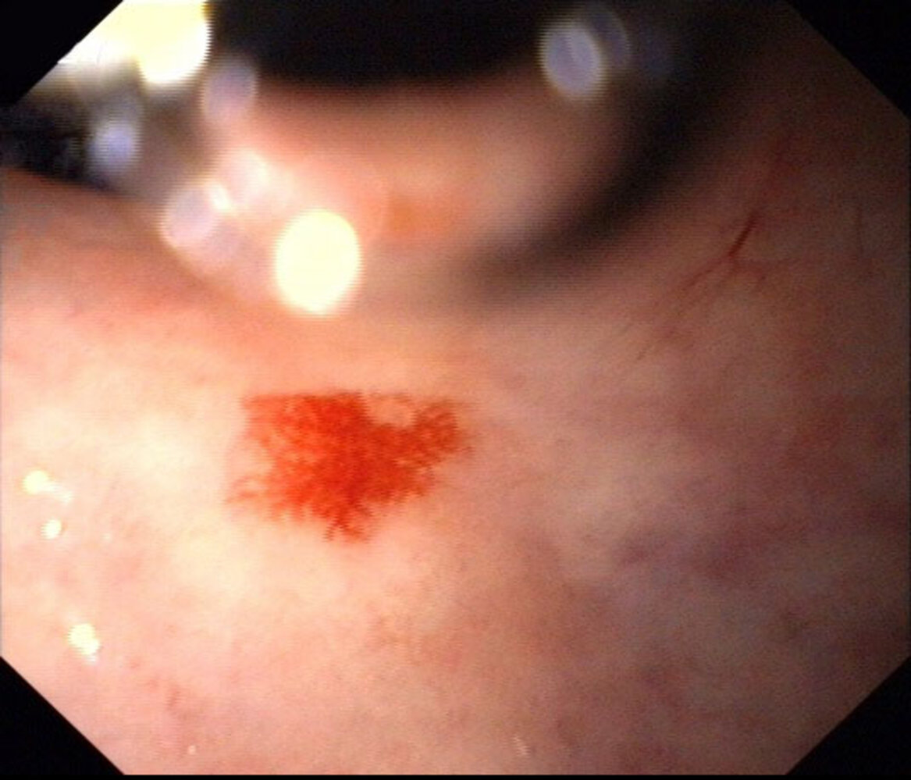
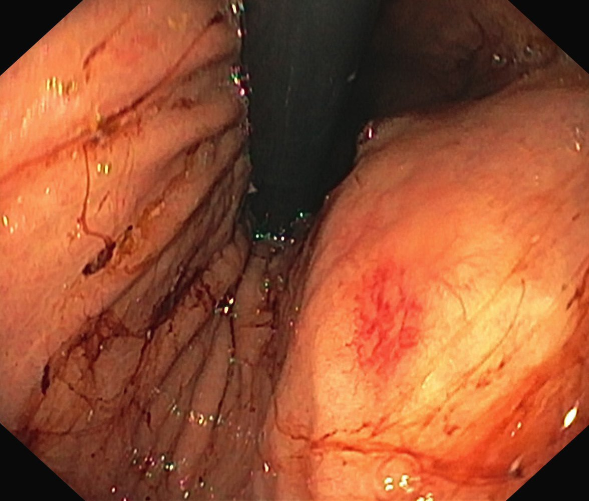

# Angiodysplasia

*Categories: Clinical knowledge > Emergency medicine > Gastrointestinal disorders > Angiodysplasia*

[Original Article Link](https://coursology-qbank.com/amboss/article/g80FN3)

---

## Summary

Angiodysplasia is a degenerative disorder of gastrointestinal (GI) <u>blood vessels</u> in which abnormal connections between <u>veins</u> and <u>capillaries</u> are formed, potentially leading to upper and/or <u>lower GI bleeding</u> of variable severity. The precise cause of angiodysplasia is unclear, but it is often linked to <u>von Willebrand disease</u>, <u>end-stage renal disease</u>, and the use of <u>left ventricular assist devices</u>. Diagnosis typically involves endoscopy or imaging studies such as <u>angiography</u> or <u>CT angiography</u>. Endoscopic hemostatic therapy is the first-line treatment, supported by pharmacotherapy (e.g., <u>octreotide</u>, <u>bevacizumab</u>) if lesions are persistent or endoscopic intervention is not feasible.

---

## Epidemiology

* <u>Prevalence</u>: increases with age; predominantly affects individuals > 60 years of age [[1]](https://coursology-qbank.com/amboss/article/ud1p7f0)

* <u>Small bowel</u> angiodysplasia is the most common cause of <u>obscure GI bleeding</u> in individuals > 50 years of age. [[1]](https://coursology-qbank.com/amboss/article/ud1p7f0)[[2]](https://coursology-qbank.com/amboss/article/JqWszm0)[[3]](https://coursology-qbank.com/amboss/article/Fd1g7f0)

Epidemiological data refers to the US, unless otherwise specified.

---

## Etiology

* The exact cause is unclear. [[1]](https://coursology-qbank.com/amboss/article/ud1p7f0)[[2]](https://coursology-qbank.com/amboss/article/JqWszm0)

* Associated with:

* <u>Von Willebrand disease</u> (<u>vWD</u>)

* <u>End-stage renal disease</u>

* Heyde syndrome: triad of <u>aortic stenosis</u>, acquired <u>vWD</u>, and <u>GI bleeding</u> due to angiodysplasia  [[4]](https://coursology-qbank.com/amboss/article/5IWiW50)

* <u>Left ventricular assist devices</u>

---

## Pathophysiology

* Most accepted hypothesis: Low-grade intermittent obstruction of <u>submucosal</u> <u>veins</u> associated with <u>aging</u> and other conditions leads to the formation of angiodysplasias. [[1]](https://coursology-qbank.com/amboss/article/ud1p7f0)

* Lesions consist of ectatic, thin-walled vessels that contain <u>endothelium</u> alone or small amounts of <u>smooth muscle</u>. [[1]](https://coursology-qbank.com/amboss/article/ud1p7f0)[[3]](https://coursology-qbank.com/amboss/article/Fd1g7f0)

* <u>Veins</u> are the most commonly affected vessel, but arteriovenous and arterial changes may also occur.

---

## Clinical features

Presentation and severity vary from occult to life-threatening upper or <u>lower GI bleeding</u>.

* <u>Clinical features of anemia</u>

* Fatigue

* <u>Weakness</u>

* <u>Dizziness</u>

* <u>Shortness of breath</u>

* <u>Tachycardia</u>

* <u>Pallor</u>

* <u>Clinical features of GI bleeding</u>

* <u>Melena</u>

* <u>Hematemesis</u>

* <u>Hematochezia</u>

> [!TIP]
> Most patients with angiodysplasias present with chronic compensated episodic bleeding.

---

## Diagnosis

The diagnostic approach varies according to the severity and presentation of bleeding. For severe <u>GI bleeding</u>, perform initial evaluation concurrently with stabilization and <u>initial management of overt GI bleeding</u>.

### <u>Laboratory studies</u> [[1]](https://coursology-qbank.com/amboss/article/ud1p7f0)[[5]](https://coursology-qbank.com/amboss/article/6Z1jc20)[[6]](https://coursology-qbank.com/amboss/article/-CcDue0)

* <u>Diagnostics of anemia</u>: e.g., <u>CBC</u>, <u>iron studies</u>

* <u>Coagulation studies</u>: e.g., von <u>Willebrand disease</u> diagnostics (see also “<u>Laboratory findings in bleeding disorders</u>”)

* <u>Pretransfusion testing</u>: e.g., blood <u>type and screen</u>, <u>crossmatching</u>

### Endoscopy [[1]](https://coursology-qbank.com/amboss/article/ud1p7f0)[[2]](https://coursology-qbank.com/amboss/article/JqWszm0)

Diagnostic confirmation with endoscopy is preferred.

* Modalities 

* <u>Esophagogastroduodenoscopy</u>

* <u>Video capsule endoscopy</u>  [[2]](https://coursology-qbank.com/amboss/article/JqWszm0)

* <u>Colonoscopy</u>

* Intraoperative <u>enteroscopy</u>  [[1]](https://coursology-qbank.com/amboss/article/ud1p7f0)

* Findings [[2]](https://coursology-qbank.com/amboss/article/JqWszm0)[[3]](https://coursology-qbank.com/amboss/article/Fd1g7f0)

* Lesion characteristics 

* Vessel: flat, cherry-red, and with a fern-like pattern

* Size: < 10 mm

* “Pale halo” sign: a ring of pale <u>mucosa</u> surrounding the angiodysplastic lesion

* The most common locations: <u>colon</u>, <u>duodenum</u>, and <u>jejunum</u> [[3]](https://coursology-qbank.com/amboss/article/Fd1g7f0)

* Approx. 40–60% of patients have > 1 lesion. [[2]](https://coursology-qbank.com/amboss/article/JqWszm0)

Angiodysplasia

Angiodysplasia

### Imaging [[1]](https://coursology-qbank.com/amboss/article/ud1p7f0)

* Indications

* Recurrent bleeding and inconclusive results with all other techniques

* Endoscopy is unavailable or contraindicated.

* Modalities

* <u>Angiography</u> (<u>gold-standard test</u>)

* <u>CT angiography</u>

* <u>MR angiography</u>

* Findings

* Simultaneous arterial and early venous filling (suggests early shunting)

* Dilated vasculature

* Contrast extravasation at the site of active bleeding

> [!TIP]
> Angiodysplasias often occur in multiple locations in the <u>GI tract</u>. [[1]](https://coursology-qbank.com/amboss/article/ud1p7f0)[[3]](https://coursology-qbank.com/amboss/article/Fd1g7f0)

---

## Treatment

### General principles [[2]](https://coursology-qbank.com/amboss/article/JqWszm0)[[5]](https://coursology-qbank.com/amboss/article/6Z1jc20)[[6]](https://coursology-qbank.com/amboss/article/-CcDue0)

* Approach to treatment depends on the severity of bleeding; see "<u>Initial management of overt GI bleeding</u>.”

* Consult specialists early (e.g., gastroenterology, interventional radiology).

* Hemostatic treatment is indicated for patients with <u>overt GI bleeding</u> or complications (e.g., <u>severe anemia</u>).

* For incidentally found lesions and other nonbleeding lesions, treatment is generally not required. [[1]](https://coursology-qbank.com/amboss/article/ud1p7f0)

> [!TIP]
> Spontaneous cessation of bleeding from angiodysplasia occurs in approx. 90% of cases. [[3]](https://coursology-qbank.com/amboss/article/Fd1g7f0)

### Endoscopic therapy [[1]](https://coursology-qbank.com/amboss/article/ud1p7f0)[[3]](https://coursology-qbank.com/amboss/article/Fd1g7f0)

Initial treatment with endoscopic therapy is preferred.

* Indications: symptomatic or <u>overt GI bleeding</u> from lesions amenable to endoscopic therapy

* Techniques

* Argon plasma coagulation

* Electrocoagulation

* <u>Clipping</u>

* <u>Laser ablation</u>

> [!WARNING]
> Re-bleeding occurs in up to one-third of patients with angiodysplasia despite endoscopic therapy and is more frequent in <u>small bowel</u> lesions. [[2]](https://coursology-qbank.com/amboss/article/JqWszm0)

### Pharmacological therapy  [[1]](https://coursology-qbank.com/amboss/article/ud1p7f0)[[3]](https://coursology-qbank.com/amboss/article/Fd1g7f0)

* Indications include:

* Lesions refractory to, or inaccessible via, endoscopic therapy

* Multiple lesions

* High risk of complications with other therapies

* Agents  [[1]](https://coursology-qbank.com/amboss/article/ud1p7f0)

* <u>Somatostatin analogues</u> (e.g., <u>octreotide</u>)

* Antiangiogenics (e.g., <u>bevacizumab</u>, <u>thalidomide</u>)

### Angiographic therapy [[1]](https://coursology-qbank.com/amboss/article/ud1p7f0)[[3]](https://coursology-qbank.com/amboss/article/Fd1g7f0)

* Indications include:

* Signs of <u>hypovolemic shock</u>

* Lesions refractory to, or inaccessible via, endoscopic therapy

* Endoscopy is contraindicated.  [[1]](https://coursology-qbank.com/amboss/article/ud1p7f0)

* Techniques

* Embolization of the vessel

* <u>Vasopressin infusion</u>

### Surgical therapy [[1]](https://coursology-qbank.com/amboss/article/ud1p7f0)[[3]](https://coursology-qbank.com/amboss/article/Fd1g7f0)

Surgical therapy is reserved for patients with a clearly defined source of bleeding.

* Indications include:

* Severe active bleeding refractory to other therapies [[1]](https://coursology-qbank.com/amboss/article/ud1p7f0)

* Recurrent chronic bleeding that requires multiple <u>blood transfusions</u>

* Technique

* Intraoperative <u>enteroscopy</u> or guided endoscopic therapy

* Partial surgical resection

> [!TIP]
> Patients with <u>aortic stenosis</u> and multiple angiodysplastic lesions who do not respond to standard endoscopic treatment may require <u>aortic valve replacement</u>. [[1]](https://coursology-qbank.com/amboss/article/ud1p7f0)[[3]](https://coursology-qbank.com/amboss/article/Fd1g7f0)

---