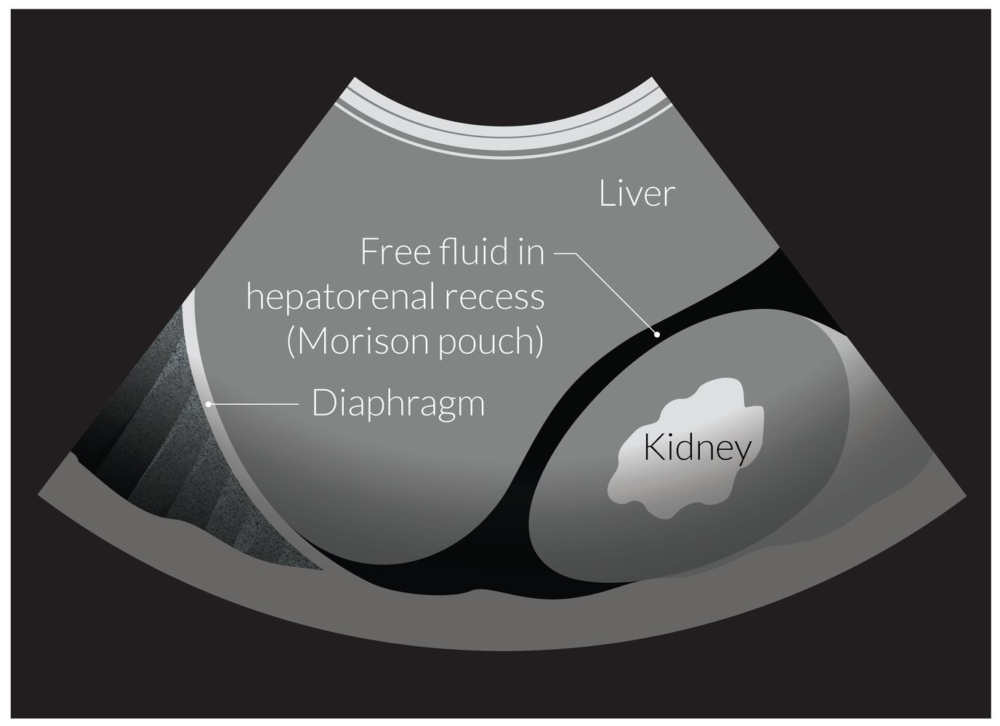
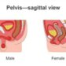
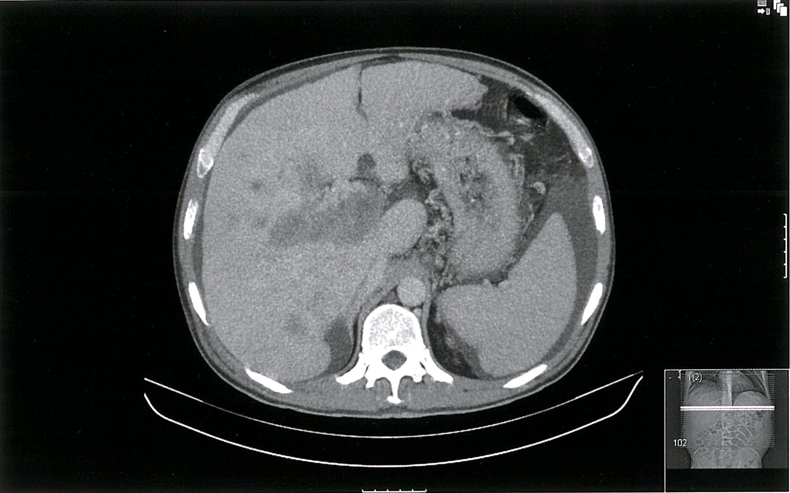
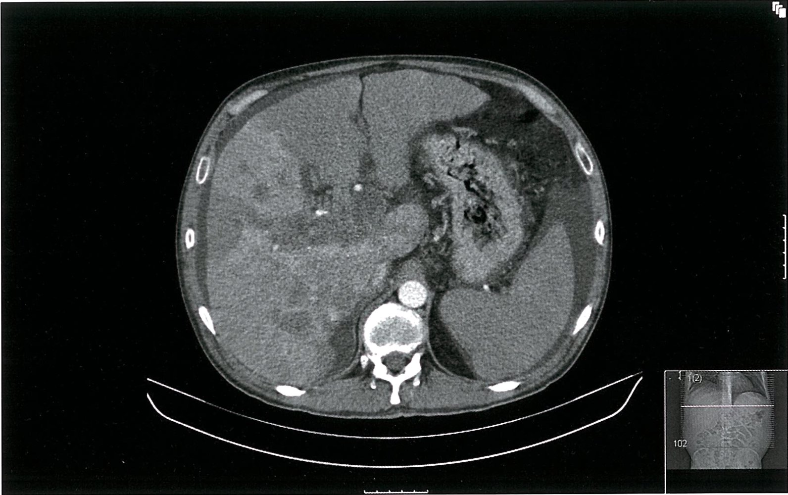
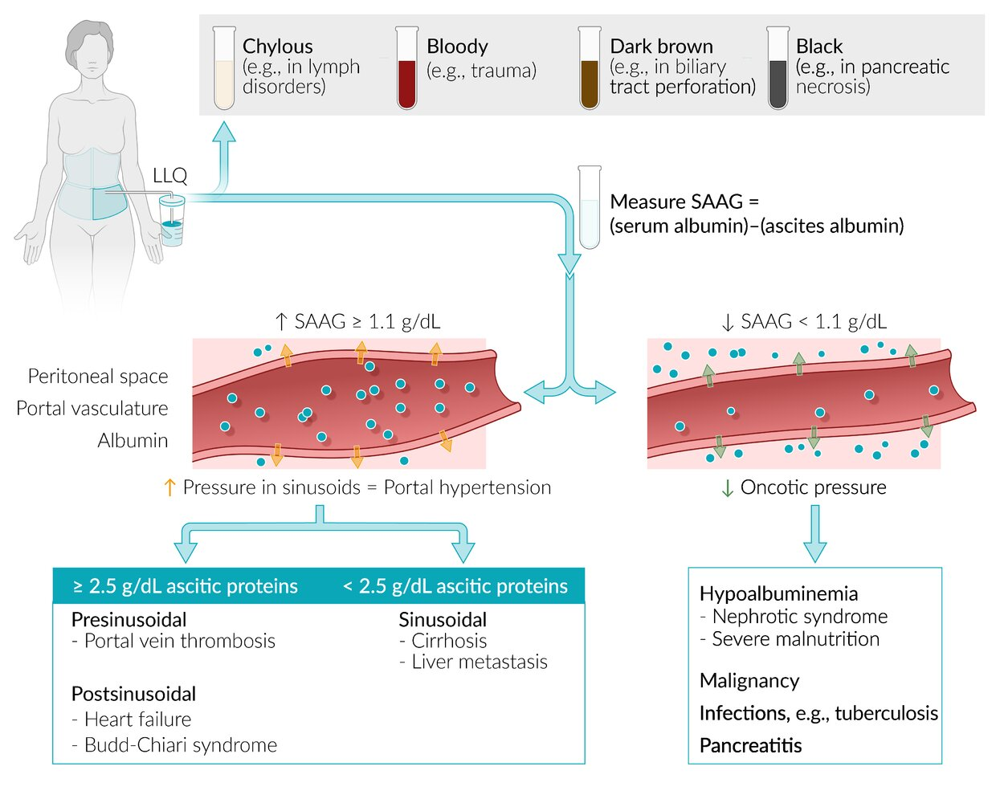

# Ascites

*Categories: Clinical knowledge > Emergency medicine > Gastrointestinal disorders > Ascites*

[Original Article Link](https://coursology-qbank.com/amboss/article/KS0U0f)

---

## Summary

Ascites is the abnormal accumulation of fluid within the <u>peritoneal cavity</u> and is a common complication of <u>portal hypertension</u> (e.g., due to <u>liver cirrhosis</u>, <u>acute liver failure</u>) and/or <u>hypoalbuminemia</u> (e.g., due to <u>nephrotic syndrome</u>). Other conditions resulting in ascites include chronic <u>heart failure</u>, inflammation of abdominal <u>viscera</u> (e.g., <u>pancreatitis</u>), and malignancies. Clinical features include progressive abdominal distention, <u>shifting dullness</u>, and a positive <u>fluid wave test</u>. Abdominal <u>pain</u> may be present in ascites due to <u>acute inflammation</u>. Diagnostics are aimed at identifying the underlying etiology and determining whether the ascitic fluid is infected. They include imaging (e.g., with abdominal <u>ultrasound</u> or CT abdomen and <u>pelvis</u>), which is used to identify free <u>intraperitoneal</u> fluid and possibly the underlying cause, and <u>diagnostic paracentesis</u> with <u>ascitic fluid analysis</u>. The <u>serum-ascites albumin gradient</u> (<u>SAAG</u>), or the difference between <u>albumin</u> levels in serum and ascitic fluid, is essential to determine the underlying cause. A <u>high SAAG</u> indicates that the ascites is secondary to <u>portal hypertension</u>. An ascitic fluid <u>neutrophil</u> count ≥ 250/mm³ indicates <u>spontaneous bacterial peritonitis</u> (<u>SBP</u>), which should be urgently managed with <u>empiric antibiotic therapy</u>. <u>Management of ascites</u> involves identifying and managing the underlying cause as well as dietary <u>sodium</u> restriction and <u>diuretic</u> therapy. Additionally, tense ascites and <u>refractory ascites</u> require <u>therapeutic paracentesis</u>. <u>Liver transplant</u> is a treatment option for patients with <u>cirrhosis</u> who develop ascites. Transjugular intrahepatic <u>portosystemic shunts</u> (<u>TIPS</u>) and <u>peritoneovenous shunts</u> are advanced treatment options for <u>refractory ascites</u>, which carries a high risk of mortality.

---

## Etiology

* <u>Portal hypertension</u>

* <u>Cirrhosis</u> (most common cause of ascites; approx. 85%)

* <u>Liver metastases</u>

* <u>Budd-Chiari syndrome</u>

* <u>Right heart failure</u>

* <u>Portal vein thrombosis</u>

* <u>Hypoalbuminemia</u>

* <u>Nephrotic syndrome</u>

* Severe <u>malnutrition</u>

* <u>Protein-losing enteropathy</u>

* Acute or chronic hepatic failure

* <u>Malignancy</u>

* <u>Peritoneal carcinomatosis</u>, especially from ovarian, <u>breast</u>, bronchial, gastric, <u>pancreatic</u>, and <u>colorectal carcinoma</u>

* <u>Lymphomas</u> with <u>peritoneal</u> involvement

* <u>Liver metastases</u>

* Infection:  (e.g., <u>tuberculosis</u>, <u>serositis</u>)

* <u>Pancreatitis</u>

References:[[1]](https://coursology-qbank.com/amboss/article/U30b3f)[[2]](https://coursology-qbank.com/amboss/article/Tp06KS)[[3]](https://coursology-qbank.com/amboss/article/hp0c6S)

---

## Pathophysiology

|  Pathogenesis of ascites [[4]](https://coursology-qbank.com/amboss/article/kIYm1q)[[5]](https://coursology-qbank.com/amboss/article/HccKdY0)  |  |  |
| --- | --- | --- |
| Etiology |  | Pathophysiology |
| <u>Portal hypertension</u> |  |   * ↑ <u>Hydrostatic pressure</u> in the <u>portal vein</u> or its tributaries →  * ↑ Hydrostatic pressure in the <u>splanchnic</u> and <u>peritoneal</u> <u>capillaries</u> → fluid transudation from the <u>serosa of the gastrointestinal tract</u> and <u>peritoneum</u>  * Mechanical <u>stress</u> (e.g., shearing forces) on the vascular <u>endothelium</u> → ↑ <u>Vasodilator</u> (e.g., <u>nitric oxide</u>) production in the intestinal <u>microcirculation</u> → <u>splanchnic</u> arterial <u>vasodilation</u> → ↓ circulating fluid volume → renal <u>hypoperfusion</u> → <u>vasopressin</u> release and <u>RAAS</u> activation → ↑ renal water and <u>sodium</u> retention  * ↑ <u>Hydrostatic pressure</u> in the <u>hepatic sinusoids</u> → ↑ hydrostatic pressure in the hepatic lymphatic vessels → fluid transudation from the <u>liver</u> surface    |
| <u>Hypoalbuminemia</u> |  |  * ↓ <u>Intravascular</u> <u>colloid osmotic pressure</u> → fluid transudation from the <u>intravascular space</u> to the <u>peritoneal cavity</u>   |
| <u>Malignancy</u> |  |   * <u>Peritoneal carcinomatosis</u> → blockage of lymphatic channels and increased vascular permeability → accumulation of protein-rich <u>peritoneal</u> fluid  * <u>Lymphoma</u> → obstruction of <u>retroperitoneal</u> lymphatic vessels → accumulation of <u>chyle</u> (<u>chylous ascites</u>)    |
| <u>Tuberculosis</u> |  |  * Tubercles located on the <u>peritoneum</u> → production of protein-rich fluid in the <u>peritoneal cavity</u>   |
| <u>Pancreatitis</u> |  |  * Leakage of enzyme-rich <u>pancreatic</u> fluid into the <u>peritoneal cavity</u> → <u>peritoneal</u> inflammation → ↑ vascular permeability → accumulation of protein-rich <u>peritoneal</u> fluid   |

> [!TIP]
> The primary mechanism that leads to ascites in <u>cirrhosis</u> is <u>portal hypertension</u>. <u>Hypoalbuminemia</u> can contribute to the formation of, and exacerbate, ascites in <u>cirrhosis</u>.

---

## Clinical features

* Progressive abdominal distention ; symptoms associated with increased abdominal distention include:

* Early satiety

* Weight gain

* <u>Dyspnea</u>

* <u>Diarrhea</u>, which, if chronic, may manifest with features of <u>malnutrition</u>

* Abdominal <u>pain</u> may be present

* Flank dullness: typically elicited only if > 1.5 L of ascitic fluid is present [[6]](https://coursology-qbank.com/amboss/article/Lccw1Y0)

* Shifting dullness: change of resonance from dull to <u>tympanic resonance</u> when a patient changes from <u>supine</u> to <u>lateral decubitus position</u>.

* Fluid wave test

* Wave produced by tapping one side of the abdomen in a patient in <u>supine position</u>

* This wave will be transmitted to the other side via ascitic fluid.

* Signs of underlying disease

* Enlarged <u>liver</u>, <u>jaundice</u>, <u>spider angioma</u>, <u>palmar erythema</u>: <u>signs of chronic liver disease</u>

* Elevated <u>jugular venous pressure</u>, <u>orthopnea</u>, and <u>peripheral edema</u>: <u>heart failure</u>

* <u>Virchow node</u> and weight loss: abdominal or <u>pelvic</u> <u>malignancy</u>

Ascites: Shifting Dullness - Clinical Examination

References:[[2]](https://coursology-qbank.com/amboss/article/Tp06KS)

---

## Subtypes and variants

### Chylous ascites

* Definition: a collection of <u>lymph</u> in the <u>abdominal cavity</u>, which is characteristically <u>triglyceride</u>-rich and has a milky appearance

* Etiology: <u>malignancy</u> (e.g., <u>lymphoma</u>), <u>hepatic cirrhosis</u>, or other <u>lymph</u> disorders (e.g., lymphatic <u>hyperplasia</u>) which result in increased <u>lymph</u> production

### Hemorrhagic ascites

* Definition: ascitic fluid in the <u>peritoneal cavity</u> with a <u>RBC count</u> > 50,000/mm³ [[7]](https://coursology-qbank.com/amboss/article/-YWD7P0)

* Etiology: : may be spontaneous (e.g., due to <u>peritoneal carcinomatosis</u> or a malignant mass eroding into vessels) or <u>iatrogenic</u> (e.g., following <u>paracentesis</u> or <u>biopsy</u> in patients with <u>cirrhosis</u>)

### <u>Pancreatic ascites</u>

* Definition: an accumulation of <u>pancreatic</u> fluid (high <u>amylase</u> levels > 1,000 IU/L) in the <u>peritoneal cavity</u>

* Etiology: <u>pancreatic duct</u> disruption (e.g., an acute attack of <u>pancreatitis</u>, <u>pancreatic surgery</u> and/or trauma), <u>pseudocyst</u> leak/rupture

---

## Diagnosis

Diagnostics are used to confirm the presence of ascites, assess the severity, determine the underlying etiology, and evaluate for complications. [[8]](https://coursology-qbank.com/amboss/article/BTXzGx)

### Imaging [[9]](https://coursology-qbank.com/amboss/article/WCcPIe0)[[10]](https://coursology-qbank.com/amboss/article/2gXTux)

#### Abdominal <u>ultrasound</u> with Doppler (initial study of choice)

* Indications

* Clinical suspicion of new-onset ascites

* Evaluation for an underlying condition (e.g., <u>cirrhosis</u>, intraabdominal <u>malignancy</u>)  [[11]](https://coursology-qbank.com/amboss/article/lkbvLF)

* <u>Ultrasound</u>-guided <u>paracentesis</u>

* Supportive findings

* Free <u>intraperitoneal</u> fluid  

* Uncomplicated nonhemorrhagic ascites typically appears <u>hypoechoic</u>/<u>anechoic</u>

* Internal echoes, debris, and septations are suggestive of <u>exudates</u>.  [[10]](https://coursology-qbank.com/amboss/article/2gXTux)

* Features of underlying etiology (e.g., <u>liver cirrhosis</u>, <u>hepatocellular carcinoma</u>, <u>Budd-Chiari syndrome</u>, <u>portal vein thrombosis</u>, <u>ovarian tumors</u>; see respective articles for details)

AMBOSS POCUS series | Free fluid in hepatorenal recess (Morison pouch)

AMBOSS POCUS series | Free fluid in splenorenal recess

Free fluid in hepatorenal space (Morison pouch)

Identifying ascites on ultrasound

#### CT abdomen and <u>pelvis</u>  [[8]](https://coursology-qbank.com/amboss/article/BTXzGx)

* Indications: to work up for the underlying cause as needed; examples include  [[8]](https://coursology-qbank.com/amboss/article/BTXzGx)[[11]](https://coursology-qbank.com/amboss/article/lkbvLF)

* <u>GI perforation</u> in patients with postoperative or traumatic ascites

* <u>Secondary peritonitis</u>

* <u>Malignancy</u>

* Findings

* Free <u>intraperitoneal</u> fluid

* Fluid density depends on the type of ascites

Hepatocellular carcinoma with portal vein thrombosis 1/2

Hepatocellular carcinoma with portal vein thrombosis 2/2

Multiple liver masses in cirrhosis

### <u>Laboratory studies</u> [[9]](https://coursology-qbank.com/amboss/article/WCcPIe0)

The choice of <u>laboratory studies</u> should be guided by the <u>pretest probability</u> of the suspected underlying etiology.

* <u>CBC</u>: abnormalities related to an underlying condition

* <u>Coagulation panel</u>: <u>Thrombocytopenia</u> and <u>coagulopathy</u> are signs of advanced <u>liver</u> disease.

* <u>Liver chemistries</u>

* <u>Elevated transaminases</u> suggest <u>liver</u> disease.

* Serum <u>albumin</u> (for <u>SAAG</u> calculation)

* <u>BMP</u>

* Elevated <u>creatinine</u> and <u>BUN</u>: <u>Acute kidney injury</u> is common in patients with <u>decompensated cirrhosis</u>.  [[12]](https://coursology-qbank.com/amboss/article/2SXT_x)

* Serum <u>electrolytes</u>: <u>hypervolemic hypotonic hyponatremia</u> (as a complication of <u>cirrhosis</u>)  [[13]](https://coursology-qbank.com/amboss/article/gtXF1-)

* Additional evaluation for the underlying condition: E.g., see “<u>Diagnostics for cirrhosis</u>.”

### Ascitic fluid analysis [[5]](https://coursology-qbank.com/amboss/article/HccKdY0)[[8]](https://coursology-qbank.com/amboss/article/BTXzGx)[[9]](https://coursology-qbank.com/amboss/article/WCcPIe0)

#### Sampling technique

* Obtained via <u>diagnostic paracentesis</u>

* See “<u>Paracentesis</u>” for further details on indications, contraindications, steps, troubleshooting, and complications of this procedure.

#### Indications

* All patients with new-onset ascites to identify the underlying cause  [[5]](https://coursology-qbank.com/amboss/article/HccKdY0)[[6]](https://coursology-qbank.com/amboss/article/Lccw1Y0)[[8]](https://coursology-qbank.com/amboss/article/BTXzGx)

* Patients at risk of <u>spontaneous bacterial peritonitis</u> (<u>SBP</u>): See “<u>Indications for diagnostic paracentesis in SBP</u>” for details.

#### Routine peritoneal fluid analysis

* Gross appearance of ascitic fluid: can help determine the underlying cause or complications

* Transparent to yellow: uncomplicated ascites

* Cloudy: infection or <u>malignancy</u>

* Bloody: trauma or <u>malignancy</u>

* Milky: <u>chylous ascites</u>

* Dark brown: suggests a biliary leak (e.g., <u>gallbladder perforation</u>)

* Cell count and differential: A <u>neutrophil</u> count ≥ 250/mm³ indicates <u>spontaneous bacterial peritonitis</u>.

* Serum-ascites albumin gradient (<u>SAAG</u>) can be used to differentiate between ascites due to <u>portal hypertension</u> and non-portal hypertensive ascites. 

* <u>SAAG</u> = (<u>albumin</u> levels in serum) - (<u>albumin</u> levels in ascitic fluid)

* High SAAG ascites: ≥ 1.1 g/dL, indicates <u>portal hypertension</u> with ∼ 97% <u>accuracy</u>.  [[9]](https://coursology-qbank.com/amboss/article/WCcPIe0)

* Low SAAG ascites: < 1.1 g/dL, indicates non-portal hypertensive ascites.

* Ascitic fluid <u>albumin</u>: for <u>SAAG</u> calculation (obtain same-day serum and ascitic fluid samples)

* Ascitic fluid total protein

* To differentiate hepatic from cardiac causes in <u>high SAAG ascites</u>

* To differentiate <u>SBP</u> (typically ≤ 1 g/dL) from <u>secondary peritonitis</u> (typically > 1 g/dL)  [[9]](https://coursology-qbank.com/amboss/article/WCcPIe0)[[14]](https://coursology-qbank.com/amboss/article/LSXwZB)

|  Differential diagnoses of ascites based on <u>SAAG</u> and ascitic fluid total protein [[6]](https://coursology-qbank.com/amboss/article/Lccw1Y0)[[8]](https://coursology-qbank.com/amboss/article/BTXzGx)  |  |  |
| --- | --- | --- |
|  | Ascites due to <u>portal hypertension</u> | Ascites due to other causes |
| <u>SAAG</u> |  * ≥ 1.1 g/dL   |  * < 1.1 g/dL   |
| Ascitic fluid total protein levels |   * ↑ Protein levels (> 2.5 g/dL)   * <u>Right heart failure</u>  * Early <u>Budd-Chiari syndrome</u>  * ↓ Protein levels (< 2.5 g/dL)   * <u>Cirrhosis</u>  * Severe <u>liver metastases</u>  * Late <u>Budd-Chiari syndrome</u>    |   * ↑ Protein levels (> 2.5 g/dL)  * <u>Peritoneal carcinomatosis</u>  * <u>Pancreatitis</u>  * <u>Tuberculosis</u>  * <u>Chylous ascites</u> (not secondary to <u>cirrhosis</u>)  * ↓ Protein levels (< 2.5 g/dL)  * <u>Nephrotic syndrome</u>  * Severe <u>malnutrition</u>    |

Ascitic fluid analysis

#### Additional studies

* Suspected infection

* Microbiology: <u>Gram stain</u> and ascitic fluid culture in <u>blood culture</u> bottles (aerobic and anaerobic)  [[11]](https://coursology-qbank.com/amboss/article/lkbvLF)

* Studies to differentiate <u>SBP</u> from secondary spontaneous <u>peritonitis</u>: <u>LDH</u>, <u>glucose</u>, <u>CEA</u>, <u>alkaline phosphatase</u> (see “<u>Spontaneous bacterial peritonitis</u>” for details)

* <u>Acid-fast bacilli</u> smear and <u>mycobacterial</u> cultures (low <u>sensitivity</u>): only if there is clinical suspicion or a high risk of tuberculous <u>peritonitis</u>

* Suspected <u>malignancy</u> (e.g., <u>peritoneal carcinomatosis</u>)

* Ascitic fluid <u>cytology</u>

* Ascitic fluid <u>tumor markers</u>: not routinely recommended for the assessment of <u>malignancy</u>-related ascites 

* <u>Cancer antigen 125</u> (<u>CA-125</u>): elevated in most patients with ascites regardless of cause

* <u>Carcinoembryonic antigen</u> (<u>CEA</u>): may be elevated in patients with gastric and intestinal <u>adenocarcinoma</u> [[11]](https://coursology-qbank.com/amboss/article/lkbvLF)

* Suspected <u>chylous ascites</u> (milky ascitic fluid): ascitic fluid <u>triglyceride</u> levels > 200 mg/dL indicate <u>chylous ascites</u> [[15]](https://coursology-qbank.com/amboss/article/6SXj0B)

* Suspected <u>pancreatic ascites</u> or <u>bowel perforation</u>: elevated ascitic fluid <u>amylase</u> levels suggest <u>pancreatitis</u> or <u>bowel perforation</u> [[16]](https://coursology-qbank.com/amboss/article/KSXU0B)

> [!TIP]
> Occult <u>SBP</u> is common in patients with ascites and <u>cirrhosis</u>, and delays in diagnosis increase the risk of <u>death</u>. [[17]](https://coursology-qbank.com/amboss/article/PkbWLF)

---

## Treatment

### Approach [[5]](https://coursology-qbank.com/amboss/article/HccKdY0)[[8]](https://coursology-qbank.com/amboss/article/BTXzGx)[[9]](https://coursology-qbank.com/amboss/article/WCcPIe0)

* All patients

* Identify and treat the underlying condition.

* <u>Therapeutic paracentesis</u> for tense or <u>large ascites</u>

* Patients with <u>cirrhotic</u> ascites

* <u>Treatment of cirrhosis</u>, including avoidance of certain medications such as <u>NSAIDs</u> and <u>ACE inhibitors</u>

* <u>Sodium</u> restriction and <u>diuretics</u> are the mainstays of medical and supportive therapy.  [[11]](https://coursology-qbank.com/amboss/article/lkbvLF)

* Consider advanced therapies for <u>refractory ascites</u>, e.g., <u>liver transplant</u>.

* Patients with noncirrhotic ascites: treatment of the underlying cause, e.g.

* <u>Surgery</u> or <u>radiochemotherapy</u> for <u>malignancy</u>

* <u>Treatment of heart failure</u>

* <u>Antituberculosis therapy</u>

> [!TIP]
> Obtain hepatology consult for patients with new-onset ascites and known or suspected <u>liver</u> disease.

### Medical and supportive therapy [[5]](https://coursology-qbank.com/amboss/article/HccKdY0)[[9]](https://coursology-qbank.com/amboss/article/WCcPIe0)[[18]](https://coursology-qbank.com/amboss/article/Nkb-LF)

This section details the <u>management of ascites</u> due to <u>cirrhosis</u>. Medical and/or supportive management of other causes of ascites (e.g., <u>heart failure</u>, <u>nephrotic syndrome</u>, <u>peritoneal carcinomatosis</u>, <u>tuberculosis</u>) are outlined in the respective articles for these conditions.

#### Salt and fluid restriction

* Dietary <u>sodium</u> restriction: 2 g/day or 88 mEq/d (2 g of <u>sodium</u> = 5 g of salt)

* Recommended for all patients

* Advise patients to restrict the amount of salt in home-cooked meals and to avoid precooked and prepackaged food.

* Consider referral to a nutritionist for counseling.

* Fluid restriction: 1 L/day (only if serum Na+< 125 mEq/L)

#### <u>Diuretics</u>

* Monotherapy with <u>spironolactone</u> DOSAGE may be preferable for new-onset ascites, <u>mild ascites</u>, <u>moderate ascites</u>, and outpatients.

* Combination therapy with <u>spironolactone</u> DOSAGE PLUS <u>furosemide</u> DOSAGE in a 10:4 <u>ratio</u> may be preferable for recurrent <u>gross ascites</u> or when faster resolution of ascites is required (e.g., in hospitalized patients).

* Once ascites is under control, taper to the minimum effective dose to reduce side effects.

> [!TIP]
> Combination <u>diuretic</u> therapy is associated with more rapid ascites reduction and a lower risk of <u>potassium</u> imbalance than monotherapy. [[11]](https://coursology-qbank.com/amboss/article/lkbvLF)[[18]](https://coursology-qbank.com/amboss/article/Nkb-LF)

> [!WARNING]
> <u>Diuretics</u> should be used with caution in patients with severe <u>hyponatremia</u>, <u>hepatic encephalopathy</u>, and/or renal function deterioration.

#### <u>Empiric antibiotic therapy</u> [[5]](https://coursology-qbank.com/amboss/article/HccKdY0)[[9]](https://coursology-qbank.com/amboss/article/WCcPIe0)

<u>Antibiotic therapy</u> for patients with <u>cirrhosis</u> and ascites is recommended in the following situations:

* Patients with <u>GI bleed</u> due to <u>cirrhosis</u>: <u>ceftriaxone</u> DOSAGE until bleeding resolves and <u>vasopressors</u> are discontinued, for a maximum of 7 days

* <u>SBP</u>: See “<u>Empiric antibiotic therapy for SBP</u>” and “<u>SBP prophylaxis</u>.”

#### Monitoring [[9]](https://coursology-qbank.com/amboss/article/WCcPIe0)[[18]](https://coursology-qbank.com/amboss/article/Nkb-LF)

* Monitor weight, blood pressure, <u>nutritional status</u>, serum <u>electrolytes</u>, and renal function.

* Goals of <u>diuretic</u> therapy

* Patients without <u>peripheral edema</u>: weight loss of up to 0.5 kg/day

* Patients with significant <u>peripheral edema</u>

* Maximum recommended weight reduction: 1 kg/day

* Once <u>edema</u> has resolved, daily weight loss should not exceed 0.5 kg/day

* Discontinue or adjust the dosage of <u>diuretics</u> if adverse effects develop (e.g., <u>hyponatremia</u>, <u>hyperkalemia</u>, renal dysfunction).

### <u>Therapeutic paracentesis</u> [[9]](https://coursology-qbank.com/amboss/article/WCcPIe0)[[18]](https://coursology-qbank.com/amboss/article/Nkb-LF)[[19]](https://coursology-qbank.com/amboss/article/TFX6h-)

See “<u>Paracentesis</u>” for further details on indications, contraindications, steps, troubleshooting, and complications of <u>therapeutic paracentesis</u>.

* Indications

* Tense or <u>large ascites</u> (first-line)

* <u>Refractory ascites</u> (can be repeated every ∼ 2 weeks)

* <u>Malignancy</u>-related ascites

* Contraindications for <u>diuretic</u> therapy

* Important considerations

* Perform under <u>ultrasound</u> guidance to minimize complications. [[20]](https://coursology-qbank.com/amboss/article/Ah1Rgg0)

* Replace <u>albumin</u> during or immediately after the procedure to prevent complications, e.g, <u>postparacentesis circulatory dysfunction</u> (<u>PPCD</u>) in: [[9]](https://coursology-qbank.com/amboss/article/WCcPIe0)[[21]](https://coursology-qbank.com/amboss/article/eDdxWH0)

* All patients undergoing <u>large-volume paracentesis</u>

* Patients with <u>hypotension</u>, <u>hyponatremia</u>, and/or <u>AKI</u>.

* See “<u>PPCD</u>” for <u>albumin</u> dosage.

Paracentesis materials, insertion site, and patient positioning

Principles of a three-way stopcock

### Management of refractory ascites [[9]](https://coursology-qbank.com/amboss/article/WCcPIe0)[[18]](https://coursology-qbank.com/amboss/article/Nkb-LF)[[22]](https://coursology-qbank.com/amboss/article/21cTTY0)

Ascites is considered refractory if it does not respond to treatment or recurs after <u>therapeutic paracentesis</u> despite dietary <u>sodium</u> restriction and high-dose <u>diuretic</u> therapy. The following recommendations apply to <u>refractory ascites</u> in patients with <u>cirrhosis</u>.

* Rule out transient refractoriness to <u>diuretic</u> therapy.

* Optimize medications and ensure adherence to a <u>low-sodium diet</u>.

* Patients who are on <u>beta blockers</u>:

* Monitor blood pressure and renal function.

* Consider dosage adjustment or discontinuation of <u>beta-blockers</u> if severe <u>hypotension</u>, <u>hyponatremia</u>, or renal dysfunction develops.

* Consider <u>midodrine</u> DOSAGE or a <u>vaptan</u> on a case-by-case basis.  [[5]](https://coursology-qbank.com/amboss/article/HccKdY0)[[9]](https://coursology-qbank.com/amboss/article/WCcPIe0)[[23]](https://coursology-qbank.com/amboss/article/EFX8P-)

* Consider discontinuing <u>diuretic</u> therapy if urine Na+ excretion is < 30 mEq/d. [[18]](https://coursology-qbank.com/amboss/article/Nkb-LF)

* Repeat <u>large-volume paracentesis</u> (with IV <u>albumin</u>).

* Evaluate for invasive management options in consultation with specialists.

* <u>Transjugular intrahepatic portosystemic shunt</u> (<u>TIPS</u>)   [[5]](https://coursology-qbank.com/amboss/article/HccKdY0)[[9]](https://coursology-qbank.com/amboss/article/WCcPIe0)

* <u>Liver transplant</u>: patients with significant <u>liver</u> dysfunction and/or failed <u>TIPS</u>   [[24]](https://coursology-qbank.com/amboss/article/XSa9yP)

* <u>Peritoneovenous shunt</u>: patients with <u>refractory ascites</u> who are not candidates for <u>paracentesis</u>, <u>TIPS</u>, or <u>liver transplant</u>

> [!WARNING]
> Half of all patients with <u>cirrhosis</u> who develop <u>refractory ascites</u> die within a year. Do not delay referral for surgical management. [[9]](https://coursology-qbank.com/amboss/article/WCcPIe0)

---

## Complications

* <u>Abdominal wall hernias</u> (e.g., umbilical, inguinal, or <u>incisional hernias</u>)

* <u>Spontaneous bacterial peritonitis</u>

* See also: “<u>Complications of cirrhosis</u>”

We list the most important complications. The selection is not exhaustive.

---