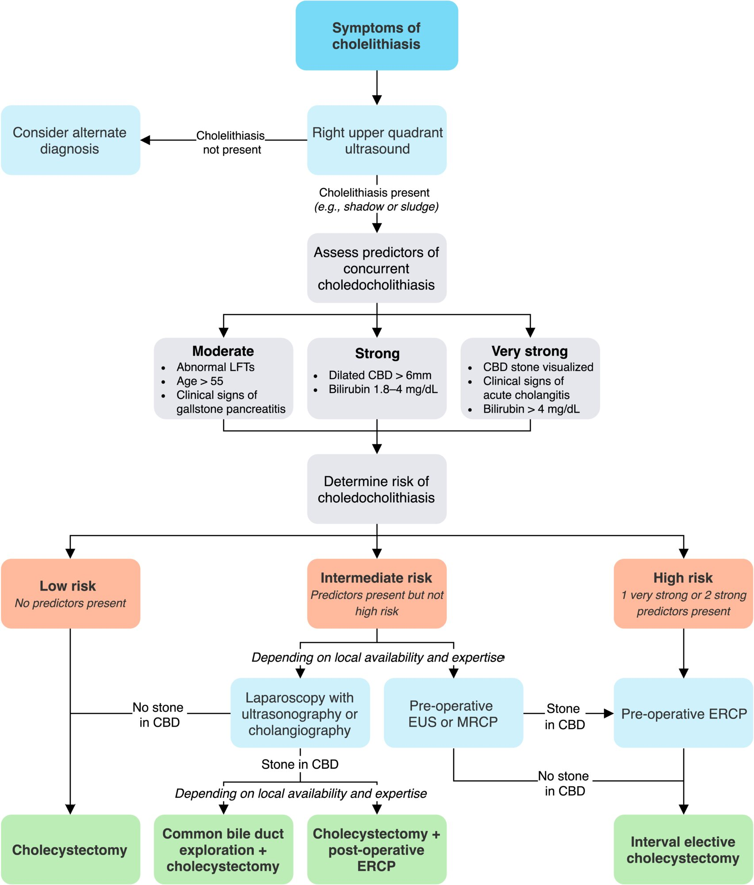
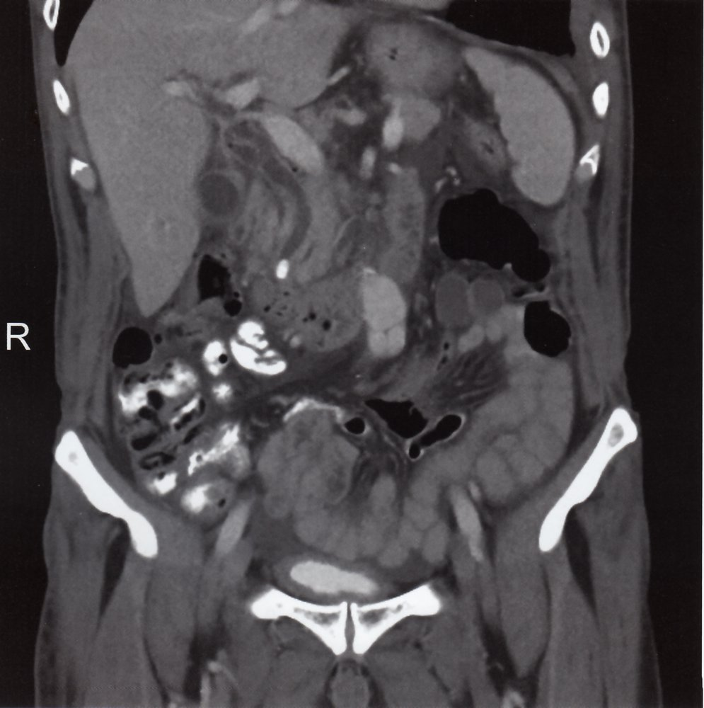
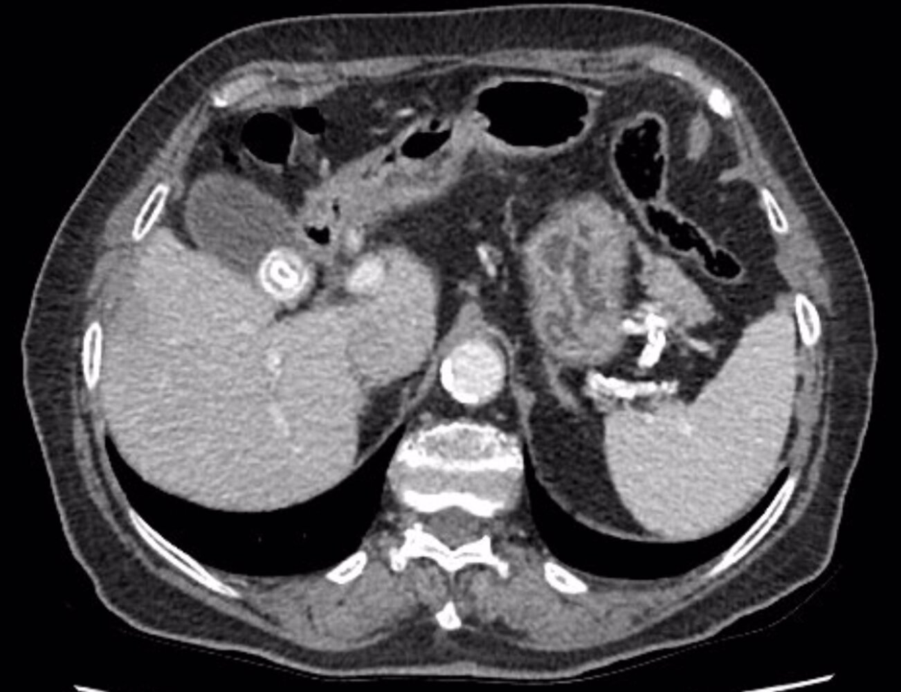
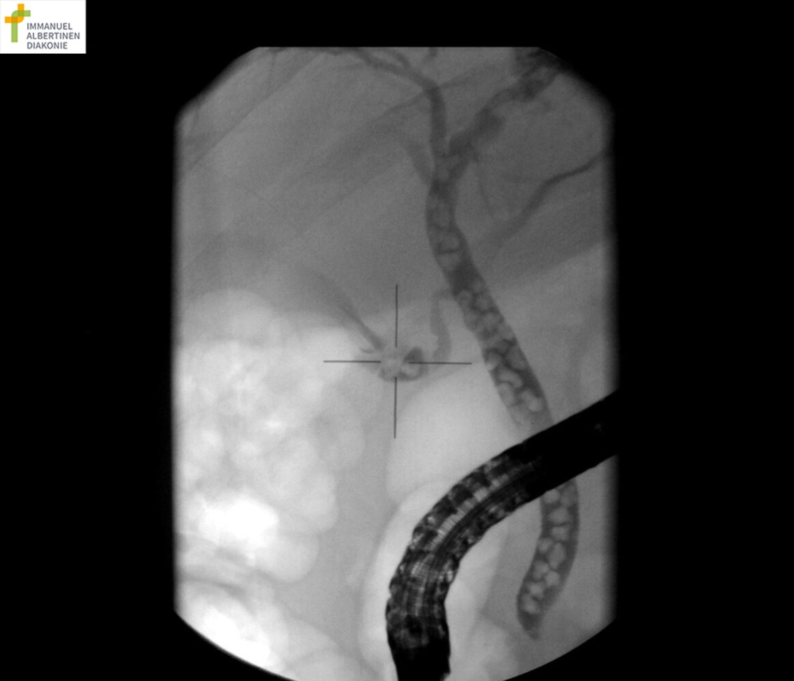
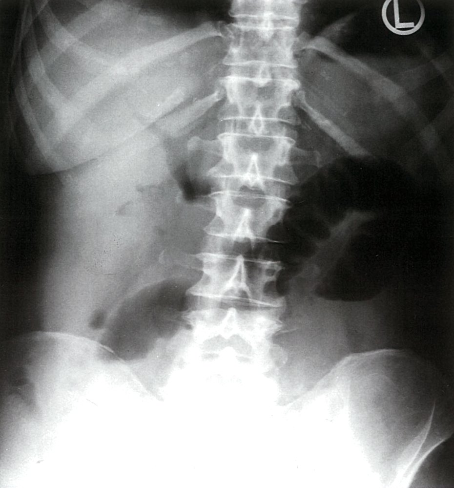

# Choledocholithiasis

*Categories: Clinical knowledge > Emergency medicine > Gastrointestinal disorders > Choledocholithiasis*

[Original Article Link](https://coursology-qbank.com/amboss/article/5I0iWh)

---

## Summary

Choledocholithiasis refers to the presence of <u>gallstones</u> in the <u>common bile duct</u> (<u>CBD</u>). Characteristic clinical features include <u>right upper quadrant</u> <u>pain</u> and signs of extrahepatic <u>cholestasis</u>. Initial diagnostic evaluation includes an <u>ultrasound</u> and routine <u>laboratory studies</u>, and based on the diagnostic likelihood, confirmatory imaging may involve an <u>endoscopic retrograde cholangiopancreatography</u> (<u>ERCP</u>), <u>magnetic resonance cholangiopancreatography</u> (<u>MRCP</u>), or <u>endoscopic ultrasound</u> (<u>EUS</u>). Treatment consists of stone removal (endoscopically or surgically) and preventing recurrence (e.g., via <u>laparoscopic cholecystectomy</u>).

See also “<u>Cholelithiasis</u>,” “<u>Acute cholecystitis</u>,” and “<u>Acute cholangitis</u>.”

---

## Epidemiology

* Sex: : <u>♀</u> > <u>♂</u>

* <u>Prevalence</u>: ∼ 5–20% of patients who undergo <u>cholecystectomy</u> have choledocholithiasis at the time of <u>surgery</u>

* Peak <u>incidence</u>: > 40 years

References: [[1]](https://coursology-qbank.com/amboss/article/80aO3Q)[[2]](https://coursology-qbank.com/amboss/article/4zY3G7)

Epidemiological data refers to the US, unless otherwise specified.

---

## Etiology

* Secondary choledocholithiasis (most common): <u>cholelithiasis</u> → passage of <u>gallstones</u> into the <u>common bile duct</u> → <u>common bile duct</u> obstruction → spasm of the biliary tracts
* <u>Risk factor</u>: a history of <u>cholelithiasis</u>

* Primary choledocholithiasis (less common): conditions predisposing to <u>bile</u> stasis → intraductal stone formation
* <u>Risk factors</u>:

* <u>Cystic fibrosis</u>

* Prolonged <u>total parenteral nutrition</u>

* Postcholecystectomy choledocholithiasis  [[3]](https://coursology-qbank.com/amboss/article/OjbI0F)[[4]](https://coursology-qbank.com/amboss/article/4jb30F)[[5]](https://coursology-qbank.com/amboss/article/kjbm0F)

* Residual choledocholithiasis: <u>CBD</u> stones missed during <u>cholecystectomy</u>; typically becomes symptomatic within 3 years of <u>surgery</u>

* Recurrent choledocholithiasis: <u>CBD</u> stones that developed after <u>cholecystectomy</u>, typically detected after 3 years of <u>surgery</u>
* <u>Risk factors</u> for recurrent stones: periampullary <u>duodenal</u> diverticulum, dilated <u>CBD</u>, <u>CBD</u> stricture, chronic <u>cholangitis</u>, <u>sickle cell anemia</u>, and rapid weight loss (e.g., after <u>bariatric surgery</u>)

> [!TIP]
> Symptoms of choledocholithiasis (<u>jaundice</u>, <u>RUQ</u> <u>pain</u>, abnormal <u>LFTs</u>) in postcholecystectomy patients may be due to recurrent or residual choledocholithiasis but also due to postinterventional <u>biliary strictures</u> or <u>sphincter of Oddi dysfunction</u>. [[6]](https://coursology-qbank.com/amboss/article/wlYh_6)

---

## Clinical features

* <u>RUQ</u> <u>pain</u>

* More severe and prolonged (may last > 6 hours) than in <u>cholelithiasis</u>

* <u>Postprandial</u>

* May radiate to the epigastrium, right shoulder, and back (<u>referred pain</u>)

* <u>Nausea</u>, <u>vomiting</u>, <u>anorexia</u>

* Signs of extrahepatic <u>cholestasis</u> (e.g., <u>jaundice</u>, pale stool, dark urine, <u>pruritus</u>) may be present

* Features of complications: See ''Clinical features'' in <u>acute pancreatitis</u>, <u>acute cholecystitis</u>, and <u>acute cholangitis</u>.  [[5]](https://coursology-qbank.com/amboss/article/kjbm0F)

Murphy Sign - Clinical Examination

---

## Diagnosis

Evaluation for choledocholithiasis should be performed in all patients with confirmed <u>symptomatic cholelithiasis</u>  or in patients presenting with <u>RUQ</u> <u>pain</u> and/or <u>jaundice</u>.

### Approach [[6]](https://coursology-qbank.com/amboss/article/wlYh_6)[[7]](https://coursology-qbank.com/amboss/article/-hbDgt)

See also “<u>Diagnostic workup of acute abdominal pain</u>.”

* Initial evaluation: : <u>Liver function</u> tests (<u>LFTs</u>) and <u>RUQ</u> <u>ultrasound</u> are the preferred first-line diagnostic tests.

* Confirmatory imaging: Determine need for imaging and appropriate modality based on <u>predictors of choledocholithiasis</u>. [[6]](https://coursology-qbank.com/amboss/article/wlYh_6)[[7]](https://coursology-qbank.com/amboss/article/-hbDgt)[[8]](https://coursology-qbank.com/amboss/article/nRb7nt)

* <u>High likelihood of choledocholithiasis</u>: <u>ERCP</u>

* <u>Intermediate likelihood of choledocholithiasis</u>: <u>MRCP</u> or <u>EUS</u>, based on patient preference, operator expertise, and costs

* <u>Low likelihood of choledocholithiasis</u>: Confirmatory imaging is not routinely required.

* In postcholecystectomy patients, consider <u>MRCP</u> or <u>EUS</u> to evaluate for suspected residual or recurrent choledocholithiasis.  [[6]](https://coursology-qbank.com/amboss/article/wlYh_6)

> [!TIP]
> Although normal <u>LFTs</u> and transabdominal <u>RUQ</u> <u>ultrasound</u> may help rule out choledocholithiasis, they cannot reliably confirm the diagnosis. <u>CBD</u> stones are rarely seen on <u>ultrasound</u>.

Management of cholelithiasis and choledocholithiasis

#### Risk <u>stratification</u> [[6]](https://coursology-qbank.com/amboss/article/wlYh_6)

These risk categories help determine the most appropriate confirmatory imaging and can guide disposition.

|  Predictors of choledocholithiasis [[6]](https://coursology-qbank.com/amboss/article/wlYh_6)  |  |
| --- | --- |
| Strength of predictor | Parameter |
| Very strong |   * <u>CBD</u> stone visualized on <u>ultrasound</u>  * Clinical signs of <u>cholangitis</u>  * Total <u>bilirubin</u> > 4 mg/dL    |
| Strong |   * Dilated <u>CBD</u> > 6 mm (with <u>gallbladder</u> in situ)  * Total <u>bilirubin</u> 1.8–4 mg/dL    |
| Moderate |   * Abnormal <u>LFT</u> parameters other than <u>bilirubin</u>  * Patient is > 55 years of age.  * Clinical signs of <u>biliary pancreatitis</u>    |
|  Interpretation [[6]](https://coursology-qbank.com/amboss/article/wlYh_6)[[7]](https://coursology-qbank.com/amboss/article/-hbDgt)   * High likelihood of choledocholithiasis (risk > 50%): ≥ 1 very strong predictor OR 2 strong predictors  * Intermediate likelihood of choledocholithiasis (risk 10–50%): any predictor that does not meet the criteria for high risk  * Low likelihood of choledocholithiasis (risk < 10%): No predictors     |  |

### <u>Laboratory studies</u>

* <u>LFTs</u>

* Characteristic findings: evidence of <u>cholestasis</u>; , i.e., ↑ <u>ALP</u>, ↑ <u>GGT</u>, ↑ total and ↑ direct <u>bilirubin</u>  [[9]](https://coursology-qbank.com/amboss/article/Y3bnSt)[[10]](https://coursology-qbank.com/amboss/article/a3bQSt)[[11]](https://coursology-qbank.com/amboss/article/b3bHSt)

* Predictive value: high <u>negative predictive value</u> (∼ 97%)  [[6]](https://coursology-qbank.com/amboss/article/wlYh_6)

* Tests to rule out related biliary comorbidities 

* <u>CBC</u>: <u>Leukocytosis</u> is seen in <u>cholecystitis</u> or <u>cholangitis</u>.

* <u>Amylase</u>, <u>lipase</u>: elevated in <u>biliary pancreatitis</u>

* See also “Diagnostics” in <u>cholecystitis</u>, <u>cholangitis</u>, and <u>pancreatitis</u>.

### Transabdominal <u>RUQ</u> <u>ultrasound</u> [[6]](https://coursology-qbank.com/amboss/article/wlYh_6)[[12]](https://coursology-qbank.com/amboss/article/03beSt)

* Indications: preferred first-line imaging modality in patients presenting with <u>RUQ</u> <u>pain</u> and/or <u>jaundice</u> [[12]](https://coursology-qbank.com/amboss/article/03beSt)[[13]](https://coursology-qbank.com/amboss/article/9IYNUq)

* Supportive findings

* Dilated <u>common bile duct</u> (<u>CBD</u>): Normal <u>CBD</u> diameter varies according to patient age and whether the <u>gallbladder</u> is intact or has been surgically removed.  [[6]](https://coursology-qbank.com/amboss/article/wlYh_6)

* <u>Gallbladder</u> in situ, age < 50 years: <u>CBD</u> diameter > 6 mm  [[6]](https://coursology-qbank.com/amboss/article/wlYh_6)

* <u>Gallbladder</u> in situ, age > 50 years: <u>CBD</u> diameter > 8 mm  [[14]](https://coursology-qbank.com/amboss/article/R3blRt)

* Postcholecystectomy patients: <u>CBD</u> diameter > 10 mm  [[14]](https://coursology-qbank.com/amboss/article/R3blRt)

* Intrahepatic biliary dilatation may be seen.

* Visualization of an occluding <u>CBD</u> stone   [[6]](https://coursology-qbank.com/amboss/article/wlYh_6)

* Stone(s) within the <u>gallbladder</u> (see ''<u>RUQ</u> transabdominal <u>ultrasound</u>'' in <u>cholelithiasis</u>).  [[6]](https://coursology-qbank.com/amboss/article/wlYh_6)

* Predictive value: high <u>negative predictive value</u> (∼ 95%)  [[6]](https://coursology-qbank.com/amboss/article/wlYh_6)

> [!TIP]
> If appropriately trained, consider performing a <u>biliary point-of-care ultrasound</u> (<u>POCUS</u>) to rule-in choledocholithiasis by identifying a dilated <u>CBD</u> or a stone in the <u>CBD</u>. If the <u>biliary POCUS</u> is negative, but clinical suspicion remains high, consider additional imaging (e.g., <u>formal ultrasound</u>, <u>EUS</u>, <u>MRCP</u>).

Tumefactive biliary sludge

### CT abdomen with IV contrast [[6]](https://coursology-qbank.com/amboss/article/wlYh_6)[[12]](https://coursology-qbank.com/amboss/article/03beSt)

CT is not routinely recommended if there is a strong suspicion for choledocholithiasis, but it may help exclude alternate diagnoses with similar presentations.

* Supportive findings

* Dilated <u>CBD</u> with/without dilation of the intrahepatic biliary tree

* <u>Target sign</u>: concentric rings formed by a central <u>hypodense</u> stone surrounded by a rim of iso/<u>hyperdense</u> <u>bile</u> [[15]](https://coursology-qbank.com/amboss/article/l3bvit)

* <u>Calcium</u>-containing stones may be visualized within the <u>CBD</u> (only 15–20 % stones).  [[16]](https://coursology-qbank.com/amboss/article/O3bIit)

Choledocholithiasis with biliary obstruction

Choledocholithiasis with biliary obstruction

Cholelithiasis and choledocholithiasis

### Endoscopic retrograde cholangiopancreatography (<u>ERCP</u>)

* Indication: preferred confirmatory imaging for patients with a <u>high likelihood of choledocholithiasis</u>

* Diagnostic and therapeutic

* Highly sensitive and specific (∼ 95%) [[17]](https://coursology-qbank.com/amboss/article/G3bBPt)

* Contraindication (for urgent <u>ERCP</u>): acute <u>biliary pancreatitis</u> without evidence of <u>cholangitis</u> or <u>biliary obstruction</u>  [[6]](https://coursology-qbank.com/amboss/article/wlYh_6)[[7]](https://coursology-qbank.com/amboss/article/-hbDgt)

* Characteristic findings

* Smooth-walled, well-defined, intraluminal filling defect(s) within the <u>CBD</u>, which may be dilated   [[18]](https://coursology-qbank.com/amboss/article/NTY-Io)[[19]](https://coursology-qbank.com/amboss/article/s3btPt)

* Dilation of the intrahepatic biliary tree

* <u>Cholelithiasis</u>: mobile filling defect(s) within the <u>gallbladder</u> lumen

* Complications [[20]](https://coursology-qbank.com/amboss/article/xzYEE7)

* Post-ERCP pancreatitis: <u>pancreatic</u> inflammation secondary to <u>ERCP</u>

* <u>Incidence</u>: ∼ 3.5%  [[20]](https://coursology-qbank.com/amboss/article/xzYEE7)

* Diagnostic criteria (all of the following) ;  [[21]](https://coursology-qbank.com/amboss/article/QjbuZF)

* New or worsened postinterventional abdominal <u>pain</u>

* New or prolonged hospitalization (at least 2 days)

* Serum <u>amylase</u> > 3 times the upper limit, measured > 24 hours after the intervention

* Prevention: Consider <u>indomethacin</u> DOSAGE in high-risk patients

* Perforation, hemorrhage (both have an <u>incidence</u> of ∼ 1%)

* Infection: <u>cholangitis</u>, <u>acute cholecystitis</u> (uncommon)

* <u>Bile</u> duct injury resulting in <u>bile duct strictures</u> (uncommon)

Choledocholithiasis

### <u>Magnetic resonance cholangiopancreatography</u> (MRCP)

* Indications

* Patients with an <u>intermediate likelihood of choledocholithiasis</u> [[7]](https://coursology-qbank.com/amboss/article/-hbDgt)

* Suspected postcholecystectomy choledocholithiasis [[6]](https://coursology-qbank.com/amboss/article/wlYh_6)

* Characteristic findings: similar to <u>ERCP</u> findings [[17]](https://coursology-qbank.com/amboss/article/G3bBPt)

* Advantages: noninvasive procedure; <u>sensitivity</u> and <u>specificity</u> rates similar to <u>ERCP</u> [[17]](https://coursology-qbank.com/amboss/article/G3bBPt)

Cholelithiasis and choledocholithiasis (MRCP)

### <u>Endoscopic ultrasound</u> (<u>EUS</u>) [[6]](https://coursology-qbank.com/amboss/article/wlYh_6)[[7]](https://coursology-qbank.com/amboss/article/-hbDgt)[[17]](https://coursology-qbank.com/amboss/article/G3bBPt)

* Indication: alternative to <u>MRCP</u> in patients with an <u>intermediate likelihood of choledocholithiasis</u> or suspected postcholecystectomy choledocholithiasis [[6]](https://coursology-qbank.com/amboss/article/wlYh_6)[[7]](https://coursology-qbank.com/amboss/article/-hbDgt)

* Second-line confirmatory imaging modality if <u>MRCP</u> findings are inconclusive

* Preferred confirmatory imaging modality in patients with acute <u>biliary pancreatitis</u> and suspected choledocholithiasis [[7]](https://coursology-qbank.com/amboss/article/-hbDgt)

* Characteristic findings: same as transabdominal <u>ultrasound</u>

* Advantages: highly sensitive and specific    [[6]](https://coursology-qbank.com/amboss/article/wlYh_6)[[17]](https://coursology-qbank.com/amboss/article/G3bBPt)[[22]](https://coursology-qbank.com/amboss/article/xFcE4V0)

### Intraoperative imaging for suspected choledocholithiasis [[7]](https://coursology-qbank.com/amboss/article/-hbDgt)

* Indications

* Planned elective <u>laparoscopic</u> or <u>open cholecystectomy</u>

* An alternative option to evaluate for choledocholithiasis in patients with an <u>intermediate likelihood of choledocholithiasis</u>

* May be considered in patients with a <u>low likelihood of choledocholithiasis</u> if the index of suspicion remains high [[7]](https://coursology-qbank.com/amboss/article/-hbDgt)

* Options

* Intraoperative <u>cholangiography</u>

* Intraoperative <u>ultrasound</u>

---

## Treatment

Treatment is recommended in all patients with choledocholithiasis, even if asymptomatic. The mainstay of treatment is the removal of the obstruction.  [[23]](https://coursology-qbank.com/amboss/article/2EYTEI)

### Approach [[6]](https://coursology-qbank.com/amboss/article/wlYh_6)[[7]](https://coursology-qbank.com/amboss/article/-hbDgt)[[24]](https://coursology-qbank.com/amboss/article/9lYN_6)

* Provide supportive therapy for patients with acute symptoms.

* Provide <u>initial supportive therapy of acute biliary disease</u>, e.g., <u>analgesics</u>, <u>spasmolytics</u>, <u>antiemetics</u>.

* <u>NPO</u> for patients with <u>acute pain</u>

* Identify and treat any complications (e.g., <u>acute pancreatitis</u>, <u>cholangitis</u>, <u>cholecystitis</u>).

* Provide definitive <u>management of choledocholithiasis</u>:

* Removal of <u>CBD</u> stone, e.g., via <u>ERCP</u>

* Elective <u>cholecystectomy</u> to prevent recurrence

Management of cholelithiasis and choledocholithiasis

### Disposition

* <u>High likelihood of choledocholithiasis</u>

* Consult GI for <u>ERCP</u>.

* Arrange outpatient follow-up with general <u>surgery</u> for elective <u>cholecystectomy</u>.

* <u>Intermediate likelihood of choledocholithiasis</u> 

* Consult GI for <u>ERCP</u> if <u>MRCP</u> or <u>EUS</u> confirms the diagnosis.

* OR consult <u>surgery</u> (especially if there is another surgical indication, e.g., <u>cholecystitis</u>).

* <u>Low likelihood of choledocholithiasis</u>: Refer to general <u>surgery</u> for elective <u>cholecystectomy</u>.

### CBD stone removal [[7]](https://coursology-qbank.com/amboss/article/-hbDgt)

* <u>CBD</u> stones may be removed endoscopically (<u>ERCP</u>) or surgically (<u>LCBDE</u>). 

* Preoperative or postoperative <u>diagnosis of choledocholithiasis</u>: <u>ERCP</u>-guided stone extraction is preferred.

* Intraoperative <u>diagnosis of choledocholithiasis</u> during <u>laparoscopic</u> or <u>open cholecystectomy</u>

* Intraoperative <u>CBD</u> exploration (<u>LCBDE</u>) and stone extraction

* OR postoperative <u>ERCP</u>-guided stone extraction

* In patients with postcholecystectomy residual or recurrent choledocholithiasis: <u>ERCP</u> with <u>papillotomy</u> is preferred. [[4]](https://coursology-qbank.com/amboss/article/4jb30F)[[25]](https://coursology-qbank.com/amboss/article/PjbW0F)

* <u>Lithotripsy</u> may be considered in patients not suited, or unwilling, to undergo endoscopic or surgical stone removal.

#### <u>ERCP</u>-guided stone extraction

* Indications

* Suspected choledocholithiasis [[7]](https://coursology-qbank.com/amboss/article/-hbDgt)

* <u>Cholangitis</u> [[26]](https://coursology-qbank.com/amboss/article/FlagAk)

* Consider in <u>biliary pancreatitis</u> caused by persistent choledocholithiasis.  [[7]](https://coursology-qbank.com/amboss/article/-hbDgt)

* Timing: depends on whether there are complications and the timing of diagnosis

* Uncomplicated choledocholithiasis: preoperatively or postoperatively, depending on when the diagnosis was confirmed in relation to <u>cholecystectomy</u>

* Associated <u>cholecystitis</u>: same as that for uncomplicated choledocholithiasis

* Associated <u>cholangitis</u>: depends on the severity of <u>cholangitis</u> as well as operative and anesthesia risks [[27]](https://coursology-qbank.com/amboss/article/DMY1Ip)[[28]](https://coursology-qbank.com/amboss/article/NrY-hq)

* Mild/<u>moderate acute cholangitis</u> in low-risk patients: within 24–48 hours of presentation

* Moderate/<u>severe acute cholangitis</u> or high-risk patients: after resolution of acute symptoms (i.e, after urgent biliary drainage)

* See “<u>Cholangitis</u>” for further details.

* Associated acute <u>biliary pancreatitis</u> with <u>cholangitis</u>: within 24 hours of presentation (see “<u>Acute pancreatitis</u>” for further details) [[29]](https://coursology-qbank.com/amboss/article/HVaKDj)

* Procedure consists of an <u>ERCP</u> combined with any of the following: 

* <u>CBD</u> <u>stenting</u>

* Sphincterotomy and <u>papillary</u> <u>balloon dilation</u>

* <u>Papillary</u> <u>balloon dilation</u>

* Papillotomy (sphincterotomy): the <u>sphincter of Oddi</u> is <u>incised</u> using a cautery → widening of the lumen of the <u>distal</u> <u>CBD</u> → facilitation of stone extraction with a basket or balloon  [[30]](https://coursology-qbank.com/amboss/article/-3bDOt)

> [!WARNING]
> Avoid urgent <u>ERCP</u> (< 48 hours) if there is <u>biliary pancreatitis</u> without <u>cholangitis</u> or persistent choledocholithiasis. [[7]](https://coursology-qbank.com/amboss/article/-hbDgt)

#### Laparoscopic bile duct exploration (<u>LCBDE</u>; intraoperative stone extraction) [[7]](https://coursology-qbank.com/amboss/article/-hbDgt)[[30]](https://coursology-qbank.com/amboss/article/-3bDOt)[[31]](https://coursology-qbank.com/amboss/article/XRb9lt)

* Indications

* An alternative to <u>ERCP</u>-guided stone extraction when surgical expertise is available  [[7]](https://coursology-qbank.com/amboss/article/-hbDgt)[[31]](https://coursology-qbank.com/amboss/article/XRb9lt)

* Stones not suited to extraction

* Patients with altered <u>GIT</u> anatomy (e.g., status post-<u>Roux-en-Y</u> <u>surgery</u>) for whom <u>ERCP</u>-guided stone extraction is not feasible

* Procedure: <u>incision</u> is made either on the <u>cystic duct</u> (transcystic approach) or <u>CBD</u> directly (choledochotomy approach)   and the stone is either flushed out or manually extracted [[31]](https://coursology-qbank.com/amboss/article/XRb9lt)

#### <u>Lithotripsy</u> [[7]](https://coursology-qbank.com/amboss/article/-hbDgt)

* Indications

* Large choledocholithiasis not suited to extraction via <u>ERCP</u> or <u>surgery</u>

* Complex <u>bile</u> duct anatomy (e.g., <u>distal</u> <u>CBD</u> stricture) that makes <u>ERCP</u> and <u>LCBDE</u> challenging

* Persistent choledocholithiasis despite <u>ERCP</u> and <u>LCBDE</u> is not possible

* Options: include mechanical and laser <u>lithotripsy</u>

### Elective <u>interval cholecystectomy</u>

* Goal: recurrence prevention

* Procedure: <u>laparoscopic cholecystectomy</u>

* Indication: : recommended in all patients with choledocholithiasis

* Timing: depends on associated complications

* Uncomplicated choledocholithiasis: within 72 hours of successful <u>ERCP</u>-guided stone clearance [[24]](https://coursology-qbank.com/amboss/article/9lYN_6)[[32]](https://coursology-qbank.com/amboss/article/cRbaNt)

* Mild <u>biliary pancreatitis</u>: during the same hospital admission [[7]](https://coursology-qbank.com/amboss/article/-hbDgt)[[29]](https://coursology-qbank.com/amboss/article/HVaKDj)[[33]](https://coursology-qbank.com/amboss/article/qoYC1J)

* <u>Cholangitis</u>: within 6 weeks of successful <u>ERCP</u>-guided stone clearance [[26]](https://coursology-qbank.com/amboss/article/FlagAk)

* <u>Acute cholecystitis</u> [[34]](https://coursology-qbank.com/amboss/article/HibKGt)[[35]](https://coursology-qbank.com/amboss/article/FMYgqp)

* <u>Early laparoscopic cholecystectomy</u>: patients with low operative and anesthesia risks

* <u>Delayed laparoscopic cholecystectomy</u>: patients with high operative and anesthesia risks at initial presentation

* Complications: See “<u>Cholecystectomy</u>.”

---

## Complications

* Gallstone ileus: <u>mechanical bowel obstruction</u> due to obstructive <u>gallstones</u> [[36]](https://coursology-qbank.com/amboss/article/JRYsLK)[[37]](https://coursology-qbank.com/amboss/article/rQbfxt)

* Pathophysiology: <u>gallbladder</u> perforation or <u>Mirizzi syndrome</u> → <u>biliary-enteric fistula</u> formation (most commonly <u>cholecystoenteric fistula</u>) between the inflamed <u>gallbladder</u> and bowel → <u>gallstones</u> passing down into bowel lumen  
* Sites of obstruction

* <u>Terminal ileum</u>, at <u>ileocecal valve</u> (most common)

* Gastric <u>pylorus</u> or <u>duodenum</u> [[38]](https://coursology-qbank.com/amboss/article/LQbw9t)

* Symptoms depend on the site of obstruction.

* <u>Distal</u> <u>bowel obstruction</u>: features of <u>mechanical bowel obstruction</u> (abdominal <u>pain</u> and distention, <u>nausea</u>, <u>vomiting</u>)

* Gastroduodenal obstruction (rare): features of <u>gastric outlet obstruction</u> (<u>Bouveret syndrome</u>) [[38]](https://coursology-qbank.com/amboss/article/LQbw9t)

* Diagnosis is based on the Rigler triad: imaging findings of <u>small bowel obstruction</u>, <u>gallstone</u> (most commonly in iliac fossa), and <u>pneumobilia</u>.

* Treatment [[36]](https://coursology-qbank.com/amboss/article/JRYsLK)

* Initial supportive therapy

* <u>NPO</u>, <u>IV fluid resuscitation</u>, <u>analgesics</u>, <u>antiemetics</u>, <u>nasogastric tube insertion</u>

* <u>Empiric antibiotic therapy for intra-abdominal infections</u>

* Enterolithotomy: emergency <u>surgery</u> to remove the obstructing stone

* Consider <u>cholecystectomy</u> and closure of the <u>biliary-enteric fistula</u>.  [[36]](https://coursology-qbank.com/amboss/article/JRYsLK)

* <u>Gallstone pancreatitis</u>

* <u>Acute cholangitis</u>

* <u>Acute cholecystitis</u>

* <u>Biliary stricture</u>

* <u>Pyogenic liver abscess</u>

Cholecystoenteric fistula and gallstone ileus

Colonic obstruction and pneumobilia

Cholelithiasis, cholangitis, and biliary pancreatitis

We list the most important complications. The selection is not exhaustive.

---