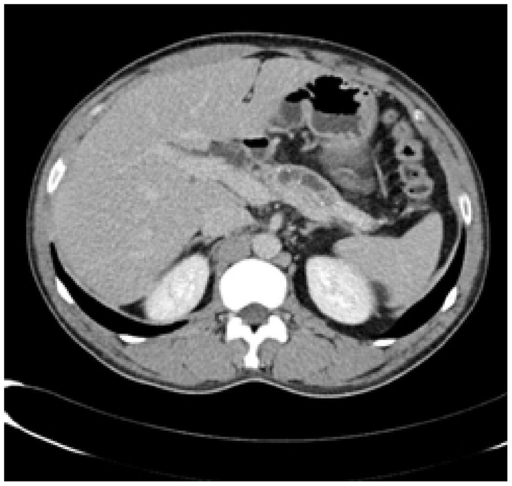
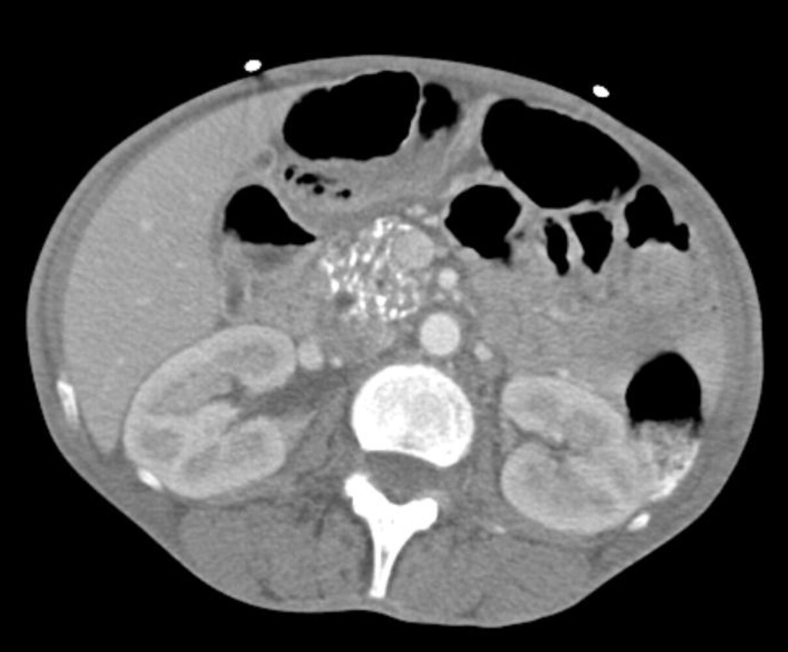
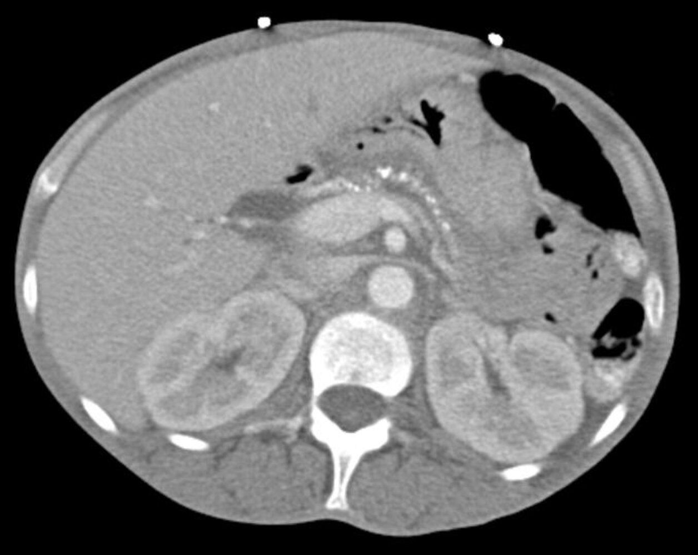
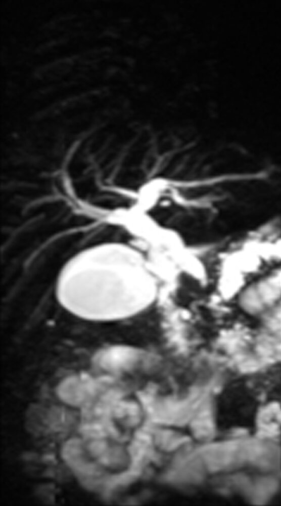
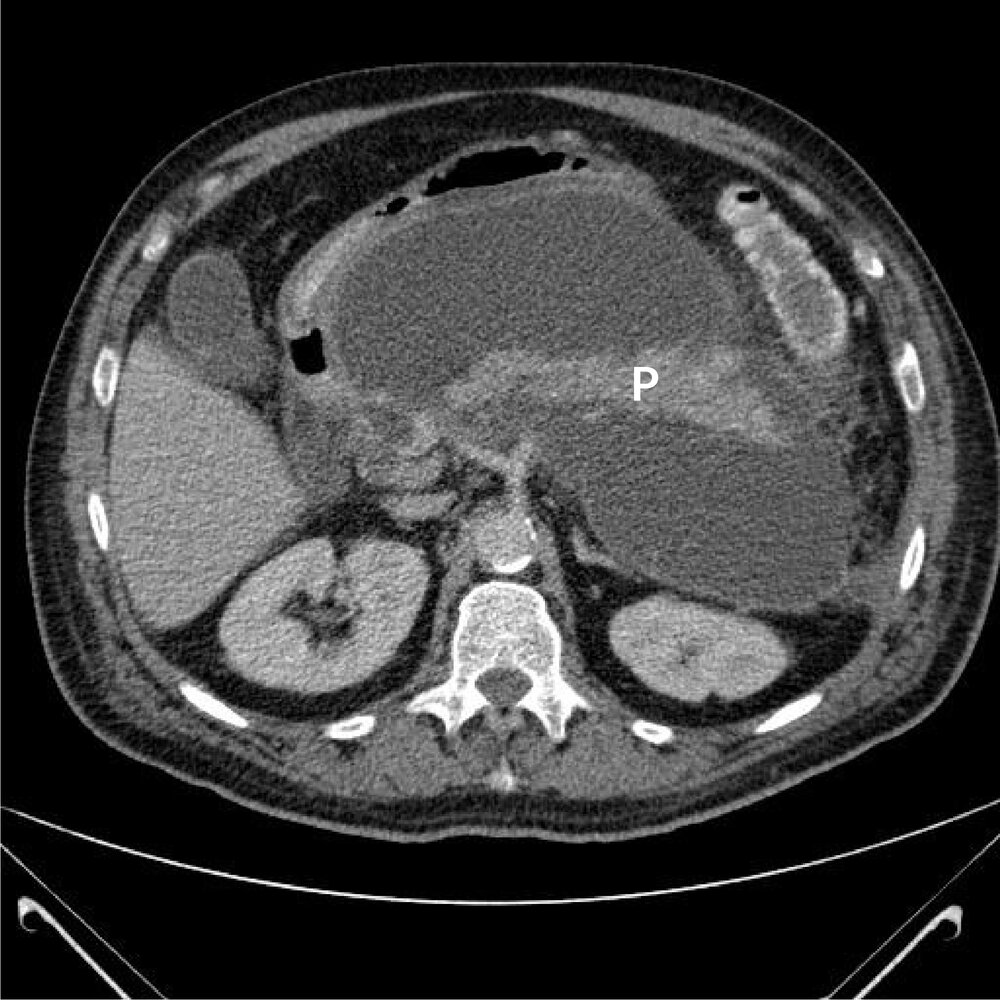
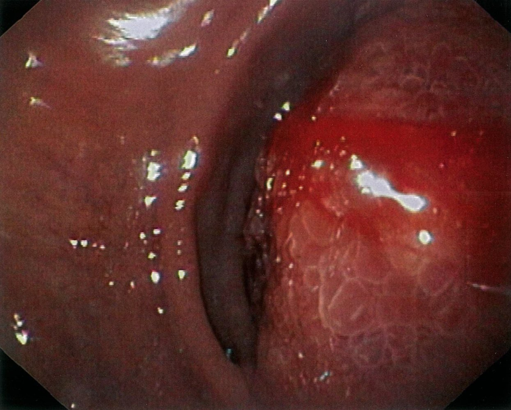

# Chronic pancreatitis

*Categories: Clinical knowledge > Emergency medicine > Gastrointestinal disorders > Chronic pancreatitis*

[Original Article Link](https://coursology-qbank.com/amboss/article/hS0cz2)

---

## Summary

Chronic <u>pancreatitis</u> (CP) is characterized by progressive inflammation that results in irreversible damage to the structure and function of the <u>pancreas</u>. Chronic <u>heavy alcohol use</u> is the most common cause of CP, followed by <u>pancreatic</u> ductal obstruction. Approximately 30% of CP cases are <u>idiopathic</u>. Affected individuals may be asymptomatic or present with abdominal <u>pain</u> and features of <u>exocrine pancreatic insufficiency</u> (e.g., <u>steatorrhea</u>, weight loss) or endocrine <u>pancreatic</u> insufficiency (e.g., <u>prediabetes</u>, <u>diabetes</u>). Diagnosis is confirmed with imaging, which typically shows <u>pancreatic</u> calcifications, ductal strictures, and ductal dilations. <u>Pancreatic function tests</u> (e.g., <u>fecal elastase-1</u> measurement, 72-hour <u>fecal fat estimation</u>) assess the degree of enzyme deficiency. Medical therapy should include <u>patient counseling</u> and education, <u>pain management</u>, and monitoring and management of complications (e.g., via oral <u>pancreatic enzyme</u> replacement therapy). Interventional therapy may be required for patients with intractable <u>pain</u> or other complications (e.g., <u>celiac ganglion block</u>, partial or complete <u>pancreatic resection</u>).

---

## Etiology

* Chronic <u>heavy alcohol use</u> (most common, esp. men)  [[1]](https://coursology-qbank.com/amboss/article/B60zMS)

* <u>Pancreatic</u> ductal obstruction: strictures (e.g., due to trauma, stones)

* Tobacco use

* <u>Idiopathic</u> <u>pancreatitis</u>

* Hereditary pancreatitis [[2]](https://coursology-qbank.com/amboss/article/MaYMOn)

* PRSS1 <u>gene</u> mutation (<u>autosomal dominant inheritance</u>), SPINK1 <u>gene</u> mutation

* Age of onset < 20 years

* Characterized by a positive <u>family history</u> and the absence of other <u>risk factors</u>

* <u>Autoimmune pancreatitis</u>

* Systemic disease

* <u>Cystic fibrosis</u>: ∼ 2% of <u>cystic fibrosis</u> patients develop chronic <u>pancreatitis</u>.  [[3]](https://coursology-qbank.com/amboss/article/y60dnS)

* <u>Severe hypertriglyceridemia</u> (levels > 1,000 mg/dL)

* <u>Primary hyperparathyroidism</u> (<u>hypercalcemia</u>)

* Tropical <u>pancreatitis</u>

* Most common cause in the tropics (esp. southern India)

* Young age at onset

> [!TIP]
> The TIGAR-O system categorizes etiologies of chronic <u>pancreatitis</u>: Toxic-Metabolic, Idiopathic, Genetic, Autoimmune, Recurrent acute/<u>severe pancreatitis</u>, and Obstructive. [[4]](https://coursology-qbank.com/amboss/article/FGcgaV0)[[5]](https://coursology-qbank.com/amboss/article/CX1qZf0)

---

## Pathophysiology

* Autodigestion and inflammation: damage to <u>pancreatic</u> acinar cells;  (e.g., <u>alcohol</u>), outflow obstruction of <u>pancreatic enzymes</u>  or premature activation of <u>trypsinogen</u> to <u>trypsin</u>;   → intrapancreatic activation of digestive enzymes (e.g., <u>amylase</u> and <u>lipase</u>) → autodigestion of <u>pancreatic</u> tissue → inflammatory reaction

* <u>Fibrosis</u>: exposure to toxins and/or inflammatory mediators (e.g., <u>alcohol</u>, <u>cytokines</u>) → activation of <u>pancreatic</u> stellate cells

Pancreatic regional anatomy

References:[[6]](https://coursology-qbank.com/amboss/article/_605nS)

---

## Clinical features

* Epigastric abdominal <u>pain</u> (main symptom) 

* <u>Pain</u> radiates to the back, is relieved on bending forward, and is exacerbated after eating.

* <u>Pain</u> is initially episodic and becomes persistent as the disease progresses.

* Often associated with <u>nausea and vomiting</u>

* Features of <u>pancreatic</u> insufficiency: late manifestation (after 90% of the <u>pancreatic</u> <u>parenchyma</u> is destroyed) 

* Steatorrhea (exocrine enzyme deficiency)

* Cramping abdominal <u>pain</u>, <u>bloating</u>, <u>diarrhea</u>

* Can lead to a <u>deficiency of fat-soluble vitamins</u> (A, D, E, and K)

* <u>Malabsorption</u> and weight loss

* <u>Pancreatic diabetes</u> (endocrine <u>hormone</u> deficiency)

> [!TIP]
> In the later stages of chronic <u>pancreatitis</u>, patients may not experience any <u>pain</u>.
> References:[[1]](https://coursology-qbank.com/amboss/article/B60zMS)[[7]](https://coursology-qbank.com/amboss/article/xVaE9j)

---

## Diagnosis

### Approach  [[4]](https://coursology-qbank.com/amboss/article/FGcgaV0)[[8]](https://coursology-qbank.com/amboss/article/X3X9SB)[[9]](https://coursology-qbank.com/amboss/article/GGcB0V0)[[10]](https://coursology-qbank.com/amboss/article/huccIV0)[[11]](https://coursology-qbank.com/amboss/article/xX1EZf0)

There is no single test for the <u>diagnosis of chronic pancreatitis</u>; <u>risk factors</u>, clinical features, imaging studies, and <u>pancreatic function tests</u> may all be considered in the determination of a diagnosis.

* Initial survey: Identify findings raising suspicion for chronic <u>pancreatitis</u>.

* Characteristic abdominal <u>pain</u>

* Signs indicative of:

* <u>Exocrine pancreatic insufficiency</u> (e.g., <u>steatorrhea</u>, weight loss)

* Endocrine <u>pancreatic</u> insufficiency (e.g., <u>diabetes</u>)

* <u>Risk factors for chronic pancreatitis</u>

* Initial studies

* Imaging studies (most important) to confirm structural changes

* Laboratory testing to assess for complications and identify the underlying cause

* Additional studies: if initial studies were nondiagnostic

* <u>Pancreatic function tests</u>

* <u>Histology</u>

* <u>Genetic testing</u>

> [!TIP]
> A STEP-wise approach to diagnosing chronic <u>pancreatitis</u> may include: Survey, Tomography/imaging, Endoscopic imaging, and Pancreatic function testing.

### Imaging [[4]](https://coursology-qbank.com/amboss/article/FGcgaV0)[[8]](https://coursology-qbank.com/amboss/article/X3X9SB)[[12]](https://coursology-qbank.com/amboss/article/g6YF4J)

#### First-line imaging

* Abdominal CT (with and without contrast) or <u>MRI</u>/<u>MRCP</u>

* Best initial imaging modalities to establish a diagnosis

* Can exclude gastrointestinal malignancies (e.g., <u>pancreatic carcinoma</u>)

* Supportive findings

* <u>Pancreatic</u> ductal dilations and calcifications on plain CT (more sensitive than <u>x-ray</u>)

* “Chain of lakes” appearance of the <u>main pancreatic duct</u>

* <u>Pancreatic</u> <u>atrophy</u>

Acute-on-chronic pancreatitis

Pancreatic calcifications in chronic pancreatitis

String-of-beads (chain-of-lakes) sign in chronic pancreatitis

Chronic pancreatitis (MRCP)

#### Additional imaging [[4]](https://coursology-qbank.com/amboss/article/FGcgaV0)[[13]](https://coursology-qbank.com/amboss/article/mucV7V0)

* Abdominal <u>ultrasound</u> [[13]](https://coursology-qbank.com/amboss/article/mucV7V0)

* Low <u>sensitivity</u> for detecting <u>pancreatic</u> pathologies

* Findings

* Indistinct margins and enlargement

* <u>Pancreatic</u> calcifications

* Ductal strictures, dilation, or stones

* <u>Abdominal x-ray</u>: visible <u>pancreatic</u> calcifications (highly specific, but only seen in ∼ 30% of cases)  [[14]](https://coursology-qbank.com/amboss/article/MucM7V0)

* <u>Endoscopic ultrasound</u> (<u>EUS</u>)

* Can detect early changes that indicate chronic <u>pancreatitis</u>

* Indication: reserved for cases in which a <u>CT scan</u> and/or <u>MRI</u> are nondiagnostic [[4]](https://coursology-qbank.com/amboss/article/FGcgaV0)

* Findings include: [[15]](https://coursology-qbank.com/amboss/article/wBah1M)

* <u>Parenchymal</u> lobularity and <u>hyperechoic</u> foci

* Ductal dilation and calcification

* <u>Secretin-enhanced MRCP</u>

* Improves visualization of <u>pancreatic ducts</u>  [[16]](https://coursology-qbank.com/amboss/article/Nuc-rV0) [[4]](https://coursology-qbank.com/amboss/article/FGcgaV0)

* Indication: high clinical suspicion but inconclusive <u>cross-sectional imaging</u> and <u>EUS</u>

* Findings: ductal strictures and dilations or ectasia

* <u>ERCP</u>: Not routinely recommended because of availability of noninvasive imaging, high risk, and cost [[11]](https://coursology-qbank.com/amboss/article/xX1EZf0)

* Can simultaneously identify and treat early pathologies (e.g., duct dilation, <u>stent</u> insertion)

* Findings

* Ductal stones, which are visible as filling defects

* “Chain of lakes” or “string of pearls” appearance (characteristic feature)

* Irregularity and/or dilation of the <u>main pancreatic duct</u>  [[17]](https://coursology-qbank.com/amboss/article/kucmrV0)

### <u>Laboratory studies</u> [[8]](https://coursology-qbank.com/amboss/article/X3X9SB)

* Serum <u>pancreatic enzyme</u> levels: <u>Lipase</u> (specific) and <u>amylase</u> (nonspecific) are often normal.

* <u>CBC</u>: <u>WBCs</u> may be elevated in infection or <u>abscess</u>.

* <u>Calcium</u>: <u>Hypercalcemia</u> may suggest <u>hyperparathyroidism</u>, a rare cause of chronic <u>pancreatitis</u>.

* <u>Triglycerides</u>: <u>Severe hypertriglyceridemia</u> can cause <u>pancreatitis</u>.

* <u>Liver</u> enzymes and <u>liver function</u> tests: elevated in biliary or ductal obstruction

* <u>Fasting plasma glucose</u> and/or <u>HbA1c</u>: elevated levels could suggest <u>type 3c diabetes</u> (<u>pancreatogenic diabetes mellitus</u>)

* <u>Fat-soluble vitamins</u> and <u>zinc</u>: to identify deficiency and establish baseline

> [!NOTE]
> <u>Pancreatic enzyme</u> levels are often normal in chronic <u>pancreatitis</u> and cannot be used to confirm or rule out the diagnosis. In contrast, <u>acute pancreatitis</u> typically causes significant enzyme elevation.

### Pancreatic function tests [[4]](https://coursology-qbank.com/amboss/article/FGcgaV0)[[8]](https://coursology-qbank.com/amboss/article/X3X9SB)

Consider for patients with features of <u>exocrine pancreatic insufficiency</u> or for those in whom <u>diagnosis of chronic pancreatitis</u> has not been confirmed by imaging.

* Fecal elastase-1 (<u>FE-1</u>): most common test 

* Can support a diagnosis of <u>steatorrhea</u> due to <u>exocrine pancreatic insufficiency</u>  [[18]](https://coursology-qbank.com/amboss/article/13X2hB)

* Interpretation (exact cutoffs are controversial)  [[4]](https://coursology-qbank.com/amboss/article/FGcgaV0)

* <u>FE-1</u> < 200 mcg/g: abnormal, potential <u>pancreatic</u> <u>exocrine insufficiency</u>

* <u>FE-1</u> < 100 mcg/g: Suspect <u>pancreatic</u> <u>exocrine insufficiency</u>.

* 72-hour quantitative fecal fat estimation: <u>confirmatory test</u> for <u>steatorrhea</u>

* Patients consume 100 g of fat per day for 72 hours.

* Interpretation: Fecal fat > 7 g per day is diagnostic of <u>steatorrhea</u>.

* Serum <u>trypsinogen</u>: not routinely recommended [[4]](https://coursology-qbank.com/amboss/article/FGcgaV0)

* May be elevated in <u>acute pancreatitis</u>, <u>pain</u>, <u>cystic fibrosis</u>

* < 20 ng/mL is suggestive of severe <u>pancreatic</u> insufficiency.

* Direct tests of <u>pancreatic</u> function

* <u>Cholecystokinin</u> analog (cerulein), <u>secretin</u>, or a combination, are administered parenterally.

* <u>Pancreatic enzyme</u> and <u>bicarbonate</u> levels of <u>duodenal</u> fluid are measured.

* Low <u>amylase</u>, <u>lipase</u>, <u>trypsin</u>, and <u>bicarbonate</u> levels are suggestive of <u>exocrine pancreatic insufficiency</u>.

> [!TIP]
> The presence of <u>exocrine pancreatic insufficiency</u> (as confirmed by <u>pancreatic function tests</u>) is not required to establish a <u>diagnosis of chronic pancreatitis</u> but can further support the diagnosis.

### <u>Histology</u> [[4]](https://coursology-qbank.com/amboss/article/FGcgaV0)

* Indications: reserved for high-risk patients if the diagnosis has not been established after thorough evaluation

* Characteristic findings [[10]](https://coursology-qbank.com/amboss/article/huccIV0)

* Bands of interlobular <u>fibrosis</u>

* Acinar <u>atrophy</u>

* Intraductal concretions

> [!TIP]
> <u>Histology</u> is rarely used to diagnose chronic <u>pancreatitis</u> because of procedural risks and the possibility of sampling errors that lead to <u>false-negative</u> results.

### <u>Genetic testing</u> [[19]](https://coursology-qbank.com/amboss/article/d3XohB)

* Indications include:

* <u>Family history</u> of chronic <u>pancreatitis</u>

* Young patients with <u>idiopathic</u> <u>pancreatitis</u>

* Tests include:

* <u>PRSS1</u> <u>gene mutations</u>: diagnostic of <u>hereditary pancreatitis</u>

* <u>CFTR</u> <u>gene mutations</u>: seen in ∼ 30% of patients with <u>idiopathic</u> chronic <u>pancreatitis</u>

* <u>SPINK1</u> <u>gene mutations</u>: seen in ∼ 20% of patients with hereditary or <u>idiopathic</u> chronic <u>pancreatitis</u>

---

## Treatment

### Approach  [[4]](https://coursology-qbank.com/amboss/article/FGcgaV0)[[8]](https://coursology-qbank.com/amboss/article/X3X9SB)[[9]](https://coursology-qbank.com/amboss/article/GGcB0V0)[[11]](https://coursology-qbank.com/amboss/article/xX1EZf0)

* Provide patient education: Chronic <u>pancreatitis</u> is a relapsing and remitting disease.

* Start <u>treatment of pain</u>

* Recommend <u>abstinence from nicotine</u> and <u>alcohol</u> for all patients.  [[10]](https://coursology-qbank.com/amboss/article/huccIV0)

* Monitor for and manage <u>complications of chronic pancreatitis</u> (e.g., <u>pancreatic enzyme</u> replacement therapy for <u>exocrine pancreatic insufficiency</u>).

* Initiate directed treatment of the underlying <u>etiology of chronic pancreatitis</u>, e.g.:

* <u>Management of alcohol use disorder</u> and <u>nicotine addiction</u>

* Management of <u>hypertriglyceridemia</u> in adults

* Management of <u>hyperparathyroidism</u>

> [!TIP]
> Patients with CP may benefit from a multidisciplinary team providing individualized <u>pain management</u> and addressing psychosocial factors. [[11]](https://coursology-qbank.com/amboss/article/xX1EZf0)

### Pharmacological <u>pain management</u> [[4]](https://coursology-qbank.com/amboss/article/FGcgaV0)

Provide <u>pain management</u> in a stepwise approach (see “<u>Treatment of pain</u>” for dosages).

* Start with nonopioid <u>oral analgesics</u> (e.g., <u>NSAIDs</u> and <u>acetaminophen</u> if not contraindicated).

* Consider <u>adjuvant analgesics</u>. [[9]](https://coursology-qbank.com/amboss/article/GGcB0V0)

* <u>Tricyclic antidepressants</u> (e.g., <u>amitriptyline</u>)

* <u>SSRIs</u> (e.g., <u>fluoxetine</u>)

* <u>SNRIs</u> (e.g., <u>duloxetine</u>)

* <u>Gabapentinoids</u> (e.g., <u>pregabalin</u>)

* Consider antioxidant therapy (e.g., combinations of <u>selenium</u>, <u>ascorbic acid</u>, <u>beta carotene</u>, and <u>methionine</u>).

* Limit <u>opioid analgesics</u>.

> [!TIP]
> <u>Pain management</u> in chronic <u>pancreatitis</u> requires careful assessment and frequent reevaluation.

### Interventional therapy

#### Endoscopic

* Indication: <u>pain</u> not adequately managed with pharmacotherapy

* Procedures

* <u>Celiac ganglion block</u> repeated as needed (provides 3–6 months of relief)

* Endoscopic <u>papillotomy</u> with ductal dilation, <u>stent</u> placement, and removal of stones if present

* <u>Extracorporeal shock wave lithotripsy</u> (<u>ESWL</u>) to dissolve stones

#### Surgical [[8]](https://coursology-qbank.com/amboss/article/X3X9SB)

* Indications

* Intractable <u>pain</u> not adequately managed with pharmacotherapy or endoscopic procedures

* Other: suspected <u>malignancy</u>, complications

* Procedures

* Thoracoscopic bilateral splanchnicectomy  [[20]](https://coursology-qbank.com/amboss/article/0p0eLS)

* Surgical decompression 

* <u>Lateral</u> pancreaticojejunostomy: if the <u>main pancreatic duct</u> is dilated (> 5 mm)

* Sphincterotomy or sphincteroplasty

* Surgical resection

* <u>Pancreaticoduodenectomy</u> (<u>Whipple procedure</u>)

* <u>Distal pancreatectomy</u>

* <u>Pylorus-preserving pancreaticoduodenectomy</u>

* <u>Total pancreatectomy</u> with islet <u>autotransplant</u> (TPIAT) (last-line curative therapy)

> [!TIP]
> <u>Total pancreatectomy</u> is the only known cure for chronic <u>pancreatitis</u>; it should be reserved for select patients with <u>chronic pain</u> after all other measures have failed. [[4]](https://coursology-qbank.com/amboss/article/FGcgaV0)

---

## Complications

### Recurrent <u>acute pancreatitis</u> [[8]](https://coursology-qbank.com/amboss/article/X3X9SB)

See “<u>Acute pancreatitis</u>.”

### <u>Exocrine pancreatic insufficiency</u>

* Pathophysiology in chronic <u>pancreatitis</u>: tissue <u>atrophy</u> and <u>fibrosis</u> → deficiency of <u>lipase</u>, <u>amylase</u>, and <u>protease</u> → <u>maldigestion</u>, <u>steatorrhea</u>, and <u>malabsorption</u>

* This condition is described in detail in the article “<u>Malabsorption</u>.”

### Endocrine <u>pancreatic</u> insufficiency

* Pathophysiology: Destruction of <u>beta cells</u> leads to endocrine insufficiency with <u>pancreatogenic diabetes</u> (type 3c <u>diabetes mellitus</u>). [[21]](https://coursology-qbank.com/amboss/article/OdbIJs)

* Clinical features: Brittle, <u>insulin-dependent diabetes</u>

* Diagnostics

* Screen all patients annually with <u>HbA1c</u> or <u>fasting plasma glucose</u> measurement.

* See “Diagnostics” in “<u>Diabetes mellitus</u>.”

* Treatment

* Specialist consultation (<u>endocrinology</u>) is advised.

* See “<u>Antihyperglycemic treatment</u>” in “<u>Diabetes mellitus</u>.”

### Pancreatic pseudocysts [[8]](https://coursology-qbank.com/amboss/article/X3X9SB)[[22]](https://coursology-qbank.com/amboss/article/e3XxhB)

#### Definition

Encapsulated collection of <u>pancreatic</u> fluid that develops 4 weeks after an acute attack of <u>pancreatitis</u> (can occur in both acute and chronic <u>pancreatitis</u>)  [[8]](https://coursology-qbank.com/amboss/article/X3X9SB)

#### Pathophysiology

<u>Pancreatic</u> secretions leak from damaged ducts → inflammatory reaction of surrounding tissue → encapsulation of secretions by <u>granulation tissue</u>

#### Clinical features [[23]](https://coursology-qbank.com/amboss/article/CVaq9j)

* Often asymptomatic

* Painless abdominal mass

* Pressure effects

* <u>Gastric outlet obstruction</u> (early satiety, nonbilious <u>vomiting</u>, abdominal <u>pain</u>)

* Obstruction of the <u>distal</u> <u>duodenum</u> (<u>bilious</u> <u>vomiting</u>) may result in <u>steatorrhea</u>.

* <u>Bile duct obstruction</u> with <u>jaundice</u>

#### Diagnostics [[24]](https://coursology-qbank.com/amboss/article/uGcpaV0)

* First line: CT abdomen with contrast

* Findings: Extrapancreatic fluid collection within well-defined wall or capsule with <u>contrast enhancement</u>

* Other imaging modalities

* Transabdominal <u>ultrasound</u> 

* Fast and readily available

* High <u>sensitivity</u>, but low <u>negative predictive value</u>

* <u>ERCP</u> (<u>gold-standard test</u>): more invasive, but allows treatment to be performed

* <u>MRI</u>/<u>MRCP</u>: highly sensitive and specific test, but associated with high cost

Pancreatic pseudocyst

Pancreatic pseudocyst

Duodenal obstruction by pancreatic pseudocyst

#### Treatment [[25]](https://coursology-qbank.com/amboss/article/yYWd7P0)

* <u>Conservative management</u>: : asymptomatic patients with small <u>pancreatic pseudocysts</u> and no complications 

* Symptom management (e.g., <u>nonopioid analgesics</u> for <u>pain</u>, <u>antiemetics</u> for <u>nausea</u>)

* <u>Alcohol</u> cessation

* Low-fat diet with small, frequent meals

* Imaging surveillance

* Endoscopic drainage

* First-line treatment

* Indications

* Asymptomatic patients with chronic large <u>pancreatic pseudocysts</u>

* Symptomatic cysts

* <u>Nausea and vomiting</u>

* <u>Anorexia</u> and weight loss

* Persistent abdominal <u>pain</u>

* Suspected <u>malignancy</u>

* Complications 

* Gastric outlet, <u>duodenal</u>, or <u>biliary obstruction</u> (e.g., <u>common bile duct</u> stenosis)

* Hemorrhage

* Infection

* <u>Pancreatic</u> <u>pseudoaneurysm</u>

* Compression of large vessels

* Pancreaticopleural <u>fistula</u>

* Percutaneous drainage: reserved for patients in whom endoscopic drainage is not technically feasible or was previously unsuccessful

* Surgical drainage

* The cyst is drained into the <u>stomach</u>, <u>duodenum</u>, or <u>jejunum</u> (i.e., cystogastrostomy, cystoduodenostomy, cystojejunostomy).

* Reserved for patients in whom endoscopic and/or percutaneous interventions were previously unsuccessful or where surgical access is useful to treat suspected complications (e.g., <u>necrosis</u>, infection) in addition to drainage

* <u>ERCP</u> transpapillary drainage: reserved for <u>pseudocysts</u> that connect with the <u>pancreatic duct</u>

#### Complications

* Infection: <u>fever</u>, abdominal <u>pain</u>, <u>sepsis</u>

* <u>Pseudocyst</u> rupture: <u>pancreatic ascites</u>/pancreaticopleural <u>fistula</u>

* <u>Erosion</u> into an abdominal vessel: hemorrhage into the cyst

### Pancreatic ascites

#### Pathophysiology

Ductal disruption (due to an acute attack of <u>pancreatitis</u>, <u>pancreatic surgery</u> and/or trauma) or a <u>pseudocyst</u> leak/rupture → <u>pancreatic ascites</u>

#### Clinical features

* Abdominal distention; variable abdominal <u>pain</u>

* <u>Dyspnea</u>

* <u>Peripheral edema</u>

* Free fluid in the <u>peritoneal cavity</u>

#### Diagnostics

* <u>Ascitic fluid analysis</u>: <u>exudate</u> (high protein: > 3 g/dL; <u>low SAAG</u>: < 1.1 g/dL) with high <u>amylase</u> levels (> 1,000 IU/L)

* Imaging: <u>ERCP</u>, <u>CECT</u>, <u>MRCP</u>

* Identify <u>ascites</u> and the site(s) of the leak

* <u>ERCP</u> is preferred, as it allows treatment to be performed in the same sitting.

#### Management

* <u>Conservative management</u>

* Indicated for all patients  [[26]](https://coursology-qbank.com/amboss/article/9VaN9j)

* <u>Nothing by mouth</u>, <u>IV fluids</u>, <u>parenteral nutrition</u>

* <u>Somatostatin analogs</u> (<u>octreotide</u>)

* Interventions

* Repeated paracenteses

* <u>Stenting</u> of the <u>pancreatic duct</u>: if <u>ERCP</u> shows ductal disruption  [[27]](https://coursology-qbank.com/amboss/article/wVah9j)

* <u>Surgery</u>: indicated in patients showing no improvement after 4 weeks of <u>conservative management</u> (see “<u>Pancreatic and hepatic surgery</u>”)

* <u>Pancreatic resection</u>

* <u>Surgery</u> for <u>pancreatic pseudocyst</u>

* <u>Lateral</u> pancreaticojejunostomy

### Further complications

* <u>Pancreatic abscess</u>

* <u>Portal vein thrombosis</u>

* <u>Splenic vein thrombosis</u>

* <u>Pancreatic cancer</u> (especially in patients with <u>hereditary pancreatitis</u>)

> [!TIP]
> General screening for <u>pancreatic cancer</u> is not currently recommended. Screen patients (with a triphasic <u>pancreas</u> protocol CT) who develop weight loss, protracted abdominal <u>pain</u>, or functional decline. [[4]](https://coursology-qbank.com/amboss/article/FGcgaV0)[[8]](https://coursology-qbank.com/amboss/article/X3X9SB)

We list the most important complications. The selection is not exhaustive.

---