# Cirrhosis

*Categories: Clinical knowledge > Emergency medicine > Gastrointestinal disorders > Cirrhosis*

[Original Article Link](https://coursology-qbank.com/amboss/article/PS0W-2)

---

## Summary

Cirrhosis is the final stage of <u>chronic liver disease</u> (<u>CLD</u>) and it is characterized by regenerative <u>nodules</u> and fibrous septae in <u>liver</u> <u>parenchyma</u> in response to chronic hepatic injury. Cirrhosis is most commonly due to <u>excessive alcohol consumption</u>, <u>metabolic dysfunction-associated steatotic liver disease</u>, or <u>hepatitis C</u>. Other causes include inflammatory or metabolic diseases, such as <u>primary biliary cirrhosis</u> and <u>hemochromatosis</u>. Subsequent hepatic repair mechanisms lead to <u>fibrosis</u> progressing to cirrhosis with abnormal tissue architecture and impaired <u>liver function</u>. Patients can present with a range of symptoms, including <u>ascites</u>; <u>hepatosplenomegaly</u>; and <u>skin</u> manifestations of cirrhosis, such as <u>jaundice</u>, <u>spider angiomata</u>, and/or <u>palmar erythema</u>. Men may also present with signs of feminization (e.g., <u>gynecomastia</u>, <u>hypogonadism</u>). In severe cases, the accumulation of toxic metabolites or involvement of additional organs can lead to complications such as <u>hepatic encephalopathy</u> and <u>hepatorenal syndrome</u> (<u>HRS</u>). Laboratory study findings indicate <u>hepatocyte</u> damage (e.g., <u>elevated liver enzymes</u>, <u>hyperbilirubinemia</u>) and/or impaired hepatic synthetic function (e.g., prolonged <u>prothrombin time</u>, low <u>albumin</u>). Abdominal <u>ultrasound</u> typically shows <u>atrophic</u>, heterogeneous <u>liver</u> <u>parenchyma</u> with a nodular surface. A <u>biopsy</u> is the method of choice for confirming the diagnosis; however, it is usually only performed if the results from other diagnostic modalities are inconclusive. Management consists of treatment of the underlying disease (e.g., avoidance of toxic substances, <u>antiviral drugs</u>), adequate calorie intake, and treating complications, e.g., <u>esophageal varices</u>, <u>hepatocellular carcinoma</u> (<u>HCC</u>). In cases of <u>decompensated cirrhosis</u>, interventional procedures may be used to alleviate symptoms (e.g., <u>paracentesis</u> to drain <u>ascites</u>) or as a bridge until <u>liver transplantation</u> is possible.

For details about pulmonary complications that occur in individuals with cirrhosis (e.g., <u>hepatopulmonary syndrome</u>, <u>portopulmonary hypertension</u>, and <u>hepatic hydrothorax</u>), see "Pulmonary <u>complications of cirrhosis</u>."

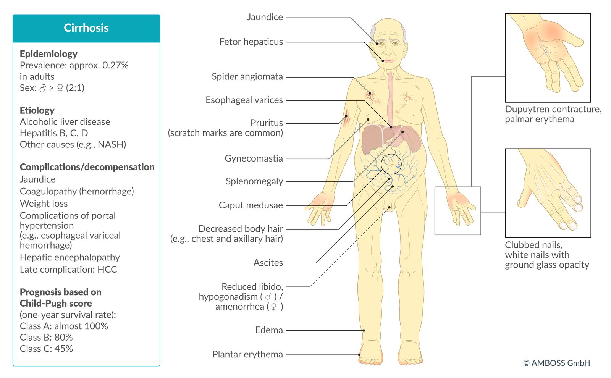

Cirrhosis fact sheet

---

## Epidemiology

* <u>Prevalence</u>: approx. 0.27% in US adults [[4]](https://coursology-qbank.com/amboss/article/atYQXI)

* Sex: <u>♂</u> > <u>♀</u> (2:1) [[5]](https://coursology-qbank.com/amboss/article/DTX1Gx)

* Mortality [[5]](https://coursology-qbank.com/amboss/article/DTX1Gx)

* Responsible for approx. 1–2% of all deaths in the US (12th leading <u>cause of death</u>)

* Most deaths occur in the fifth to sixth decade of life.

Epidemiological data refers to the US, unless otherwise specified.

---

## Etiology

See also “<u>Etiology of chronic liver disease</u>.”

* Chronic <u>hepatitis C</u> (most common cause of cirrhosis in the US)

* Chronic <u>alcohol use disorder</u> (<u>AUD</u>)

* <u>Metabolic dysfunction-associated steatotic liver disease</u> (<u>MASLD</u>)

* Autoimmune conditions: e.g., <u>type 1 AIH</u>, <u>PBC</u>, <u>PSC</u>

* Genetic conditions: e.g., <u>hereditary hemochromatosis</u>, <u>Wilson disease</u>, <u>α1-antitrypsin deficiency</u>

* <u>Hepatic vein</u> congestion or vascular anomalies: e.g., <u>Budd-Chiari syndrome</u>, <u>cardiac cirrhosis</u>

* Cryptogenic cirrhosis: cirrhosis of unknown etiology despite adequate diagnostics

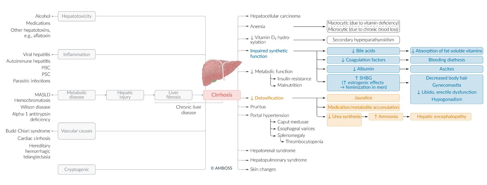

Cirrhosis - etiology and sequelae

> [!TIP]
> Cryptogenic cirrhosis is a diagnosis of exclusion and should only be considered after a complete patient evaluation has ruled out all other possible causes of cirrhosis.

> [!TIP]
> <u>Hepatitis C</u>, <u>alcohol-associated liver disease</u>, and <u>MASLD</u> are the most common causes of cirrhosis worldwide. [[6]](https://coursology-qbank.com/amboss/article/N5d-4q0)

---

## Pathophysiology

* Cirrhosis is characterized by irreversible diffuse <u>fibrosis</u> of the <u>liver</u> (the final common pathway for <u>chronic liver diseases</u>).

* Pathogenesis is multifactorial.

* Different <u>liver</u> cells and <u>cytokines</u> are involved in the activation and progression of <u>liver fibrosis</u>.

* Cytokine‑mediated activation of <u>hepatic stellate cells</u> has been identified as a central element for developing <u>fibrosis</u>.

* The following three mechanisms have been described for all types of <u>liver</u> cirrhosis: [[7]](https://coursology-qbank.com/amboss/article/fUYkco)
1. * Degeneration and <u>necrosis</u> of <u>hepatocytes</u>

* Activated <u>Kupffer cells</u> destroy <u>hepatocytes</u>, activate <u>hepatic stellate cells</u>, and promote inflammation.

* Inflammatory <u>cytokines</u> (e.g., <u>TGF-β</u>, <u>PDGF</u>) → <u>hepatocyte</u> <u>apoptosis</u> and <u>hepatic stellate cell</u> activation → excess <u>collagen</u> production
2. * <u>Fibrotic</u> tissue and regenerative <u>nodules</u> replace the <u>liver</u> <u>parenchyma</u>

* <u>Hepatocyte</u> destruction triggers repair mechanisms → excess formation of <u>connective tissue</u> (<u>fibrosis</u>)

* Excessive <u>connective tissue</u> in <u>periportal zone</u> and <u>centrilobular zone</u> → regenerative <u>nodules</u> and fibrous septa → compression of <u>hepatic sinusoids</u> and <u>venules</u> → ↑ <u>portal vein</u> <u>hydrostatic pressure</u> → intrasinusoidal <u>hypertension</u> → ↓ functional sinusoids
3. * Loss of <u>liver function</u>: sinusoidal <u>capillarization</u> → loss of fenestration and <u>scar</u> tissue formation→ impaired substrate exchange → loss of normal <u>liver function</u> (exocrine and metabolic)

---

## Clinical features

Cirrhosis can be asymptomatic or manifest with nonspecific features. Symptoms are triggered by an acute event (e.g., infection, certain medications) or due to gradual progression of <u>liver</u> damage.

### Nonspecific features

* Patients are often initially asymptomatic.

* Fatigue, <u>malaise</u>, <u>anorexia</u>, and weight loss

### Specific features

#### <u>Dermal</u> features

* <u>Pruritus</u>

* <u>Jaundice</u>

* Telangiectasia: most commonly spider angioma (a central red <u>arteriole</u> with numerous, thin arterial extensions, commonly manifesting on light, sun-exposed <u>skin</u> and the trunk)

* <u>Caput medusae</u>

* Palmar erythema (<u>plantar</u> <u>erythema</u> also possible)  [[8]](https://coursology-qbank.com/amboss/article/9HXNsz)

* <u>Nail clubbing</u>

* <u>Petechiae</u> and <u>purpura</u>

* Generally dry and <u>atrophic</u> <u>skin</u>

* White <u>nails</u> with ground-glass opacity (also known as “Terry <u>nails</u>”)

* Lacquered <u>lips</u>, smooth red <u>tongue</u>

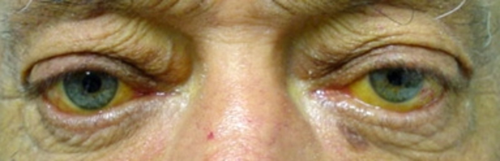

Jaundice (icterus)

Telangiectasia

Spider angioma

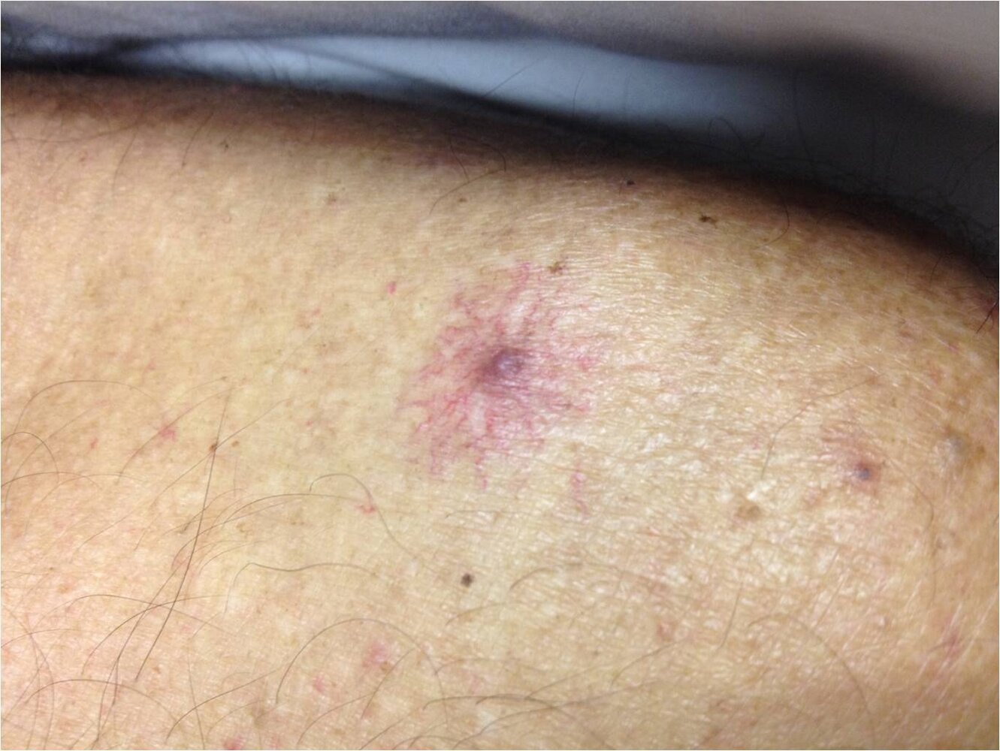

Spider angioma

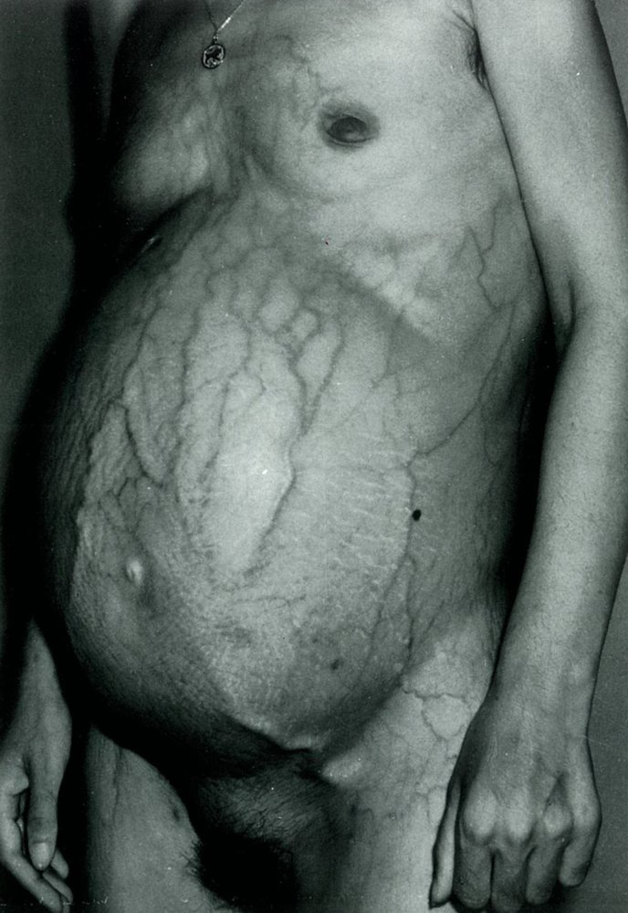

Caput medusae and ascites

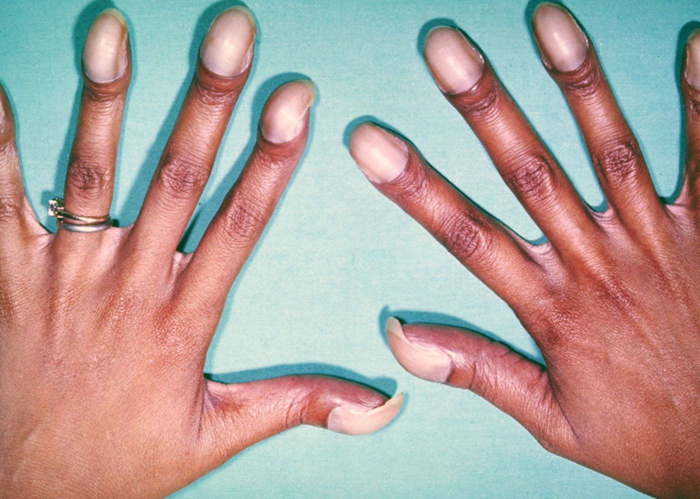

Digital clubbing

#### Abdominal features

* <u>Nausea</u>, <u>vomiting</u>

* <u>Hepatomegaly</u> (possibly causing dull <u>RUQ</u> <u>pain</u>)

* <u>Splenomegaly</u>

* <u>Ascites</u>

#### Hormonal disorders

* <u>Hyperestrogenism</u> [[9]](https://coursology-qbank.com/amboss/article/93aNk4)

* Changes in the hepatic metabolization of sex <u>hormones</u> cause an imbalance in the <u>estrogen</u>-<u>androgen</u> <u>ratio</u>, resulting in a marked increase in systemic <u>estrogen</u> levels.

* In men, increased <u>estrogen</u> levels cause feminization. 

* <u>Gynecomastia</u>

* <u>Hypogonadism</u>;  (e.g., testicular <u>atrophy</u>, reduced libido, <u>erectile dysfunction</u>, <u>infertility</u>)

* Decreased body <u>hair</u> (e.g., loss of chest <u>hair</u>, a female pattern of pubic <u>hair</u> distribution)

* In women, a massive increase in <u>estrogen</u> can cause <u>amenorrhea</u>.

#### Other

* <u>Asterixis</u>

* Fetor hepaticus: <u>bad breath</u> with a characteristic sweet, pungent <u>smell</u> caused by an accumulation of dimethyl sulfide

* <u>Dupuytren contracture</u> (in patients with cirrhosis due to <u>AUD</u>)  [[10]](https://coursology-qbank.com/amboss/article/c0VaUG0)[[11]](https://coursology-qbank.com/amboss/article/30VSfG0)

* <u>Peripheral edema</u>  [[12]](https://coursology-qbank.com/amboss/article/kIYm1q)

* See also “Clinical features” in “<u>Portal hypertension</u>.”

#### Specific clinical features due to rare causes

* <u>Hemochromatosis</u>: dark, <u>bronze skin</u> color, and <u>diabetes</u> (<u>bronze diabetes</u>)

* <u>Wilson disease</u>

* Neurological/psychiatric symptoms (<u>parkinsonism</u> and <u>personality</u> changes)

* <u>Indirect hyperbilirubinemia</u> due to <u>hemolysis</u>.

* Alpha‑1 antitrypsin deficiency: <u>lung</u> <u>emphysema</u> (typically before 50 years of age) [[13]](https://coursology-qbank.com/amboss/article/vTXAsx)

---

## Diagnosis

### General principles [[14]](https://coursology-qbank.com/amboss/article/TnX6sA)[[15]](https://coursology-qbank.com/amboss/article/xhcETX0)

* Diagnosis is typically based on a combination of typical clinical features, laboratory findings, and features on imaging.

* Initial evaluation

* Routine <u>laboratory studies</u> and screening for the underlying etiology (e.g., <u>viral hepatitis panel</u>)

* Abdominal <u>ultrasound</u> to evaluate the <u>liver</u> <u>parenchyma</u> and detect complications

* Additional evaluation (e.g., <u>noninvasive liver fibrosis assessment</u>, <u>liver biopsy</u>) may be needed to stage <u>fibrosis</u> or if the etiology remains unclear.

> [!TIP]
> Patients with cirrhosis are usually either asymptomatic with incidental abnormal findings on <u>laboratory studies</u> or imaging, or present late with features of <u>decompensated cirrhosis</u>.

### <u>Laboratory studies</u>

#### Routine <u>laboratory studies</u> [[14]](https://coursology-qbank.com/amboss/article/TnX6sA)[[16]](https://coursology-qbank.com/amboss/article/x3aEk4)[[17]](https://coursology-qbank.com/amboss/article/rMXfJA)

Laboratory findings are nonspecific and the presence and degree of abnormality may vary.

* <u>Liver chemistries</u>

* <u>Transaminases</u>: ↑ <u>ALT</u> and <u>AST</u>

* <u>ALT</u> > <u>AST</u>: present in most <u>liver</u> diseases (e.g., <u>MASLD</u>, viral <u>hepatitis</u>)

* <u>AST</u> > <u>ALT</u>: indicative of <u>alcohol-associated liver disease</u> and/or cirrhosis of any etiology

* Massive <u>AST</u> and/or <u>ALT</u> elevation (> 15 times <u>ULN</u>): Consider differential diagnoses (e.g., <u>acetaminophen toxicity</u>, <u>acute viral hepatitis</u>, <u>autoimmune hepatitis</u>).

* ↑ <u>Bilirubin</u> (may be normal initially)

* ↑ <u>ALP</u>

* ↑ Gamma‑glutamyl transferase (<u>GGT</u>)

* <u>Coagulation studies</u>: ↑ <u>prothrombin time</u> (↑ <u>INR</u>) because of decreased production of <u>coagulation factors</u>

* <u>CBC</u>

* <u>Thrombocytopenia</u>: due to decreased <u>thrombopoietin</u> production by the <u>liver</u> and/or <u>splenomegaly</u>  [[16]](https://coursology-qbank.com/amboss/article/x3aEk4)

* <u>Anemia</u>: multiple potential causes, e.g., <u>vitamin B12</u> or <u>folate deficiency</u> , <u>chronic blood loss</u>, <u>splenic sequestration</u>

* <u>Leukopenia</u>

* <u>CMP</u>

* ↓ <u>Albumin</u>

* ↓ Total protein

* <u>Hyponatremia</u>

> [!TIP]
> <u>Liver chemistries</u> may be normal in early <u>compensated cirrhosis</u>. [[14]](https://coursology-qbank.com/amboss/article/TnX6sA)

> [!NOTE]
> Some <u>CBC</u> abnormalities are due to the combination of increased hepatic and <u>splenic sequestration</u> of <u>thrombocytes</u> (<u>portal hypertension</u> leads to <u>splenomegaly</u> with <u>hypersplenism</u>) and decreased production of <u>hematopoietic</u> factors by the <u>liver</u>.

> [!NOTE]
> <u>Hepatocyte</u> injury: ↑ <u>AST</u>, <u>ALT</u>, <u>ALP</u>, <u>GGT</u>. Synthetic dysfunction: ↑ <u>bilirubin</u> and <u>PT</u>/<u>INR</u>; ↓ <u>albumin</u> and <u>platelets</u>

#### Additional <u>laboratory studies</u> [[14]](https://coursology-qbank.com/amboss/article/TnX6sA)[[17]](https://coursology-qbank.com/amboss/article/rMXfJA)[[18]](https://coursology-qbank.com/amboss/article/2jcT-X0)[[19]](https://coursology-qbank.com/amboss/article/-nXDDA)

These studies may help to identify the underlying etiology and further evaluate <u>liver function</u>. Modification may be required based on clinical features and the presence of <u>risk factors</u>.

* Viral <u>hepatitis</u>: especially in patients with <u>risk factors</u> 

* <u>Hepatitis B</u> and <u>hepatitis C</u>: <u>HBsAg</u>, <u>IgM anti-HBc</u>, <u>anti-HCV</u>

* <u>Hepatitis A</u> and <u>hepatitis E</u>: <u>IgM</u> <u>HAV</u>, <u>IgM</u> <u>HEV</u>

* <u>MASLD</u>: <u>fasting</u> lipid levels and <u>HbA1c</u>

* <u>Hemochromatosis</u>: <u>serum iron</u>, <u>ferritin</u>, <u>transferrin saturation</u>

* <u>Alcohol-associated liver disease</u>: assess for <u>alcohol use disorder</u>; consider measuring <u>alcohol</u> biomarkers.

* <u>Autoimmune hepatitis</u>: total <u>IgG</u> or <u>serum electrophoresis</u> (showing <u>hypergammaglobulinemia</u>), <u>ANA</u>, <u>ASMA</u>, <u>anti-LKM-1 antibody</u>, anti-soluble <u>liver</u> <u>antigen</u> <u>antibody</u>

* <u>Alpha-1 antitrypsin deficiency</u>: <u>alpha-1 antitrypsin</u> level and <u>phenotype</u>

* <u>Wilson disease</u>: serum <u>ceruloplasmin</u>, serum total and free <u>copper</u>, urinary <u>copper</u>

* <u>Primary biliary cholangitis</u>: <u>antimitochondrial antibodies</u> (<u>AMA</u> or <u>AMA</u>-M2), <u>ALP</u>, <u>bilirubin</u>

* <u>Primary sclerosing cholangitis</u>: <u>cholestasis parameters</u> (<u>GGT</u>, <u>ALP</u>, and <u>bilirubin</u>), <u>pANCA</u>, <u>IgG</u>

* Other tests [[20]](https://coursology-qbank.com/amboss/article/RIXlcz)[[21]](https://coursology-qbank.com/amboss/article/QIXucz)

* <u>Ammonia</u> (not routinely indicated)  [[21]](https://coursology-qbank.com/amboss/article/QIXucz)

* <u>Plasma cholinesterase</u>

* <u>Serum protein electrophoresis</u>: ↓ <u>albumin</u> band, ↑ gamma band,  and unchanged alpha‑1, alpha‑2, and <u>beta globulin</u> fractions   [[20]](https://coursology-qbank.com/amboss/article/RIXlcz)

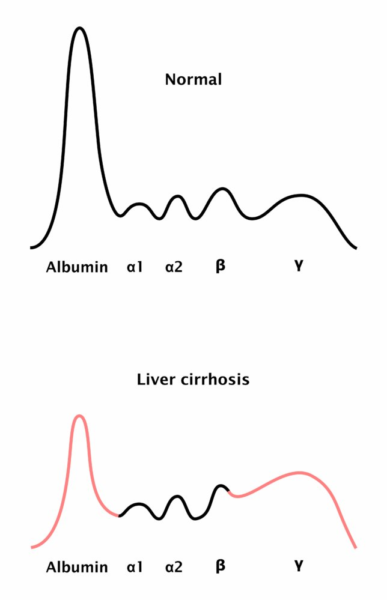

Serum protein electrophoresis in liver cirrhosis

### Imaging

#### Abdominal <u>ultrasound</u> with Doppler [[14]](https://coursology-qbank.com/amboss/article/TnX6sA)[[22]](https://coursology-qbank.com/amboss/article/_MX5rA)

* Indications

* Suspected cirrhosis: best initial test

* Established cirrhosis: for <u>HCC screening</u> and detecting complications

* Findings

* <u>Liver</u> form and structure

* Nodular <u>liver</u> surface

* <u>Atrophy</u> of the right lobe

* Loss of structural homogeneity (<u>hyperechoic</u> or variable increase in <u>echogenicity</u>) with fibrous septa

* <u>Liver</u> size

* Initially enlarged [[23]](https://coursology-qbank.com/amboss/article/c7Xakz)

* <u>Atrophy</u> with disease progression [[23]](https://coursology-qbank.com/amboss/article/c7Xakz)

* <u>Hypertrophy</u> of the <u>caudate lobe</u> and left lobe  [[22]](https://coursology-qbank.com/amboss/article/_MX5rA)[[24]](https://coursology-qbank.com/amboss/article/FrXgQz)

* <u>Atrophy</u> of segment IV

* Other possible findings

* Changes in <u>liver</u> vasculature

* <u>Complications of portal hypertension</u>: <u>ascites</u>, <u>splenomegaly</u>, <u>portal vein thrombosis</u> (<u>PVT</u>), increased portosystemic collateral flow   [[25]](https://coursology-qbank.com/amboss/article/MudM770)

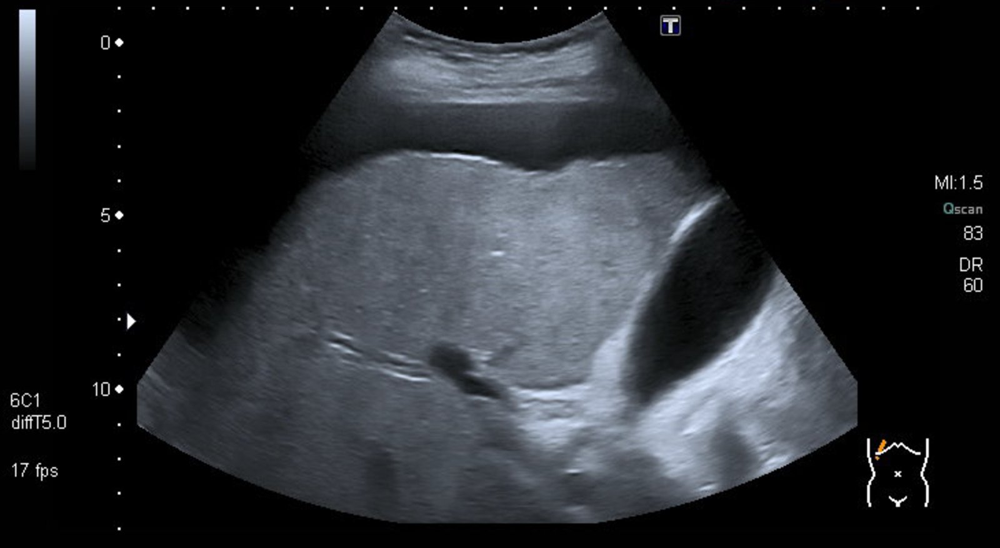

Decompensated hepatic cirrhosis

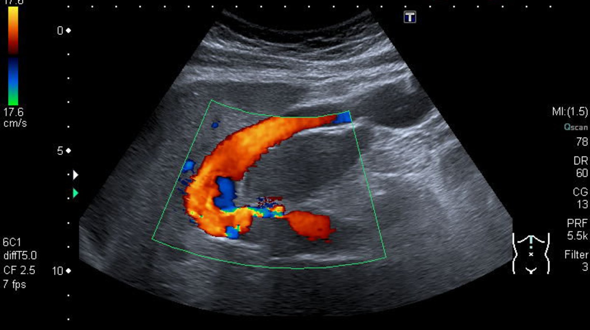

Recanalized paraumbilical vein

#### CT abdomen [[22]](https://coursology-qbank.com/amboss/article/_MX5rA)[[26]](https://coursology-qbank.com/amboss/article/vjcAXc0)

* Indication: patients in whom adequate assessment with <u>ultrasound</u> is not possible (e.g., because of <u>obesity</u>)

* Findings: similar to those on <u>ultrasound</u>

* Relative <u>hypertrophy</u> of the left lobe and <u>caudate lobe</u>

* Regenerative <u>nodules</u>

* Irregular <u>liver</u> surface

* Indirect findings: <u>ascites</u>, <u>splenomegaly</u>, portosystemic collaterals

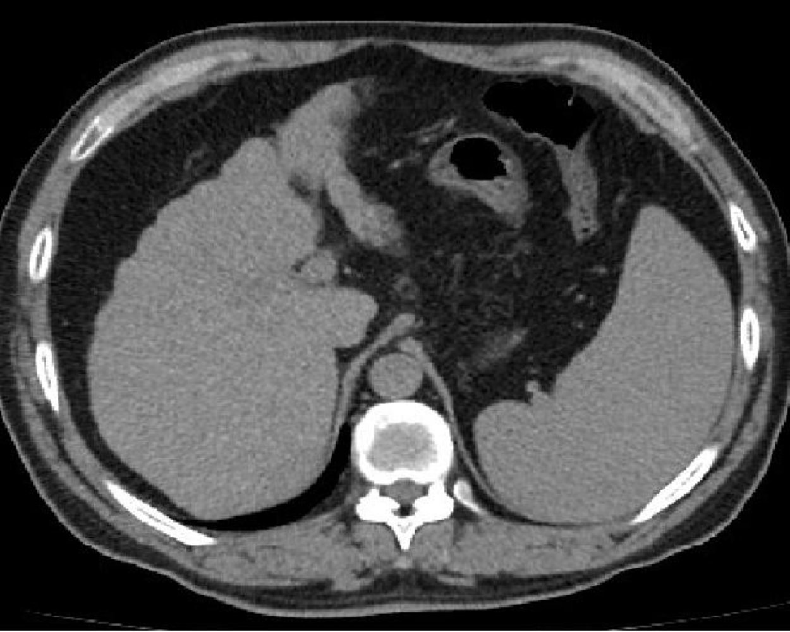

Hepatic cirrhosis with splenomegaly

### Noninvasive liver fibrosis assessment

#### Blood biomarker-based scores [[14]](https://coursology-qbank.com/amboss/article/TnX6sA)[[27]](https://coursology-qbank.com/amboss/article/WIXPbz)

These biomarker-based tools can be used as an adjunct to confirm and stage cirrhosis of certain etiologies.

* AST-to-platelet ratio index (APRI) 

* Indications: <u>chronic hepatitis B</u> and C, <u>MASLD</u>, <u>AIH</u>, and <u>PBC</u>

* Parameters: <u>AST</u> and <u>platelet count</u>

* Interpretation: APRI > 1 is suggestive of cirrhosis.

* Fibrosis-4 score 

* Indications: <u>chronic hepatitis B</u> and C and <u>MASLD</u>

* Parameters: age, <u>platelet count</u>, <u>AST</u> and <u>ALT</u> levels

* Interpretation: Thresholds for identifying advanced <u>fibrosis</u> depend on the underlying cause.

* NAFLD fibrosis score 

* Indication: <u>MASLD</u>

* Parameters: age, <u>BMI</u>, <u>AST</u>, <u>ALT</u>, <u>platelet count</u>, <u>albumin</u>, and <u>diabetes</u> (or <u>impaired fasting glucose</u>)

* Interpretation: A score > 0.676 is predictive of advanced <u>fibrosis</u> in <u>MASLD</u>.

FIB-4 for Noninvasive Diagnosis of Hepatic Fibrosis

APRI (AST to Platelet Ratio Index)

NAFLD fibrosis score

#### Liver elastography [[14]](https://coursology-qbank.com/amboss/article/TnX6sA)[[28]](https://coursology-qbank.com/amboss/article/Z7XZ4z)[[29]](https://coursology-qbank.com/amboss/article/07Xe4z)

* Definition: an imaging technique that measures <u>liver</u> stiffness to help determine the degree of <u>fibrosis</u>

* Indications

* Diagnosis and staging of <u>liver fibrosis</u> and cirrhosis in adults with chronic <u>HCV</u>, chronic <u>HBV</u>, <u>MASLD</u>, ALD, or chronic <u>cholestatic</u> <u>liver</u> disease  [[30]](https://coursology-qbank.com/amboss/article/1Od2rJ0)

* Diagnostic confirmation of suspected <u>portal hypertension</u>

* Modalities

* Transient elastography (most common): uses a device (<u>FibroScan®</u>) that only performs elastography; no direct visualization of the <u>liver</u>  [[29]](https://coursology-qbank.com/amboss/article/07Xe4z)

* <u>Acoustic radiation force impulse</u>: integrated into a conventional <u>ultrasound</u> system, enabling simultaneous elastography and visualization of the <u>liver</u> [[31]](https://coursology-qbank.com/amboss/article/sjctbc0)

* Magnetic resonance elastography: uses <u>MRI</u> to generate a map of tissue stiffness (i.e., elastogram) according to the propagation of induced shear waves [[32]](https://coursology-qbank.com/amboss/article/uLdpzq0)

### <u>Liver biopsy</u> [[14]](https://coursology-qbank.com/amboss/article/TnX6sA)[[17]](https://coursology-qbank.com/amboss/article/rMXfJA)

* Indications

* In cases of diagnostic uncertainty (<u>gold standard</u>)

* Grading and staging of inflammation and <u>fibrosis</u> (e.g., using the <u>IASL score</u> or METAVIR score)

* Monitoring treatment response (e.g., in <u>autoimmune hepatitis</u>)

* Evaluation of focal lesions

* Findings: See “Pathology.”

> [!TIP]
> Noninvasive studies can identify mild <u>fibrosis</u> and advanced <u>fibrosis</u> but cannot accurately identify intermediate stages; therefore, invasive studies may be needed.

---

## Prognosis

<u>MELD</u> and Child-Pugh scores are essential for assessing <u>liver</u> disease severity and guiding treatment decisions.

### Model for <u>end-stage liver disease</u> score (MELD score)  [[33]](https://coursology-qbank.com/amboss/article/oxX0xZ0)

* Used to predict the three-month <u>mortality rate</u> of patients with cirrhosis

* Primarily used to prioritize patients for <u>liver transplantation</u>  [[33]](https://coursology-qbank.com/amboss/article/oxX0xZ0)

* Patients are given a score from 6 to 40 based on serum <u>bilirubin</u>, <u>INR</u>, and <u>creatinine</u> levels.

* Patients with high scores have the worst prognosis without intervention and should therefore be prioritized for <u>transplantation</u> (if appropriate)

MELD Score - Age above 12 years

### Child-Pugh score [[34]](https://coursology-qbank.com/amboss/article/bMXHMA)

* A prognostic grading scale that assesses survival rate and predicts the likelihood of developing complications based on <u>bilirubin</u> and <u>albumin</u> levels, <u>prothrombin time</u>, and the presence of <u>ascites</u> and <u>encephalopathy</u>

* Can be used as a prognostic scoring system [[35]](https://coursology-qbank.com/amboss/article/JrbsRE)

* Child‑Pugh class A: one-year survival rate of ∼ 100%

* Child‑Pugh class B: one-year survival rate of ∼ 80%

* Child‑Pugh class C: one-year survival rate of ∼ 45%

| <u>Child-Pugh score</u> |  |  |  |
| --- | --- | --- | --- |
| Findings | Points |  |  |
| 1 | 2 | 3 |  |
| Serum <u>albumin</u> (g/dL) | > 3.5 | 2.8–3.5 | < 2.8 |
| Serum <u>bilirubin</u> (mg/dL) | < 2.0 | 2.0–3.0 | > 3.0 |
| <u>INR</u> | < 1.7 | 1.7–2.3 | > 2.3 |
| <u>Ascites</u> | None | Mild | Moderate |
| <u>Hepatic encephalopathy</u> | None | Minimal | Advanced |
|   * Child-Pugh class A: 5–6 points  * Child-Pugh class B: 7–9 points  * Child-Pugh class C: 10–15 points    |  |  |  |

> [!TIP]
> CHILD's ABCDEs: Albumin, Bilirubin, Coagulation (i.e., ↑ <u>INR</u>), Distended abdomen (i.e., <u>ascites</u>), and Encephalopathy

Child-Pugh score

---

## Management

Treat the underlying condition (e.g., <u>treatment of AUD</u>, antivirals for <u>HCV</u>) and refer to a specialist (e.g., hepatologist) to optimize management.

### Supportive care for cirrhosis [[3]](https://coursology-qbank.com/amboss/article/Nkb-LF)[[14]](https://coursology-qbank.com/amboss/article/TnX6sA)[[36]](https://coursology-qbank.com/amboss/article/JsXsDz)[[37]](https://coursology-qbank.com/amboss/article/hydcUs0)

* Encourage <u>alcohol</u> abstinence

* Complete abstinence is recommended.

* Initiate treatment for <u>alcohol use disorder</u> if present.

* Reconcile medication list

* Stop <u>hepatotoxic</u> medications.

* Avoid prescribing medications associated with complications, e.g.: [[36]](https://coursology-qbank.com/amboss/article/JsXsDz)

* <u>NSAIDs</u>

* <u>Opioids</u>

* <u>Benzodiazepines</u> in patients with <u>hepatic encephalopathy</u>

* Medications that reduce <u>effective arterial volume</u> (e.g., <u>ACE inhibitors</u>, <u>ARBs</u>) in patients with <u>ascites</u> [[38]](https://coursology-qbank.com/amboss/article/WCcPIe0)

* Reduce the risk of infection-associated complications, e.g.:

* <u>Recommended immunizations</u>: <u>pneumococcal</u> (<u>PPSV23</u>), <u>hepatitis A</u>, <u>hepatitis B</u>, <u>influenza</u>, <u>SARS-CoV-2</u>, and <u>tetanus vaccination</u> [[39]](https://coursology-qbank.com/amboss/article/AkdRqJ0)

* Avoidance of raw seafood and unpasteurized dairy  [[14]](https://coursology-qbank.com/amboss/article/TnX6sA)

* Address <u>nutritional status</u> [[37]](https://coursology-qbank.com/amboss/article/hydcUs0)

* Routinely assess for <u>malnutrition</u>, including:

* <u>Micronutrient</u> deficiencies (e.g., <u>zinc deficiency</u>, <u>vitamin D deficiency</u>)

* <u>Frailty assessment</u> and/or <u>sarcopenia</u> assessment (e.g., hand grip strength, calf circumference)

* See “Clinical evaluation” and “Diagnosis” in “<u>Unintentional weight loss and malnutrition in adults</u>.”

* Dietary recommendations

* Aim for 1.0–1.5 g of protein per kilogram of dry body weight daily; protein restriction is not recommended.  [[37]](https://coursology-qbank.com/amboss/article/hydcUs0)

* Recommend eating frequent small meals.

* Consider early <u>specialized nutritional support</u> to hospitalized patients with cirrhosis.

### Screening for complications

#### <u>HCC</u> and <u>portal vein thrombosis</u> [[2]](https://coursology-qbank.com/amboss/article/0tWeXM0)

* Abdominal <u>ultrasound</u> every 6 months in patients with <u>compensated cirrhosis</u> [[2]](https://coursology-qbank.com/amboss/article/0tWeXM0)

* See “<u>Screening for hepatocellular carcinoma</u>” and “<u>Portal vein thrombosis</u>” for details.

#### <u>Esophageal varices</u> [[2]](https://coursology-qbank.com/amboss/article/0tWeXM0)[[40]](https://coursology-qbank.com/amboss/article/ad1Qof0)

For patients with known <u>varices</u>, see “<u>Monitoring of low-risk varices</u>” in “<u>Esophageal varices</u>.”

* <u>Decompensated cirrhosis</u>: <u>EGD</u> upon diagnosis to assess for <u>varices</u> and <u>high-risk features for esophageal variceal hemorrhage</u>

* <u>Compensated cirrhosis</u> with evidence of <u>CSPH</u> 

* <u>EGD</u> in patients not already treated with a <u>nonselective beta blocker</u> (<u>NSBB</u>) who have both:

* <u>Liver</u> stiffness > 20 kPa on <u>transient elastography</u> [[2]](https://coursology-qbank.com/amboss/article/0tWeXM0)

* <u>Platelet count</u> ≤ 150,000/mm³ [[2]](https://coursology-qbank.com/amboss/article/0tWeXM0)

* Frequency

* Every 2 years if ongoing <u>liver</u> injury  [[2]](https://coursology-qbank.com/amboss/article/0tWeXM0)

* Every 3 years if no ongoing <u>liver</u> injury [[2]](https://coursology-qbank.com/amboss/article/0tWeXM0)

* <u>Compensated cirrhosis</u> without <u>CSPH</u>: annual <u>platelet count</u> and <u>liver</u> stiffness assessment (with <u>transient elastography</u>), or <u>EGD</u> if <u>noninvasive liver fibrosis assessment</u> is unavailable

> [!TIP]
> Do not screen for <u>esophageal varices</u> with <u>EGD</u> if results will not change management (e.g., patients without <u>CSPH</u> who have <u>liver</u> stiffness < 20 kPa AND <u>platelet count</u> > 150,000/mm³, patients already treated with <u>NSBBs</u>). [[2]](https://coursology-qbank.com/amboss/article/0tWeXM0)

### Management of common complications

* See “<u>Treatment of ascites</u>” for details on:

* Fluid restriction if <u>hyponatremic</u> [[38]](https://coursology-qbank.com/amboss/article/WCcPIe0)

* Serum <u>sodium</u> level < 125 mmol/L: < 1L/day and cessation of <u>diuretics</u>

* Serum <u>sodium</u> level < 120 mmol/L: Consider IV <u>albumin</u> and additional fluid restriction.

* Dietary <u>sodium</u> restriction, e.g., ≤ 2 g/day [[38]](https://coursology-qbank.com/amboss/article/WCcPIe0)

* Pharmacotherapy, e.g., <u>spironolactone</u> (<u>off-label</u>) DOSAGE [[38]](https://coursology-qbank.com/amboss/article/WCcPIe0)

* <u>Paracentesis indications</u> and considerations

* Management of <u>refractory ascites</u>

* See “<u>Spontaneous bacterial peritonitis</u>” for details on:

* <u>Prophylaxis for SBP</u>

* <u>Indications for diagnostic paracentesis in SBP</u>

* <u>Peritoneal fluid analysis in SBP</u>

* <u>Empiric antibiotic therapy for SBP</u>

* Adjunctive therapy, e.g., IV <u>albumin</u> (<u>off-label</u>) DOSAGE [[38]](https://coursology-qbank.com/amboss/article/WCcPIe0)

* Monitoring, e.g., repeat <u>paracentesis</u> after 48 hours to assess response to <u>antibiotics</u> [[38]](https://coursology-qbank.com/amboss/article/WCcPIe0)

* <u>Acute management checklist for SBP</u>

* See “<u>Esophageal varices</u>” for details on:

* Prophylaxis against <u>variceal bleeding</u> with <u>NSBBs</u>, e.g., <u>carvedilol</u> DOSAGE [[2]](https://coursology-qbank.com/amboss/article/0tWeXM0)

* <u>Management of esophageal variceal hemorrhage</u> 

* <u>Vasoactive medication</u>, e.g., <u>octreotide</u> (<u>off-label</u>) DOSAGE [[41]](https://coursology-qbank.com/amboss/article/kCcmHe0)

* <u>Antibiotic prophylaxis</u>, e.g., <u>ceftriaxone</u> (<u>off-label</u>) DOSAGE [[38]](https://coursology-qbank.com/amboss/article/WCcPIe0)

* See “<u>Treatment of hepatic encephalopathy</u>” for details on:

* Treatment with <u>lactulose</u> DOSAGE

* Disposition

* Prevention with <u>lactulose</u> DOSAGE and <u>rifaximin</u> DOSAGE

* See “<u>Hepatorenal syndrome</u>” for details on:

* <u>Diagnostic criteria for HRS-AKI</u>

* Treatment for <u>HRS-AKI</u> (e.g., <u>terlipressin</u>, <u>renal replacement therapy</u>)

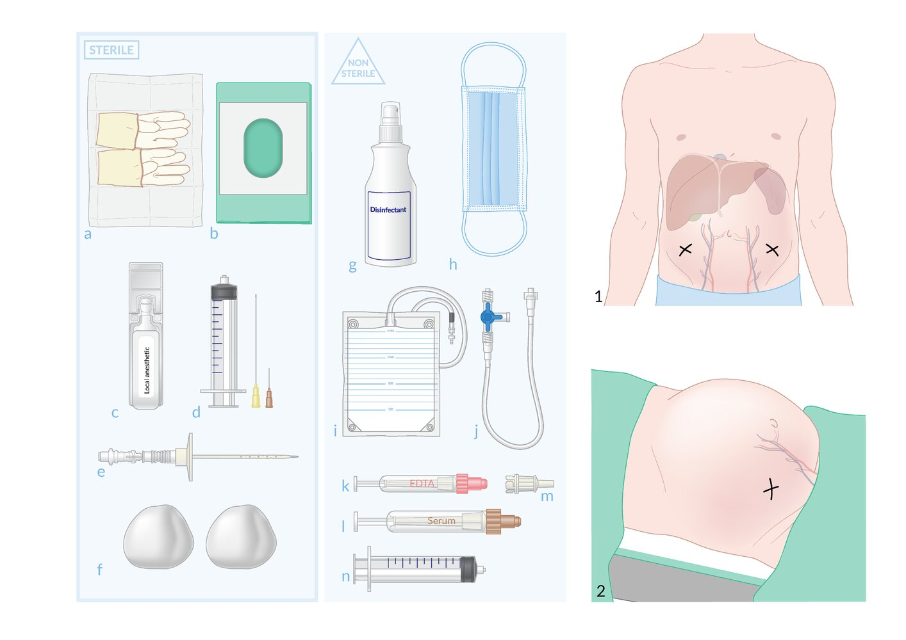

Paracentesis materials, insertion site, and patient positioning

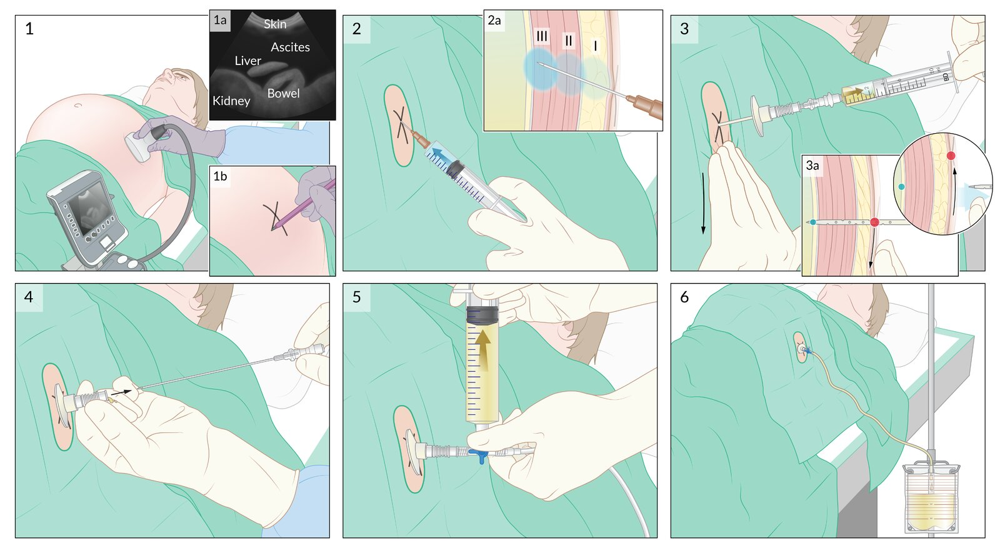

Paracentesis

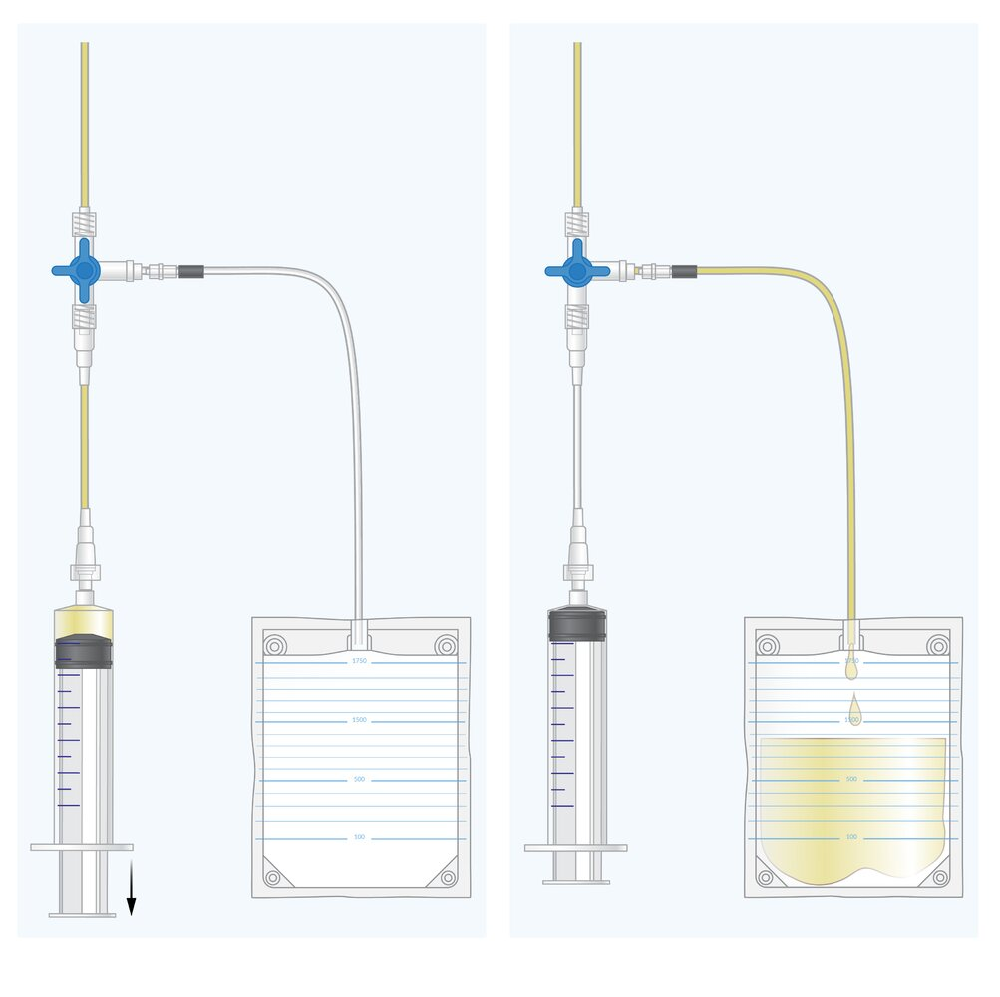

Principles of a three-way stopcock

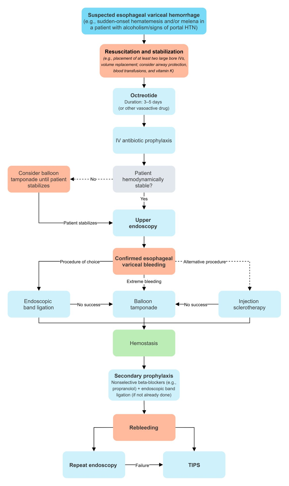

Management of esophageal variceal hemorrhage

#### <u>Liver transplant</u> [[42]](https://coursology-qbank.com/amboss/article/XSa9yP)

* <u>Liver transplant</u> is the only curative treatment option.

* Indications for <u>liver transplant</u> evaluation include:

* Occurrence of an index complication (i.e., <u>ascites</u>, <u>hepatic encephalopathy</u>, <u>variceal hemorrhage</u>)

* Hepatocellular dysfunction resulting in a <u>MELD score</u> of ≥ 15

---

## Pathology

* <u>Fibrosis</u> (fibrous septa)

* Replacement of normal <u>liver</u> tissue with collagenous regenerative <u>nodules</u> (histological staging is based on the size of the regenerative <u>nodules</u>)   [[43]](https://coursology-qbank.com/amboss/article/U30b3f)

* Abnormal cell activation with infiltration of inflammatory cells

* Loss of physiological vessel architecture (<u>central vein</u> disappearance)

|  | Size of the regenerative <u>nodules</u> | Occurrence |
| --- | --- | --- |
| Micronodular |  * 1–3 mm   |   * Following a chronic active process such as diseases with slow progression  * E.g., <u>alcohol-associated hepatitis</u>, <u>hemochromatosis</u>    |
| Macronodular |  * > 3 mm   |   * Following diffuse <u>parenchymal</u> <u>necrosis</u> with relapses or acute course  * E.g., <u>chronic hepatitis B</u>, <u>chronic hepatitis C</u>, fulminant viral <u>hepatitis</u>, <u>death cap</u> <u>poisoning</u>    |
| Both |  * 1–3 mm and > 3 mm   |  * Possible in every type of liver‑damaging disease   |

* See “<u>Alcohol-associated liver disease</u>,” “<u>Hepatitis B</u>,” and “<u>Hepatitis C</u>” for specific pathological findings related to these conditions.

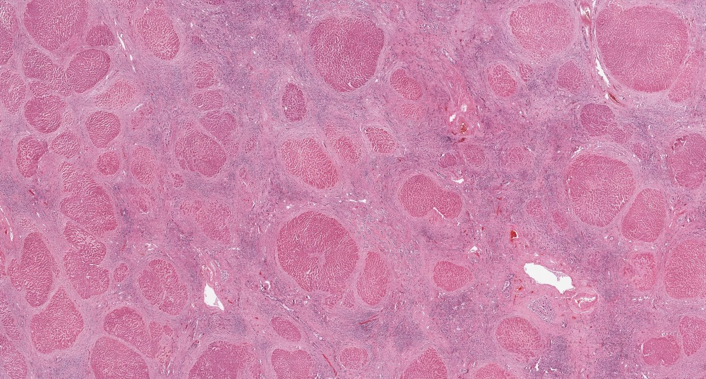

Liver cirrhosis

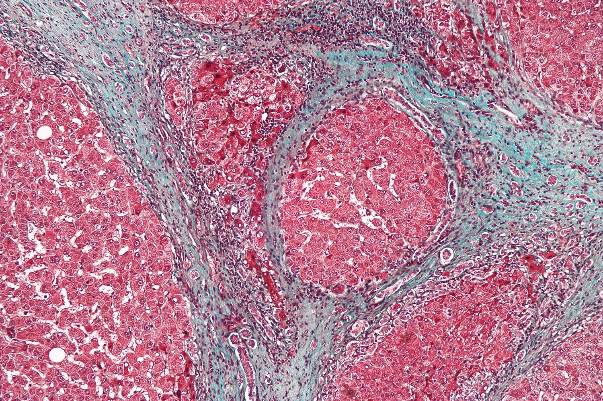

Histopathology of liver cirrhosis

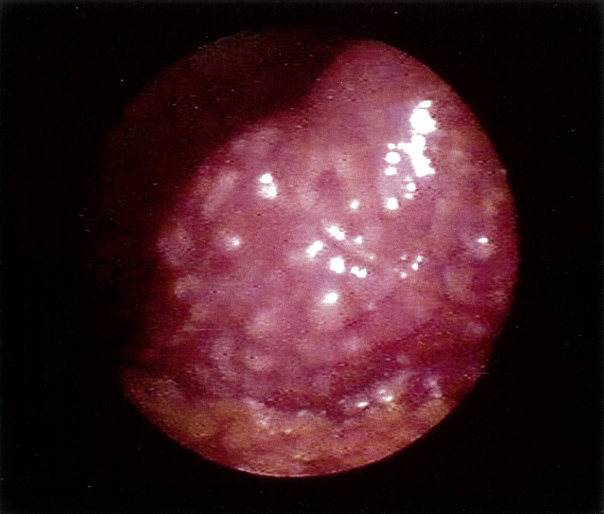

Micronodular cirrhosis

---

## Complications

### Overview [[38]](https://coursology-qbank.com/amboss/article/WCcPIe0)

|  Overview of common <u>complications of cirrhosis</u> [[3]](https://coursology-qbank.com/amboss/article/Nkb-LF)[[14]](https://coursology-qbank.com/amboss/article/TnX6sA)[[44]](https://coursology-qbank.com/amboss/article/E9X86Z0)[[45]](https://coursology-qbank.com/amboss/article/D9X1pZ0)  |  |
| --- | --- |
|  <u>Portal hypertension</u> complications  |   * <u>Ascites</u>  * <u>Esophageal varices</u> → <u>GI bleed</u>  * <u>Spontaneous bacterial peritonitis</u>  * <u>Hepatorenal syndrome</u> (<u>HRS</u>)  * <u>Hyponatremia</u>    |
| Cardiopulmonary complications |   * <u>Hepatopulmonary syndrome</u>  * <u>Portopulmonary hypertension</u>  * <u>Hepatic hydrothorax</u>  * <u>Cirrhotic cardiomyopathy</u>    |
|  Hemostatic abnormalities (<u>coagulopathy</u>)  |   * Increased bleeding risk  * <u>Coagulopathy</u>  * <u>PVT</u>    |
| Metabolic complications |   * <u>Hepatic encephalopathy</u>  * <u>Jaundice</u>  * <u>Secondary hyperparathyroidism</u>: due to reduced enzymatic activation of <u>vitamin D</u>  [[45]](https://coursology-qbank.com/amboss/article/D9X1pZ0)  * Relative <u>adrenal insufficiency</u> [[3]](https://coursology-qbank.com/amboss/article/Nkb-LF)  * <u>Diabetes mellitus</u> secondary to <u>liver</u> disease  * Nutritional deficiencies    |
| <u>Malignancy</u> |  * <u>HCC</u> (most common <u>malignancy</u> associated with cirrhosis)  [[3]](https://coursology-qbank.com/amboss/article/Nkb-LF)   |

> [!TIP]
> Cirrhosis-associated <u>ascites</u> and <u>edema</u> and elevated bleeding risk increase the risk for <u>hypovolemic shock</u>.

> [!TIP]
> <u>Vitamin K</u> infusion may improve clotting function in select patients with <u>vitamin K deficiency</u>; it is unlikely to be effective in patients with advanced <u>liver</u> disease and <u>coagulopathy</u>.

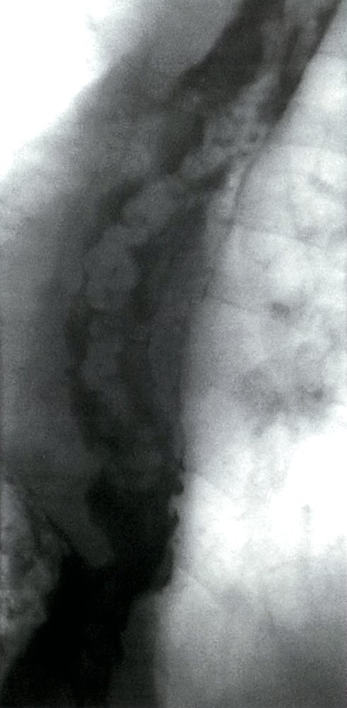

Esophageal varices

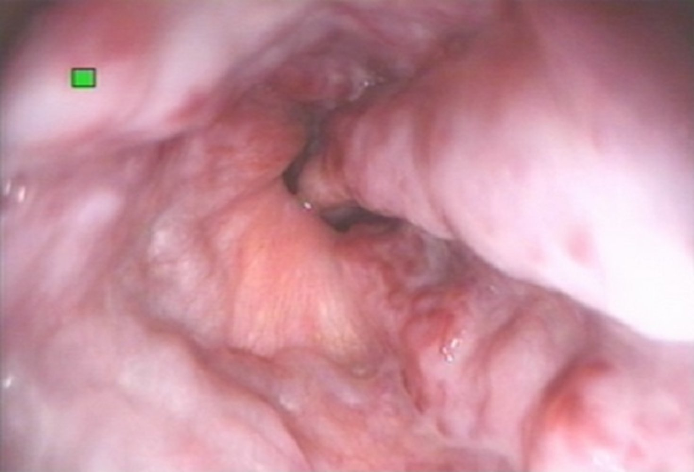

Esophageal varices

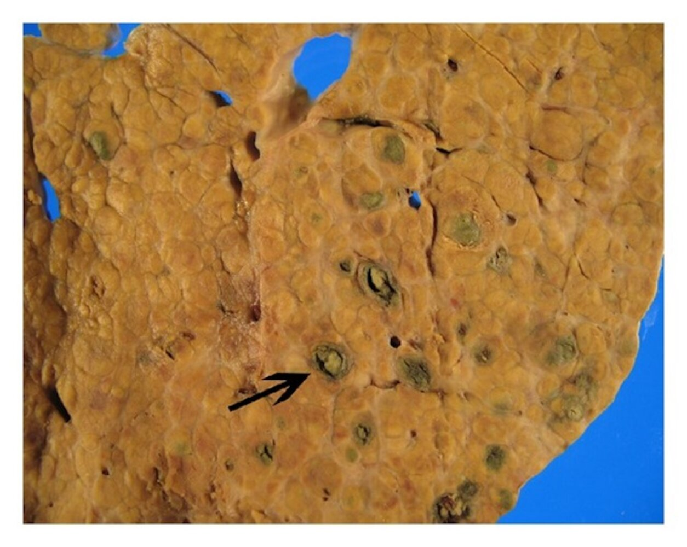

Cirrhotic liver with hepatocellular carcinoma

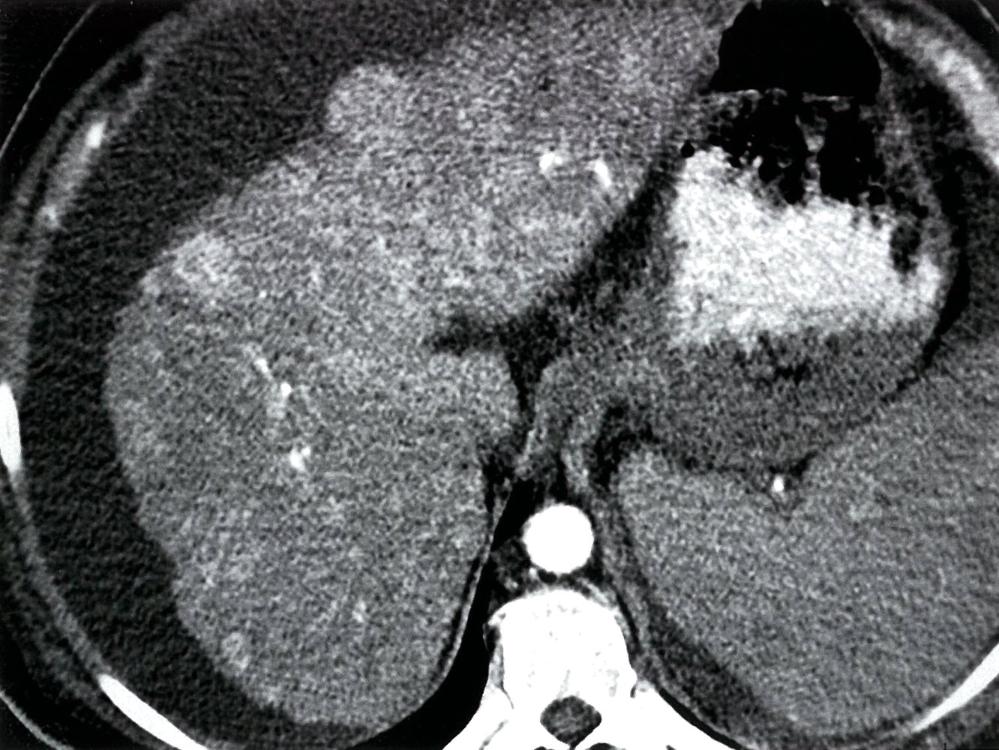

Multiple liver masses in cirrhosis

We list the most important complications. The selection is not exhaustive.

---

## Decompensated cirrhosis

* Definition: the development of overt <u>ascites</u>, <u>overt hepatic encephalopathy</u>, or <u>variceal bleeding</u> in patients with cirrhosis  [[2]](https://coursology-qbank.com/amboss/article/0tWeXM0)

* Onset: can be triggered by an acute event (e.g., bleeding, <u>sepsis</u>) or develop gradually (e.g., <u>ascites</u>, <u>encephalopathy</u>) [[46]](https://coursology-qbank.com/amboss/article/iwcJie0)[[47]](https://coursology-qbank.com/amboss/article/vwXAkZ0)

* Common precipitating factors[[47]](https://coursology-qbank.com/amboss/article/vwXAkZ0)

* Infection (e.g., <u>spontaneous bacterial peritonitis</u>) or <u>sepsis</u>

* <u>Alcohol</u> consumption

* Medications (e.g., <u>NSAIDs</u>)

* <u>GI bleeding</u>

* <u>Dehydration</u>

* <u>Constipation</u>

* Acute <u>PVT</u>

* <u>HCC</u>

* Diagnostics: to establish the cause of decompensation

* <u>CBC</u>, <u>BMP</u>, <u>liver chemistries</u>

* <u>Magnesium</u> and <u>phosphate</u> levels

* <u>Coagulation panel</u>

* Consider <u>type and screen</u>.

* <u>Paracentesis</u> in patients with <u>ascites</u>

* <u>CRP</u>, <u>blood cultures</u>, <u>urinalysis</u> and culture, <u>chest x-ray</u>

* Abdominal <u>ultrasound</u> to assess for <u>PVT</u>

* Acute management: See “<u>Management of acute liver failure</u>.” [[3]](https://coursology-qbank.com/amboss/article/Nkb-LF)[[41]](https://coursology-qbank.com/amboss/article/kCcmHe0)[[47]](https://coursology-qbank.com/amboss/article/vwXAkZ0)

* Gastroenterology consult

* Treat the underlying cause and complications (if applicable).

* Prognosis: In patients with <u>decompensated cirrhosis</u>, survival rates are usually poor unless <u>liver transplantation</u> is performed.

---

## Special patient groups

### Liver cirrhosis in pregnancy [[48]](https://coursology-qbank.com/amboss/article/6pcjqW0)[[49]](https://coursology-qbank.com/amboss/article/ppcLqW0)

* Maternal complications

* Worsening of <u>liver</u> cirrhosis; <u>pregnancy</u> in individuals with advanced disease is associated with increased risk of:

* New-onset <u>ascites</u> or worsening of <u>ascites</u>

* <u>Liver</u> failure

* <u>Hepatorenal syndrome</u>

* <u>Variceal bleeding</u> (during <u>pregnancy</u> and/or <u>labor</u>)

* Increased risk of <u>pregnancy</u>-related complications, including:

* <u>Gestational diabetes</u>

* <u>Placental abruption</u>

* <u>Preeclampsia</u>

* <u>Postpartum hemorrhage</u>

* <u>Spontaneous abortion</u>, need of <u>cesarean delivery</u>, <u>preterm delivery</u>

* Fetal complications: associated with increased rates of <u>newborn</u> <u>asphyxia</u> and small size for <u>gestational age</u>

---