# Crohn disease

*Categories: Clinical knowledge > Emergency medicine > Gastrointestinal disorders > Crohn disease*

[Original Article Link](https://coursology-qbank.com/amboss/article/VS0GA2)

---

## Summary

Crohn disease (CD) is an <u>inflammatory bowel disease</u> (<u>IBD</u>) of unclear etiology. Unlike <u>ulcerative colitis</u>, CD is not limited to the <u>colon</u> but can manifest anywhere in the <u>gastrointestinal tract</u>. Clinical features commonly include <u>diarrhea</u>, weight loss, and abdominal <u>pain</u>. Extraintestinal manifestations may occur in the eyes, <u>joints</u>, and <u>skin</u>. Diagnosis is based on <u>laboratory studies</u> (e.g., elevated <u>CRP</u>, <u>fecal calprotectin</u>), characteristic endoscopic features (e.g., <u>ulcerations</u>, <u>skip lesions</u>, <u>cobblestone appearance</u>), and evidence of intestinal inflammation on imaging. Medical management aims to induce and maintain remission; it is tailored to the patient and influenced by the location and <u>severity of CD</u>. Acute flares are typically managed with <u>glucocorticoids</u> and <u>biologics</u> (e.g., <u>anti-TNF-α antibodies</u>). <u>Maintenance therapy</u> (using, e.g., <u>biologics</u>, immunomodulators) focuses on limiting the frequency and duration of inflammatory episodes. <u>Surgery</u> is ultimately required in up to half of patients with CD; clinical manifestations commonly recur after <u>surgery</u>. <u>Complications of CD</u> include <u>malabsorption</u>, <u>iron</u> and <u>vitamin deficiency</u>, strictures, <u>bowel obstruction</u>, <u>intraabdominal abscesses</u>, and increased risk of bowel cancer.

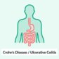

Crohn’s disease and ulcerative colitis: Differences

---

## Epidemiology

* <u>Prevalence</u>: 1 case per 500 population

* <u>Incidence</u>: ∼ 6 cases per 100,000 population per year [[1]](https://coursology-qbank.com/amboss/article/xIbEUE)

* Sex: <u>♂</u> = <u>♀</u>

* Typical age of onset: <u>bimodal distribution</u> with one peak at 15–35 years and another one at 55–70 years [[2]](https://coursology-qbank.com/amboss/article/_Ib52E)[[3]](https://coursology-qbank.com/amboss/article/AIbR2E)

* Populations with higher <u>prevalence</u> [[4]](https://coursology-qbank.com/amboss/article/zIbr2E)

* Individuals of Northern European descent

* Individuals of <u>Ashkenazi Jewish descent</u>

Epidemiological data refers to the US, unless otherwise specified.

---

## Etiology

* Cause: Immune dysregulation and dysbiosis, which promotes <u>chronic inflammation</u>, the ultimate cause of which is not fully understood.

* <u>Risk factors</u> [[4]](https://coursology-qbank.com/amboss/article/zIbr2E)

* Familial aggregation

* Genetic predisposition (e.g., mutation of the <u>NOD2</u> <u>gene</u>, <u>HLA-B27</u> association)

* <u>Tobacco smoke</u>

> [!TIP]
> Smoking tobacco is the primary <u>modifiable risk factor</u> for CD. Therefore, <u>smoking cessation</u> is especially important in patients with CD.

---

## Pathophysiology

### Inflammation

Inflammation is most likely caused by immune dysregulation.

* Dysregulation of IL-23-<u>Th17</u> signaling → unrestrained <u>Th17 cell</u> function → inflammation → local tissue damage (<u>edema</u>, <u>erosions</u>/<u>ulcers</u>, <u>necrosis</u>) → obstruction, <u>fibrotic</u> scarring, stricture, and strangulation of the bowel [[5]](https://coursology-qbank.com/amboss/article/37bSlE)

* Mutations in the <u>nucleotide oligomerization binding domain 2</u> (<u>NOD2</u>) protein are likely involved in the development of CD.

### <u>Abscess</u> and <u>fistula</u> formation

* Intestinal aphthous <u>ulcers</u> → <u>transmural</u> fissures and inflammation of the intestinal walls → adherence of other organs or the <u>skin</u> → penetration of tissue → microperforation and <u>abscess</u> formation → macroperforation into these structures → <u>fistula</u> formation

---

## Clinical features

CD typically has a chronic intermittent course with episodic acute flares and periods of remission. Clinical features differ according to the <u>severity of CD</u>. Patients with <u>mild CD</u> may be asymptomatic while patients with <u>fulminant CD</u> have severe symptoms.

### <u>Constitutional symptoms</u> [[6]](https://coursology-qbank.com/amboss/article/N7b-NE)

* Low-grade <u>fever</u>

* Weight loss

* Fatigue

### Gastrointestinal symptoms [[6]](https://coursology-qbank.com/amboss/article/N7b-NE)

CD most commonly affects the <u>terminal ileum</u> and <u>colon</u>, but involvement of any part of the <u>GI tract</u> (from mouth to <u>anus</u>) is possible. In contrast to <u>ulcerative colitis</u>, rectal involvement is uncommon.

* <u>Chronic diarrhea</u>

* <u>Lower gastrointestinal bleeding</u> (uncommon)

* Abdominal <u>pain</u>, typically in the <u>RLQ</u>

* Palpable abdominal mass  in the <u>RLQ</u>

* Features of upper gastrointestinal CD [[7]](https://coursology-qbank.com/amboss/article/9hVNT80)

* Often asymptomatic

* Epigastric <u>pain</u>

* <u>Nausea and vomiting</u>

* <u>Dysphagia</u>, <u>odynophagia</u>, <u>dyspepsia</u>

* Signs of <u>gastric outlet obstruction</u> (e.g., early satiety, <u>postprandial</u> fullness)  [[8]](https://coursology-qbank.com/amboss/article/whVhT80)

* Features of <u>CD complications</u>

* <u>Malabsorption</u> (e.g., weight loss, <u>anemia</u>, <u>failure to thrive</u> ;  )

* Enterocutaneous or perianal <u>fistulas</u>, often associated with <u>abscess</u> formation [[9]](https://coursology-qbank.com/amboss/article/In0Yug)

> [!TIP]
> Perianal lesions are occasionally the first manifestation of Crohn disease.[[10]](https://coursology-qbank.com/amboss/article/g-dF9s0)

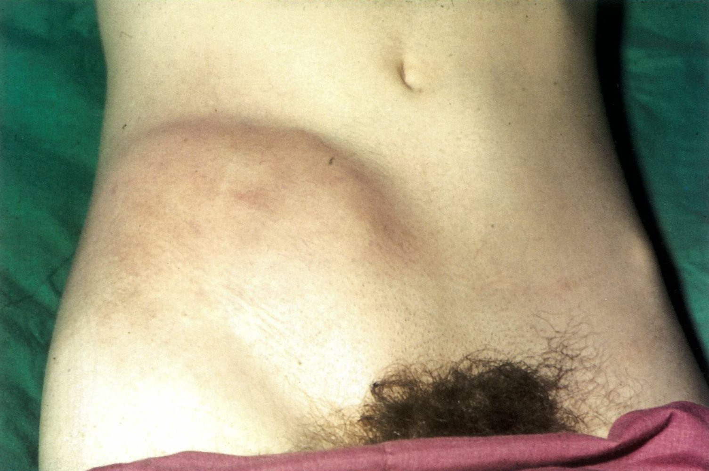

Abdominal mass secondary to Crohn disease

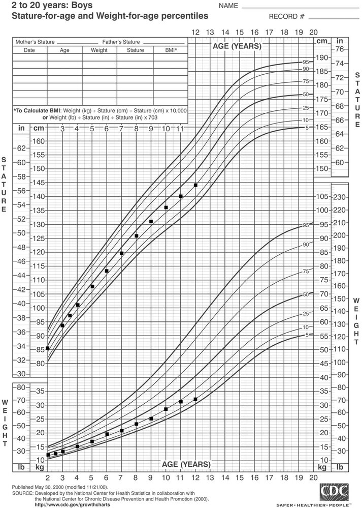

### Extraintestinal symptoms  [[11]](https://coursology-qbank.com/amboss/article/UrbbgE)

Extraintestinal manifestations of CD are present in 20–30% of patients with CD. [[12]](https://coursology-qbank.com/amboss/article/GncBu10)

* <u>Joints</u>

* Enteropathic arthritis

* A <u>seronegative spondyloarthropathy</u> that develops in association with <u>inflammatory bowel disease</u>

* Typically affects <u>joints</u> of the lower extremities but can also involve the <u>spine</u> (e.g., <u>sacroiliitis</u>, <u>spondylitis</u>, inflammation of peripheral <u>joints</u>).

* <u>Nail clubbing</u> [[13]](https://coursology-qbank.com/amboss/article/jwc_ie0)

* Eyes

* <u>Uveitis</u>

* <u>Iritis</u>

* <u>Episcleritis</u>

* <u>Liver</u>/<u>bile</u> ducts: <u>cholelithiasis</u>

* Urogenital system: <u>urolithiasis</u> (mostly <u>calcium oxalate stones</u>)

* Oral <u>mucosa</u>

* Oral aphthae

* <u>Pyostomatitis vegetans</u>

* <u>Skin</u>

* <u>Erythema nodosum</u>

* <u>Acrodermatitis enteropathica</u>

* <u>Pyoderma gangrenosum</u>

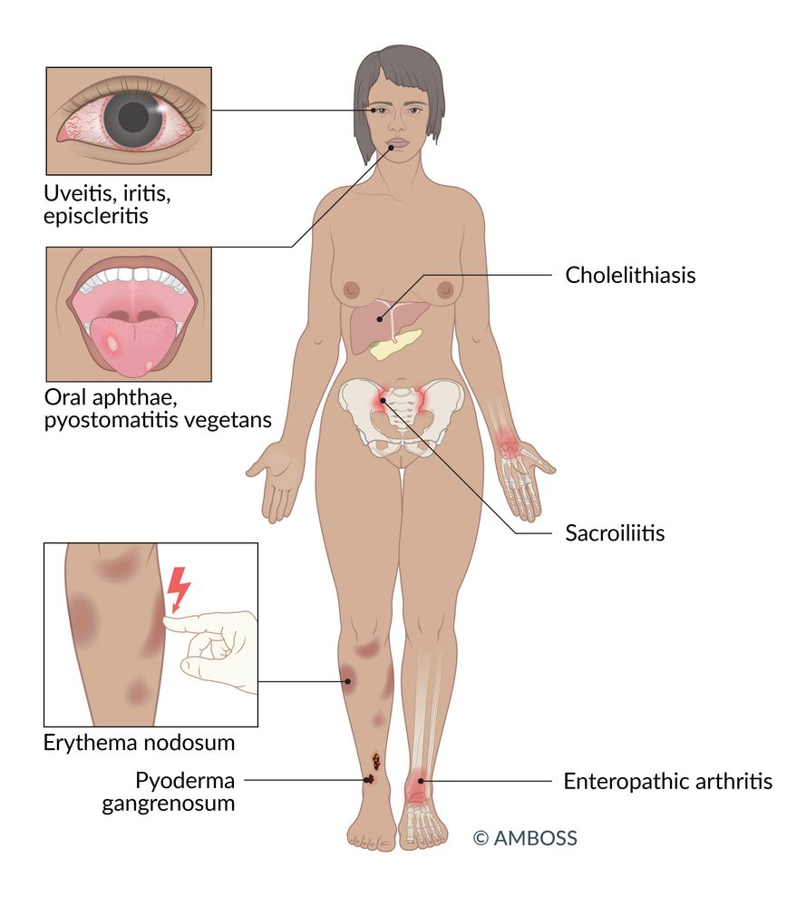

Extraintestinal manifestations of inflammatory bowel disease

---

## Diagnosis

### Approach [[10]](https://coursology-qbank.com/amboss/article/g-dF9s0)[[14]](https://coursology-qbank.com/amboss/article/rfcfnb0)

* Evaluate patients with <u>chronic diarrhea</u> and/or abdominal <u>pain</u> for CD.

* Obtain <u>laboratory studies</u> (blood and stool) to:

* Rule out differential diagnoses of CD (e.g., <u>infectious gastroenteritis</u>).

* Assess and monitor disease activity.

* Consult gastroenterology for endoscopy with histological examination to:

* Definitively diagnose CD.

* Determine the extent and severity of disease.

* Assess distribution and monitor disease activity.

* Perform <u>cross-sectional imaging</u> to establish the location and severity of disease and identify complications.

> [!TIP]
> Endoscopy, <u>cross-sectional imaging</u>, and <u>laboratory studies</u> are required for the initial evaluation of suspected CD, evaluation of an acute flare, and monitoring the response to therapy.

### <u>Laboratory studies</u> [[6]](https://coursology-qbank.com/amboss/article/N7b-NE)[[10]](https://coursology-qbank.com/amboss/article/g-dF9s0)

#### Blood tests

* <u>CBC</u>: may show <u>anemia</u>, ↑ <u>platelets</u> (<u>reactive thrombocytosis</u>)

* <u>Inflammatory markers</u>: <u>CRP</u>, <u>ESR</u>

* <u>CRP</u> has a greater <u>correlation</u> with disease activity than <u>ESR</u>.

* Both may be normal in patients with <u>mild CD</u>.

* <u>CMP</u>

* ↑ <u>Creatinine</u>

* ↓ <u>Albumin</u> (<u>marker of inflammation</u>)

* <u>Iron studies</u>, <u>vitamin B12</u>, <u>folate</u>: to evaluate for <u>micronutrient</u> deficiency  [[15]](https://coursology-qbank.com/amboss/article/yaXdM9)

* <u>Serology</u>: not routinely recommended due to low <u>sensitivity</u>

* ↑ Anti-saccharomyces cerevisiae <u>antibodies</u>: more commonly elevated in CD than in <u>ulcerative colitis</u>

* <u>pANCA</u>: more commonly elevated in <u>ulcerative colitis</u> than in CD  [[10]](https://coursology-qbank.com/amboss/article/g-dF9s0)[[16]](https://coursology-qbank.com/amboss/article/1-d2ws0)

* Specialized studies

* <u>Thiopurine methyltransferase</u> (TPMT) activity

* <u>Genetic testing</u>: considered in selected patients

#### Stool studies

* Stool analysis ; of <u>diarrhea</u>: to identify bacterial infection (including <u>C. difficile</u> infection), <u>ova</u>, and/or cysts (see also "<u>Diagnostics for infectious gastroenteritis</u>")

* Fecal calprotectin and/or fecal lactoferrin: noninvasive markers of intestinal inflammation

* <u>Fecal calprotectin</u>: elevated (> 50–100 μg/g)

* Used to monitor disease activity and response to therapy

* Helps differentiate <u>IBD</u> from <u>irritable bowel syndrome</u>

> [!NOTE]
> <u>Anemia</u> in CD may result from chronic disease, <u>iron deficiency</u>, and/or <u>vitamin B12 deficiency</u>.

### Endoscopy

#### <u>Ileocolonoscopy</u> [[10]](https://coursology-qbank.com/amboss/article/g-dF9s0)

* Indication: all patients with suspected CD

* Assesses the distribution and severity of the disease

* Aids differentiation of CD from other diseases (e.g., <u>ulcerative colitis</u>)

* Monitors disease activity (e.g., active disease, remission)

* Can be used therapeutically (e.g., stricture dilatation)

* Supportive findings  [[10]](https://coursology-qbank.com/amboss/article/g-dF9s0)[[14]](https://coursology-qbank.com/amboss/article/rfcfnb0)[[17]](https://coursology-qbank.com/amboss/article/7fc4nb0)

* Skip lesions: segmental and/or discontinuous pattern of involvement (interspersed with normal tissue)

* Linear and/or <u>serpiginous</u> <u>ulcerations</u>

* Small aphthous <u>ulcerations</u>

* Cobblestone sign: inflamed <u>edematous</u> sections interspersed with deep <u>ulcerations</u> that resemble cobblestones

* <u>Erythema</u>, fissures, strictures, and <u>fistulas</u>

* <u>Biopsy</u>

* <u>Histopathology</u>: Confirm CD (e.g., <u>chronic inflammation</u>).

* Exclude <u>CMV colitis</u> in unresponsive CD (e.g., <u>immunohistochemistry</u> for <u>CMV</u> <u>antigens</u>): See "<u>Diagnosis of CMV infection</u>." [[18]](https://coursology-qbank.com/amboss/article/ayWQdL0)

> [!TIP]
> Discontinuous areas of inflammation, <u>cobblestone appearance</u> of the affected <u>mucosa</u>, and <u>mucosal</u> <u>ulcerations</u> are hallmark endoscopic findings of CD. [[19]](https://coursology-qbank.com/amboss/article/Lkcwoc0)

#### Other endoscopic techniques [[10]](https://coursology-qbank.com/amboss/article/g-dF9s0)

* <u>Upper endoscopy</u>: if upper GI involvement is suspected  [[10]](https://coursology-qbank.com/amboss/article/g-dF9s0)[[20]](https://coursology-qbank.com/amboss/article/7Jc4vW0)

* <u>Video capsule endoscopy</u>: Consider in patients with suspected <u>small bowel</u> CD (as an alternative to <u>cross-sectional imaging</u>).

> [!TIP]
> <u>Small bowel</u> evaluation is an essential part of the initial diagnostic workup of CD. Almost one-third of patients with CD have only <u>small bowel</u> disease, which may not be visible on <u>ileocolonoscopy</u>. [[10]](https://coursology-qbank.com/amboss/article/g-dF9s0)

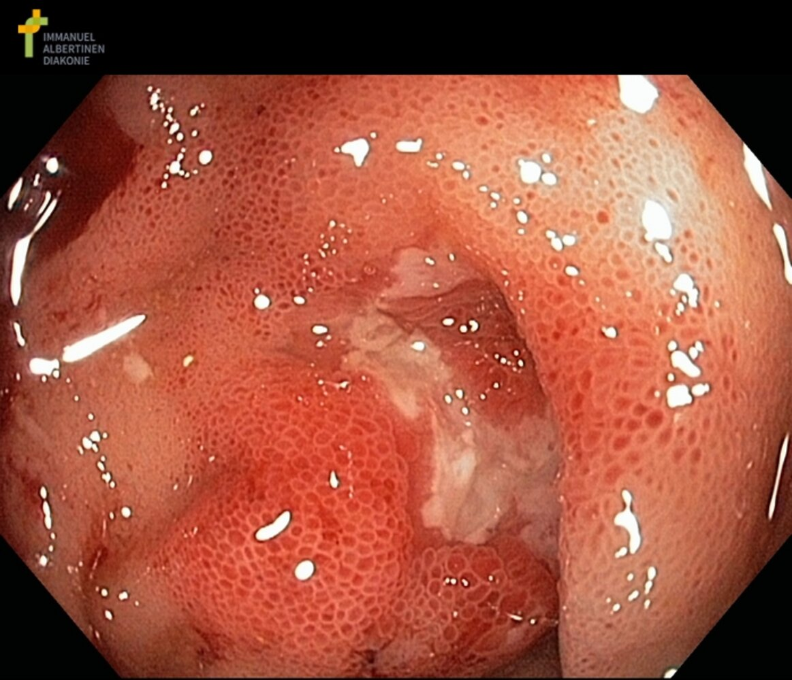

Terminal ileum in Crohn disease

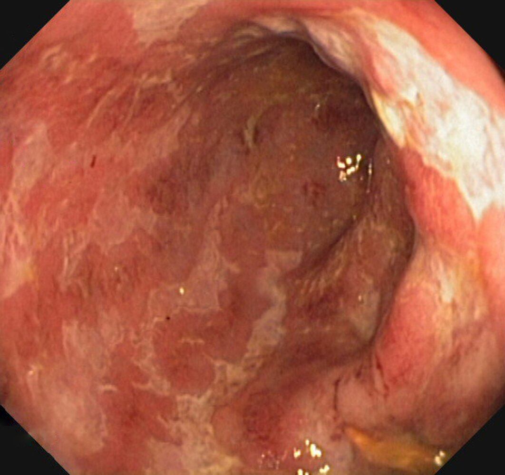

Colon in Crohn disease

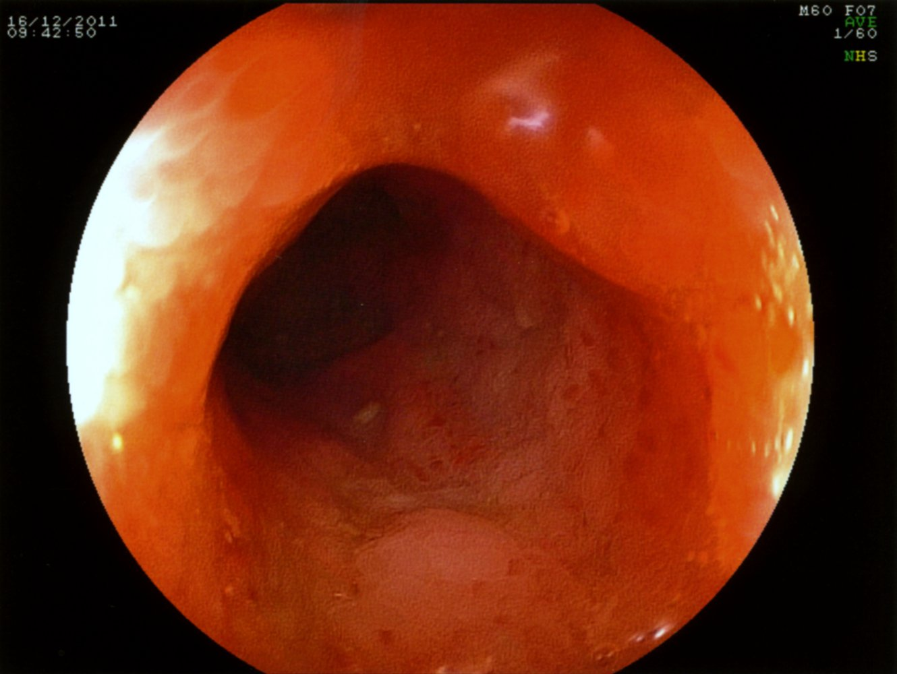

Terminal ileum in Crohn disease

### Imaging [[6]](https://coursology-qbank.com/amboss/article/N7b-NE)[[10]](https://coursology-qbank.com/amboss/article/g-dF9s0)[[21]](https://coursology-qbank.com/amboss/article/kaXmk9)[[22]](https://coursology-qbank.com/amboss/article/5fci5b0)

<u>Cross-sectional imaging</u> is used to evaluate the entire <u>GI tract</u>, and it can identify inflammation and complications (e.g., <u>bowel obstruction</u>, <u>abscess</u>, <u>fistula</u>) that are not visible on endoscopy.

#### Indications

* Suspected CD (part of initial evaluation)

* Localization of inflammation and assessment of severity  [[10]](https://coursology-qbank.com/amboss/article/g-dF9s0)[[21]](https://coursology-qbank.com/amboss/article/kaXmk9)

* Evaluation of suspected acute flare or complications (e.g., <u>abscess</u>)

* Before starting <u>biologics</u>: to ensure there are no <u>pyogenic</u> complications (e.g., <u>abscess</u>)

* Serial imaging to assess response to therapy

#### Modalities and supportive findings

* Cross-sectional enterography (<u>MR enterography</u>, <u>CT enterography</u>): preferred imaging modality for CD ;  [[10]](https://coursology-qbank.com/amboss/article/g-dF9s0)

* <u>Edematous</u> thickening of the intestinal wall

* <u>Mucosal</u> <u>enhancement</u>, <u>mesenteric</u> <u>fat stranding</u>

* Creeping fat: excessive <u>mesenteric</u> fat around the affected segments of bowel  [[23]](https://coursology-qbank.com/amboss/article/3HbSJE)

* Can also identify:

* Complications (e.g., strictures, <u>fistulas</u>, <u>abscesses</u>)

* Extraluminal disease (e.g., <u>cholelithiasis</u>, <u>urolithiasis</u>)

* Response to therapy (e.g., healing of <u>ulcers</u>)

* CT abdomen and <u>pelvis</u> (with IV contrast): preferred in acutely ill patients who cannot tolerate PO contrast

* Additional modalities [[10]](https://coursology-qbank.com/amboss/article/g-dF9s0)[[21]](https://coursology-qbank.com/amboss/article/kaXmk9)

* <u>Ultrasound</u> abdomen

* Consider for initial evaluation of suspected CD and for disease monitoring. [[21]](https://coursology-qbank.com/amboss/article/kaXmk9)

* Supportive finding (of active disease): bowel wall thickening (> 4 mm)

* Plain <u>x-ray</u> abdomen: Consider for expedited assessment of complications.

* <u>MRI</u> abdomen and <u>pelvis</u> (with IV contrast) or endscopic <u>ultrasound</u> [[10]](https://coursology-qbank.com/amboss/article/g-dF9s0)[[21]](https://coursology-qbank.com/amboss/article/kaXmk9)

* Preferred modality to evaluate for <u>perianal fistulas</u> and/or <u>abscess</u>

* <u>Endoscopic ultrasound</u> can be used to monitor treatment response.

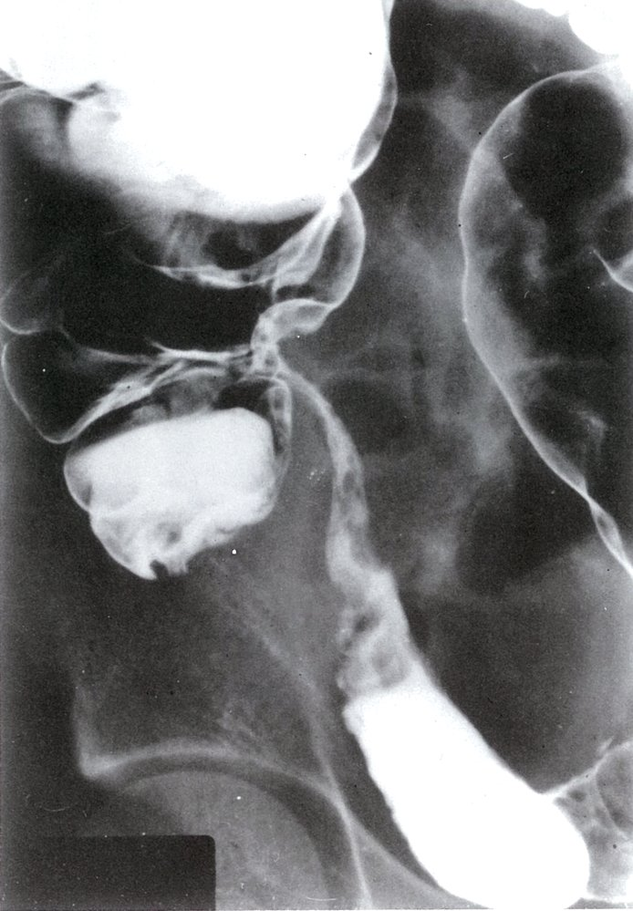

Stricture of the terminal ileum

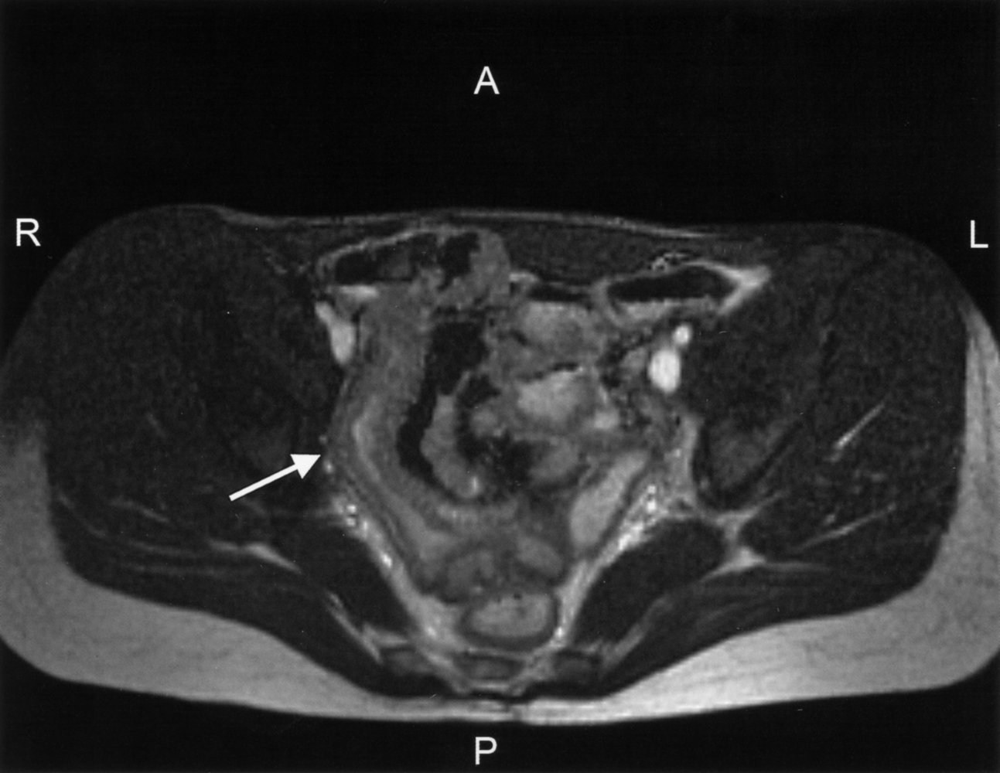

Stricture of the terminal ileum

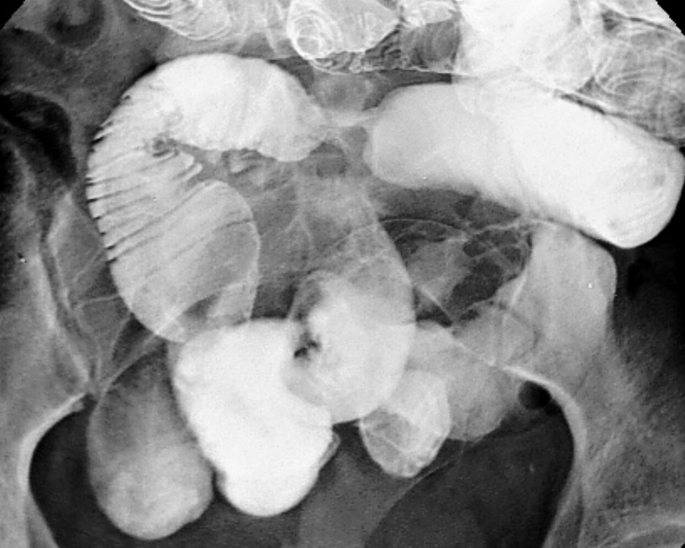

Small bowel stricture in Crohn disease

Pneumoperitoneum and Pneumoretroperitoneum

---

## Pathology

* <u>Transmural</u> inflammation: all <u>mucosal</u> layers of the intestinal wall are involved  

* <u>Noncaseating granulomas</u>    [[24]](https://coursology-qbank.com/amboss/article/fsbk8E)

* <u>Giant cells</u>

* Distinct lymphoid aggregates of the <u>lamina propria</u>

* <u>Creeping fat</u>

* <u>Hypertrophic</u> <u>lymph nodes</u>

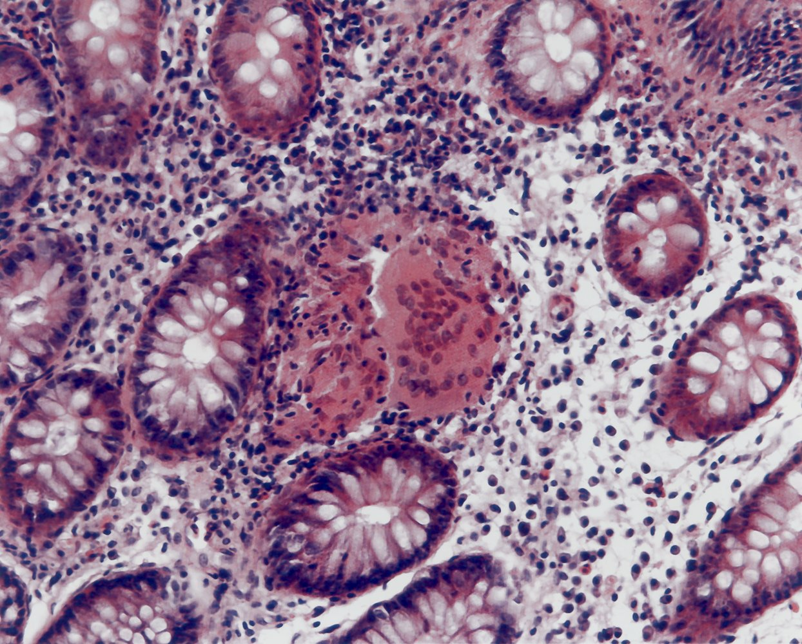

Crohn disease

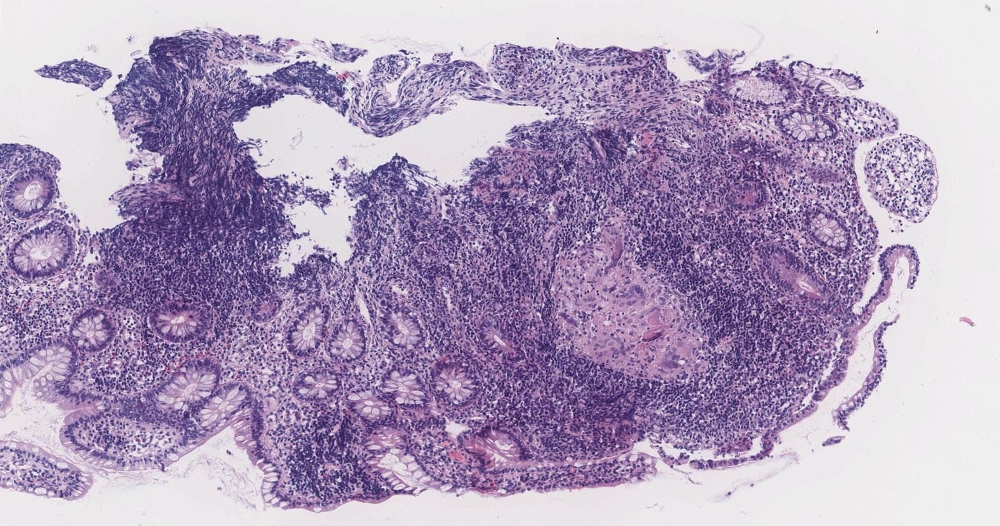

Crohn disease

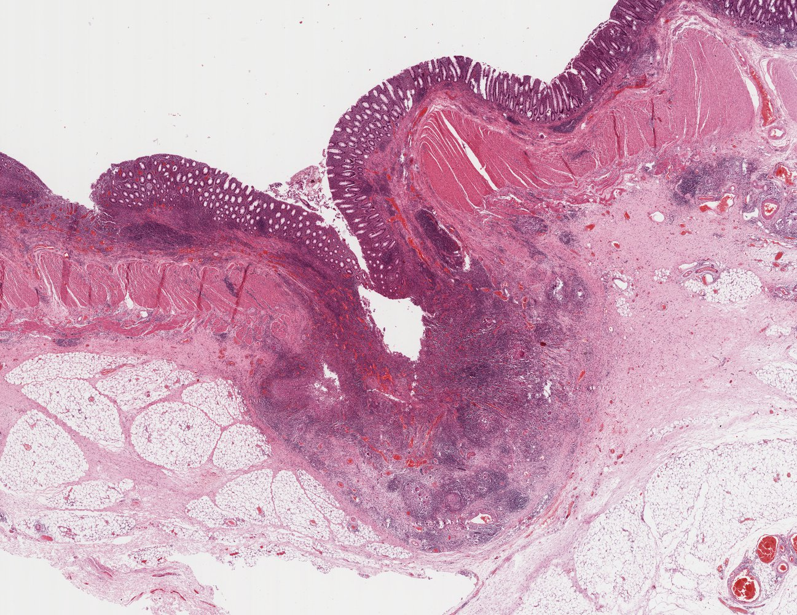

Crohn disease

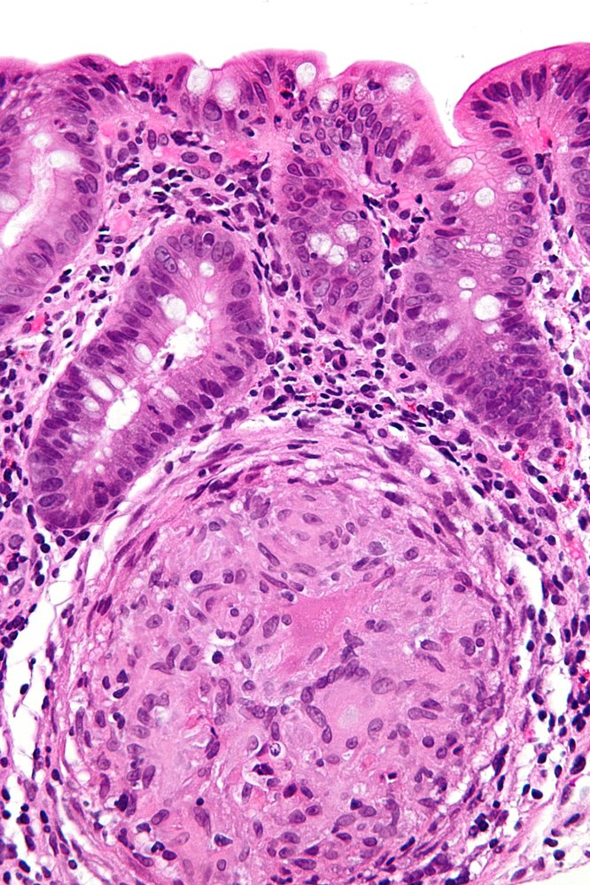

Crohn disease

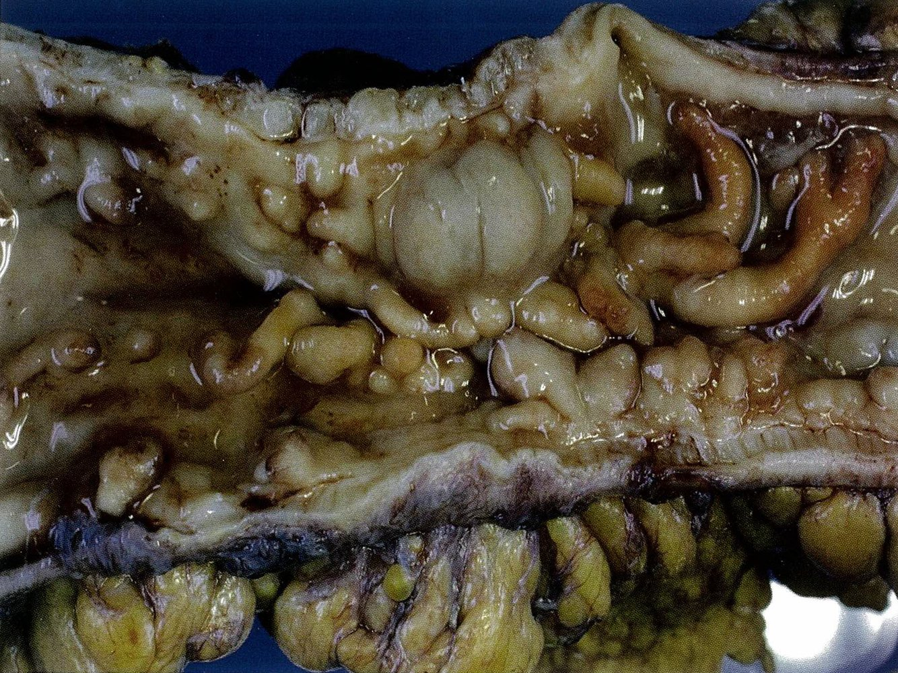

Colon in Crohn disease

---

## Treatment

### General principles [[10]](https://coursology-qbank.com/amboss/article/g-dF9s0)

* Refer all patients to gastroenterology.

* Tailor therapy to the <u>severity of CD</u>, phase of the disease (acute flare or remission), and <u>risk of progression of CD</u>.

* Early use of <u>biologics</u> (e.g., <u>anti-TNF-α antibodies</u>) is the <u>standard of care</u> in new active CD.

* <u>Surgery</u> may be required to manage complications and is an option for isolated short-segment disease.

* Lifestyle modifications (e.g., <u>smoking cessation</u>) may decrease the <u>incidence</u> of complications.

* Regular monitoring of disease activity and screening for complications are essential aspects of long-term management.

### Management of acute flare of CD

* <u>Hemodynamic support</u> as needed (e.g., for <u>severe to fulminant CD</u>): <u>IV fluids</u>, <u>electrolyte repletion</u>

* Consult gastroenterology early to determine choice of <u>induction therapy</u>.

* Screen for and administer prophylaxis against common infectious diseases.

* Patients with severe or <u>fulminant CD</u> typically require hospitalization.

* Initiate <u>thromboprophylaxis</u> as needed (e.g., presence of <u>risk factors for VTE</u>, hospitalization). [[22]](https://coursology-qbank.com/amboss/article/5fci5b0)[[25]](https://coursology-qbank.com/amboss/article/hTccqb0)

* Identify and treat <u>malnutrition</u> and <u>micronutrient</u> deficiency.

### Infectious disease screening and prophylaxis [[22]](https://coursology-qbank.com/amboss/article/5fci5b0)

Perform prior to initiating therapy if feasible as most <u>medications for CD</u> can cause <u>immunosuppression</u>.

* Update <u>immunization</u> status at diagnosis: See “<u>ACIP immunization schedule</u>” for details.

* Screen for viral infections (<u>hepatitis B</u>, <u>hepatitis C</u>, <u>HIV</u>, <u>Epstein-Barr virus</u>) and <u>tuberculosis</u>.  [[15]](https://coursology-qbank.com/amboss/article/yaXdM9)[[22]](https://coursology-qbank.com/amboss/article/5fci5b0)

* Consult infectious disease before initiating therapy if <u>screening tests</u> are positive. [[22]](https://coursology-qbank.com/amboss/article/5fci5b0)

### Pharmacological treatment [[10]](https://coursology-qbank.com/amboss/article/g-dF9s0)[[26]](https://coursology-qbank.com/amboss/article/zgVrBF0)

* Induction phase

* Used to manage acute flares.

* Agents that have a rapid onset of action (e.g., <u>glucocorticoids</u>, <u>biologics</u>) are used.

* Should be continued until there is objective evidence of remission (typically < 3 months). [[10]](https://coursology-qbank.com/amboss/article/g-dF9s0)

* Endoscopic evidence of remission (e.g., healing <u>ulcers</u>) is currently the best indicator of remission of <u>colonic</u> CD. [[10]](https://coursology-qbank.com/amboss/article/g-dF9s0)[[27]](https://coursology-qbank.com/amboss/article/WTcPpb0)

* Noninvasive markers of intestinal inflammation (<u>fecal calprotectin</u>, <u>cross-sectional imaging</u>) are suitable alternatives to evaluate for remission.

* Maintenance phase

* Used to maintain remission (e.g., in new active CD regardless of severity, in patients with moderate or severe CD, and/or those at high <u>risk of progression of CD</u>)  [[10]](https://coursology-qbank.com/amboss/article/g-dF9s0)[[28]](https://coursology-qbank.com/amboss/article/SNcy010)

* <u>Biologics</u> and immunomodulators are the principal agents of <u>maintenance therapy</u>.

* Typically continued for a prolonged period of time.  [[29]](https://coursology-qbank.com/amboss/article/cJcaGW0)

> [!TIP]
> Symptoms alone do not accurately correlate with disease activity. Use objective markers of disease severity (e.g., biomarkers, imaging, endoscopy) to assess the <u>severity of CD</u>, guide treatment, and verify remission. [[10]](https://coursology-qbank.com/amboss/article/g-dF9s0)

#### Overview of commonly used medications [[10]](https://coursology-qbank.com/amboss/article/g-dF9s0)[[26]](https://coursology-qbank.com/amboss/article/zgVrBF0)

* <u>Glucocorticoids</u>

* Primarily used to induce remission

* Agents used (depending on <u>severity of CD</u>):

* Controlled ileal release budesonide

* A formulation of the synthetic <u>steroid</u> <u>budesonide</u> that is released in environments with a <u>pH</u> ≥ 5.5, which facilitates drug delivery <u>distal</u> to the <u>proximal</u> <u>small bowel</u>

* Used to treat Crohn disease that involves sites of inflammation in the <u>ileum</u> and/or <u>ascending colon</u>

* Oral <u>prednisone</u>

* IV <u>methylprednisolone</u>

* <u>Biologics</u>

* <u>Anti-TNF-α antibodies</u> (e.g., <u>adalimumab</u>, <u>infliximab</u>, <u>certolizumab</u>)

* Increasingly used as a primary agent to induce remission.

* Also used to maintain remission and manage CD refractory to immunomodulators

* Anti-<u>leukocyte</u> trafficking <u>antibody</u> (e.g., <u>vedolizumab</u>) and <u>anti-p40 antibody</u>;  (e.g., <u>ustekinumab</u>): used mainly to induce and maintain remission in <u>moderate to severe CD</u>

* Immunomodulators: e.g., <u>thiopurine analogs</u> (<u>azathioprine</u>, <u>6-mercaptopurine</u>), <u>methotrexate</u>

* Used to maintain remission

* Can be used as a <u>steroid-sparing agent</u>

* <u>5-aminosalicylic acid derivative</u>: <u>sulfasalazine</u>

* May be considered to induce remission of mild <u>colonic</u> or ileocolonic CD

* Not effective in isolated <u>small bowel</u> disease

* <u>Antibiotics</u>: not recommended for the primary treatment of CD

* <u>Metronidazole</u> may be beneficial in the prevention of postoperative recurrence of CD.

* <u>Broad-spectrum antibiotics</u> are used for the treatment of <u>abscesses</u> and systemic infections.

> [!TIP]
> <u>Glucocorticoids</u> can be used to induce remission, but they should be discontinued once the acute flare has been managed. [[10]](https://coursology-qbank.com/amboss/article/g-dF9s0)[[22]](https://coursology-qbank.com/amboss/article/5fci5b0)

> [!TIP]
> Early use of <u>biologics</u> (e.g., <u>anti-TNF-α antibodies</u>) is the <u>standard of care</u> in new, active CD, in moderate to severe disease, and/or if patients have <u>risk factors for progression of CD</u>. [[10]](https://coursology-qbank.com/amboss/article/g-dF9s0)[[26]](https://coursology-qbank.com/amboss/article/zgVrBF0)

#### Treatment regimens based on disease severity

|  Medical management of Crohn disease[[10]](https://coursology-qbank.com/amboss/article/g-dF9s0)[[26]](https://coursology-qbank.com/amboss/article/zgVrBF0)[[30]](https://coursology-qbank.com/amboss/article/OfcImb0)  |  |  |
| --- | --- | --- |
| Severity | Common regimens |  |
|  Induction of remission[[10]](https://coursology-qbank.com/amboss/article/g-dF9s0)  |  <u>Maintenance of remission</u>[[10]](https://coursology-qbank.com/amboss/article/g-dF9s0)  |  |
| <u>Mild CD</u> to moderate CD |   * CD limited to the <u>ileum</u> and right <u>colon</u>: <u>controlled ileal release budesonide</u> DOSAGE [[10]](https://coursology-qbank.com/amboss/article/g-dF9s0)[[30]](https://coursology-qbank.com/amboss/article/OfcImb0)  * <u>Colonic</u> disease: Consider <u>sulfasalazine</u>.  [[10]](https://coursology-qbank.com/amboss/article/g-dF9s0)[[31]](https://coursology-qbank.com/amboss/article/jcX_XC)    |   * Asymptomatic patient and/or low <u>risk of progression of CD</u>: supportive therapy as needed [[10]](https://coursology-qbank.com/amboss/article/g-dF9s0)  * High <u>risk of progression of CD</u> or continued inflammation: early advanced therapy (e.g., <u>anti-TNF-α antibodies</u> ± immunomodulators) [[10]](https://coursology-qbank.com/amboss/article/g-dF9s0)[[30]](https://coursology-qbank.com/amboss/article/OfcImb0)    |
|  <u>Moderate to severe CD</u>[[26]](https://coursology-qbank.com/amboss/article/zgVrBF0)[[32]](https://coursology-qbank.com/amboss/article/jfc_Nb0)  |   * Combination therapy (preferred) [[10]](https://coursology-qbank.com/amboss/article/g-dF9s0)  * Oral <u>systemic glucocorticoids</u> (e.g., <u>prednisone</u> DOSAGE) PLUS <u>anti-TNF-α antibodies</u> (e.g., <u>infliximab</u>)  * <u>Steroid</u>-sparing regime: <u>anti-TNF-α antibodies</u> (e.g., <u>infliximab</u>) PLUS an <u>immunomodulator</u> (e.g., <u>thiopurine analogs</u>, <u>methotrexate</u>)  [[26]](https://coursology-qbank.com/amboss/article/zgVrBF0)  * Monotherapy  * A biologic agent, e.g.:  * <u>Anti-TNF-α antibodies</u> (e.g., <u>infliximab</u>, <u>adalimumab</u>, <u>certolizumab</u> pegol)  * Anti-<u>integrin</u> therapy (e.g., <u>vedolizumab</u>)  * Anti-<u>IL-12</u>/23 or IL-23 (e.g., <u>ustekinumab</u>, <u>risankizumab</u>, <u>mirikizumab</u>, <u>guselkumab</u>)  * <u>JAK inhibitors</u> (e.g., <u>upadacitinib</u>)  * Oral <u>systemic glucocorticoids</u> (e.g., <u>prednisone</u> DOSAGE) [[6]](https://coursology-qbank.com/amboss/article/N7b-NE)[[10]](https://coursology-qbank.com/amboss/article/g-dF9s0)    |   * Taper and discontinue <u>glucocorticoids</u>.  * Continue nonsteroid agents [[26]](https://coursology-qbank.com/amboss/article/zgVrBF0)[[32]](https://coursology-qbank.com/amboss/article/jfc_Nb0)  * Combination therapy of <u>anti-TNF-α antibodies</u> PLUS an <u>immunomodulator</u> is preferred over monotherapy.  [[26]](https://coursology-qbank.com/amboss/article/zgVrBF0)    |
| <u>Severe to fulminant CD</u> |  * IV <u>systemic glucocorticoids</u> (e.g., IV <u>methylprednisolone</u> DOSAGE) PLUS <u>infliximab</u> [[10]](https://coursology-qbank.com/amboss/article/g-dF9s0)   |  |

> [!TIP]
> Almost 20% of patients with CD are <u>steroid</u> refractory. [[33]](https://coursology-qbank.com/amboss/article/3qYSyJ)

### Supportive therapy

* <u>Pain management</u> [[34]](https://coursology-qbank.com/amboss/article/V0VGUG0)

* Use multimodal therapy (e.g., <u>acetaminophen</u> and/or <u>antidepressants</u>).

* Consult <u>pain</u> specialists early.

* Avoid <u>opioids</u> if possible, and use sparingly and with caution if necessary: See also "<u>Risk mitigation for opioid prescribing</u>."

* <u>Antidiarrheal therapy</u>: Consider <u>loperamide</u> DOSAGE. [[35]](https://coursology-qbank.com/amboss/article/DcX1eC)

* Lifestyle modifications [[10]](https://coursology-qbank.com/amboss/article/g-dF9s0)

* <u>Smoking cessation</u>

* <u>NSAID</u> avoidance  [[10]](https://coursology-qbank.com/amboss/article/g-dF9s0)

* <u>Stress</u>, <u>depression</u>, and <u>anxiety</u> management

* Dietary optimization 

* <u>Enteral nutrition</u> is preferred over <u>parenteral nutrition</u>. [[36]](https://coursology-qbank.com/amboss/article/xYXEr9)

* Identify and treat <u>micronutrient</u> deficiency: <u>Iron deficiency</u>, <u>vitamin D</u> deficiency, and <u>vitamin B12</u> deficiency are common. [[22]](https://coursology-qbank.com/amboss/article/5fci5b0)

* Identify and treat <u>malabsorption syndrome</u>: E.g., supplement calories, protein, and <u>micronutrients</u> (<u>vitamins</u>, <u>zinc</u>, <u>calcium</u>, <u>iron</u>).

> [!TIP]
> Poor <u>pain control</u> and/or increased <u>opioid</u> use may indicate inadequate disease management. [[37]](https://coursology-qbank.com/amboss/article/nfX75x)

> [!WARNING]
> <u>Antidiarrheals</u> should not be used in patients with <u>bowel obstruction</u>, abdominal tenderness, or <u>signs of systemic infection</u> (e.g., <u>fever</u>). [[35]](https://coursology-qbank.com/amboss/article/DcX1eC)

### <u>Surgery</u> [[10]](https://coursology-qbank.com/amboss/article/g-dF9s0)

Half of patients with CD require major abdominal <u>surgery</u> within 10 years of diagnosis. [[10]](https://coursology-qbank.com/amboss/article/g-dF9s0)[[36]](https://coursology-qbank.com/amboss/article/xYXEr9)

* Indications

* Severe complications (e.g., <u>bowel obstruction</u>; , <u>intraabdominal abscess</u>, <u>perianal abscess</u>)  [[10]](https://coursology-qbank.com/amboss/article/g-dF9s0)

* Unsuccessful medical therapy

* Symptom control in disease localized to a short segment of the bowel [[10]](https://coursology-qbank.com/amboss/article/g-dF9s0)[[38]](https://coursology-qbank.com/amboss/article/P1XWSC)

* Procedures  [[38]](https://coursology-qbank.com/amboss/article/P1XWSC)

* Surgical drainage of <u>abscess</u>  [[10]](https://coursology-qbank.com/amboss/article/g-dF9s0)[[38]](https://coursology-qbank.com/amboss/article/P1XWSC)

* <u>Laparoscopic</u> or open resection of the diseased bowel segment (<u>small bowel</u> resection, segmental <u>colectomy</u>) [[38]](https://coursology-qbank.com/amboss/article/P1XWSC)

* Strictureplasty (bowel-sparing technique)  [[10]](https://coursology-qbank.com/amboss/article/g-dF9s0)[[38]](https://coursology-qbank.com/amboss/article/P1XWSC)

> [!TIP]
> <u>Surgery</u> can lead to remission but is not curative, and <u>short bowel syndrome</u> may occur following multiple procedures.

---

## Long-term management

### Monitoring of disease activity [[10]](https://coursology-qbank.com/amboss/article/g-dF9s0)

* Endoscopic monitoring

* Schedule an endoscopic exam 6–9 months after treatment is initiated. [[39]](https://coursology-qbank.com/amboss/article/YNcn-c0)

* Routine monitoring endoscopy is not recommended in the remission phase.

* Periodic <u>cross-sectional imaging</u> (<u>MR enterography</u>, CTE) : especially in patients with <u>small bowel</u> disease.  [[10]](https://coursology-qbank.com/amboss/article/g-dF9s0)

* Serial <u>CRP</u> and <u>fecal calprotectin</u>: to assess inflammatory status and treatment <u>efficacy</u> (treating-to-target) [[10]](https://coursology-qbank.com/amboss/article/g-dF9s0)[[27]](https://coursology-qbank.com/amboss/article/WTcPpb0)

### Screening for intestinal cancer [[10]](https://coursology-qbank.com/amboss/article/g-dF9s0)

* <u>Chronic inflammation</u> increases the risk of intestinal cancer.  [[22]](https://coursology-qbank.com/amboss/article/5fci5b0)

* Schedule surveillance <u>colonoscopy</u> with <u>biopsies</u>. [[10]](https://coursology-qbank.com/amboss/article/g-dF9s0)

* After 8 years after CD onset in patients with ≥ 30% <u>colonic</u> involvement

* At diagnosis in patients with <u>primary sclerosing cholangitis</u>

### Additional preventive care in IBD [[40]](https://coursology-qbank.com/amboss/article/J-dsys0)

* Measures to <u>prevent complications of glucocorticoid therapy</u>

* <u>Vaccinations</u> [[6]](https://coursology-qbank.com/amboss/article/N7b-NE)[[40]](https://coursology-qbank.com/amboss/article/J-dsys0)

* Administer <u>age-appropriate vaccinations</u> preferably before starting <u>immunosuppressant therapy</u>.

* Ensure immunizations are up to date at each follow-up.

* Recommend <u>pneumococcal vaccine</u>, <u>SARS-CoV-2</u> <u>vaccine</u>, <u>hepatitis B vaccine</u> (if not immune), and yearly <u>influenza vaccine</u> (inactivated).

* Consider <u>herpes zoster vaccine</u>, <u>RSV vaccine</u>, and <u>varicella vaccine</u>.

* See “<u>ACIP immunization schedule</u>” for details.

* Annual screening for <u>skin</u> cancer[[40]](https://coursology-qbank.com/amboss/article/J-dsys0)

* Annual <u>cervical cancer screening</u>: See “<u>Cervical cancer screening for individuals at high risk</u>.”  [[40]](https://coursology-qbank.com/amboss/article/J-dsys0)

* Screening for <u>anemia</u> and <u>malnutrition</u> (e.g., <u>CBC</u>, <u>iron</u>-binding studies, <u>folate</u>, <u>vitamin B12</u>, <u>LDH</u>, <u>vitamin D</u>, <u>albumin</u>) [[6]](https://coursology-qbank.com/amboss/article/N7b-NE)

* <u>Screening for osteoporosis</u> with <u>DXA</u>

* Recommended in all patients with > 3 months cumulative lifetime exposure to <u>glucocorticoids</u> [[40]](https://coursology-qbank.com/amboss/article/J-dsys0)

* Consider screening the following patients at diagnosis and periodically thereafter: 

* Children at high risk of <u>osteopenia</u>  [[41]](https://coursology-qbank.com/amboss/article/hDdcVH0)

* Adults with <u>risk factors for osteoporosis</u> [[42]](https://coursology-qbank.com/amboss/article/zzcrvU0)

* Annual <u>screening for depression</u> and <u>anxiety</u>.[[40]](https://coursology-qbank.com/amboss/article/J-dsys0)

---

## Differential diagnoses

### <u>Crohn disease vs. ulcerative colitis</u>

| Ulcerative colitis and Crohn disease |  |  |
| --- | --- | --- |
|  | <u>Ulcerative colitis</u> | Crohn disease |
| Pathophysiology |  * Mediated by <u>Th2 cells</u>   |  * Mediated by dysfunctional IL-23-<u>Th17</u> signaling   |
| Frequency/type of defecation |   * Greatly increased  * Bloody <u>diarrhea</u> with mucus  * <u>Tenesmus</u>  * Urgency    |   * Increased  * Typically nonbloody, <u>watery diarrhea</u>  * May be bloody in more severe cases    |
| <u>Nutritional status</u> |  * Mostly normal, but weight loss and <u>malnutrition</u> may occur in severe disease  [[43]](https://coursology-qbank.com/amboss/article/68bjnv)   |  * Poor or <u>malnourished</u>   |
| <u>Physical examination</u> |   * Painful defecation, <u>pain</u> located in <u>LLQ</u>  * Abdominal cramps and tenderness  * <u>Tachycardia</u>  * <u>Orthostatic hypotension</u>    |   * Mostly constant <u>pain</u> in <u>RLQ</u>  * Palpable abdominal mass  * Low-grade <u>fever</u>    |
| Extraintestinal manifestations |  * <u>Primary sclerosing cholangitis</u>   |   * <u>Nephrolithiasis</u> (e.g., <u>calcium</u> oxalate)  * <u>Cholelithiasis</u>    |
|   * <u>Skin</u>  * <u>Pyoderma gangrenosum</u>  * <u>Erythema nodosum</u>  * Eyes  * <u>Uveitis</u>  * <u>Episcleritis</u>  * Mouth: <u>aphthous stomatitis</u>  * <u>Joints</u>  * Peripheral <u>arthritis</u>  * <u>Spondylitis</u>    |  |  |
| <u>Fistulas</u> |  * Rare   |   * Common (to <u>skin</u>, <u>bladder</u>, or in between loops)  * May cause <u>pneumaturia</u> and/or <u>recurrent UTIs</u>    |
| Other complications |   * <u>Fulminant colitis</u>  * <u>Toxic megacolon</u>  * Perforation    |   * <u>Abscess</u>  * Strictures (obstructions)  * Perianal fissures    |
| Cancer risk |   * Increased due to underlying pathology  * Increased secondary to <u>immunosuppression</u>    |  |
|   * <u>Cholangiocarcinoma</u>  * <u>Colorectal cancer</u>  [[44]](https://coursology-qbank.com/amboss/article/3sbSuE)    |   * <u>Small intestine</u>  * <u>Colon</u>  * <u>Non-Hodgkin lymphoma</u>    |  |
| <u>Antibodies</u> |  * <u>p-ANCA</u>   |  * <u>ASCA</u>   |
| Endoscopy and imaging |  |  |
| Location |  * <u>Colon</u> and <u>rectum</u> (exception: <u>backwash ileitis</u>)   |   * Typical location: <u>terminal ileum</u> and <u>colon</u> with rectal sparing  * May affect the entire <u>GI tract</u>    |
| Pattern of inflammation |  * Continuous   |  * Discontinuous (<u>skip lesions</u>)   |
| Typical diagnostic findings |   * <u>Friable</u> <u>mucosa</u>  * <u>Mucosal</u> <u>ulcerations</u> can be deep or <u>superficial</u>  * <u>Crypt abscesses</u>  * Loss of <u>haustra</u> (<u>lead pipe sign</u>)    |   * <u>Cobblestone sign</u>  * Linear and/or <u>serpiginous</u> <u>ulcerations</u>  * Small aphthous <u>ulcerations</u>  * <u>Creeping fat</u>  * <u>String sign</u>    |
| <u>Histology</u> |   * Confined to <u>mucosa</u> and <u>submucosa</u>  * No <u>granulomas</u>    |   * <u>Transmural</u> inflammation  * <u>Noncaseating granulomas</u>  * <u>Giant cells</u>  * Lymphoid aggregates    |
|  * Neutrophilic inflammation of the crypts   |  |  |
| Treatment |  |  |
| Medication |   * <u>5-aminosalicylic acid</u> (e.g., <u>mesalamine</u>)  * <u>6-mercaptopurine</u>  * <u>Calcineurin inhibitors</u> (e.g., <u>cyclosporine</u>, <u>tacrolimus</u>)    |   * <u>Glucocorticoids</u>  * <u>Thiopurine analogs</u> (<u>azathioprine</u>, <u>6-mercaptopurine</u>)  * <u>Anti-p40 antibodies</u> (e.g., <u>ustekinumab</u>)  * Alpha 4 <u>integrase inhibitors</u> (e.g., <u>natalizumab</u>, <u>vedolizumab</u>)  * <u>Antibiotics</u> outside of an acute episode (e.g., <u>ciprofloxacin</u>, <u>metronidazole</u>)are not routinely recommended.    |
|  * <u>Biologics</u> (e.g., <u>infliximab</u>, <u>adalimumab</u>)   |  |  |
| <u>Surgery</u> |  * Curative <u>surgery</u> possible (<u>proctocolectomy</u>)   |  * Noncurative <u>surgery</u> may become necessary to alleviate symptoms   |

> [!NOTE]
> The crone and the fat granny skipped over the wrecked cobblestones: the most important features of Crohn disease are creeping fat, granuloma, skip lesions, rectal sparing, and cobblestone sign.

### Other differential diagnoses

* <u>Acute appendicitis</u>

* <u>Infectious gastroenteritis</u>/<u>colitis</u> [[41]](https://coursology-qbank.com/amboss/article/hDdcVH0)

* Noninfectious <u>colitis</u> (<u>ischemic colitis</u>, <u>radiation colitis</u>, <u>adverse drug reaction</u>, etc.) [[41]](https://coursology-qbank.com/amboss/article/hDdcVH0)

* <u>Diverticulitis</u>

* <u>Irritable bowel syndrome</u>

* <u>Gastrointestinal tuberculosis</u>

* Malignant intestinal transformations

* <u>Celiac disease</u> [[41]](https://coursology-qbank.com/amboss/article/hDdcVH0)

* <u>Indeterminate colitis</u>

The differential diagnoses listed here are not exhaustive.

---

## Complications

### Fistulizing CD [[10]](https://coursology-qbank.com/amboss/article/g-dF9s0)[[45]](https://coursology-qbank.com/amboss/article/Jbcsua0)

* Overview

* Occurs in one-third of patients with CD

* Typically involves the perianal region

* Internal <u>fistulas</u> may involve the <u>bladder</u>, <u>vagina</u>, and/or another portion of the intestine.

* Recurrences are common

* Clinical features: depend on location of the <u>fistula</u> (see “<u>Fistulas</u>”)

* Diagnosis: <u>MRI</u> of the <u>pelvis</u> and/or <u>endoscopic ultrasound</u>

* Management: Interdisciplinary management including gastroenterology and <u>surgery</u> is required. [[10]](https://coursology-qbank.com/amboss/article/g-dF9s0)

* <u>Anal fistula</u>

* Fistulotomy or <u>seton</u> placement

* Biologic PLUS <u>antibiotic</u> in addition to <u>surgery</u>

* Internal <u>fistula</u>

* Medical therapy (typically a biologic)[[10]](https://coursology-qbank.com/amboss/article/g-dF9s0)

* Consider <u>surgery</u> when the patient is medically optimized.

### Other intestinal complications

* <u>Colorectal cancer</u> (especially in the case of pancolitis)

* <u>Short bowel syndrome</u> and associated issues after <u>surgery</u>

* Stenosis/strictures → <u>bowel obstruction</u>/(sub)<u>ileus</u>

* <u>Intestinal perforation</u> → <u>peritonitis</u>

* <u>Primary sclerosing cholangitis</u>

* Impaired <u>bile acid</u> reabsorption

* <u>Bile acid diarrhea</u>

* <u>Bile acid</u> <u>malabsorption</u> → <u>steatorrhea</u> and deficiencies in <u>fat-soluble vitamins</u>

* <u>Abscess</u> formation/<u>phlegmons</u>

### Systemic complications

* Signs of <u>malabsorption syndrome</u>

* Weight loss

* <u>Failure to thrive</u> and <u>growth failure</u> in children

* <u>Anemia</u>

* <u>Iron deficiency anemia</u>

* <u>Anemia of chronic disease</u>

* <u>Megaloblastic anemia</u> (<u>vitamin B12 deficiency</u> due to impaired absorption in the chronically inflamed <u>ileum</u>)

* <u>Osteoporosis</u>

* <u>Amyloidosis</u>

We list the most important complications. The selection is not exhaustive.

---