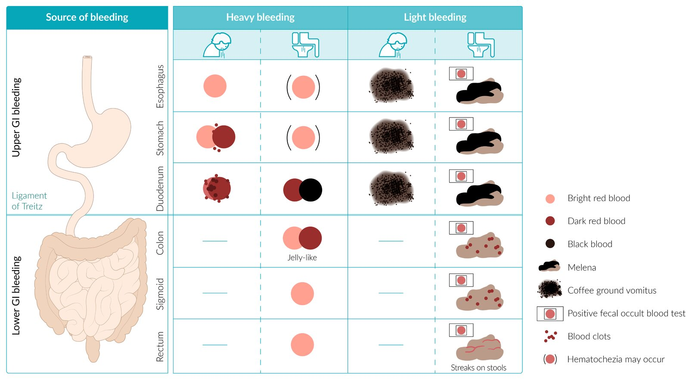
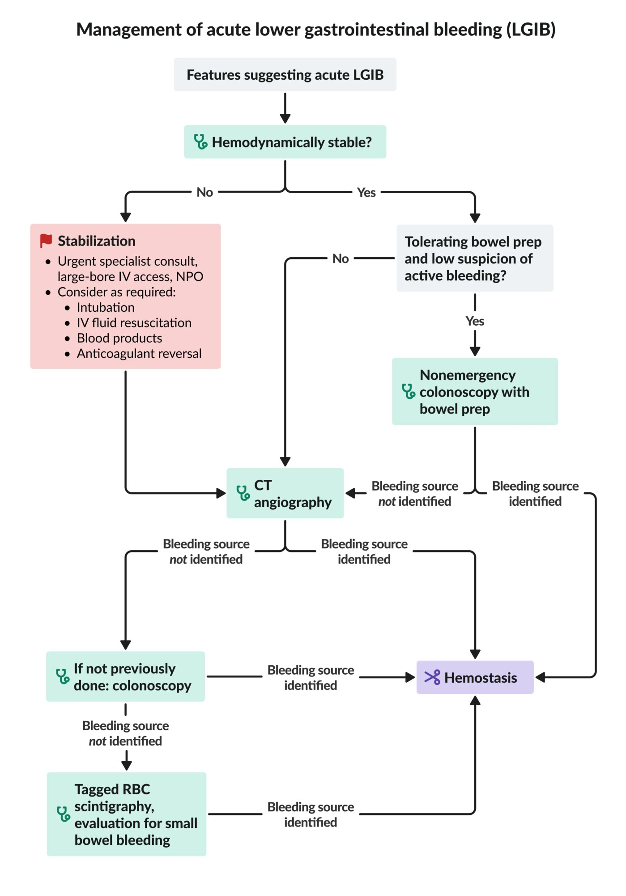
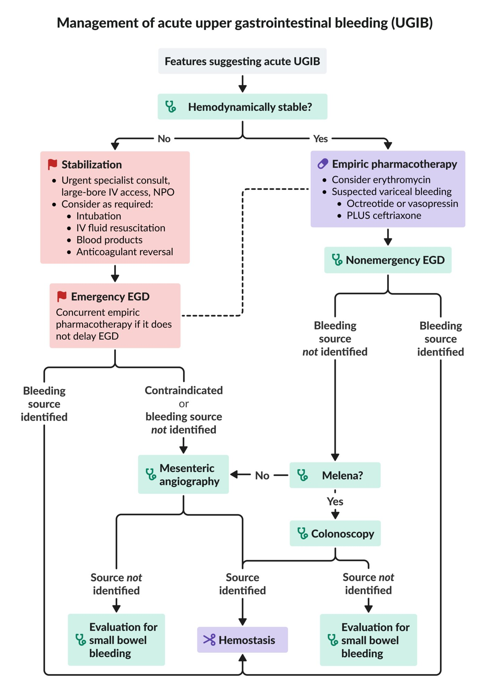
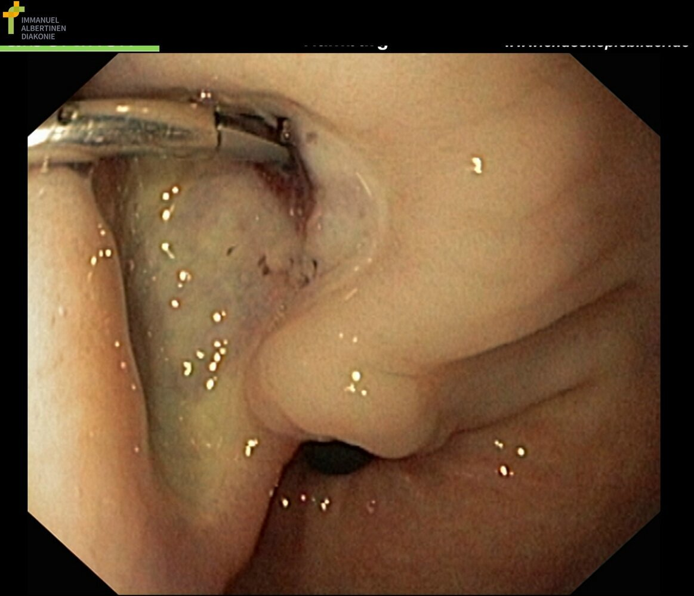

# Gastrointestinal bleeding

*Categories: Clinical knowledge > Emergency medicine > Gastrointestinal disorders > Gastrointestinal bleeding*

[Original Article Link](https://coursology-qbank.com/amboss/article/ZS0Zy2)

---

## Summary

Gastrointestinal (GI) bleeding can originate from the upper <u>GI tract</u> (<u>proximal</u> to the <u>ligament of Treitz</u>), <u>small bowel</u>, or lower <u>GI tract</u> (<u>distal</u> to the <u>ileocecal valve</u>). <u>Overt GI bleeding</u> is visible in the form of <u>hematemesis</u>, <u>melena</u>, and/or <u>hematochezia</u>, whereas <u>occult GI bleeding</u> typically manifests with nonspecific symptoms due to <u>iron deficiency anemia</u>. Common causes include <u>esophageal variceal hemorrhage</u>, <u>bleeding peptic ulcer</u>, <u>diverticular bleeding</u>, <u>hemorrhoids</u>, and <u>malignancy</u>. <u>Esophagogastroduodenoscopy</u> (<u>EGD</u>) and/or <u>colonoscopy</u> are the preferred initial tests for stable patients with suspected GI bleeding. <u>Initial management of overt GI bleeding</u> focuses on <u>hemodynamic resuscitation</u>, and, if feasible, endoscopic identification of the source, followed by measures to control bleeding (endoscopically, surgically, or via <u>angioembolization</u>). <u>Sigmoidoscopy</u> is the appropriate initial investigation in patients aged < 40 years with <u>intermittent scant hematochezia</u> and no features of underlying <u>malignancy</u> or <u>inflammatory bowel disease</u> (<u>IBD</u>).

---

## Definitions

* Upper gastrointestinal bleeding (<u>UGIB</u>): gastrointestinal <u>bleeding from the esophagus</u>, <u>stomach</u>, or <u>duodenum</u> (<u>proximal</u> to the <u>ligament of Treitz</u>) [[1]](https://coursology-qbank.com/amboss/article/6Z1jc20)

* Lower gastrointestinal bleeding (<u>LGIB</u>): gastrointestinal bleeding from the <u>colon</u> or <u>rectum</u> [[2]](https://coursology-qbank.com/amboss/article/hMWcoN0)

* Small bowel bleeding: GI bleeding from a source between the <u>ligament of Treitz</u> and the <u>ileocecal valve</u> [[1]](https://coursology-qbank.com/amboss/article/6Z1jc20)

* Overt GI bleeding: GI bleeding that is visible in the form of <u>hematemesis</u>, <u>melena</u>, or <u>hematochezia</u> (including <u>intermittent scant hematochezia</u>) [[1]](https://coursology-qbank.com/amboss/article/6Z1jc20)

* Obscure gastrointestinal bleeding: <u>Overt GI bleeding</u> from an undetermined source that persists or recurs after a negative diagnostic evaluation

---

## Epidemiology

* <u>UGIB</u>: ∼ 70–80% of all GI hemorrhages [[3]](https://coursology-qbank.com/amboss/article/FqYgZq)

* <u>LGIB</u>: ∼ 20–30% of all GI hemorrhages [[4]](https://coursology-qbank.com/amboss/article/tqYXZq)

* <u>Small bowel bleeding</u>: ∼ 5–10 % of all patients presenting with GI bleeding [[5]](https://coursology-qbank.com/amboss/article/FybgSw)

Epidemiological data refers to the US, unless otherwise specified.

---

## Etiology

### <u>Common causes of GI bleeding</u>

| Common causes of GI bleeding |  |  |
| --- | --- | --- |
|  |  Causes of <u>UGIB</u> [[6]](https://coursology-qbank.com/amboss/article/nMW76N0)[[7]](https://coursology-qbank.com/amboss/article/OybI2w)  |  Causes of <u>LGIB</u> [[2]](https://coursology-qbank.com/amboss/article/hMWcoN0)[[8]](https://coursology-qbank.com/amboss/article/sz0t8i)[[9]](https://coursology-qbank.com/amboss/article/3MWSoN0)  |
| Erosive or inflammatory |   * <u>Peptic ulcer disease</u> (20-50% of cases) [[7]](https://coursology-qbank.com/amboss/article/OybI2w)  * <u>Esophagitis</u>  * <u>Erosive gastritis</u> and/or <u>duodenitis</u>    |   * <u>Diverticular bleeding</u> (up to 65% of cases) [[2]](https://coursology-qbank.com/amboss/article/hMWcoN0)[[8]](https://coursology-qbank.com/amboss/article/sz0t8i)  * <u>Colitis</u>  * Inflammatory <u>colitis</u> caused by <u>ulcerative colitis</u> or <u>Crohn disease</u>  * <u>Infectious colitis</u>, e.g., caused by <u>Shigella</u> or <u>EHEC</u>  * <u>Radiation colitis</u>  * <u>Proctitis</u>  * <u>Ulcers</u>, e.g., rectal <u>ulcers</u>, <u>stercoral ulcers</u>    |
| Vascular |   * <u>Varices</u>, e.g., <u>gastric varices</u> or <u>esophageal varices</u>  * <u>Gastric antral vascular ectasia</u>  * <u>Dieulafoy lesion</u>: abnormally dilated <u>submucosal</u> <u>artery</u> in the <u>GI tract</u> (usually <u>proximal</u> <u>stomach</u>) which can bleed profusely in response to minor trauma  * Angioma  * <u>Telangiectasias</u>    |   * <u>Hemorrhoids</u>  * <u>Intestinal ischemia</u> (<u>ischemic colitis</u>, late stages of <u>acute mesenteric ischemia</u>)  * <u>Arteriovenous malformation</u>  * Colorectal <u>varices</u>    |
|  * <u>Angiodysplasia</u>   |  |  |
| Tumors |   * <u>Esophageal cancer</u>  * <u>Gastric cancer</u>    |   * <u>Colorectal cancer</u>  * <u>Anal cancer</u>  * <u>Colonic polyps</u>    |
| Traumatic or <u>iatrogenic</u> |   * <u>Mallory-Weiss syndrome</u>  * <u>Hiatal hernias</u>  * <u>Boerhaave syndrome</u>  * <u>Foreign body ingestion</u>    |   * Lower abdominal trauma  * Anorectal trauma (e.g., anorectal <u>avulsion injury</u>, impalement injury)    |
|  * Following open or endoscopic <u>surgery</u> (e.g., anastomotic bleeding following a <u>gastric bypass</u>, <u>hemobilia</u>, <u>aortoenteric fistula</u>)   |  |  |
| Other causes |  * <u>Portal hypertensive gastropathy</u>   |   * <u>Anal fissures</u>  * <u>Meckel diverticulum</u>  * <u>Etiology of lower GI bleeding in children</u>    |
|  * Coagulopathies   |  |  |

### <u>Risk factors</u> for GI bleeding [[2]](https://coursology-qbank.com/amboss/article/hMWcoN0)[[6]](https://coursology-qbank.com/amboss/article/nMW76N0)

* Any GI bleeding

* <u>NSAID</u> use

* Antithrombotic use, e.g., <u>antiplatelet therapy</u>, <u>anticoagulants</u>

* History of prior GI bleeding

* Older age

* <u>Upper GI bleeding</u>

* <u>H. pylori</u> infection

* <u>Renal failure</u>, especially in the first year of <u>hemodialysis</u>

---

## Clinical features

### Features of overt GI bleeding [[10]](https://coursology-qbank.com/amboss/article/NsW-E50)

* Hematemesis: <u>vomiting</u> blood, which can vary in color from bright red to brown and may resemble coffee grounds, depending on the cause 

* Most commonly caused by <u>UGIB</u>

* Less commonly caused by bleeding from the <u>upper respiratory tract</u>, e.g., brisk <u>epistaxis</u>

* Melena: black, tarry stool with a strong offensive odor 

* Most commonly caused by <u>UGIB</u>

* Less commonly caused by bleeding from the <u>small bowel</u> or the <u>proximal</u> <u>colon</u>

* Hematochezia: passage of blood through the <u>anus</u> with or without stool

* Most commonly caused by <u>LGIB</u> 

* Maroon, jellylike traces of blood in stool indicate <u>colonic</u> bleeding.

* Streaks of fresh blood on stool indicate <u>rectal bleeding</u>.

* Less commonly caused by severe <u>UGIB</u>

> [!TIP]
> <u>Melena</u> and <u>hematochezia</u> can be caused by <u>UGIB</u>, <u>small bowel bleeding</u>, and <u>LGIB</u>. [[2]](https://coursology-qbank.com/amboss/article/hMWcoN0)

Gastrointestinal bleeding

### Accompanying signs and symptoms

* Signs of acute, severe bleeding

* <u>Clinical features of shock</u>

* <u>Tachycardia</u>

* <u>Hypotension</u>

* <u>Altered mental status</u>

* <u>Syncope</u>

* <u>Clinical features of anemia</u>

* Features of the underlying cause of GI bleed [[2]](https://coursology-qbank.com/amboss/article/hMWcoN0)

* <u>Signs of cirrhosis</u>

* Abdominal <u>pain</u>, nausea and/or <u>vomiting</u>

* <u>Unintentional weight loss</u>

* <u>Constipation</u> and/or painful defecation [[11]](https://coursology-qbank.com/amboss/article/AN1Rdh0)

> [!TIP]
> Unexplained <u>iron deficiency anemia</u> (especially in men or <u>postmenopausal</u> patients) should raise suspicion for GI bleeding.

---

## Initial evaluation

For severe GI bleeding, perform initial evaluation concurrently with stabilization and <u>initial management of overt GI bleeding</u>.

### Clinical evaluation

* Focused <u>medical history</u>

* Current symptoms, including <u>features of overt GI bleeding</u> and accompanying symptoms [[2]](https://coursology-qbank.com/amboss/article/hMWcoN0)

* History of GI bleeding

* History of GI <u>surgery</u> or recent endoscopic procedure

* History of associated conditions, e.g., <u>cirrhosis</u> [[2]](https://coursology-qbank.com/amboss/article/hMWcoN0)

* <u>Risk factors for PUD</u>

* Medication history, e.g., <u>NSAIDs</u>, <u>antithrombotic agents</u>, <u>beta blockers</u>  [[2]](https://coursology-qbank.com/amboss/article/hMWcoN0)[[10]](https://coursology-qbank.com/amboss/article/NsW-E50)

* Focused <u>physical examination</u>

* <u>Vital signs</u> to assess for <u>massive hemorrhage</u> [[2]](https://coursology-qbank.com/amboss/article/hMWcoN0)[[10]](https://coursology-qbank.com/amboss/article/NsW-E50)

* Resting <u>SBP</u> ≤ 90 mm Hg and/or HR ≥ 120/min [[10]](https://coursology-qbank.com/amboss/article/NsW-E50)

* <u>Orthostatic hypotension</u> [[10]](https://coursology-qbank.com/amboss/article/NsW-E50)

* <u>Abdominal examination</u>, including <u>DRE</u> to assess for: [[2]](https://coursology-qbank.com/amboss/article/hMWcoN0)[[9]](https://coursology-qbank.com/amboss/article/3MWSoN0)[[11]](https://coursology-qbank.com/amboss/article/AN1Rdh0)

* <u>Melena</u>, <u>hematochezia</u>

* <u>Hemorrhoids</u>, <u>anal fissures</u>, anal masses

* Evaluation for <u>signs of hypovolemia</u> [[2]](https://coursology-qbank.com/amboss/article/hMWcoN0)

* Evaluation for <u>signs of portal hypertension</u> [[11]](https://coursology-qbank.com/amboss/article/AN1Rdh0)

* <u>ECG</u>: Obtain in patients aged > 35 years with suspected or confirmed <u>UGIB</u> to assess for concomitant <u>acute coronary syndrome</u>. [[11]](https://coursology-qbank.com/amboss/article/AN1Rdh0)

### <u>Laboratory studies</u> [[9]](https://coursology-qbank.com/amboss/article/3MWSoN0)[[10]](https://coursology-qbank.com/amboss/article/NsW-E50)[[11]](https://coursology-qbank.com/amboss/article/AN1Rdh0)

* <u>CBC</u>

* Normal or ↓ <u>Hb</u> and <u>Hct</u>

* <u>Platelets</u> to assess for <u>thrombocytopenia</u>

* <u>BMP</u>: ↑ <u>BUN/Cr ratio</u> suggests <u>UGIB</u>.  [[10]](https://coursology-qbank.com/amboss/article/NsW-E50)[[12]](https://coursology-qbank.com/amboss/article/msWVv50)[[13]](https://coursology-qbank.com/amboss/article/5sWiv50)

* <u>Lactate</u>: Initial levels > 2.5 mmol/L are associated with adverse outcomes. [[11]](https://coursology-qbank.com/amboss/article/AN1Rdh0)

* <u>Albumin</u>  [[9]](https://coursology-qbank.com/amboss/article/3MWSoN0)

* <u>Coagulation panel</u>

* <u>Pretransfusion testing</u>: <u>type and screen</u>, <u>crossmatching</u>

> [!TIP]
> An elevated <u>BUN/creatinine ratio</u> in a patient with <u>hematochezia</u> suggests severe <u>UGIB</u>. [[14]](https://coursology-qbank.com/amboss/article/Gz0B8i)[[15]](https://coursology-qbank.com/amboss/article/icXJXC)

> [!WARNING]
> Do not delay initial management for diagnostic testing in unstable patients.

Management of acute lower gastrointestinal bleeding

Management of acute upper gastrointestinal bleeding

---

## Initial management

### Approach

* <u>Obtain intravenous access</u> for possible <u>fluid resuscitation</u> and <u>blood transfusion</u>.

* Insert two large-bore <u>peripheral IV</u> catheters.

* Consider a <u>central line</u> if reliable large-bore <u>peripheral venous access</u> is not possible.

* Order <u>NPO</u> status.

* Start initial management based on hemodynamic stability, and treatment of the underlying cause, if known.

* Manage antithrombotic medications on a case-by-case basis.

* Consider <u>empiric pharmacotherapeutic treatment for UGIB</u>.

### Unstable patients

* Follow an <u>ABCDE approach</u>.

* Consider <u>intubation</u> to protect the <u>airway</u> (e.g., in patients with <u>altered mental state</u> or severe ongoing <u>hematemesis</u>); see “<u>High-risk conditions for intubation</u>.” [[10]](https://coursology-qbank.com/amboss/article/NsW-E50)

* Start <u>immediate hemodynamic support</u> and <u>management of hemorrhagic shock</u>.

* <u>IV fluid resuscitation</u> with <u>crystalloids</u> [[8]](https://coursology-qbank.com/amboss/article/sz0t8i)

* <u>Blood transfusion</u>

* Exceptions to restrictive <u>transfusion</u> strategy may be made in patients with <u>hypotension</u>. [[1]](https://coursology-qbank.com/amboss/article/6Z1jc20)[[16]](https://coursology-qbank.com/amboss/article/mYdVpo0)

* <u>Massive transfusion</u> may be considered in patients with massive blood loss.  [[1]](https://coursology-qbank.com/amboss/article/6Z1jc20)[[16]](https://coursology-qbank.com/amboss/article/mYdVpo0)

* Consider <u>anticoagulation reversal</u>.

* Urgently consult gastroenterology, <u>surgery</u>, and/or interventional radiology for patients with ongoing bleeding and refractory <u>hemodynamic instability</u>.

> [!WARNING]
> Exercise caution with volume resuscitation in the absence of massive ongoing bleeding or <u>hemorrhagic shock</u>, especially if the source of hemorrhage is inadequately controlled. Aggressive administration of <u>crystalloids</u> and <u>blood products</u> can increase the risk of rebleeding and <u>death</u>. [[14]](https://coursology-qbank.com/amboss/article/Gz0B8i)[[17]](https://coursology-qbank.com/amboss/article/lybv2w)

### Stable patients

* Perform a <u>risk assessment in GI bleeding</u> to guide further disposition and management.

* Follow a restrictive <u>transfusion</u> strategy. [[9]](https://coursology-qbank.com/amboss/article/3MWSoN0)

* <u>Packed red blood cell transfusion</u> if < 7 g/dL  [[1]](https://coursology-qbank.com/amboss/article/6Z1jc20)[[2]](https://coursology-qbank.com/amboss/article/hMWcoN0)[[18]](https://coursology-qbank.com/amboss/article/tybXSw)

* A higher threshold (e.g., < 8 g/dL) may be considered in patients with preexisting cardiovascular disease or delays in endoscopy. [[1]](https://coursology-qbank.com/amboss/article/6Z1jc20)[[9]](https://coursology-qbank.com/amboss/article/3MWSoN0)[[18]](https://coursology-qbank.com/amboss/article/tybXSw)

### Patients taking <u>antithrombotic agents</u> [[2]](https://coursology-qbank.com/amboss/article/hMWcoN0)[[19]](https://coursology-qbank.com/amboss/article/oKX0h_)[[20]](https://coursology-qbank.com/amboss/article/Ez18uj0)

High-quality evidence to guide <u>antithrombotic therapy</u> in GI bleeding is lacking. Follow local protocols where available.

#### <u>Oral anticoagulants</u>

* Withhold <u>oral anticoagulants</u> in patients hospitalized with significant bleeding.  [[2]](https://coursology-qbank.com/amboss/article/hMWcoN0)

* Consider <u>anticoagulant reversal</u> based on hemodynamic stability, bleeding severity, laboratory findings, e.g., <u>INR</u>. [[2]](https://coursology-qbank.com/amboss/article/hMWcoN0)

* <u>Vitamin K antagonists</u>: Consider reversal with <u>PCC</u> for life-threatening GI bleeding with <u>INR</u> significantly above the therapeutic range or if <u>massive blood transfusion</u> is not feasible.  [[2]](https://coursology-qbank.com/amboss/article/hMWcoN0)[[20]](https://coursology-qbank.com/amboss/article/Ez18uj0)

* <u>DOACs</u>: Consider targeted <u>DOAC reversal</u> for life-threatening GI bleeding and refractory <u>hemodynamic instability</u> if <u>DOAC</u> was taken within 24 hours. [[2]](https://coursology-qbank.com/amboss/article/hMWcoN0)[[20]](https://coursology-qbank.com/amboss/article/Ez18uj0)

* Resume <u>anticoagulants</u> after cessation of <u>LGIB</u>. [[2]](https://coursology-qbank.com/amboss/article/hMWcoN0)

> [!TIP]
> Most patients with <u>LGIB</u> on <u>oral anticoagulants</u> will not require reversal. [[2]](https://coursology-qbank.com/amboss/article/hMWcoN0)

> [!WARNING]
> Do not delay endoscopy in patients with moderately elevated INRs (e.g., ≤ 2.5). [[2]](https://coursology-qbank.com/amboss/article/hMWcoN0)

#### <u>Antiplatelet agents</u> [[2]](https://coursology-qbank.com/amboss/article/hMWcoN0)[[20]](https://coursology-qbank.com/amboss/article/Ez18uj0)

* Review the indications for therapy with a specialist before withholding <u>antiplatelet agents</u>.  [[2]](https://coursology-qbank.com/amboss/article/hMWcoN0)

* <u>Aspirin</u>

* <u>Primary prevention of ASCVD</u>: Withhold and consider permanently stopping.

* Patients with <u>ASCVD</u>: Continue if possible; resume within 24 hours of <u>endoscopic hemostasis</u> if <u>aspirin</u> has been withheld. [[20]](https://coursology-qbank.com/amboss/article/Ez18uj0)

* Nonaspirin <u>antiplatelet agents</u>

* Withhold during hospitalization if possible.

* Individualize approach for patients who underwent cardiovascular <u>stenting</u> within the last year.

* Transfuse <u>platelets</u> only in patients with severe <u>thrombocytopenia</u> (threshold of < 30,000/mm³ or < 50,000/mm³ if <u>endoscopic hemostasis</u> is planned) or those with other <u>indications for platelet transfusions</u> (e.g., <u>massive transfusion</u>). [[20]](https://coursology-qbank.com/amboss/article/Ez18uj0)

### Empiric pharmacotherapeutic treatment for UGIB

* Prior to <u>EGD</u>:

* Consider <u>erythromycin</u>;  (<u>off-label</u>) DOSAGE to improve visualization during <u>EGD</u>.   [[1]](https://coursology-qbank.com/amboss/article/6Z1jc20)[[7]](https://coursology-qbank.com/amboss/article/OybI2w)

* The benefit of preprocedural <u>PPIs</u> is unclear.  [[1]](https://coursology-qbank.com/amboss/article/6Z1jc20)[[7]](https://coursology-qbank.com/amboss/article/OybI2w)[[18]](https://coursology-qbank.com/amboss/article/tybXSw)

* If <u>esophageal variceal bleeding</u> is suspected:

* Start vasoactive therapy with <u>octreotide</u>;  (<u>off-label</u>) DOSAGE or <u>vasopressin</u>. [[17]](https://coursology-qbank.com/amboss/article/lybv2w)

* Start <u>antibiotic prophylaxis</u> with <u>ceftriaxone</u>;  (<u>off-label</u>) DOSAGE. [[21]](https://coursology-qbank.com/amboss/article/Nkb-LF)

* See “<u>Management of esophageal variceal hemorrhage</u>” for further details.

> [!WARNING]
> Do not delay hemostatic interventions and definitive diagnosis for pharmacological treatment.

---

## Diagnosis

### Diagnostic approach to overt GI bleeding

Perform an <u>initial evaluation of GI bleeding</u> to determine the likelihood of <u>UGIB</u> vs. <u>LGIB</u>.

| <u>UGIB</u> vs. <u>LGIB</u> |  |  |
| --- | --- | --- |
|  |  Features that suggest <u>UGIB</u> [[7]](https://coursology-qbank.com/amboss/article/OybI2w)[[10]](https://coursology-qbank.com/amboss/article/NsW-E50)  |  Features that suggest <u>LGIB</u> [[2]](https://coursology-qbank.com/amboss/article/hMWcoN0)  |
| Clinical features |   * <u>Hematemesis</u>  * <u>Melena</u>  [[2]](https://coursology-qbank.com/amboss/article/hMWcoN0)  * <u>Hematochezia</u> in a patient with either:  * <u>Hemodynamic instability</u>  * Elevated <u>BUN/Cr ratio</u> (e.g., > 25:1) or high <u>BUN</u> level  [[10]](https://coursology-qbank.com/amboss/article/NsW-E50)    |   * <u>Hematochezia</u>  * Presence of blood clots in patients with <u>hematochezia</u> [[2]](https://coursology-qbank.com/amboss/article/hMWcoN0)    |
| <u>Medical history</u> |   * History of <u>UGIB</u>  * Known potential source of <u>UGIB</u>, e.g.:  * History of <u>PUD</u>  * <u>Hepatic cirrhosis</u>, <u>portal hypertension</u>    |   * History of <u>LGIB</u>  * Known potential source of <u>LGIB</u>, e.g.:  * <u>Diverticulosis</u>  * <u>Colonic</u> <u>angiodysplasia</u>  * Recent polypectomy    |

#### Approach to suspected <u>UGIB</u>  [[7]](https://coursology-qbank.com/amboss/article/OybI2w)[[17]](https://coursology-qbank.com/amboss/article/lybv2w)

* <u>Hemodynamically unstable</u>

* Initial study: <u>EGD</u>

* Consider <u>mesenteric</u> <u>angiography</u> if <u>EGD</u> is not possible or nondiagnostic. [[22]](https://coursology-qbank.com/amboss/article/PbXWF9)[[23]](https://coursology-qbank.com/amboss/article/6dXjIC)

* Hemodynamically stable

* Initial study: <u>EGD</u> [[8]](https://coursology-qbank.com/amboss/article/sz0t8i)

* If <u>EGD</u> is nondiagnostic, consider one of the following:

* <u>Colonoscopy</u> after <u>bowel prep</u> in patients with <u>melena</u> [[8]](https://coursology-qbank.com/amboss/article/sz0t8i)

* <u>CTA</u> [[24]](https://coursology-qbank.com/amboss/article/AWdRLK0)

* If the workup remains negative, consider <u>evaluation for small bowel bleeding</u>.   [[22]](https://coursology-qbank.com/amboss/article/PbXWF9)

> [!TIP]
> If suspicion for <u>UGIB</u> is high in a patient with <u>hematochezia</u> and <u>hemodynamic instability</u>, <u>EGD</u> is the preferred initial study to rule out a brisk <u>proximal</u> source of bleeding. [[2]](https://coursology-qbank.com/amboss/article/hMWcoN0)

Management of acute upper gastrointestinal bleeding

#### Approach to suspected <u>LGIB</u>  [[2]](https://coursology-qbank.com/amboss/article/hMWcoN0)[[9]](https://coursology-qbank.com/amboss/article/3MWSoN0)

* <u>Hemodynamically unstable</u>

* Initial study: <u>CTA</u> [[2]](https://coursology-qbank.com/amboss/article/hMWcoN0)[[9]](https://coursology-qbank.com/amboss/article/3MWSoN0)[[24]](https://coursology-qbank.com/amboss/article/AWdRLK0)

* If <u>CTA</u> identifies the source of bleeding, proceed to either:

* <u>Catheter angiography</u> with <u>angioembolization</u>

* <u>Colonoscopy</u> to attempt <u>endoscopic hemostasis</u> [[2]](https://coursology-qbank.com/amboss/article/hMWcoN0)

* Hemodynamically stable

* Initial study: nonemergency <u>colonoscopy</u> after <u>bowel preparation</u>  [[2]](https://coursology-qbank.com/amboss/article/hMWcoN0)[[9]](https://coursology-qbank.com/amboss/article/3MWSoN0)

* Consider <u>CTA</u> for patients who cannot tolerate <u>bowel preparation</u> or if there is high suspicion for active bleeding. [[24]](https://coursology-qbank.com/amboss/article/AWdRLK0)

* <u>Tagged-RBC scintigraphy</u> may be ordered for patients with ongoing <u>LGIB</u> that can not be localized with <u>colonoscopy</u> and <u>CTA</u>. [[24]](https://coursology-qbank.com/amboss/article/AWdRLK0)

* If the workup remains negative, consider <u>evaluation for small bowel bleeding</u>.

Management of acute lower gastrointestinal bleeding

#### Approach to suspected small bowel bleeding [[5]](https://coursology-qbank.com/amboss/article/FybgSw)[[22]](https://coursology-qbank.com/amboss/article/PbXWF9)

Evaluate for <u>small bowel bleeding</u> in patients with <u>obscure GI bleeding</u>.

* Repeat endoscopy first.

* If not already done, obtain <u>CTA</u> in <u>hemodynamically unstable</u> patients. [[22]](https://coursology-qbank.com/amboss/article/PbXWF9)[[24]](https://coursology-qbank.com/amboss/article/AWdRLK0)

* <u>Video capsule endoscopy</u> is preferred in hemodynamically stable patients with negative <u>EGD</u> and <u>colonoscopy</u>. [[22]](https://coursology-qbank.com/amboss/article/PbXWF9)

* Consider further investigations as necessary, e.g.:

* Advanced endoscopic evaluation: <u>push enteroscopy</u>, <u>double balloon enteroscopy</u>

* Radiographic evaluation: <u>CT enterography</u>, <u>tagged RBC scintigraphy</u>, <u>Meckel scan</u>

### Endoscopy

Endoscopic procedures (e.g., <u>EGD</u> and <u>colonoscopy</u>) allow for bleeding source identification, diagnostic <u>biopsies</u>, and/or <u>endoscopic hemostasis</u>.

#### <u>EGD</u> [[1]](https://coursology-qbank.com/amboss/article/6Z1jc20)[[7]](https://coursology-qbank.com/amboss/article/OybI2w)[[17]](https://coursology-qbank.com/amboss/article/lybv2w)

* Timing

* Most patients: within 24 hours of presentation [[1]](https://coursology-qbank.com/amboss/article/6Z1jc20)[[7]](https://coursology-qbank.com/amboss/article/OybI2w)

* Suspected <u>esophageal variceal bleeding</u>: within 12 hours of presentation [[17]](https://coursology-qbank.com/amboss/article/lybv2w)

* Preparation

* Consider <u>intubation</u> prior to endoscopy if there is a high risk of <u>aspiration</u>. [[17]](https://coursology-qbank.com/amboss/article/lybv2w)

* Consider <u>erythromycin</u> (<u>off-label</u>) DOSAGE to improve visualization. [[1]](https://coursology-qbank.com/amboss/article/6Z1jc20)

* Further management: If there are signs of active bleeding or recent hemorrhage, proceed to <u>endoscopic hemostasis</u>.

Duodenal ulcer: Forrest stage Ia

Angiodysplasia

#### Colonoscopy for gastrointestinal bleeding [[2]](https://coursology-qbank.com/amboss/article/hMWcoN0)[[8]](https://coursology-qbank.com/amboss/article/sz0t8i)

* Timing

* Most patients: at the next available opportunity after <u>bowel preparation</u> (nonemergency)  [[2]](https://coursology-qbank.com/amboss/article/hMWcoN0)[[9]](https://coursology-qbank.com/amboss/article/3MWSoN0)

* Urgent <u>colonoscopy</u> within 24 hours of presentation may be considered in patients who are very likely to require <u>endoscopic hemostasis</u>, e.g., those with:

* Active source of bleeding already confirmed on <u>CTA</u> [[2]](https://coursology-qbank.com/amboss/article/hMWcoN0)

* <u>Postpolypectomy bleeding</u> [[2]](https://coursology-qbank.com/amboss/article/hMWcoN0)

* Preparation: Follow local <u>bowel preparation</u> protocols where available.

* Consider <u>rapid bowel preparation</u> with a <u>polyethylene glycol</u>-based solution for patients undergoing urgent <u>colonoscopy</u>.  [[2]](https://coursology-qbank.com/amboss/article/hMWcoN0)

* Standard <u>bowel preparation</u> strategies, e.g., split-dose or low-dose <u>bowel preparation</u>, are appropriate for most patients. [[2]](https://coursology-qbank.com/amboss/article/hMWcoN0)

* Further management: If active bleeding or stigmata of recent hemorrhage are identified, proceed to <u>endoscopic hemostasis</u>. [[2]](https://coursology-qbank.com/amboss/article/hMWcoN0)

> [!WARNING]
> <u>Colonoscopy</u> without <u>bowel preparation</u> is not recommended. <u>Sigmoidoscopy</u> is only an option if the source is known to be in the <u>distal</u> <u>colon</u> or rectal area. [[2]](https://coursology-qbank.com/amboss/article/hMWcoN0)

### Mesenteric angiography in gastrointestinal bleeding [[23]](https://coursology-qbank.com/amboss/article/6dXjIC)[[25]](https://coursology-qbank.com/amboss/article/odX0IC)

* Indications

* Consider as initial test for:

* Suspected active <u>LGIB</u> in <u>hemodynamically unstable</u> patients [[2]](https://coursology-qbank.com/amboss/article/hMWcoN0)[[8]](https://coursology-qbank.com/amboss/article/sz0t8i)

* Suspected active <u>UGIB</u> if endoscopy is contraindicated  [[25]](https://coursology-qbank.com/amboss/article/odX0IC)

* Further workup of ongoing GI bleeding and negative endoscopy  [[22]](https://coursology-qbank.com/amboss/article/PbXWF9)[[25]](https://coursology-qbank.com/amboss/article/odX0IC)

* Modalities

* <u>CT angiography</u> (<u>CTA</u>): allows for rapid source localization to help target hemostatic interventions

* <u>Catheter angiography</u>: dual diagnostic and therapeutic procedure when combined with <u>angioembolization</u>

### <u>Nasogastric aspiration</u>

* Not routinely recommended

* Previously used to assess for <u>UGIB</u> in patients with <u>hematochezia</u> and a moderate <u>pretest probability</u> for <u>UGIB</u>

---

## Hemostatic control

### Endoscopic hemostasis [[2]](https://coursology-qbank.com/amboss/article/hMWcoN0)[[7]](https://coursology-qbank.com/amboss/article/OybI2w)

* Indication: : preferred intervention for most patients with ongoing bleeding or signs of recent bleeding on endoscopy, e.g., <u>ulcer</u> with high-risk stigmata, <u>angiodysplasia</u>

* Techniques

* Thermal coagulation (e.g., electrocauterization, argon plasma coagulation)

* Clip placement

* <u>Band ligation</u>

* Injection with <u>epinephrine</u> solution

* Topical sealants (e.g., hemostatic spray or powder)

* Polypectomy in case of bleeding polyp

### Interventional radiology (<u>catheter angiography</u>) [[8]](https://coursology-qbank.com/amboss/article/sz0t8i)[[18]](https://coursology-qbank.com/amboss/article/tybXSw)[[25]](https://coursology-qbank.com/amboss/article/odX0IC)

* Indications

* Ongoing severe <u>LGIB</u> in patients with <u>hemodynamic instability</u> refractory to resuscitation [[8]](https://coursology-qbank.com/amboss/article/sz0t8i)

* Identification of an arterial source of <u>UGIB</u> on endoscopy [[25]](https://coursology-qbank.com/amboss/article/odX0IC)

* Consider in patients with rebleeding or ongoing bleeding despite <u>endoscopic hemostasis</u>  [[8]](https://coursology-qbank.com/amboss/article/sz0t8i)[[23]](https://coursology-qbank.com/amboss/article/6dXjIC)

* Techniques

* <u>Angioembolization</u> (e.g., microcoils, gel foam, polyvinyl <u>alcohol</u> particles): preferred if feasible

* Intraarterial <u>vasopressin</u>: if the source of bleeding is diffuse

### Surgical <u>hemostasis</u> [[8]](https://coursology-qbank.com/amboss/article/sz0t8i)[[18]](https://coursology-qbank.com/amboss/article/tybXSw)[[23]](https://coursology-qbank.com/amboss/article/6dXjIC)

* May be considered in patients with ongoing GI bleeding only in the following scenarios:

* All other therapeutic options have failed.

* Refractory <u>hemodynamic instability</u>

* Techniques

* Surgical ligation of bleeding vessels

* Excision of susceptible <u>mucosa</u>, e.g., <u>Dieulafoy lesion</u>

* Segmental <u>bowel resection</u> [[8]](https://coursology-qbank.com/amboss/article/sz0t8i)

> [!TIP]
> <u>CTA</u> before <u>surgery</u> can help to plan a targeted intervention and reduce perioperative risk. [[2]](https://coursology-qbank.com/amboss/article/hMWcoN0)

Endoscopic hemostasis with clip placement

---

## Differential diagnoses

* Bleeding from the <u>upper respiratory tract</u> (e.g., nocturnal <u>nosebleeds</u>): Blood can be swallowed and vomited or appear in the stool as <u>melena</u>.

* Ingestions that can darken stool and resemble <u>melena</u>, e.g.:

* <u>Iron supplements</u>

* <u>Bismuth</u> preparations

* Certain foods or drinks with red coloring (e.g., licorice, soft drinks)

The differential diagnoses listed here are not exhaustive.

---

## Complications

* <u>Hemorrhagic shock</u>

* <u>Hepatic encephalopathy</u> (in patients with <u>liver cirrhosis</u>)

* <u>Aspiration pneumonia</u>  [[29]](https://coursology-qbank.com/amboss/article/MpYMJJ)[[30]](https://coursology-qbank.com/amboss/article/npY7JJ)

We list the most important complications. The selection is not exhaustive.

---