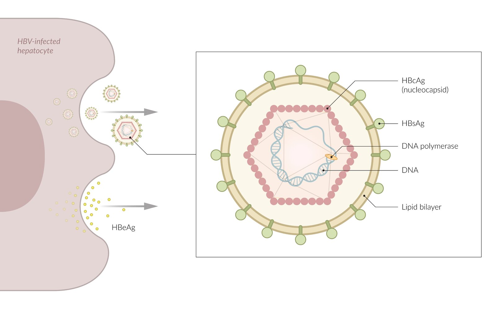
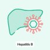
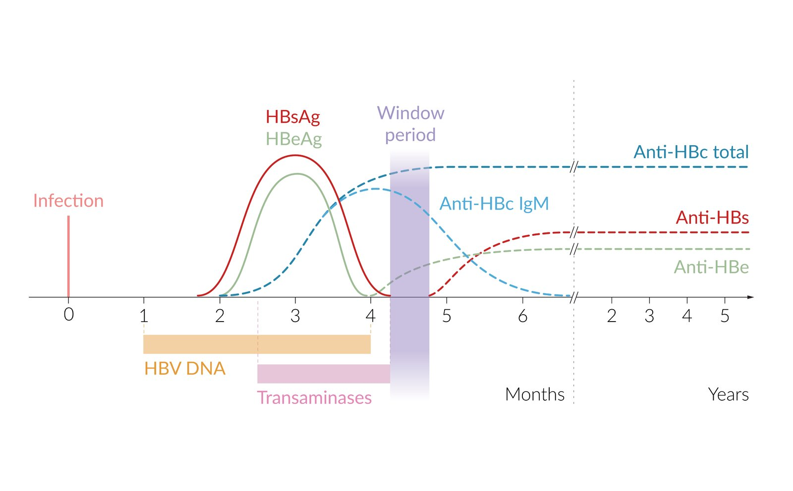
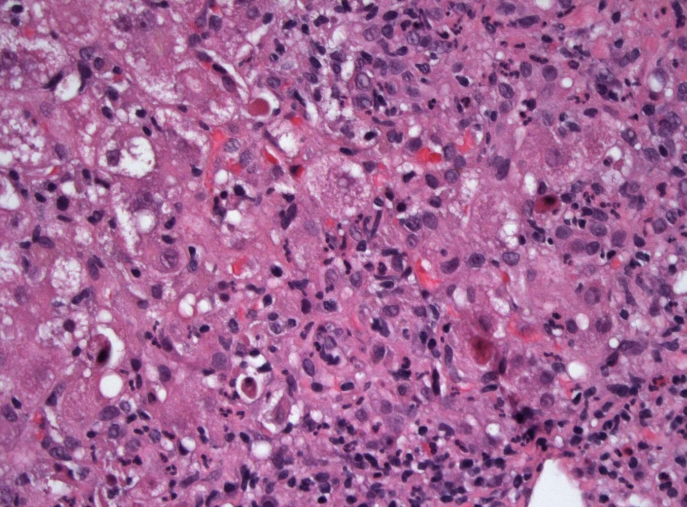
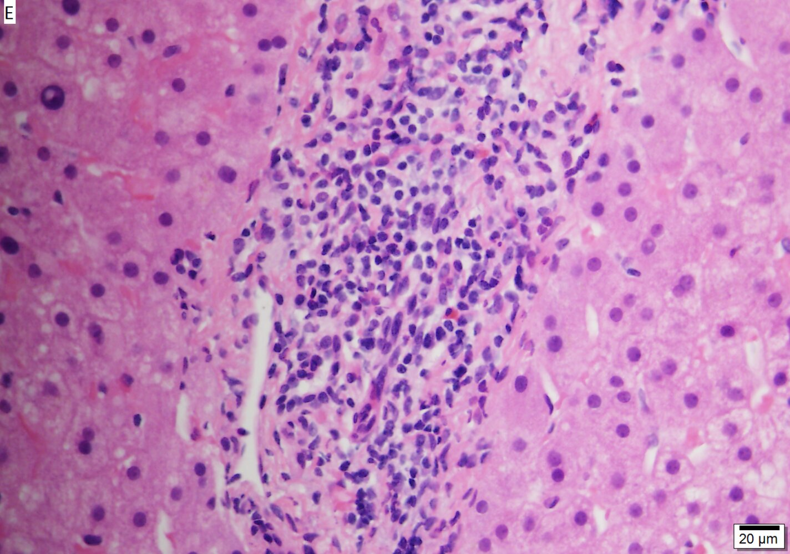
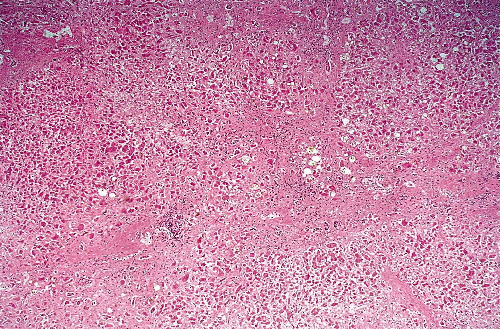
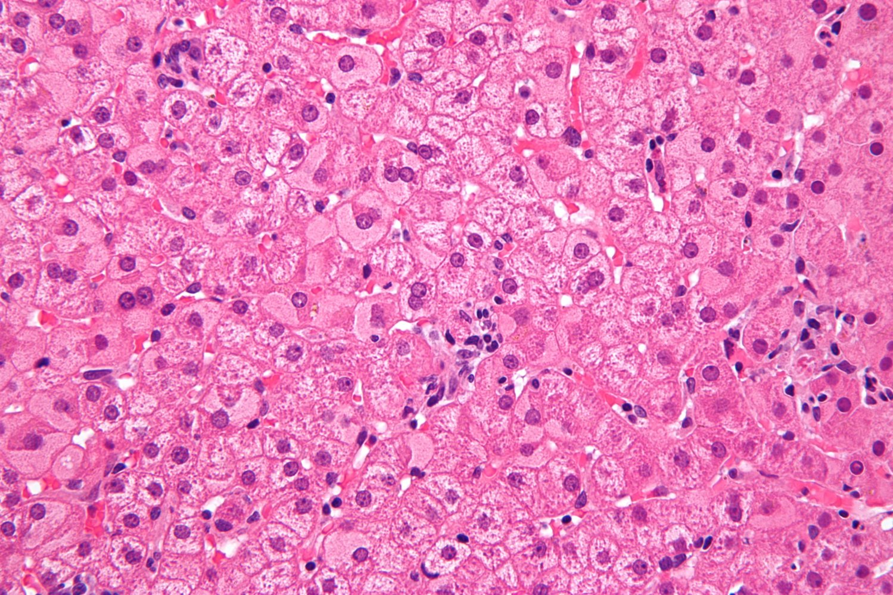
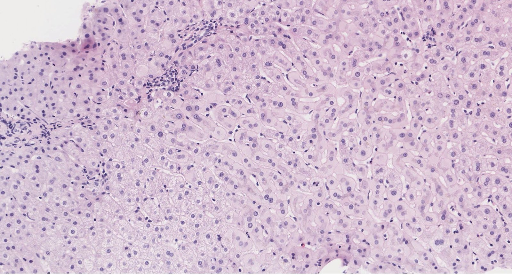

# Hepatitis B

*Categories: Clinical knowledge > Emergency medicine > Gastrointestinal disorders > Hepatitis B*

[Original Article Link](https://coursology-qbank.com/amboss/article/OS0I-2)

---

## Summary

<u>Hepatitis</u> B is a viral infection caused by the <u>hepatitis B virus</u> (<u>HBV</u>). It occurs worldwide and is transmitted sexually, parenterally, or vertically. After an <u>incubation period</u> of 1–6 months, most patients develop asymptomatic or mild inflammation of the <u>liver</u>, which usually resolves spontaneously within a few weeks or months. However, 5% of adult patients and 90% of <u>infants</u> infected <u>perinatally</u> develop chronic <u>hepatitis</u> B (CHB). Individuals with CHB may be asymptomatic carriers or develop ongoing hepatic inflammation with an increased risk of <u>cirrhosis</u> and <u>hepatocellular carcinoma</u>. <u>Serologic testing</u> initially includes measurement of <u>hepatitis</u> B surface <u>antigen</u> (<u>HBsAg</u>), <u>hepatitis</u> B surface <u>antibody</u> (<u>anti-HBs</u>), and <u>hepatitis</u> B core <u>antibody</u> (anti-HBc). A detectable serum anti‑HBs (indicating <u>seroconversion</u>) is a sign of recovery or successful <u>immunization</u>. CHB with persistent <u>liver</u> inflammation is characterized by detectable <u>HBsAg</u> and elevated <u>HBV</u> <u>DNA</u> and <u>ALT</u>. Treatment of acute <u>hepatitis</u> B consists of supportive measures. In patients with <u>fulminant hepatitis</u>, <u>liver transplantation</u> may be necessary. For chronic active <u>hepatitis</u> B, <u>nucleoside</u> or <u>nucleotide analogs</u> (e.g., <u>tenofovir</u>) are the preferred agents for reducing viral replication and <u>infectivity</u>. Prophylactic <u>immunization</u> with a <u>recombinant vaccine</u> is recommended for all age groups. Other preventive measures include <u>postexposure prophylaxis</u> for <u>infants born to individuals with HBsAg positive or unknown status</u> and for unvaccinated individuals with recent exposure to <u>HBV</u>.

See also “<u>Acute liver failure</u>.”

Viral Hepatitis: Comparing Hepatitis A, B, C, D, and E

---

## Etiology

### <u>Virus</u>

* <u>Hepatitis B virus</u> (<u>HBV</u>)

* Member of the <u>Hepadnavirus</u> family

* Circular, partially double-stranded <u>DNA virus</u>

* See “<u>General virology</u>” for more information on <u>viral structure</u>.

### Transmission [[4]](https://coursology-qbank.com/amboss/article/ITaYHP)

Frequency and patterns of transmission vary worldwide.

* Sexual: transmitted when bodily fluids come in contact with broken <u>skin</u> or <u>mucous membranes</u> (mouth, genitals, or <u>rectum</u>)

* Parenteral

* Contaminated needles or instruments (including those for procedures like body piercings, tattoos, and <u>acupuncture</u>) that come into contact with the patient's blood

* <u>Blood transfusions</u> or organ transplants

* <u>Vertical transmission</u> (mother-to-child transmission) [[4]](https://coursology-qbank.com/amboss/article/ITaYHP)

* Common associations

* <u>Hepatitis C virus</u> (<u>HCV</u>) and <u>HIV</u>-positive individuals

* Travelers to regions where <u>HBV</u> is <u>endemic</u> [[5]](https://coursology-qbank.com/amboss/article/lMbvK8)

### Risk factors for HBV infection and groups at risk [[6]](https://coursology-qbank.com/amboss/article/_J15930)[[7]](https://coursology-qbank.com/amboss/article/2cWTb40)[[8]](https://coursology-qbank.com/amboss/article/pvcLae0)

* <u>Vertical transmission</u>

* Individuals born in <u>countries with medium-to-high HBV prevalence</u> (≥ 2%)

* Unvaccinated children born to parents from <u>countries with high HBV prevalence</u> (≥ 8%)

* <u>Infants</u> born to <u>HBsAg</u>-positive individuals

* Parenteral or sexual transmission

* Injection drug use (current or previous)

* History of <u>sexually transmitted infections</u> or multiple sexual partners

* Sex workers

* <u>Men who have sex with men</u>

* Household, sexual, or needle-sharing contacts of individuals with <u>HBV</u> infection

* Current or previously incarcerated individuals

* <u>Health care personnel</u> (e.g., <u>needlestick injury</u>)

* <u>HIV infection</u>

* <u>HCV infection</u> (current or past)

* <u>Chronic liver disease</u>

* <u>End-stage renal disease</u>

* Dialysis

---

## Pathophysiology

### Replication cycle of <u>HBV</u> [[9]](https://coursology-qbank.com/amboss/article/-5bD58)[[10]](https://coursology-qbank.com/amboss/article/ZMbZM8)[[11]](https://coursology-qbank.com/amboss/article/0MbeM8)

<u>HBV</u> carries a <u>DNA polymerase</u> with both <u>DNA</u> and <u>RNA</u>-dependent functions, also known as <u>reverse transcriptase</u> (RT).

1. * After entering the host cell's <u>nucleus</u>, <u>reverse transcriptase</u> completes the <u>positive strand</u> of the <u>virus</u>'s partially double-stranded relaxed circular <u>DNA</u> (rcDNA).
2. * The <u>rcDNA</u> is converted to covalently closed circular DNA (<u>cccDNA</u>) primarily by host enzymes in a process that is not entirely understood.
3. * The <u>cccDNA</u> is then transcribed into viral <u>mRNA</u> by host <u>RNA polymerase</u>.
4. * The viral <u>mRNA</u> leaves the <u>nucleus</u> and is translated into <u>HBV</u> core <u>proteins</u> and new <u>reverse transcriptase</u> in the <u>cytoplasm</u>.
5. * Viral <u>mRNA</u> and <u>reverse transcriptase</u> are packaged into a <u>capsid</u>, where viral <u>mRNA</u> is then reverse-transcribed into viral <u>rcDNA</u>.
6. * New viral <u>DNA</u> genomes are enveloped and leave <u>the cell</u> as progeny <u>virions</u>.

### Acute infection [[12]](https://coursology-qbank.com/amboss/article/GiYBGK)

* In acute infection, the cellular <u>immune response</u> causes damage to <u>hepatocytes</u>.

* <u>Hepatitis</u> B-infected <u>hepatocytes</u> express viral <u>peptides</u> ;   on their surfaces → detection of the <u>HBV</u>-derived <u>peptides</u> by <u>lymphocytes</u> and the subsequent activation of <u>CD8+ T cells</u> that attack the infected <u>hepatocytes</u> → hepatic inflammation with destruction of <u>hepatocytes</u> [[13]](https://coursology-qbank.com/amboss/article/gnbFs8)

### Chronic infection [[14]](https://coursology-qbank.com/amboss/article/tiYXtK)

Caused by viral persistence due to failing immune clearance, which promotes:

* Persistent hepatic inflammation → <u>necrosis</u>, <u>mitosis</u>, and <u>regeneration</u> processes → <u>cirrhosis</u> and cellular <u>dysplasia</u> → <u>hepatocellular carcinoma</u> (<u>HCC</u>)

* Integration of <u>HBV</u> <u>DNA</u> into the host <u>genome</u> → altered expression of <u>endogenous</u> <u>genes</u>, <u>chromosomal</u> instability → <u>HCC</u>

* <u>HBV</u> <u>proteins</u> fulfill numerous immune-modulating functions that allow them to elude detection by the <u>immune system</u> and avoid clearance. [[13]](https://coursology-qbank.com/amboss/article/gnbFs8)

Hepatic microstructure: hepatic lobule

Hepatic microstructure: hepatic lobule showing bile canaliculi

Hepatic microstructure: sinusoids, perisinusoidal space, and hepatocytes

---

## Clinical features

### Acute hepatitis B virus infection

<u>Acute HBV infection</u> is defined as infection acquired in the past 6 months.

* <u>Incubation period</u>: 1–6 months [[4]](https://coursology-qbank.com/amboss/article/ITaYHP)

* Clinical course: varies significantly [[15]](https://coursology-qbank.com/amboss/article/3nbSG8)[[16]](https://coursology-qbank.com/amboss/article/sTatHP)

* <u>Serum sickness-like syndrome</u> can develop during the <u>prodromal</u> (preicteric) period 1–2 weeks after infection: <u>rash</u>, <u>arthralgias</u>, <u>myalgias</u>, <u>fever</u>  [[17]](https://coursology-qbank.com/amboss/article/8t0O23)

* Subclinical <u>hepatitis</u> (∼ 70% of cases)  [[2]](https://coursology-qbank.com/amboss/article/fMbkL8)

* Symptomatic <u>hepatitis</u> (∼ 30% of cases; see also <u>acute viral hepatitis</u>)

* <u>Fever</u>, <u>skin</u> <u>rash</u>, <u>arthralgias</u>, <u>myalgias</u>, fatigue

* <u>Nausea</u>, <u>anorexia</u>

* <u>Jaundice</u>

* <u>Right upper quadrant</u> <u>pain</u>

* Symptoms usually resolve after a few weeks, but can last up to 6 months.  [[2]](https://coursology-qbank.com/amboss/article/fMbkL8)

* May develop into <u>fulminant hepatitis</u> (∼ 0.5% of cases)

### Chronic hepatitis B virus infection [[16]](https://coursology-qbank.com/amboss/article/sTatHP)

Chronic <u>HBV</u> infection is defined as infection persisting for more than 6 months with detection of <u>HBsAg</u> and, possibly, signs and symptoms of <u>liver</u> damage.

* Most patients are inactive, noncontagious carriers. [[18]](https://coursology-qbank.com/amboss/article/GTaBHP)

* Potential reactivation of chronic inactive <u>hepatitis</u> can manifest variably in the following ways:

* Asymptomatic

* Unspecific symptoms

* Fatigue, <u>malaise</u>

* <u>Nausea</u>, poor appetite

* Unspecific abdominal <u>pain</u>

* Similar to acute <u>hepatitis</u>

* Hepatic failure

* The younger when infected, the more likely a patient develops chronic <u>HBV</u> [[19]](https://coursology-qbank.com/amboss/article/SMbyL8)

* 90% of <u>infants</u>

* ∼ 50% of children between 1 and 5 years

* Only 5% of adults

---

## Overview of HBV serology

|  Overview of <u>HBV</u> <u>antigens</u> and their corresponding <u>antibodies</u>  [[5]](https://coursology-qbank.com/amboss/article/lMbvK8)[[20]](https://coursology-qbank.com/amboss/article/6Taj7P)  |  |  |
| --- | --- | --- |
| <u>HBV</u> <u>antigen</u>/<u>DNA</u> | Description | Corresponding <u>antibodies</u> |
|  Hepatitis B surface antigen (<u>HBsAg</u>)   |   * Protein on the surface of <u>HBV</u>  * First evidence of infection  [[20]](https://coursology-qbank.com/amboss/article/6Taj7P)  * Presence for ≥ 6 months indicates a chronic infection.    |  * Anti-HBs  * Indicates <u>immunity</u> to <u>HBV</u> due to resolved infection or <u>vaccination</u>  * Usually appears within 3 months of infection or <u>vaccination</u> [[5]](https://coursology-qbank.com/amboss/article/lMbvK8)   |
|  Hepatitis B core antigen (<u>HBcAg</u>)  |   * Protein of the <u>nucleocapsid</u>  * Not routinely measured in clinical practice    |  * Anti‑HBc  * Anti-HBc <u>IgM</u>: indicates recent infection with <u>HBV</u> (within ≤ 6 months) [[5]](https://coursology-qbank.com/amboss/article/lMbvK8)  * Anti-HBc <u>IgG</u>: indicates resolved or chronic infection   |
|  Hepatitis B e antigen (<u>HBeAg</u>)  [[21]](https://coursology-qbank.com/amboss/article/sYWtqP0)  |   * Protein secreted by infected <u>hepatocytes</u> into the bloodstream  * Indicates active viral replication and thus high transmissibility and a poor prognosis    |  * Anti‑HBe: indicates long-term clearance of <u>HBV</u> and thus low transmissibility   |

Hepatitis B antigens

Hepatitis B Virus: Serology

Serology time course of acute and resolved hepatitis B infection

---

## Screening

### Indications for HBV screening [[7]](https://coursology-qbank.com/amboss/article/2cWTb40)[[22]](https://coursology-qbank.com/amboss/article/z9crJe0)[[23]](https://coursology-qbank.com/amboss/article/EsY89q)

Obtain initial <u>HBV serology</u> for the following individuals (see “Diagnostics” for interpretation of results):

* All individuals aged ≥ 18 years: at least once per lifetime

* Pregnant individuals: once per <u>pregnancy</u>, preferably in the <u>first trimester</u> (see “<u>Perinatal hepatitis B</u>”) [[24]](https://coursology-qbank.com/amboss/article/nn17Fh0)

* Individuals with <u>risk factors for HBV infection</u>  [[7]](https://coursology-qbank.com/amboss/article/2cWTb40)[[25]](https://coursology-qbank.com/amboss/article/Ef18LT0)

* Patients with <u>elevated transaminases</u> of unknown etiology

* Blood and tissue donors [[23]](https://coursology-qbank.com/amboss/article/EsY89q)

* Individuals who require <u>immunosuppression</u> [[23]](https://coursology-qbank.com/amboss/article/EsY89q)

* Any individual who requests screening

---

## Diagnosis

### Approach [[8]](https://coursology-qbank.com/amboss/article/pvcLae0)[[23]](https://coursology-qbank.com/amboss/article/EsY89q)[[26]](https://coursology-qbank.com/amboss/article/_9c5Je0)

#### Suspected <u>acute HBV infection</u>

* Obtain <u>HBV serology</u> to confirm the diagnosis.

* Consider routine <u>laboratory studies</u> to assess <u>liver</u> damage and function.

#### <u>Chronic HBV infection</u>

* Perform a clinical evaluation to assess for:

* <u>Risk factors</u> for comorbid <u>liver</u> disease, e.g., <u>high-risk alcohol use</u>, <u>metabolic syndrome</u>

* <u>Family history</u> of <u>HCC</u>

* <u>Symptoms of cirrhosis</u>

* Assess for <u>liver fibrosis</u> using, e.g.: [[27]](https://coursology-qbank.com/amboss/article/A9cRJe0)

* <u>Liver elastography</u>

* Noninvasive <u>liver fibrosis</u> scoring systems, e.g., <u>APRI score</u> or <u>fibrosis-4 score</u>

* Screen for other infections, including <u>HCV</u>, <u>HDV</u>, and <u>HIV</u>.

* Consider abdominal <u>ultrasound</u> and/or <u>liver biopsy</u> in certain patients.

> [!TIP]
> Patients with <u>chronic hepatitis B infection</u> require further evaluation to identify and manage <u>risk factors</u> for <u>liver</u>-related <u>morbidity</u> and to identify patients eligible for <u>antiviral therapy</u>.

### HBV serology [[7]](https://coursology-qbank.com/amboss/article/2cWTb40)[[23]](https://coursology-qbank.com/amboss/article/EsY89q)[[26]](https://coursology-qbank.com/amboss/article/_9c5Je0)

* Indications

* <u>Screening for HBV</u> infection

* Patients with symptoms of <u>acute HBV infection</u> or <u>chronic HBV infection</u>

* Initial tests ;  [[7]](https://coursology-qbank.com/amboss/article/2cWTb40)[[8]](https://coursology-qbank.com/amboss/article/pvcLae0)[[23]](https://coursology-qbank.com/amboss/article/EsY89q)

* <u>HBsAg</u>

* Anti-HBc

* <u>Anti-HBs</u>

* Interpretation

* <u>HBsAg</u> or <u>anti-HBc IgM</u> is detected: positive for <u>HBV</u>

* <u>Chronic HBV infection</u> is confirmed if positive results persist for ≥ 6 months.

* Further disease markers: indicated to assess disease activity if initial tests are positive

* <u>HBeAg</u>: marker of high <u>HBV</u> replication and transmissibility

* Anti-HBe: An undetectable <u>HBeAg</u> with development of anti-HBe indicates immune clearance or an inactive carrier state.

* <u>HBV</u> <u>DNA</u>: quantification of viral load

#### Interpretation of <u>hepatitis B serology</u>

|  Interpretation of <u>hepatitis</u> B <u>serology</u> [[20]](https://coursology-qbank.com/amboss/article/6Taj7P)[[23]](https://coursology-qbank.com/amboss/article/EsY89q)[[28]](https://coursology-qbank.com/amboss/article/ZCcZqe0)  |  |  |  |  |  |  |  |  |
| --- | --- | --- | --- | --- | --- | --- | --- | --- |
|  |  | <u>HBsAg</u> | <u>Anti-HBs</u> | Anti-HBc | <u>HBeAg</u> | Anti-HBe | <u>HBV</u> <u>DNA</u> | <u>Transaminases</u> |
| Acute infection |  | ↑ | Undetectable | ↑ <u>IgM</u> | ↑ | Undetectable | Undetectable or ↑  | ↑ (<u>ALT</u> > <u>AST</u>) |
| <u>Window period</u> |  | Undetectable | Undetectable |  ↑ <u>IgM</u> → ↑ <u>IgG</u>  | Undetectable | Undetectable or ↑ | Undetectable or ↑  | ↑ (<u>ALT</u> > <u>AST</u>) |
|  Chronic infection   |  Active (high transmissibility)   |  ↑   | Undetectable   | ↑ <u>IgG</u> |  ↑   | Undetectable |  <u>HBV</u> <u>DNA</u> > 2000 IU/mL  |  Normal or ↑   |
|  Inactive (low transmissibility)   | ↑ | Undetectable | ↑ <u>IgG</u> | Undetectable | ↑ |  <u>HBV</u> <u>DNA</u> ≤ 2000 IU/mL  |  Normal   |  |
| <u>Immunity</u> | Resolved infection | Undetectable | ↑ | ↑ <u>IgG</u> | Undetectable | ↑ | Undetectable | Undetectable |
| <u>HBV vaccination</u> | Undetectable | Undetectable |  |  |  |  |  |  |

> [!NOTE]
> <u>HBeAg</u>: BEware! Extremely infEctious.

> [!TIP]
> During the <u>window period</u>, <u>anti-HBc IgM</u> and anti-HBe may be the only markers available to diagnose an acute <u>HBV</u> infection.

> [!TIP]
> <u>Seroconversion</u> of <u>HBsAg</u> to anti‑HBs indicates resolution of acute <u>hepatitis</u>.

Serology time course of acute and resolved hepatitis B infection

### Additional <u>laboratory studies</u> [[26]](https://coursology-qbank.com/amboss/article/_9c5Je0)[[27]](https://coursology-qbank.com/amboss/article/A9cRJe0)

* <u>Liver chemistries</u>: elevated in acute infection, normal or elevated in chronic infection

* <u>Mixed hyperbilirubinemia</u>

* <u>Ferritin</u>

* <u>ALP</u>

* <u>GGT</u>

* <u>ALT</u> and <u>AST</u>

* <u>AST:ALT ratio</u> < 1 in acute infection

* <u>AST:ALT ratio</u> > 1 in chronic <u>hepatitis</u> may be a sign of <u>cirrhosis</u>.

* Laboratory <u>diagnostics for cirrhosis</u>

* ↓ <u>Albumin</u>, ↑ <u>INR</u>

* ↑ <u>Bilirubin</u>

* ↓ <u>Platelets</u>

* Evaluation of <u>coinfection</u> 

* <u>Hepatitis C serology</u> (<u>anti-HCV antibodies</u>)

* <u>Hepatitis D</u> (anti-<u>HDV</u> <u>antibodies</u>)

* <u>HIV testing</u>

* <u>Hepatitis A</u> <u>serology</u> (<u>anti-HAV IgG antibodies</u>)

> [!TIP]
> Laboratory findings in <u>chronic HBV infection</u> are highly variable; <u>liver function</u> tests may be normal or only mildly abnormal.

### Abdominal <u>ultrasound</u> [[26]](https://coursology-qbank.com/amboss/article/_9c5Je0)[[27]](https://coursology-qbank.com/amboss/article/A9cRJe0)[[29]](https://coursology-qbank.com/amboss/article/8TaOsP)

* Indication: to evaluate <u>liver</u> <u>parenchyma</u> and <u>biliary tract</u> and screen for <u>fibrosis</u> and/or <u>HCC</u>

* Findings in acute <u>hepatitis</u>

* ↓ <u>Liver</u> <u>echogenicity</u>

* ↑ <u>Echogenicity</u> of <u>portal vein</u> radicle walls

* Findings in chronic <u>hepatitis</u>

* ↑ <u>Liver</u> <u>echogenicity</u>

* ↓ <u>Echogenicity</u>, and number, of <u>portal vein</u> radicle walls

### <u>Liver biopsy</u> [[27]](https://coursology-qbank.com/amboss/article/A9cRJe0)

* Indications

* Diagnostic uncertainty when results will be used to guide treatment decisions

* Exclusion of other possible causes of <u>liver</u> damage in chronic disease or severely affected individuals

* Assessment of the severity of <u>liver</u> disease

* Findings: See “<u>Pathology of viral hepatitis</u>.”

---

## Pathology

### Active viral <u>hepatitis</u> [[30]](https://coursology-qbank.com/amboss/article/rWaf5j)[[31]](https://coursology-qbank.com/amboss/article/uTapsP)

* Eosinophilic single-cell <u>necrosis</u> (<u>Councilman bodies</u>)

* <u>Bridging necrosis</u>

* <u>Kupffer cell</u> <u>proliferation</u>

Councilman body

### Chronic viral <u>hepatitis</u> [[30]](https://coursology-qbank.com/amboss/article/rWaf5j)[[31]](https://coursology-qbank.com/amboss/article/uTapsP)

* Formation of lymphoid follicles and mononuclear infiltrates

* Interface hepatitis (<u>piecemeal necrosis</u>)  

* Periportal <u>liver</u> cell <u>necrosis</u> with <u>lymphocytic</u> infiltration

* The cause of <u>interface hepatitis</u> is a <u>CD8</u> T-cell‑induced <u>hepatocyte</u> <u>apoptosis</u>.

* Indicates chronic active <u>hepatitis</u> and poor prognosis

* Fibrous septa    [[32]](https://coursology-qbank.com/amboss/article/IUYYeo)

* Ground glass hepatocytes  ;  [[33]](https://coursology-qbank.com/amboss/article/qUYCVo)

* <u>Hepatocytes</u> with swollen transparent <u>cytoplasm</u> due to <u>hyperplasia</u> of the <u>endoplasmic reticulum</u> resulting in a ground glass appearance

* <u>Pathognomonic</u> for <u>hepatitis</u> B

* Result from increased production of viral membrane particles (<u>HBsAg</u>)

> [!NOTE]
> <u>Ground glass hepatocytes</u> are <u>pathognomonic</u> for <u>HBV</u>, whereas <u>interface hepatitis</u>, fibrous septa, and periportal infiltrates also occur in other types of chronic <u>hepatitis</u>.

Chronic hepatitis B

Liver cirrhosis in chronic hepatitis B

Chronic hepatitis B

Histopathological changes in chronic hepatitis B

---

## Differential diagnoses

For an overview comparing the different types of viral <u>hepatitis</u> see “<u>Overview of viral hepatitides</u>.”

The differential diagnoses listed here are not exhaustive.

---

## Treatment

### Approach [[23]](https://coursology-qbank.com/amboss/article/EsY89q)[[26]](https://coursology-qbank.com/amboss/article/_9c5Je0)[[27]](https://coursology-qbank.com/amboss/article/A9cRJe0)[[28]](https://coursology-qbank.com/amboss/article/ZCcZqe0)

* All patients

* Provide <u>supportive care</u>;  and patient education as needed.

* Consider referral for <u>liver transplantation</u> in patients with:

* <u>End-stage liver disease</u> due to <u>HBV</u>

* <u>Fulminant hepatic failure</u> (emergency <u>transplantation</u>)

* <u>Acute hepatitis B</u>

* <u>Antiviral therapy</u> is generally not indicated.

* In rare cases, patients may require <u>management of acute liver failure</u>.

* <u>Chronic hepatitis B</u>

* Assess the need for <u>antiviral therapy</u>; refer to hepatology if indicated or uncertainty remains.

* Patients not on <u>antiviral therapy</u> should be monitored at fixed intervals based on disease activity.

* Consider indications for <u>HCC screening</u>.

> [!TIP]
> Most acute <u>hepatitis</u> B infections in adults are <u>self-limited</u>. <u>Antiviral therapy</u> is not routinely indicated.

### <u>Antiviral therapy</u> for <u>chronic hepatitis B</u> [[23]](https://coursology-qbank.com/amboss/article/EsY89q)[[26]](https://coursology-qbank.com/amboss/article/_9c5Je0)[[27]](https://coursology-qbank.com/amboss/article/A9cRJe0)

Treatment decisions should be made by a specialist and based on the risk of <u>liver</u>-related <u>morbidity</u> and mortality.  The following information applies to nonpregnant individuals; for pregnant individuals, see “<u>Management of hepatitis B in pregnancy</u>.”

* Indications for antiviral therapy for HBV infection include:

* <u>Cirrhosis</u> or advanced <u>fibrosis</u>

* <u>Acute liver failure</u>

* Immune active phase: <u>ALT</u> ≥ 2× <u>ULN</u> plus significantly elevated <u>HBV</u> <u>DNA</u> levels with or without <u>HBeAg</u>  [[23]](https://coursology-qbank.com/amboss/article/EsY89q)

* <u>HBV</u> reactivation: an increase in <u>HBV</u> <u>DNA</u> or change from <u>HBsAg</u> negative to <u>HBsAg</u> positive in anti-HBc-positive patients

* <u>Immunosuppression</u> in <u>HBV</u>-positive patients

* <u>Coinfection</u> with <u>HCV</u> or <u>HIV</u>

* <u>Family history</u> of <u>HCC</u>

* Agents: For details on mechanisms of action and adverse effects, see “<u>Overview of antivirals against hepatitis B</u>” and “<u>Overview of antivirals against both hepatitis B and C</u>.”

* <u>Nucleotide reverse transcriptase inhibitors</u> (NtRTIs), e.g., <u>tenofovir disoproxil fumarate</u> (<u>TDF</u>) or <u>tenofovir alafenamide</u> (<u>TAF</u>)

* <u>Nucleoside reverse transcriptase inhibitors</u> (<u>NRTIs</u>), e.g., <u>entecavir</u> (ETV)

* <u>Pegylated interferon alfa</u> (<u>PEG-IFN-α</u>)

* Treatment regimens

* NtRTIs or <u>NRTIs</u>;  are usually the preferred option; treatment duration varies but can be indefinite.

* <u>PEG</u>-IFN (e.g., for 48 weeks) is a treatment option for certain patient groups (e.g., younger patients with compensated <u>liver</u> disease, patients with <u>HDV</u> <u>coinfection</u>).

> [!TIP]
> Treatment goals include immunologic cure (i.e., clearance of <u>HBsAg</u> and sustained <u>HBV</u> <u>DNA</u> suppression) and reduction of <u>liver</u>-related <u>morbidity</u> and mortality.

> [!WARNING]
> <u>Pegylated</u> <u>interferon</u> is a <u>pregnancy category</u> C drug, and is contraindicated in patients who have <u>decompensated cirrhosis</u> or uncontrolled psychiatric conditions.

### <u>Supportive care</u> and patient education

* Avoid <u>hepatotoxic</u> medications.

* Advise <u>alcohol</u> cessation.

* Provide <u>treatment of alcohol use disorder</u> and/or <u>management of substance use disorder</u> as indicated.

* Provide <u>counseling on weight and diet changes</u> to encourage weight loss as indicated. [[34]](https://coursology-qbank.com/amboss/article/apbQLu)

* Educate patients on measures to prevent HBV transmission, including: [[23]](https://coursology-qbank.com/amboss/article/EsY89q)

* Vaccinating household and sexual contacts

* Abstaining from blood and <u>tissue donation</u>

* Practicing safer sex (e.g., using <u>condoms</u>)

* Covering <u>open wounds</u>

* Cleaning up blood spills with diluted bleach

* Avoiding IV drug use or practicing <u>harm reduction</u> strategies if injecting drugs

* Avoiding sharing of personal care items, such as razors, toothbrushes, glucometers, and injection equipment

> [!TIP]
> <u>HBV</u> can survive outside the body (e.g., in dried blood on a surface) for at least 7 days, and remains infectious during that time. [[5]](https://coursology-qbank.com/amboss/article/lMbvK8)

---

## Complications

### <u>Acute liver failure</u>

* <u>Epidemiology</u>: Affects ∼ 1% of <u>acute HBV infections</u>  [[35]](https://coursology-qbank.com/amboss/article/kMbmK8)

* Diagnosis: evidence of hepatic injury (e.g., ↑ <u>transaminases</u>, ↑ <u>bilirubin</u>), <u>hepatic encephalopathy</u>, and <u>coagulopathy</u> (<u>INR</u> > 1.5).

* Management: See “<u>Acute liver failure</u>.”

### Long-term <u>complications of hepatitis B</u> [[16]](https://coursology-qbank.com/amboss/article/sTatHP)

* <u>Liver cirrhosis</u>

* <u>Hepatocellular carcinoma</u> (<u>HCC</u>)  [[36]](https://coursology-qbank.com/amboss/article/sUYteo)

* Extrahepatic manifestations (10–20% of cases)  [[37]](https://coursology-qbank.com/amboss/article/x6bEMu)

* <u>Polyarteritis nodosa</u> (strong <u>correlation</u>: in 36% of cases, <u>hepatitis B virus</u> is the causative agent) [[38]](https://coursology-qbank.com/amboss/article/A6bRnu)

* <u>Glomerulonephritis</u>

* <u>Membranous glomerulonephritis</u> (more common)

* <u>Membranoproliferative glomerulonephritis type 1</u> (less common)

* <u>Aplastic anemia</u>

* Reactivation of previous <u>HBV</u> infection due to <u>immunosuppression</u>

* Post‑hepatitis syndrome 

* Chronic fatigue, <u>weakness</u>

* <u>Nausea</u>, loss of appetite

* Possible upper quadrant <u>pain</u>

We list the most important complications. The selection is not exhaustive.

---

## Prevention

### <u>Vaccination</u> [[5]](https://coursology-qbank.com/amboss/article/lMbvK8)[[39]](https://coursology-qbank.com/amboss/article/H6WKmm0)[[40]](https://coursology-qbank.com/amboss/article/6tdje70)

* The hepatitis B vaccine (<u>HBV vaccine</u>) is an inactivated <u>recombinant vaccine</u> that contains a subunit of the <u>hepatitis B virus</u>. [[41]](https://coursology-qbank.com/amboss/article/IOWYFl0)

* Single-<u>antigen</u> <u>HBV vaccine</u>

* Three-<u>antigen</u> <u>HBV vaccine</u>

* Combination <u>HBV</u> <u>vaccines</u>:

* <u>DTaP-HepB-IPV</u> <u>vaccine</u>

* <u>DTaP-IPV-Hib</u>-<u>HepB vaccine</u>

* <u>HepA-HepB</u> <u>vaccine</u>

* The first dose of a 3-dose <u>HBV vaccine</u> series should be administered to all <u>infants</u> at <u>birth</u>

* <u>Birth</u> weight ≥ 2 kg: within 24 hours after <u>birth</u>

* <u>Birth</u> weight < 2 kg: at 1 month of age or <u>hospital discharge</u> (whichever occurs first)

* <u>Catch-up vaccination</u>

* Unvaccinated children and adults aged < 59 years: Recommend for all; including during <u>pregnancy</u>.  [[40]](https://coursology-qbank.com/amboss/article/6tdje70)

* Unvaccinated adults aged ≥ 60 years

* With <u>risk factors for HBV infection</u>: Recommend <u>vaccination</u>.

* Without <u>risk factors for HBV infection</u>: Offer <u>vaccination</u>.

* Adults on dialysis or individuals ≥ 20 years with <u>immunocompromise</u>: Additional doses may be needed; see <u>CDC</u> for recommendations. [[40]](https://coursology-qbank.com/amboss/article/6tdje70)

* See “<u>ACIP immunization schedule</u>” for details.

> [!TIP]
> <u>Infants</u> and children who did not receive a dose of <u>vaccine</u> at <u>birth</u> should receive the first dose as soon as possible.

### Hepatitis B postvaccination serology [[5]](https://coursology-qbank.com/amboss/article/lMbvK8)[[25]](https://coursology-qbank.com/amboss/article/Ef18LT0)

#### Indications

* Individuals at risk of <u>occupational exposure</u> (e.g., health care workers)

* <u>Immunocompromised individuals</u>

* Patients receiving <u>hemodialysis</u>

* Sexual partners of <u>HBsAg</u>-positive persons

* <u>Infants born to individuals with HBsAg positive or unknown status</u>

#### Method

* Adults

* Test: <u>anti-HBs</u> <u>titers</u>

* Timing: 1–2 months after completion of <u>vaccination</u>

* <u>Infants</u> [[42]](https://coursology-qbank.com/amboss/article/_qW5a50)

* Tests: <u>anti-HBs</u> <u>titers</u> and <u>HBsAg</u>

* Timing: at ≤ 9 months of age and ≥ 1 month after the last dose of <u>HBV vaccine</u>

> [!WARNING]
> In <u>infants</u>, do not check postvaccination <u>serology</u> until they are least 9 months of age and their last <u>HBV vaccine</u> dose was at least 1 month ago. [[43]](https://coursology-qbank.com/amboss/article/JhWsUO0)

#### Follow up

* Anti-HBS ≥ 10 IU/mL: immune, and no further management is required

* Anti-HBS < 10 IU/mL: non-immune

* Additional dose(s) and repeat postvaccination <u>serology</u> are required. Choose one of the following options:

* Administer 1 dose of <u>HBV vaccine</u> and repeat <u>serology</u> after 1–2 months.  [[5]](https://coursology-qbank.com/amboss/article/lMbvK8)[[25]](https://coursology-qbank.com/amboss/article/Ef18LT0)

* Administer a second 3-dose <u>HBV vaccine</u> series and repeat <u>serology</u> after 1–2 months.  [[5]](https://coursology-qbank.com/amboss/article/lMbvK8)[[25]](https://coursology-qbank.com/amboss/article/Ef18LT0)

* If repeat <u>anti-HBs</u> <u>titers</u> remain < 10 IU/mL after two complete series of <u>HBV vaccine</u>, the individual is considered an HBV vaccine nonresponder.

* Check <u>HBsAg</u> and anti-HBc levels to assess for <u>HBV</u> infection.  [[44]](https://coursology-qbank.com/amboss/article/T3W63O0)

* If <u>HBsAg</u> negative, counsel on <u>measures to prevent HBV transmission</u>.

* If exposed to <u>HBV</u>, see “<u>Hepatitis B postexposure prophylaxis</u>.”

* <u>HBsAg</u> positive (in <u>infants</u>): Provide treatment for <u>hepatitis B infection</u>.

### Hepatitis B postexposure prophylaxis [[5]](https://coursology-qbank.com/amboss/article/lMbvK8)

For <u>perinatal</u> <u>postexposure prophylaxis</u> recommendations, see “<u>Infants born to individuals with HBsAg positive or unknown status</u>.”

* Exposure is defined as percutaneous or <u>mucosal</u> contact with blood or body fluids.

* Irrigate exposed tissue.  [[5]](https://coursology-qbank.com/amboss/article/lMbvK8)

* <u>Mucous membranes</u>: water

* Wounds and <u>skin</u>: soap and water

* <u>HBV PEP</u> recommendations differ for exposures in occupational and nonoccupational settings.

* Depending on <u>immunization</u> status, affected individuals will receive one of the following:

* <u>Active immunization</u> (i.e., <u>hepatitis B vaccination</u>)

* <u>Passive immunization</u> (i.e., hepatitis B immune globulin)

* Combined active and <u>passive immunization</u>

* No intervention

#### <u>Occupational exposure</u> (i.e., <u>health care providers</u>)

* Verify <u>vaccination</u> status and <u>immune response</u> in the exposed <u>health care provider</u> (<u>HCP</u>). 

* If series is complete and <u>anti-HBs</u> ≥ 10 mIU/mL is already documented, source patient <u>HBsAg</u> is not required.

* If series is complete and <u>immune response</u> is unknown, measure exposed <u>HCP</u> <u>anti-HBs</u> and source patient <u>HBsAg</u>.

* If unvaccinated or series is incomplete, measure source patient <u>HBsAg</u> only.

* See “<u>Health care personnel exposures</u>” for additional information, e.g., on <u>needlestick injuries</u>.

|  HBV PEP for occupational exposure [[5]](https://coursology-qbank.com/amboss/article/lMbvK8)  |  |  |  |  |
| --- | --- | --- | --- | --- |
| <u>HCP</u> <u>vaccination</u> status |  | Source patient |  |  |
| <u>HBsAg</u> negative | <u>HBsAg</u> positive or unknown |  |  |  |
| Complete series | <u>Anti-HBs</u> ≥ 10 mIU/mL |  * No intervention required   |  |  |
| <u>Anti-HBs</u> < 10 mIU/mL |   * Administer 1 dose of <u>HBV vaccine</u>.  * Repeat <u>anti-HBs</u> in 1–2 months.    |   * Administer 1 dose of <u>HBV vaccine</u>, PLUS 1 dose of <u>HBIG</u>, simultaneously at two different anatomical sites.  * Complete <u>vaccine</u> series, and measure <u>anti-HBs</u> 1–2 months after the final dose.  * Test for <u>HBV</u> infection: Measure anti-HBc immediately and repeat anti-HBc PLUS <u>HBsAg</u> in 6 months.    |  |  |
| Unvaccinated or incomplete series |  |   * Administer 1 dose of <u>HBV vaccine</u>.  * Complete <u>vaccine</u> series and measure <u>anti-HBs</u> 1–2 months after the third dose.    |  |  |

> [!TIP]
> Modification of work duties and <u>sexual practices</u> of <u>HCPs</u> following exposure to a patient with a positive or unknown <u>HBsAg</u> status is unnecessary during the 6-month follow-up period. <u>Pregnancy</u> and <u>breastfeeding</u> are safe during this time. [[5]](https://coursology-qbank.com/amboss/article/lMbvK8)

> [!WARNING]
> <u>HCPs</u> exposed to a patient with a positive or unknown <u>HBsAg</u> status should not donate <u>blood products</u>, organs, tissue, and/or semen during the 6-month follow-up period. [[5]](https://coursology-qbank.com/amboss/article/lMbvK8)

#### Nonoccupational exposure

* Exposure types include needle sharing and high-risk sexual contact.

* Obtain <u>vaccination</u> history and measure <u>HBsAg</u>, <u>anti-HBs</u>, and anti-HBc in unvaccinated exposed patients.

* Do not withhold or delay <u>vaccination</u> for prevaccination testing.

|  HBV PEP following nonoccupational exposure [[5]](https://coursology-qbank.com/amboss/article/lMbvK8)[[45]](https://coursology-qbank.com/amboss/article/2NcT010)  |  |  |  |
| --- | --- | --- | --- |
| Patient <u>vaccination</u> status |  | Source individual |  |
| <u>HBsAg</u> unknown | <u>HBsAg</u> positive |  |  |
| Complete series | <u>Anti-HBs</u> ≥ 10 mIU/mL |  * No intervention required   |  |
| <u>Anti-HBs</u> < 10 mIU/mL or unknown |  * No intervention required   |  * Administer 1 dose of <u>HBV vaccine</u>.   |  |
| Unvaccinated or incomplete series |  |   * Administer 1 dose of <u>HBV vaccine</u>.  * Complete <u>vaccine</u> series.    |   * Administer 1 dose of <u>HBV vaccine</u> PLUS 1 dose of <u>HBIG</u>, simultaneously at two different anatomical sites.  * Complete <u>vaccine</u> series.    |

---

## Perinatal hepatitis B

### Approach [[5]](https://coursology-qbank.com/amboss/article/lMbvK8)[[7]](https://coursology-qbank.com/amboss/article/2cWTb40)[[46]](https://coursology-qbank.com/amboss/article/-qWDa50)

* Perform universal <u>screening for HBV in pregnancy</u>, preferably in <u>first trimester</u>.

* If <u>anti-HBs</u> < 10 mIU/mL in a pregnant individual, initiate a 3-dose <u>HBV vaccine</u> series.

* If <u>HBV serology</u> indicates infection, <u>manage HBV infection in pregnancy</u>, including:

* Specialist referral

* Case reporting to relevant <u>public health</u> agencies

* Monitoring of <u>HBV</u> <u>DNA</u> and <u>ALT</u>

* Initiation of <u>antiviral therapy</u> in <u>third trimester</u> if <u>HBV</u> <u>DNA</u> > 200,000 IU/mL

* Provide appropriate immunoprophylaxis to <u>infants born to individuals with HBsAg positive or unknown status</u>.

* Administer first dose of <u>HBV vaccine</u> within 12 hours of <u>birth</u>.

* <u>Infants</u> born to <u>HBsAg</u> positive individuals: Additionally, administer 1 dose of <u>HBIG</u> within 12 hours of <u>birth</u>.

> [!TIP]
> <u>Hepatitis B vaccination</u> is recommended for all pregnant individuals who have not been previously vaccinated. [[46]](https://coursology-qbank.com/amboss/article/-qWDa50)

### <u>Hepatitis B in pregnancy</u> [[23]](https://coursology-qbank.com/amboss/article/EsY89q)[[27]](https://coursology-qbank.com/amboss/article/A9cRJe0)[[46]](https://coursology-qbank.com/amboss/article/-qWDa50)

The <u>prevalence</u> of <u>HBV</u> infection in pregnant individuals in the US is 0.9%. [[47]](https://coursology-qbank.com/amboss/article/shWt2O0)

#### Screening for HBV infection in pregnancy  [[7]](https://coursology-qbank.com/amboss/article/2cWTb40)[[24]](https://coursology-qbank.com/amboss/article/nn17Fh0)[[46]](https://coursology-qbank.com/amboss/article/-qWDa50)

##### Method

* During each <u>pregnancy</u>, as part of initial prenatal screening for comorbidities during the <u>first trimester</u>

* All pregnant individuals: Test for <u>HBsAg</u>.

* Individuals with any of the following: Measure <u>anti-HBs</u> and anti-HBc <u>titers</u>.

* No documented completion of <u>HBV vaccine</u> series

* No documented initial <u>HBV serology</u> after 18 years of age

* <u>Risk factors for HBV infection</u> developed after documentation of initial <u>HBV serology</u> and/or are ongoing

* When admitted for delivery, screen individuals if either:

* Screening was not done in prenatal period

* Or ongoing <u>risk factors for HBV infection</u> are present

##### Further management

* <u>Anti-HBs</u> < 10 mIU/mL: Administer a 3-dose <u>hepatitis B vaccine</u> series.

* <u>HBV serology</u> indicating infection: See “<u>Management of hepatitis B in pregnancy</u>.”

#### Management of HBV infection in pregnancy [[48]](https://coursology-qbank.com/amboss/article/mIWVW50)[[49]](https://coursology-qbank.com/amboss/article/AhWRgO0)

##### During <u>pregnancy</u>

* For patients with newly positive <u>HBsAg</u> on prenatal screening, obtain additional <u>HBV serology</u>, including:

* Initial tests (i.e., <u>anti-HBs</u>, anti-HBc) if not already done

* Tests for additional disease markers (e.g., <u>HBV</u> <u>DNA</u> level, <u>HBeAg</u>, anti-HBe, and <u>ALT</u> level)

* Refer to infectious disease and/or hepatology specialists.

* Report case to state and local <u>perinatal hepatitis B</u> prevention programs (see “Tips and Links”). [[45]](https://coursology-qbank.com/amboss/article/2NcT010)

* Monitor <u>HBV</u> <u>DNA</u> and <u>ALT</u> every 3 months.

* Evaluate the need for <u>antiviral therapy</u> with <u>tenofovir</u> disoproxil <u>fumarate</u> (preferred drug) ;  [[27]](https://coursology-qbank.com/amboss/article/A9cRJe0)[[49]](https://coursology-qbank.com/amboss/article/AhWRgO0)

* Standard <u>indications for antiviral therapy for HBV infection</u> (e.g., <u>cirrhosis</u>): A hepatologist may recommend therapy throughout <u>pregnancy</u> to prevent complications.   [[27]](https://coursology-qbank.com/amboss/article/A9cRJe0)[[49]](https://coursology-qbank.com/amboss/article/AhWRgO0)

* <u>HBV</u> <u>DNA</u> > 200,000 IU/mL: Initiate therapy during the <u>third trimester</u> to reduce the risk of <u>vertical transmission</u>.

> [!TIP]
> Antiviral treatment is recommended in pregnant individuals with an <u>HBV</u> viral load > 200,000 IU/mL to reduce the risk of <u>vertical transmission</u>. [[46]](https://coursology-qbank.com/amboss/article/-qWDa50)

> [!WARNING]
> <u>Pegylated interferon alfa</u> is a <u>pregnancy category</u> C drug and is therefore not recommended as first-line therapy for <u>HBV</u> infection in pregnant individuals. [[49]](https://coursology-qbank.com/amboss/article/AhWRgO0)

##### During delivery

* <u>HBV</u> infection is not an indication for <u>cesarean delivery</u>. [[23]](https://coursology-qbank.com/amboss/article/EsY89q)[[46]](https://coursology-qbank.com/amboss/article/-qWDa50)

* Follow <u>standard precautions</u>. [[50]](https://coursology-qbank.com/amboss/article/7Wc45Y0)

##### After delivery

* <u>Breastfeeding</u> may be started immediately if there are no contraindications (e.g., cracked or bleeding <u>nipples</u>), regardless of whether individuals:

* Have <u>HBsAg</u> positive or unknown status [[5]](https://coursology-qbank.com/amboss/article/lMbvK8)

* Are receiving <u>antiviral therapy</u>  [[23]](https://coursology-qbank.com/amboss/article/EsY89q)[[46]](https://coursology-qbank.com/amboss/article/-qWDa50)

* Continue close monitoring (e.g., of <u>HBV</u> <u>DNA</u> and <u>ALT</u> levels) for at least 6 months postpartum.  [[48]](https://coursology-qbank.com/amboss/article/mIWVW50)

### <u>Hepatitis</u> B in <u>infants</u> [[5]](https://coursology-qbank.com/amboss/article/lMbvK8)[[25]](https://coursology-qbank.com/amboss/article/Ef18LT0)[[46]](https://coursology-qbank.com/amboss/article/-qWDa50)

#### Management of infants born to individuals with HBsAg positive or unknown status

These <u>infants</u> are at risk of acquiring <u>perinatal HBV infection</u> and developing complications.

* Administer the <u>birth</u> dose of <u>HBV vaccine</u> to all <u>infants</u> within 12 hours of life.

* If the birthing parent's <u>HBsAg</u> status is unknown, obtain test immediately.

* Determine the need for <u>HBIG</u>.

* This depends on the birthing parent's <u>HBsAg</u> status and <u>infant</u>'s <u>birth</u> weight (see table).

* If <u>HBIG</u> and <u>HBV vaccine</u> are administered concurrently, they should be given in different limbs.

* Report case to state and local <u>perinatal hepatitis B</u> prevention programs (see “Tips and Links”).

|  Management of <u>infants</u> born to <u>HBsAg</u>-positive and <u>HBsAg</u>-unknown individuals [[5]](https://coursology-qbank.com/amboss/article/lMbvK8)[[25]](https://coursology-qbank.com/amboss/article/Ef18LT0)[[46]](https://coursology-qbank.com/amboss/article/-qWDa50)  |  |  |  |
| --- | --- | --- | --- |
| Status of birthing parent at delivery |  |  <u>HBIG</u> DOSAGE [[25]](https://coursology-qbank.com/amboss/article/Ef18LT0)  | <u>HBV vaccine</u> |
|  <u>HBsAg</u>-positive or other evidence of <u>HBV</u> infection   |  |  * Within 12 hours of <u>birth</u>   |   * Single-<u>antigen</u> <u>vaccine</u> within 12 hours of <u>birth</u>  * Complete the <u>HBV vaccine</u> series per the <u>immunization schedule</u>.  * <u>HBV postvaccination serology</u> is indicated.    |
| <u>HBsAg</u>-unknown | < 2,000 g <u>birth</u> weight |  * Within 12 hours of <u>birth</u>, unless the birthing parent's <u>HBsAg</u> is confirmed negative   |   * Single-<u>antigen</u> <u>vaccine</u> within 12 hours of <u>birth</u>  * Complete the <u>HBV vaccine</u> series per the <u>immunization schedule</u>.  * <u>HBV postvaccination serology</u> is indicated unless maternal <u>HBsAg</u> was confirmed negative.    |
| ≥ 2,000 g <u>birth</u> weight |  * Wait for results of birthing parent's <u>HBsAg</u> testing.  * If negative: not indicated  * If positive or remains unknown: Administer within 7 days of <u>birth</u> or at <u>hospital discharge</u> (whichever occurs first)   |  |  |

> [!TIP]
> <u>Infants</u> born to <u>HBsAg</u>-positive individuals should receive 1 dose of <u>HBIG</u> and the first dose of <u>HBV vaccine</u> within 12 hours of <u>birth</u>. [[5]](https://coursology-qbank.com/amboss/article/lMbvK8)[[25]](https://coursology-qbank.com/amboss/article/Ef18LT0)

> [!TIP]
> If <u>birth</u> weight is < 2,000 g, the dose of <u>HBV vaccine</u> given at <u>birth</u> does not count towards the <u>vaccine</u> series. [[5]](https://coursology-qbank.com/amboss/article/lMbvK8)

#### Infants with HBV infection

* <u>Transaminases</u> are usually normal or only mildly elevated.

* <u>Acute hepatitis B</u> may develop in rare cases.

* <u>Chronic HBV infection</u> [[5]](https://coursology-qbank.com/amboss/article/lMbvK8)

* Develops in 80–90% of <u>infants</u> infected at <u>birth</u>

* 25% of those with chronic infection develop <u>cirrhosis</u> or <u>liver cancer</u>, leading to premature mortality.

---