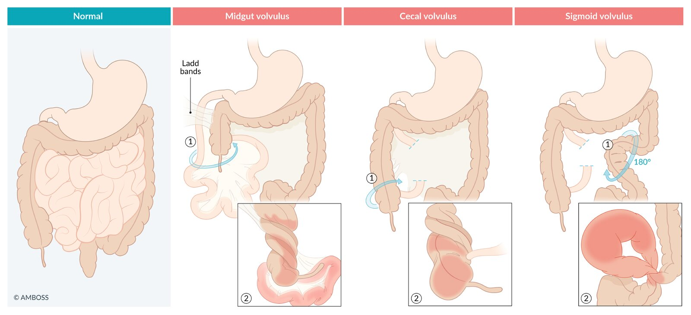
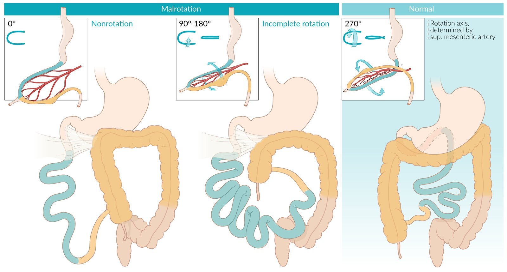
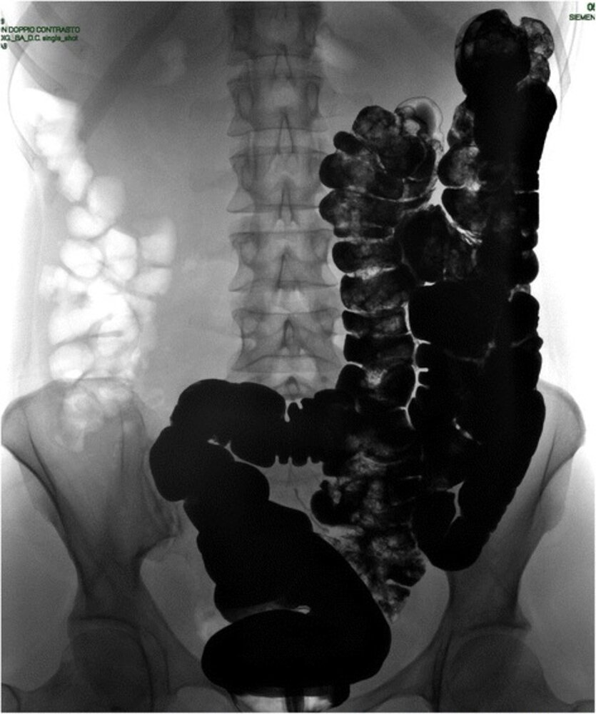
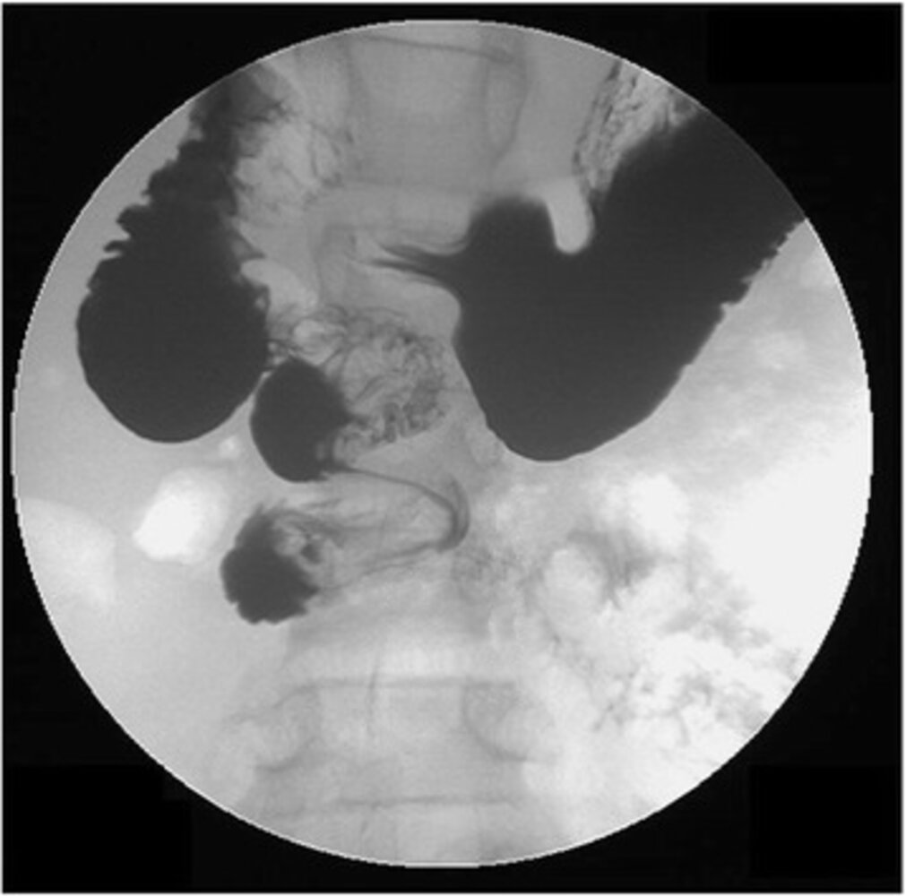
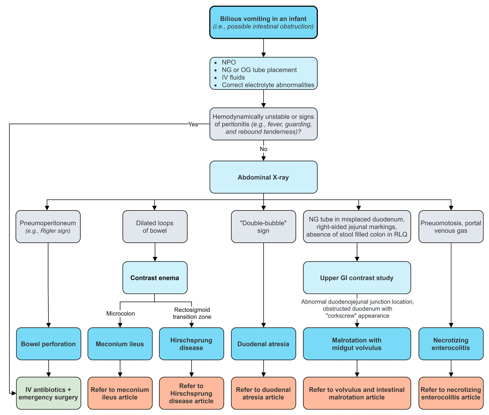

# Intestinal malrotation, midgut volvulus, and gastric volvulus

*Categories: Clinical knowledge > Emergency medicine > Gastrointestinal disorders > Intestinal malrotation, midgut volvulus, and gastric volvulus*

[Original Article Link](https://coursology-qbank.com/amboss/article/ho0cbS)

---

## Summary

<u>Intestinal malrotation</u> is a congenital abnormality characterized by abnormal or incomplete coiling and/or fixation of the <u>midgut</u> during embryologic development. The most common types of malrotation are nonrotation and incomplete rotation. Malrotation can cause <u>midgut volvulus</u>, which is a life-threatening condition in which the <u>small intestine</u> twists around the <u>superior mesenteric artery</u> and is a common cause of mechanical <u>intestinal obstruction</u> in <u>neonates</u> and <u>infants</u>. Malrotation and <u>midgut volvulus</u> most commonly manifest in <u>newborns</u> but can occur at any age. <u>Bilious</u> <u>vomiting</u> is a hallmark symptom of <u>midgut volvulus</u>, often accompanied by other <u>signs of bowel obstruction</u> (e.g., abdominal <u>pain</u> and distention). If left untreated, <u>midgut volvulus</u> can lead to <u>bowel ischemia</u>; features include <u>tachycardia</u>, <u>hypotension</u>, <u>hematochezia</u>, and <u>peritonitis</u>. Urgent surgical consultation is required for patients with suspected <u>midgut volvulus</u>. An <u>upper GI series</u> is the <u>gold standard</u> for diagnosing <u>midgut volvulus</u> and may show the <u>corkscrew sign</u> in the <u>duodenum</u>. Definitive treatment is surgical detorsion using the <u>Ladd procedure</u>.

<u>Gastric volvulus</u> is a distinct condition characterized by more than 180° rotation of the <u>stomach</u> along one of its axes. Manifestations of acute <u>gastric volvulus</u> include severe epigastric <u>pain</u> and distention, retching without <u>vomiting</u>, and an inability to pass a <u>nasogastric tube</u> (i.e., <u>Borchardt triad</u>). <u>Abdominal x-rays</u> and contrast studies can support the diagnosis. Definitive treatment involves urgent surgical detorsion with <u>gastropexy</u> to prevent recurrence.

See “<u>Sigmoid volvulus and cecal volvulus</u>” for more details on <u>volvulus</u> in adults.

Types of volvulus

---

## Overview

|  Overview of intestinal malrotation and midgut volvulus [[1]](https://coursology-qbank.com/amboss/article/Jods1I0)[[2]](https://coursology-qbank.com/amboss/article/Epd8rI0)  |  |  |
| --- | --- | --- |
|  | <u>Intestinal malrotation</u> | <u>Midgut volvulus</u> |
| Pathophysiology |  * Incomplete or abnormal rotation and/or fixation of the <u>midgut</u> during <u>embryogenesis</u>   |  * Torsion of the malrotated <u>midgut</u> leading to <u>bowel ischemia</u>   |
| Clinical features |   * Can be asymptomatic  * Chronic intermittent abdominal <u>pain</u>  * Early satiety  * Weight loss  * Features of <u>duodenal</u> obstruction may be present  * Can present as <u>midgut volvulus</u>    |   * <u>Bilious</u> <u>vomiting</u>  * Abdominal distention  * Signs of <u>bowel ischemia</u>: <u>hematochezia</u>, <u>hematemesis</u>, <u>hypotension</u>, and <u>tachycardia</u>  * <u>Lethargy</u>    |
|  Associated congenital anomalies [[3]](https://coursology-qbank.com/amboss/article/OC1IHQ0)  |   * Common: <u>congenital diaphragmatic hernia</u> (∼ 100%), <u>congenital heart defects</u> (up to 90%), <u>omphalocele</u> (up to 45%)  * Less common: <u>gastroschisis</u>, <u>Meckel diverticulum</u>, <u>esophageal atresia</u>, <u>biliary atresia</u>    |  |
| Diagnosis |   * Asymptomatic: detected incidentally or during prenatal screening  * Symptomatic: imaging    |   * Stable: urgent imaging (e.g., <u>upper GI series</u>)  * Unstable: imaging should not delay surgical intervention  * Supportive <u>laboratory studies</u> (e.g., <u>CBC</u>, <u>CMP</u>, <u>lactate</u>)    |
| <u>Upper GI series</u> |   * Displaced duodenojejunal junction  [[4]](https://coursology-qbank.com/amboss/article/IKdY3I0)  * Right-sided <u>small bowel</u> [[5]](https://coursology-qbank.com/amboss/article/6pdjqI0)    |   * <u>Duodenal</u> obstruction  [[2]](https://coursology-qbank.com/amboss/article/Epd8rI0)[[4]](https://coursology-qbank.com/amboss/article/IKdY3I0)  * Corkscrew duodenum   [[6]](https://coursology-qbank.com/amboss/article/AN1Rdh0)  * <u>Bird beak sign</u> [[2]](https://coursology-qbank.com/amboss/article/Epd8rI0)    |
| <u>Small bowel follow-through</u> |  * May show abnormal position of the <u>cecum</u>  [[1]](https://coursology-qbank.com/amboss/article/Jods1I0)[[5]](https://coursology-qbank.com/amboss/article/6pdjqI0)[[7]](https://coursology-qbank.com/amboss/article/vpdArI0)   |  |
| Abdominal <u>ultrasound</u> |  * Abnormal position of the superior <u>mesenteric vessels</u>  [[6]](https://coursology-qbank.com/amboss/article/AN1Rdh0)   |  * <u>Whirlpool sign</u> (on color Doppler) [[6]](https://coursology-qbank.com/amboss/article/AN1Rdh0)   |
| <u>Abdominal x-ray</u> |   * Often normal  * May show right-sided <u>jejunal</u> markings or absence of stool in the <u>right lower quadrant</u> of the <u>colon</u> [[8]](https://coursology-qbank.com/amboss/article/RsbluE)    |   * Often normal [[2]](https://coursology-qbank.com/amboss/article/Epd8rI0)[[9]](https://coursology-qbank.com/amboss/article/JpdsqI0)  * May show <u>radiological signs of bowel obstruction</u> (e.g., <u>double bubble sign</u> with <u>distal</u> gas) [[1]](https://coursology-qbank.com/amboss/article/Jods1I0)[[2]](https://coursology-qbank.com/amboss/article/Epd8rI0)[[9]](https://coursology-qbank.com/amboss/article/JpdsqI0)  * May show signs of <u>bowel perforation</u>  [[2]](https://coursology-qbank.com/amboss/article/Epd8rI0)    |
| <u>Barium enema</u> |  * May show abnormal position of the <u>cecum</u> [[1]](https://coursology-qbank.com/amboss/article/Jods1I0)[[4]](https://coursology-qbank.com/amboss/article/IKdY3I0)[[7]](https://coursology-qbank.com/amboss/article/vpdArI0)   |  |
| Management |   * Symptomatic: <u>Ladd procedure</u>; urgency depends on clinical presentation  * Asymptomatic children: typically prophylactic <u>Ladd procedure</u>  * Asymptomatic adults: <u>surgery</u> or observation    |   * <u>Fluid resuscitation</u>  * <u>Broad-spectrum IV antibiotics</u>  * Bowel decompression (<u>NG tube insertion</u>)  * Emergency <u>Ladd procedure</u>    |

---

## Intestinal malrotation

For a normal intestinal rotation sequence, see “<u>Rotation of the midgut</u>.”

### <u>Epidemiology</u> [[10]](https://coursology-qbank.com/amboss/article/LEdww70)

* Estimated to occur in ∼ 1 in 500 <u>live births</u>

* True <u>incidence</u> likely higher, as it may be asymptomatic or manifest with nonspecific symptoms in older children

### Pathophysiology [[11]](https://coursology-qbank.com/amboss/article/jha_d4)[[12]](https://coursology-qbank.com/amboss/article/7ha424)[[13]](https://coursology-qbank.com/amboss/article/HhaK24)

<u>Intestinal malrotation</u> is a congenital anomaly caused by incomplete or abnormal <u>rotation of the midgut</u> and/or fixation during <u>embryogenesis</u>.

* Nonrotation 

* The entire <u>colon</u> is left-sided; the entire <u>small bowel</u> is right-sided.

* The <u>mesenteric</u> attachment has a wider base.

* Incomplete rotation

* The <u>cecum</u> remains fixed in the <u>RUQ</u> by <u>peritoneal</u> bands (Ladd bands).

* The <u>mesenteric</u> base is narrow.

Intestinal malrotation

### Clinical features [[3]](https://coursology-qbank.com/amboss/article/OC1IHQ0)[[10]](https://coursology-qbank.com/amboss/article/LEdww70)[[14]](https://coursology-qbank.com/amboss/article/xd1EHf0)

* <u>Neonates</u> and <u>infants</u>: typically present with acute manifestations

* Clinical features of <u>midgut volvulus</u>

* Features of <u>duodenal</u> obstruction (<u>bilious</u> <u>vomiting</u> without abdominal distention)

* Older children: : ranges from asymptomatic to chronic intermittent abdominal <u>pain</u> or early satiety and weight loss  [[14]](https://coursology-qbank.com/amboss/article/xd1EHf0)

> [!TIP]
> Consider <u>intestinal malrotation</u> in older children with unexplained nonspecific GI symptoms. [[15]](https://coursology-qbank.com/amboss/article/6Edj970)

### Diagnosis [[1]](https://coursology-qbank.com/amboss/article/Jods1I0)[[10]](https://coursology-qbank.com/amboss/article/LEdww70)[[16]](https://coursology-qbank.com/amboss/article/oEd0970)

* <u>Upper GI series</u> (<u>gold standard</u>): abnormal duodenojejunal junction (DJJ) position 

* Anteroposterior view: DJJ should lie to the left of the <u>spine</u> at the level of the <u>duodenal bulb</u>.

* <u>Lateral</u> view: DJJ should course posteriorly in the <u>retroperitoneum</u>.

* <u>Ultrasound</u>: superior <u>mesenteric vessel</u> displacement  [[6]](https://coursology-qbank.com/amboss/article/AN1Rdh0)[[16]](https://coursology-qbank.com/amboss/article/oEd0970)

> [!WARNING]
> A normal <u>ultrasound</u> does not exclude malrotation.

Intestinal malrotation

### Treatment [[10]](https://coursology-qbank.com/amboss/article/LEdww70)[[14]](https://coursology-qbank.com/amboss/article/xd1EHf0)[[17]](https://coursology-qbank.com/amboss/article/KEdU970)

#### Symptomatic patients

* Initial management

* Suspected <u>midgut volvulus</u>: Begin <u>initial management of midgut volvulus</u>.

* Suspect <u>bowel obstruction</u>: Begin <u>initial management of bowel obstruction</u>.

* Other stable symptomatic patients: Provide supportive treatment as needed.

* Definitive treatment: <u>Ladd procedure</u>

* Perform urgently for <u>midgut volvulus</u> or <u>bowel obstruction</u>.

* For other patients, consider timing on a case-by-case basis in consultation with a specialist.

> [!WARNING]
> Do not delay treating patients presenting with suspected <u>midgut volvulus</u> as it is a time-dependent surgical emergency.

#### Asymptomatic (incidental finding)  [[10]](https://coursology-qbank.com/amboss/article/LEdww70)[[17]](https://coursology-qbank.com/amboss/article/KEdU970)

* Children: Prophylactic <u>Ladd procedure</u> is often recommended due to the risk of <u>volvulus</u>.

* Adults: <u>surgery</u> or observation depending on age, comorbidities, and surgical risk

### Complications [[10]](https://coursology-qbank.com/amboss/article/LEdww70)

* <u>Midgut volvulus</u>

* <u>Internal hernia</u>

---

## Midgut volvulus

<u>Midgut volvulus</u> most commonly occurs as a complication of <u>intestinal malrotation</u> in <u>neonates</u> and <u>infants</u>. Rarely, it can occur in adults as a complication of <u>surgery</u> (e.g., <u>bariatric surgery</u>).

### <u>Epidemiology</u>

* <u>Incidence</u>: 1:6000 <u>live births</u> in the US

* Age: : most commonly occurs in <u>neonates</u> and <u>infants</u>  [[2]](https://coursology-qbank.com/amboss/article/Epd8rI0)[[18]](https://coursology-qbank.com/amboss/article/ihaJd4)[[19]](https://coursology-qbank.com/amboss/article/lhavV4)[[20]](https://coursology-qbank.com/amboss/article/YCdnqH0)

> [!NOTE]
> Midgut <u>volvulus</u> and Malrotation are more common in Minors, while SigmOid <u>volvulus</u> is more common in Older individuals.

### Pathophysiology [[21]](https://coursology-qbank.com/amboss/article/KhaUU4)

Involves twisting of the bowel around its <u>mesentery</u> which leads to:

* Closed-loop <u>mechanical bowel obstruction</u> → accumulation of gas and feces within the loop → increased intraluminal pressure → impaired <u>capillary</u> <u>perfusion</u> of the bowel → bowel strangulation, <u>ischemia</u>, and <u>gangrene</u>

* Torsion of the <u>mesenteric</u> vascular pedicle → occlusion/<u>thrombosis</u> of <u>mesenteric vessels</u> → bowel strangulation, <u>ischemia</u>, and <u>gangrene</u>

Types of volvulus

### Etiology

The following applies to children; see “Special patient groups” for etiology in adults.

* <u>Intestinal malrotation</u>

* Intestinal bands and/or adhesions (e.g., <u>Ladd bands</u>)

* <u>Megacolon</u> (<u>Hirschsprung disease</u>, <u>Chagas disease</u>)

### Clinical features [[3]](https://coursology-qbank.com/amboss/article/OC1IHQ0)[[14]](https://coursology-qbank.com/amboss/article/xd1EHf0)

* <u>Bilious</u> <u>vomiting</u> with abdominal distention in <u>neonates</u> and <u>infants</u>

* Features of <u>duodenal</u> obstruction: <u>bilious</u> <u>vomiting</u> without abdominal distention

* Signs of <u>bowel ischemia</u>: <u>hematochezia</u>, <u>hematemesis</u>, <u>hypotension</u>, and <u>tachycardia</u>

> [!WARNING]
> <u>Bilious</u> <u>vomiting</u> in a <u>lethargic</u> <u>newborn</u> suggests <u>bowel ischemia</u>. [[14]](https://coursology-qbank.com/amboss/article/xd1EHf0)

> [!WARNING]
> <u>Abdominal examination</u> may have limited utility, as it is difficult to assess for tenderness and <u>rebound tenderness</u> in <u>neonates</u> and <u>infants</u>.

### Diagnosis [[1]](https://coursology-qbank.com/amboss/article/Jods1I0)[[2]](https://coursology-qbank.com/amboss/article/Epd8rI0)[[3]](https://coursology-qbank.com/amboss/article/OC1IHQ0)[[10]](https://coursology-qbank.com/amboss/article/LEdww70)

#### Approach

* Ill-appearing or unstable (e.g., <u>signs of shock</u>, signs of <u>bowel ischemia</u>)

* Begin <u>initial management of midgut volvulus</u>.

* Defer imaging and expedite <u>surgery</u>.

* Stable

* Consider abdominal <u>ultrasound</u> with Doppler as an initial test for <u>newborns</u> with <u>bilious</u> <u>vomiting</u>.  [[22]](https://coursology-qbank.com/amboss/article/SEdyE70)[[23]](https://coursology-qbank.com/amboss/article/hEdcv70)

* Obtain <u>upper GI series</u> (<u>gold standard</u>)  [[1]](https://coursology-qbank.com/amboss/article/Jods1I0)

* Consider <u>small bowel follow-through</u> as an adjunct if <u>upper GI series</u> is equivocal.

* Obtain <u>laboratory studies</u> as adjuncts.

> [!WARNING]
> Do not delay <u>surgery</u> for imaging in ill-appearing or unstable children with suspected <u>midgut volvulus</u>. [[14]](https://coursology-qbank.com/amboss/article/xd1EHf0)

#### <u>Laboratory studies</u> [[6]](https://coursology-qbank.com/amboss/article/AN1Rdh0)

* <u>CBC with differential</u>

* Blood <u>glucose</u>

* <u>Electrolytes</u>

* Renal and <u>liver function</u> tests

* <u>Capillary blood gas</u>

* <u>Lactate</u>

* <u>Blood gas</u>

#### Imaging findings

* <u>Upper GI series</u>

* Incomplete <u>duodenal</u> obstruction [[14]](https://coursology-qbank.com/amboss/article/xd1EHf0)

* Corkscrew duodenum   [[6]](https://coursology-qbank.com/amboss/article/AN1Rdh0)

* <u>Bird beak sign</u> [[2]](https://coursology-qbank.com/amboss/article/Epd8rI0)

* <u>Abdominal x-ray</u>: nonspecific findings; may show <u>radiological signs of bowel obstruction</u> and a gasless abdomen  [[3]](https://coursology-qbank.com/amboss/article/OC1IHQ0)

* Abdominal <u>ultrasound</u> with Doppler: <u>whirlpool sign</u> [[6]](https://coursology-qbank.com/amboss/article/AN1Rdh0)

* <u>Small bowel follow-through</u>: may show abnormal position of the <u>cecum</u>  [[5]](https://coursology-qbank.com/amboss/article/6pdjqI0)[[7]](https://coursology-qbank.com/amboss/article/vpdArI0)

Malrotation with midgut volvulus

### Differential diagnosis

* <u>Neonates</u> and <u>infants</u> with recurrent <u>vomiting</u>: <u>duodenal atresia and stenosis</u>;  , <u>hypertrophic pyloric stenosis</u>

* <u>Neonates</u> with features of <u>bowel ischemia</u> and/or <u>gangrene</u>: <u>necrotizing enterocolitis</u>

* Older children with abdominal <u>pain</u> and <u>vomiting</u>: <u>intussusception</u>

* Older children and adults with nonspecific symptoms: <u>GERD</u>, <u>chronic mesenteric ischemia</u>, <u>food allergy</u>

* See “<u>Differential diagnosis of lower gastrointestinal bleeding in children</u>.”

Management of bilious vomiting in the newborn

### Management [[10]](https://coursology-qbank.com/amboss/article/LEdww70)

#### Initial management of midgut volvulus

* <u>ABCDE approach</u>

* Urgent <u>surgery</u> consult for immediate <u>surgery</u>

* <u>NPO</u> status

* Bowel decompression (e.g., <u>nasogastric tube</u> on low to intermittent suction)

* <u>IV fluid resuscitation</u> and <u>electrolyte repletion</u> as needed

* Broad-spectrum <u>empiric antibiotic therapy</u> (e.g., <u>empiric antibiotic therapy</u> for pediatric <u>cIAIs</u>)

> [!TIP]
> Continue stabilization during transport to the operating room to maximize intestinal salvage. [[14]](https://coursology-qbank.com/amboss/article/xd1EHf0)

#### Definitive treatment [[2]](https://coursology-qbank.com/amboss/article/Epd8rI0)[[4]](https://coursology-qbank.com/amboss/article/IKdY3I0)[[6]](https://coursology-qbank.com/amboss/article/AN1Rdh0)

* Expedite emergency <u>surgery</u>.

* Ladd procedure: a procedure involving bowel detorsion, <u>Ladd band</u> division, <u>mesenteric</u> widening, <u>cecum</u> and <u>colon</u> repositioning, and <u>appendectomy</u>.

### Special patient groups

#### Children ≥ 1 year old [[10]](https://coursology-qbank.com/amboss/article/LEdww70)

* Clinical features

* Insidious presentation over days to months

* Intermittent <u>vomiting</u> and/or abdominal <u>pain</u>

* Solid <u>food intolerance</u>

* <u>Chronic diarrhea</u>

* Signs of <u>biliary obstruction</u> or <u>pancreatitis</u>

* Treatment: <u>Ladd procedure</u> [[20]](https://coursology-qbank.com/amboss/article/YCdnqH0)

#### Adults [[24]](https://coursology-qbank.com/amboss/article/pEdL970)

* <u>Epidemiology</u>: rare in adults

* Etiology: may result from undiagnosed congenital malrotation, prior <u>surgery</u>, or adhesions.  [[25]](https://coursology-qbank.com/amboss/article/69djoH0)[[26]](https://coursology-qbank.com/amboss/article/p9dLoH0)[[27]](https://coursology-qbank.com/amboss/article/J9dsoH0)

* Clinical features: can be acute (signs of <u>bowel ischemia</u>) or intermittent (e.g., <u>postprandial</u> <u>pain</u>, <u>nausea</u>)

* Diagnosis

* Imaging: CT abdomen with contrast [[24]](https://coursology-qbank.com/amboss/article/pEdL970)

* Findings: "<u>Whirl sign</u>" or abnormal positioning of the duodenojejunal junction. [[28]](https://coursology-qbank.com/amboss/article/K9dUoH0)

* Treatment

* <u>Ladd procedure</u> with resection of <u>necrotic</u> bowel

* Prior <u>bariatric surgery</u> requires a different surgical approach (e.g., additional closure of <u>mesenteric</u> defects).

> [!TIP]
> <u>Internal hernias</u> or <u>midgut volvulus</u> may present similarly in patients with prior <u>bariatric surgery</u>. [[29]](https://coursology-qbank.com/amboss/article/q9dCoH0)[[30]](https://coursology-qbank.com/amboss/article/I9dYKH0)

---

## Gastric volvulus

### Background [[14]](https://coursology-qbank.com/amboss/article/xd1EHf0)[[31]](https://coursology-qbank.com/amboss/article/YvdnA70)

* Rare condition in which the <u>stomach</u> rotates > 180° along the organoaxial or mesenteroaxial axis.

* This leads to <u>gastric outlet obstruction</u> and potential <u>ischemia</u>, <u>necrosis</u>, or perforation.

### Etiology [[31]](https://coursology-qbank.com/amboss/article/YvdnA70)

* Lax gastric <u>ligaments</u> (e.g., gastrocolic, gastrohepatic)

* Anatomical disorder (e.g., <u>paraesophageal hernia</u>; , <u>Bochdalek hernia</u> in children)

* Gastric defects (e.g., <u>gastric ulcer</u>, <u>gastric carcinoma</u>) [[6]](https://coursology-qbank.com/amboss/article/AN1Rdh0)

### Clinical features [[14]](https://coursology-qbank.com/amboss/article/xd1EHf0)[[32]](https://coursology-qbank.com/amboss/article/bvdHA70)

* Acute: Borchardt triad [[14]](https://coursology-qbank.com/amboss/article/xd1EHf0)

* Inability to pass a <u>nasogastric tube</u>

* Retching without <u>vomiting</u>

* Severe epigastric <u>pain</u> and distention

* Chronic: intermittent symptoms of <u>gastric outlet obstruction</u>

### Diagnosis [[32]](https://coursology-qbank.com/amboss/article/bvdHA70)

* <u>Abdominal x-ray</u>

* Large round gas bubble in the upper abdomen or chest with an <u>air-fluid level</u>

* Gasless <u>distal</u> bowel

* CT chest and abdomen

* Dilated <u>stomach</u>; may be positioned in the <u>thoracic cavity</u>

* Swirl sign (<u>esophagus</u> and <u>stomach</u> rotated around each other on <u>transverse plane</u>)

### Treatment [[32]](https://coursology-qbank.com/amboss/article/bvdHA70)

* Initial management 

* Similar to the <u>initial management of midgut volvulus</u>

* Includes <u>gastric decompression</u> (see “<u>Gastric outlet obstruction</u>.”)

* <u>Surgery</u>: detorsion and <u>gastropexy</u>

### Complications [[14]](https://coursology-qbank.com/amboss/article/xd1EHf0)

* Strangulation;  of the <u>stomach</u>, leading to <u>ischemia</u> and perforation

* <u>Sepsis</u>

---