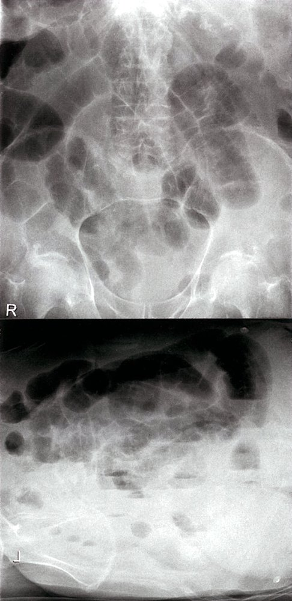
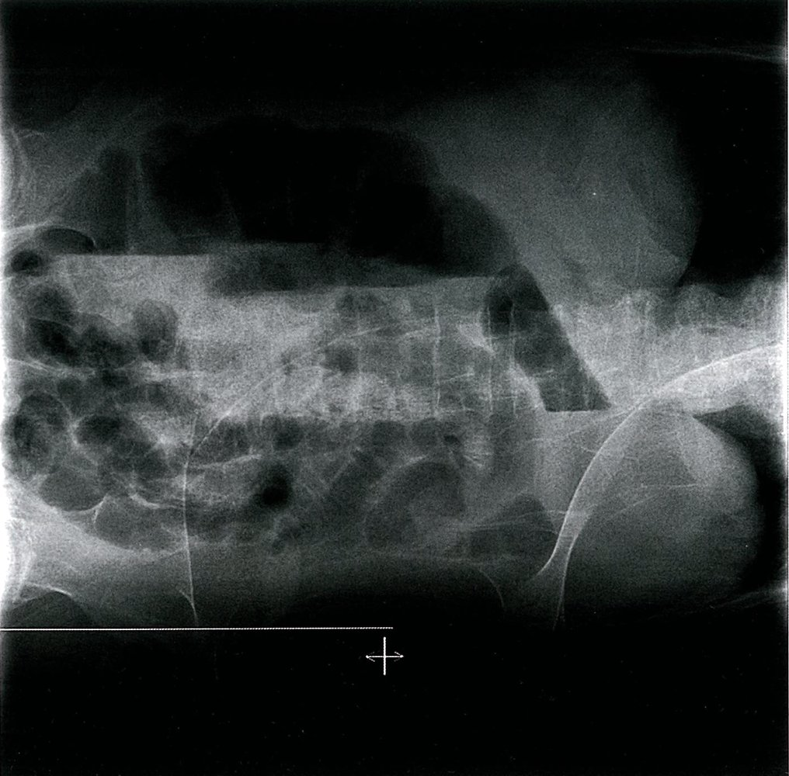

# Paralytic ileus

*Categories: Clinical knowledge > Emergency medicine > Gastrointestinal disorders > Paralytic ileus*

[Original Article Link](https://coursology-qbank.com/amboss/article/aI0QYh)

---

## Summary

Paralytic <u>ileus</u> (also called functional <u>bowel obstruction</u>) is the interruption of the normal passage of bowel contents due to reduced <u>peristalsis</u> in the absence of a mechanical obstruction. It is often transient. <u>Postoperative ileus</u> is one of the most common causes of paralytic <u>ileus</u>. Other etiologies include inflammation of abdominal, <u>pelvic</u>, or <u>retroperitoneal</u> <u>viscera</u>, metabolic disturbances, certain medications, and <u>mesenteric</u> <u>ischemia</u>. Paralytic <u>ileus</u> typically manifests with <u>nausea</u>, <u>vomiting</u>, abdominal <u>pain</u>, abdominal distention, and <u>constipation</u>; <u>bowel sounds</u> are often absent on <u>auscultation</u>. Bowel distention, if present, leads to <u>third-space volume loss</u>, resulting in <u>dehydration</u> and <u>electrolyte</u> abnormalities. <u>Ileus</u> is generally a <u>clinical diagnosis</u>. Imaging may be required to evaluate for the underlying diagnosis and to rule out <u>mechanical bowel obstruction</u> and complications. The characteristic imaging feature of paralytic <u>ileus</u> is diffuse dilatation of bowel loops with no transition point. <u>Laboratory studies</u> can be useful to identify the underlying cause and/or to assess for complications. Apart from treating the underlying cause, there are few specific treatment measures for paralytic <u>ileus</u>. Management is mainly supportive, involving <u>IV fluid resuscitation</u>, <u>electrolyte repletion</u>, and bowel rest. Surgical intervention is only indicated if necessary for the underlying cause (e.g., acute <u>complicated appendicitis</u>) or if complications arise. Complications such as <u>intestinal ischemia</u> and perforation are rare in paralytic <u>ileus</u>.

<u>Acute colonic pseudoobstruction</u>, also known as <u>Ogilvie syndrome</u>, is a distinct clinical entity that typically affects critically ill or postoperative patients. Like paralytic <u>ileus</u>, there is no mechanical obstruction to the passage of bowel contents. However, the risk of severe <u>colonic</u> dilation with potential perforation and <u>ischemia</u> is significant. For management of this condition, see “<u>Ogilvie syndrome</u>.”

---

## Definitions

Temporarily impaired <u>peristalsis</u> (hypomotility) of the <u>gastrointestinal tract</u> in the absence of mechanical obstruction

---

## Etiology

* Intraabdominal;  or <u>retroperitoneal</u> <u>surgery</u> (e.g. spinal or <u>pelvic</u> <u>surgery</u>)  [[1]](https://coursology-qbank.com/amboss/article/cvXa_-)[[2]](https://coursology-qbank.com/amboss/article/1uX2J-)[[3]](https://coursology-qbank.com/amboss/article/1vX2_-)

* Inflammation of intraabdominal; , <u>pelvic</u>, or <u>retroperitoneal</u> organs (e.g., <u>appendicitis</u>, <u>cholecystitis</u>, <u>pancreatitis</u>, <u>severe gastroenteritis</u>);  with or without <u>peritonitis</u>

* Abdominal;  or <u>retroperitoneal</u> trauma (e.g., <u>retroperitoneal hemorrhage</u>)

* Medications (e.g., <u>anticholinergics</u>, <u>opioids</u>, <u>tricyclic antidepressants</u>, <u>vincristine</u>) [[4]](https://coursology-qbank.com/amboss/article/FwXgkZ0)

* Endocrine or metabolic abnormalities (e.g., <u>hypothyroidism</u>; , <u>hyperparathyroidism</u>, <u>porphyria</u>, <u>uremia</u>, severe <u>hyperglycemia</u>) [[5]](https://coursology-qbank.com/amboss/article/8wXOkZ0)[[6]](https://coursology-qbank.com/amboss/article/uwXpkZ0)

* <u>Electrolyte</u> disturbances (e.g., <u>hypokalemia</u>, <u>hypomagnesemia</u>, <u>hyponatremia</u>)

* Neuropathy (e.g., <u>diabetes mellitus</u>, spinal injury)

* Vascular diseases (e.g., <u>mesenteric</u> <u>ischemia</u>)

* <u>Sepsis</u>

> [!NOTE]
> The 5 Ps: Peritonitis, Postoperative, low Potassium, oPioids, and Pelvic/<u>spinal fractures</u> are among the most common causes of paralytic <u>ileus</u>.

[[7]](https://coursology-qbank.com/amboss/article/kIYm1q)[[8]](https://coursology-qbank.com/amboss/article/L_YwK7)[[9]](https://coursology-qbank.com/amboss/article/S9Xy5Z0)

---

## Pathophysiology

* Irritation of the bowel (e.g., intraoperative manipulation) and/or inflammation (e.g., <u>peritonitis</u>) causing:

* <u>Sympathetic nervous system</u> activation → decreased/arrested <u>peristalsis</u>

* Local release of <u>nitric oxide</u> → relaxation of intestinal <u>smooth muscles</u> → decreased/arrested <u>peristalsis</u>

* Decreased/arrested <u>peristalsis</u>;  leads to the stasis of luminal contents and gas and bowel wall distention.

* In some cases, the pathophysiological consequences of this are similar to those of <u>mechanical bowel obstruction</u> (see “Pathophysiology” in “<u>Mechanical bowel obstruction</u>”).

References: [[9]](https://coursology-qbank.com/amboss/article/S9Xy5Z0)[[10]](https://coursology-qbank.com/amboss/article/g9XF5Z0)

---

## Clinical features

* Symptoms

* <u>Constipation</u> and reduced passage of gas

* Continuous (noncolicky) abdominal <u>pain</u> or discomfort

* <u>Nausea</u>, <u>vomiting</u>

* Abdominal distention

* Examination findings

* Percussion: diffuse tympany

* Palpation: usually no tenderness unless <u>peritonitis</u> is present  [[11]](https://coursology-qbank.com/amboss/article/35YSPp)

* <u>Auscultation</u>: <u>Bowel sounds</u> are absent (silent abdomen) or decreased (early paralytic <u>ileus</u>).

References: [[7]](https://coursology-qbank.com/amboss/article/kIYm1q)[[8]](https://coursology-qbank.com/amboss/article/L_YwK7)

---

## Diagnosis

### General principles

* Paralytic <u>ileus</u>, including <u>postoperative ileus</u>, is primarily a <u>clinical diagnosis</u> based on <u>patient history</u>, symptoms, and <u>physical examination</u>.

* Abdominal imaging is often necessary to rule out differential diagnoses (see “<u>Mechanical bowel obstruction vs. paralytic ileus</u>”).

* Imaging and <u>laboratory studies</u> can help identify the underlying cause and/or complications.

* For a comprehensive overview of the diagnostic modalities, see “<u>Diagnostic workup of acute abdomen</u>.”

> [!WARNING]
> Paralytic <u>ileus</u> must be differentiated from diagnoses that require surgical intervention.

> [!TIP]
> Diagnostic studies are not generally required for early <u>postoperative ileus</u>. However, the possibility of early postoperative obstruction or abdominal infection should always be considered. [[8]](https://coursology-qbank.com/amboss/article/L_YwK7)

### Imaging [[7]](https://coursology-qbank.com/amboss/article/kIYm1q)

* Imaging is not routinely required to confirm paralytic <u>ileus</u>, especially when the underlying cause is known (e.g., early <u>postoperative ileus</u>).

* Consider imaging in the following instances.

* To rule out differential diagnoses, e.g., <u>mechanical bowel obstruction</u> or <u>Ogilvie syndrome</u> (see “<u>Radiological signs of mechanical bowel obstruction</u>”)

* To identify the underlying cause: e.g., <u>appendicitis</u>, <u>cholecystitis</u>

* To assess for complications: e.g., perforation

#### Abdominal <u>ultrasound</u> [[11]](https://coursology-qbank.com/amboss/article/35YSPp)

* Indication: commonly performed as an initial test in patients with abdominal <u>pain</u>  [[12]](https://coursology-qbank.com/amboss/article/68Xjn-)

* Findings

* Fluid-filled, dilated bowel loops

* Loss of <u>peristalsis</u>

* Possibly signs of the underlying cause (e.g., <u>cholecystitis</u>)

Dilated small bowel

#### <u>X-ray</u> abdomen [[9]](https://coursology-qbank.com/amboss/article/S9Xy5Z0)[[11]](https://coursology-qbank.com/amboss/article/35YSPp)[[13]](https://coursology-qbank.com/amboss/article/jEX_v-)

* Indication: commonly performed as the initial imaging modality in patients with abdominal <u>pain</u> and/or suspected <u>ileus</u>  [[9]](https://coursology-qbank.com/amboss/article/S9Xy5Z0)

* Findings [[9]](https://coursology-qbank.com/amboss/article/S9Xy5Z0)[[13]](https://coursology-qbank.com/amboss/article/jEX_v-)

* Diffuse small and large bowel gaseous distention without transition or cutoff point

* The <u>sentinel loop sign</u> may be seen in localized paralytic <u>ileus</u>.

* Visible gas shadows in the <u>rectum</u>

* Free air if bowel is perforated (rare); note that intraabdominal free air is expected after recent abdominal <u>surgery</u>. [[7]](https://coursology-qbank.com/amboss/article/kIYm1q)

Small bowel dilatation

Paralytic ileus

Paralytic Ileus

Paralytic ileus from mesenteric ischemia

#### CT abdomen and <u>pelvis</u> with or without IV contrast [[13]](https://coursology-qbank.com/amboss/article/jEX_v-)

* Indications

* <u>Gold standard</u> for the evaluation of suspected <u>bowel obstruction</u>  [[3]](https://coursology-qbank.com/amboss/article/1vX2_-)[[12]](https://coursology-qbank.com/amboss/article/68Xjn-)[[14]](https://coursology-qbank.com/amboss/article/p8XLn-)

* To diagnose the underlying pathology (e.g., suspected intraabdominal infection)

* Findings

* Similar to <u>x-ray</u> findings

* Uniformly distended loops without a cutoff point

* Possible signs of the underlying cause (e.g., <u>appendicitis</u>, <u>pancreatitis</u>, <u>cholecystitis</u>)

Dilated small bowel

### <u>Laboratory studies</u> [[7]](https://coursology-qbank.com/amboss/article/kIYm1q)[[8]](https://coursology-qbank.com/amboss/article/L_YwK7)[[11]](https://coursology-qbank.com/amboss/article/35YSPp)

<u>Laboratory studies</u> are primarily indicated to investigate the underlying <u>cause of paralytic ileus</u> and assess for <u>dehydration</u> and metabolic imbalances secondary to diffuse bowel distension and <u>third-spacing</u>.

#### Routine workup [[7]](https://coursology-qbank.com/amboss/article/kIYm1q)

* <u>CBC</u>

* <u>Anemia</u> may be a sign of intraabdominal hemorrhage (e.g., in postoperative or <u>trauma patients</u>) or <u>malignancy</u>.

* <u>Leukocytosis</u> with <u>left shift</u> suggests intestinal infection or <u>ischemia</u>.

* <u>BMP</u>

* ↑ Serum <u>creatinine</u> and ↑ <u>urea</u> in the case of <u>acute renal failure</u>

* <u>Hypokalemia</u>, <u>hypochloremia</u> (e.g., due to emesis or inadequate replacement in postoperative patients who are <u>NPO</u>)

* <u>Hypomagnesemia</u>  [[15]](https://coursology-qbank.com/amboss/article/EwX8kZ0)

* If very severe, <u>hyperglycemia</u> can cause paralytic <u>ileus</u>.

* Blood <u>lactate</u> level: Elevation may indicate <u>ischemia</u> or <u>sepsis</u>.

* <u>Blood gas analysis</u>

* <u>Acidosis</u> may indicate <u>ischemia</u> or <u>sepsis</u>.

* <u>Metabolic alkalosis</u> can be caused by emesis.

#### Further studies

Obtain further <u>laboratory studies</u> based on the <u>pretest probability</u> of the underlying etiology; examples include:

* <u>Liver function</u> tests, <u>cholestasis parameters</u>

* Serum <u>lipase</u>, serum <u>amylase</u>

* <u>Inflammatory markers</u> (<u>ESR</u>, <u>CRP</u>)

---

## Differential diagnoses

* <u>Mechanical bowel obstruction</u> (see “<u>Mechanical bowel obstruction vs. paralytic ileus</u>”)

* Other nonobstructive bowel disorders, e.g.:

* <u>Ogilvie syndrome</u>

* <u>Chronic megacolon</u>

* <u>Toxic megacolon</u>

* <u>Gastroenteritis</u>

* <u>Postoperative nausea and vomiting</u>

* Other <u>differential diagnoses of acute abdomen</u>

The differential diagnoses listed here are not exhaustive.

---

## Treatment

### General principles [[7]](https://coursology-qbank.com/amboss/article/kIYm1q)[[8]](https://coursology-qbank.com/amboss/article/L_YwK7)

* Evidence-based recommendations for the <u>management of paralytic ileus</u> are scarce.

* Management is mainly conservative and includes symptomatic treatment, <u>IV fluids</u>, and bowel rest.

* <u>Surgery</u> is typically not indicated unless the underlying cause necessitates surgical intervention (e.g., <u>appendicitis</u>, <u>gallstone pancreatitis</u>).

* The underlying cause should be evaluated for and managed appropriately.

* For <u>postoperative ileus</u>, preventative measures are paramount.

> [!TIP]
> If there is no suspicion of more severe conditions such as mechanical obstruction or <u>Ogilvie syndrome</u>, the <u>treatment of paralytic ileus</u> is mainly supportive.

### <u>Conservative management</u> [[3]](https://coursology-qbank.com/amboss/article/1vX2_-)[[9]](https://coursology-qbank.com/amboss/article/S9Xy5Z0)[[11]](https://coursology-qbank.com/amboss/article/35YSPp)

<u>Conservative management</u> is indicated in all patients without signs of infectious causes or complications of paralytic <u>ileus</u> (e.g., <u>ischemia</u>, <u>peritonitis</u>).

#### Initial measures for all patients [[16]](https://coursology-qbank.com/amboss/article/Nac-ka0)

* Initial bowel rest (<u>NPO</u>)  [[3]](https://coursology-qbank.com/amboss/article/1vX2_-)[[9]](https://coursology-qbank.com/amboss/article/S9Xy5Z0)[[16]](https://coursology-qbank.com/amboss/article/Nac-ka0)

* <u>IV fluid therapy</u>

* <u>Electrolyte repletion</u> [[11]](https://coursology-qbank.com/amboss/article/35YSPp)

* Symptomatic treatment

* <u>Oral analgesics</u>, if tolerated, or <u>parenteral analgesics</u>, ideally nonopioids

* Oral <u>antiemetics</u>, if tolerated, or parenteral <u>antiemetics</u>

* Stop or decrease causative medications, if possible (e.g., <u>opioids</u>, <u>iron</u>, <u>antidiarrheal medication</u>).

#### Further measures

* Nutritional management

* Gradual increase in <u>enteral feeding</u> as tolerated by the patient

* <u>Parenteral nutrition</u> may be considered if <u>ileus</u> persists for ≥ 7 days. [[1]](https://coursology-qbank.com/amboss/article/cvXa_-)

* <u>Nasogastric tube insertion</u> [[1]](https://coursology-qbank.com/amboss/article/cvXa_-)[[10]](https://coursology-qbank.com/amboss/article/g9XF5Z0)[[11]](https://coursology-qbank.com/amboss/article/35YSPp)

* Not routinely indicated

* Consider in patients with decreased consciousness to prevent <u>aspiration</u>.

* Consider for symptomatic relief of significant abdominal distention or refractory <u>vomiting</u>.

* Monitoring

* <u>Serial abdominal examinations</u>

* <u>Fluid balance</u> (<u>input and output</u> chart) including <u>nasogastric tube</u> output

* Bowel movements (i.e., the passage of flatus and feces and <u>auscultation</u> of <u>bowel sounds</u>)

* Obtain surgical consult for nonresolution of <u>ileus</u>, worsening of symptoms, or development of <u>signs of peritonitis</u>

* Additional pharmacological options (not routinely recommended; consider only after <u>mechanical bowel obstruction</u> has been definitively ruled out)  [[8]](https://coursology-qbank.com/amboss/article/L_YwK7)

* <u>Laxatives</u>, e.g., <u>bisacodyl</u> suppository

* <u>Prokinetics</u>, e.g., <u>neostigmine</u> (a reversible inhibitor of <u>acetylcholinesterase</u> → ↑ ACH → ↑ gut wall contractility)  [[1]](https://coursology-qbank.com/amboss/article/cvXa_-)[[10]](https://coursology-qbank.com/amboss/article/g9XF5Z0)[[17]](https://coursology-qbank.com/amboss/article/YzYnr7)[[18]](https://coursology-qbank.com/amboss/article/d9XomZ0)

* Treatment of <u>opioid</u>-induced <u>ileus</u> [[8]](https://coursology-qbank.com/amboss/article/L_YwK7)[[19]](https://coursology-qbank.com/amboss/article/7_Y4p7)

* Consider the addition of <u>peripherally-acting μ-opioid receptor antagonists</u>.

* See “<u>Opioid-induced constipation</u>” for drug recommendations and dosages.

> [!TIP]
> Improvement of symptoms and tolerance of <u>enteral feeding</u> are better predictors of the normalization of gastrointestinal motility than successful bowel movements. [[16]](https://coursology-qbank.com/amboss/article/Nac-ka0)

> [!TIP]
> Obtain urgent <u>surgery</u> consult if the patient develops <u>signs of peritonitis</u>.

### <u>Surgery</u>

* Indications: not routinely indicated, except in the following situations

* Treatment of the underlying cause, e.g., <u>appendicitis</u>

* Treatment of complications, e.g., <u>intestinal ischemia</u> or perforation (rare in paralytic <u>ileus</u>)

---

## Postoperative ileus

### Definition

* <u>Postoperative ileus</u> (physiologic): : impaired gastrointestinal motility that occurs following abdominal or <u>pelvic</u> <u>surgery</u> and typically resolves spontaneously within 72 hours; one of the most common causes of paralytic <u>ileus</u>

* Prolonged postoperative ileus: a form of paralytic <u>ileus</u> associated with prolonged impaired gastrointestinal motility for > 72 hours after <u>surgery</u>  [[2]](https://coursology-qbank.com/amboss/article/1uX2J-)[[10]](https://coursology-qbank.com/amboss/article/g9XF5Z0)

### <u>Risk factors</u> for <u>postoperative ileus</u> [[3]](https://coursology-qbank.com/amboss/article/1vX2_-)[[7]](https://coursology-qbank.com/amboss/article/kIYm1q)[[8]](https://coursology-qbank.com/amboss/article/L_YwK7)

* Open abdominal or <u>pelvic</u> <u>surgery</u>

* Long duration of <u>surgery</u>

* Excessive bowel handling during intraabdominal <u>surgery</u>

* Excessive <u>IV fluids</u> during <u>surgery</u>

* Presence of other independent causative factors, e.g., <u>hypokalemia</u>; , use of <u>opiates</u>, or inflammation of intrabdominal organs

* Prolonged postoperative <u>immobilization</u>

### Clinical features

* Similar to paralytic <u>ileus</u> secondary to other etiologies (i.e., <u>nausea</u>, <u>vomiting</u>, abdominal distension, failure to pass flatus, absent/decreased <u>bowel sounds</u>).

* Abdominal tenderness is difficult to assess in the immediate/early postoperative period.

### Prevention of postoperative ileus

<u>Prolonged postoperative ileus</u> causes considerable discomfort to the patient and leads to longer hospital stays. The following perioperative measures can decrease the risk in patients undergoing abdominal and other high-risk <u>surgery</u>.

* Minimally invasive <u>surgery</u>, whenever feasible [[3]](https://coursology-qbank.com/amboss/article/1vX2_-)[[8]](https://coursology-qbank.com/amboss/article/L_YwK7)[[10]](https://coursology-qbank.com/amboss/article/g9XF5Z0)

* Multimodal <u>analgesic</u> regimens [[1]](https://coursology-qbank.com/amboss/article/cvXa_-)[[3]](https://coursology-qbank.com/amboss/article/1vX2_-)

* Preferential use of <u>NSAIDs</u> [[10]](https://coursology-qbank.com/amboss/article/g9XF5Z0)

* Epidural <u>analgesia</u>  [[8]](https://coursology-qbank.com/amboss/article/L_YwK7)[[10]](https://coursology-qbank.com/amboss/article/g9XF5Z0)[[20]](https://coursology-qbank.com/amboss/article/H_YKp7)

* Early initiation of <u>enteral feeding</u> and regular diet [[10]](https://coursology-qbank.com/amboss/article/g9XF5Z0)[[21]](https://coursology-qbank.com/amboss/article/U9Xb5Z0)

* Sham feeding with chewing <u>gum</u>  [[10]](https://coursology-qbank.com/amboss/article/g9XF5Z0)

* Restricted use of <u>IV fluids</u> perioperatively [[1]](https://coursology-qbank.com/amboss/article/cvXa_-)[[10]](https://coursology-qbank.com/amboss/article/g9XF5Z0)

* Selective use of nasogastric tubes [[10]](https://coursology-qbank.com/amboss/article/g9XF5Z0)

* Early mobilization is generally believed to be beneficial. [[1]](https://coursology-qbank.com/amboss/article/cvXa_-)[[10]](https://coursology-qbank.com/amboss/article/g9XF5Z0)

* Consider preoperative initiation of a peripherally-acting <u>μ-opioid</u> <u>antagonist</u> (e.g., <u>alvimopan</u> DOSAGE) in patients undergoing open colorectal surgeries or other major abdominal surgeries.  [[3]](https://coursology-qbank.com/amboss/article/1vX2_-)[[21]](https://coursology-qbank.com/amboss/article/U9Xb5Z0)[[22]](https://coursology-qbank.com/amboss/article/NAY-P7)

### Management

<u>Postoperative ileus</u> is managed in the same way as paralytic <u>ileus</u> secondary to other etiologies. See “<u>Treatment of paralytic ileus</u>” for details.

---