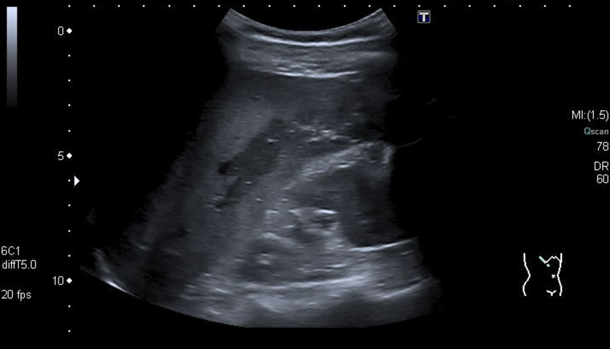
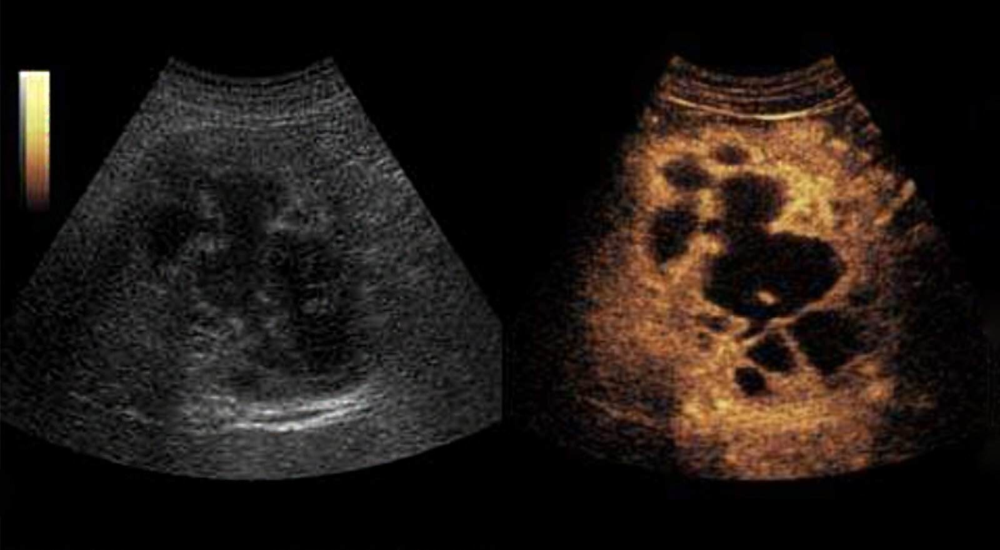
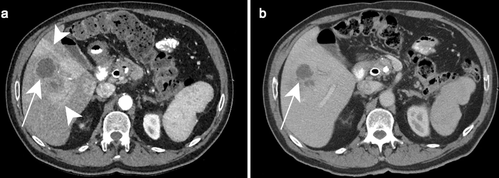

# Pyogenic liver abscess

*Categories: Clinical knowledge > Emergency medicine > Gastrointestinal disorders > Pyogenic liver abscess*

[Original Article Link](https://coursology-qbank.com/amboss/article/8L0Ozg)

---

## Summary

Pyogenic liver abscess (PLA) is an uncommon condition characterized by solitary or multiple collections of <u>pus</u> within the <u>liver</u>. The infection is caused by bacteria and is often polymicrobial, with <u>Escherichia coli</u>, <u>Streptococcus</u> spp. and <u>Klebsiella pneumoniae</u> being common causative organisms. The majority of cases are caused by ascending infection from a <u>biliary tract</u> pathology (e.g., <u>cholangitis</u> due to <u>choledocholithiasis</u> or <u>biliary strictures</u>). Infection in the <u>gastrointestinal tract</u> or <u>bacteremia</u> can expose the <u>liver</u> to high bacterial loads because of the <u>liver</u>'s dual blood supply from the <u>portal vein</u> and hepatic <u>artery</u>. Patients may present with nonspecific symptoms, such as <u>fever</u>, <u>malaise</u>, and weight loss. <u>Right upper quadrant</u> <u>pain</u> and tender <u>hepatomegaly</u> are specific features of a <u>liver</u> <u>abscess</u> but are not seen in all cases. Diagnosis is confirmed on abdominal imaging (<u>ultrasound</u> or CT), which would typically show intrahepatic fluid-filled lesions with surrounding <u>edema</u>. Broad-spectrum IV <u>antibiotics</u> and percutaneous or surgical drainage of the <u>abscess</u> cavity are the mainstays of treatment. Complications include <u>sepsis</u>, <u>pneumonia</u>, and <u>abscess</u> rupture into the <u>peritoneum</u> or thorax. Advances in diagnostics and treatment have reduced the complications and <u>mortality rates</u> of PLA.

---

## Etiology

### Risk factors for PLA [[2]](https://coursology-qbank.com/amboss/article/GcaBdj)[[4]](https://coursology-qbank.com/amboss/article/DWY1nL)[[5]](https://coursology-qbank.com/amboss/article/utXp2-)

* <u>Diabetes mellitus</u>

* <u>Liver surgery</u>, e.g., <u>liver transplant</u>

* Hepatic disease, e.g., <u>liver cirrhosis</u>

* <u>Malignancy</u>, especially gastrointestinal malignancies

* <u>Immunosuppression</u>

* Chronic use of <u>proton pump inhibitors</u>

* Advanced age

* Male sex

### Etiology by source [[1]](https://coursology-qbank.com/amboss/article/bz0Hri)[[2]](https://coursology-qbank.com/amboss/article/GcaBdj)[[4]](https://coursology-qbank.com/amboss/article/DWY1nL)[[6]](https://coursology-qbank.com/amboss/article/7mX4SA)

The source of infection often remains unclear, but if an etiology is identified, the cause is most often found in the <u>biliary tract</u>. Other routes of infection include hematogenic spread via the <u>portal vein</u> or hepatic <u>artery</u> and direct extension.

| Common causes of PLAs |  |  |
| --- | --- | --- |
| Source | Etiology | Pathogenesis |
|  <u>Biliary tract</u>: most commonly identified cause (24–60%)  [[6]](https://coursology-qbank.com/amboss/article/7mX4SA)[[7]](https://coursology-qbank.com/amboss/article/C5XqmA)  |   * <u>Choledocholithiasis</u>  * <u>Biliary strictures</u>  * Obstructing malignancies  * Congenital anomalies of the <u>biliary tract</u>    |  * Biliary obstruction → biliary stasis → bacterial <u>proliferation</u> → <u>cholangitis</u> → <u>ascending cholangitis</u> → formation of <u>liver</u> <u>abscesses</u>   |
|  Hepatic <u>artery</u> (∼ 10%)  [[6]](https://coursology-qbank.com/amboss/article/7mX4SA)  |   * <u>Bacteremia</u> or <u>sepsis</u>, e.g., due to <u>infective endocarditis</u> or IV line infection  * <u>Hepatic artery thrombosis</u>    |  * <u>Bacteremia</u> → bacterial spread into the <u>liver</u> → formation of <u>liver</u> <u>abscesses</u>   |
|  <u>Portal vein</u> (∼ 7%)  [[6]](https://coursology-qbank.com/amboss/article/7mX4SA)  |   * Intraabdominal infection, e.g., <u>acute appendicitis</u> , <u>diverticulitis</u>, or <u>peritonitis</u> (e.g., caused by <u>bowel perforation</u> or postoperative infection)  * <u>Inflammatory bowel disease</u>, most commonly <u>Crohn disease</u>  [[8]](https://coursology-qbank.com/amboss/article/S5XyjA)  * <u>Pelvic</u> <u>abscess</u>  * <u>Colorectal cancer</u>  [[4]](https://coursology-qbank.com/amboss/article/DWY1nL)    |  * Intraabdominal bacterial focus → <u>portal vein</u> pyemia → formation of <u>liver</u> <u>abscesses</u>   |
|  Contiguous area (< 5%) [[6]](https://coursology-qbank.com/amboss/article/7mX4SA)  |   * <u>Subphrenic abscess</u>  * <u>Perinephric abscess</u>  * <u>Cholecystitis</u>    |  * Direct introduction of bacteria into the <u>liver</u> → formation of <u>liver</u> <u>abscesses</u>   |
| Others |  * Cryptogenic (10–66%)  [[1]](https://coursology-qbank.com/amboss/article/bz0Hri)[[2]](https://coursology-qbank.com/amboss/article/GcaBdj)[[4]](https://coursology-qbank.com/amboss/article/DWY1nL)[[9]](https://coursology-qbank.com/amboss/article/GmXBSA)   |  * Unknown pathogenesis   |
|   * <u>Penetrating trauma</u> (∼ 5%) [[6]](https://coursology-qbank.com/amboss/article/7mX4SA)  * <u>Iatrogenic</u> [[4]](https://coursology-qbank.com/amboss/article/DWY1nL)  * <u>Liver surgery</u>  * Hepatic procedures, e.g., <u>TACE</u>, <u>RFA</u>  * Biliary procedures, e.g., <u>ERCP + sphincterotomy</u>    |  * Possible pathways of pathogenesis leading to formation of <u>liver</u> <u>abscesses</u>  * Direct introduction of bacteria into the <u>liver</u>  * Bacterial <u>colonization</u> of <u>hematoma</u> or <u>necrosis</u>  * <u>Abscesses</u> as a result of biliary procedures may also be caused by retrograde biliary flow.   |  |
|  * Secondary bacterial infection of:  * <u>Amebic liver abscess</u>  * <u>Hydatid cyst</u>  * Hepatic tumors [[4]](https://coursology-qbank.com/amboss/article/DWY1nL)  * Intrahepatic <u>hematoma</u> or <u>necrosis</u> caused by <u>blunt trauma</u> (rare)   |  * Bacterial <u>colonization</u> and <u>superinfection</u> → formation of <u>liver</u> <u>abscess</u>  [[4]](https://coursology-qbank.com/amboss/article/DWY1nL)   |  |

### Common pathogens [[1]](https://coursology-qbank.com/amboss/article/bz0Hri)[[2]](https://coursology-qbank.com/amboss/article/GcaBdj)[[3]](https://coursology-qbank.com/amboss/article/lTYvIo)[[5]](https://coursology-qbank.com/amboss/article/utXp2-)[[6]](https://coursology-qbank.com/amboss/article/7mX4SA)[[9]](https://coursology-qbank.com/amboss/article/GmXBSA)

* Often polymicrobial

* Most commonly isolated organisms 

* <u>E. coli</u>

* <u>K. pneumoniae</u>  [[5]](https://coursology-qbank.com/amboss/article/utXp2-)[[10]](https://coursology-qbank.com/amboss/article/z5Xr5A)

* <u>Streptococcus</u> spp.  [[2]](https://coursology-qbank.com/amboss/article/GcaBdj)[[3]](https://coursology-qbank.com/amboss/article/lTYvIo)[[7]](https://coursology-qbank.com/amboss/article/C5XqmA)

* Other causative bacteria include <u>Enterococcus</u> spp., <u>Staphylococcus aureus</u>, and <u>anaerobes</u>.  [[6]](https://coursology-qbank.com/amboss/article/7mX4SA)

---

## Clinical features

* Classic triad of PLA 

* <u>Fever</u> (with/without chills and <u>rigors</u>)

* <u>Malaise</u>

* <u>Right upper quadrant</u> <u>pain</u>

* Other symptoms

* <u>Anorexia</u> and weight loss

* <u>Nausea and vomiting</u>

* Symptoms of diaphragmatic irritation

* <u>Physical examination</u>

* <u>Jaundice</u>

* Tender <u>hepatomegaly</u>

* Intercostal tenderness

* Epigastric tenderness

* Decreased breath sounds in right lower lobe of the <u>lung</u>

* <u>Features of sepsis</u>

> [!NOTE]
> The symptoms of PLA are often non-specific (e.g., <u>fever</u>, weight loss, <u>nausea</u>).
> References:[[1]](https://coursology-qbank.com/amboss/article/bz0Hri)

---

## Diagnosis

### General principles

* Abdominal imaging (preferably <u>ultrasound</u> or CT) is required to confirm a diagnosis of PLA.

* <u>Laboratory studies</u> only provide supportive evidence of an underlying infectious process (i.e., <u>leukocytosis</u>, altered <u>liver chemistries</u>, positive <u>blood culture</u>).

* Once PLA is confirmed (or strongly suspected), an image-guided percutaneous <u>aspiration</u> of the lesion with <u>Gram stain</u> and culture of the <u>aspirate</u> should be obtained.

### <u>Laboratory studies</u> [[1]](https://coursology-qbank.com/amboss/article/bz0Hri)[[6]](https://coursology-qbank.com/amboss/article/7mX4SA)[[7]](https://coursology-qbank.com/amboss/article/C5XqmA)[[11]](https://coursology-qbank.com/amboss/article/kIYm1q)

* Routine studies: Obtain the following in all patients with suspected PLA.

* <u>Complete blood count</u>: <u>neutrophilic leukocytosis</u>, <u>normocytic</u> normochromic <u>anemia</u>

* <u>Liver chemistries</u>: ↑ <u>alkaline phosphatase</u>;  (67–90%), ↑ <u>AST</u> and <u>ALT</u>, <u>hypoalbuminemia</u>, <u>hyperbilirubinemia</u>

* <u>Inflammatory markers</u>: ↑ <u>ESR</u> and <u>CRP</u>

* Other findings: ↑<u>INR</u>, ↑<u>LDH</u>

* <u>Blood cultures</u>: positive in up to 60% of cases [[1]](https://coursology-qbank.com/amboss/article/bz0Hri)[[6]](https://coursology-qbank.com/amboss/article/7mX4SA)

* <u>Serology</u> (e.g., <u>antibodies</u> against <u>amebiasis</u> or <u>echinococcosis</u>): Consider to rule out <u>differential diagnoses of PLA</u>.

> [!TIP]
> <u>Blood cultures</u> should preferably be obtained before initiating <u>empiric antibiotic therapy for PLA</u>.

### Imaging [[1]](https://coursology-qbank.com/amboss/article/bz0Hri)[[4]](https://coursology-qbank.com/amboss/article/DWY1nL)[[6]](https://coursology-qbank.com/amboss/article/7mX4SA)[[12]](https://coursology-qbank.com/amboss/article/ZNbZ-F)

* Indications: all patients with suspected PLA to confirm the diagnosis and possibly identify the underlying etiology (e.g., <u>choledocholithiasis</u>, <u>biliary strictures</u>)

* Characteristic findings

* Solitary;  (more common) or multiple intrahepatic lesion(s) usually within the right lobe  [[1]](https://coursology-qbank.com/amboss/article/bz0Hri)[[6]](https://coursology-qbank.com/amboss/article/7mX4SA)

* Lesions may be fluid-filled or solid, or contain gas, debris, or septations/loculi

* Surrounding <u>parenchyma</u> appears <u>edematous</u> and <u>hyperemic</u>

* See individual modalities below for additional findings.

#### Abdominal <u>ultrasound</u> (preferably <u>duplex scan</u>)  [[13]](https://coursology-qbank.com/amboss/article/_5X55A)

* Indication: first-line imaging modality for suspected PLA

* Findings

* Typically <u>hypoechoic</u> but may also be <u>hyperechoic</u>

* Early lesion(s) may be poorly demarcated; advanced PLAs may appear spherical with central <u>necrosis</u>

Liver abscess

Multiloculated hepatic mass

#### CT abdomen (preferably with IV contrast) [[12]](https://coursology-qbank.com/amboss/article/ZNbZ-F)

* Indication: alternative first-line imaging modality for suspected PLA

* Findings

* <u>Hypodense</u> lesions that do not take up IV contrast  [[7]](https://coursology-qbank.com/amboss/article/C5XqmA)

* Peripheral <u>rim enhancement</u> on IV contrast administration

* Double target sign: a concentric appearance of the peripheral rim on CT with IV contrast, composed of an inner <u>hyperdense</u> layer surrounded by an outer <u>hypodense</u> layer

Double target sign in hepatic abscess

#### <u>MRI</u> abdomen/<u>liver</u> [[12]](https://coursology-qbank.com/amboss/article/ZNbZ-F)

* Indication: Consider if US or CT findings are inconclusive but the index of suspicion for PLA is high.

* Findings: intrahepatic <u>hypointense</u> (T1) or <u>hyperintense</u> (T2) lesions

#### <u>Contrast-enhanced ultrasound</u> (<u>CEUS</u>)

* Indication: Typically performed to evaluate indeterminate hepatic lesions [[14]](https://coursology-qbank.com/amboss/article/EyX8S00)

* Findings: peripheral <u>rim enhancement</u> and late phase washout  [[4]](https://coursology-qbank.com/amboss/article/DWY1nL)

#### <u>X-ray abdomen</u>

Not routinely indicated but, if performed to rule out <u>differential diagnoses of PLA</u>, may show the following:

* Gas bubbles within an ill-defined intrahepatic lesion

* Elevated right hemidiaphragm

* Lower lobe <u>atelectasis</u> of the right <u>lung</u> with/without <u>pleural effusion</u>

### Percutaneous <u>aspiration</u> with <u>Gram stain</u> and culture [[4]](https://coursology-qbank.com/amboss/article/DWY1nL)[[7]](https://coursology-qbank.com/amboss/article/C5XqmA)

* Allows for identification of the causative <u>pathogen</u> and determination of its <u>antibiotic sensitivities</u> [[11]](https://coursology-qbank.com/amboss/article/kIYm1q)

* Positive in 70–80% of cases [[1]](https://coursology-qbank.com/amboss/article/bz0Hri)

* See “Treatment” for further details on this procedure.

---

## Differential diagnoses

PLA needs to be differentiated from nonpyogenic <u>abscesses</u> and other space-occupying lesions of the <u>liver</u>. [[6]](https://coursology-qbank.com/amboss/article/7mX4SA)

* Nonpyogenic <u>liver</u> <u>abscess</u>  [[15]](https://coursology-qbank.com/amboss/article/huXcI-)

* <u>Amebic liver abscess</u>;  (∼ 10% of all <u>liver</u> <u>abscesses</u>) caused by  <u>Entamoeba histolytica</u>   [[6]](https://coursology-qbank.com/amboss/article/7mX4SA)

* Fungal infection (< 10% of all <u>liver</u> <u>abscesses</u>) most commonly caused by <u>Candida</u> spp.  [[11]](https://coursology-qbank.com/amboss/article/kIYm1q)[[16]](https://coursology-qbank.com/amboss/article/Eca8Vj)

* Hepatic <u>echinococcosis</u> (<u>hydatid cyst</u> of the <u>liver</u>)

* <u>Hepatic cysts</u>

* <u>Benign liver tumors</u>

* <u>Hepatocellular carcinoma</u>

* <u>Liver metastases</u>

Entamoeba histolytica cyst

The differential diagnoses listed here are not exhaustive.

---

## Treatment

### General principles [[1]](https://coursology-qbank.com/amboss/article/bz0Hri)[[4]](https://coursology-qbank.com/amboss/article/DWY1nL)[[6]](https://coursology-qbank.com/amboss/article/7mX4SA)

* <u>Empiric antibiotic therapy</u> with broad-spectrum IV <u>antibiotics</u> is indicated in all patients with PLA.

* Obtain <u>blood cultures</u> before treatment if possible. [[4]](https://coursology-qbank.com/amboss/article/DWY1nL)

* Initiate treatment as soon as possible; do not delay treatment until after percutaneous <u>aspiration</u>, especially in unstable patients.

* <u>Conservative management</u> with IV <u>antibiotics</u> alone may be considered in <u>abscesses</u> < 3–5cm.  [[12]](https://coursology-qbank.com/amboss/article/ZNbZ-F)

* Most patients also require percutaneous <u>abscess</u> drainage.

* Surgical drainage may be required for patients with complicated <u>abscesses</u>.

* The underlying cause should be evaluated for and managed accordingly (e.g., <u>ERCP</u> for <u>biliary obstruction</u> or <u>cholecystectomy</u> for <u>cholecystitis</u>).

### <u>Empiric antibiotic therapy</u> [[1]](https://coursology-qbank.com/amboss/article/bz0Hri)[[6]](https://coursology-qbank.com/amboss/article/7mX4SA)

* General principles

* There are no specific recommendations regarding preferred <u>antibiotic</u> regimens.

* Select an empiric regimen based on suspected infection route, suspected <u>pathogen</u>, and local resistance patterns.

* Switch to culture-specific <u>antibiotics</u> once culture results are available; deescalate if possible.

* Continue IV <u>antibiotics</u> for ≥ 2 weeks before switching to oral <u>antibiotics</u>. [[1]](https://coursology-qbank.com/amboss/article/bz0Hri)[[4]](https://coursology-qbank.com/amboss/article/DWY1nL)

* Total duration of therapy: typically 4–6 weeks

* Coverage required: <u>anaerobes</u>, <u>gram-negative bacteria</u>, and <u>gram-positive cocci</u>

|  Empiric antibiotic therapy for PLA [[17]](https://coursology-qbank.com/amboss/article/bpYHLJ)[[18]](https://coursology-qbank.com/amboss/article/3t0SW3)  |  |
| --- | --- |
|  Single-agent regimens (any of the following) |   * <u>Piperacillin/tazobactam</u> DOSAGE  * A <u>carbapenem</u> (e.g., <u>imipenem</u> DOSAGE, <u>meropenem</u> DOSAGE, or <u>ertapenem</u> DOSAGE)    |
| Combination therapy regimens |  * <u>Metronidazole</u> DOSAGE PLUS any one of the following:  * A third-generation <u>cephalosporin</u> (e.g., <u>ceftazidime</u> DOSAGE or <u>ceftriaxone</u> DOSAGE)  * A <u>fluoroquinolone</u> (e.g., <u>ciprofloxacin</u> DOSAGE or <u>levofloxacin</u> DOSAGE)   |

### Drainage of the <u>abscess</u> cavity [[7]](https://coursology-qbank.com/amboss/article/C5XqmA)

#### Indications

* <u>Abscesses</u> > 3–5 cm [[4]](https://coursology-qbank.com/amboss/article/DWY1nL)[[12]](https://coursology-qbank.com/amboss/article/ZNbZ-F)

* Smaller <u>abscesses</u> with an inadequate response to <u>antibiotic therapy</u> [[1]](https://coursology-qbank.com/amboss/article/bz0Hri)

* Radiological signs of impending perforation [[1]](https://coursology-qbank.com/amboss/article/bz0Hri)

#### <u>Image-guided percutaneous drainage</u> [[1]](https://coursology-qbank.com/amboss/article/bz0Hri)[[4]](https://coursology-qbank.com/amboss/article/DWY1nL)[[6]](https://coursology-qbank.com/amboss/article/7mX4SA)

* Indication: standard procedure in solitary, interventionally accessible <u>abscesses</u>

* Contraindication: <u>coagulopathy</u> (<u>INR</u> > 1.5; <u>platelets</u> ≤ 50.000/mm³)  [[19]](https://coursology-qbank.com/amboss/article/1z027i)[[20]](https://coursology-qbank.com/amboss/article/3MXSoA)

* Procedure: performed under <u>ultrasound</u> or CT guidance

* Percutaneous catheter drainage: generally preferred  [[12]](https://coursology-qbank.com/amboss/article/ZNbZ-F)

* An intracavitary catheter is placed and irrigated with saline every 8 hours

* Serial imaging is typically required to confirm adequate drainage and catheter placement.

* The catheter is typically removed when drainage is < 10 mL per day and the <u>white blood cell count</u> has normalized.

* Percutaneous needle <u>aspiration</u>: Consider in patients with smaller PLAs or in those with <u>coagulopathy</u>.  [[21]](https://coursology-qbank.com/amboss/article/o8X0n-)

> [!WARNING]
> <u>Correct coagulopathy</u> before attempting percutaneous drainage of a PLA.

> [!TIP]
> Ensure decreased catheter output is not due to catheter blockage or malposition before catheter removal.

#### Surgical drainage [[1]](https://coursology-qbank.com/amboss/article/bz0Hri)[[4]](https://coursology-qbank.com/amboss/article/DWY1nL)[[6]](https://coursology-qbank.com/amboss/article/7mX4SA)

* Indications

* Complications requiring urgent surgical treatment (e.g., ruptured <u>abscess</u>, <u>peritonitis</u>)

* Underlying pathology that requires surgical intervention (e.g., <u>cholecystitis</u>, <u>appendicitis</u>)

* <u>Abscess</u> not amenable to percutaneous drainage, e.g., because of the location of the <u>abscess</u> or if <u>abscesses</u> are very large, multiple, or <u>loculated</u>

* Failed percutaneous drainage, e.g., due to thick viscous <u>pus</u> or <u>necrotic</u> tissue

* Procedure: open or <u>laparoscopic</u> [[6]](https://coursology-qbank.com/amboss/article/7mX4SA)[[22]](https://coursology-qbank.com/amboss/article/A5XR5A)

> [!TIP]
> The underlying etiology (e.g., <u>choledocholithiasis</u>, <u>biliary stricture</u>) should also be treated to prevent recurrent PLAs.

---