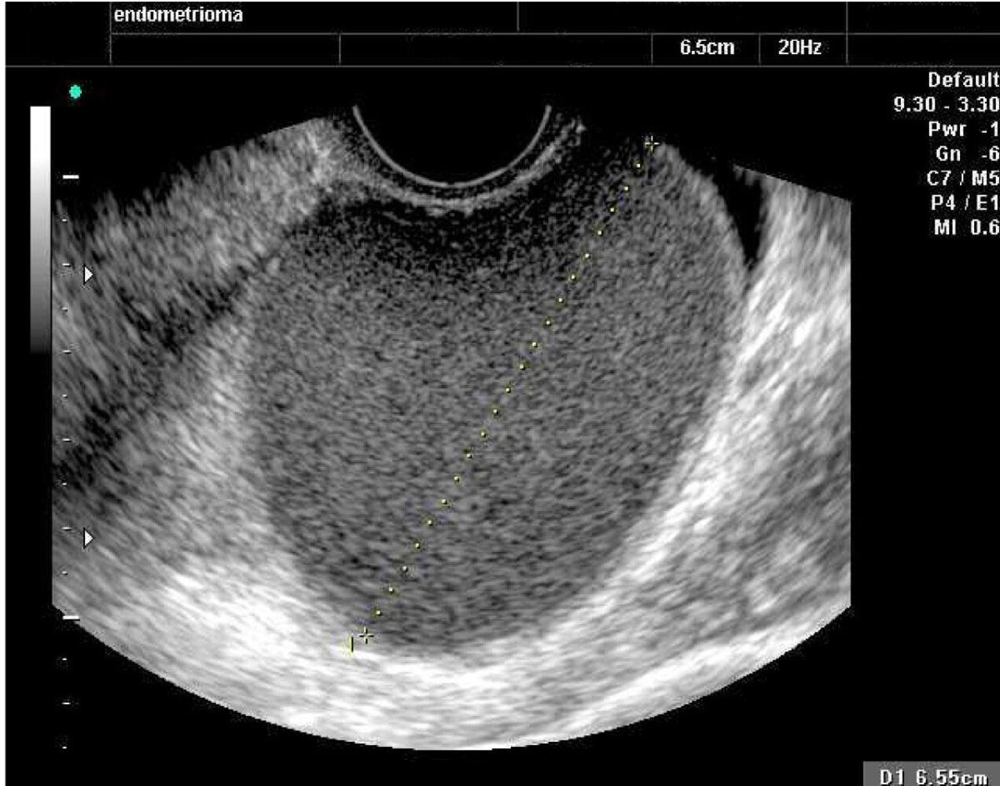
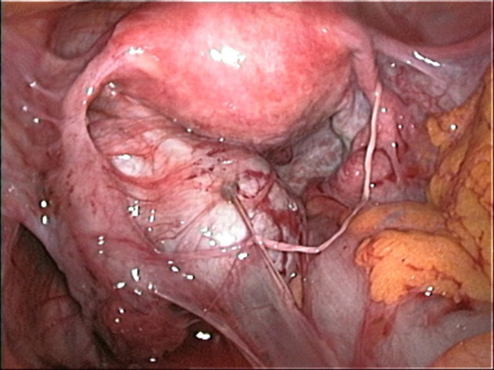
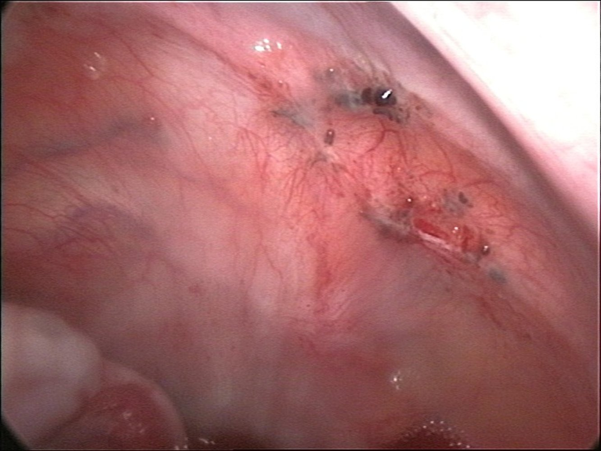
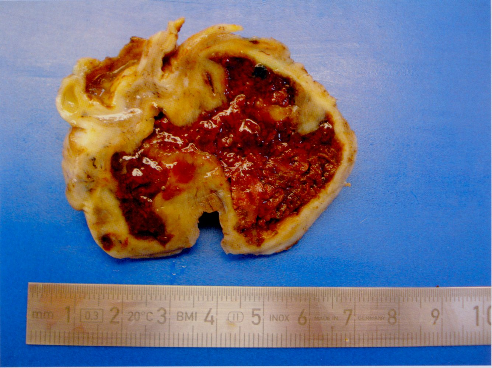
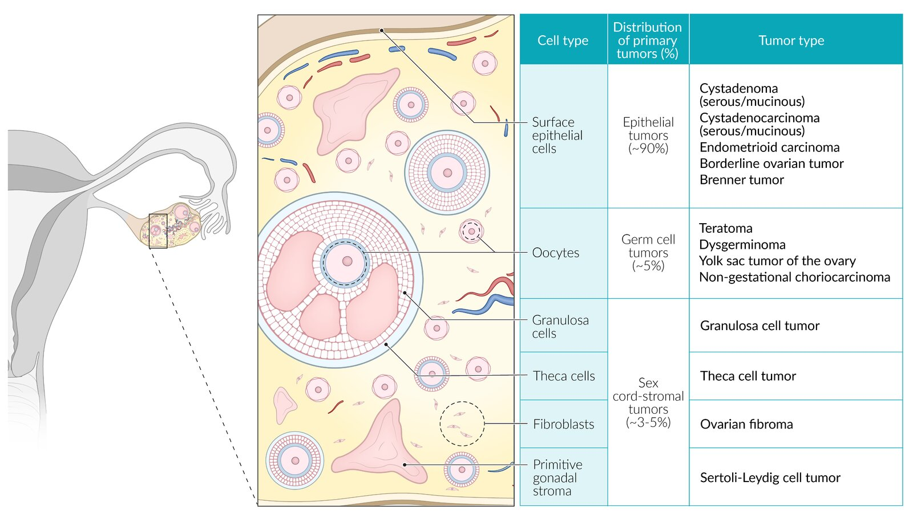
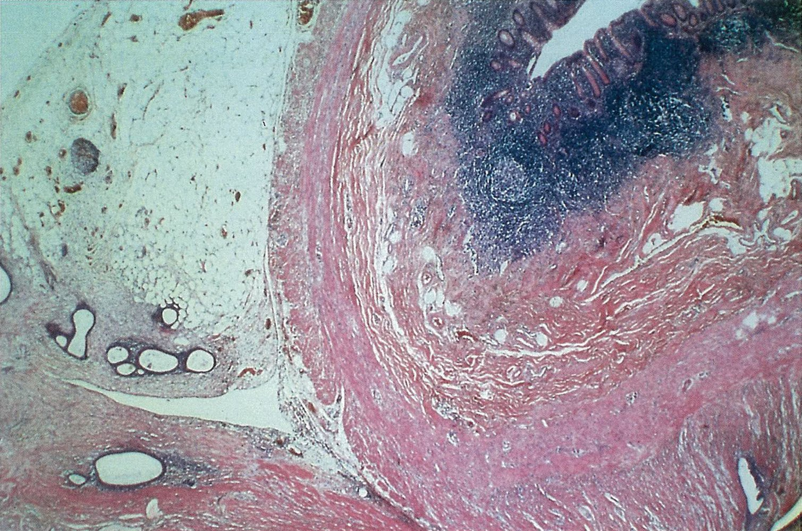

# Endometriosis

*Categories: Clinical knowledge > Emergency medicine > Gynecologic and obstetric disorders > Endometriosis*

[Original Article Link](https://coursology-qbank.com/amboss/article/-k0DqT)

---

## Summary

Endometriosis is a common chronic disease in individuals of reproductive age characterized by growth of benign <u>endometrial</u>-like tissue outside the <u>uterus</u>. The exact etiology of endometriosis is unclear, but retrograde <u>menstruation</u> may be involved. Symptoms include <u>dysmenorrhea</u>, <u>abnormal uterine bleeding</u>, <u>dyspareunia</u>, chronic <u>pelvic pain</u>, and <u>infertility</u>. Endometriosis is difficult to diagnose, but initial imaging with <u>transvaginal ultrasound</u> or <u>MRI</u> may help identify lesions. Definitive diagnosis is based on <u>laparoscopy</u> but is not required to begin treatment. Initial medical treatment includes <u>hormonal contraceptives</u> and <u>NSAIDs</u>. Referral to gynecology is recommended in diagnostic uncertainty, <u>adolescent</u> patients, refractory disease, and/or patients desiring <u>pregnancy</u>. Advanced treatments include <u>GnRH agonists</u>, <u>GnRH antagonists</u>, and surgical therapies.

---

## Etiology

* The etiology of endometriosis is not yet fully understood; however, retrograde <u>menstruation</u>  seems to play a major role in the pathogenesis of endometriosis.

* Other contributing factors include:

* Coelomic <u>metaplasia</u>

* <u>Iatrogenic</u> implantation

* Hematogenic and lymphogenic dissemination of <u>endometrial</u> cells

* Hereditary component

* <u>Risk factors</u> [[1]](https://coursology-qbank.com/amboss/article/eJ1xG30)

* <u>Nulliparity</u>

* Prolonged exposure to <u>endogenous</u> <u>estrogen</u> (early <u>menarche</u>, late <u>menopause</u>)

* Short <u>menstrual cycles</u> (< 27 days)

* <u>Menorrhagia</u> (> 1 week)

* <u>Family history</u>

---

## Pathophysiology

* In endometriosis, <u>endometrial</u>-like tissue grows outside of the <u>uterus</u>.

* Common locations of endometriotic lesions include:

* <u>Pelvic</u> organs

* <u>Ovaries</u>: most common site; often affected bilaterally

* <u>Rectouterine pouch</u>

* <u>Fallopian tubes</u>

* <u>Bladder</u>

* <u>Cervix</u>

* <u>Peritoneum</u>

* Extrapelvic organs (e.g., <u>lung</u> or <u>diaphragm</u>): less commonly affected

* Regardless of where the <u>endometrial</u> tissue is located, it reacts to the <u>hormone</u> cycle;  in much the same way as the <u>endometrium</u> and proliferates under the influence of <u>estrogen</u>.

* Endometriotic lesions result in:

* ↑ Production of inflammatory and <u>pain</u> mediators

* Anatomical changes (e.g., <u>pelvic</u> adhesions) → <u>infertility</u>

* Nerve dysfunction

---

## Clinical features

### Clinical features by anatomic location

| Clinical features of endometriosis |  |
| --- | --- |
| Location of endometriosis lesions | Clinical features |
| General |   * Approx. one-fourth of affected individuals are asymptomatic. [[2]](https://coursology-qbank.com/amboss/article/FGXga-)  * Chronic <u>pelvic pain</u>   * Characteristically worsens before the onset of <u>menses</u>  * Can be constant, intermittent, cyclic, or acyclic [[3]](https://coursology-qbank.com/amboss/article/E4d8OJ0)  * <u>Infertility</u>  [[2]](https://coursology-qbank.com/amboss/article/FGXga-)  * <u>Dysmenorrhea</u>  * Pre- or postmenstrual bleeding  * <u>Dyspareunia</u>    |
|  <u>Uterus</u> (common) |  * Uterosacral tenderness and/or nodularity [[4]](https://coursology-qbank.com/amboss/article/PGXWzz)   |
|  <u>Ovaries</u> (common) |   * <u>Lateral</u> <u>pelvic pain</u>  * <u>Back pain</u>    |
|  <u>Urinary tract</u> [[5]](https://coursology-qbank.com/amboss/article/bo1H030)  |   * <u>Dysuria</u>  * Cyclic <u>hematuria</u>  * Suprapubic tenderness and/or <u>pain</u>  * <u>Recurrent UTIs</u>  * <u>Urinary incontinence</u>    |
| Intestines |   * <u>Dyschezia</u>  * <u>Diarrhea</u>  * <u>Constipation</u>  * <u>Rectal bleeding</u>    |
|  Abdominal wall (rare) |  * Painful, palpable abdominal mass   |
|  Thorax (rare) |   * <u>Chest pain</u>  * Scapular and/or cervical <u>pain</u>  * <u>Pneumothorax</u>  * <u>Hemothorax</u>  * <u>Hemoptysis</u>    |

> [!TIP]
> Endometriosis is often asymptomatic and may be an incidental finding during <u>surgery</u> for other conditions.

### Examination findings [[1]](https://coursology-qbank.com/amboss/article/eJ1xG30)[[3]](https://coursology-qbank.com/amboss/article/E4d8OJ0)[[6]](https://coursology-qbank.com/amboss/article/v4dAOJ0)

<u>Pelvic examination</u> may show the following:

* <u>Adnexal masses</u> and/or tenderness

* Indurated rectovaginal septum

* <u>Lateral</u> displacement of the <u>cervix</u> (due to uterosacral scarring) [[7]](https://coursology-qbank.com/amboss/article/OkdILJ0)

---

## Diagnosis

The clinical features of endometriosis are extremely varied; maintain a low threshold for obtaining diagnostic studies and starting treatment, particularly in patients with refractory <u>primary dysmenorrhea</u>. [[3]](https://coursology-qbank.com/amboss/article/E4d8OJ0)

### Approach [[1]](https://coursology-qbank.com/amboss/article/eJ1xG30)[[3]](https://coursology-qbank.com/amboss/article/E4d8OJ0)[[6]](https://coursology-qbank.com/amboss/article/v4dAOJ0)

* Rule out <u>differential diagnoses of endometriosis</u>; consider the following based on symptoms: [[1]](https://coursology-qbank.com/amboss/article/eJ1xG30)

* <u>CBC</u>

* <u>Urinalysis</u>

* <u>Screening for chlamydia</u> and <u>screening for gonorrhea</u>

* Consider starting treatment while awaiting diagnostic studies.  [[6]](https://coursology-qbank.com/amboss/article/v4dAOJ0)

* Obtain initial imaging: <u>transvaginal ultrasound</u> (<u>TVUS</u>) or <u>MRI</u>

* Consider referral to <u>obstetrics and gynecology</u> for confirmatory <u>laparoscopy</u>.

> [!TIP]
> <u>CA-125</u> levels may be elevated in endometriosis. However, this finding is nonspecific and thus not recommended for diagnosis. [[6]](https://coursology-qbank.com/amboss/article/v4dAOJ0)[[8]](https://coursology-qbank.com/amboss/article/Xo19030)

### Imaging [[9]](https://coursology-qbank.com/amboss/article/z4drNJ0)

* <u>TVUS</u> (with or without transabdominal <u>ultrasound</u>) is frequently used for the initial study. ;  [[6]](https://coursology-qbank.com/amboss/article/v4dAOJ0)

* May show ovarian <u>endometriomas</u> (<u>chocolate cysts</u>)

* May show signs of rectosigmoid endometriosis (e.g., loss of <u>uterine sliding sign</u>)

* Depending on disease location and severity, examination findings may appear normal.  [[6]](https://coursology-qbank.com/amboss/article/v4dAOJ0)[[9]](https://coursology-qbank.com/amboss/article/z4drNJ0)

* Obtain <u>MRI</u> <u>pelvis</u> with and without IV contrast if <u>ultrasound</u> findings are normal or equivocal and:

* <u>Surgery</u> is being considered

* <u>Deep infiltrating endometriosis</u> is suspected [[1]](https://coursology-qbank.com/amboss/article/eJ1xG30)

> [!WARNING]
> Normal findings from <u>pelvic examination</u> or imaging do not rule out endometriosis. [[10]](https://coursology-qbank.com/amboss/article/1Rd2Np0)

### <u>Laparoscopy</u> [[1]](https://coursology-qbank.com/amboss/article/eJ1xG30)[[3]](https://coursology-qbank.com/amboss/article/E4d8OJ0)

* <u>Laparoscopic</u> <u>biopsy</u> of endometriosis lesions is the only method for confirming endometriosis.

* <u>Laparoscopy</u> can be used for diagnosis and <u>surgical treatment of endometriosis</u> (if indicated).

* Diagnostic confirmation is not required to start treatment; use <u>shared decision-making</u> discussion to determine if <u>laparoscopy</u> is appropriate.  [[1]](https://coursology-qbank.com/amboss/article/eJ1xG30)[[3]](https://coursology-qbank.com/amboss/article/E4d8OJ0)

> [!TIP]
> <u>Laparoscopic</u> findings rarely correspond to symptom severity. [[10]](https://coursology-qbank.com/amboss/article/1Rd2Np0)

Endometrioma (chocolate cyst)

Endometriosis

Peritoneal endometriosis

---

## Pathology

### Macroscopic findings

* <u>Endometrium</u>: <u>endometrial</u> lesions that present as yellow-brown (sometimes reddish-blue) blebs, islands, or pinpoint spots

* <u>Ovaries</u>

* Gunshot lesions or powder-burn lesions

* Black, yellow-brown, or bluish <u>nodules</u> or cystic structures

* Seen on the serosal surfaces of the <u>ovaries</u> and <u>peritoneum</u>

* Ovarian <u>endometriomas</u> or chocolate cysts; : cyst-like structures that contain blood, fluid, and menstrual debris

* <u>Fallopian tubes</u>: salpingitis isthmica nodosa
* Nodular tube changes, resulting in:

* ↑ Risk of sterility and <u>ectopic</u> <u>pregnancy</u>

* ↓ Transmittance

Chocolate cyst in endometriosis

### Microscopic findings

* Normal <u>endometrial</u> glands

* Normal <u>endometrial</u> stroma

* Preponderance of <u>hemosiderin</u> laden <u>macrophages</u> due to cyclic hemorrhages into <u>endometriomas</u>

Ovarian endometriosis

Endometriosis of the appendix

---

## Differential diagnoses

For more information, see:

* <u>Common causes of secondary dysmenorrhea</u>

* <u>Vaginal bleeding in nonpregnant adults</u>

* <u>Causes of pelvic pain</u>

* <u>Infertility</u>

The differential diagnoses listed here are not exhaustive.

---

## Treatment

Management of endometriosis is challenging and should be individualized based on the patient's symptoms, reproductive plans, and tolerance of risks and/or adverse effects. [[6]](https://coursology-qbank.com/amboss/article/v4dAOJ0)

### Approach [[1]](https://coursology-qbank.com/amboss/article/eJ1xG30)[[3]](https://coursology-qbank.com/amboss/article/E4d8OJ0)[[6]](https://coursology-qbank.com/amboss/article/v4dAOJ0)

* Identify and treat associated complications (e.g., <u>anemia</u>).

* Start <u>chronic noncancer pain management</u> as needed.

* Patients trying to conceive: Refer directly to gynecology.

* Patients not trying to get pregnant:

* Start <u>initial medical therapy for endometriosis</u>.

* Refer to gynecology for advanced treatment based on the following criteria:

* Onset in <u>adolescence</u>  [[3]](https://coursology-qbank.com/amboss/article/E4d8OJ0)

* Diagnostic uncertainty and/or further workup required

* <u>Endometrioma</u> identified on imaging in a patient without confirmed endometriosis  [[1]](https://coursology-qbank.com/amboss/article/eJ1xG30)

* Refractory symptoms

* Evidence of extrapelvic disease [[1]](https://coursology-qbank.com/amboss/article/eJ1xG30)

* Regularly reassess for changes in symptoms or <u>reproductive life plan</u>, and refer to gynecology as needed.

> [!TIP]
> A presumed <u>clinical diagnosis</u> of endometriosis is sufficient to begin treatment. [[6]](https://coursology-qbank.com/amboss/article/v4dAOJ0)

### Initial medical therapy for endometriosis

* <u>Hormonal contraceptives</u>: Continue until <u>pregnancy</u> is desired or average age of <u>menopause</u>. [[6]](https://coursology-qbank.com/amboss/article/v4dAOJ0)

* Preferred: continuous <u>combined hormonal contraceptives</u> (<u>CHCs</u>), e.g., <u>levonorgestrel</u>/<u>ethinyl estradiol</u> (<u>off-label</u>) DOSAGE  [[11]](https://coursology-qbank.com/amboss/article/7Nd4cq0)[[12]](https://coursology-qbank.com/amboss/article/NNd-Yq0)

* Alternative: treatment with <u>progestins</u>

* <u>Progestin-only pill</u> (e.g., <u>norethindrone</u> acetate DOSAGE)

* Subcutaneous <u>depot medroxyprogesterone acetate</u> DOSAGE

* <u>Levonorgestrel IUD</u> (<u>off-label</u>)

* <u>NSAIDs</u> (e.g., <u>naproxen</u>): may be used in combination with <u>hormonal contraceptives</u> (for dosages, see “<u>Oral analgesia</u>”)  [[6]](https://coursology-qbank.com/amboss/article/v4dAOJ0)[[13]](https://coursology-qbank.com/amboss/article/akdQmJ0)

> [!TIP]
> Medical therapy reduces <u>pain</u> from endometriosis but does not improve <u>fertility</u>. [[1]](https://coursology-qbank.com/amboss/article/eJ1xG30)

### Advanced treatment [[1]](https://coursology-qbank.com/amboss/article/eJ1xG30)[[3]](https://coursology-qbank.com/amboss/article/E4d8OJ0)[[6]](https://coursology-qbank.com/amboss/article/v4dAOJ0)

Refer patients to gynecology for advanced treatments.

#### Advanced medical treatments [[1]](https://coursology-qbank.com/amboss/article/eJ1xG30)[[3]](https://coursology-qbank.com/amboss/article/E4d8OJ0)[[6]](https://coursology-qbank.com/amboss/article/v4dAOJ0)

* Indications

* Initial medical therapy (hormonal treatment and <u>NSAIDs</u>) is ineffective or not tolerated.

* Extrapelvic disease  [[1]](https://coursology-qbank.com/amboss/article/eJ1xG30)

* Options: The following medications inhibit the growth of <u>endometrial</u> tissue by suppressing <u>estrogen</u>.

* <u>GnRH agonists</u> (e.g., <u>goserelin</u>) OR <u>GnRH antagonists</u> (e.g., <u>elagolix</u>)

* Treatment duration 6–24 months  [[1]](https://coursology-qbank.com/amboss/article/eJ1xG30)[[6]](https://coursology-qbank.com/amboss/article/v4dAOJ0)

* May be combined with add-back <u>hormonal contraceptives</u> to mitigate hypoestrogenic effects

* <u>Danazol</u>

* Severe or refractory disease: <u>aromatase inhibitors</u> (e.g., <u>anastrozole</u>)

#### <u>Management of infertility</u> [[1]](https://coursology-qbank.com/amboss/article/eJ1xG30)[[6]](https://coursology-qbank.com/amboss/article/v4dAOJ0)[[8]](https://coursology-qbank.com/amboss/article/Xo19030)

* Mild disease: Consider <u>laparoscopy</u>.  [[14]](https://coursology-qbank.com/amboss/article/ModMcI0)

* Moderate or severe disease: Consider <u>IVF</u> as first-line therapy.  [[1]](https://coursology-qbank.com/amboss/article/eJ1xG30)[[6]](https://coursology-qbank.com/amboss/article/v4dAOJ0)

#### Surgical treatment of endometriosis [[1]](https://coursology-qbank.com/amboss/article/eJ1xG30)[[15]](https://coursology-qbank.com/amboss/article/6odj1I0)

* <u>Laparoscopic</u> excision and/or <u>ablation</u> of <u>endometrial</u> lesions may be considered in patients with:   [[1]](https://coursology-qbank.com/amboss/article/eJ1xG30)[[6]](https://coursology-qbank.com/amboss/article/v4dAOJ0)

* Disease refractory to medical management

* <u>Infertility</u> with mild disease [[6]](https://coursology-qbank.com/amboss/article/v4dAOJ0)

* <u>Hysterectomy</u> with or without bilateral <u>salpingo-oophorectomy</u> may be considered in patients with both of the following:

* No desire for future <u>pregnancy</u>

* Disease refractory to all treatments

> [!WARNING]
> Symptoms may persist or recur after <u>laparoscopic</u> treatments and/or <u>hysterectomy</u>. Consider medical therapy after <u>surgery</u> to reduce the risk of symptom recurrence. [[1]](https://coursology-qbank.com/amboss/article/eJ1xG30)[[6]](https://coursology-qbank.com/amboss/article/v4dAOJ0)

---

## Complications

* <u>Anemia</u>

* Endometriosis in the uterotubal junction inhibits implantation of the <u>zygote</u>: ↑ risk of <u>ectopic pregnancy</u>  [[16]](https://coursology-qbank.com/amboss/article/lWYvlL)

* Endometriosis → fibrous adhesions → strictures and entrapment of organs

* Intestines: <u>constipation</u> or <u>diarrhea</u>; in rare cases, <u>intestinal obstruction</u>, <u>ileus</u>, or <u>intussusception</u> may occur [[17]](https://coursology-qbank.com/amboss/article/mZYVXn)

* <u>Ureter</u>: <u>urine retention</u>

* Endometriosis is associated with a slightly elevated risk of <u>ovarian cancer</u>. [[18]](https://coursology-qbank.com/amboss/article/6VXjvC)

* <u>Infertility</u> [[6]](https://coursology-qbank.com/amboss/article/v4dAOJ0)

We list the most important complications. The selection is not exhaustive.

---