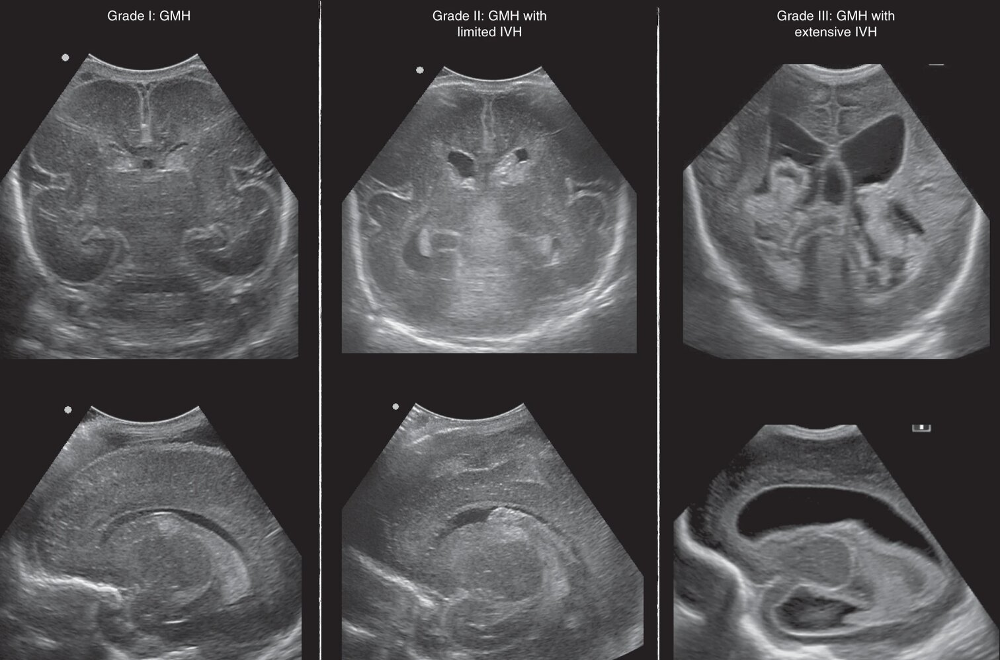
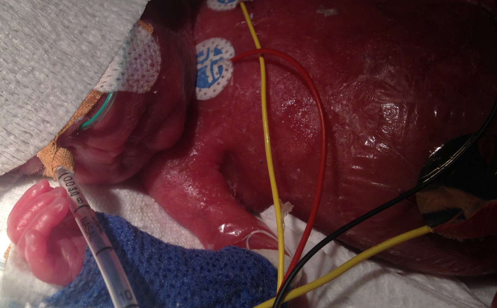
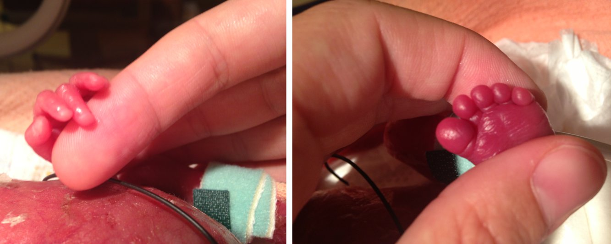

# Preterm labor and birth

*Categories: Clinical knowledge > Emergency medicine > Gynecologic and obstetric disorders > Preterm labor and birth*

[Original Article Link](https://coursology-qbank.com/amboss/article/Fo0gdS)

---

## Summary

<u>Preterm labor</u> is defined as regular uterine contractions and cervical changes before 37 weeks' <u>gestation</u>. <u>Preterm birth</u> is defined as <u>live birth</u> between 20 0/7 weeks and 36 6/7 weeks' <u>gestation</u>. <u>Risk factors for preterm labor</u> include a previous <u>preterm birth</u>, a <u>short cervical length</u> during <u>pregnancy</u>, and <u>multiple gestations</u>. Diagnosis is usually based on the presence of regular contractions, <u>cervical effacement</u>, and/or <u>rupture of membranes</u>. The risk of impending delivery may be assessed by cervical length <u>ultrasonography</u> and <u>fetal fibronectin test</u>. Management depends on <u>gestational age</u> and can include <u>tocolysis</u>, antenatal <u>steroids</u> to improve <u>fetal lung maturity</u>, and <u>magnesium sulfate</u> for <u>fetal neuroprotection</u>. <u>Tocolytics</u> may be used for short-term prolongation of <u>pregnancy</u> to allow time for <u>steroids</u> and <u>magnesium sulfate</u> to take effect and for transportation to an appropriate hospital. Fetal <u>complications of preterm birth</u> include <u>intraventricular hemorrhage</u>, <u>neonatal respiratory distress syndrome</u>, and <u>necrotizing enterocolitis</u>. Strategies for prevention of <u>preterm birth</u> include reduction in <u>modifiable risk factors</u>, <u>screening for short cervical length</u>, and <u>management of cervical insufficiency</u> and <u>short cervical length</u> (e.g., with <u>progesterone supplementation</u>).

---

## Definitions

* Preterm labor: regular uterine contractions with <u>cervical effacement</u>, dilation, or both before 37 weeks' <u>gestation</u> [[1]](https://coursology-qbank.com/amboss/article/ZsXZtz)

* Preterm birth

* <u>Live birth</u> between 20 0/7 weeks' and 36 6/7 weeks' <u>gestation</u>

* WHO subcategories [[2]](https://coursology-qbank.com/amboss/article/oqa0zl)

* Extremely preterm (< 28 weeks)

* Very preterm (28 to < 32 weeks)

* Moderate to late preterm (32 to < 37 weeks)

---

## Etiology

The exact mechanisms underlying <u>premature labor</u> are not well understood, but certain <u>risk factors</u> have been identified. [[5]](https://coursology-qbank.com/amboss/article/W_cPMU0)[[6]](https://coursology-qbank.com/amboss/article/fXWkxP0)

### <u>Nonmodifiable risk factors</u>

* History of <u>preterm birth</u> (greatest <u>risk factor</u>)

* <u>Cervical insufficiency</u>

* History of cervical <u>surgery</u> (e.g., <u>conization</u>)

* <u>Short cervical length</u>

* <u>Multiple gestations</u>

* <u>Polyhydramnios</u>

* <u>Preterm premature rupture of membranes</u> (<u>PPROM</u>)

* <u>Antepartum hemorrhage</u> caused by:

* <u>Placenta previa</u>

* <u>Placental abruption</u>

* Uterine anomalies (e.g., <u>anomalies of Mullerian duct fusion</u>, <u>uterine fibroids</u>)

* Black individuals of non-Hispanic origin [[7]](https://coursology-qbank.com/amboss/article/oeW0-40)

* Congenital abnormalities of the fetus [[8]](https://coursology-qbank.com/amboss/article/TXW6xP0)

### <u>Modifiable risk factors</u>

* Maternal and fetal conditions

* Infections (e.g., <u>urinary tract infections</u>, <u>STIs</u>, vaginal infections )

* Trauma (e.g., <u>intimate partner violence</u>) [[9]](https://coursology-qbank.com/amboss/article/ex1xvQ0)

* <u>Hypertensive pregnancy disorders</u> (e.g., <u>preeclampsia</u>, <u>HELLP syndrome</u>)

* <u>Diabetes mellitus</u>, <u>gestational diabetes</u>

* Lifestyle and environmental factors

* Smoking

* Substance use (e.g., <u>heavy alcohol use</u>, <u>heroin</u>, <u>cocaine</u>)

* Maternal or fetal <u>stress</u>

* Maternal age (≤ 18 years, > 35 years) [[10]](https://coursology-qbank.com/amboss/article/drboTE)

* Low maternal prepregnancy weight

* Short interval between <u>pregnancies</u> (< 18 months) [[5]](https://coursology-qbank.com/amboss/article/W_cPMU0)

---

## Clinical features

* Regular uterine contractions and associated symptoms of <u>labor</u> (e.g., <u>lower back pain</u>)

* Loss of mucus plug (<u>bloody show</u>)

* <u>Cervical effacement</u> and/or <u>cervical dilation</u>

* <u>Rupture of membranes</u>

* See “<u>First stage of labor</u>.”

> [!WARNING]
> To decrease the risk of infection, avoid digital cervical examinations until <u>PPROM</u> has been ruled out. [[5]](https://coursology-qbank.com/amboss/article/W_cPMU0)[[11]](https://coursology-qbank.com/amboss/article/R8Xlm-)

---

## Diagnosis

The diagnosis of <u>preterm labor</u> is made clinically based on <u>preterm contractions and cervical changes</u>. The presence of <u>risk factors for preterm labor</u> can help establish the diagnosis. <u>Fetal fibronectin</u> levels and cervical length measurements can help assess the risk of impending delivery.

### Initial evaluation [[1]](https://coursology-qbank.com/amboss/article/ZsXZtz)[[5]](https://coursology-qbank.com/amboss/article/W_cPMU0)

* Evaluate for <u>clinical features of preterm labor</u>.

* Determine <u>gestational age</u>.

* Perform sterile <u>speculum examination</u>.

* Evaluate for <u>cervical effacement</u> and/or <u>cervical dilation</u>.  [[5]](https://coursology-qbank.com/amboss/article/W_cPMU0)

* Assess for <u>rupture of membranes</u>, e.g. by performing the <u>fern test</u>.

* Obtain <u>vaginal swabs</u> for additional <u>laboratory studies</u>.

* Perform <u>fetal status assessment</u>.

### <u>Laboratory studies</u> [[1]](https://coursology-qbank.com/amboss/article/ZsXZtz)[[5]](https://coursology-qbank.com/amboss/article/W_cPMU0)

* Cervicovaginal fetal fibronectin (fFN) test 

* Used to help differentiate between true <u>preterm labor</u> and <u>false labor</u>  [[5]](https://coursology-qbank.com/amboss/article/W_cPMU0)

* Elevated levels in cervical secretions are associated with an increased risk of <u>preterm delivery</u>.   [[5]](https://coursology-qbank.com/amboss/article/W_cPMU0)[[12]](https://coursology-qbank.com/amboss/article/LXWwAP0)

* To rule out infections:

* Prenatal screening for <u>group B Streptococcus</u> (<u>GBS</u>)

* <u>STI screening</u>, if indicated (see “Indications for third-trimester <u>STI screening</u>”)

* <u>Urinalysis</u> and <u>urine culture</u>

### <u>Ultrasound</u> [[5]](https://coursology-qbank.com/amboss/article/W_cPMU0)[[13]](https://coursology-qbank.com/amboss/article/iz1Jsj0)

* <u>Transvaginal ultrasound</u>: Cervical length > 3 cm indicates a low likelihood of delivery within 14 days. [[5]](https://coursology-qbank.com/amboss/article/W_cPMU0)

* <u>Obstetric ultrasound</u>

* Identifies fetal, <u>placental</u>, or maternal anatomical abnormalities

* Measures fetal <u>gestational age</u> and weight

* Confirms <u>fetal position</u> and <u>fetal presentation</u>

* Determines <u>amniotic fluid index</u>

> [!TIP]
> As cervical length and <u>fetal fibronectin</u> levels each have a low <u>positive predictive value</u>, neither should be used in isolation to assess the risk of <u>preterm delivery</u>. [[1]](https://coursology-qbank.com/amboss/article/ZsXZtz)

---

## Treatment

### Approach [[1]](https://coursology-qbank.com/amboss/article/ZsXZtz)[[5]](https://coursology-qbank.com/amboss/article/W_cPMU0)

* All patients < 37 weeks' <u>gestation</u>

* Consult <u>OB/GYN</u> to determine the appropriate management.

* Administer <u>group B streptococcus prophylaxis</u>, if indicated (see “<u>GBS prophylaxis considerations in preterm labor</u>”).

* Prepare for immediate care for the <u>newborn</u> and possible <u>neonatal resuscitation</u>.

* If necessary, initiate transfer to a hospital able to provide maternal and neonatal care.

* 34 0/7 to 36 6/7 weeks' <u>gestation</u>

* Proceed with <u>normal labor and delivery</u>.

* Consider <u>steroids</u> for <u>induction of fetal lung maturity</u>.

* < 34 weeks' <u>gestation</u>

* Consider <u>tocolysis</u> to inhibit uterine contractions in consultation with <u>OB/GYN</u>.

* Administer <u>steroids</u> for <u>induction of fetal lung maturity</u>.

* Administer <u>antibiotic prophylaxis for PPROM</u>.

* < 32 weeks' <u>gestation</u>

* Administer <u>magnesium sulfate</u> for <u>fetal neuroprotection</u>.

* Administer <u>steroids</u> for <u>induction of fetal lung maturity</u>.

> [!WARNING]
> Activity restriction, including bed rest, is not routinely recommended and may result in adverse outcomes. [[1]](https://coursology-qbank.com/amboss/article/ZsXZtz)[[14]](https://coursology-qbank.com/amboss/article/4z13Gj0)

### Tocolysis [[1]](https://coursology-qbank.com/amboss/article/ZsXZtz)[[5]](https://coursology-qbank.com/amboss/article/W_cPMU0)[[15]](https://coursology-qbank.com/amboss/article/N0W-TP0)

#### Overview

* Definition: administration of <u>tocolytics</u> to inhibit uterine contractions [[16]](https://coursology-qbank.com/amboss/article/2sXT8z)

* Goal: prolonging <u>pregnancy</u> to allow for <u>induction of fetal lung maturity</u> and/or transfer to another medical center, if necessary

* Duration: up to 48 hours

* Contraindications

* Maternal-specific drug contraindications

* <u>Nonreassuring fetal cardiotocography</u>

* <u>Intrauterine fetal demise</u>

* <u>Chorioamnionitis</u>

* <u>Antepartum hemorrhage</u> with <u>hemodynamic instability</u>

* <u>Severe preeclampsia</u> or <u>eclampsia</u>

* Lethal fetal anomaly

> [!WARNING]
> Do not delay <u>labor</u> by administering <u>tocolytics</u> if there is evidence of <u>fetal demise</u>, abruption, <u>eclampsia</u>, or intrauterine infection. [[17]](https://coursology-qbank.com/amboss/article/AN1Rdh0)

> [!WARNING]
> Long-term use of <u>tocolytics</u> does not prevent <u>preterm birth</u> and does not improve neonatal outcomes. [[1]](https://coursology-qbank.com/amboss/article/ZsXZtz)

#### Options

|  Tocolytics  [[1]](https://coursology-qbank.com/amboss/article/ZsXZtz)[[18]](https://coursology-qbank.com/amboss/article/KXWU_P0)[[19]](https://coursology-qbank.com/amboss/article/pXWL_P0)  |  |  |
| --- | --- | --- |
| Medication | Maternal adverse effects | Fetal adverse effects |
| <u>Nifedipine</u> (<u>calcium channel blocker</u>) |   * <u>Hypotension</u>  * <u>Dizziness</u>  * Flushing    |  * No known adverse effects   |
| <u>Indomethacin</u> (<u>NSAID</u>) |   * Esophageal reflux  * <u>Gastritis</u>  * <u>Nausea and vomiting</u>    |   * Renal dysfunction leading to <u>oligohydramnios</u>  * Premature <u>closure of the ductus arteriosus</u>    |
| <u>Terbutaline</u> (<u>beta-2 adrenergic agonist</u>) |  * Potentially severe cardiovascular and metabolic conditions, e.g.:  * <u>Hypokalemia</u>, <u>hyperglycemia</u>  * <u>Tachycardia</u>, <u>hypotension</u>  * <u>Pulmonary edema</u>  * <u>Myocardial</u> <u>ischemia</u>   |   * <u>Tachycardia</u>  * <u>Hypoglycemia</u>    |
| <u>Magnesium sulfate</u> |  * Signs of <u>magnesium toxicity</u>, e.g.:  * <u>Hypocalcemia</u>  * Respiratory <u>depression</u>  * <u>Pulmonary edema</u>   |  * Possibly skeletal abnormalities with prolonged use [[20]](https://coursology-qbank.com/amboss/article/JXWs_P0)   |

> [!TIP]
> There are no <u>FDA</u>-approved <u>tocolytic drugs</u>; all agents are used <u>off-label</u>.

### Induction of fetal lung maturity [[1]](https://coursology-qbank.com/amboss/article/ZsXZtz)[[21]](https://coursology-qbank.com/amboss/article/-N1Ddh0)

* Definition: administration of antenatal <u>steroids</u> to promote the production of <u>surfactant</u> and thereby improve neonatal survival and <u>fetal lung maturity</u>

* Indications

* Patients at 34 0/7 to 36 6/7 weeks' <u>gestation</u> if:

* <u>Steroids</u> not previously given

* No evidence of <u>chorioamnionitis</u>

* Delivery anticipated between 24 hours and 7 days

* Patients at 24 0/7 to 33 6/7 weeks' <u>gestation</u>

* Initial course: all patients at risk of delivery within 7 days

* Second course: patients at risk of delivery within 7 days whose prior course was > 14 days ago

* Options (<u>off-label use</u>)

* <u>Betamethasone</u> DOSAGE [[1]](https://coursology-qbank.com/amboss/article/ZsXZtz)

* <u>Dexamethasone</u> DOSAGE [[1]](https://coursology-qbank.com/amboss/article/ZsXZtz)

### Fetal neuroprotection

* Definition: administration of antenatal <u>magnesium sulfate</u> to reduce the risk and severity of neurological disorders (e.g., <u>cerebral palsy</u>) [[1]](https://coursology-qbank.com/amboss/article/ZsXZtz)

* Indication: <u>preterm labor</u> at < 32 weeks' <u>gestation</u>  [[5]](https://coursology-qbank.com/amboss/article/W_cPMU0)

* Dosing: Follow local protocols.  [[1]](https://coursology-qbank.com/amboss/article/ZsXZtz)

### <u>Antibiotics</u> [[1]](https://coursology-qbank.com/amboss/article/ZsXZtz)[[22]](https://coursology-qbank.com/amboss/article/m0WVgP0)

* Not recommended for the prevention of <u>preterm delivery</u>

* <u>Antibiotics</u> are indicated for:

* <u>GBS prophylaxis</u>

* <u>PPROM antibiotic prophylaxis</u>

---

## Complications

### Pulmonary and cardiovascular

* <u>Neonatal respiratory distress syndrome</u>

* <u>Patent ductus arteriosus</u> (<u>PDA</u>)

* <u>Bronchopulmonary dysplasia</u> (<u>BPD</u>)

### Neurological complications of prematurity

#### Periventricular leukomalacia (<u>PVL</u>)

* Definition: symmetrical, periventricular injury of cerebral <u>white matter</u> (<u>necrosis</u> and cystic formation) caused by <u>ischemia</u> and/or infection

* <u>Epidemiology</u>: mainly affects <u>premature infants</u>

* Clinical features: features of <u>spastic</u> <u>cerebral palsy</u>, intellectual impairment, and visual disturbances

* Diagnostics: <u>brain</u> imaging using <u>ultrasound</u>, <u>cranial</u> CT, or <u>MRI</u>

#### Intraventricular hemorrhage (<u>IVH</u>) [[23]](https://coursology-qbank.com/amboss/article/TsX68z)

* Definition: Bleeding into the ventricles from the germinal matrix, a highly vascularized region within the subventricular zone of the <u>brain</u> from which cells migrate out during <u>brain development</u>.

* Etiology: associated with a number of <u>risk factors</u>

* <u>Birth</u> weight < 1500 g and delivery before 32 weeks' <u>gestation</u> due to the fragility of the <u>germinal matrix</u> and/or impaired autoregulation of blood pressure

* Maternal <u>chorioamnionitis</u>

* <u>Hypoxia</u> during or after <u>birth</u>

* Pathophysiology

* Immaturity of the <u>basal lamina</u> and lack of astrocytic <u>glial fibrillary acidic protein</u> within the <u>germinal matrix</u> leads to abnormal <u>cerebral autoregulation</u>.

* Alterations in an <u>infant</u>'s blood pressure (e.g., during <u>birth</u>, <u>intubation</u>) → failure of <u>cerebral autoregulation</u> to compensate for the change in blood pressure → rupture of and bleeding from vessels in the germinal matrix → rupture of ependyma → blood flows into the ventricles

* Clinical features

* Usually occurs within the first days of life (up to day 5)

* Most <u>infants</u> are asymptomatic, but saltatory (for several days) or, more rarely, catastrophic (over minutes to hours) courses are also possible.

* <u>Lethargy</u>, <u>hypotonia</u>, irregular respirations, <u>seizures</u>, bulging <u>anterior fontanelle</u>

* <u>Cranial nerve</u> abnormalities (e.g., <u>pupils</u> react sluggishly to light) and changes in <u>eye</u> movement (e.g., <u>roving eye movements</u>)

* Signs of acute blood loss (e.g., <u>anemia</u>, <u>tachycardia</u>)

* Diagnostics

* <u>Cranial</u> <u>ultrasound</u>: allows grading of <u>IVH</u> based upon the location and extent to assess severity  [[24]](https://coursology-qbank.com/amboss/article/hsXcuz)

* Grade I: bleeding confined to <u>germinal matrix</u> and ≤ 10% of the ventricular area

* Grade II: 10–50% of the <u>lateral ventricle</u> volume occupied by <u>germinal matrix</u> and <u>IVH</u>

* Grade III: > 50% of the <u>lateral ventricle</u> volume occupied by <u>germinal matrix</u> and <u>IVH</u>, ventricular distortion

* Periventricular hemorrhagic <u>infarction</u>: hemorrhagic <u>infarction</u> in periventricular <u>white matter</u> <u>ipsilateral</u> to <u>IVH</u>

* Since most patients are asymptomatic, screening ultrasounds are routinely performed in <u>infants</u> with a <u>birth</u> weight < 1500 g and delivery before 30 weeks' <u>gestation</u>. [[25]](https://coursology-qbank.com/amboss/article/SsXy8z)

* Treatment

* Supportive

* <u>Lumbar puncture</u>, <u>diuretics</u>, and/or <u>ventriculoperitoneal shunt</u> in severe <u>IVH</u>

#### Other

* <u>Cerebral palsy</u>

* <u>Learning</u> disabilities

* <u>Developmental delays</u>

* <u>ADHD</u>

### <u>Homeostasis</u>

* Hypothermia of prematurity [[26]](https://coursology-qbank.com/amboss/article/Lc1w1f0)

* Definition: impaired ability to produce an adequate body temperature due to a high surface area: volume <u>ratio</u>

* Clinical features: body temperature < 36.5°C (< 97.7°F), <u>lethargy</u>, <u>cyanosis</u>

* Treatment: rewarming in an incubator or <u>radiant warmer</u>

* <u>Apnea</u>, <u>bradycardia</u>

* <u>Hypoglycemia</u>, <u>hyperglycemia</u>

### Other

* Anemia of prematurity

* Definition: impaired ability to produce adequate <u>erythropoietin</u> (<u>EPO</u>)

* Clinical features: usually asymptomatic, possible symptoms include <u>tachycardia</u>, poor weight gain, increased episodes of <u>apnea</u>

* Pathophysiology: onset of breathing and closure of <u>ductus arteriosus</u> → ↑ tissue oxygenation → ↓ <u>erythropoiesis</u>

* Diagnostics: should be suspected in <u>premature infants</u> with low <u>hemoglobin</u>, <u>hematocrit</u>, and <u>reticulocyte count</u>

* Treatment: <u>iron</u> supplementation, <u>blood transfusions</u> (severe cases)

* <u>Retinopathy of prematurity</u> (<u>ROP</u>)

* <u>Necrotizing enterocolitis</u> (<u>NEC</u>)

* Infection and <u>sepsis</u> (e.g., <u>neonatal sepsis</u>, <u>neonatal pneumonia</u>)

> [!NOTE]
> <u>Morbidity</u> and mortality in <u>preterm infants</u> increase with decreasing <u>birth</u> weight and <u>gestational age</u>.

Neonatal intraventricular hemorrhage (IVH)

Intubation of a premature infant born at 23 weeks of gestation

Hand and foot of a premature infant (in relation to adult fingers)

We list the most important complications. The selection is not exhaustive.

---