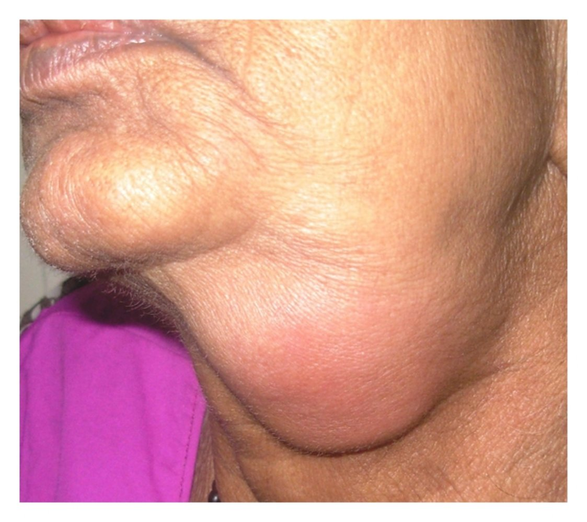
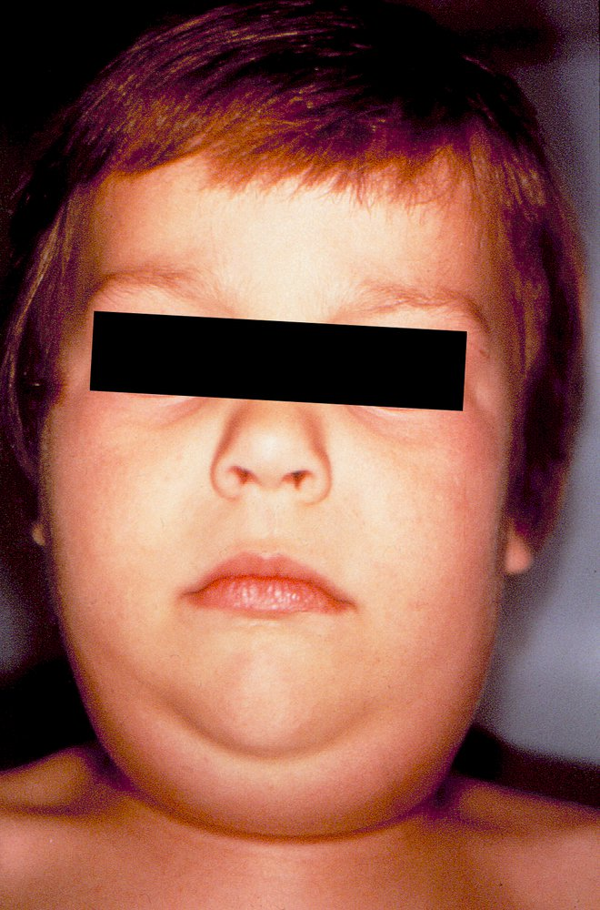
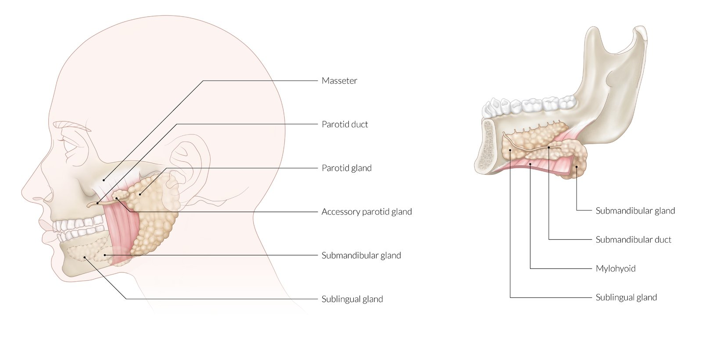
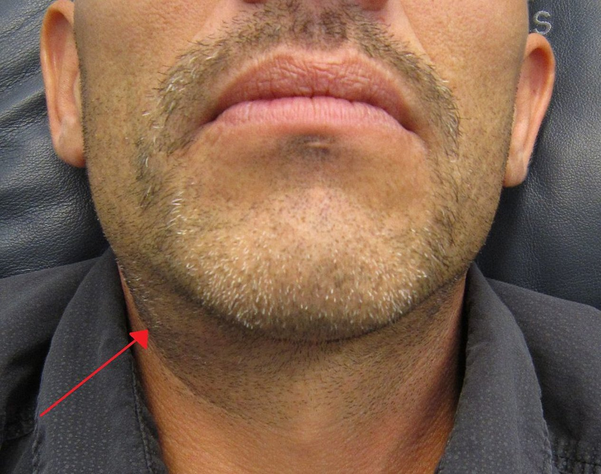
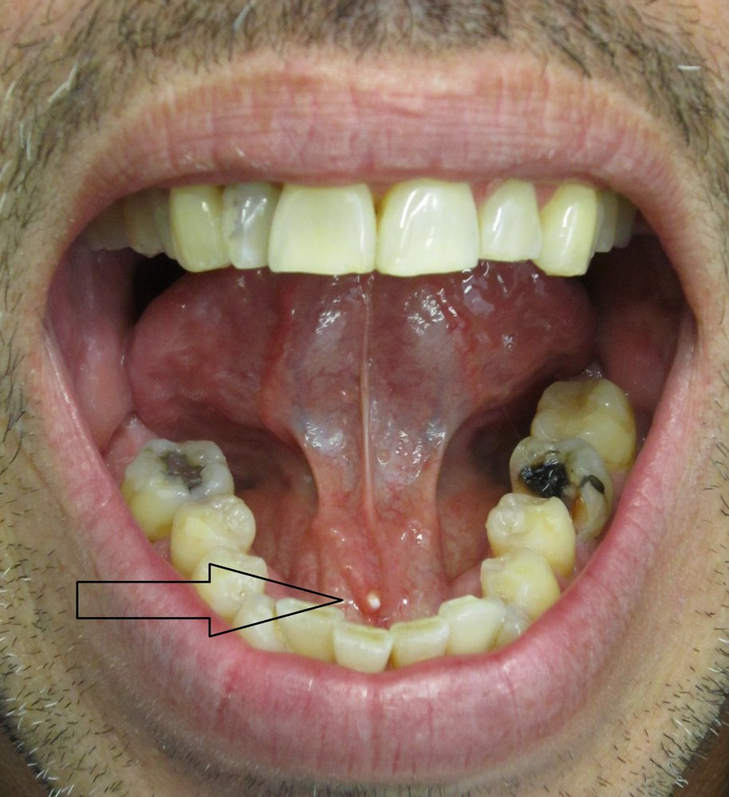
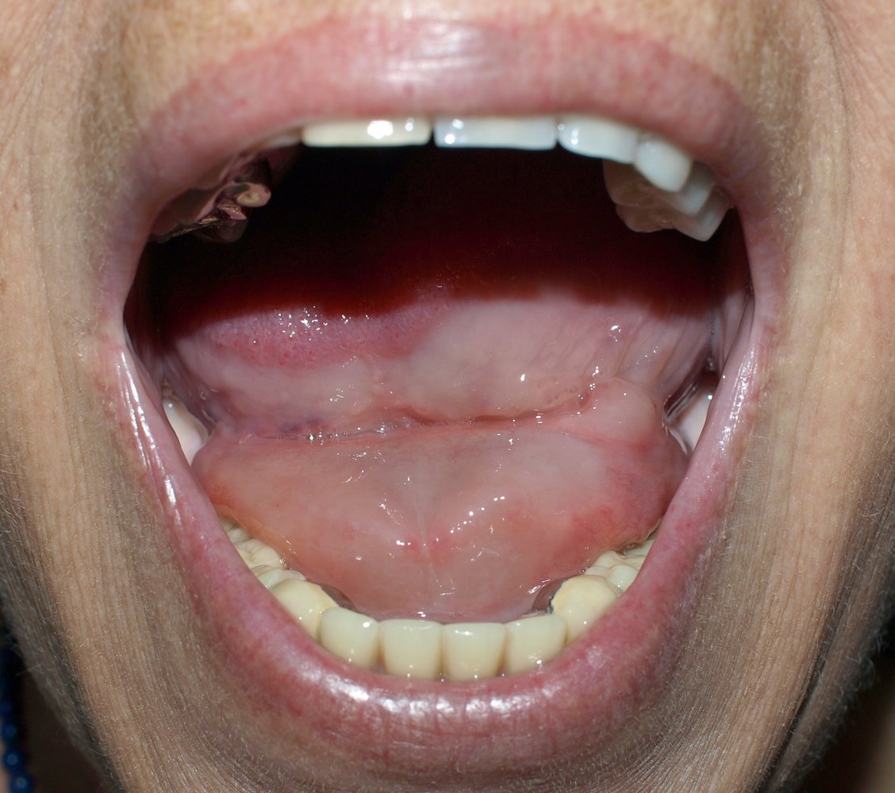
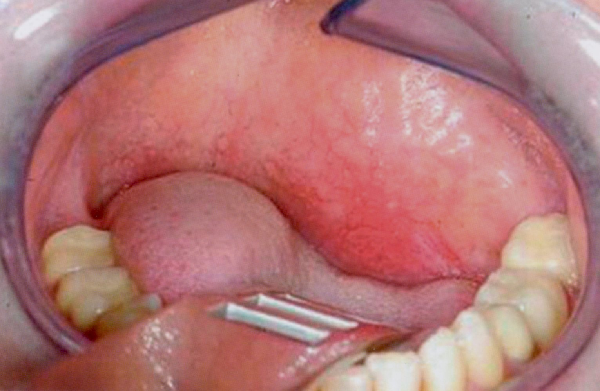
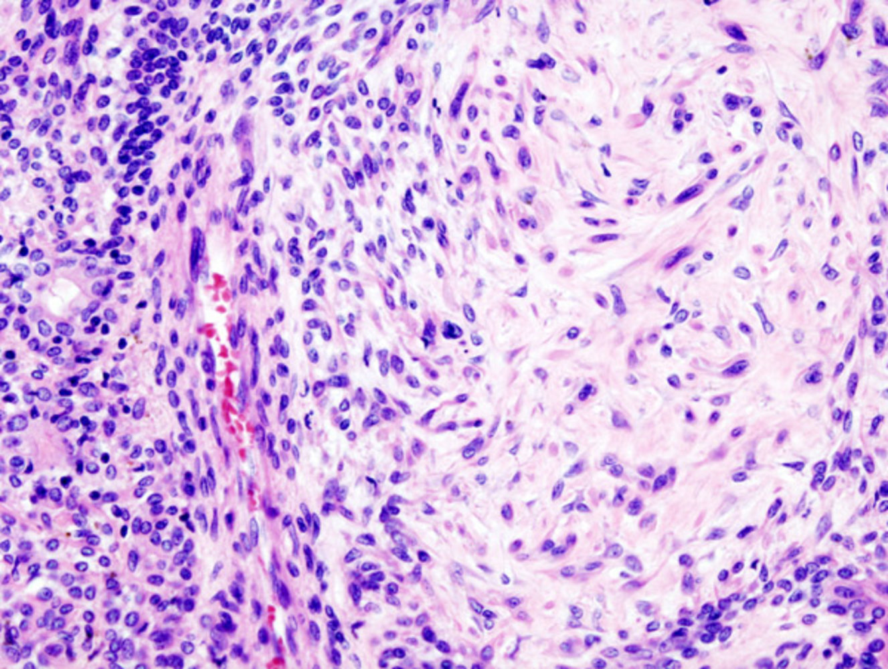
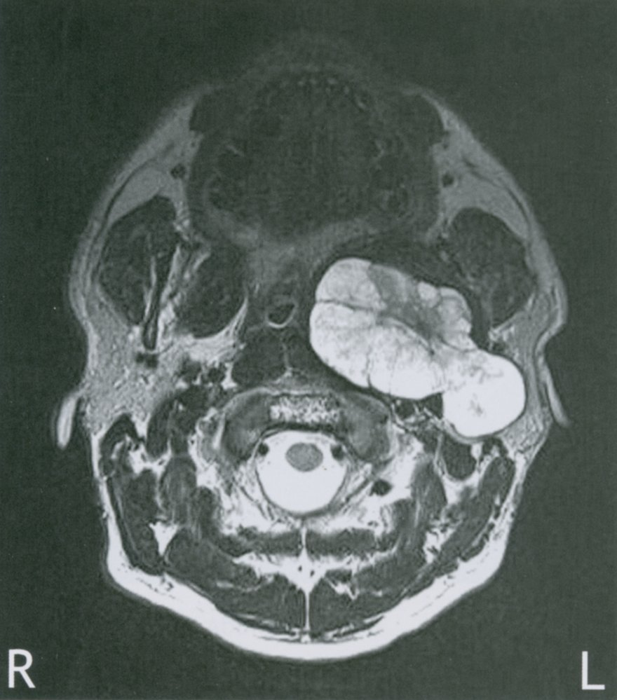

# Diseases of the salivary glands

*Categories: Clinical knowledge > Emergency medicine > Head and neck disorders > Diseases of the salivary glands*

[Original Article Link](https://coursology-qbank.com/amboss/article/bP0HWT)

---

## Summary

Diseases of the <u>salivary glands</u> (e.g., <u>parotid</u>, submandibular, and <u>sublingual glands</u>) include <u>sialadenosis</u>, <u>sialadenitis</u>, and <u>sialolithiasis</u>. <u>Sialadenosis</u> and <u>sialadenitis</u> primarily affect the <u>parotid gland</u>. <u>Sialadenosis</u> is the recurrent, painless, and often bilateral swelling of <u>salivary glands</u> without inflammation; treatment is focused on management of the underlying disease. <u>Sialadenitis</u> is the painful <u>acute inflammation</u> of <u>salivary glands</u> and is generally categorized according to etiology. <u>Acute suppurative sialadenitis</u> is caused by bacterial infection, while nonsuppurative <u>sialadenitis</u> is due to viral infection (e.g., <u>mumps</u>) or chronic conditions (e.g., salivary stasis, autoimmune disorders). Management includes <u>supportive care</u> (e.g., <u>pain control</u>, <u>sialagogues</u>) and treatment of the underlying cause. <u>Sialolithiasis</u> is the formation of stones within the salivary ducts, which may cause swelling and <u>pain</u> associated with eating. Treatment can be conservative (e.g., <u>pain control</u>, sialogogues) or surgical (stone removal).

<u>Salivary gland</u> tumors manifest mainly in the <u>parotid</u>. Painless and progressive swelling of the gland is the cardinal symptom of benign as well as <u>malignant tumors</u>, while <u>facial palsy</u> is considered a criterion for <u>malignancy</u>. Generally, the smaller the gland, the greater the chance that the <u>tumor</u> is malignant. <u>Clinical examination</u> and <u>ultrasound</u> play the biggest role in diagnosis. For all <u>parotid</u> tumors, the preferred treatment is parotidectomy with retention of the <u>facial nerve</u>. A resection of the <u>facial nerve</u> is indicated only if it is infiltrated by the <u>tumor</u>. Postoperative <u>radiation therapy</u> may benefit patients with <u>malignant tumors</u>.

---

## Overview

|  Overview of salivary gland diseases [[1]](https://coursology-qbank.com/amboss/article/WSYPAo)[[2]](https://coursology-qbank.com/amboss/article/izbJsw)  |  |  |  |  |  |
| --- | --- | --- | --- | --- | --- |
| Features | <u>Acute suppurative sialadenitis</u> | <u>Viral sialadenitis</u> (e.g., <u>mumps</u>) | <u>Sialolithiasis</u> | <u>Sialadenosis</u> | <u>Tumors of the salivary glands</u> |
| Most common location |  * <u>Parotid gland</u>   |  * <u>Parotid gland</u>   |  * <u>Submandibular gland</u>   |  * <u>Parotid gland</u>   |  * <u>Parotid gland</u>   |
| Swelling |  * Usually unilateral   |  * Usually bilateral   |  * Usually unilateral   |  * Usually bilateral   |  * Usually unilateral   |
| <u>Pain</u> |  * Painful   |  * Painful   |  * Painful while eating   |  * Usually painless   |  * Usually painless   |
| <u>Fever</u> |  * Present   |  * Present   |  * Usually absent   |  * Absent   |  * May be present   |
| Other findings |  * Possible <u>pus</u> discharge   |   * Possible redness of the gland  * Protruding <u>ears</u>    |  * Sudden <u>pain</u> while eating   |  * Systemic causes (e.g., <u>malnutrition</u>, <u>diabetes mellitus</u>)   |  * Possible malignant symptoms of infiltrated structures (e.g., <u>facial palsy</u>)   |

---

## Sialadenitis

### Acute suppurative sialadenitis [[1]](https://coursology-qbank.com/amboss/article/WSYPAo)[[3]](https://coursology-qbank.com/amboss/article/G_WBpL0)[[4]](https://coursology-qbank.com/amboss/article/AN1Rdh0)

* Definition: <u>acute inflammation</u> of the <u>salivary glands</u> due to bacterial infection

* Etiology: retrograde bacterial contamination from the mouth into the salivary ducts [[3]](https://coursology-qbank.com/amboss/article/G_WBpL0)

* Most commonly <u>Staphylococcus aureus</u>

* Less often <u>viridans streptococci</u>, <u>Haemophilus influenzae</u>, or polymicrobial

* Location: most often the <u>parotid gland</u> [[1]](https://coursology-qbank.com/amboss/article/WSYPAo)

* <u>Risk factors</u>

* Obstructive factors (e.g., <u>sialolithiasis</u>)

* Autoimmune disorders

* Hospitalized or postoperative patients

* Salivary stasis (e.g., <u>dehydration</u>, <u>anticholinergic</u> medications)

* Poor oral hygiene

* <u>Diabetes mellitus</u>

* <u>Hypothyroidism</u>

* <u>Renal failure</u>

* Clinical features

* Acute onset

* Unilateral painful swelling and <u>erythema</u> of the <u>salivary gland</u> and affected area

* <u>Purulent</u> discharge expressed from salivary duct orifice

* Systemic symptoms (e.g., <u>fever</u>, chills)

* Diagnostics: <u>clinical diagnosis</u> [[5]](https://coursology-qbank.com/amboss/article/z_WrIL0)

* <u>Gram stain</u> and culture of <u>purulent</u> discharge

* Imaging (e.g., <u>ultrasound</u>, CT) is indicated for the following:

* Concern for complications (e.g., <u>abscess</u>)

* Suspected <u>sialolithiasis</u>

* Palpable mass

* Treatment [[5]](https://coursology-qbank.com/amboss/article/z_WrIL0)

* <u>Symptomatic management of salivary gland disorders</u>, e.g.:

* <u>Sialagogues</u>

* <u>NSAIDs</u>

* <u>Antibiotic therapy</u>

* <u>Amoxicillin/clavulanate</u>;  (<u>off-label</u>) DOSAGE OR <u>clindamycin</u> (<u>off-label</u>) DOSAGE [[4]](https://coursology-qbank.com/amboss/article/AN1Rdh0)

* If patients cannot tolerate oral intake or have severe infection: <u>ampicillin/sulbactam</u> (<u>off-label</u>) DOSAGE [[3]](https://coursology-qbank.com/amboss/article/G_WBpL0)

* <u>Surgery</u>

* <u>Abscess</u>: <u>incision and drainage</u>

* Salivary stone: stone extraction (e.g., via <u>sialoendoscopy</u>, ductal dilation)

* Complications

* <u>Abscess</u> (e.g., parapharyngeal, intraglandular)

* <u>Ludwig angina</u>

* <u>Facial nerve paralysis</u>

Sialadenitis of the submandibular gland

### Viral sialadenitis [[1]](https://coursology-qbank.com/amboss/article/WSYPAo)[[3]](https://coursology-qbank.com/amboss/article/G_WBpL0)[[4]](https://coursology-qbank.com/amboss/article/AN1Rdh0)

* Definition: acute nonsuppurative inflammation of the <u>salivary glands</u> due to viral infection

* Etiology

* <u>Mumps</u> (most common)

* <u>HIV</u>

* <u>Hepatitis C</u>

* <u>Influenza</u>

* <u>Cytomegalovirus</u>

* Clinical features

* <u>Pain</u> and swelling (often bilateral)

* <u>Prodromal</u> symptoms (e.g., <u>fever</u>, <u>headache</u>, <u>malaise</u>)

* Clinical features of underlying infection

* Diagnostics: based on suspected underlying cause (e.g., diagnostics for <u>mumps</u>, <u>HIV testing</u>)

* Treatment

* <u>Symptomatic management of salivary gland disorders</u>

* Manage the underlying cause (e.g., treatment for <u>mumps</u>, <u>management of HIV</u>).

Sialadenitis in mumps

### Chronic sialadenitis [[1]](https://coursology-qbank.com/amboss/article/WSYPAo)[[3]](https://coursology-qbank.com/amboss/article/G_WBpL0)[[4]](https://coursology-qbank.com/amboss/article/AN1Rdh0)

* Definition: recurrent episodes of <u>pain</u> and inflammation of the <u>salivary glands</u>

* Etiology

* Salivary stasis (e.g., <u>sialolithiasis</u>)

* Autoimmune disorders (e.g., <u>Sjogren syndrome</u>)

* <u>Neoplasms</u>

* Bacterial infection

* Clinical features

* Recurrent episodes of <u>pain</u> and swelling

* Clinical features of the underlying cause (e.g., <u>sialolithiasis</u>, <u>Sjogren syndrome</u>)

* Diagnostics: based on suspected underlying cause (e.g., <u>diagnostics for Sjogren syndrome</u>)

* Treatment

* <u>Symptomatic management of salivary gland disorders</u>

* Manage the underlying cause.

* If <u>conservative management</u> is unsuccessful, refer patients to otolaryngology for possible surgical intervention (e.g., <u>sialoendoscopy</u>, ductal ligation, gland excision).

---

## Sialolithiasis

<u>Sialolithiasis</u> is the formation of stones within the salivary ductal system.

### Etiology [[4]](https://coursology-qbank.com/amboss/article/AN1Rdh0)

* Unclear; thought to be due to calcification of a nidus within the ductal system

* <u>Risk factors</u> include:

* <u>Dehydration</u>

* Smoking

* Medication effects (e.g., <u>diuretics</u>, <u>anticholinergics</u>)

* <u>Gout</u>

* Trauma

* Chronic <u>periodontal disease</u>

### Clinical features [[4]](https://coursology-qbank.com/amboss/article/AN1Rdh0)

* Location  

* <u>Submandibular gland</u> (80–95% of cases)  [[4]](https://coursology-qbank.com/amboss/article/AN1Rdh0)

* Less commonly <u>parotid</u> or <u>sublingual glands</u>

* Recurrent <u>pain</u> before and after eating

* Swelling of the affected gland

* Palpable or visible stone

Major salivary glands

Sialolithiasis of the submandibular gland

Sialolithiasis

### Diagnostics [[4]](https://coursology-qbank.com/amboss/article/AN1Rdh0)[[6]](https://coursology-qbank.com/amboss/article/fAWkQL0)

* <u>Clinical diagnosis</u>

* Imaging may be used to confirm diagnosis or evaluate for alternative etiologies or complications.

* <u>CT without contrast</u> (first-line): high <u>sensitivity</u> for detecting <u>salivary stones</u> [[4]](https://coursology-qbank.com/amboss/article/AN1Rdh0)

* <u>Ultrasound</u>: detects most stones ≥ 2 mm

* <u>Sialography</u> (e.g., magnetic resonance <u>sialography</u>, conventional <u>sialography</u>)

* <u>Sialoendoscopy</u>

### Treatment [[4]](https://coursology-qbank.com/amboss/article/AN1Rdh0)[[6]](https://coursology-qbank.com/amboss/article/fAWkQL0)

* Symptomatic management of salivary gland disorders

* <u>NSAIDs</u> for <u>pain</u> relief

* Stimulation of salivary flow

* Sialogogues

* Glandular massage

* Warm compresses

* Oral and/or <u>IV fluid therapy</u>

* Oral hygiene

* Palpable stone: Attempt to massage the gland to remove the stone.

* For signs of infection, see “Treatment” in “<u>Acute suppurative sialadenitis</u>.”

* Indications for otolaryngology referral include: [[6]](https://coursology-qbank.com/amboss/article/fAWkQL0)

* Symptoms lasting more than a few days

* Stones within the gland, in the <u>proximal</u> duct, or > 5 mm

* Recurrent <u>sialolithiasis</u>

* <u>Acute suppurative sialadenitis</u> and no improvement with <u>antibiotics</u>

* Interventions: <u>sialoendoscopy</u>; , laser <u>lithotripsy</u>, transoral stone removal, or sialadenectomy

### Complications [[3]](https://coursology-qbank.com/amboss/article/G_WBpL0)

* <u>Acute suppurative sialadenitis</u>

* <u>Chronic sialadenitis</u>

* Salivary duct stricture

* <u>Ductal ectasia</u>

---

## Sialadenosis

* Definition: recurrent, noninflammatory swelling of the <u>salivary glands</u>

* Location: : most often the <u>parotid gland</u>

* Etiology

* Endocrine: particularly <u>diabetes mellitus</u>

* <u>Dystrophic</u> <u>sialadenosis</u>: <u>alcohol use disorder</u>, <u>malnutrition</u>, or <u>eating disorders</u> (e.g., <u>bulimia</u>) [[7]](https://coursology-qbank.com/amboss/article/XSY9yo)

* Medications: e.g., <u>clonidine</u>

* Symptoms: painless swelling (usually bilateral)

* Treatment: treatment of underlying disease

---

## Ranula

* Definition: retention cyst arising in the <u>sublingual gland</u>

* <u>Epidemiology</u>: [[8]](https://coursology-qbank.com/amboss/article/_wa5l5)

* <u>♂</u> ≈ <u>♀</u>

* Most common between 10–30 years of age
* Has been reported in patients aged 3–61 years

* Rare (∼ 3% of salivary cysts)

* Etiology: unclear

* Clinical features

* Translucent blue swelling below the <u>tongue</u>

* Can cause problems <u>swallowing</u> and speaking

* Treatment

* Extirpation of the <u>ranula</u>, including the <u>sublingual gland</u>

* <u>Marsupialization</u>

Ranula

---

## Benign tumors

Most <u>salivary gland</u> tumors are benign.

### Pleomorphic adenoma (benign mixed <u>tumor</u>)

* <u>Epidemiology</u>

* Sex: <u>♀</u> > <u>♂</u>

* Peak <u>incidence</u>: 40–60 years

* Most common <u>salivary gland</u> <u>tumor</u> (accounts for 85% of benign <u>salivary gland</u> tumors)

* Etiology: <u>ionizing radiation</u>, environmental/<u>occupational exposure</u> (e.g., rubber manufacturing, cosmetologists, <u>nickel</u> compound exposure) [[9]](https://coursology-qbank.com/amboss/article/zwarl5)

* Location: usually the <u>parotid gland</u> (∼ 80% of cases)

* Clinical features 

* Gradual and painless unilateral swelling of the gland

* Robust, movable <u>tumor</u>

* Diagnostics

* <u>Ultrasound</u>: diagnostic method of choice in <u>salivary gland</u> tumors

* <u>MRI</u> (<u>T2-weighted</u> image): sharply limited, lobulated <u>hyperintense</u> mass [[10]](https://coursology-qbank.com/amboss/article/dSYoAo)

* <u>Histology</u> 

* Mixed cellular constitution with <u>myoepithelial cells</u> and chondroid tissue

* <u>Cytokeratin</u> is expressed immunohistochemically

* Complications: Malignant transformation may occur (∼ 5% of cases).

* Treatment: : Best treatment is <u>superficial</u> parotidectomy to prevent recurrence. [[11]](https://coursology-qbank.com/amboss/article/nla7xk)

* Prognosis

* Very good overall prognosis

* Recurrence (∼ 5% of cases): typically due to incomplete resection or rupture of <u>tumor</u> during <u>surgery</u>

Pleomorphic adenoma

Pleomorphic adenoma of the parotid gland

Parotid tumor

### Other types of benign <u>salivary gland</u> tumors (monomorphic adenomas)

These benign <u>salivary gland</u> tumors fall under the umbrella term "monomorphic <u>adenoma</u>" because they usually originate in only one type of cell – as opposed to the <u>pleomorphic</u> <u>adenomas</u>, which consist of both <u>epithelial</u> and <u>myoepithelial cells</u>.

#### Warthin tumor (<u>papillary cystadenoma lymphomatosum</u>)

* <u>Epidemiology</u>

* Sex: <u>♂</u> >> <u>♀</u>

* Peak <u>incidence</u>: 60–80 years

* 2nd most common benign <u>salivary gland</u> <u>tumor</u> (accounting for 10% of benign cases) [[12]](https://coursology-qbank.com/amboss/article/VSYGAo)

* Etiology

* <u>Ionizing radiation</u>

* Smoking

* Location: : most often the <u>parotid gland</u> (10% bilateral, 10% multifocal)

* Clinical features: gradual and painless unilateral swelling of the <u>parotid</u>

* Diagnostics

* <u>Ultrasound</u>: diagnostic method of choice in <u>salivary gland</u> tumors

* <u>MRI</u>

* <u>Histology</u>

* Cystic structure

* <u>Germinal centers</u>

* Treatment: complete extirpation of the <u>tumor</u> with preservation of <u>facial nerve</u>

* Complications: rarely malignant transformation

> [!NOTE]
> WARning! Smoking makes GERMs more resilient.

#### Rare histologic subtypes

* <u>Oncocytoma</u> (∼ 2% of cases)

* <u>Basal cell</u> <u>adenoma</u> (∼ 1–2% of cases)

* Myoepithelioma (∼ 1% of cases)

---

## Malignant tumors

<u>Malignant salivary gland tumors</u> are referred to collectively because of their many etiological, epidemiological, and pathological similarities.

* Location

* Most common: <u>parotid gland</u> → parotid carcinoma

* Less common locations

* Submandibular and <u>sublingual glands</u>: <u>Neoplasms</u> in these locations are less common compared to those in the <u>parotid gland</u>, but they are more frequently malignant (∼ 45% of submandibular and 70–90% of sublingual tumors).

* Minor <u>salivary glands</u> (<u>gums</u> and the base of the mouth): Most tumors are malignant.

* Etiology

* <u>Ionizing radiation</u>

* Viral infection (e.g., <u>HIV</u> may be implicated )

* Symptoms

* Insidious onset

* Painless <u>submucosal</u> swelling or <u>mucosal</u> <u>ulceration</u> (<u>palate</u>, buccal <u>mucosa</u>, <u>lips</u>)

* In some cases, clinical symptoms arise if the neighboring structures are infiltrated (e.g., <u>facial palsy</u> caused by <u>parotid</u> <u>carcinomas</u>).

* Diagnostics

* <u>Ultrasound</u> of the head and neck (to determine location and size of mass); with or without <u>biopsy</u> (definitive diagnosis)

* Contrast enhanced CT/<u>MRI</u> of head and neck: useful as preoperative workup to determine location, size, and extension of the lesion

* Pathology

* Subtypes

* Mucoepidermoid carcinoma

* Most common <u>malignant salivary gland tumor</u>

* Involves squamous and <u>mucinous</u> cells, both of which arise from excretory <u>stem cells</u> [[13]](https://coursology-qbank.com/amboss/article/MdaMqj)

* Adenoid cystic carcinoma (obsolete term: <u>cylindroma</u>)

* Growth along nerve sheaths

* <u>Cribriform</u> or tubular growth pattern

* Very slow but dangerous infiltrative growth

* Acinic cell <u>carcinoma</u>

* <u>Adenocarcinoma</u>

* <u>Metastases</u> of other <u>malignant tumors</u> in head and neck

* Routes of <u>metastasis</u>

* Initially lymphogenic in local <u>lymph nodes</u>

* Later hematogenic <u>metastasis</u>, particularly in the <u>lungs</u>

* Treatment

* Curative

* Parotidectomy (<u>superficial</u> or total), if possible, with preservation of the <u>facial nerve</u>

* +/- <u>Neck dissection</u> and/or <u>adjuvant radiotherapy</u> for extensive or higher grade tumors

* Palliative: <u>chemotherapy</u>

* Complications of a parotidectomy

* <u>Facial nerve</u> injury (most common early complication)

* <u>Hematoma</u>

* Salivary <u>fistula</u>

* Frey syndrome: <u>gustatory sweating</u>

* Crocodile tears (<u>gustatory hyperlacrimation</u>):  Regenerating <u>parasympathetic</u> gustatory fibers attach to the <u>lacrimal gland</u>.

> [!NOTE]
> <u>Submandibular gland</u> tumors are less common but more frequently malignant than <u>parotid</u> tumors. Generally, the smaller the gland, the higher the risk a <u>tumor</u> is malignant!

References:[[14]](https://coursology-qbank.com/amboss/article/ZR0Zlf)[[15]](https://coursology-qbank.com/amboss/article/-waDl5)

---