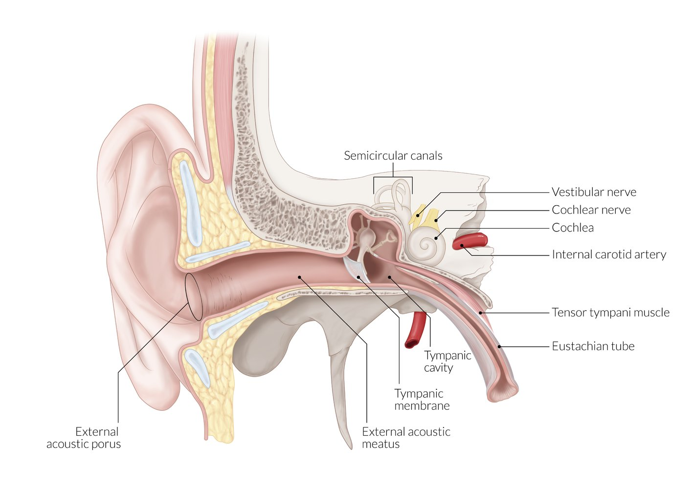
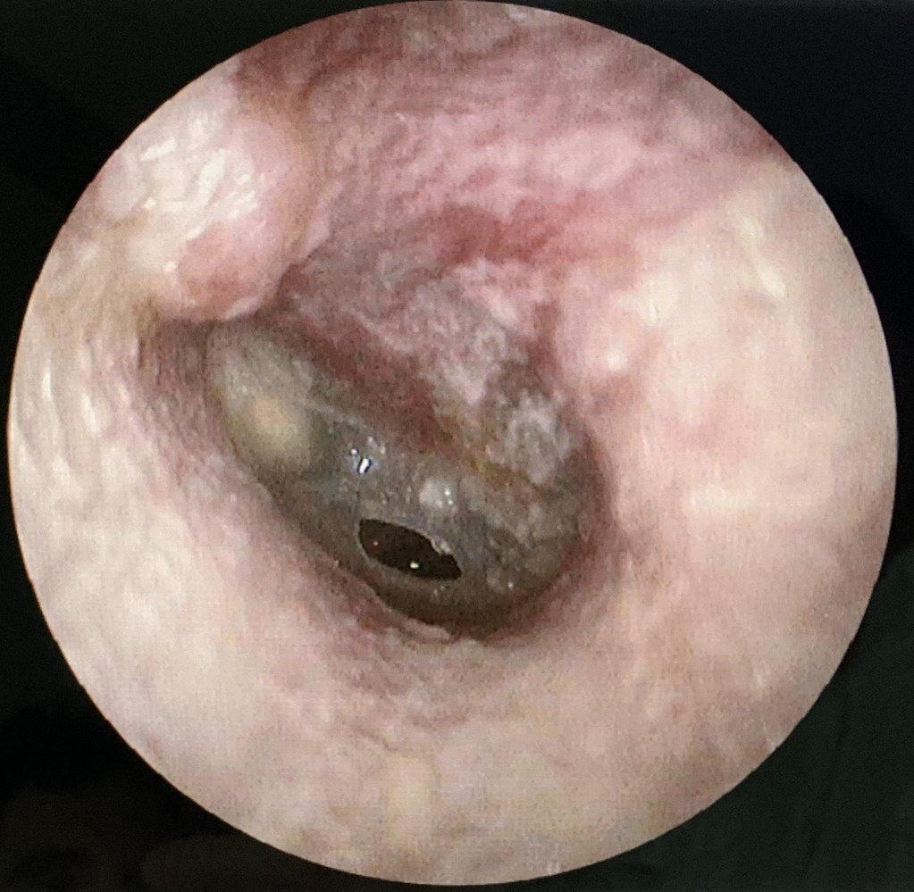

# Foreign bodies in the ear

*Categories: Clinical knowledge > Emergency medicine > Head and neck disorders > Foreign bodies in the ear*

[Original Article Link](https://coursology-qbank.com/amboss/article/xF0E43)

---

## Summary

Foreign bodies in <u>the ear</u> are generally found in the <u>external auditory canal</u> and most often occur in children younger than 8 years of age. Toys (e.g., beads, marbles) are the predominant type of foreign body found in children, while cotton balls, jewelry, and insects are more common in <u>adolescents</u> and adults. Patients with a foreign body in <u>the ear</u> are often asymptomatic but may report symptoms such as a feeling of fullness in <u>the ear</u>, <u>hearing loss</u>, <u>pruritus</u>, <u>otalgia</u>, or discharge. Foreign bodies are diagnosed via <u>otoscopy</u>. Advanced imaging (CT/<u>MRI</u>) may be obtained if bony <u>erosion</u>, ossicular lesions, or other complications are suspected. Management consists of removal of the foreign body, with <u>local anesthesia</u> or <u>procedural sedation</u> as needed. In certain scenarios (e.g., <u>tympanic membrane rupture</u>, unsuccessful removal), specialist involvement may be required.

---

## Epidemiology

* Most often occurs in children < 8 years of age [[2]](https://coursology-qbank.com/amboss/article/27cTOd0)

Epidemiological data refers to the US, unless otherwise specified.

---

## Etiology

* Children: mostly toys (e.g., beads, marbles), food [[2]](https://coursology-qbank.com/amboss/article/27cTOd0)[[3]](https://coursology-qbank.com/amboss/article/f7ckOd0)

* <u>Adolescents</u> and adults: cotton balls (e.g., from cotton swabs), jewelry (e.g., earrings), insects [[2]](https://coursology-qbank.com/amboss/article/27cTOd0)[[3]](https://coursology-qbank.com/amboss/article/f7ckOd0)

---

## Clinical features

Patients are often asymptomatic, but they may present with nonspecific complaints (particularly children). [[2]](https://coursology-qbank.com/amboss/article/27cTOd0)[[4]](https://coursology-qbank.com/amboss/article/AN1Rdh0)

* A feeling of fullness in <u>the ear</u>

* <u>Hearing loss</u>

* <u>Pruritus</u>

* <u>Otalgia</u>

* <u>Otorrhea</u> (hematic or <u>purulent</u>)

* <u>Cough</u> (due to the <u>Arnold ear-cough reflex</u>)

* Buzzing sound or sensation (if an insect is the foreign body)

* <u>Hiccups</u>

> [!TIP]
> A caregiver's report of an inserted object or nonspecific signs and symptoms may be the only features of <u>ear</u> foreign bodies in nonverbal or very young patients.

---

## Diagnosis

* <u>Otoscopy</u> [[4]](https://coursology-qbank.com/amboss/article/AN1Rdh0)

* For a clear view of <u>the ear</u> canal, <u>retract</u> the <u>pinna</u> of <u>the ear</u> posterosuperiorly.

* Typical locations of foreign bodies include: 

* Inner end of the <u>cartilaginous</u> canal

* <u>Isthmus</u> (narrowing of the bony part of the canal)

* Check for <u>tympanic membrane rupture</u>.

* Advanced imaging (CT/<u>MRI</u>): Consider if bony <u>erosion</u>, ossicular lesions, or other complications are suspected. [[4]](https://coursology-qbank.com/amboss/article/AN1Rdh0)

> [!TIP]
> Especially in children, consider inspecting the other <u>ear</u> canal and both nostrils for additional foreign bodies. [[2]](https://coursology-qbank.com/amboss/article/27cTOd0)

Examination and surface anatomy of the tympanic membrane

Outer, middle, and inner ear

Ruptured tympanic membrane

---

## Management

### Foreign body removal [[2]](https://coursology-qbank.com/amboss/article/27cTOd0)[[4]](https://coursology-qbank.com/amboss/article/AN1Rdh0)

Instrument-assisted manual removal and/or <u>irrigation</u> are typically attempted in the emergency department or other outpatient settings.

#### Preparation

* Consider <u>local anesthetic</u> instillation or <u>procedural sedation</u> as needed.

* Document <u>tympanic membrane perforation</u> (if present) prior to attempting removal.

#### Removal techniques [[5]](https://coursology-qbank.com/amboss/article/3wYSir)

The appropriate removal technique for each patient will vary based on the type of foreign body and the patient's ability to tolerate the procedure.

* Instrument-assisted manual removal

* Forceps

* Blunt right-angle hook or <u>ear</u> curette

* Balloon-tipped catheter (≤ 18 gauge)

* Cyanoacrylate-tipped applicator  [[4]](https://coursology-qbank.com/amboss/article/AN1Rdh0)[[5]](https://coursology-qbank.com/amboss/article/3wYSir)

* Suction device

* <u>Irrigation</u>

* A 20-mL syringe and 14 to 16-gauge catheter are used to irrigate <u>the ear</u> with water or saline. [[4]](https://coursology-qbank.com/amboss/article/AN1Rdh0)

* Contraindications 

* Button battery

* Expansile object

* Suspect <u>tympanic membrane rupture</u>

> [!WARNING]
> Removal may cause patient discomfort and/or minor bleeding.

#### Special considerations

* Insects: Kill or immobilize prior to attempting removal.

* Avoid <u>hydrogen peroxide</u> due to risk of injury to the <u>inner ear</u>.

* <u>Local anesthetics</u> (e.g., <u>lidocaine</u>), mineral oil, or <u>alcohol</u> may be used.

* Button batteries: Remove as soon as possible to avoid tissue <u>necrosis</u> and hemorrhage.

* Topical <u>antibiotics</u> (e.g., <u>ofloxacin</u>) 

* Indicated in patients with concurrent <u>otitis externa</u> (see “<u>Treatment of otitis externa</u>”)

* Consider for patients with <u>tympanic membrane rupture</u> or canal <u>lacerations</u>.

### Disposition [[2]](https://coursology-qbank.com/amboss/article/27cTOd0)[[4]](https://coursology-qbank.com/amboss/article/AN1Rdh0)

Consult ENT for the following:

* Sedation required for removal

* Trauma to the <u>external auditory canal</u> or <u>tympanic membrane</u>

* Foreign bodies likely to cause tissue damage, e.g., sharp-edged objects, button batteries

* Unsuccessful removal attempts

---

## Complications

* Bacterial <u>superinfection</u> (<u>otitis externa</u>, <u>acute otitis media</u>)

* <u>Hearing loss</u>

* <u>Tympanic membrane perforation</u>

* <u>Skin</u> <u>necrosis</u>

* <u>External auditory canal</u> <u>laceration</u> and bleeding

We list the most important complications. The selection is not exhaustive.

---