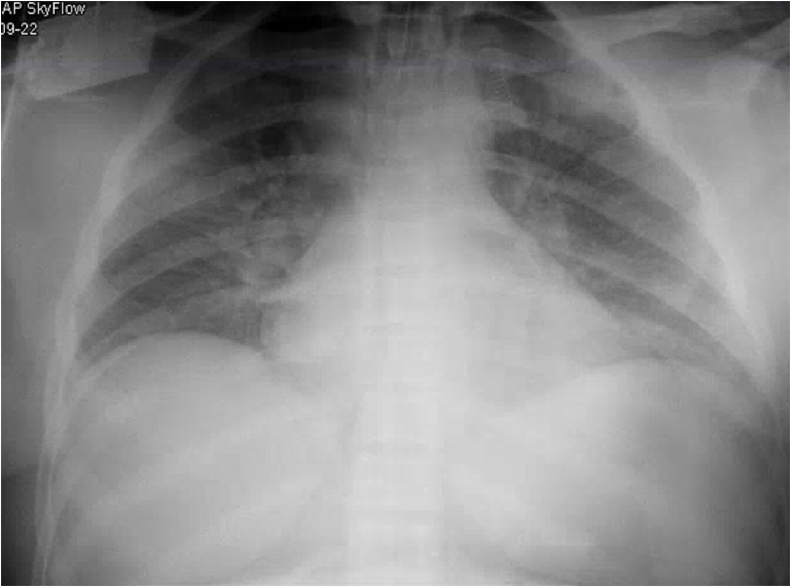
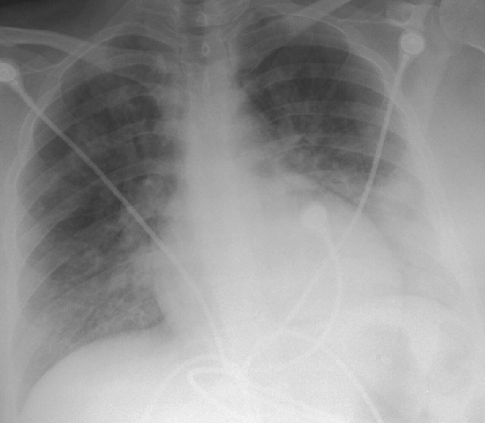

# Acute chest syndrome

*Categories: Clinical knowledge > Emergency medicine > Hematologic and oncologic disorders > Acute chest syndrome*

[Original Article Link](https://coursology-qbank.com/amboss/article/Vr0GTh)

---

## Summary

Acute chest syndrome (<u>ACS</u>) is a potentially fatal complication of <u>sickle cell anemia</u> caused by vaso-occlusion of the pulmonary vasculature. Symptoms may include <u>chest pain</u>, <u>shortness of breath</u>, and <u>fever</u>. Diagnosis is based on clinical symptoms and chest imaging findings of a new pulmonary infiltrate. Management consists of <u>antibiotics</u>, <u>supportive care</u> with <u>IV fluids</u> and oxygen, and possibly a <u>blood transfusion</u>.

See also “<u>Sickle cell disease</u>.”

---

## Definitions

* Vaso-occlusion of the pulmonary vasculature

* Triggers include infection, <u>asthma</u>, <u>surgery</u>/<u>general anesthesia</u>

* Common <u>cause of death</u> in patients with <u>sickle cell disease</u> [[1]](https://coursology-qbank.com/amboss/article/9uYNtI)

---

## Clinical features

* <u>Chest pain</u>

* <u>Fever</u>

* <u>Respiratory distress</u>, <u>cough</u>, <u>shortness of breath</u>, <u>wheezing</u>

* Signs of <u>vaso-occlusive crisis</u> (e.g., <u>pain</u> in arms or legs)

* <u>Rib</u> or sternal <u>pain</u>

* See also “Complications” below.

---

## Diagnosis

<u>ACS</u> is a <u>clinical diagnosis</u> supported by characteristic clinical features and the presence of new pulmonary infiltrate on imaging. [[1]](https://coursology-qbank.com/amboss/article/9uYNtI)

### Diagnostic criteria for acute chest syndrome [[2]](https://coursology-qbank.com/amboss/article/SEYyEI)[[3]](https://coursology-qbank.com/amboss/article/nSb7Zt)[[4]](https://coursology-qbank.com/amboss/article/vuYAGI)

* Clinical findings of one or more of the following: 

* <u>Chest pain</u>

* <u>Cough</u>

* Temperature > 38.5°C

* <u>Tachypnea</u>

* <u>Hypoxemia</u>

* <u>Signs of increased work of breathing</u>

* <u>Wheezing</u>

* <u>Crackles</u>

* PLUS a new pulmonary infiltrate on <u>CXR</u> that involves at least one <u>lung</u> segment and is not due to <u>atelectasis</u>  [[4]](https://coursology-qbank.com/amboss/article/vuYAGI)

### <u>Laboratory studies</u>

* Routine

* <u>CBC</u>: <u>anemia</u>, <u>leukocytosis</u>, <u>thrombocytopenia</u>  [[5]](https://coursology-qbank.com/amboss/article/RZblYH)

* <u>Type and screen</u> and <u>crossmatch</u>

* <u>BMP</u> and <u>LFTs</u>: signs of <u>multiorgan failure</u> may be present

* Elevated <u>creatinine</u>

* Elevated <u>AST</u> and <u>ALT</u>

* <u>Sputum</u> and <u>blood cultures</u>  [[6]](https://coursology-qbank.com/amboss/article/DuY1tI)

* <u>Arterial blood gas</u>: <u>Gold standard</u> for determining <u>partial pressure</u> of oxygen and carbon dioxide  [[7]](https://coursology-qbank.com/amboss/article/oZb0cH)

* Additional

* Consider <u>PCR</u> for viral panel and <u>serologies</u> for respiratory pathogens (e.g., <u>Mycoplasma</u>, <u>Legionella</u>): See <u>pneumonia diagnostics</u>.

* Consider <u>troponin</u> to assess for <u>myocardial injury</u>.

### Imaging

* <u>Chest x-ray</u> 

* Indication: all patients suspected of having <u>ACS</u>

* Supportive findings:

* New pulmonary infiltrate

* Segmental, lobar, or multilobular consolidation with or without the presence of <u>pleural effusion</u>

* If <u>CXR</u> is normal, it should be repeated in 24–48 hours if there is ongoing clinical suspicion for <u>ACS</u>. [[6]](https://coursology-qbank.com/amboss/article/DuY1tI)

* <u>CT pulmonary angiography</u>: if there is a concern for <u>pulmonary embolism</u> (<u>PE</u>)   [[8]](https://coursology-qbank.com/amboss/article/pZbLcH)

Lung opacities in acute chest syndrome

Acute and chronic pulmonary emboli

### Other

* <u>ECG</u>: Assess for acute <u>myocardial injury</u> (see <u>diagnosis of myocardial infarction</u>).

* <u>Bronchoscopy</u> with <u>bronchoalveolar lavage</u>: performed in refractory cases and/or in atypical presentations for assessment of viral or bacterial causes

---