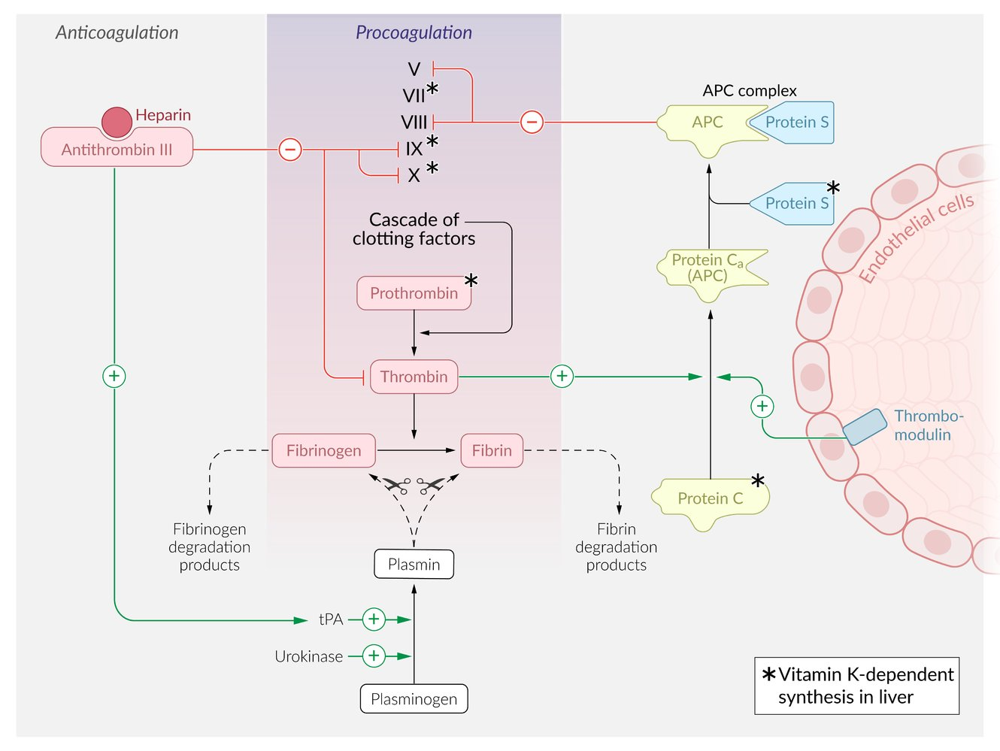

# Disseminated intravascular coagulation

*Categories: Clinical knowledge > Emergency medicine > Hematologic and oncologic disorders > Disseminated intravascular coagulation*

[Original Article Link](https://coursology-qbank.com/amboss/article/io0JbS)

---

## Summary

Disseminated <u>intravascular</u> coagulation (DIC) is a disorder characterized by systemic activation of the extrinsic <u>clotting cascade</u> with microthrombi formation, <u>platelet</u> consumption, and subsequent exhaustion of all <u>clotting factors</u>. Common causes of DIC include <u>sepsis</u>, trauma, and <u>malignancy</u>. Depending on the underlying pathophysiological processes and subtype, patients present with signs of bleeding (e.g., <u>purpura</u>, <u>petechiae</u>, <u>ecchymoses</u>) and/or <u>multiorgan failure</u>. <u>Laboratory studies</u> can be highly variable. However, typical findings in overt decompensated DIC include <u>thrombocytopenia</u>, prolonged <u>PT</u> and <u>aPTT</u>, decreased <u>fibrinogen</u> levels, and elevated <u>D-dimer</u> levels. Treatment involves identification of the underlying cause and supportive therapy with <u>transfusions</u> of <u>blood products</u> (<u>pRBCs</u>, <u>platelet</u> concentrates, <u>FFP</u>, and/or <u>cryoprecipitate</u>) and, in select cases, <u>anticoagulants</u> (e.g., <u>heparin</u>) or <u>antifibrinolytic therapy</u> (<u>tranexamic acid</u>). Close monitoring and specialist consultation (e.g., critical care and <u>hematology</u>) are typically required.

Disseminated intravascular coagulation fact sheet

---

## Overview

### Disseminated <u>intravascular</u> coagulation (DIC)

* Definition: a syndrome characterized by <u>thrombosis</u>, hemorrhage, and organ dysfunction caused by systemic activation of the <u>clotting cascade</u>, which leads to <u>platelet</u> consumption and exhaustion of <u>clotting factors</u>

* <u>Latent DIC</u>: no overt symptoms (little to no bleeding, increased risk of <u>thrombotic events</u>, laboratory abnormalities)

* Overt DIC: clear signs and symptoms (e.g., bleeding, <u>thrombosis</u>) that depend on the balance of the deranged processes

#### According to disease onset [[1]](https://coursology-qbank.com/amboss/article/WQbPEt)

* Acute DIC

* Excess <u>thrombin</u> generation leading to the formation of microthrombi and, eventually, <u>microangiopathic hemolytic anemia</u> (<u>MAHA</u>)

* Rapid consumption of <u>coagulation factors</u> and <u>platelets</u>

* Common causes include <u>septic shock</u>, <u>acute pancreatitis</u>, <u>burns</u>, <u>snake bites</u>, <u>transplant rejection</u>

* Often starts as a <u>hypercoagulable state</u> (<u>organ failure type DIC</u>)

* Chronic DIC

* Small <u>thrombin</u> generation over prolonged periods of time

* Slower consumption of <u>coagulation factors</u> and <u>platelets</u>

* Common causes include malignancies, <u>aneurysms</u>, <u>retroperitoneal</u> <u>hematomas</u>, <u>intrauterine fetal death</u>

* Often manifests as <u>nonsymptomatic type DIC</u>

* <u>Thrombosis</u> is more common in symptomatic chronic DIC.

### Consumption coagulopathy

* Definition: <u>Hyperfibrinolysis</u>, causing overt <u>coagulopathy</u> and bleeding, PLUS <u>hypercoagulability</u>, which causes consumption of <u>platelets</u> and <u>clotting factors</u>, resulting in even more blood loss.

---

## Etiology

* Infections

* Viral infection

* <u>Rickettsial infections</u>

* <u>Malaria</u>

* <u>Sepsis</u> (more commonly with gram-negative organisms)

* Trauma 

* <u>Acute traumatic coagulopathy</u>

* <u>Traumatic brain injury</u>

* <u>Crush injuries</u>

* <u>Burns</u>

* <u>Fat embolism</u>

* <u>Surgery</u>

* <u>Rhabdomyolysis</u>

* Obstetric complications 

* <u>Amniotic fluid embolism</u>

* <u>Preeclampsia</u>

* <u>HELLP syndrome</u>

* <u>Abruptio placenta</u>

* <u>Retained products of conception</u> (e.g., intrauterine <u>death</u>, <u>placenta</u>)

* Organ failure

* <u>Acute pancreatitis</u>

* <u>Fulminant hepatitis</u>

* <u>Liver cirrhosis</u>

* Acute hepatic <u>necrosis</u>

* <u>Acute respiratory distress syndrome</u> (<u>ARDS</u>)

* Malignancies

* Hematological, e.g., <u>acute promyelocytic leukemia</u> (APL), <u>acute myelocytic leukemia</u>

* Solid tumors, e.g.: 

* <u>Pancreatic</u>

* Ovarian

* Gastric

* Non-small cell <u>lung cancer</u>

* Toxins

* <u>Snake bites</u>

* <u>Amphetamine</u> overdose

* Immunologic

* <u>Acute hemolytic transfusion reaction</u> (<u>AHTR</u>)

* Transplant reaction (e.g., <u>graft-versus-host disease</u>)

* Extracorporeal procedures (e.g., dialysis)

* Vascular <u>malformations</u> 

* <u>Aortic aneurysms</u>

* <u>Vasculitis</u>

* Dilution

* <u>Massive bleeding</u>

* <u>Massive transfusion</u>

* Massive <u>volume repletion</u>/<u>volume overload</u>

* Drug reactions

* Other

* <u>Nephrotic syndrome</u>

* New <u>thrombus formation</u>

* <u>Hemolysis</u>

* <u>Acidosis</u>

> [!NOTE]
> The mnemonic “STOP Making Trouble!” helps to recall the etiology of DIC: S – <u>Sepsis</u>/<u>Snakebites</u>, T – Trauma (<u>acute traumatic coagulopathy</u>), O – Obstetric complications, P – <u>Pancreatitis</u>, M – Malignancy, T – Transfusion.

References:[[2]](https://coursology-qbank.com/amboss/article/Z3bZSt)[[3]](https://coursology-qbank.com/amboss/article/B3bzkt)[[4]](https://coursology-qbank.com/amboss/article/13a2h4)

---

## Classification

The 2014 International Society of <u>Thrombosis</u> and <u>Haemostasis</u> (<u>ISTH</u>) harmonized guidelines distinguish between DIC types based on clinical <u>phenotype</u>, characteristic laboratory abnormalities, and treatment targets.

|  Overview of DIC types [[3]](https://coursology-qbank.com/amboss/article/B3bzkt)[[4]](https://coursology-qbank.com/amboss/article/13a2h4)[[5]](https://coursology-qbank.com/amboss/article/X3a9S4)[[6]](https://coursology-qbank.com/amboss/article/GibBGt)  |  |  |  |
| --- | --- | --- | --- |
| Types | Description | Suggestive laboratory findings | Potential therapeutic targets |
| Nonsymptomatic type DIC |   * Symptoms: little to none  * Predominant mechanism: low-grade <u>fibrinolysis</u> and/or hypercoagulation  * Typical underlying diseases: variable    |   * Routine <u>coagulation tests</u>: variable or only subtle abnormalities  * Specialized tests  * ↑ <u>Soluble fibrin</u>  * ↑ TAT    |   * Treatment of underlying condition  * Inhibition of <u>hypercoagulability</u> (i.e., <u>anticoagulants</u>) as needed  * Replacement of <u>blood products</u> as needed (e.g., <u>FFP</u>, <u>platelets</u>)    |
| Bleeding type DIC |   * Symptoms: nonsevere bleeding  * Predominant mechanism: <u>hyperfibrinolysis</u>  * Typical underlying diseases: <u>leukemias</u>, obstetric complications, <u>aortic aneurysms</u>    |   * Routine <u>coagulation tests</u>  * ↓ <u>Platelets</u>  * ↑ <u>PT</u>  * ↑ <u>D-dimer</u>, ↑ <u>FDPs</u>  * ↓ <u>Fibrinogen</u>  * Specialized tests  * PAI-1 normal  * ↑ <u>PPIC</u>    |   * Treatment of underlying condition  * Replacement of lost blood (i.e., <u>pRBC transfusion</u>)  * Inhibition of <u>hyperfibrinolysis</u> (i.e., <u>antifibrinolytics</u>) in select cases    |
| Massive bleeding type DIC |   * Symptoms: <u>massive hemorrhage</u>  * Predominant mechanism: <u>hyperfibrinolysis</u> and consumption of <u>platelets</u>, <u>clotting factors</u>, and <u>fibrinogen</u>  * Typical underlying diseases: trauma, obstetric complications, major surgical complications    |   * Routine <u>coagulation tests</u>  * ↓↓ <u>Platelets</u>  * ↑ <u>PT</u>  * ↑ <u>D-dimer</u>, ↑ <u>FDPs</u>  * ↓↓ <u>Fibrinogen</u>  * Specialized tests  * PAI-1 normal  * ↑↑ <u>PPIC</u>    |   * Treatment of underlying condition  * Rapid replacement of lost blood (i.e., <u>massive transfusion</u>)  * Inhibition of <u>hyperfibrinolysis</u> (i.e., <u>antifibrinolytics</u>) in select cases  * Replacement of consumed <u>clotting factors</u> (i.e., <u>transfusion</u> of <u>platelets</u>/<u>FFP</u>/<u>cryoprecipitate</u>)  * Inhibition of other branches of the <u>coagulation cascade</u> to reduce consumption process (i.e., <u>antithrombin</u>, <u>serine</u> <u>protease inhibitors</u>)    |
| Organ failure type DIC |   * Symptoms: dysfunction of affected organs  * Predominant mechanism: <u>hypercoagulability</u> and <u>thrombosis</u>  * Typical underlying diseases: infections, <u>sepsis</u>    |   * Routine <u>coagulation tests</u>  * ↓ <u>Platelets</u>  * ↑ <u>PT</u>  * <u>D-dimer</u>, <u>FDPs</u> normal or slightly elevated  * Specialized tests  * ↑↑ PAI-1  * <u>PPIC</u> normal or slightly elevated  * ↓ <u>Antithrombin</u>  * ↓ <u>Protein C</u>    |   * Treatment of underlying condition  * Inhibition of <u>hypercoagulability</u> (i.e., <u>anticoagulants</u>)    |
| TAT: <u>Thrombin antithrombin complex</u>, <u>PPIC</u>: <u>Plasmin α2-plasmin inhibitor complex</u>, PAI-1: <u>Plasminogen</u> activator inhibitor-1, <u>PT</u>: <u>Prothrombin time</u>, <u>FDPs</u>: <u>Fibrin degradation products</u>, <u>FFP</u>: <u>Fresh frozen plasma</u>, <u>pRBC</u>: <u>Packed red blood cells</u>  |  |  |  |

---

## Pathophysiology

### Overview [[3]](https://coursology-qbank.com/amboss/article/B3bzkt)[[4]](https://coursology-qbank.com/amboss/article/13a2h4)[[5]](https://coursology-qbank.com/amboss/article/X3a9S4)

* The pathophysiology of DIC is variable and depends on the underlying processes (see “<u>Hemostasis and bleeding disorders</u>” and “<u>Acquired thrombophilia</u>”).

* There are 4 concurrent events involved:

* Initiation and propagation of coagulation (loss of localized activation of coagulation)

* A systemic inflammatory activation → impairment of physiological <u>anticoagulant</u> pathways (e.g., <u>depression</u> of <u>antithrombin</u> and impairment of <u>protein C</u> system) and <u>endogenous</u> <u>fibrinolysis</u> (due to a consistent rise in PAI-1)

* Activation of <u>tissue factor pathway</u> → <u>factor Xa</u> and IXa generation → increased <u>thrombin</u> production

* Impaired <u>fibrin</u> removal due to <u>depression</u> of the fibrinolytic system → microthrombi production and possible obstruction of the <u>microvasculature</u>

### Mechanisms

* Underlying disease → ↑ release of <u>procoagulants</u> (e.g., <u>tissue factor</u>) → ↑ activation of the extrinsic <u>coagulation cascade</u> and <u>platelets</u> → ↑ activation of <u>thrombin</u> → ↑ generation of <u>fibrin</u> → ↑ generation of microthrombi rich in <u>fibrin</u> and <u>platelets</u> → ↑ activation of <u>fibrinolysis</u> and other <u>anticoagulant</u> pathways that break down <u>thrombi</u> → ↑ <u>fibrin</u> degradation and consumption of natural <u>anticoagulants</u>  → further clinical course and resulting type of DIC is determined by the dominance of <u>hyperfibrinolysis</u> and/or hypercoagulopathy

* <u>Nonsymptomatic type DIC</u>: low-grade <u>fibrinolysis</u> and/or hypercoagulation

* <u>Bleeding type DIC</u>: <u>hyperfibrinolysis</u> due to excessive <u>plasmin</u> activity → increased <u>fibrin</u> degradation → <u>thrombi</u> becoming unstable and dissolving shortly after formation

* <u>Massive bleeding type DIC</u>: hypercoagulation and <u>hyperfibrinolysis</u> → consumption of <u>platelets</u> and all <u>coagulation factors</u> → <u>bleeding diathesis</u>

* <u>Organ failure type DIC</u>: ↑ <u>cytokines</u> → ↑ <u>plasminogen</u> activator inhibitor-I (PAI-I) and ↑ <u>neutrophil</u> extracellular traps (<u>NETs</u>) → hypercoagulation with suppressed <u>fibrinolysis</u> → <u>platelet</u> and <u>fibrin</u>-rich microthrombi → impaired <u>perfusion</u> and tissue <u>necrosis</u>

Procoagulation-anticoagulation balance

---

## Clinical features

Clinical features are variable and depend on the predominant underlying mechanism. [[7]](https://coursology-qbank.com/amboss/article/U30b3f)

* Bleeding

* <u>Hematemesis</u>, <u>hematochezia</u>

* <u>Hematuria</u>

* Oozing of blood from surgical wounds or intravenous lines

* <u>Petechiae</u>, <u>purpura</u>, <u>ecchymoses</u>

* <u>Massive hemorrhage</u>: collection of blood in body cavities (<u>hemoperitoneum</u>, <u>hemothorax</u>)

* Organ failure: primarily due to hypercoagulation

* Microangiopathic <u>hemolytic anemia</u>

* <u>Acute renal failure</u>: <u>oliguria</u>

* Hepatic dysfunction: <u>jaundice</u>

* <u>ARDS</u>: <u>dyspnea</u>, <u>rales</u>

* <u>Pulmonary thromboembolism</u>: <u>dyspnea</u>, <u>chest pain</u>, <u>hemoptysis</u>

* <u>Deep vein thrombosis</u>: lower limb <u>edema</u>

* Neurological dysfunction: <u>altered mental status</u>, <u>stroke</u>

* <u>Purpura fulminans</u>: DIC with extensive <u>skin</u> <u>necrosis</u>

* <u>Waterhouse Friderichsen syndrome</u>: <u>adrenal</u> <u>infarcts</u> → <u>adrenal insufficiency</u>

* <u>Signs of shock</u>

> [!NOTE]
> The <u>clinical features of DIC</u> may appear acutely (e.g., following trauma, <u>sepsis</u>) or subacutely (e.g., DIC following <u>malignancy</u>).

---

## Diagnosis

### General principles [[6]](https://coursology-qbank.com/amboss/article/GibBGt)[[8]](https://coursology-qbank.com/amboss/article/ZrbZfE)

* Suspect DIC based on clinical features  and typical underlying diseases; especially in patients with clinical deterioration.

* <u>Laboratory studies</u> vary depending on the subtype, underlying disorders, and stage of DIC.

* Challenges

* No single test can reliably rule out DIC.

* <u>Nonsymptomatic DIC</u> may only become apparent after specific laboratory screening.

* DIC may already be irreversibly decompensated by the time diagnosis is made using scoring systems.

* Many conditions can manifest with similar laboratory abnormalities (see “<u>Differential diagnoses of DIC by laboratory findings</u>”).

### <u>Laboratory studies</u> [[5]](https://coursology-qbank.com/amboss/article/X3a9S4)[[6]](https://coursology-qbank.com/amboss/article/GibBGt)[[9]](https://coursology-qbank.com/amboss/article/fSbk_G)

#### Routine laboratory tests

* <u>Coagulation panel</u>: Monitor frequently (e.g., every 6–8 hours or until stable or improving). 

* ↑ <u>aPTT</u>, ↑ <u>PT</u>

* ↓ <u>Fibrinogen</u>: indicative of associated <u>hyperfibrinolysis</u>

* Markers of <u>fibrin</u> breakdown: ↑ <u>D-dimer</u> or other <u>FDPs</u>

* ↑ <u>Bleeding time</u>

* <u>Coagulation factors</u>: ↓ <u>factor V</u> and ↓ <u>factor VIII</u>

* <u>CBC</u> and <u>blood smear</u>

* ↓ <u>Platelet count</u>: due to consumption and/or bleeding

* ↓ <u>Hct</u>: occurs with bleeding

* <u>Schistocytes</u>: indicative of <u>microangiopathic hemolytic anemia</u>  [[10]](https://coursology-qbank.com/amboss/article/tibXtt)

* Other tests of organ function (e.g., <u>renal function tests</u>, <u>liver chemistries</u>): Order depending on clinical picture and underlying conditions.

> [!TIP]
> The <u>diagnosis of DIC</u> is not based on a single marker but on a combination of laboratory findings. <u>Thrombocytopenia</u>, elevated <u>D-dimer</u>, increased <u>PT</u> and <u>aPTT</u>, and low <u>fibrinogen</u> should immediately raise suspicion for DIC. [[9]](https://coursology-qbank.com/amboss/article/fSbk_G)

#### Specialized tests [[5]](https://coursology-qbank.com/amboss/article/X3a9S4)

The following tests should be considered on a case-by-case basis in consultation with a specialist (e.g., intensivist, hematologist).

* Monitoring treatment: <u>Anti-Xa activity</u> can be used to monitor the <u>anticoagulant</u> effect of <u>heparin</u>.  [[6]](https://coursology-qbank.com/amboss/article/GibBGt)

* Classifying DIC subtype: may be helpful in cases in which the subtype is uncertain [[2]](https://coursology-qbank.com/amboss/article/Z3bZSt)[[5]](https://coursology-qbank.com/amboss/article/X3a9S4)

* <u>Soluble fibrin</u> (SF)

* <u>Thrombin-antithrombin complex</u> (TAT)

* <u>Plasminogen</u> activator inhibitor-1 (PAI-1)

* <u>Plasmin-plasmin inhibitor complex</u> (<u>PPIC</u>)

* Other <u>procoagulants</u> and <u>anticoagulants</u> that may be consumed

* <u>Coagulation factors</u>: ↓ <u>factor V</u> and ↓ <u>factor VIII</u>  [[10]](https://coursology-qbank.com/amboss/article/tibXtt)

* Coagulation inhibitors: ↓ <u>protein C</u> and ↓ <u>antithrombin</u>

### International Society of <u>Thrombosis</u> and <u>Haemostasis</u> (<u>ISTH</u>) DIC score  [[5]](https://coursology-qbank.com/amboss/article/X3a9S4)[[9]](https://coursology-qbank.com/amboss/article/fSbk_G)[[11]](https://coursology-qbank.com/amboss/article/MhbMet)

* Multiple scoring systems exist, each with advantages and disadvantages that depend on the underlying cause of DIC. [[2]](https://coursology-qbank.com/amboss/article/Z3bZSt)

* The <u>ISTH DIC score</u> identifies patients with a high likelihood of overt DIC. It can only be used in patients with a known predisposing disease.

|  ISTH DIC score  [[12]](https://coursology-qbank.com/amboss/article/H3bKPt)  |  |  |
| --- | --- | --- |
| Criteria | Level | Points assigned |
| <u>Platelet count</u> | > 100,000/mm³ | 0 |
| 50,000–100,000 /mm³ | 1 |  |
| < 50,000/mm³ | 2 |  |
|  Increase in <u>fibrin</u> markers (<u>D-dimer</u>, <u>soluble fibrin</u>, other <u>FDPs</u>)   | None | 0 |
| Moderate | 2 |  |
| Strong | 3 |  |
| <u>Prothrombin time</u> prolongation | < 3 seconds | 0 |
| 3–6 seconds | 1 |  |
| > 6 seconds | 2 |  |
| <u>Fibrinogen</u> | ≥ 100 mg/dL | 0 |
| < 100 mg/dL | 1 |  |
|  Interpretation   * <u>ISTH DIC score</u> ≥ 5: overt DIC likely → monitor daily  * <u>ISTH DIC score</u> < 5: possible <u>latent DIC</u> → repeat monitoring in 1–2 days     |  |  |

ISTH score for disseminated intravascular coagulation (DIC)

---

## Differential diagnoses

### Differential diagnoses by laboratory findings [[1]](https://coursology-qbank.com/amboss/article/WQbPEt)

|  Differential diagnoses of DIC by laboratory findings [[1]](https://coursology-qbank.com/amboss/article/WQbPEt)[[6]](https://coursology-qbank.com/amboss/article/GibBGt)[[13]](https://coursology-qbank.com/amboss/article/UEbbEv)  |  |  |  |  |  |  |
| --- | --- | --- | --- | --- | --- | --- |
| Condition | <u>Platelets</u> | <u>Bleeding time</u> | <u>PT</u> | <u>aPTT</u> | <u>Fibrinogen</u> | <u>D-dimer</u>/<u>FDPs</u> |
| DIC | ↓ | ↑ | ↑ | ↑ |  Typically low but can be variable  [[14]](https://coursology-qbank.com/amboss/article/2EbTEv)  | ↑ |
| <u>Thrombotic microangiopathy</u> (<u>TTP</u>, <u>HUS</u>, <u>HELLP syndrome</u>) | ↓↓ | ↑ | Normal | Normal | Normal | Normal or ↑ |
| <u>HIT</u> | ↓ | ↑ | Normal or ↑ | Normal or ↑ | Normal | ↑ |
| <u>ITP</u> | ↓ | ↑ | Normal | Normal | Normal | Normal or ↑ |
|  <u>Liver</u> disease  | Normal or ↓ | Normal or ↑ | ↑ | ↑ | Normal or ↓ | Normal or ↑ |
| <u>Vitamin K deficiency</u> or <u>warfarin</u> use | Normal | Normal | ↑ | Normal or ↑ | Normal | Normal |

### Differential diagnoses by underlying process

* Decreased <u>production of platelets</u> and <u>clotting factors</u>

* Severe hepatic dysfunction

* <u>Vitamin K</u> deficiency

* <u>Bone marrow suppression</u>

* <u>Hemophilia</u>

* Increased destruction of <u>platelets</u> and <u>clotting factors</u> [[15]](https://coursology-qbank.com/amboss/article/F3bg4t)

* <u>Thrombotic thrombocytopenic purpura</u>

* <u>Immune thrombocytopenic purpura</u>

* <u>Heparin-induced thrombocytopenia</u>

* Acute <u>hemolytic anemia</u>

* <u>Hemolytic uremic syndrome</u>

* Increased consumption of <u>platelets</u> and <u>clotting factors</u>

* <u>DVT</u>/<u>pulmonary embolism</u>

* <u>Surgery</u>

* Infections

* Increased loss of <u>platelets</u> and <u>clotting factors</u>

* <u>Massive blood transfusion</u> causing dilutional <u>coagulopathy</u>

* <u>Capillary leak</u> syndrome

The differential diagnoses listed here are not exhaustive.

---

## Treatment

### General principles [[5]](https://coursology-qbank.com/amboss/article/X3a9S4)[[9]](https://coursology-qbank.com/amboss/article/fSbk_G)

* First-line: treatment of the underlying disease (see “Etiology”)

* Additional treatment depends on the subtype and is complicated (see “<u>Overview of DIC types</u>”). Involve specialists early.

* <u>Blood products</u> as needed

* Anticoagulation: if <u>hypercoagulability</u> is the leading problem (e.g., in <u>organ failure type DIC</u>)

* Consider advanced treatment options (e.g., <u>antithrombin</u>) in consultation with a specialist.

* Supportive therapy

* Avoid invasive procedures if possible

* <u>Vitamin K</u> supplementation if deficiency is suspected DOSAGE [[3]](https://coursology-qbank.com/amboss/article/B3bzkt)

* Initiate clinical and serial laboratory monitoring to assess response to treatment.

|  Treatment recommendations by type of DIC  [[3]](https://coursology-qbank.com/amboss/article/B3bzkt)[[5]](https://coursology-qbank.com/amboss/article/X3a9S4)  |  |  |  |
| --- | --- | --- | --- |
| Type |  | Generally recommended | Generally discouraged |
| <u>Nonsymptomatic type DIC</u> |  |   * <u>Blood products</u> (if required)  * <u>Platelets</u>  * <u>FFP</u>  * Anticoagulation: prophylactic <u>heparin</u>    |   * <u>Antifibrinolytic therapy</u>  * <u>Fibrinolytic therapy</u>    |
| <u>Organ failure type DIC</u> |  |   * Anticoagulation: Consider therapeutic <u>heparin</u>.  * Consider advanced treatments.    |   * <u>Antifibrinolytic therapy</u>  * <u>Fibrinolytic therapy</u>    |
| <u>Bleeding type DIC</u> |  |   * <u>Blood products</u>: <u>pRBCs</u>  * <u>Antifibrinolytic therapy</u> (individual decision)  * Consider advanced treatments.    |  * <u>Fibrinolytic therapy</u>   |
| <u>Massive bleeding type DIC</u> |  |   * <u>Blood products</u>  * <u>pRBCs</u>  * <u>Platelets</u>  * <u>FFP</u>  * <u>Cryoprecipitate</u>  * <u>Antifibrinolytic therapy</u> (individual decision)  * Consider advanced treatments.    |   * Anticoagulation  * <u>Fibrinolytic therapy</u>    |

> [!TIP]
> Treatment of the underlying disease is the cornerstone of management.

### <u>Blood products</u> [[5]](https://coursology-qbank.com/amboss/article/X3a9S4)[[6]](https://coursology-qbank.com/amboss/article/GibBGt)[[9]](https://coursology-qbank.com/amboss/article/fSbk_G)[[9]](https://coursology-qbank.com/amboss/article/fSbk_G)[[16]](https://coursology-qbank.com/amboss/article/qSbC0t)

The decision to transfuse <u>blood products</u> should primarily be based on the presence or risk of bleeding. Laboratory parameters can be used as a treatment goal but should not be considered the sole rationale for <u>transfusion</u>. Involve specialists early.

* <u>pRBCs</u>: indicated for patients with active bleeding or <u>Hb</u> ≤ 7 g/dL (see “<u>Packed red blood cells</u>” for specific <u>transfusion</u> thresholds and goals and “<u>Massive transfusion</u>” in case of <u>massive hemorrhage</u>)

* <u>Platelets</u> ;  [[17]](https://coursology-qbank.com/amboss/article/UAYbQ7)

* Indications

* Active bleeding or high risk of bleeding (e.g, planned invasive procedure): <u>platelet count</u> < 50,000/mm³

* No bleeding: <u>platelet count</u> 10,000–20,000 /mm³

* Goals

* Active bleeding or at high risk of bleeding: <u>platelet count</u> 20,000–50,000 /mm³.

* If receiving <u>massive transfusion</u>: <u>platelet count</u> > 50,000/mm³.

* <u>Fresh frozen plasma</u> (<u>FFP</u>): 15–30 mL/kg IV once ;  [[10]](https://coursology-qbank.com/amboss/article/tibXtt)[[18]](https://coursology-qbank.com/amboss/article/iqbJyu)

* Indications

* <u>PT</u> or <u>aPTT</u> > 1.5 times the normal value if patient is bleeding or will undergo an invasive procedure

* Consider if bleeding and <u>fibrinogen</u> < 150 mg/dL

* As part of a <u>massive transfusion protocol</u>

* Goals

* <u>PT</u> < 3 seconds prolonged

* <u>Fibrinogen</u> 100–150 mg/dL

* <u>Cryoprecipitate</u>: 0.2 units/kg IV once  ; [[19]](https://coursology-qbank.com/amboss/article/Qqbuyu)

* Indication: bleeding and <u>fibrinogen</u> levels < 150 mg/dL despite <u>FFP</u> or when <u>FFP</u> <u>transfusion</u> is not possible [[16]](https://coursology-qbank.com/amboss/article/qSbC0t)

* Goal: <u>fibrinogen</u> level of 100–150 mg/dL

* <u>Prothrombin complex concentrate</u> (<u>PCC</u>) [[10]](https://coursology-qbank.com/amboss/article/tibXtt)[[16]](https://coursology-qbank.com/amboss/article/qSbC0t)[[18]](https://coursology-qbank.com/amboss/article/iqbJyu)

* Individual decision in patients with active bleeding when <u>FFP</u> <u>transfusion</u> is not possible (e.g., due to <u>volume overload</u>)

* Cautions [[8]](https://coursology-qbank.com/amboss/article/ZrbZfE)

* May only partially <u>correct coagulopathy</u>

* Can tip the <u>procoagulant-anticoagulant balance</u> towards <u>thrombosis</u>.

* Monitoring of <u>antithrombin</u> activity and <u>protein C</u> levels is recommended.

### <u>Antifibrinolytic therapy</u> [[5]](https://coursology-qbank.com/amboss/article/X3a9S4)[[16]](https://coursology-qbank.com/amboss/article/qSbC0t)

* <u>Tranexamic acid</u> DOSAGE: not routinely recommended  [[9]](https://coursology-qbank.com/amboss/article/fSbk_G)

* Indication: Consider in patients with severe bleeding and <u>hyperfibrinolysis</u> (especially after trauma). [[16]](https://coursology-qbank.com/amboss/article/qSbC0t)

* Contraindications [[5]](https://coursology-qbank.com/amboss/article/X3a9S4)

* Not recommended in patients with <u>nonsymptomatic type DIC</u> or <u>organ failure type DIC</u>

* Avoid in patients with APL undergoing <u>ATRA</u> treatment.

* If indicated, administer early.

> [!WARNING]
> <u>Aminocaproic acid</u> is generally contraindicated in DIC.

### Anticoagulation   [[5]](https://coursology-qbank.com/amboss/article/X3a9S4)[[9]](https://coursology-qbank.com/amboss/article/fSbk_G)[[11]](https://coursology-qbank.com/amboss/article/MhbMet)[[16]](https://coursology-qbank.com/amboss/article/qSbC0t)[[20]](https://coursology-qbank.com/amboss/article/xhbETt)

* Prophylactic <u>heparin</u>: indicated as <u>DVT prophylaxis</u> in critically ill patients in the absence of bleeding [[21]](https://coursology-qbank.com/amboss/article/uJbpDu)

* <u>LMWH</u> (e.g., <u>enoxaparin</u> DOSAGE)

* <u>UFH</u> DOSAGE

* Therapeutic <u>heparin</u>: indicated for clinically overt <u>thromboembolic events</u> 

* <u>LMWH</u> (e.g., <u>enoxaparin</u>) DOSAGE: sometimes preferred over <u>UFH</u>  [[16]](https://coursology-qbank.com/amboss/article/qSbC0t)

* <u>UFH</u> DOSAGE: Consider in patients with high bleeding risk due to its short <u>half-life</u> and reversibility.

* Other coagulation inhibitors: Consider in individual cases in consultation with a specialist. [[5]](https://coursology-qbank.com/amboss/article/X3a9S4)[[16]](https://coursology-qbank.com/amboss/article/qSbC0t)

* <u>Antithrombin</u> (AT): Not routinely recommended due to a lack of supporting evidence.

* Plasma-derived activated <u>protein C</u> (<u>APC</u>)

* Recombinant human <u>thrombomodulin</u> (rhTM)   [[8]](https://coursology-qbank.com/amboss/article/ZrbZfE)[[16]](https://coursology-qbank.com/amboss/article/qSbC0t)

* Synthetic inhibitors of <u>serine proteases</u> [[20]](https://coursology-qbank.com/amboss/article/xhbETt)

> [!TIP]
> Patients receiving <u>anticoagulants</u> require careful monitoring of bleeding events and dosage adjustment for <u>BMI</u> and <u>kidney function</u>.

> [!WARNING]
> <u>Warfarin</u> is ineffective and possibly harmful in DIC, as it inhibits production of <u>protein C</u> and <u>protein S</u>, which can worsen <u>coagulopathy</u>. [[22]](https://coursology-qbank.com/amboss/article/Bpbz7u)[[23]](https://coursology-qbank.com/amboss/article/ApbRHu)

> [!WARNING]
> <u>Fibrinolytic therapy</u> (e.g., <u>tPA</u>) should be avoided in all types of DIC. [[3]](https://coursology-qbank.com/amboss/article/B3bzkt)[[5]](https://coursology-qbank.com/amboss/article/X3a9S4)

---