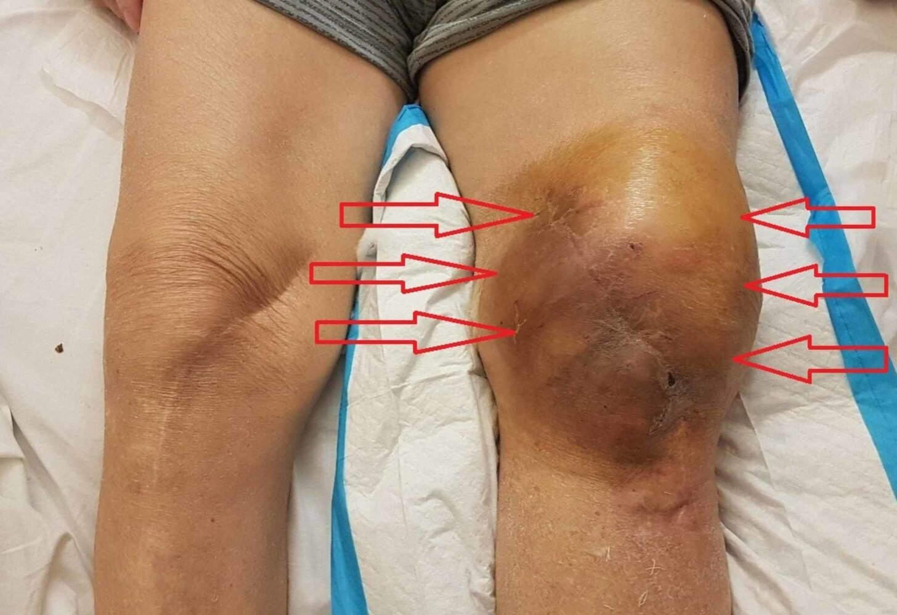
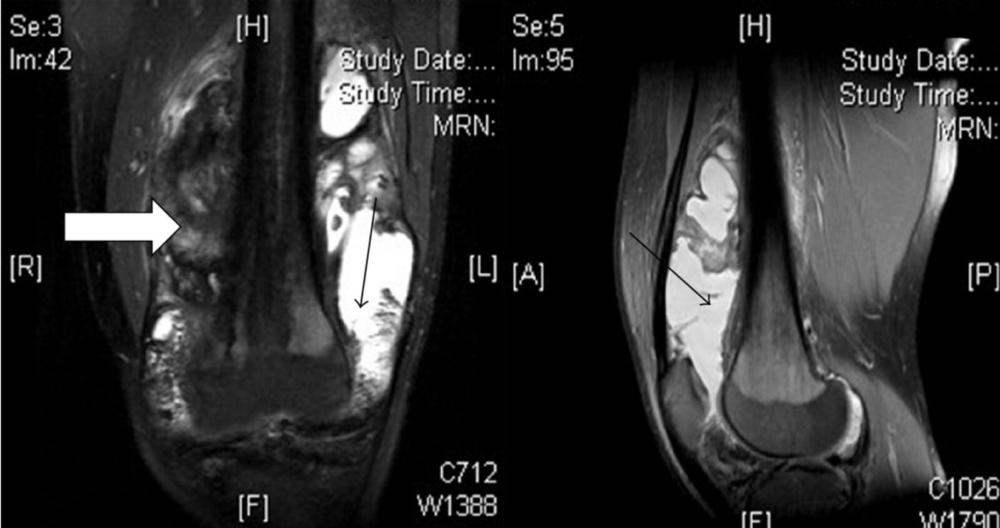

# Hemophilia

*Categories: Clinical knowledge > Emergency medicine > Hematologic and oncologic disorders > Hemophilia*

[Original Article Link](https://coursology-qbank.com/amboss/article/uT0ps2)

---

## Summary

Hemophilia is a <u>coagulation disorder</u> caused by a <u>clotting factor</u> deficiency. The three types of hemophilia classified by deficient <u>clotting factor</u> are <u>hemophilia A</u> (<u>factor VIII</u>), <u>hemophilia B</u> (<u>factor IX</u>), and <u>hemophilia C</u> (<u>factor XI</u>). <u>Hemophilia A</u> and B are the most common types, and they are typically <u>X-linked recessive disorders</u>. Clinical features include spontaneous or trauma-induced bleeding. Disease severity depends on the residual activity of the deficient <u>clotting factor</u>. Diagnosis is based on <u>coagulation studies</u> showing a prolonged <u>activated partial thromboplastin time</u> (<u>aPTT</u>) that is corrected by <u>mixing study</u>, and it is confirmed by measuring factor activity levels. Management focuses on replacing the deficient <u>clotting factor</u>, either as prophylaxis to prevent bleeding or on demand to treat acute bleeding episodes. <u>Desmopressin</u> can be used as an alternative treatment for bleeding in <u>mild hemophilia</u> A. <u>Tranexamic acid</u> and <u>aminocaproic acid</u> (<u>antifibrinolytics</u>) are used to treat minor <u>superficial</u> bleeding. <u>Emicizumab</u> may be used for prophylactic therapy in <u>hemophilia A</u>. Complications include <u>major bleeding</u> events, the development of <u>clotting factor inhibitors</u>, and <u>hemophilic arthropathy</u>.

---

## Etiology

Hemophilia is caused by an <u>X-linked recessive</u> defect (inherited or spontaneous mutation) or <u>antibody production</u> against <u>clotting factors</u>.

* Hemophilia A (<u>factor VIII</u> deficiency): ∼ 80% of cases [[2]](https://coursology-qbank.com/amboss/article/WudPJ70)

* Hemophilia B (<u>factor IX</u> deficiency): ∼ 20% of cases [[2]](https://coursology-qbank.com/amboss/article/WudPJ70)

* Hemophilia C (<u>factor XI</u> deficiency): : very rare (increased frequency in the <u>Ashkenazi Jewish population</u>; ); most commonly caused by an <u>autosomal recessive</u> defect [[3]](https://coursology-qbank.com/amboss/article/OwdIQH0)

> [!NOTE]
> Hemophilia usually affects male individuals, as it is primarily an <u>X-linked recessive disease</u>.

---

## Clinical features

* Spontaneous bleeding or delayed-onset bleeding (<u>joints</u>, muscular and <u>soft tissue</u>, <u>mucosa</u>) in response to different degrees of trauma

* Repeated <u>hemarthrosis</u> (e.g., knee <u>joint</u>) → hemophilic arthropathy (i.e., destruction of the <u>joint</u> due to repeated <u>hemarthrosis</u>)

* Typically develops by early adulthood

* Most commonly involves the knees, ankles, and <u>elbows</u>

* Recurrent <u>bruising</u> or <u>hematoma</u> formation

* Oral <u>mucosa</u> bleeding, <u>epistaxis</u>, excessive bleeding following small procedures (e.g., dentist procedures)

* <u>Hemophilia C</u> does not typically manifest with spontaneous bleeding, <u>hemarthrosis</u>, or deep tissue bleeding.  [[4]](https://coursology-qbank.com/amboss/article/2GXTAz)

* Further sites/symptoms of hemorrhage:

* <u>CNS</u> (e.g., <u>headache</u>, neck stiffness)

* <u>Gastrointestinal tract</u> (e.g., <u>melena</u>, <u>hematemesis</u>)

* Genitourinary system (e.g., <u>hematuria</u>)

* Female carriers may show mild symptoms.

* The degree of bleeding and, therefore, severity of hemophilia depends on residual factor activity levels; normal reference activity is > 50%

| Hemophilia clinical features and factor activity by disease severity [[5]](https://coursology-qbank.com/amboss/article/vhVAf80) |  |  |
| --- | --- | --- |
| Severity | Clinical features | <u>Factor VIII</u> or IX activity |
| Mild hemophilia |  <u>Hematomas</u> following severe trauma |  > 5% to < 40%  |
| Moderate hemophilia |  <u>Hematomas</u> following mild trauma |  ≥ 1% to 5% |
| Severe hemophilia | Spontaneous <u>hematomas</u>  | < 1% |

> [!NOTE]
> <u>Petechial</u> bleeding is a common sign of <u>platelet disorders</u>, but NOT of <u>coagulation disorders</u> such as hemophilia.

> [!WARNING]
> Maintain a high index of suspicion in young children, as signs of <u>joint</u> or muscle bleeding may be subtle (e.g., reluctance to move a limb). [[2]](https://coursology-qbank.com/amboss/article/WudPJ70)

> [!WARNING]
> Bleeding in hemophilia may be triggered by very minor trauma and manifest days to weeks following the event. [[6]](https://coursology-qbank.com/amboss/article/AN1Rdh0)

Hemarthrosis of the knee

Hemarthrosis in hemophilia

---

## Initial management

This section provides information on the management of bleeding emergencies in patients with known hemophilia. For a general approach to acute bleeding, see "<u>Management of acute bleeding in patients with bleeding disorders</u>."

### Approach [[2]](https://coursology-qbank.com/amboss/article/WudPJ70)[[7]](https://coursology-qbank.com/amboss/article/R-XlC00)[[8]](https://coursology-qbank.com/amboss/article/C3Vqk80)

* Triage urgently to avoid delays in treatment.

* Consult the patient's treating hematologist (preferred), the <u>hematology</u> consult service, or a hemophilia treatment center.  [[9]](https://coursology-qbank.com/amboss/article/QNVuaE0)

* When available, follow the patient's individual bleeding management plan. [[7]](https://coursology-qbank.com/amboss/article/R-XlC00)

* Administer immediate hemostatic treatment (e.g., <u>factor replacement therapy</u>).

* Provide <u>blood product</u> <u>transfusions</u> if needed (see also “<u>Massive transfusion</u>”).

* Consider diagnostics and further interventions as needed once initial treatment has been provided (see "Diagnosis").

> [!WARNING]
> Do not delay immediate hemostatic treatment to obtain diagnostic studies. [[7]](https://coursology-qbank.com/amboss/article/R-XlC00)

### Immediate hemostatic treatment [[2]](https://coursology-qbank.com/amboss/article/WudPJ70)[[7]](https://coursology-qbank.com/amboss/article/R-XlC00)[[8]](https://coursology-qbank.com/amboss/article/C3Vqk80)

See "Emergency pharmacological <u>management of hemophilia</u>" for specific indications, dosing, and additional considerations.

* Minor <u>superficial</u> bleeding

* Apply localized pressure and topical hemostatic agents (e.g., topical <u>tranexamic acid</u>)

* If bleeding continues, consider <u>desmopressin</u> (in <u>mild hemophilia</u> A) and/or <u>antifibrinolytic therapy</u>.

* All other bleeding 

* Mainstay of treatment: Administer emergency <u>factor replacement therapy</u>. 

* <u>Hemophilia A</u>;  without inhibitor: <u>factor VIII</u> replacement

* <u>Hemophilia B</u>;  without inhibitor: <u>factor IX</u> replacement

* <u>Hemophilia C</u>;  without inhibitor: <u>factor XI</u> replacement

* <u>Hemophilia A</u> or B with inhibitor: Consider bypass agent (e.g., <u>recombinant factor VIIa</u>).

* Mucocutaneous bleeding: Consider <u>antifibrinolytic therapy</u> in addition to <u>factor replacement therapy</u>.

* <u>Mild hemophilia</u> A;  with non-life-threatening and non-limb-threatening bleed: Consider <u>desmopressin</u> as an alternative to <u>factor replacement therapy</u>.

> [!WARNING]
> Signs of bleeding may be subtle or absent. Initiate hemostatic treatment promptly based on clinician, patient, or caregiver concern, even without objective findings. [[2]](https://coursology-qbank.com/amboss/article/WudPJ70)[[7]](https://coursology-qbank.com/amboss/article/R-XlC00)

### Adjunctive care [[2]](https://coursology-qbank.com/amboss/article/WudPJ70)[[7]](https://coursology-qbank.com/amboss/article/R-XlC00)

* Bleeding prevention

* Avoid tight <u>tourniquets</u>.

* Minimize traumatic or repeated needle sticks.

* In patients not requiring <u>volume replacement</u>, use the smallest gauge needles for <u>IV access</u>.

* Avoid intramuscular injections whenever possible; if unavoidable, administer <u>factor replacement therapy</u> first.

* Administer <u>factor replacement therapy</u> to a goal factor activity level of 100% before invasive procedures.  [[7]](https://coursology-qbank.com/amboss/article/R-XlC00)

* Avoid <u>antithrombotic agents</u> except for critical indications.  [[10]](https://coursology-qbank.com/amboss/article/mRVVn80)

* <u>Pain control</u>

* <u>Acetaminophen</u> and <u>opioids</u> are preferred.

* Avoid <u>NSAIDs</u>.  [[2]](https://coursology-qbank.com/amboss/article/WudPJ70)

* <u>Joint</u> and muscle bleeds

* Manage according to the <u>POLICE principles</u> in addition to <u>factor replacement therapy</u>.

* Refer to <u>physiotherapy</u> for supervised gradual reinitiation of physical activity.

### Disposition [[6]](https://coursology-qbank.com/amboss/article/AN1Rdh0)[[7]](https://coursology-qbank.com/amboss/article/R-XlC00)

* Hospital admission: Consider for any significant bleeding.

* Transfer: Consider if local hemophilia expertise is not available; initiate <u>factor replacement therapy</u> before transport.

---

## Diagnosis

See "<u>Diagnostic workup of suspected bleeding disorders</u>" for details on comprehensive evaluation.

### Diagnostics in patients with known hemophilia and bleeding [[2]](https://coursology-qbank.com/amboss/article/WudPJ70)[[7]](https://coursology-qbank.com/amboss/article/R-XlC00)[[8]](https://coursology-qbank.com/amboss/article/C3Vqk80)

Do not delay <u>factor replacement therapy</u> to obtain diagnostics. [[7]](https://coursology-qbank.com/amboss/article/R-XlC00)

* <u>Laboratory studies</u>

* <u>CBC</u>, type and cross

* <u>Coagulation studies</u> 

* Not routinely indicated unless requested by the treating hematologist

* <u>PT</u>, <u>aPTT</u>, factor levels  [[2]](https://coursology-qbank.com/amboss/article/WudPJ70)

* Imaging studies: Consider after initial treatment and stabilization to evaluate suspected bleeding sites.

### <u>Diagnosis of hemophilia</u>

#### Screening [[2]](https://coursology-qbank.com/amboss/article/WudPJ70)[[5]](https://coursology-qbank.com/amboss/article/vhVAf80)

* Indications 

* <u>Family history</u> of hemophilia or unexplained bleeding affecting siblings or maternal male relatives

* <u>Bruising</u> tendency

* Spontaneous bleeding

* Excessive bleeding after trauma or medical procedures

* Testing

* <u>Platelet count</u>: normal

* <u>Prothrombin time</u>: normal

* <u>aPTT</u>: typically prolonged

* <u>Mixing study</u>: Prolonged <u>aPTT</u> is typically corrected.  [[11]](https://coursology-qbank.com/amboss/article/LRVwn80)

> [!WARNING]
> Maintain a low threshold to screen for hemophilia, as over half of individuals with newly diagnosed <u>severe hemophilia</u> have no known <u>family history</u>. [[2]](https://coursology-qbank.com/amboss/article/WudPJ70)

> [!WARNING]
> A normal <u>aPTT</u> does not rule out <u>mild hemophilia</u>. [[2]](https://coursology-qbank.com/amboss/article/WudPJ70)

#### <u>Confirmatory testing</u> [[2]](https://coursology-qbank.com/amboss/article/WudPJ70)[[5]](https://coursology-qbank.com/amboss/article/vhVAf80)

* Indications

* Prolonged <u>aPTT</u> that is corrected with a <u>mixing study</u>

* Strong clinical suspicion (e.g., based on <u>family history</u>) despite a normal <u>aPTT</u>

* Testing: : confirmation of low factor activity level by quantitative assessment (e.g., <u>factor VIII</u>, <u>factor IX</u> assays)

> [!WARNING]
> Obtain <u>von Willebrand factor</u> <u>antigen</u> levels and activity testing in all patients with low <u>factor VIII</u> to rule out <u>von Willebrand disease</u>. [[2]](https://coursology-qbank.com/amboss/article/WudPJ70)

#### <u>Genetic testing</u> [[2]](https://coursology-qbank.com/amboss/article/WudPJ70)[[5]](https://coursology-qbank.com/amboss/article/vhVAf80)

Testing for hemophilia genetic variants is indicated for all of the following people:

* Individuals with hemophilia

* <u>Obligate carriers</u> and <u>potential carriers</u>

* Female individuals with low levels of <u>factor VIII</u> or <u>factor IX</u>

> [!TIP]
> Beyond establishing carrier status, <u>genetic testing</u> and variant analysis help predict disease severity and the development of <u>clotting factor inhibitors</u>. [[5]](https://coursology-qbank.com/amboss/article/vhVAf80)

#### Testing for <u>clotting factor inhibitors</u> [[2]](https://coursology-qbank.com/amboss/article/WudPJ70)[[5]](https://coursology-qbank.com/amboss/article/vhVAf80)[[12]](https://coursology-qbank.com/amboss/article/MRVMn80)

<u>Clotting factor inhibitors</u> are tested in patients with an established <u>diagnosis of hemophilia</u> to assess for the development of <u>hemophilia with inhibitors</u>.

* Indications

* Routine screening every 6–12 months after initiation of <u>factor replacement therapy</u>

* Inadequate clinical or laboratory response to <u>factor replacement therapy</u>

* Prior to <u>surgery</u>

* After treatment with factor concentrate for more than 5 days

* Allergic or <u>anaphylactic</u> response to <u>factor IX</u> concentrate

* Testing: <u>antibody</u> <u>titer</u> quantification

---

## Treatment

Long-term care of patients with hemophilia is guided by specialists, and is centered around preventing complications.

* Expert care: management in a hemophilia treatment center or by a hematologist with hemophilia expertise

* Prophylactic <u>factor replacement therapy</u> [[2]](https://coursology-qbank.com/amboss/article/WudPJ70)[[13]](https://coursology-qbank.com/amboss/article/audQp70)

* <u>Severe hemophilia</u>, <u>moderate hemophilia</u>, or life-threatening bleed: continuous prophylaxis

* <u>Mild hemophilia</u>: episodic prophylaxis as needed (e.g., trauma or <u>surgery</u>)

* Emicizumab 

* Description: a humanized monoclonal <u>bispecific antibody</u>

* Therapeutic use: bleeding prophylaxis in <u>hemophilia A</u>

* Mechanism of action: replaces the action of the deficient <u>factor VIIIa</u> by bridging activated <u>factor IX</u> and <u>factor X</u>  → activation of <u>factor X</u> → restoration of the <u>clotting cascade</u> [[5]](https://coursology-qbank.com/amboss/article/vhVAf80)

* <u>Gene therapy</u>: may be considered with specialist guidance [[15]](https://coursology-qbank.com/amboss/article/smVtSE0)

---