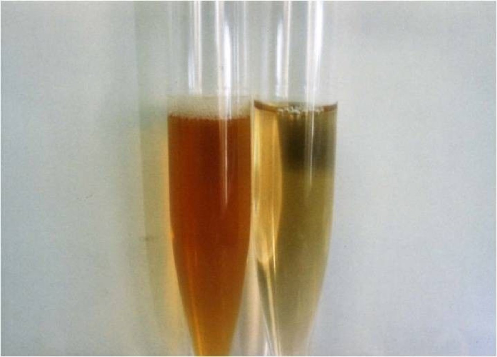

# Paroxysmal nocturnal hemoglobinuria

*Categories: Clinical knowledge > Emergency medicine > Hematologic and oncologic disorders > Paroxysmal nocturnal hemoglobinuria*

[Original Article Link](https://coursology-qbank.com/amboss/article/zH0rGh)

---

## Summary

<u>Paroxysmal</u> nocturnal <u>hemoglobinuria</u> (PNH) is a <u>hemolytic anemia</u> caused by an acquired defect of the <u>phosphatidylinositol glycan anchor</u> (<u>PIGA</u>) <u>gene</u>, which leads to dysfunction of a red <u>cell membrane</u> protein (glycosylphosphatidylinositol) that is normally responsible for protecting <u>RBCs</u> from <u>complement</u>-mediated destruction. PNH can present with <u>clinical features of hemolysis</u> (particularly <u>signs of anemia</u> and episodic <u>hemoglobinuria</u>), systemic <u>vasoconstriction</u>, <u>venous thromboemboli</u>, and <u>pancytopenia</u>. It can also occur in patients with <u>aplastic anemia</u> or <u>myelodysplastic syndrome</u>. Diagnostics typically reveal <u>laboratory signs of hemolysis</u> with a negative <u>direct Coombs test</u> (<u>DAT</u>), and PNH can be confirmed using <u>flow cytometry</u> of peripheral blood. Management ranges from <u>watchful waiting</u> and <u>supportive care</u> to targeted <u>anti-C5</u> <u>antibody</u> therapy (e.g., <u>eculizumab</u>, <u>ravulizumab</u>) for patients with significant clinical manifestations. Notable complications include <u>Budd-Chiari syndrome</u>, infections, and <u>acute leukemia</u>.

---

## Definitions

An acquired genetic defect of the <u>hematopoietic stem cell</u> characterized by a triad of <u>hemolytic anemia</u>, <u>pancytopenia</u>, and <u>thrombosis</u> [[2]](https://coursology-qbank.com/amboss/article/gCaFr5)

---

## Pathophysiology

* Physiologically, a membrane-bound <u>glycosylphosphatidylinositol (GPI) anchor</u> protects <u>RBCs</u> against <u>complement</u>-mediated <u>hemolysis</u>.

* <u>Acquired mutation</u> on the PIGA <u>gene</u> located on the X <u>chromosome</u> → <u>GPI anchor</u> loses its protective effect → <u>RBC</u> destruction by <u>complement</u> and <u>reticuloendothelial system</u> → <u>intravascular</u> and <u>extravascular hemolysis</u>  [[5]](https://coursology-qbank.com/amboss/article/vqbAZE)

* The <u>GPI anchor</u> <u>proteins</u> involved in PNH are:

* <u>CD55</u>/<u>DAF</u> (; Decay-accelerating factor)

* <u>CD59</u>/<u>MIRL</u> (Membrane inhibitor of reactive lysis)

* PNH can also occur in patients with <u>aplastic anemia</u> and <u>MDS</u>.  [[6]](https://coursology-qbank.com/amboss/article/4OY3s6)[[7]](https://coursology-qbank.com/amboss/article/kOYms6)[[8]](https://coursology-qbank.com/amboss/article/omc0g10)

---

## Clinical features

* <u>Pallor</u>, excessive fatigue, <u>weakness</u>

* Intermittent <u>jaundice</u>

* Episodes of <u>hemoglobinuria</u> causing pink/red/dark urine which usually occurs in the morning due to the <u>concentration of urine</u> overnight.  [[2]](https://coursology-qbank.com/amboss/article/gCaFr5)[[9]](https://coursology-qbank.com/amboss/article/xqbE0E)

* <u>Vasoconstriction</u>  [[9]](https://coursology-qbank.com/amboss/article/xqbE0E)

* <u>Headache</u>, <u>pulmonary hypertension</u>

* Abdominal <u>pain</u>, <u>dysphagia</u>, <u>erectile dysfunction</u>

* Venous <u>thrombosis</u> in unusual locations (e.g., hepatic, cerebral, and/or abdominal <u>veins</u>)  [[4]](https://coursology-qbank.com/amboss/article/wqbh0E)

* Increased risk of infections (in case of <u>pancytopenia</u>)

---

## Diagnosis

* <u>CBC</u>: <u>anemia</u>, <u>thrombocytopenia</u>, and/or <u>pancytopenia</u> ; usually ↑ <u>reticulocytes</u>  [[5]](https://coursology-qbank.com/amboss/article/vqbAZE)[[10]](https://coursology-qbank.com/amboss/article/fRXkmB)

* <u>Hemolysis workup</u>: ↓ <u>haptoglobin</u>, <u>hemosiderinuria</u>, <u>hemoglobinuria</u>  [[9]](https://coursology-qbank.com/amboss/article/xqbE0E)

* <u>Direct Coombs test</u>: negative  [[5]](https://coursology-qbank.com/amboss/article/vqbAZE)

* <u>Flow cytometry</u> of peripheral blood (<u>confirmatory test</u> for PNH): can show deficiency of GPI-linked <u>proteins</u> on the surface of <u>RBCs</u> and <u>WBCs</u> (e.g., <u>CD55</u>, <u>CD59</u>) [[11]](https://coursology-qbank.com/amboss/article/RRXl5B)
* Indications [[11]](https://coursology-qbank.com/amboss/article/RRXl5B)[[12]](https://coursology-qbank.com/amboss/article/3RXS5B)

* <u>Thrombosis</u> with unusual features

* Unexplained Coombs-negative <u>hemolysis</u> and/or <u>hemoglobinuria</u>

* Consider performing as part of the workup for unexplained <u>cytopenias</u>, <u>aplastic anemia</u>, and <u>myelodysplastic syndrome</u> (<u>MDS</u>).

* <u>Bone marrow biopsy</u>: not required for the <u>diagnosis of PNH</u>, but indicated in patients with significant <u>pancytopenia</u>

* Additional studies: to assess for complications, for example:

* <u>Renal function tests</u>

* <u>Liver chemistries</u> and <u>ultrasound</u> abdomen with <u>duplex scanning</u>

> [!TIP]
> CATCH PNH by testing patients with any of the following: Cytopenias, Aplastic <u>anemia</u>/<u>MDS</u>, Thrombosis, Coombs-negative <u>hemolysis</u>, and/or Hemoglobinuria. [[11]](https://coursology-qbank.com/amboss/article/RRXl5B)

> [!TIP]
> Typical biochemical findings in <u>hemolysis</u> include ↓ <u>haptoglobin</u>, ↑ <u>LDH</u> concentration, ↑ <u>indirect bilirubin</u> concentration, <u>peripheral blood smear</u> abnormalities (e.g., ↑ <u>reticulocytes</u>, <u>polychromasia</u>), and <u>urinalysis</u> abnormalities (e.g., <u>hemoglobinuria</u>, <u>hemosiderinuria</u>, and <u>urobilinogen</u>).

Paroxysmal nocturnal hemoglobinuria

---

## Treatment

### Approach [[5]](https://coursology-qbank.com/amboss/article/vqbAZE)[[10]](https://coursology-qbank.com/amboss/article/fRXkmB)[[11]](https://coursology-qbank.com/amboss/article/RRXl5B)

* Patients with mild or no clinical manifestations: <u>watchful waiting</u> with close surveillance

* Patients with significant clinical manifestations: Start <u>targeted therapy</u>.

* Provide <u>supportive care</u> for all patients.

### <u>Targeted therapy</u> [[5]](https://coursology-qbank.com/amboss/article/vqbAZE)[[10]](https://coursology-qbank.com/amboss/article/fRXkmB)[[11]](https://coursology-qbank.com/amboss/article/RRXl5B)

* Indications include <u>severe anemia</u>, <u>thrombosis</u>, severe fatigue, <u>pain</u> crises, and end-organ damage

* First-line treatment: <u>complement</u> inhibition with an <u>anti-C5</u> <u>antibody</u> (e.g., <u>eculizumab</u> DOSAGE, <u>ravulizumab</u>)

* Second-line treatment: <u>allogeneic hematopoietic stem cell transplantation</u>

* It is a curative treatment but is associated with increased mortality due to complications.  [[9]](https://coursology-qbank.com/amboss/article/xqbE0E)

* Consider in severe <u>aplastic anemia</u> or clonal evolution (e.g., <u>MDS</u>, <u>leukemia</u>).

### <u>Supportive care</u> [[5]](https://coursology-qbank.com/amboss/article/vqbAZE)[[9]](https://coursology-qbank.com/amboss/article/xqbE0E)[[10]](https://coursology-qbank.com/amboss/article/fRXkmB)[[11]](https://coursology-qbank.com/amboss/article/RRXl5B)

* <u>Anemia</u>

* Consider <u>RBC</u> <u>transfusion</u> in symptomatic or <u>severe anemia</u> (e.g., <u>Hb</u> < 7 g/dL).

* Consider <u>iron</u> and <u>folic acid supplementation</u>.

* <u>Thrombosis</u>

* Consider <u>VTE prophylaxis</u> for patients who have active <u>hemolysis</u> or a history of <u>VTE</u> and have not been treated with <u>eculizumab</u>.

* Avoid medications that increase the risk of <u>thrombosis</u> (e.g., <u>oral contraceptives</u>).

* Start therapeutic anticoagulation without delay for any venous <u>thromboembolic event</u> (e.g., <u>deep vein thrombosis</u>, <u>pulmonary embolism</u>).

* Decisions regarding therapeutic anticoagulation for <u>arterial thromboembolic events</u> should be made in consultation with a specialist.

* <u>Neisseria meningitidis</u> infection

* High risk of infection in patients receiving <u>eculizumab</u>

* Consider <u>vaccination</u> and <u>antibiotic prophylaxis</u> (see “Prevention” in “<u>Meningitis</u>”).

> [!TIP]
> Consider <u>eculizumab</u> in patients with PNH and <u>thromboembolism</u>, as it is thought to prevent <u>thrombus</u> propagation and protect patients from further <u>thromboembolic events</u>. [[10]](https://coursology-qbank.com/amboss/article/fRXkmB)

---

## Complications

* <u>Vasoconstriction</u> and <u>thrombotic</u> <u>emboli</u> leading to <u>thrombotic</u> complications, e.g., <u>infarction</u>, <u>Budd-Chiari syndrome</u> [[13]](https://coursology-qbank.com/amboss/article/MoYMcJ)

* Development of <u>acute leukemia</u>

* <u>Renal failure</u>

* <u>Smooth muscle</u> <u>dystonia</u>

* <u>Pulmonary hypertension</u>

References: [[10]](https://coursology-qbank.com/amboss/article/fRXkmB)

We list the most important complications. The selection is not exhaustive.

---