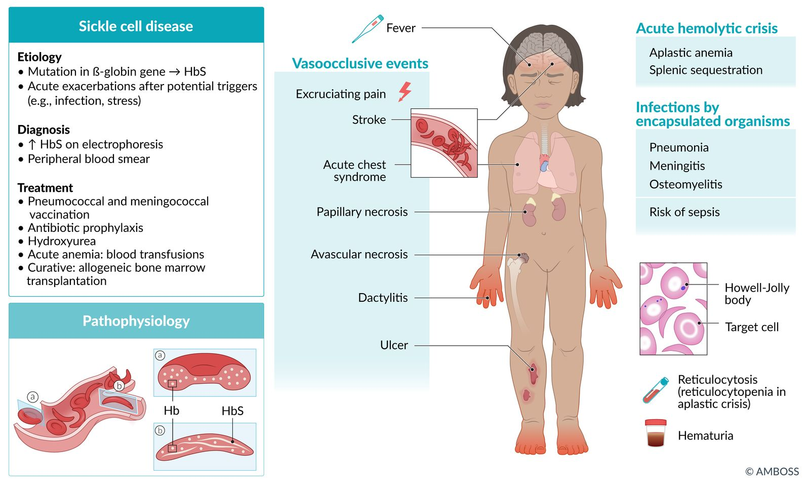
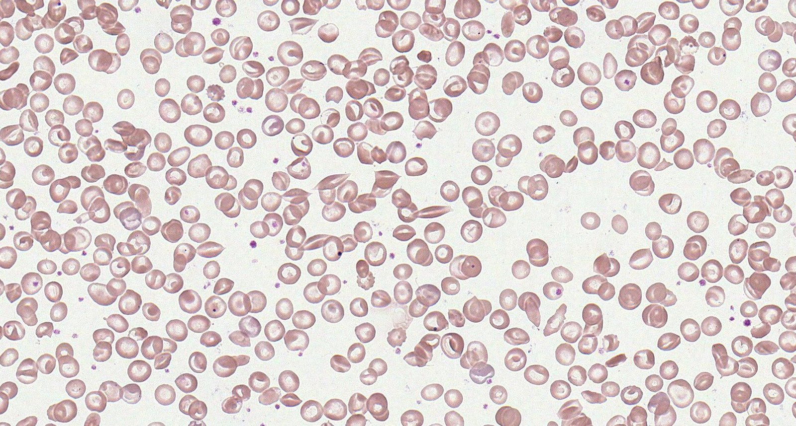
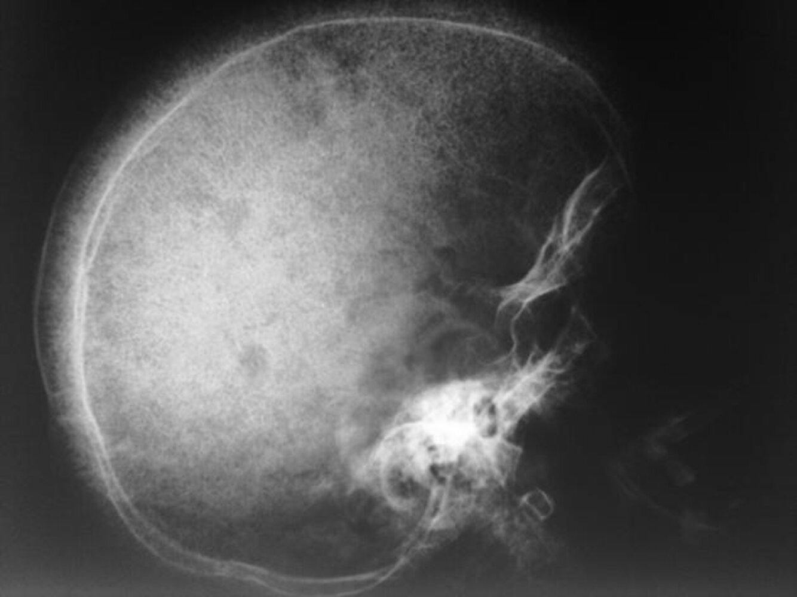

# Sickle cell disease

*Categories: Clinical knowledge > Emergency medicine > Hematologic and oncologic disorders > Sickle cell disease*

[Original Article Link](https://coursology-qbank.com/amboss/article/GT0BH2)

---

## Summary

<u>Sickle cell</u> disease is caused by hereditary <u>hemoglobinopathy</u>, which includes <u>sickle cell anemias</u> (i.e., HbSS and <u>HbSβ0thal</u>) and other <u>compound heterozygous</u> <u>genotypes</u> (e.g., <u>HbSC</u>, <u>HbSβ+thal</u>). Mutations in the <u>hemoglobin</u> β chain lead to the formation of <u>hemoglobin S</u>, which polymerizes when deoxygenated. Deoxygenated <u>HbS</u> results in sickle-shaped <u>erythrocytes</u> that can occlude <u>blood vessels</u> and cause <u>ischemia</u>. <u>Homozygous</u> <u>sickle cell anemia</u> (HbSS) is the most common variant of <u>sickle cell</u> disease and occurs predominantly in individuals of African and Eastern Mediterranean descent, although people of any ethnicity can develop <u>sickle cell</u> disease. <u>Screening for sickle cell disease</u> is routinely recommended for all <u>infants</u> born in the United States. <u>Hemoglobin</u> separation studies (e.g., <u>hemoglobin electrophoresis</u>, <u>high-performance liquid chromatography</u>) and genetic studies are used to confirm the diagnosis. Complications can begin in early <u>infancy</u> and childhood and continue for the rest of the affected individual's lifetime. Acute complications include vascular occlusion events (e.g., <u>vasoocclusive pain crisis</u>, <u>stroke</u>, <u>acute chest syndrome</u>), <u>severe anemia</u> (e.g., sequestration, <u>aplastic anemia</u>), and invasive infections from encapsulated organisms (e.g., <u>bacteremia</u>, <u>pneumonia</u>, <u>meningitis</u>, <u>osteomyelitis</u>). <u>Infants</u> with confirmed <u>sickle cell</u> disease should receive <u>antibiotic prophylaxis</u> against invasive <u>pneumococcal</u> infection and all <u>age-appropriate immunizations</u>, and <u>hydroxyurea</u> therapy. <u>Transfusion</u> therapy (e.g., for <u>vasoocclusive events</u>, <u>secondary prevention</u> of <u>stroke</u>) and <u>hydroxyurea</u> are key aspects of decreasing <u>morbidity</u> and mortality. Screening for <u>complications of sickle cell disease</u> (including annual <u>transcranial Doppler</u> to screen for <u>stroke</u> risk from 2–16 years of age) should occur at regular intervals. Long-term complications include progressive loss of organ function (e.g., <u>functional asplenia</u>, cognitive decline, <u>avascular osteonecrosis</u>) secondary to repeated infarctions. <u>Allogeneic bone marrow transplantation</u> is currently the only curative treatment option.

<u>Sickle cell trait</u>, which occurs in <u>heterozygous</u> carriers (HbSA), is not considered a form of <u>sickle cell</u> disease, but affected individuals can experience acute complications due to sickling under certain conditions, for example during high-intensity exercise or at high altitude.

---

## Epidemiology

* Predominantly affects individuals of African and Eastern Mediterranean descent [[3]](https://coursology-qbank.com/amboss/article/yUYdfo)

* Africa has the highest <u>prevalence</u> of the disease (30% <u>heterozygote</u> <u>prevalence</u>).

* <u>HbS</u> <u>gene</u> is carried by 8% of the African American population. [[4]](https://coursology-qbank.com/amboss/article/UAYbQ7)

* <u>Sickle cell anemia</u> is the most common form of <u>intrinsic hemolytic anemia</u> worldwide.

Epidemiological data refers to the US, unless otherwise specified.

---

## Pathophysiology

### Genetics

* <u>Point mutation</u> in the <u>β-globin</u> <u>gene</u> (<u>chromosome</u> 11) → <u>glutamic acid</u> replaced with <u>valine</u> (single <u>amino acid</u> substitution) → 2 <u>α-globin</u> and 2 mutated <u>β-globin</u> subunits create pathological hemoglobin S (<u>HbS</u>).

* <u>Heterozygotes</u> (<u>HbAS</u>): carry one sickle <u>allele</u> and one other (usually normal) → <u>sickle cell trait</u>

* <u>Homozygotes</u> (HbSS): carry two sickle <u>alleles</u> → <u>sickle cell anemia</u>

* <u>Glutamic acid</u> can also be replaced with a <u>lysine</u>, creating <u>hemoglobin C</u>

* Heterozygosity for <u>hemoglobin S</u> and <u>hemoglobin C</u>;  → hemoglobin SC disease → <u>phenotype</u> more severe than <u>sickle cell trait</u> but not as severe as <u>sickle cell</u> disease (e.g., fewer acute sickling events)

* <u>Homozygotes</u> (HbCC) → <u>hemoglobin C disease</u>

* <u>Heterozygotes</u> (<u>HbAC</u>) → <u>hemoglobin C trait</u>

### <u>Hemoglobin</u> composition

For details on <u>hemoglobin</u> and its variants, see “<u>Hemoglobin synthesis</u>” and “<u>Hemoglobin variants</u>” in the article “<u>Erythrocyte morphology and hemoglobin</u>.”

| <u>Hemoglobin</u> | <u>Globin</u> chains | <u>Sickle cells</u> |  |  | <u>Hemoglobin C</u> |  |
| --- | --- | --- | --- | --- | --- | --- |
| <u>Sickle cell trait</u> | <u>Sickle cell</u> disease | <u>Hemoglobin SC disease</u> (<u>HbSC</u>) | <u>Hb C carrier</u> | <u>Hb C disease</u> |  |  |
| <u>HbA</u> | ααββ | ↓ | Absent | Absent | ↓ | Absent |
| <u>HbA2</u> | ααδδ |  Normal   |  Normal   | ↓ | ↓ | Absent |
| <u>HbF</u> | ααγγ | Normal | ↑ | Normal | Normal | Normal |
| <u>HbH</u> | ββββ | Absent | Absent | Absent | Absent | Absent |
| <u>HbS</u> |  ααββ   | ↑ | ↑↑ | ↑ | Absent | Absent |
| <u>HbC</u> |  ααββ   | Absent | Absent | ↑ | ↑ | ↑↑ |

### Pathophysiology

* <u>HbS</u> polymerizes when deoxygenated, causing deformation of <u>erythrocytes</u> (“sickling”). This can be triggered by any event associated with reduced oxygen tension.

* <u>Hypoxia</u> (e.g., at high altitudes)

* In <u>homozygotes</u>, up to 100% of the <u>hemoglobin</u> molecules are affected, leading to <u>sickle cell</u> formation under minimally decreased oxygen tension.

* In <u>heterozygotes</u>, sickling only occurs due to severe reduction in oxygen tension.

* Infections

* <u>Dehydration</u>

* <u>Acidosis</u>

* Sudden changes in temperature

* <u>Stress</u>

* <u>Pregnancy</u>

* <u>Sickle cells</u> lack elasticity and adhere to vascular <u>endothelium</u>, which disrupts <u>microcirculation</u> and causes vascular occlusion and subsequent tissue <u>infarction</u>.

* <u>Extravascular hemolysis</u>;   and <u>intravascular hemolysis</u> are common and result in <u>anemia</u>.

* <u>Hemolysis</u> and the subsequent increased turnover of <u>erythrocytes</u> may increase the demand for <u>folate</u>, causing <u>folate deficiency</u>.

* The body increases the production of <u>fetal hemoglobin</u> (<u>HbF</u>) to compensate for low levels of <u>HbA</u> in <u>sickle cell</u> disease.

---

## Clinical features

### <u>Sickle cell trait</u>

* Often asymptomatic

* Painless <u>gross hematuria</u> due to <u>renal papillary necrosis</u>: often the only symptom

* <u>Hyposthenuria</u>: <u>nocturia</u>, <u>enuresis</u>

* <u>Recurrent urinary tract infections</u>

* <u>Renal medullary carcinoma</u>

* Symptoms of <u>sickle cell</u> disease may manifest due to severe oxygen deficiency.

* Exertional collapse and sudden <u>death</u> can occur during or after extreme physical exertion (e.g., during sports, military training). [[5]](https://coursology-qbank.com/amboss/article/iocJbW0)

### <u>Sickle cell</u> disease

Sickle cell fact sheet

#### Onset

* ∼ 30% develop symptoms in the first year of life; > 90% by age 6 years

* Typically manifests after 3–6 months of age as the production of <u>HbF</u> decreases and <u>HbS</u> levels increase [[6]](https://coursology-qbank.com/amboss/article/YJ1ns30)

#### Acute manifestations

* Vaso-occlusive events

* <u>Dactylitis</u> in children < 5 years of age ;  [[6]](https://coursology-qbank.com/amboss/article/YJ1ns30)

* Typically the earliest manifestation of <u>sickle cell</u> disease

* Most common in children between 6 months and 2 years of age; uncommon in older children and adults

* <u>Vasoocclusive crises</u> (<u>sickle cell pain crisis</u>) [[1]](https://coursology-qbank.com/amboss/article/vuYAGI)[[7]](https://coursology-qbank.com/amboss/article/E3c84X0)

* Most common <u>acute complication of sickle cell disease</u>

* Characterized by recurrent episodes of severe throbbing or sharp <u>pain</u>

* Typically affects the limbs, chest, and back and lasts for ∼ 7 days

* Often associated with other <u>vasoocclusive events</u> (especially <u>dactylitis</u> in children)

* <u>Acute chest syndrome</u>

* <u>Priapism</u>

* <u>Stroke</u> (common in children)

* <u>Sickle cell hepatopathy</u>

* Organ infarctions (any organ; particularly the <u>spleen</u>)

* <u>Avascular necrosis</u>

* Infection 

* <u>Pneumonia</u>

* <u>Meningitis</u>

* <u>Osteomyelitis</u>;  (most common cause: <u>Salmonella</u> spp., <u>Staphylococcus aureus</u>)

* <u>Sepsis</u>;  (most common cause: <u>Streptococcus pneumoniae</u>)

* <u>Acute hemolytic crisis</u>

* <u>Splenic sequestration</u>

* <u>Aplastic crisis</u>

Dactylitis

#### Chronic manifestations

* Chronic <u>hemolytic anemia</u>: fatigue, <u>weakness</u>, <u>pallor</u>; usually well-tolerated

* <u>Chronic pain</u>

* <u>Cholelithiasis</u> (<u>pigmented stones</u>)

> [!TIP]
> Symptoms of other forms of <u>sickle cell</u> syndrome (<u>HbSC disease</u> and <u>HbS/beta-thalassemia</u>) are similar to <u>sickle cell</u> disease but less severe.

---

## Diagnosis

### General principles

* <u>Sickle cell trait</u> and/or disease is most commonly diagnosed on routine <u>neonatal screening</u>.

* Confirmatory studies should be performed for all individuals with a positive or inconclusive result on initial screening.

* Additional <u>laboratory studies</u> (<u>CBC</u> with <u>MCV</u> and <u>reticulocyte count</u>) and imaging are not required to confirm the diagnosis but may show characteristic changes.

### Confirmatory studies [[9]](https://coursology-qbank.com/amboss/article/4rc3hd0)[[11]](https://coursology-qbank.com/amboss/article/yK1dQ30)

* Use a different modality than the initial <u>screening test</u>. [[6]](https://coursology-qbank.com/amboss/article/YJ1ns30)[[10]](https://coursology-qbank.com/amboss/article/7p14I30)

* Perform confirmatory studies within the first 2 months of age for <u>infants</u> with a positive or inconclusive result on <u>sickle cell</u> disease screening. [[1]](https://coursology-qbank.com/amboss/article/vuYAGI)[[11]](https://coursology-qbank.com/amboss/article/yK1dQ30)

#### Qualitative analysis

* Modalities

* <u>Hemoglobin electrophoresis</u>

* <u>Isoelectric focusing</u>

* Findings

* No <u>sickle cell trait</u>/disease: <u>hemoglobin A</u> and F only

* <u>Sickle cell trait</u>/disease: 

* <u>Hemoglobin S</u> is also present.

* Additional <u>hemoglobin</u> types may also be found in <u>heterozygous</u> <u>sickle cell</u> disease, e.g.:

* <u>Hemoglobin C</u> in <u>hemoglobin SC disease</u>

* <u>Hemoglobin</u> D in <u>hemoglobin SD</u>

* <u>Hemoglobin E</u> in <u>hemoglobin SE</u>

> [!TIP]
> On <u>hemoglobin electrophoresis</u>, <u>HbA</u> migrates the fastest (the greatest distance) towards the anode, followed by <u>HbF</u>, <u>HbS</u>, and <u>HbC</u> (i.e., <u>HbA</u> > <u>HbF</u> > <u>HbS</u> > <u>HbC</u>).

Hemoglobin electrophoresis

#### Quantitative analysis

* Modalities

* <u>High performance liquid chromatography</u>

* <u>Capillary electrophoresis</u>

| Quantitative analysis of <u>hemoglobin</u> types |  |  |  |
| --- | --- | --- | --- |
| <u>Hemoglobin</u> | Normal | <u>Sickle cell trait</u> | <u>Sickle cell</u> disease |
| <u>HbA</u> | 95–98% | 60% | 0% |
| <u>HbS</u> | 0% | 40% | 75–95% |
| <u>HbF</u> | < 2% | < 2% | 5–25% |

#### <u>DNA</u> studies

* Consider (in consultation with specialists) when <u>Hb electrophoresis</u> and/or chromatography cannot differentiate between <u>hemoglobinopathies</u> (e.g., HbSS and <u>HbSβ0thal</u>).

* For further information on <u>hemoglobin</u> composition and genetics of <u>sickle cell</u> disease, see “Pathophysiology.”

### Additional studies [[8]](https://coursology-qbank.com/amboss/article/FVXgwC)

#### <u>Laboratory studies</u>

* <u>CBC</u>

* Mild-to-<u>severe anemia</u> with <u>reticulocytosis</u>

* Elevated <u>neutrophils</u> and <u>platelets</u>

* <u>Peripheral blood smear</u> findings may include:

* Crescent-shaped sickled <u>RBCs</u> ; (<u>drepanocytes</u> or <u>sickle cells</u>)

* <u>Target cells</u>

* <u>Howell-Jolly bodies</u>: occur with splenic dysfunction

* <u>Reticulocytosis</u>: indicates the presence of <u>hemolysis</u>

* <u>Diagnostic studies for hemolytic anemia</u>: frequently positive

Sickle cell disease with drepanocytes and target cells

Erythrocyte morphologies in sickle-cell disease

Sickle cell disease

#### <u>Skull</u> <u>x-ray</u> [[14]](https://coursology-qbank.com/amboss/article/CicqFX0)

* May show <u>hair-on-end</u> (“crew cut”) sign

* Caused by <u>periosteal reaction</u> to erythropoietic <u>bone marrow</u> <u>hyperplasia</u>

Hair-on-end appearance of the skull

> [!NOTE]
> <u>Hair-on-end appearance</u> on <u>skull</u> <u>x-ray</u> may also be present in patients with <u>thalassemia</u>.

---

## Long-term management

Patients with <u>sickle cell</u> disease should ideally be managed in comprehensive <u>sickle cell</u> disease centers. Management of patients who do not have easy access to such specialized centers should be done in frequent consultation with hematologists or <u>sickle cell</u> experts. [[15]](https://coursology-qbank.com/amboss/article/M61Ml30)

### Overview [[1]](https://coursology-qbank.com/amboss/article/vuYAGI)[[16]](https://coursology-qbank.com/amboss/article/B7czLd0)

* <u>Infants</u> and children

* Immunizations

* <u>Antibiotic prophylaxis</u> against invasive <u>pneumococcal</u> disease until 5 years of age

* <u>Hydroxyurea</u> therapy regardless of clinical severity to minimize disease-related complications

* Annual <u>transcranial Doppler</u> to screen for <u>stroke</u> risk from 2–16 years of age

* Regular monitoring for other common <u>complications of sickle cell disease</u>

* Adults

* Immunizations

* <u>Hydroxyurea</u> therapy if clinically indicated

* Reproduction counseling and <u>contraception</u>

* Regular <u>monitoring for complications of sickle cell disease</u>

* Educate all patients or caregivers on: [[16]](https://coursology-qbank.com/amboss/article/B7czLd0)

* Signs and symptoms of <u>complications of sickle cell disease</u>

* Importance of attending regular screenings

* How to seek specialist medical advice

* Treatment options (e.g., <u>hydroxyurea</u>, <u>HSCT</u>)

### Infection prevention [[1]](https://coursology-qbank.com/amboss/article/vuYAGI)

* Immunizations

* Patients should receive all <u>vaccines</u> recommended for their age.

* <u>Pneumococcal vaccines</u> and <u>meningococcal vaccines</u> are particularly important; earlier/additional doses may be required.  [[1]](https://coursology-qbank.com/amboss/article/vuYAGI)

* <u>Antibiotic prophylaxis</u> against invasive <u>pneumococcal</u> disease

* Daily prophylactic <u>penicillin</u>DOSAGE [[1]](https://coursology-qbank.com/amboss/article/vuYAGI)

* Recommended from early <u>infancy</u> (1–2 months of age) until 5 years of age for children with HbSS  . [[1]](https://coursology-qbank.com/amboss/article/vuYAGI)[[6]](https://coursology-qbank.com/amboss/article/YJ1ns30)

* Continue <u>penicillin</u> prophylaxis in children who have had a <u>splenectomy</u> or history of invasive <u>pneumococcal</u> infection.

* <u>Erythromycin</u> prophylaxis DOSAGE is suitable for children with <u>penicillin</u> <u>allergy</u>. [[17]](https://coursology-qbank.com/amboss/article/i61Jk30)[[18]](https://coursology-qbank.com/amboss/article/j61_k30)

* Educate patients/caregivers to seek immediate medical attention if <u>fever</u> > 38.5°C (> 101.3°F) occurs.

> [!TIP]
> Initiate early <u>antibiotic prophylaxis</u> and ensure appropriate immunizations in all <u>infants</u> confirmed to have <u>sickle cell</u> disease to minimize the risk of serious infections. [[1]](https://coursology-qbank.com/amboss/article/vuYAGI)[[11]](https://coursology-qbank.com/amboss/article/yK1dQ30)

### Prevention of <u>vasoocclusive crises</u> and <u>anemia</u> [[1]](https://coursology-qbank.com/amboss/article/vuYAGI)[[16]](https://coursology-qbank.com/amboss/article/B7czLd0)

The following pharmacologic interventions and avoidance of known triggers (e.g., <u>dehydration</u>, high altitudes) are the main aspects of preventing <u>complications of sickle cell disease</u>.

#### Hydroxyurea therapy

* First-line agent: <u>hydroxyurea</u> DOSAGE [[1]](https://coursology-qbank.com/amboss/article/vuYAGI)[[16]](https://coursology-qbank.com/amboss/article/B7czLd0)

* <u>Hydroxyurea</u> reduces the <u>incidence</u> of acute painful episodes and improves survival.

##### Indications [[1]](https://coursology-qbank.com/amboss/article/vuYAGI)[[16]](https://coursology-qbank.com/amboss/article/B7czLd0)

* All <u>infants</u> > 9 months, children, and <u>adolescents</u> with <u>sickle cell anemia</u> regardless of symptom severity

* Adults with any of the following:

* Frequent (≥ 3 episodes/year) <u>acute pain</u> episodes or other <u>vasoocclusive events</u>

* Regular <u>pain</u> that interferes with <u>activities of daily living</u> and quality of life.

* Severe <u>symptomatic anemia</u>

* History of severe and/or recurrent <u>acute chest syndrome</u>

##### Mechanism of action

Stimulation of <u>erythropoiesis</u> and increased <u>fetal hemoglobin</u> → proportional reduction of sickled <u>hemoglobin</u> → decreased <u>red blood cell</u> polymerization → fewer <u>vasoocclusive episodes</u>

##### Monitoring [[1]](https://coursology-qbank.com/amboss/article/vuYAGI)

* Monitor <u>CBC</u> and <u>reticulocytes</u> every 4 weeks during dose <u>titration</u>.

* Increase dose only if cell counts are in an acceptable range.

* If <u>neutropenia</u> or <u>thrombocytopenia</u> occurs: 

* Withhold <u>hydroxyurea</u> temporarily.

* Monitor <u>CBC</u> until counts increase.

* Restart <u>hydroxyurea</u> at a dose 5 mg/kg/day lower than the previous dose.

* Once on a stable dose, monitor <u>HbF</u> concentration, <u>CBC</u>, <u>reticulocyte count</u> every 3 months.

##### Possible adverse effects

* Darkening of <u>skin</u> and nailbeds

* <u>Myelosuppression</u>

* <u>Macrocytic anemia</u> with megaloblastic or nonmegaloblastic features

##### Important considerations [[1]](https://coursology-qbank.com/amboss/article/vuYAGI)[[16]](https://coursology-qbank.com/amboss/article/B7czLd0)

* The safety of <u>hydroxyurea</u> therapy during <u>pregnancy</u> and <u>breastfeeding</u> has not been established.  [[1]](https://coursology-qbank.com/amboss/article/vuYAGI)[[19]](https://coursology-qbank.com/amboss/article/P61WO30)

* Perform a <u>pregnancy test</u> before initiating <u>hydroxyurea</u> therapy.

* Counsel patients (both male and female) on the need for <u>contraception</u> during <u>hydroxyurea</u> therapy.

* Clinical response to <u>hydroxyurea</u> may be seen only after 3–6 months of therapy.

* Educate patients on the importance of <u>treatment adherence</u>.

* Failure to respond to therapy (after at least 6 months of <u>hydroxyurea</u> therapy at the maximum tolerated dose): Refer to a <u>sickle cell</u> expert.

#### Novel therapies for <u>sickle cell</u> disease [[16]](https://coursology-qbank.com/amboss/article/B7czLd0)

<u>Hydroxyurea</u> and chronic <u>blood transfusions</u> are the most established therapies for <u>sickle cell</u> disease. Recently approved agents include the following.

* Oral L-glutamine: for children ≥ 5 years of age  [[16]](https://coursology-qbank.com/amboss/article/B7czLd0)[[20]](https://coursology-qbank.com/amboss/article/4613O30)

* Crizanlizumab: for patients ≥ 16 years of age with a history of <u>vasoocclusive crises</u>  [[21]](https://coursology-qbank.com/amboss/article/THc6pd0)[[22]](https://coursology-qbank.com/amboss/article/gHcFpd0)

* <u>Gene therapy</u>: for patients ≥ 12 years of age with recurrent vasocclusive crises [[23]](https://coursology-qbank.com/amboss/article/Sgdyu60)

* <u>Exagamglogene autotemcel</u>

* <u>Lovotibeglogene autotemcel</u>

### <u>Allogeneic bone marrow transplantation</u> (<u>allogeneic HSCT</u>) [[24]](https://coursology-qbank.com/amboss/article/fJcktW0)

* Overview

* Currently the only potentially curative option

* Associated with better outcomes if performed at a younger age (< 16 years)

* However, there is a paucity of evidence on the overall benefit of <u>allogeneic HSCT</u> in patients with <u>sickle cell</u> disease.

* Indications

* <u>Genotype</u> associated with <u>sickle cell anemia</u> (e.g., HbSS, Hbβ0-thal)

* Presence of complications, e.g.:

* History of overt <u>stroke</u> or abnormal <u>transcranial Doppler</u>

* Recurrent episodes of <u>pain</u> and/or <u>ACS</u> episodes that are unresponsive to chronic <u>transfusions</u>, <u>hydroxyurea</u>, or novel therapies

* Donor choice: <u>HLA</u>-matched related donors are preferred over nonrelated donors.

### Screening for complications

Individuals with <u>sickle cell</u> disease are at risk for <u>hemolysis</u> due to shortened <u>RBC</u> lifespans and <u>end-organ damage</u> from repeated <u>infarcts</u> secondary to sickling.

|  Screening for complications of sickle cell disease [[1]](https://coursology-qbank.com/amboss/article/vuYAGI)[[16]](https://coursology-qbank.com/amboss/article/B7czLd0)  |  |  |
| --- | --- | --- |
|  |  | Studies and further management |
|  <u>Stroke</u> risk [[1]](https://coursology-qbank.com/amboss/article/vuYAGI)[[16]](https://coursology-qbank.com/amboss/article/B7czLd0)[[25]](https://coursology-qbank.com/amboss/article/fJbktu)[[26]](https://coursology-qbank.com/amboss/article/ApcRHW0)  |  |   * Asymptomatic children (2–16 years old) : annual <u>transcranial Doppler ultrasound</u> (<u>TCD</u>) to screen for increased risk of <u>stroke</u>  [[1]](https://coursology-qbank.com/amboss/article/vuYAGI)[[25]](https://coursology-qbank.com/amboss/article/fJbktu)  * Asymptomatic patients with HbSS or <u>HbSβ0thal</u>: Screen for silent cerebral <u>infarcts</u>. [[27]](https://coursology-qbank.com/amboss/article/qqbCzu)  * Early-<u>school age children</u> (e.g., age 10 years): <u>MRI</u>/<u>MRA</u> <u>brain</u> (without sedation) once  * Adult: Consider one-time screening <u>MRI</u> <u>brain</u>.  * All children and adults: Screen for <u>developmental delay</u> and cognitive impairment at each visit.  * Secondary stroke prevention in sickle cell disease: recommended in patients with evidence of previous <u>stroke</u> (including silent <u>infarcts</u>) or abnormal <u>TCD</u> velocities  * <u>RBC</u> <u>transfusions</u> (preferably <u>exchange transfusion</u>) every 3–4 weeks; maintain <u>Hb</u> > 9 g/dL and <u>HbS</u> < 30%  [[1]](https://coursology-qbank.com/amboss/article/vuYAGI)[[25]](https://coursology-qbank.com/amboss/article/fJbktu)  * Alternatives  * <u>Hydroxyurea</u>  [[25]](https://coursology-qbank.com/amboss/article/fJbktu)  * Consider <u>allogeneic HSCT</u> in patients with a matched related sibling donor.  [[24]](https://coursology-qbank.com/amboss/article/fJcktW0)    |
|  <u>Hemolysis</u> [[16]](https://coursology-qbank.com/amboss/article/B7czLd0)  |  |   * <u>CBC</u> with <u>reticulocytes</u> at every visit  * If abnormal, perform further <u>diagnostic studies for hemolytic anemia</u>.    |
|  Impaired renal function [[1]](https://coursology-qbank.com/amboss/article/vuYAGI)[[16]](https://coursology-qbank.com/amboss/article/B7czLd0)  |  |  * Age ≥ 10 years: annual <u>urinalysis</u> and urine <u>albumin</u>/<u>creatinine</u> <u>ratio</u>  * Abnormal <u>urinalysis</u> and/or urine <u>albumin</u>/<u>creatinine</u> <u>ratio</u>: Perform <u>first-morning void</u> urine <u>albumin</u>-<u>creatinine</u> <u>ratio</u>, <u>CMP</u> with <u>BUN</u>, <u>creatinine</u>, and <u>GFR</u>.  * Abnormal follow-up tests: Refer to nephrology for further management.  [[16]](https://coursology-qbank.com/amboss/article/B7czLd0)   |
|  Hepatobiliary disease [[1]](https://coursology-qbank.com/amboss/article/vuYAGI)  |  |   * Monitor for <u>hepatomegaly</u>.  * Consider <u>ultrasound</u> screening for <u>gallstones</u>.   * Asymptomatic <u>cholelithiasis</u>: <u>watchful waiting</u>  * <u>Symptomatic cholelithiasis</u>: <u>cholecystectomy</u>    |
|  <u>Pulmonary hypertension</u> and <u>diastolic dysfunction</u> [[16]](https://coursology-qbank.com/amboss/article/B7czLd0)  |  |  * Screening <u>echocardiogram</u> at 10 years of age  * Abnormal: Refer to cardiology for further management.  * Normal: Repeat every 2–5 years.   |
|  Respiratory disease [[1]](https://coursology-qbank.com/amboss/article/vuYAGI)[[16]](https://coursology-qbank.com/amboss/article/B7czLd0)  |  |   * Assess for signs and symptoms of respiratory disease (e.g., <u>asthma</u>, <u>COPD</u>, <u>obstructive sleep apnea</u>) at every visit.  * Establish baseline <u>oxygen saturations</u>.  * Signs or symptoms of respiratory disease present:  * Perform <u>pulmonary function tests</u> (<u>PFT</u>) annually.  * Refer symptomatic patients or those with abnormal <u>PFTs</u> to a pulmonologist for further management.    |
|  <u>Retinopathy</u> [[1]](https://coursology-qbank.com/amboss/article/vuYAGI)  |  |  * Age ≥ 10: Perform annual dilated ophthalmologic exams.   |
|  Bone disease [[16]](https://coursology-qbank.com/amboss/article/B7czLd0)  |  |   * Monitor <u>vitamin D</u> levels; <u>treat vitamin D deficiency</u> if present.  * At age 10, assess <u>bone mineral density</u>.  * Refer to a dietitian and repeat screening if abnormal.    |
|  Transfusional <u>iron overload</u>   |  |   * <u>Ferritin</u> level every month and/or after every <u>transfusion</u> [[16]](https://coursology-qbank.com/amboss/article/B7czLd0)[[28]](https://coursology-qbank.com/amboss/article/87cOnd0)  * Consider <u>MRI</u> <u>liver</u> every 1–2 years.  [[29]](https://coursology-qbank.com/amboss/article/ApXRH_)  * Patients at risk for or with <u>iron overload</u>: <u>iron chelation</u> therapy [[30]](https://coursology-qbank.com/amboss/article/2JcTtW0)    |

### Management of <u>chronic pain</u> [[1]](https://coursology-qbank.com/amboss/article/vuYAGI)

* <u>Pain</u> lasting > 3 months is considered chronic.

* Etiology is often nonspecific; maybe due to <u>avascular necrosis</u> or neuropathy

* Tailor management to the individual.

* <u>Analgesic</u> options include <u>NSAIDs</u>, <u>opioids</u>, <u>adjuvant analgesics</u> (e.g., <u>antidepressants</u>, <u>anticonvulsants</u>), and adjunctive nonpharmacological therapies (e.g., <u>acupuncture</u>, massage therapy, cognitive interventions).

---

## Transfusion therapy

### General principles [[1]](https://coursology-qbank.com/amboss/article/vuYAGI)[[29]](https://coursology-qbank.com/amboss/article/ApXRH_)

* Mechanism of action

* <u>Transfusion</u> of normal (<u>HbA</u>) <u>erythrocytes</u> decreases the percentage of <u>HbS</u> <u>erythrocytes</u>.

* Achieved by diluting (<u>simple transfusion</u>) or replacing (<u>exchange transfusion</u>) patient's <u>HbS</u> <u>erythrocytes</u> with donor <u>HbA</u> <u>erythrocytes</u>

* Main indications

* Exchange <u>transfusions</u> are preferred for the prevention and treatment of <u>vasoocclusive events</u> (e.g., severe <u>acute chest syndrome</u>, <u>stroke</u>, <u>multisystem organ failure</u>).

* Simple <u>transfusions</u> are preferred for the management of <u>acute anemia in sickle cell disease</u>.

* Important pre-<u>transfusion</u> considerations to minimize risk of <u>alloimmunization</u> and <u>transfusion reactions</u>:

* In addition to <u>ABO typing</u> and Rh matching, consider <u>extended RBC phenotype matching</u> before the first <u>transfusion</u>. [[29]](https://coursology-qbank.com/amboss/article/ApXRH_)

* Leukoreduced packed <u>red blood cell</u> (<u>pRBC</u>) units are preferred. [[1]](https://coursology-qbank.com/amboss/article/vuYAGI)

* Monitoring

* Quantitative <u>hemoglobin</u> studies can track improvements in <u>hemoglobin S</u> percentages before and after <u>transfusions</u>.

* Monitor patients on chronic <u>transfusion</u> therapy for complications, such as, <u>iron overload</u>, <u>alloimmunization</u>, autoimmunization, and <u>delayed transfusion reactions</u> (see “<u>Transfusion reactions</u>” for details). [[29]](https://coursology-qbank.com/amboss/article/ApXRH_)

> [!WARNING]
> <u>Transfusions</u> of uncrossmatched or type-specific blood can be given to patients with <u>severe anemia</u> causing hemodynamic compromise or <u>shock</u>. Do not delay <u>transfusion</u> in these patients while awaiting results of recommended <u>pRBC</u> matching criteria. [[31]](https://coursology-qbank.com/amboss/article/57cimd0)

> [!TIP]
> Patients with <u>sickle cell</u> disease should ideally receive <u>pRBC</u> <u>transfusions</u> that are matched for C, E, and K <u>antigens</u>. Perform <u>extended RBC phenotype matching</u> when possible. [[1]](https://coursology-qbank.com/amboss/article/vuYAGI)[[29]](https://coursology-qbank.com/amboss/article/ApXRH_)

### Simple <u>transfusions</u> and exchange <u>transfusions</u> [[1]](https://coursology-qbank.com/amboss/article/vuYAGI)[[29]](https://coursology-qbank.com/amboss/article/ApXRH_)

Both <u>simple transfusion</u> and <u>exchange transfusion</u> are used in the management of <u>sickle cell</u> disease depending on availability and indication.

|  Simple <u>transfusions</u> versus exchange <u>transfusions</u> [[1]](https://coursology-qbank.com/amboss/article/vuYAGI)[[29]](https://coursology-qbank.com/amboss/article/ApXRH_)  |  |  |
| --- | --- | --- |
|  | Simple <u>transfusions</u> | Exchange <u>transfusions</u> |
| Definition |  * <u>Transfusion</u> of donor <u>erythrocytes</u> without prior removal of recipient blood   |  * Removal of the recipient's blood (<u>erythrocytapheresis</u>) and replacing it with allogeneic (donor) <u>erythrocyte</u> infusion   |
| Advantages |   * Readily available  * Easy to perform    |   * Allows for more precise control of <u>hemoglobin</u> percentages  * Lower risk of <u>iron overload</u>  * Decreases <u>HbS</u> percentage faster than a <u>simple transfusion</u>  * Increases percentage of normal <u>HbA</u> without increasing the patient's <u>hematocrit</u>  [[1]](https://coursology-qbank.com/amboss/article/vuYAGI)    |
| Disadvantages |   * Increases <u>Hct</u> levels, which increases viscosity and the risk of <u>vasoocclusive events</u>  * More likely to cause <u>iron overload</u>    |   * Expensive  * Necessitates specialized equipment and expertise  * Increased risk of <u>alloimmunization</u> due to increased <u>RBC</u> exposure  [[29]](https://coursology-qbank.com/amboss/article/ApXRH_)  * Often requires central access    |
| Target <u>Hb</u> levels |  * Usually <u>Hb</u> 10 g/dL  [[1]](https://coursology-qbank.com/amboss/article/vuYAGI)[[16]](https://coursology-qbank.com/amboss/article/B7czLd0)   |  * Variable, based on the patient's baseline <u>Hb</u> levels and the indication   |

> [!WARNING]
> Unless directed by a <u>sickle cell</u> expert, avoid transfusing to <u>Hb</u> > 10 g/dL (unless <u>HbS</u> percentage is already low) because doing so increases the risk of hyperviscosity and <u>vasoocclusive events</u>. [[1]](https://coursology-qbank.com/amboss/article/vuYAGI)[[16]](https://coursology-qbank.com/amboss/article/B7czLd0)

### Indications for transfusion in sickle cell disease

|  Conditions necessitating <u>pRBC transfusion</u> in <u>sickle cell</u> disease [[1]](https://coursology-qbank.com/amboss/article/vuYAGI)[[29]](https://coursology-qbank.com/amboss/article/ApXRH_)[[32]](https://coursology-qbank.com/amboss/article/wuYhtI)  |  |  |  |
| --- | --- | --- | --- |
| Indications for <u>transfusion</u> |  |  |  Preferred type of <u>transfusion</u> [[1]](https://coursology-qbank.com/amboss/article/vuYAGI)  |
|  Acute indications (Acute <u>transfusion</u> therapy)   | <u>Vasoocclusive events</u> |  * Symptomatic severe <u>acute chest syndrome</u> (<u>SpO2</u> < 90% on <u>supplemental oxygen</u>)   |  * <u>Exchange transfusion</u>   |
|   * <u>Stroke</u>  * <u>Hepatic sequestration</u> and intrahepatic <u>cholestasis</u>  * <u>Multisystem organ failure</u>    |  * Simple or <u>exchange transfusion</u>   |  |  |
| <u>Anemia</u> |   * <u>Aplastic crisis</u> (<u>severe anemia</u>)  * Symptomatic moderate <u>acute chest syndrome</u> with <u>anemia</u> (<u>Hb</u> ≥ 1 g/dL below baseline)  * Acute <u>splenic sequestration</u> PLUS <u>severe anemia</u>  * <u>Anemia</u> during <u>pregnancy</u> [[29]](https://coursology-qbank.com/amboss/article/ApXRH_)    |  * <u>Simple transfusion</u>   |  |
| Long-term prevention (Chronic <u>transfusion</u> therapy) |  |  * <u>Stroke</u> prevention  * Children with abnormal <u>transcranial Doppler</u> results  * Adults and children with a history of <u>stroke</u>   |  * <u>Exchange transfusion</u> is preferred over <u>simple transfusion</u>. [[25]](https://coursology-qbank.com/amboss/article/fJbktu)[[29]](https://coursology-qbank.com/amboss/article/ApXRH_)   |
|  Prophylactic <u>transfusion</u> |  |   * Perioperative <u>transfusion</u>   * <u>Hb</u> < 9 g/dL prior to <u>general anesthesia</u>  [[1]](https://coursology-qbank.com/amboss/article/vuYAGI)[[29]](https://coursology-qbank.com/amboss/article/ApXRH_)  * High-risk <u>surgery</u>  * <u>Sickle cell anemia</u> or more severe <u>phenotypes</u>  * Consider prophylactic <u>transfusions</u> during <u>pregnancy</u>.    |  * Consult a <u>sickle cell</u> disease expert to determine the best type of <u>transfusion</u>.   |

---

## Management of acute complications

<u>Sickle cell</u> disease is associated with multiple acute complications, which require timely recognition and management to decrease <u>morbidity</u> and mortality. The most common categories of complications are <u>vasoocclusive crises</u>, other <u>vasoocclusive events</u>, infection, and <u>severe anemia</u>. [[1]](https://coursology-qbank.com/amboss/article/vuYAGI)[[7]](https://coursology-qbank.com/amboss/article/E3c84X0)[[33]](https://coursology-qbank.com/amboss/article/ChcqTX0)

* <u>ABCDE approach</u>

* Start <u>supplemental O2</u> if <u>SpO2</u> is < 95%.

* Administer <u>analgesics</u>.

* Order diagnostics as needed (e.g., <u>CBC</u>, <u>reticulocyte count</u>, <u>CMP</u>, <u>liver chemistries</u>, <u>chest x-ray</u>, <u>blood cultures</u>).

* Use <u>IV fluids</u> judiciously; overhydration can trigger or worsen <u>acute chest syndrome</u>. [[1]](https://coursology-qbank.com/amboss/article/vuYAGI)[[6]](https://coursology-qbank.com/amboss/article/YJ1ns30)[[34]](https://coursology-qbank.com/amboss/article/9uYNtI)

* Consult <u>hematology</u> urgently.

* Assess the need for <u>transfusion</u>; see “<u>Indications for transfusion in sickle cell disease</u>.”

* Manage the underlying event; see “<u>Acute complications of sickle cell disease</u>” for possible etiologies.

---

## Vasoocclusive crisis (sickle cell pain crisis)

### Approach [[1]](https://coursology-qbank.com/amboss/article/vuYAGI)[[33]](https://coursology-qbank.com/amboss/article/ChcqTX0)

* Provide prompt and proactive <u>pain management</u>.

* Address modifiable causes of <u>erythrocyte</u> sickling (e.g., <u>dehydration</u>, <u>hypoxia</u>).

* Ensure adequate hydration.

* Encourage oral hydration, consider <u>antiemetics</u> if not tolerated.

* Assess for indications for <u>IV fluids</u>.  [[1]](https://coursology-qbank.com/amboss/article/vuYAGI)[[33]](https://coursology-qbank.com/amboss/article/ChcqTX0)

* <u>Clinical features of dehydration and hypovolemia</u>: Consider IV <u>normal saline</u> boluses. [[33]](https://coursology-qbank.com/amboss/article/ChcqTX0)

* <u>Euvolemic</u> patient who is unable to drink: <u>IV fluids</u> no higher than the <u>maintenance fluid</u> rate.

* Administer <u>supplemental oxygen</u> if <u>SpO2</u> on room air is < 95%. [[1]](https://coursology-qbank.com/amboss/article/vuYAGI)

* Consider diagnostics for: 

* Evaluation of known triggers (e.g., <u>dehydration</u>, infection) or complications (e.g., <u>end-organ damage</u>)

* Exclusion of differential diagnoses in patients with atypical features:

* Evaluate for <u>acute chest syndrome</u> in patients with prominent <u>chest pain</u>.

* Evaluate for infection in <u>febrile</u> patients.

* Patients requiring admission

* Consult <u>hematology</u>.

* Reassess <u>pain</u> levels every 30–60 minutes and titrate <u>analgesic</u> dose as needed.

> [!TIP]
> Patients with <u>sickle cell</u> disease often face <u>bias</u> when seeking emergent medical management for <u>pain</u>. Believe the patient's <u>pain</u> and remember that <u>sickle cell</u> disease can occur in patients of all ethnicities. [[33]](https://coursology-qbank.com/amboss/article/ChcqTX0)

> [!WARNING]
> Symptoms of <u>vasoocclusive crisis</u> can overlap with other complications (e.g., <u>acute chest syndrome</u>, <u>stroke</u>, infection). If there is clinical uncertainty, initiate a diagnostic workup and seek specialist advice immediately. [[1]](https://coursology-qbank.com/amboss/article/vuYAGI)

> [!WARNING]
> Overhydration can trigger <u>acute chest syndrome</u>; administer <u>IV fluids</u> judiciously. [[34]](https://coursology-qbank.com/amboss/article/9uYNtI)

### <u>Pain management</u> [[1]](https://coursology-qbank.com/amboss/article/vuYAGI)[[33]](https://coursology-qbank.com/amboss/article/ChcqTX0)[[35]](https://coursology-qbank.com/amboss/article/Cpcq7W0)

* Management should be guided by patient-reported <u>pain</u> severity.

* Consider alternative diagnoses (e.g., <u>acute chest syndrome</u>, acute <u>MI</u>, <u>septic arthritis</u>) if <u>pain</u> is atypical.

#### <u>Analgesics</u> [[1]](https://coursology-qbank.com/amboss/article/vuYAGI)[[33]](https://coursology-qbank.com/amboss/article/ChcqTX0)

* Use individualized (preferred) or <u>sickle cell</u>-specific <u>pain management</u> protocols.

* Parenteral <u>opioids</u> (<u>morphine</u> or <u>hydromorphone</u>) are preferred for moderate to severe <u>pain</u> crises.

* Administer first dose within 30–60 minutes of arrival.

* If an IV cannot be established quickly, administer subcutaneously or intranasally.

* <u>Opioid-tolerant</u> patients

* Patients on long-acting oral <u>opioids</u>: Continue the home dose.

* Patients on <u>short-acting opioids</u>: Convert current total daily dose to IV <u>equivalent dose</u>.

* <u>Opioid</u>-naive patients: Follow doses recommended in “<u>Parenteral analgesia</u>.”

* Consider adjunctive <u>NSAIDs</u> for 5–7 days if there are no <u>contraindications to NSAIDs</u>.  [[33]](https://coursology-qbank.com/amboss/article/ChcqTX0)

#### Reassessment and disposition

* Titrate medications to effect.

* Reevaluate <u>pain</u> every 15–30 minutes until well controlled.

* Consider incremental dose escalations of 25% for uncontrolled <u>pain</u>. [[1]](https://coursology-qbank.com/amboss/article/vuYAGI)

* Consider adjunctive nonpharmacological modalities  [[33]](https://coursology-qbank.com/amboss/article/ChcqTX0)

* Uncontrolled <u>pain</u> after 6–8 hours [[1]](https://coursology-qbank.com/amboss/article/vuYAGI)

* Admit the patient.

* Consider <u>patient-controlled analgesia</u> (PCA).

* Consider consulting <u>pain management</u> services for adjuvant therapies.  [[33]](https://coursology-qbank.com/amboss/article/ChcqTX0)

> [!TIP]
> If possible, consider starting PCA dosing in the emergency room to prevent delays in <u>pain control</u>. [[1]](https://coursology-qbank.com/amboss/article/vuYAGI)

> [!WARNING]
> Avoid <u>steroids</u> for <u>pain</u> crisis (unless indicated for another condition, e.g., <u>asthma</u>) because <u>steroid</u> use is associated with complications, including rebound <u>pain</u>. [[33]](https://coursology-qbank.com/amboss/article/ChcqTX0)

#### Further management [[1]](https://coursology-qbank.com/amboss/article/vuYAGI)[[33]](https://coursology-qbank.com/amboss/article/ChcqTX0)

* Monitoring

* Frequently assess the patient with objective <u>pain</u> and sedation scales. [[1]](https://coursology-qbank.com/amboss/article/vuYAGI)

* Admitted patients

* Monitor <u>CBC</u> and <u>reticulocyte count</u> until clinical improvement.

* Monitor <u>SpO2</u> when administering around-the-clock <u>opioid</u> <u>analgesia</u>. [[1]](https://coursology-qbank.com/amboss/article/vuYAGI)[[36]](https://coursology-qbank.com/amboss/article/BhczTX0)

* <u>Secondary prevention</u>

* Encourage <u>incentive spirometry</u> every 2–4 hours while awake and early ambulation to prevent <u>atelectasis</u> and <u>acute chest syndrome</u>.  [[1]](https://coursology-qbank.com/amboss/article/vuYAGI)

* Encourage fluid and recommended fiber intake and consider <u>stool softeners</u> or <u>laxatives</u> to prevent <u>opioid-induced constipation</u>.

* Manage <u>opioid</u>-induced <u>pruritus</u> with oral <u>antihistamines</u> every 4–6 hours e.g., <u>diphenhydramine</u>. DOSAGE [[1]](https://coursology-qbank.com/amboss/article/vuYAGI)[[37]](https://coursology-qbank.com/amboss/article/-7cDod0)

> [!WARNING]
> An acute drop in <u>hemoglobin concentration</u> may indicate the development of <u>acute chest syndrome</u> and/or <u>multisystem organ failure</u> (MSOF), which can affect the <u>lungs</u>, <u>liver</u>, and/or <u>kidneys</u>. MSOF most commonly manifests when the <u>pain</u> crisis begins to improve. [[1]](https://coursology-qbank.com/amboss/article/vuYAGI)[[34]](https://coursology-qbank.com/amboss/article/9uYNtI)

> [!WARNING]
> Patients who require > 3 hospitalizations for <u>vasoocclusive crises</u> in a year have an increased risk of mortality. Consider starting this group of patients on <u>hydroxyurea</u> therapy. [[1]](https://coursology-qbank.com/amboss/article/vuYAGI)

---

## Vasoocclusive events

### <u>Stroke</u> [[1]](https://coursology-qbank.com/amboss/article/vuYAGI)[[25]](https://coursology-qbank.com/amboss/article/fJbktu)

* Clinical presentation

* Sudden onset of <u>focal neurologic deficits</u>

* <u>Altered mental status</u>, <u>seizures</u>

* Severe <u>headache</u>, <u>nausea</u>, <u>vomiting</u>

* Possible history of <u>moyamoya disease</u>, silent <u>strokes</u> (cognitive decline), <u>TIAs</u>

* Diagnostics: See “<u>Diagnosis of stroke</u>.”

* Acute management (of patients with acute neurological deficits, including <u>TIA</u>)

* Activate the <u>stroke</u> team.

* Administer simple or <u>exchange transfusion</u> within two hours of symptom onset.  [[25]](https://coursology-qbank.com/amboss/article/fJbktu)

* Consider <u>reperfusion therapy for ischemic stroke</u> within 4.5 hours of symptom onset.  [[25]](https://coursology-qbank.com/amboss/article/fJbktu)

* Admit to <u>ICU</u>.

* See also “<u>Acute management checklist for ischemic stroke</u>.”

* Long-term management: See “<u>Secondary stroke prevention in sickle cell disease</u>” for details.

> [!TIP]
> <u>Stroke</u> (silent or overt) is a common <u>complication of sickle cell disease</u>. Early detection and management are essential to prevent or minimize cognitive decline. [[1]](https://coursology-qbank.com/amboss/article/vuYAGI)[[25]](https://coursology-qbank.com/amboss/article/fJbktu)

### <u>Acute chest syndrome</u> [[1]](https://coursology-qbank.com/amboss/article/vuYAGI)[[34]](https://coursology-qbank.com/amboss/article/9uYNtI)

* Clinical features and diagnosis: See “<u>Diagnostic criteria for acute chest syndrome</u>.”

* Management: See “<u>Management of acute chest syndrome</u>.”

> [!WARNING]
> <u>Acute chest syndrome</u> is the most common cause of mortality in patients with <u>sickle cell</u> disease. It may be preceded or accompanied by a <u>vasoocclusive pain crisis</u>. The presence of a new pulmonary infiltrate on imaging is diagnostic of <u>acute chest syndrome</u>. [[1]](https://coursology-qbank.com/amboss/article/vuYAGI)

### Splenic sequestration [[1]](https://coursology-qbank.com/amboss/article/vuYAGI)

* Pathophysiology: splenic vasoocclusion and entrapment and pooling of large amounts of blood in the <u>spleen</u>

* Clinical presentation

* Most commonly affects children < 5 years of age

* Acute <u>left upper quadrant</u> <u>pain</u>, <u>splenomegaly</u>

* <u>Hypotension</u> and/or <u>hypovolemic shock</u>, especially in <u>infants</u>

* <u>Symptoms of anemia</u> (e.g., <u>pallor</u>, fatigue)

* Supportive findings 

* <u>Anemia</u> (<u>Hb</u> drop of ≥ 2 g/dL) with <u>reticulocytosis</u>

* <u>Thrombocytopenia</u>

* Acute management

* Immediate <u>IV fluid resuscitation</u> for <u>hypovolemia</u>

* Simple <u>RBC</u> <u>transfusion</u> in consultation with a <u>sickle cell</u> expert (avoid raising <u>hemoglobin</u> > 8 g/dL)

* Long-term management

* Patients/caregivers should be taught to monitor <u>spleen</u> size to detect recurrence early.

* <u>Splenectomy</u> or partial <u>splenectomy</u> may be indicated (e.g., for <u>hypersplenism</u> or life-threatening or recurrent sequestration events) [[1]](https://coursology-qbank.com/amboss/article/vuYAGI)

> [!TIP]
> <u>Splenic sequestration</u> is uncommon in older patients with HbSS due to splenic <u>atrophy</u> from repeated <u>splenic infarctions</u>. Patients with <u>HbSC</u> and <u>HbSβ+thal</u> may have <u>splenic sequestration</u> into adulthood. [[1]](https://coursology-qbank.com/amboss/article/vuYAGI)

### Acute sickle cell hepatopathy [[1]](https://coursology-qbank.com/amboss/article/vuYAGI)[[38]](https://coursology-qbank.com/amboss/article/Dic1FX0)

* Acute sickle hepatic crisis: hepatic <u>ischemia</u> during a <u>vasoocclusive crisis</u>

* Symptoms: <u>fever</u>, acute onset <u>RUQ</u> <u>pain</u>, <u>jaundice</u>, tender <u>hepatomegaly</u>

* Laboratory findings: <u>transaminitis</u>, <u>conjugated hyperbilirubinemia</u>

* Management

* Supportive therapy for the <u>vasoocclusive episode</u>

* Monitor patient closely for progression to more severe <u>sickle cell hepatopathy</u>.

* Acute hepatic sequestration: hepatic <u>ischemia</u> and sequestration of blood during a <u>vasoocclusive crisis</u>

* Symptoms: acute <u>RUQ</u> <u>pain</u>, <u>hepatomegaly</u>, acute <u>anemia</u>

* Laboratory findings: normal <u>transaminases</u>, <u>conjugated hyperbilirubinemia</u>, ↑ <u>ALP</u>

* Management: simple or <u>exchange transfusion</u>

* Acute intrahepatic cholestasis: a life-threatening form of <u>sickle cell hepatopathy</u>

* Symptoms: <u>fever</u>, <u>RUQ</u> <u>pain</u>; can rapidly progress to <u>acute liver failure</u>

* Laboratory findings: <u>transaminitis</u>, <u>mixed hyperbilirubinemia</u>, ↑ <u>ALP</u>, <u>coagulopathy</u>

* Imaging: no evidence of <u>biliary obstruction</u>

* Management

* <u>Exchange transfusion</u>

* Supportive management of <u>liver</u> failure and/or <u>coagulopathy</u>

> [!WARNING]
> Suspect life-threatening <u>acute intrahepatic cholestasis</u> when <u>laboratory studies</u> suggest a <u>cholestatic jaundice</u> picture but imaging does not identify <u>common bile duct</u> obstruction or <u>cholangitis</u>. [[1]](https://coursology-qbank.com/amboss/article/vuYAGI)

### <u>Venoocclusive priapism</u> [[1]](https://coursology-qbank.com/amboss/article/vuYAGI)

* A common <u>complication of sickle cell disease</u>

* Should be identified and managed promptly to minimize the risk of <u>impotence</u>

* See “<u>Low-flow priapism</u>” for details.

---

## Acute anemia

Acute anemia in sickle cell disease is defined as a drop in <u>hemoglobin</u> of ≥ 2.0 g/dL from baseline, or a <u>hemoglobin</u> value < 6 g/dL (if baseline is unknown). [[1]](https://coursology-qbank.com/amboss/article/vuYAGI)

> [!TIP]
> Baseline <u>hemoglobin</u> values are typically 6–8 g/dL for HbSS, 9–12 g/dL for HbSβ+ thal, and 10–15 g/dL for <u>HbSC</u>. [[1]](https://coursology-qbank.com/amboss/article/vuYAGI)

### Approach

* Stabilize the patient and provide <u>immediate hemodynamic support</u>, if needed.

* Send an urgent <u>type and screen</u> and <u>crossmatch</u>.

* Administer <u>blood transfusion</u> according to <u>transfusion indications in sickle cell disease</u>.

* Identify and treat the underlying cause.

> [!TIP]
> Possible etiologies of acute <u>anemia</u> include <u>aplastic crisis</u>, <u>splenic sequestration</u>, <u>acute hepatic sequestration</u>, <u>acute chest syndrome</u>, <u>delayed hemolytic transfusion reaction</u>, infection, <u>sepsis</u>, and acute blood loss (not necessarily linked to <u>sickle cell</u> disease). [[1]](https://coursology-qbank.com/amboss/article/vuYAGI)

### Aplastic crisis [[1]](https://coursology-qbank.com/amboss/article/vuYAGI)

* Pathophysiology

* <u>Red blood cell aplasia</u> with an acute, severe drop in <u>hemoglobin</u> and associated <u>reticulocytopenia</u> due to an infection with <u>parvovirus B19</u>

* <u>Dysmorphic erythrocytes</u> in <u>sickle cell</u> disease and <u>hereditary spherocytosis</u> are susceptible to <u>parvovirus B19</u> infection, which can temporarily suppress <u>bone marrow</u> <u>erythropoiesis</u>.

* Clinical presentation

* <u>Fever</u>, <u>pallor</u>

* Fatigue, <u>lethargy</u>, <u>dyspnea</u>

* <u>Syncope</u>

* <u>Heart failure</u> (rare)

* Supportive findings

* <u>CBC</u> shows <u>pancytopenia</u>.

* <u>Hemoglobin</u> is typically 3–6 g/dL.

* <u>Reticulocytopenia</u> (<u>reticulocytes</u> can be zero)

* <u>Parvovirus B19</u> is typically positive.

* Management

* Immediate <u>simple RBC transfusion</u>

* Monitor for resolution.

* <u>Infection control</u> measures, e.g., <u>droplet precautions</u> to prevent spread of <u>parvovirus B19</u>

---

## Acute infectious complications

### General principles [[1]](https://coursology-qbank.com/amboss/article/vuYAGI)

* Patients with <u>sickle cell</u> disease are at high risk of infection most commonly by <u>encapsulated bacteria</u>  due to <u>functional asplenia</u>.

* Risk of infection, septicemia, and <u>meningitis</u> is highest during <u>infancy</u> and early childhood.

* Immunizations and <u>antibiotic prophylaxis</u> are important aspects of <u>sickle cell</u> disease management: See “Infection prevention” in “<u>Long-term management of sickle cell disease</u>.”

* Patients with symptoms of infection should receive aggressive <u>antibiotic therapy</u>.

> [!WARNING]
> <u>Fever</u> (≥ 38.5°C (≥ 101.3°F)) in <u>sickle cell</u> disease may be due to <u>vasoocclusive crisis</u>, life-threatening complications (e.g., <u>acute chest syndrome</u>), or infection (which can rapidly progress to septicemia) and requires urgent management. [[1]](https://coursology-qbank.com/amboss/article/vuYAGI)

### Routine diagnostics [[1]](https://coursology-qbank.com/amboss/article/vuYAGI)

* <u>CBC</u>

* <u>Reticulocyte count</u>

* <u>Blood cultures</u>

* <u>Liver chemistries</u> and <u>renal function test</u>

* <u>Chest x-ray</u> if there is <u>chest pain</u>, <u>cough</u>, or <u>tachypnea</u>

* Consider <u>urinalysis</u>, <u>urine culture</u>, <u>CSF analysis</u>, or <u>synovial fluid analysis</u> depending on underlying symptoms.

> [!WARNING]
> Do not delay <u>empiric antibiotic therapy</u> while awaiting laboratory results (e.g., <u>CBC</u>, <u>blood culture</u>). [[1]](https://coursology-qbank.com/amboss/article/vuYAGI)

### Management [[1]](https://coursology-qbank.com/amboss/article/vuYAGI)[[39]](https://coursology-qbank.com/amboss/article/9icNFX0)[[40]](https://coursology-qbank.com/amboss/article/qp1Cq30)

* Start <u>IV fluid therapy</u> as needed; avoid overhydration.

* Start <u>empiric antibiotic therapy</u> (see below) parenterally while awaiting diagnostic results.  [[1]](https://coursology-qbank.com/amboss/article/vuYAGI)

* While patients are receiving <u>broad-spectrum antibiotics</u>, hold prophylactic <u>penicillin</u>.

* Evaluate for and treat any underlying conditions; see relevant articles for details, e.g.:

* <u>Sepsis</u>

* <u>Meningitis</u>

* <u>Pneumonia</u>: should be managed as <u>acute chest syndrome</u>  [[34]](https://coursology-qbank.com/amboss/article/9uYNtI)

* <u>Septic arthritis</u>

* <u>Osteomyelitis</u> (especially <u>Salmonella</u>, <u>Staphylococcus aureus</u>)

* <u>Acute cholecystitis</u> (secondary to <u>cholelithiasis</u>, <u>choledocholithiasis</u>)

### Disposition [[1]](https://coursology-qbank.com/amboss/article/vuYAGI)[[41]](https://coursology-qbank.com/amboss/article/L7cwmd0)

* Admit patients for IV <u>antibiotics</u> if any of the following conditions are met:

* Age < 12 months

* Ill-appearing

* Laboratory results concerning for serious bacterial infection

* New <u>hypoxia</u> or saturation < 3% from baseline

* Temperature 39.5°C (103.1°F)

* Not tolerating enteral feeds

* Social factors affecting ability to seek care

### <u>Empiric antibiotic therapy</u>

* Coverage: typically against <u>S. pneumoniae</u> and gram-negative <u>enteric</u> organisms [[1]](https://coursology-qbank.com/amboss/article/vuYAGI)

* First-line: IV <u>third-generation cephalosporin</u> (e.g., <u>ceftriaxone</u>: DOSAGE)  [[42]](https://coursology-qbank.com/amboss/article/LMbw68)[[43]](https://coursology-qbank.com/amboss/article/Eic8tX0)

* Second-line (e.g., due to <u>allergy</u>): <u>clindamycin</u> DOSAGE [[39]](https://coursology-qbank.com/amboss/article/9icNFX0)

* Suspected <u>acute chest syndrome</u>: Add <u>azithromycin</u>. DOSAGE [[1]](https://coursology-qbank.com/amboss/article/vuYAGI)

* Severe illness or suspected <u>meningitis</u> [[39]](https://coursology-qbank.com/amboss/article/9icNFX0)[[40]](https://coursology-qbank.com/amboss/article/qp1Cq30)[[42]](https://coursology-qbank.com/amboss/article/LMbw68)[[44]](https://coursology-qbank.com/amboss/article/MRbMnt)

* Increase dose of <u>ceftriaxone</u>. DOSAGE

* Add <u>vancomycin</u>. DOSAGE

---

## Special patient groups

### <u>Contraception</u> and reproductive counseling [[1]](https://coursology-qbank.com/amboss/article/vuYAGI)

* Educate both men and women with <u>sickle cell</u> disease or trait on <u>contraceptive</u> information; see “<u>Family planning</u>” and “<u>Contraception</u>” for details.

* <u>Contraception</u> options for patients with <u>sickle cell</u> disease:

* <u>Barrier contraception</u>

* <u>Progestin</u>-only <u>contraceptives</u>

* <u>Levonorgestrel-releasing intrauterine device</u>

* <u>Vasectomy</u>, <u>tubal sterilization</u>

### <u>Preconception counseling</u> [[1]](https://coursology-qbank.com/amboss/article/vuYAGI)

* Counsel patients and their partners that <u>pregnancy</u> in women with <u>sickle cell</u> disease is considered high risk.

* Screen reproductive partners of patients with <u>sickle cell</u> disease or trait for <u>hemoglobinopathy</u>.

* Patients desiring to have children should be offered <u>genetic counseling</u> and <u>prenatal folic acid supplementation</u>.

### Sickle cell disease in pregnancy [[45]](https://coursology-qbank.com/amboss/article/nIc7Wd0)

* Maternal complications [[1]](https://coursology-qbank.com/amboss/article/vuYAGI)[[46]](https://coursology-qbank.com/amboss/article/MIcMWd0)

* <u>Anemia</u> (most common)

* Increased risk of <u>sickle cell crisis</u>, infections (e.g., <u>sepsis</u>, <u>pneumonia</u>, <u>UTIs</u>), <u>preeclampsia</u>, and <u>thrombotic</u> complications (e.g., cerebral <u>thrombosis</u>, <u>deep vein thrombosis</u>)

* Increased <u>perinatal</u> mortality and necessity of <u>blood transfusions</u>

* Fetal complications: increased risk of <u>fetal growth restriction</u>, <u>low birth weight</u>, <u>preterm delivery</u>, and <u>stillbirth</u> [[1]](https://coursology-qbank.com/amboss/article/vuYAGI)

* Management [[1]](https://coursology-qbank.com/amboss/article/vuYAGI)[[45]](https://coursology-qbank.com/amboss/article/nIc7Wd0)

* Close maternal and fetal surveillance by experienced <u>health care personnel</u> (e.g., maternal-fetal specialists, <u>sickle cell</u> experts, and experienced obstetricians)

* <u>Hemoglobin</u> levels should be measured monthly.

* Evaluate the need for <u>VTE prophylaxis</u> and <u>transfusion</u> therapy in consultation with a <u>sickle cell</u> expert.

* Management of <u>vasoocclusive crises</u> and events

* Analogous to management in nonpregnant individuals.

* Avoid <u>NSAIDs</u> (see “<u>Overview of analgesics to avoid during pregnancy</u>” for details).

* The safety of <u>hydroxyurea</u> therapy during <u>pregnancy</u> and <u>breastfeeding</u> has not been established.  [[1]](https://coursology-qbank.com/amboss/article/vuYAGI)[[19]](https://coursology-qbank.com/amboss/article/P61WO30)

---

## Complications

Recurrent vascular occlusion and disseminated infarctions lead to progressive organ damage and loss of function. In <u>homozygotes</u>, this progress is associated with high <u>morbidity</u> and mortality. In <u>heterozygotes</u>, organ damage is very rare.

### Acute complications

|  Acute complications of sickle cell disease [[1]](https://coursology-qbank.com/amboss/article/vuYAGI) |  |
| --- | --- |
|  | Possible complications |
| <u>Hypotension</u> and/or <u>tachycardia</u> |   * <u>Sepsis</u>  * <u>Splenic sequestration</u>  * <u>Aplastic crisis</u>    |
| Neurologic changes |   * <u>Stroke</u>  * <u>TIA</u>  * <u>Central retinal artery occlusion</u>    |
| Severe <u>pain</u> |   * <u>Acute chest syndrome</u>  * <u>Priapism</u>  * Bone or <u>joint</u> <u>pain</u>  * <u>Vasoocclusive crisis</u>, including <u>dactylitis</u>  * <u>Septic arthritis</u>  * <u>Avascular necrosis</u>   [[47]](https://coursology-qbank.com/amboss/article/-ocDeW0)  * <u>Osteomyelitis</u>    |
| Abdominal <u>pain</u> |   * <u>Splenic sequestration</u>  * Acute <u>sickle hepatopathy</u> [[1]](https://coursology-qbank.com/amboss/article/vuYAGI)  * <u>Acute sickle cell hepatic crisis</u>  * <u>Acute hepatic sequestration</u>  * <u>Acute intrahepatic cholestasis</u>  * <u>Acute cholecystitis</u>    |
| Respiratory symptoms |   * <u>Acute chest syndrome</u>  * <u>Pulmonary embolism</u>  * Infection    |
|  Acute <u>anemia</u> [[1]](https://coursology-qbank.com/amboss/article/vuYAGI) |   * <u>Aplastic crisis</u>  * <u>Splenic sequestration</u>  * <u>Acute hepatic sequestration</u>  * <u>Acute chest syndrome</u>  * <u>Delayed hemolytic transfusion reaction</u>  * <u>Sepsis</u>  * Severe infection  * Hemorrhage  * <u>Renal papillary necrosis</u>  * Consider nonsickle cell disease etiology (e.g., <u>gastrointestinal hemorrhage</u>)    |
| <u>Fever</u> |   * Infection  * <u>Acute chest syndrome</u>  * <u>Vasoocclusive crisis</u> (including <u>dactylitis</u>)  * Acute <u>sickle hepatopathy</u>  * <u>Delayed hemolytic transfusion reaction</u>    |
| Renal symptoms |   * <u>Hematuria</u>  * <u>Renal papillary necrosis</u>  * Countercurrent <u>microcirculation</u> of <u>kidney</u> → <u>hypoxic</u> environment of renal medulla → sickling of <u>RBCs</u> → vaso-occlusion → <u>renal papillary necrosis</u>  * Manifests as <u>hematuria</u>  * <u>Glomerulonephritis</u>  * <u>Renal medullary carcinoma</u>  [[48]](https://coursology-qbank.com/amboss/article/0KceUW0)  * <u>Oliguria</u>, serum <u>creatinine</u> ≥ 0.3 mg/dL above baseline levels: <u>acute kidney injury</u>    |
|  Ocular symptoms  |   * <u>Retinal vessel occlusion</u>  * Proliferative sickle <u>retinopathy</u>  * <u>Hyphema</u>  * Orbital infections    |

> [!WARNING]
> Patients with <u>sickle cell</u> disease have increased renal tubular secretion of <u>creatinine</u>, so <u>acute renal failure</u> may be present even if <u>creatinine</u> is in the normal range. [[1]](https://coursology-qbank.com/amboss/article/vuYAGI)

### Chronic complications

|  Chronic <u>complications of sickle cell disease</u> [[1]](https://coursology-qbank.com/amboss/article/vuYAGI) |  |
| --- | --- |
| Organ system | Complications |
| <u>Spleen</u> |  * <u>Functional asplenia</u>   * <u>Splenic infarction</u> → decreased <u>IgM</u> levels and decreased opsonin production → decreased <u>phagocytosis</u> of <u>opsonized</u> bacteria → increased susceptibility to infections by <u>encapsulated bacteria</u> [[49]](https://coursology-qbank.com/amboss/article/q7cC5d0)  * Increased risk of infection with <u>encapsulated bacteria</u> (<u>Streptococcus pneumoniae</u> (most common), <u>Neisseria</u> <u>meningitis</u>, <u>Haemophilus influenzae</u> type b, <u>Salmonella</u> typhi)  * Appearance of <u>Howell-Jolly bodies</u> in <u>RBCs</u>   |
| <u>Kidney</u> |   * <u>End-stage renal failure</u>  * <u>Renal tubular disorders</u>    |
| Skeletal |   * <u>Avascular osteonecrosis</u>  * <u>Osteonecrosis of the femoral head</u>  * Growth impairment  * <u>Osteoporosis</u>    |
| <u>CNS</u> |   * Recurrent <u>strokes</u>  * <u>Moyamoya disease</u>    |
| <u>Lungs</u> |  * Sickle cell chronic lung disease  * A complication of <u>sickle cell anemia</u> that manifests with <u>interstitial</u> abnormalities on <u>chest x-ray</u>, impaired <u>pulmonary function</u> (i.e., restrictive or <u>obstructive lung disease</u>, <u>hypoxemia</u>, and abnormal <u>diffusion capacity</u>)  * In severe cases: <u>pulmonary hypertension</u>   |
| <u>Heart</u> |   * <u>Cardiomyopathy</u> (<u>cardiomegaly</u>)  * <u>Heart failure</u>    |
| <u>Liver</u> |   * <u>Cholelithiasis</u>  * High risk for viral <u>hepatitis</u>    |
|  Treatment-related complications  |  * <u>Iron overload</u>   |

> [!NOTE]
> As a result of repeated <u>infarction</u> of the <u>spleen</u> in <u>sickle cell</u> patients, the <u>spleen</u> is often <u>atrophied</u> rather than enlarged!

We list the most important complications. The selection is not exhaustive.

---

## Sickle cell disease and malaria

* Individuals with <u>sickle cell trait</u> are less likely to develop severe forms of <u>malaria</u> and have reduced <u>parasite</u> <u>prevalence</u>. [[50]](https://coursology-qbank.com/amboss/article/Z2YZTo)

* The exact mechanism of <u>malaria</u> resistance is unknown; presumably, the <u>plasmodia</u> responsible for <u>malaria</u> are unable to multiply sufficiently within the <u>erythrocytes</u> and some studies suggest increased sickling in infected <u>RBCs</u>.

---