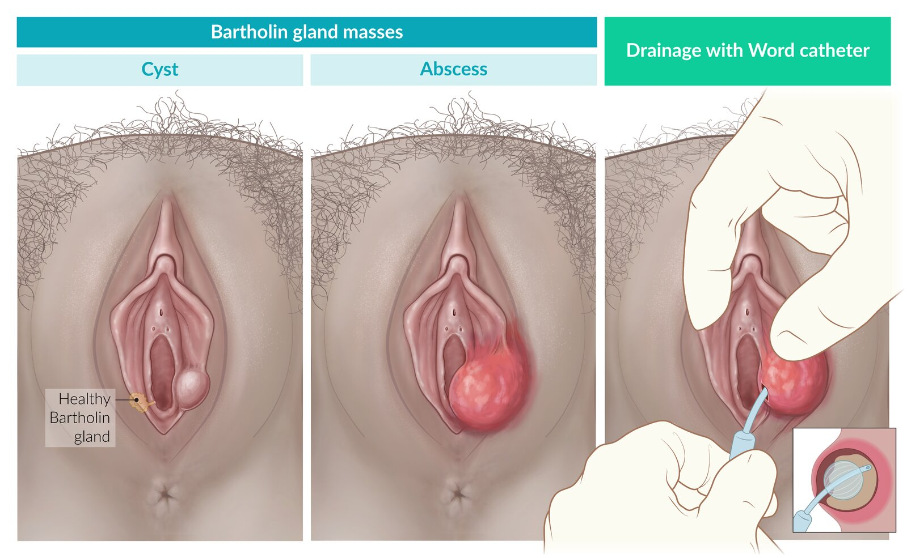

# Bartholin gland cyst and abscess

*Categories: Clinical knowledge > Emergency medicine > Infectious diseases > Bartholin gland cyst and abscess*

[Original Article Link](https://coursology-qbank.com/amboss/article/6L0jAg)

---

## Summary

The <u>Bartholin glands</u> are located on both sides of the inner labia and primarily function to produce mucus that moisturizes the vaginal <u>mucosa</u>. The mucus is secreted into two ducts that appear in the <u>posterior</u> vaginal introitus. A <u>Bartholin gland cyst</u> is usually caused by blockage of the duct as a result of inflammation or trauma; a <u>Bartholin gland abscess</u> occurs when the obstructed duct becomes infected. The most common symptoms are swelling and, in the case that an <u>abscess</u> develops, <u>pain</u> and potentially <u>fever</u>. Both <u>Bartholin gland cysts</u> and <u>abscess</u> are <u>clinical diagnoses</u>. First-line treatment includes <u>sitz baths</u>, which may promote spontaneous rupture or resolution of the cyst after a few days. An <u>abscess</u> usually requires <u>incision</u> and must be drained surgically.

Bartholin gland cyst and abscess

---

## Epidemiology

* ∼ 2% of women are affected at some point in their lives by a <u>Bartholin gland cyst</u> or <u>abscess</u>.

* Peak <u>incidence</u>: women in the reproductive age group

References:[[1]](https://coursology-qbank.com/amboss/article/UE0bE3)[[2]](https://coursology-qbank.com/amboss/article/2E0TE3)

Epidemiological data refers to the US, unless otherwise specified.

---

## Bartholin gland cyst

* Pathophysiology: blockage of the duct by inflammation or trauma → accumulation of secretions from gland → cyst formation

* Clinical features: often asymptomatic but can cause mild <u>dyspareunia</u>

* Diagnostics

* <u>Pelvic exam</u>: unilateral, palpable mass in the <u>posterior</u> vaginal introitus

* <u>Biopsy</u> is indicated if any of the following apply: 

* > 40 years of age

* Progressive, solid, and painless mass found during <u>pelvic examination</u>

* Not responsive to treatment

* History of <u>malignancy</u> in the labia

* Management [[1]](https://coursology-qbank.com/amboss/article/UE0bE3)[[2]](https://coursology-qbank.com/amboss/article/2E0TE3)

* Conservative approach

* Indicated for smaller, asymptomatic cysts ≤ 3 cm

* Involves <u>sitz baths</u> to facilitate rupture of the cyst;   and/or warm compresses

* <u>Surgery</u>

* Indicated for larger cysts > 3 cm and/or infected cysts

* See “Treatment” in “<u>Bartholin gland abscess</u>” below.

> [!TIP]
> A <u>Bartholin gland cyst</u> is generally a <u>clinical diagnosis</u> based on <u>physical examination</u>.

---

## Bartholin gland abscess

* Pathophysiology: polymicrobial infection e.g., <u>E. coli</u>  (most common),;  <u>Staphylococcus</u> species, <u>Streptococcus</u> species,<u>N. gonorrhoeae</u>, <u>C. trachomatis</u>;  → infection of <u>Bartholin gland</u> or cyst

* Clinical features

* Acute unilateral <u>pain</u> and tender swelling

* <u>Dyspareunia</u>

* <u>Pain</u> especially while walking and sitting

* <u>Fever</u> (∼ 20% of cases)

* Prompt <u>pain</u> relief with discharge (indicates spontaneous rupture of <u>abscess</u>)

* Diagnosis

* <u>Pelvic exam</u>: unilateral, tender mass surrounded by <u>edema</u> and <u>erythema</u> in the <u>posterior</u> vaginal introitus

* Possible culture

* <u>STD</u> testing at the request of the patient .

* Consider <u>biopsy</u> to rule out <u>malignancy</u> (see “Diagnostics” of <u>Bartholin gland cyst</u> above)

* Treatment

* <u>Surgery</u> [[1]](https://coursology-qbank.com/amboss/article/UE0bE3)[[2]](https://coursology-qbank.com/amboss/article/2E0TE3)

* Indicated in all cases of <u>abscess</u> formation and large cysts (> 3 cm)

* Involves <u>incision</u> and drainage followed by <u>marsupialization</u> or fistulization with a <u>Word catheter</u>

* <u>Incise</u> the vestibule longitudinally to expose the cyst or <u>abscess</u>.

* Drain cyst or <u>abscess</u>.

* Marsupialization: indicated for recurring <u>abscesses</u>

* Evert and suture the edges of the cyst wall to the cut edges of the vestibule.

* This creates a new opening that allows free drainage

* Fistulization with a <u>Word catheter</u> 

* A catheter is placed in the <u>abscess</u> cavity and left for four weeks

* Facilitates drainage and allows for reepithelialization

* Small <u>abscesses</u> (i.e., < 3 cm) may not be able to undergo catheterization, instead requiring supportive therapy (e.g., <u>Sitz baths</u>, warm compresses)

* <u>Biopsy</u>: if <u>malignancy</u> is suspected

* Gland excision: if <u>malignancy</u> is suspected or if previous measures are unsuccessful

* <u>Antibiotic therapy</u> [[3]](https://coursology-qbank.com/amboss/article/Aw1RlQ0)[[4]](https://coursology-qbank.com/amboss/article/_w15lQ0)

* Indications

* Recurrent <u>abscesses</u> (i.e., ≥ 2 episodes)

* Risk of complicated infection (e.g., presence of <u>cellulitis</u>, <u>pregnancy</u>, <u>immunocompromised state</u>)

* <u>MRSA</u> infection or <u>risk factors for MRSA infection</u>

* <u>Signs of systemic infection</u>

* Unsuccessful <u>incision and drainage</u>

* Empiric oral <u>antibiotic therapy</u> covering <u>Staphylococcus</u> species, <u>Streptococcus</u> species, and <u>enteric</u> gram-negative aerobes is recommended and should be adjusted according to <u>blood culture</u> results.

Bartholin gland cyst and abscess

---

## Differential diagnoses

* Bartholin gland carcinoma

* <u>Epidemiology</u>: primarily found in <u>postmenopausal</u> women

* Symptoms: gradual, solid, and painless enlargement of the <u>Bartholin gland</u>

* Diagnostics: <u>biopsy</u>

* Treatment

* Resection of the lesion

* If <u>surgery</u> is not possible or as <u>adjuvant therapy</u>: <u>chemotherapy</u> and radiation

* <u>Folliculitis</u>

* Inclusion cysts

* <u>Leiomyomas</u>

* <u>Fibroma</u>

References:[[5]](https://coursology-qbank.com/amboss/article/eE0xu3)[[6]](https://coursology-qbank.com/amboss/article/gE0FE3)

The differential diagnoses listed here are not exhaustive.

---