# COVID-19 (coronavirus disease 2019)

*Categories: Clinical knowledge > Emergency medicine > Infectious diseases > COVID-19 (coronavirus disease 2019)*

[Original Article Link](https://coursology-qbank.com/amboss/article/fI0kXh)

---

## Summary

COVID-19 is an acute infectious disease caused by the <u>coronavirus</u> <u>SARS-CoV-2</u>. Transmission most commonly occurs via exposure to respiratory fluids. The <u>incubation period</u> varies between 2–14 days and may be shorter with newer variants. Common presenting symptoms include fatigue, <u>fever</u>, and symptoms of an <u>upper respiratory tract infection</u>; affected individuals may also be asymptomatic. Clinical courses range from asymptomatic infection, to mild with minimal symptoms, to severe with <u>pneumonia</u> and life-threatening complications (e.g., <u>acute respiratory distress syndrome</u>, <u>shock</u>, organ dysfunction). Diagnostic confirmation is made based on <u>COVID-19 testing</u>, which includes <u>nucleic acid amplification testing</u> (e.g., <u>PCR</u>) or <u>antigen</u> testing on a respiratory specimen. Imaging findings are nonspecific, resemble those in other viral respiratory tract infections, and should not be used to confirm the diagnosis of COVID-19. Individuals with <u>mild COVID-19</u> can typically be managed with <u>supportive care</u> at home. Pharmacotherapy can be considered for outpatients with <u>risk factors for progression to severe COVID-19</u>. Patients with moderate or severe COVID-19 or those with <u>risk factors</u> for severe disease may require hospitalization for <u>oxygen therapy</u>, pharmacotherapy, and <u>antithrombotic therapy</u>. The risk of infection can be reduced through preventive efforts, which include <u>vaccination</u>, <u>public health</u> measures (e.g., <u>social distancing</u>, mask-wearing), and getting tested after close contact with infected individuals.

We at <u>AMBOSS</u> are doing our best to accurately update our COVID-19 content. Considering that information about COVID-19 is changing daily, we greatly appreciate your understanding regarding any potential delays.

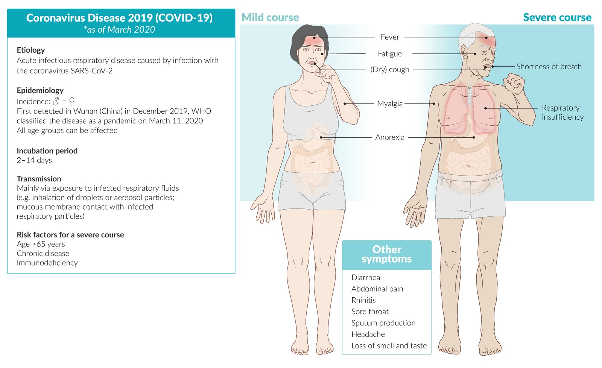

Coronavirus Disease 2019 (COVID-19)

### Additional free <u>AMBOSS</u> resources

The <u>AMBOSS</u> team offers further articles in the library that are relevant for the management of COVID-19. Access to the following articles is possible without a paid <u>AMBOSS</u> subscription:

* <u>Airway management</u>

* <u>Acute respiratory distress syndrome</u> (<u>ARDS</u>)

* <u>Sepsis</u>

* <u>Pneumonia</u>

* <u>Nosocomial infections</u>

---

## Epidemiology

* <u>Incidence</u> and <u>prevalence</u>: Refer to the resources below for up-to-date <u>statistics</u>.

* Johns Hopkins University & Medicine <u>Coronavirus</u> Resource Center: https://<u>coronavirus</u>.jhu.edu/map.html [[1]](https://coursology-qbank.com/amboss/article/ZWbZPs)

* <u>CDC</u> COVID Data tracker: https://covid.cdc.gov/covid-data-tracker/#datatracker-home [[2]](https://coursology-qbank.com/amboss/article/VzcG7U0)

* Distribution

* The first cases of COVID-19 were reported in Wuhan, China in December 2019.

* The <u>World Health Organization</u> (WHO) classified COVID-19 as a <u>pandemic</u> on March 11, 2020.

* Demographics [[2]](https://coursology-qbank.com/amboss/article/VzcG7U0)

* The number of cases is similar between men and women.  [[3]](https://coursology-qbank.com/amboss/article/ezcx7U0)

* Affects people of all ages; serious disease is more likely in individuals ≥ 65 years of age. [[4]](https://coursology-qbank.com/amboss/article/-AbDmw)

Epidemiological data refers to the US, unless otherwise specified.

---

## Etiology

### Severe acute respiratory syndrome coronavirus 2 (<u>SARS-CoV-2</u>) [[5]](https://coursology-qbank.com/amboss/article/oyc0TU0)

* <u>SARS-CoV-2</u> is an enveloped, nonsegmented, <u>positive-sense</u>, ssRNA β-<u>coronavirus</u>.    [[6]](https://coursology-qbank.com/amboss/article/LycwfU0)

* The <u>viral genome</u> encodes:

* Four structural <u>proteins</u>  

* Spike: facilitates entry by attaching to the ACE2 <u>receptor</u> of the host cell

* Envelope

* Membrane

* <u>Nucleocapsid</u>: packages the <u>viral genome</u> into a helical ribonucleocapsid

* 16 nonstructural <u>proteins</u>: form the replicase–transcriptase complex  [[7]](https://coursology-qbank.com/amboss/article/KycUTU0)

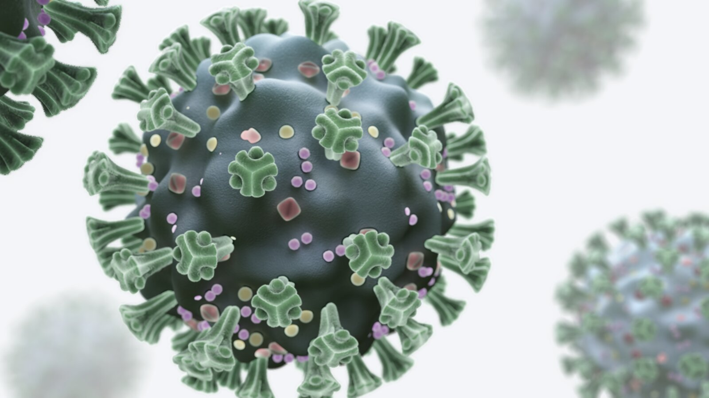

Coronavirus SARS-CoV-2 3-D virus

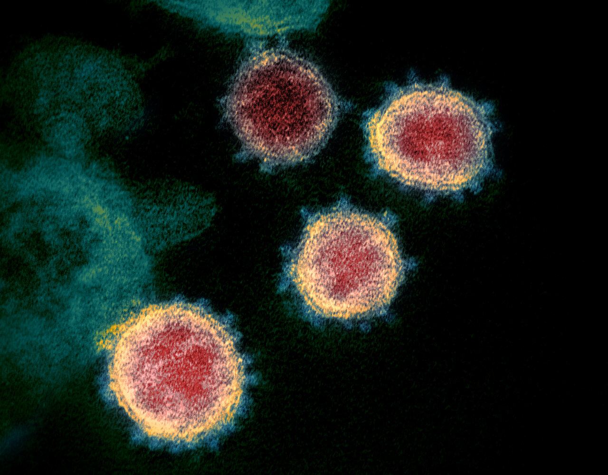

Coronavirus SARS-CoV-2

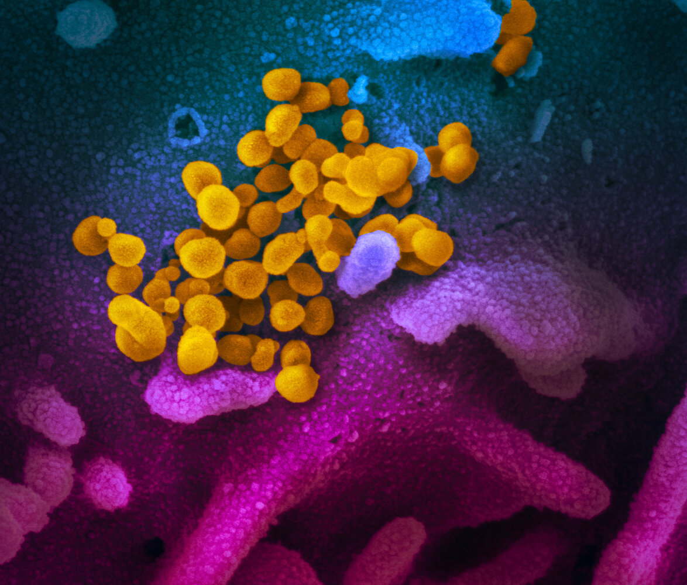

Coronavirus SARS-CoV-2

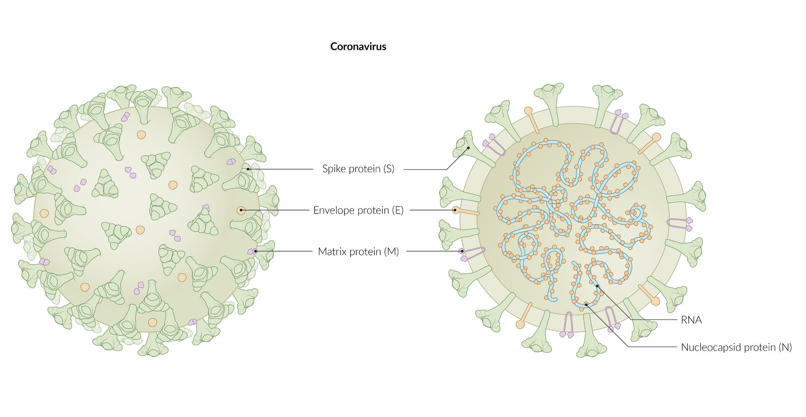

Coronavirus SARS-CoV-2 structure

### SARS-CoV-2 variants [[8]](https://coursology-qbank.com/amboss/article/o_X0600)[[9]](https://coursology-qbank.com/amboss/article/UzcbHU0)

* Several variants have been detected worldwide.

* The <u>CDC</u> considers a variant of concern to be one with any of the following:

* Increased transmission rate

* Resistance to neutralizing <u>antibodies</u>

* Reduced <u>vaccine</u> <u>effectiveness</u>

* Increased illness severity or mortality

* Decreased ability to be identified through diagnostic testing

* Decreased susceptibility to treatment

|  Current <u>SARS-CoV-2 variants</u> of concern (Last updated: February 2022) [[8]](https://coursology-qbank.com/amboss/article/o_X0600)[[9]](https://coursology-qbank.com/amboss/article/UzcbHU0)  |  |  |  |
| --- | --- | --- | --- |
| Variant | Pango lineage | First detected | Features (relative to the orignal strain) |
| Delta |   * B.1.617.2  * AY    |  * India, Oct. 2020   |   * Increased transmissibility and severity  * Decreased neutralization by <u>antibodies</u>  [[10]](https://coursology-qbank.com/amboss/article/JZ1sc20)    |
| Omicron |   * B.1.1.529  * BA    |  * South Africa and Botswana, Nov. 2021 [[11]](https://coursology-qbank.com/amboss/article/jZ1_Y20)   |   * Increased transmissibility  * Decreased severity [[12]](https://coursology-qbank.com/amboss/article/SZ1ya20)  * Decreased neutralization by <u>antibodies</u> [[13]](https://coursology-qbank.com/amboss/article/pZ1Lc20)    |

|  Previous <u>SARS-CoV-2 variants</u> of concern [[8]](https://coursology-qbank.com/amboss/article/o_X0600)  |  |  |  |
| --- | --- | --- | --- |
| Variant | Pango lineage | First detected | Features (relative to the original strain) |
| Alpha |   * B.1.1.7  * Q    |  * United Kingdom, Sep. 2020   |   * Increased transmissibility [[14]](https://coursology-qbank.com/amboss/article/IZ1Y120)  * Increased disease severity and mortality [[15]](https://coursology-qbank.com/amboss/article/fZ1ka20)    |
| Beta |  * B.1.351   |  * South Africa, May 2020   |   * Increased transmissibility [[16]](https://coursology-qbank.com/amboss/article/7Z14120)  * Decreased neutralization by <u>antibodies</u>  [[17]](https://coursology-qbank.com/amboss/article/rZ1f120)    |
| Epsilon |   * B.1.427  * B.1.429    |  * US July 2020 (B.1.429) [[18]](https://coursology-qbank.com/amboss/article/GZ1B120)   |  * Decreased neutralization by <u>antibodies</u>  [[19]](https://coursology-qbank.com/amboss/article/tZ1XW20)   |
| Gamma |  * P.1   |  * Brazil, Nov. 2020   |   * Concern for increased transmissibility [[20]](https://coursology-qbank.com/amboss/article/HZ1K120)  * Decreased neutralization by <u>antibodies</u>  [[21]](https://coursology-qbank.com/amboss/article/sZ1t120)    |

### Transmission [[22]](https://coursology-qbank.com/amboss/article/2zcTHU0)

* The <u>basic reproduction number</u> (<u>R0</u>) of the original strain is estimated to be ∼ 2–3.

* The <u>R0</u> is higher in newer variants compared to the original strain.

* Factors affecting <u>R0</u> include:

* Duration of infectiousness: Individuals with COVID-19 are infectious from ∼2–3 days before symptom onset until ∼ 8 days after symptom onset.  [[23]](https://coursology-qbank.com/amboss/article/FZ1gW20)[[24]](https://coursology-qbank.com/amboss/article/IobYWu)

* Likelihood of infection spreading between individuals (see “Modes of transmission”)

* Rate of close contacts between individuals with and without infection

* Efforts to reduce the contact rate (e.g., <u>social distancing</u>, <u>quarantine</u>) aim to lower the <u>R0</u>

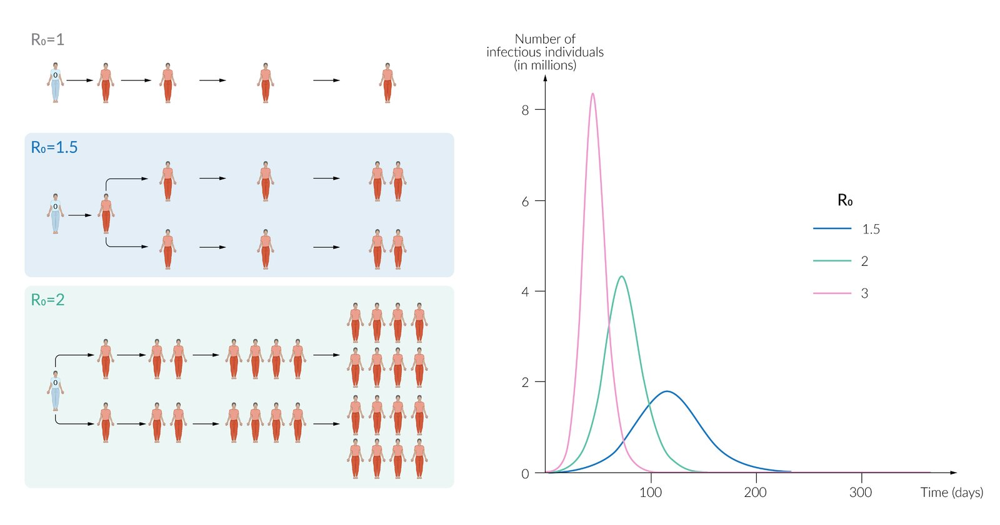

Modeling the spread of COVID-19 based on R0

> [!TIP]
> “Flattening the curve”, a reference to the number of new cases depicted on a graph, refers to reducing the number of people infected by each infectious individual. Flattening the curve means that new infections are distributed over a longer period of time.

#### Modes of transmission [[4]](https://coursology-qbank.com/amboss/article/-AbDmw)[[25]](https://coursology-qbank.com/amboss/article/UZ1ba20)

* The primary mode of transmission is exposure to respiratory fluids via either:

* Inhalation of droplets (<u>droplet transmission</u>) or aerosol particles (<u>airborne transmission</u>)

* The concentration of aerosol particles is highest within 3–6 ft of the infectious source.

* Small aerosol particles can remain suspended in the air for minutes to hours.

* The risk of transmission is increased in poorly ventilated areas.

* <u>Mucous membrane</u> contact with respiratory particles

* <u>Fomite</u> transmission is possible but unlikely to be a major mode of transmission.  [[26]](https://coursology-qbank.com/amboss/article/2Z1Ta20)

* <u>Vertical transmission</u>: See “<u>COVID-19: pregnancy and breastfeeding</u>.”

> [!TIP]
> <u>SARS-CoV-2</u> can be transmitted by asymptomatic individuals.

---

## Pathophysiology

### <u>Viral life cycle</u>   [[5]](https://coursology-qbank.com/amboss/article/oyc0TU0)[[27]](https://coursology-qbank.com/amboss/article/Pc1Wcf0)

* Invasion of host cells  
1. * The spike protein binds to the <u>membrane protein</u> <u>angiotensin-converting enzyme</u> 2 (ACE2). [[28]](https://coursology-qbank.com/amboss/article/R7bllE)
2. * Transmembrane <u>protease</u> <u>serine</u> 2 (TMPRSS2) activates the spike protein.
3. * Membrane fusion and uncoating of the viral <u>RNA</u> occur.

* Replication cycle

* Enzymes, such as <u>RNA polymerase</u> or <u>proteases</u>, which are virally induced by endosomal viral <u>RNA</u>, release replicate viral components.

* Endosomes with newly constituted <u>viruses</u> are released via exocytosis.

> [!NOTE]
> ACE2 is expressed in the <u>surface epithelium</u> of the <u>lungs</u>, <u>heart</u>, and other organs. TMPRSS2 is expressed in <u>respiratory epithelium</u>. [[5]](https://coursology-qbank.com/amboss/article/oyc0TU0)

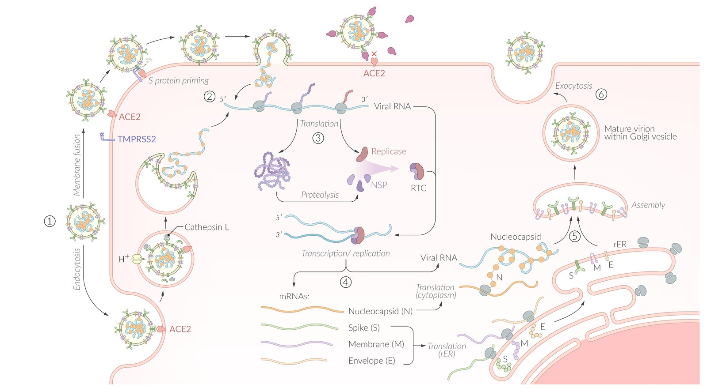

SARS-CoV-2 Life Cycle

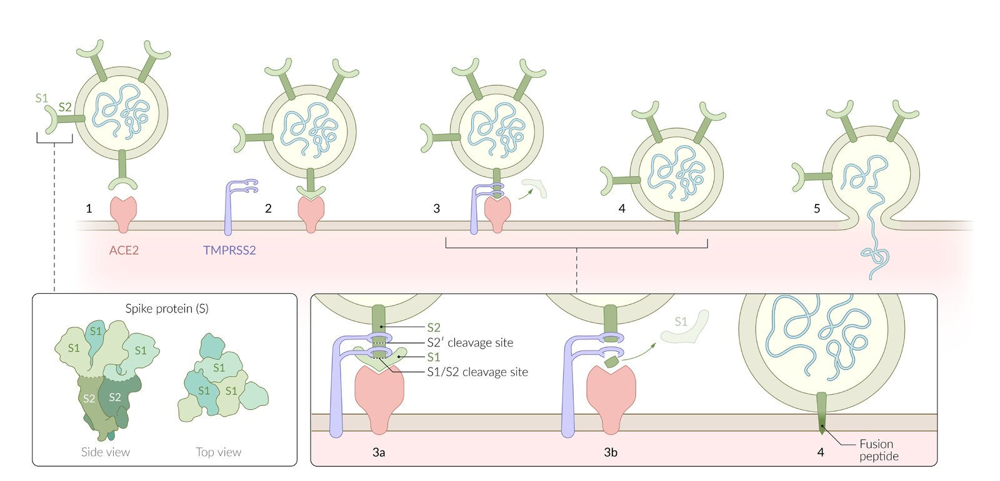

SARS-CoV-2 entry mechanism: membrane fusion

### Effects

* Direct cytopathic effects: Particularly on the alveolar <u>epithelium</u>; other organs (e.g., <u>liver</u>, <u>heart</u>) can be affected as well. [[29]](https://coursology-qbank.com/amboss/article/8Z1OW20)[[30]](https://coursology-qbank.com/amboss/article/uZ1pW20)[[31]](https://coursology-qbank.com/amboss/article/EZ18W20)

* Dysregulated <u>immune response</u> ;   [[32]](https://coursology-qbank.com/amboss/article/Ea18m20)[[33]](https://coursology-qbank.com/amboss/article/df1oOT0)

* Activation of the <u>immune system</u> → release of <u>cytokines</u>;  (e.g., <u>tumor necrosis factor</u>, IL-1β, <u>IL-6</u>) → <u>acute inflammatory response</u>

* Some patients demonstrate a very large <u>immune response</u> resembling a “<u>cytokine storm</u>” that can lead to organ failure and <u>death</u>.

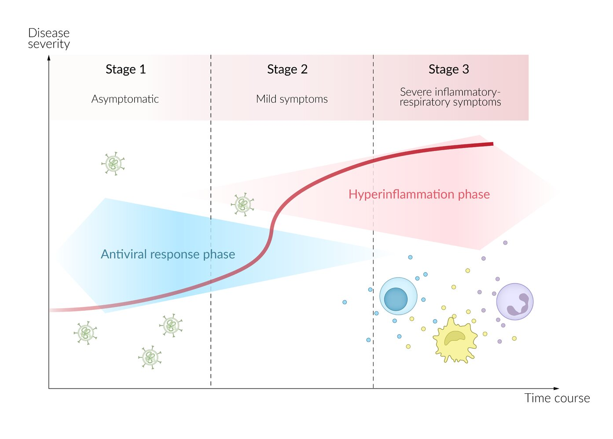

Potential immune response and disease course of Covid-19

---

## Clinical features

* <u>Incubation period</u>: 2–14 days, usually ∼ 5 days  [[4]](https://coursology-qbank.com/amboss/article/-AbDmw)[[34]](https://coursology-qbank.com/amboss/article/SzcyHU0)

* Symptoms [[35]](https://coursology-qbank.com/amboss/article/Ma1MO20)

* Often asymptomatic, especially in children  [[4]](https://coursology-qbank.com/amboss/article/-AbDmw)[[36]](https://coursology-qbank.com/amboss/article/q-cCyU0)

* <u>Fever</u>

* <u>Cough</u>

* <u>Shortness of breath</u>

* Fatigue

* Loss of <u>smell</u> and/or <u>taste</u>

* <u>Sore throat</u>

* <u>Rhinitis</u>

* <u>Headache</u>

* <u>Myalgia</u>

* <u>Diarrhea</u>

* Loss of appetite

* <u>Nausea</u> and <u>vomiting</u>

* <u>Conjunctivitis</u> (see “<u>COVID-19 conjunctivitis</u>”)

* Severity [[37]](https://coursology-qbank.com/amboss/article/s8ctLV0)[[38]](https://coursology-qbank.com/amboss/article/KzcUFU0)

* Severity ranges from asymptomatic to critical.

* A patient's clinical presentation may change over the course of the disease.

* See “<u>COVID-19 disease spectrum</u>” for details.

> [!TIP]
> Delta or Omicron variants of COVID-19 often manifest with milder symptoms (e.g., <u>headache</u>, <u>rhinitis</u>, <u>fever</u>, and <u>sore throat</u>) compared to prior strains.

---

## Diagnosis

### General principles [[4]](https://coursology-qbank.com/amboss/article/-AbDmw)

* Diagnostic confirmation is based on viral testing for COVID-19.

* Test all individuals with symptoms of and/or exposure to COVID-19 for current infection (see the latest <u>CDC</u> indications for testing at: https://www.cdc.gov/<u>coronavirus</u>/2019-ncov/symptoms-testing/testing.html).

* Collect specimens from the <u>upper respiratory tract</u> (e.g., <u>nasopharyngeal</u>, oropharyngeal).

* Obtain a viral test (e.g., <u>nucleic acid amplification test</u>) or <u>antigen</u> test to diagnose current infection.

* Imaging

* Should not be used as a screening modality or the sole diagnostic modality for COVID-19

* May be indicated to assess disease severity and rule out alternative diagnoses

* See “<u>Approach to imaging in COVID-19</u>” for details.

### Collection of specimens [[4]](https://coursology-qbank.com/amboss/article/-AbDmw)[[39]](https://coursology-qbank.com/amboss/article/m1bVhs)

* For all individuals: Obtain an <u>upper respiratory tract</u> specimen.

* Preferred method: <u>nasopharyngeal specimen</u> (NP specimen)

* Alternative methods

* Oropharyngeal (OP) swab (i.e., throat swab)

* Nasal midturbinate (NMT) swab

* <u>Anterior</u> nares specimen

* Saliva specimen

* <u>Nasopharyngeal</u> wash/<u>aspirate</u> or nasal <u>aspirate</u>

* If using both NP and OP swabs: Combine in a single tube.

* For mechanically ventilated individuals with a negative <u>upper respiratory tract</u> specimen: Obtain a <u>lower respiratory tract</u> <u>aspirate</u> or <u>bronchoalveolar lavage</u>.

> [!TIP]
> Obtain a <u>lower respiratory tract</u> sample if there is clinical concern for COVID-19 <u>pneumonia</u> in an intubated patient with negative <u>upper respiratory tract</u> testing. [[4]](https://coursology-qbank.com/amboss/article/-AbDmw)

### COVID-19 tests

|  <u>COVID-19 tests</u> [[4]](https://coursology-qbank.com/amboss/article/-AbDmw)[[40]](https://coursology-qbank.com/amboss/article/H_XKp00)  |  |  |  |
| --- | --- | --- | --- |
| Characteristics | Virological tests for COVID-19 |  |  <u>Serological testing</u> [[4]](https://coursology-qbank.com/amboss/article/-AbDmw)  |
| <u>Nucleic acid amplification testing</u> (<u>NAAT</u>; <u>RT-PCR</u>-based test) | <u>Antigen</u> testing |  |  |
| Use |  * Diagnosis of active <u>SARS-CoV-2</u> infection   |  |   * Gathering epidemiological data  * <u>Antibody</u> testing is not routinely recommended to:  * Diagnose or exclude active <u>SARS-CoV-2</u> infection  * Assess <u>immunity</u> to <u>SARS-CoV-2</u>  * Determine the need for <u>vaccination</u>    |
| Specimen |   * Nasal  * <u>Nasopharyngeal</u>  * Oropharyngeal  * Saliva  * <u>Sputum</u>  * Endotracheal aspirates  * <u>Bronchoalveolar lavage</u>    |   * Nasal  * <u>Nasopharyngeal</u>  * Saliva [[41]](https://coursology-qbank.com/amboss/article/1a12j20)    |  * Serum, plasma, or whole blood   |
| Method |  * Viral <u>RNA</u> is transcribed (via reverse <u>transcription</u>) into <u>complementary DNA</u> (<u>cDNA</u>) and then amplified, (e.g., using <u>RT-PCR</u>) to detect any <u>SARS-CoV-2</u> genetic material.   |  * Direct detection of <u>SARS-CoV-2</u> <u>antigens</u> (protein fragments)   |   * Rapid <u>IgM</u>-<u>IgG antibody</u> tests: point-of-care detection of <u>IgM</u> and <u>IgG antibodies</u> against <u>SARS-CoV-2</u>  * Enzyme-Linked Immunosorbent Assay (<u>ELISA</u>): detection of <u>IgM</u>, <u>IgA</u>, and <u>IgG antibodies</u> against <u>SARS-CoV-2</u>    |
| Advantages |   * High <u>sensitivity</u> and <u>specificity</u> for <u>SARS-CoV-2</u>  * Repeat testing is generally not needed to confirm results.    |   * Results available within 15–30 minutes  * High <u>specificity</u>  * Lower costs compared to <u>NAATs</u>  * Widely available and easy to perform    |   * Identifies individuals who have acquired <u>antibodies</u> through previous <u>SARS-CoV-2</u> infection  * Testing large numbers of people allows for the estimation of population-level exposure  * Rapid <u>IgM</u>-<u>IgG antibody</u> tests can provide results within a few minutes.    |
| Limitations |   * Higher cost than <u>antigen</u> tests  * <u>Turnaround time</u> of 1–3 days for laboratory-based tests    |   * Less sensitive than <u>NAATs</u>  * Subsequent confirmatory <u>NAAT</u> within 48 hours may be recommended in the following cases:   * Negative results in symptomatic patients with a high likelihood of COVID-19  * Positive results in asymptomatic individuals in whom concern for infection is low    |   * Potential <u>false-positive</u> results due to past or present infection with other <u>coronavirus</u> strains  * Not necessarily helpful for evaluating the likelihood of future infection  * A high number of <u>false-positive</u> results can occur in a population with a low <u>prevalence</u> of COVID-19 cases.    |

> [!TIP]
> <u>NAAT</u> (<u>RT-PCR</u>) is the <u>gold standard</u> for detecting active <u>SARS-CoV-2</u> infection. [[4]](https://coursology-qbank.com/amboss/article/-AbDmw)

> [!WARNING]
> <u>SARS-CoV-2</u> <u>PCR</u> testing can be negative early in the disease or may produce a <u>false-negative</u> test result due to technical errors (e.g., inaccurate specimen collection). [[42]](https://coursology-qbank.com/amboss/article/Wa1Pj20)

---

## Differential diagnoses

* <u>Common cold</u>

* <u>Influenza</u>

* <u>Allergic rhinitis</u>

* See also “<u>Differential diagnosis of dyspnea</u>” and “<u>Differential diagnosis of cough</u>.”

The differential diagnoses listed here are not exhaustive.

---

## Management

### Approach [[43]](https://coursology-qbank.com/amboss/article/wabh5H)

* Triage patients via <u>telemedicine</u> when possible.

* Determine site of care based on disease severity and the presence of <u>risk factors for severe COVID-19</u>. 

* Asymptomatic or mild disease in low-risk patients: outpatient management

* Moderate to severe disease, or <u>risk factors</u> for severe COVID-19: in-person evaluation; hospitalization if needed

* Patients requiring in-person evaluation: Consult institutional guidelines regarding the appropriate site of care.

* See also “<u>Preventing spread of COVID-19 in healthcare settings</u>.”

### Severity assessment [[37]](https://coursology-qbank.com/amboss/article/s8ctLV0)[[38]](https://coursology-qbank.com/amboss/article/KzcUFU0)

|  COVID-19 disease spectrum [[38]](https://coursology-qbank.com/amboss/article/KzcUFU0)  |  |
| --- | --- |
|  | Clinical presentation |
| Asymptomatic COVID-19 |   * Positive virologic test  * No symptoms    |
| Mild COVID-19 |  * Symptoms of COVID-19 without <u>dyspnea</u>, <u>hypoxemia</u>, or <u>pneumonia</u>   |
| Moderate COVID-19 |   * <u>Viral pneumonia</u>  * No <u>hypoxemia</u>    |
| Severe COVID-19 |  * <u>Pneumonia</u> with <u>dyspnea</u>, <u>hypoxemia</u> with <u>SpO2</u> < 94%, and/or <u>lung</u> infiltrates > 50%   |
| Critical COVID-19 |  * <u>Respiratory failure</u>, <u>septic shock</u>, and/or <u>multiple organ dysfunction syndrome</u> (<u>MODS</u>)   |

### Risk factors for severe COVID-19 [[44]](https://coursology-qbank.com/amboss/article/_015i20)

* Age (strongest <u>risk factor</u>): older adults, especially ≥ 65 years of age

* Cancer

* Cardiovascular disease

* <u>Cerebrovascular disease</u>

* <u>Chronic kidney disease</u>

* <u>Chronic liver disease</u>

* Chronic <u>lung</u> diseases

* <u>Diabetes mellitus type I</u> and type II

* Mental health disorders

* <u>Obesity</u> (<u>BMI</u> ≥ 30)

* <u>Pregnancy</u> or recent <u>pregnancy</u>

* Smoking (current and/or former)

* <u>Tuberculosis</u>

* <u>Immunosuppression</u>

---

## Outpatient management

### General principles [[45]](https://coursology-qbank.com/amboss/article/91bNQs)

Patients with mild or asymptomatic disease who do not have <u>risk factors for progression to severe COVID-19</u> can usually be managed in an outpatient setting.

* Advise patients on methods to minimize the spread of infection, e.g.:

* Staying home and isolating in a separate well-ventilated room when possible

* Wearing a mask when it is necessary to be around other people

* <u>Hand hygiene</u>

* For more details, see https://www.cdc.gov/<u>coronavirus</u>/2019-ncov/if-you-are-sick/steps-when-sick.html

* Discuss symptom monitoring and advise patients to seek medical attention if they experience any of the following:

* Difficulty breathing

* Persistent <u>chest pain</u> or pressure

* <u>Change in mental status</u> (e.g., confusion)

* <u>Signs of hypoxia</u> (e.g., bluish <u>lips</u>)

### Medical management [[46]](https://coursology-qbank.com/amboss/article/JT1s7T0)

#### <u>Supportive care</u>

* Rest, adequate hydration, and nutrition

* <u>Antipyretics</u> and <u>analgesia</u> as needed (e.g., <u>acetaminophen</u>, <u>ibuprofen</u>)

* <u>Antitussives</u> as needed (e.g., <u>dextromethorphan</u>, <u>benzonatate</u>)

* <u>Prone positioning</u> may relieve <u>dyspnea</u>.

#### Pharmacotherapy [[46]](https://coursology-qbank.com/amboss/article/JT1s7T0)

* Indications: patients with <u>risk factors for progression to severe COVID-19</u>

* Preferred agents: <u>ritonavir-boosted nirmatrelvir</u>, <u>remdesivir</u>

* Alternatives (only if preferred agents are not available): <u>molnupiravir</u>

* Not currently recommended: <u>systemic glucocorticoids</u>, <u>chloroquine</u>, <u>hydroxychloroquine</u>, <u>azithromycin</u>, <u>ivermectin</u>, bebtelovimab

* For possible drug interaction, see “https://www.covid19-druginteractions.org/checker.”

|  Pharmacotherapy for nonhospitalized high-risk adults with COVID-19 [[46]](https://coursology-qbank.com/amboss/article/JT1s7T0)  |  |  |
| --- | --- | --- |
| Medication | Timing of administration after symptom onset | Clinical considerations |
|  Ritonavir-boosted nirmatrelvirDOSAGE  |  * Within 5 days   |  * Monitor for <u>drug interactions</u>.   |
|  <u>Remdesivir</u>DOSAGE  |  * Within 7 days   |   * Requires 3 days of IV infusions  * Monitor for <u>hypersensitivity reactions</u> during and ≥ 1 hour after infusion.    |
|  <u>Molnupiravir</u> DOSAGE  |  * Within 5 days   |   * Consider only if other treatment options are unavailable or contraindicated.  * Possible <u>teratogen</u>  * Avoid in <u>pregnancy</u>.  * Advise <u>contraception</u> use during and after treatment.    |

> [!TIP]
> <u>Systemic corticosteroids</u> are not indicated for management of patients with mild to moderate COVID-19. Patients receiving <u>corticosteroids</u> for other indications should continue use as prescribed. [[4]](https://coursology-qbank.com/amboss/article/-AbDmw)

> [!WARNING]
> Do not start <u>antithrombotic therapy</u> in nonhospitalized patients with COVID-19. Chronic <u>antithrombotic therapy</u> for preexisting medical conditions should be continued. [[4]](https://coursology-qbank.com/amboss/article/-AbDmw)[[47]](https://coursology-qbank.com/amboss/article/gT1FJT0)

### Monitoring and follow-up [[4]](https://coursology-qbank.com/amboss/article/-AbDmw)

* Monitor oximetry readings and symptom progression via <u>telemedicine</u> or in-person visits.

* Evaluate patients with worsening symptoms in-person.

* Advise patients that the time to recovery from COVID-19 varies.

* Encourage self-isolation until criteria for <u>discontinuation of isolation in patients with COVID-19</u> are met.

---

## Management of hospitalized patients

### General principles

Patients with moderate to severe COVID-19 often require hospitalization.

* Determine patient's <u>goals of care</u> and obtain <u>advance directives</u>, if available.

* Determine severity of illness and admit patients to the appropriate <u>level of care</u>.

* Tailor additional diagnostics (<u>laboratory studies</u>, imaging) to the clinical presentation.

* For patients with complications related to COVID-19, see also the management sections in the following articles:

* <u>Sepsis</u>

* <u>Pneumonia</u>

* <u>Acute respiratory distress syndrome</u>

* <u>Airway management</u>

* <u>Mechanical ventilation</u>

* <u>Venous thromboembolism</u> (<u>VTE</u>)

### <u>Laboratory studies</u> [[35]](https://coursology-qbank.com/amboss/article/Ma1MO20)

Laboratory parameters in COVID-19 are nonspecific but are useful in evaluating for organ dysfunction

* Routine studies

* <u>CBC</u>: may show <u>lymphopenia</u>, <u>thrombocytopenia</u>  [[48]](https://coursology-qbank.com/amboss/article/P_cWoU0)

* <u>Basic metabolic panel</u>

* Elevated serum <u>creatinine</u> in <u>acute kidney injury</u> [[49]](https://coursology-qbank.com/amboss/article/Ua1bP20)

* Possible <u>electrolyte</u> abnormalities [[50]](https://coursology-qbank.com/amboss/article/2a1TP20)

* <u>Liver chemistry</u>: may show ↑ <u>ALT</u>, ↑ <u>AST</u> [[51]](https://coursology-qbank.com/amboss/article/Ta16P20)

* Further evaluation based on clinical presentation [[52]](https://coursology-qbank.com/amboss/article/w-chzU0)

* <u>Inflammatory markers</u>: ↑ <u>CRP</u>, ↑ <u>ferritin</u>, ↑ <u>lactate dehydrogenase</u>

* <u>Coagulation studies</u>: ↑ <u>prothrombin time</u>, ↑ <u>D-dimer</u>

* <u>Cardiac enzymes</u>: ↑ <u>troponin</u> and ↑ <u>NT-proBNP</u> may indicate cardiac injury related to COVID-19

* <u>Arterial blood gas</u>: may reveal <u>hypoxemic respiratory failure</u>

* <u>Blood cultures</u>: Order if there is concern for bacterial <u>coinfection</u>.

### Chest imaging in COVID-19 [[52]](https://coursology-qbank.com/amboss/article/w-chzU0)[[53]](https://coursology-qbank.com/amboss/article/ua1pm20)[[54]](https://coursology-qbank.com/amboss/article/na17O20)

* Indications

* Features of <u>moderate COVID-19</u> or <u>severe COVID-19</u>

* Worsening respiratory status

* Patients with <u>mild COVID-19</u> with <u>risk factors for progression to severe COVID-19</u>

* Modalities: Initial imaging studies may include <u>chest x-ray</u>, chest <u>ultrasound</u>, and chest CT.

* Important consideration: Imaging findings in COVID-19 are generally nonspecific and resemble findings in other viral respiratory infections.

> [!WARNING]
> Imaging alone cannot confirm a diagnosis of COVID-19. Imaging findings suggestive of COVID-19 should be verified via <u>COVID-19 virus testing</u>. [[53]](https://coursology-qbank.com/amboss/article/ua1pm20)[[54]](https://coursology-qbank.com/amboss/article/na17O20)

> [!TIP]
> Chest CT can detect <u>parenchymal</u> changes early in the course of COVID-19 and, compared to a <u>chest x-ray</u>, has higher <u>sensitivity</u> in detecting disease progression and alternative diagnoses. [[54]](https://coursology-qbank.com/amboss/article/na17O20)

#### <u>Chest x-ray</u> [[54]](https://coursology-qbank.com/amboss/article/na17O20)

* Indications: : often the initial test to assess disease severity and rule out differential diagnoses (e.g., <u>pneumothorax</u>, <u>pleural effusion</u>)

* Supportive findings 

* <u>Pulmonary consolidations</u>

* Unilateral or bilateral opacities

* Progression to diffuse opacities suggests development of <u>ARDS</u>.

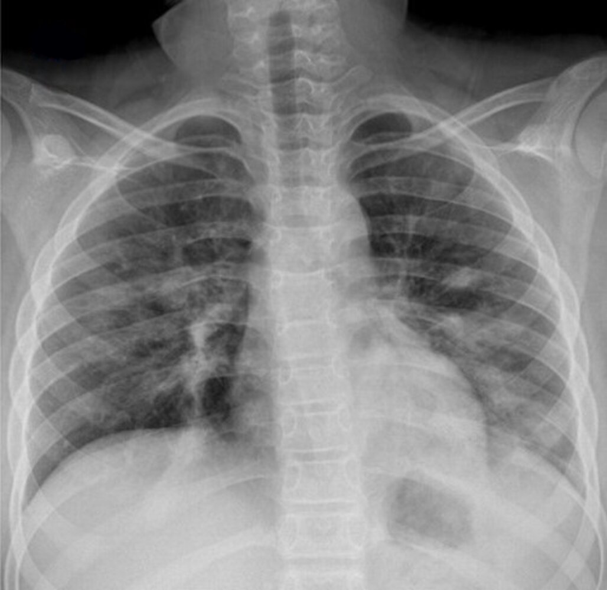

Bilateral pulmonary opacities

#### Chest <u>ultrasound</u> [[55]](https://coursology-qbank.com/amboss/article/La1wO20)

* Indications: an alternative to <u>chest x-ray</u> to assess disease severity and rule out other chest pathologies (e.g., <u>pneumothorax</u>, <u>pleural effusion</u>) in critically ill patients; often performed in emergency department and <u>ICU</u> settings (<u>lung POCUS</u>)

* Supportive findings

* Pleural thickening

* <u>B lines</u>

* Consolidations with <u>air bronchograms</u>

> [!TIP]
> <u>POCUS</u> may also be used to assess hemodynamic status in critically ill patients (<u>IVC POCUS</u>) and those with <u>deep vein thrombosis</u>. [[55]](https://coursology-qbank.com/amboss/article/La1wO20)

#### Chest CT (noncontrast) [[53]](https://coursology-qbank.com/amboss/article/ua1pm20)[[56]](https://coursology-qbank.com/amboss/article/WT1PpT0)

* Indications: : hospitalized symptomatic patients with other specific clinical indications for a chest CT  [[53]](https://coursology-qbank.com/amboss/article/ua1pm20)

* Findings 

* <u>Ground glass opacities</u> with or without consolidation (usually bilateral, peripheral, and <u>posterior</u>)

* Interlobular septal thickening

* The combination of the above findings is often referred to as a “<u>crazy-paving pattern</u>.”

> [!TIP]
> Imaging studies can not be used to diagnose COVID-19.

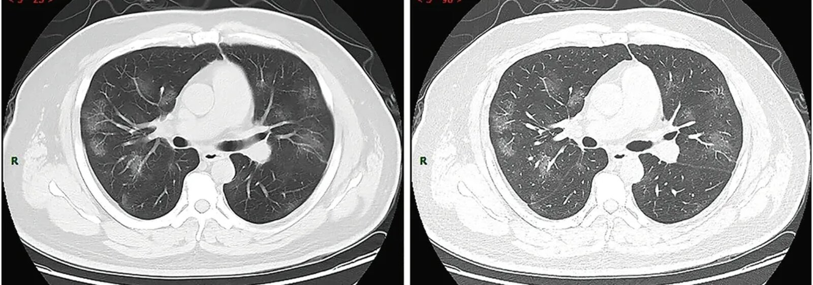

COVID-19 pneumonia

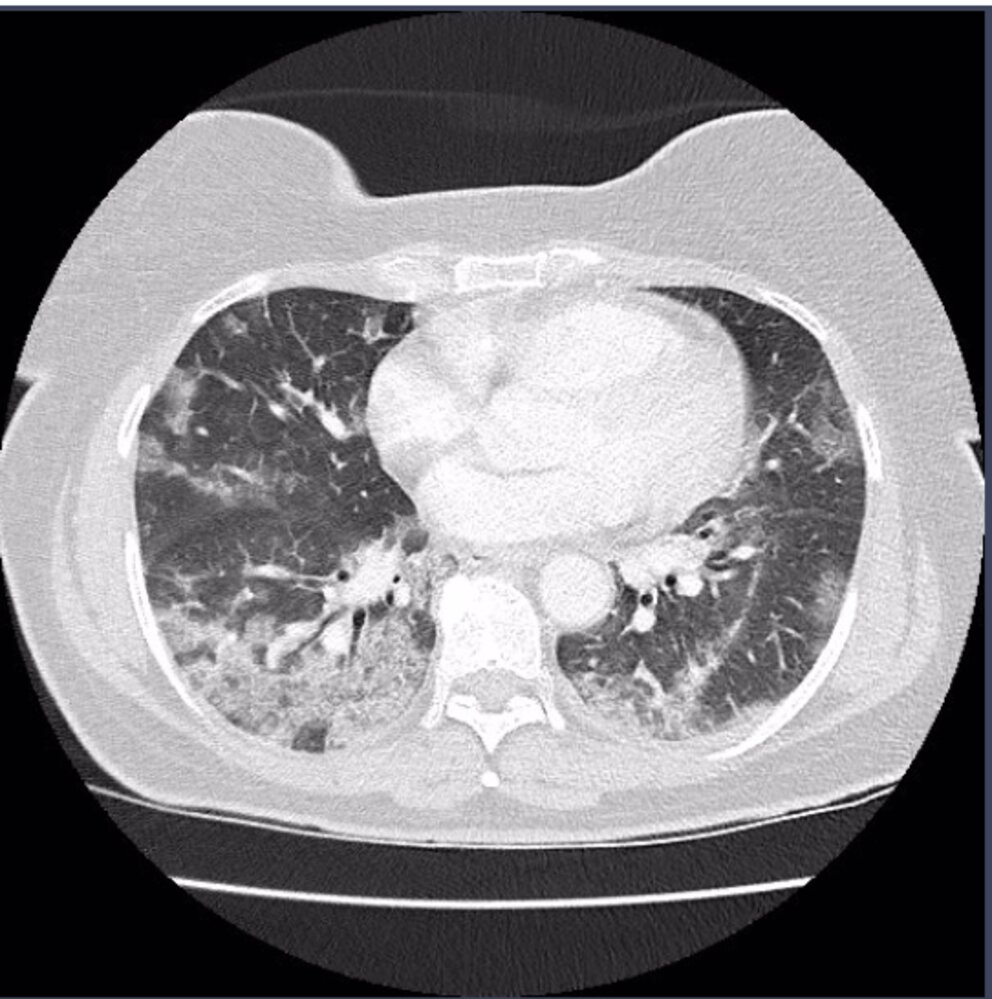

COVID-19 pneumonia

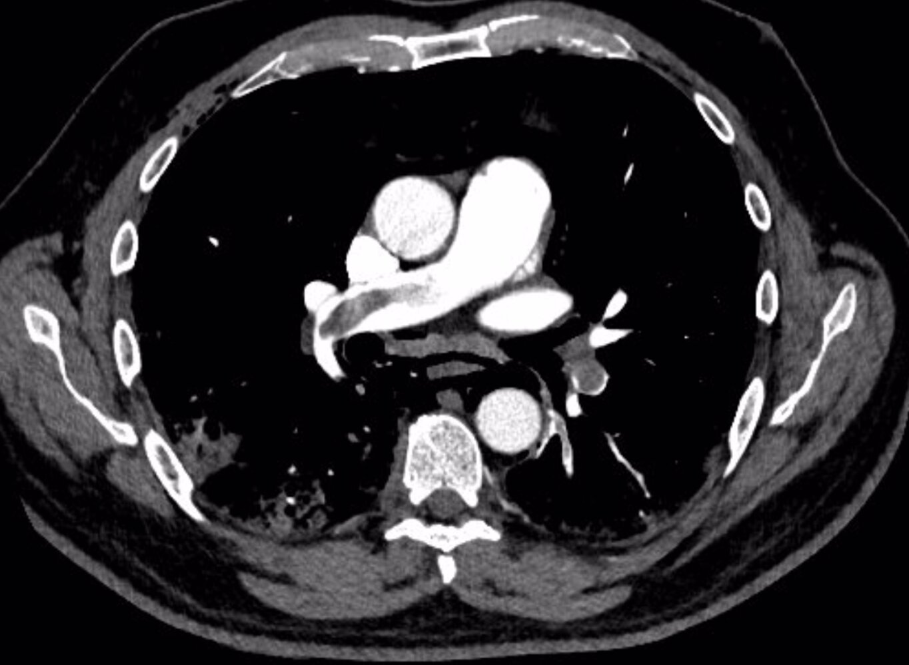

Pulmonary embolism and COVID-19-pneumonia

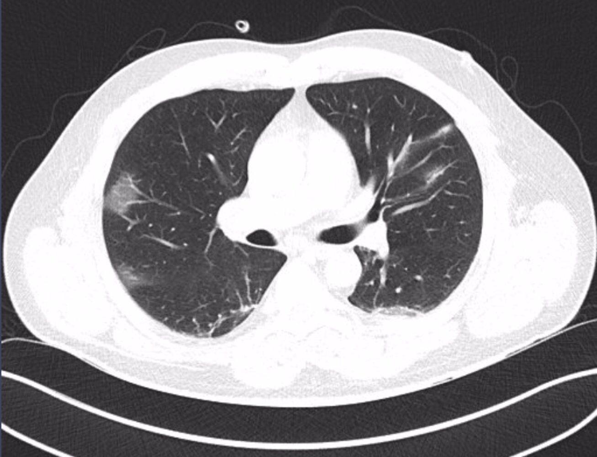

COVID-19 pneumonia

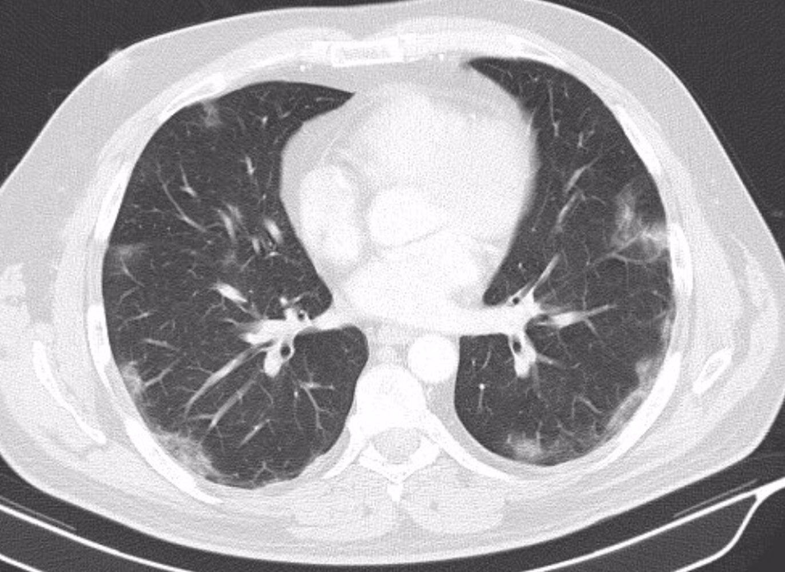

Lung opacities in COVID-19 pneumonia

### Screening for <u>VTE</u> [[47]](https://coursology-qbank.com/amboss/article/gT1FJT0)

* Indications

* Patients with <u>features of DVT</u> and/or <u>features of pulmonary embolism</u> (<u>PE</u>)

* Patients with sudden or rapid clinical deterioration

* Modalities

* Suspected <u>PE</u>: <u>CT pulmonary angiography</u>; see “<u>Diagnostic approach to suspected PE</u>” [[56]](https://coursology-qbank.com/amboss/article/WT1PpT0)

* Suspected <u>DVT</u>: <u>lower extremity venous ultrasound</u>; see “<u>Diagnostic approach to suspected lower-extremity DVT</u>”

> [!TIP]
> There is insufficient evidence to recommend routine screening for <u>VTE</u> in patients with COVID-19, even in those with elevated coagulation markers. [[47]](https://coursology-qbank.com/amboss/article/gT1FJT0)

### <u>Supportive care</u> [[57]](https://coursology-qbank.com/amboss/article/qT1C7T0)[[58]](https://coursology-qbank.com/amboss/article/ST1yJT0)

* <u>Intravenous fluid therapy</u> as needed

* <u>Vasopressors</u> as needed (i.e., for <u>shock</u>): 

* <u>Norepinephrine</u> is recommended as the first-line agent.

* See “<u>Vasopressors and inotropes</u>” for dosages and further details.

* <u>Antipyretics</u> and <u>analgesia</u> as needed (e.g., <u>acetaminophen</u>, <u>ibuprofen</u>)

* <u>Antitussives</u> as needed (e.g., <u>benzonatate</u>)

* If available, <u>continuous renal replacement therapy</u> is preferred over <u>hemodialysis</u> for patients with <u>acute kidney injury</u> and <u>indications for dialysis</u>.

### <u>Oxygen therapy</u> [[57]](https://coursology-qbank.com/amboss/article/qT1C7T0)[[58]](https://coursology-qbank.com/amboss/article/ST1yJT0)

* Goal: Maintain <u>SpO2</u> levels between 92–96% (≥ 95% in pregnant individuals).

* <u>High flow nasal cannula</u> (<u>HFNC</u>)

* Indications: <u>hypoxemic respiratory failure</u> despite the use of <u>basic oxygen delivery systems</u> (e.g., <u>nasal cannula</u>, face mask)

* <u>HFNC</u> unavailable: Consider <u>noninvasive positive pressure ventilation</u>.

* Persistent <u>hypoxemia</u> despite <u>HFNC</u> (and no <u>indications for invasive mechanical ventilation</u>): Consider a trial of awake <u>prone positioning</u> to improve oxygenation.  [[58]](https://coursology-qbank.com/amboss/article/ST1yJT0)[[59]](https://coursology-qbank.com/amboss/article/4T13IT0)

* <u>Mechanical ventilation</u>

* Indications: See “<u>Indications for invasive mechanical ventilation</u>.”

* Recommended <u>ventilator settings</u> for patients with COVID-19 and <u>ARDS</u>:

* <u>Tidal volume</u> 4–8 mL/kg of <u>predicted body weight</u>

* <u>Plateau pressure</u> < 30 cm H2O

* Ventilation in the <u>prone position</u> for 12–16 hours/day

* High <u>PEEP</u> (> 10 cm H2O)

* <u>Extracorporeal membrane oxygenation</u> (<u>ECMO</u>): There is insufficient evidence to recommend for or against the use of <u>ECMO</u> in patients with COVID-19 and refractory <u>hypoxemia</u>.

* See also “<u>Oxygen therapy</u>” for more information.

> [!TIP]
> A trial of awake <u>prone positioning</u> can be considered in individuals with <u>hypoxemia</u> that persists despite HNFC, but the procedure is not routinely recommended in patients who require <u>supplemental oxygen</u> without <u>mechanical ventilation</u>. [[58]](https://coursology-qbank.com/amboss/article/ST1yJT0)[[59]](https://coursology-qbank.com/amboss/article/4T13IT0)

> [!WARNING]
> Awake <u>prone positioning</u> should not prevent or delay <u>intubation</u> in patients with <u>indications for invasive mechanical ventilation</u>. [[58]](https://coursology-qbank.com/amboss/article/ST1yJT0)

### Pharmacotherapy [[57]](https://coursology-qbank.com/amboss/article/qT1C7T0)

* Pharmacotherapy for hospitalized patients with COVID-19 varies according to disease severity.

* Pharmacologic options include <u>remdesivir</u>, <u>dexamethasone</u>, and other immunomodulators.

* For the latest guideline recommendations, see https://www.covid19treatmentguidelines.nih.gov/therapeutic-management.

* For possible drug interaction, see “https://www.covid19-druginteractions.org/checker.”

|  Pharmacotherapy regimens of hospitalized patients with COVID-19 [[57]](https://coursology-qbank.com/amboss/article/qT1C7T0)  |  |  |
| --- | --- | --- |
| Disease severity |  Recommended treatment (See table below for dosage information)  |  |
| Not requiring <u>O2therapy</u> |  * Consider <u>remdesivir</u> for patients at high risk of disease progression.   |  |
| Requiring <u>O2 therapy</u> |  * One of the following:  * <u>Remdesivir</u>  * <u>Dexamethasone</u> PLUS <u>remdesivir</u>  * <u>Dexamethasone</u>   |  * Patients with rapidly increasing oxygen requirement and systemic inflammation: Add <u>baricitinib</u> or <u>tocilizumab</u> to the treatment regimen.   |
| Requiring <u>high-flow O2 therapy</u> or <u>noninvasive ventilation</u> |  * One of the following:  * <u>Dexamethasone</u>  * <u>Dexamethasone</u> PLUS <u>remdesivir</u>   |  |
| Requiring <u>mechanical ventilation</u> or <u>ECMO</u> |   * <u>Dexamethasone</u>  * <u>Dexamethasone</u> PLUS <u>tocilizumab</u>: for patients who have been in the <u>ICU</u> ≤ 24 hours  * If already on <u>remdesivir</u>, complete the full course.    |  |

> [!TIP]
> Pharmacotherapy is indicated for all hospitalized patients who require <u>supplemental oxygen</u>. [[57]](https://coursology-qbank.com/amboss/article/qT1C7T0)

|  Overview of medications for COVID-19 in hospitalized patients [[57]](https://coursology-qbank.com/amboss/article/qT1C7T0)  |  |  |  |
| --- | --- | --- | --- |
| Medication class | Specific agents | Mechanism of action | Clinical considerations |
| Antivirals |  * Remdesivir DOSAGE   |  * Prodrug → <u>adenosine</u> <u>nucleotide analogue</u> → inhibition of <u>RNA replicase</u> → decreased <u>RNA</u> synthesis → decreased viral replication   |   * May cause <u>liver</u> injury; check <u>LFTs</u> before starting.  * May be used in pregnant patients    |
| <u>Corticosteroids</u> |  * <u>Dexamethasone</u> DOSAGE   |  * Reduces the inflammatory response caused by COVID-19   |   * Other <u>corticosteroids</u> (e.g., <u>prednisone</u>) may be used if <u>dexamethasone</u> is unavailable.  * See also “<u>Side effects of corticosteroid therapy</u>.”    |
| <u>IL-6</u> pathway inhibitors |   * <u>Tocilizumab</u> DOSAGE  * <u>Sarilumab</u> infusion DOSAGE    |  * <u>Monoclonal antibody</u> against the <u>IL-6</u> <u>receptor</u> → decreased <u>IL-6</u> levels → decreased <u>immune response</u> [[60]](https://coursology-qbank.com/amboss/article/Ha1KN20)   |   * Use only as part of a regimen that includes <u>systemic corticosteroids</u>.  * <u>Tocilizumab</u> is preferred over <u>sarilumab</u>, if available.    |
|  <u>JAK inhibitors</u> [[61]](https://coursology-qbank.com/amboss/article/QLXuxA)  |   * Baricitinib DOSAGE  * Tofacitinib DOSAGE    |   * <u>Baricitinib</u>: selective JAK1 and <u>JAK2 inhibitor</u> that causes reduced inflammation  * <u>Tofacitinib</u>: selective JAK1 and JAK3 inhibitor that blocks <u>cytokine</u> signaling/activity    |   * Use only as part of a regimen that includes <u>systemic corticosteroids</u>.  * <u>Baricitinib</u> is preferred over <u>tofacitinib</u>, if available and not contraindicated.    |

> [!TIP]
> Patients started on <u>remdesivir</u> should complete the full treatment course, even if they experience disease progression. [[57]](https://coursology-qbank.com/amboss/article/qT1C7T0)

> [!WARNING]
> <u>JAK inhibitors</u> should not be combined with <u>IL-6</u> pathway inhibitors (except in a clinical trial). [[57]](https://coursology-qbank.com/amboss/article/qT1C7T0)

### Antithrombotic therapy in COVID-19 [[47]](https://coursology-qbank.com/amboss/article/gT1FJT0)

* Indications: all hospitalized patients who do not have <u>contraindications for anticoagulation</u>

* Agents: <u>LMWH</u> or <u>UFH</u> is preferred over <u>oral anticoagulants</u>; <u>LMWH</u> is preferred over <u>UFH</u>.

* Dosage

* Therapeutic dose is recommended for:

* <u>Venous thromboembolism</u> (see “<u>Management of DVT</u>” and “<u>Management of pulmonary embolism</u>”)

* Increased <u>D-dimer</u> and/or low-flow O2 requirement in hospitalized nonpregnant adults

* Prophylactic dose (<u>pharmacological VTE prophylaxis</u> ) is recommended for: 

* All hospitalized nonpregnant adults who do not meet indications for therapeutic anticoagulation

* Patients requiring <u>ICU</u> care, including those requiring <u>high-flow O2</u>

* Hospitalized pregnant patients with COVID-19

> [!TIP]
> <u>Antithrombotic therapy</u> is recommended in all hospitalized patients with COVID-19 unless there are <u>contraindications for anticoagulation</u>. [[4]](https://coursology-qbank.com/amboss/article/-AbDmw)

> [!TIP]
> Discontinue <u>VTE prophylaxis</u> at discharge. The decision to continue <u>VTE prophylaxis</u> at discharge in pregnant or postpartum patients should be individualized. [[47]](https://coursology-qbank.com/amboss/article/gT1FJT0)

### Postdischarge management [[57]](https://coursology-qbank.com/amboss/article/qT1C7T0)

* All patients

* Arrange for a follow-up appointment soon after discharge.

* Stop <u>antithrombotic therapy</u> at the time of discharge unless the patient has a <u>VTE</u>.

* Encourage self-<u>isolation precautions</u> until the criteria for <u>discontinuation of isolation in patients with COVID-19</u> are met.

* <u>Supplemental O2</u> no longer required: Discontinue <u>remdesivir</u>, <u>corticosteroids</u>, and <u>JAK inhibitors</u> at the time of discharge.

* Continued requirement of <u>supplemental O2</u> at discharge: Arrange for home oxygen monitoring.

---

## Discontinuation of isolation

<u>CDC</u> recommendations for discontinuation of isolation vary based on symptoms and disease severity; see the latest <u>CDC</u> guidelines for details. [[62]](https://coursology-qbank.com/amboss/article/ta1Xm20)

* All individuals with COVID-19 should isolate for at least 5 days (day 0: day of symptom onset or positive COVID-19 test).

* Mildly symptomatic or asymptomatic individuals may consider an <u>antigen</u> test around day 5 to determine need for further isolation. [[63]](https://coursology-qbank.com/amboss/article/9Y1Nr20)

* Positive <u>antigen</u> test: Isolation is required for a total of 10 days.

* Negative <u>antigen</u> test: Isolation may be discontinued if other parameters are fulfilled.

> [!TIP]
> Typically, patients with asymptomatic, mild, or moderate COVID-19 are no longer infectious 10 days after symptom onset. [[62]](https://coursology-qbank.com/amboss/article/ta1Xm20)

|  Discontinuing isolation in patients with COVID-19 [[62]](https://coursology-qbank.com/amboss/article/ta1Xm20) |  |
| --- | --- |
| Patient group | When isolation can stop |
|  <u>Asymptomatic COVID-19</u>  |   * 5 full days have passed without symptoms since the date of the positive COVID-19 test AND  * The individual can wear a well-fitting mask for 5 more days after the 5-day isolation period.  * Asymptomatic individuals living in congregate settings  should isolate for a full 10 days.    |
| <u>Mild COVID-19</u> |   * 5 full days have passed since symptoms developed AND  * No <u>fever</u> for ≥ 24 hours without <u>antipyretics</u> AND  * Symptoms are improving AND  * The individual can wear a well-fitting mask for 5 more days after the 5-day isolation period.    |
| <u>Moderate COVID-19</u> |  * 10 days have passed since symptom onset.   |
| <u>Severe COVID-19</u> <u>Critical COVID-19</u> |   * 10–20 days have passed since symptoms developed AND  * No <u>fever</u> for at least 24 hours without <u>antipyretics</u> AND  * Symptoms are improving.  * Consider a test-based strategy  before discontinuing isolation.    |
|  Moderately to severely <u>immunocompromised</u> patients  |   * ≥ 20 days have passed since symptom onset or a positive test for COVID-19 AND  * Negative <u>COVID-19 tests</u>  on ≥ 2 respiratory samples collected ≥ 24 hours apart AND  * In symptomatic patients, an improvement of symptoms and no <u>fever</u> for ≥ 24 hours without <u>antipyretics</u>  * Consult infectious disease specialists before discontinuing isolation.    |

> [!TIP]
> Loss of <u>smell</u> and <u>taste</u> may persist for several weeks after recovery and should not delay the end of isolation. [[64]](https://coursology-qbank.com/amboss/article/1_c2MU0)

---

## Complications

* <u>Thromboembolic events</u> (e.g., <u>ischemic stroke</u>, <u>pulmonary embolism</u>)

* <u>Hypoxemic respiratory failure</u>

* <u>ARDS</u>

* <u>Septic shock</u>

* Cardiac disease (e.g., <u>ischemic heart disease</u>, <u>heart failure</u>) [[65]](https://coursology-qbank.com/amboss/article/Aa1RM20)

* <u>Arrhythmias</u> [[65]](https://coursology-qbank.com/amboss/article/Aa1RM20)

* <u>Acute kidney injury</u>

* <u>Multisystem inflammatory syndrome in children</u> (<u>MIS-C</u>)

* Postacute COVID-19 syndrome (“<u>long COVID</u>”) [[66]](https://coursology-qbank.com/amboss/article/0Ede870):

* Refers to symptoms persisting at least 3 months after confirmed or suspected COVID-19 infection

* Symptoms can include: fatigue, <u>headaches</u>, difficulty concentrating, <u>shortness of breath</u>, <u>sleep</u> disturbance, problems with <u>smell</u> or <u>taste</u>

We list the most important complications. The selection is not exhaustive.

---

## Special patient groups

This section provides recommendations for specific patient groups during the COVID-19 <u>pandemic</u>.

---

## Pregnancy and breastfeeding

### Overview [[67]](https://coursology-qbank.com/amboss/article/IT1YHT0)

* Pregnant and recently pregnant individuals are at higher risk of <u>severe COVID-19</u>.

* Counsel pregnant individuals on ways to minimize the risk of infection (see “Protective measures for the general public” in the section “Prevention”).

* <u>Vaccination</u> against COVID-19 is recommended for pregnant and <u>breastfeeding</u> individuals. [[68]](https://coursology-qbank.com/amboss/article/9zcNEU0)

* Treatment options for pregnant patients with COVID-19 are generally the same as those for nonpregnant patients.

### <u>Management of COVID-19</u> during <u>pregnancy</u> [[67]](https://coursology-qbank.com/amboss/article/IT1YHT0)[[69]](https://coursology-qbank.com/amboss/article/yzcdvU0)

* Determine the need for in-person evaluation and hospitalization based on symptoms and comorbidities.  [[70]](https://coursology-qbank.com/amboss/article/BzczEU0)

* Order imaging (e.g., <u>chest x-ray</u> or chest CT) if clinically indicated.

* <u>Supplemental oxygen</u>

* Administer <u>supplemental oxygen</u> if <u>SpO2</u> is < 95% on room air. [[71]](https://coursology-qbank.com/amboss/article/6_Xj600)

* Consider <u>prone positioning</u> or left <u>lateral decubitus positioning</u> in pregnant patients with persistent <u>hypoxemia</u> on HNFC who do not meet the criteria for <u>invasive mechanical ventilation</u>. [[46]](https://coursology-qbank.com/amboss/article/JT1s7T0)

* Consider fetal monitoring for hospitalized patients.

* Consider pharmacological treatment, if indicated. 

* Outpatients

* <u>Ritonavir-boosted nirmatrelvir</u>, <u>sotrovimab</u>, <u>remdesivir</u>

* See “<u>Pharmacotherapy for nonhospitalized adults with COVID-19</u>” for details.

* Hospitalized patients

* <u>Remdesivir</u>, <u>dexamethasone</u>

* See “<u>Pharmacotherapy for hospitalized patients with COVID-19</u>” for details.

* Anticoagulation is indicated for hospitalized patients with COVID-19 (see “<u>Antithrombotic therapy in COVID-19</u>”).  [[47]](https://coursology-qbank.com/amboss/article/gT1FJT0)

> [!TIP]
> Patients with symptoms suggestive of moderate to severe disease, or those with <u>risk factors for severe COVID-19</u> require in-person evaluation.

> [!WARNING]
> <u>Molnupiravir</u> is potentially <u>teratogenic</u> and should be avoided, if feasible, in pregnant individuals. [[46]](https://coursology-qbank.com/amboss/article/JT1s7T0)

> [!TIP]
> In pregnant patients with COVID-19, maintain <u>oxygen saturation</u> ≥ 95% on room air. [[71]](https://coursology-qbank.com/amboss/article/6_Xj600)

### Management of COVID-19 in the peripartum period [[69]](https://coursology-qbank.com/amboss/article/yzcdvU0)

* Infection with COVID-19 is not a contraindication for vaginal delivery.

* Mothers with COVID-19 do not need to isolate from their babies after <u>birth</u>.

* <u>Breastfeeding</u>

* Individuals not receiving pharmacotherapy for COVID-19 can safely breastfeed <u>infants</u>.

* The decision to continue <u>breastfeeding</u> while on pharmacotherapy for COVID-19 should be individualized.

> [!TIP]
> <u>Vertical transmission</u> of <u>SARS-CoV-2</u> is uncommon.

### Complications [[72]](https://coursology-qbank.com/amboss/article/eX1xC20)

Symptomatic <u>COVID-19 during pregnancy</u> is associated with an increased risk of:

* <u>Hypertensive disorders of pregnancy</u>

* <u>Preterm birth</u>

* <u>Low birth weight</u>

* <u>Stillbirth</u> [[73]](https://coursology-qbank.com/amboss/article/UX1bx20)

* <u>Maternal mortality</u>

---

## Children

### Overview [[36]](https://coursology-qbank.com/amboss/article/q-cCyU0)[[74]](https://coursology-qbank.com/amboss/article/KT1U7T0)[[75]](https://coursology-qbank.com/amboss/article/PY1W620)

* Children are less likely to get COVID-19.

* Clinical presentation

* Children are often asymptomatic or develop <u>mild COVID-19</u>.

* Symptoms may be similar to other viral illnesses

* <u>Vaccination</u>

* The <u>Pfizer-BioNTech COVID-19 vaccine</u> is recommended for all children in the US ≥ 5 years of age

* See “<u>COVID-19 vaccines</u>” for details.

> [!WARNING]
> The Moderna and Janssen <u>vaccines</u> are not currently recommended for use in individuals < 18 years of age. [[76]](https://coursology-qbank.com/amboss/article/-Y1D720)

### Management [[74]](https://coursology-qbank.com/amboss/article/KT1U7T0)[[77]](https://coursology-qbank.com/amboss/article/Mb1M820)

Given limited data in children, the decision to use pharmacological treatments should be made after weighing the risks and benefits for each patient.

* Most children can be managed with symptomatic treatment only.

* COVID-19 pharmacotherapy for children (age ≥ 12 years; weight ≥ 40 kg)

* Symptomatic nonhospitalized children at <u>risk for progression to severe COVID-19</u>

* <u>Ritonavir-boosted nirmatrelvir</u>

* OR <u>remdesivir</u>

* Hospitalized children requiring <u>supplemental oxygen</u>: <u>remdesivir</u>

### Multisystem inflammatory syndrome in children (<u>MIS-C</u>) [[74]](https://coursology-qbank.com/amboss/article/KT1U7T0)[[75]](https://coursology-qbank.com/amboss/article/PY1W620)

MISC-C is a complication of COVID-19 in children that manifests with hyperinflammation, severe illness, and involvement of multiple organ systems.

* Clinical features may include:

* <u>Fever</u>

* Gastrointestinal symptoms

* Mucocutaneous symptoms

* <u>Shock</u>

* Diagnostic criteria: All of the following must be met. [[78]](https://coursology-qbank.com/amboss/article/lT1vIT0)

* Age < 21 years

* <u>Fever</u> (documented <u>fever</u> ≥ 38°C (≥ 100.4°F) OR report of subjective <u>fever</u> lasting ≥ 24 hours

* Laboratory evidence of inflammation (e.g., ↑ <u>CRP</u>, ↑ <u>ESR</u>, ↑ <u>neutrophils</u>)

* Involvement of ≥ 2 organ systems (including the hematological system)

* Severe illness requiring hospitalization

* Confirmed current or recent <u>SARS-CoV-2</u> infection OR exposure to an individual with COVID-19 < 4 weeks prior to symptom onset

* No other plausible diagnosis

* Treatment: combination of immunomodulatory therapy and <u>antithrombotic therapy</u> [[74]](https://coursology-qbank.com/amboss/article/KT1U7T0)

* Immunomodulatory therapy 

* Initial treatment: <u>intravenous immunoglobulin</u> PLUS <u>methylprednisolone</u>

* No improvement within 24 hours of initial therapy: Consider alternative immunomodulators.

* <u>Antithrombotic therapy</u> (unless contraindicated)

* All patients: <u>low-dose aspirin</u> DOSAGE

* Patients with large <u>coronary artery</u> <u>aneurysms</u> or moderate to severe <u>left ventricular dysfunction</u>: therapeutic anticoagulation (with <u>LMWH</u> or <u>warfarin</u>) PLUS <u>low-dose aspirin</u> [[4]](https://coursology-qbank.com/amboss/article/-AbDmw)[[79]](https://coursology-qbank.com/amboss/article/BU1z2T0)

> [!WARNING]
> <u>Remdesivir</u> is not recommended for patients with <u>MIS-C</u>. [[74]](https://coursology-qbank.com/amboss/article/KT1U7T0)

---

## People with disabilities

### Overview [[80]](https://coursology-qbank.com/amboss/article/fVbkFs)

* Factors that may increase the risk of infection in patients with physical or <u>intellectual disabilities</u> include:

* Need for a support person to assist with mobility

* Difficulty implementing personal protective measures, e.g., due to cognitive impairment

* Living in a congregate setting, e.g., a <u>nursing home</u>

* Delayed diagnosis, e.g., individuals with impaired speech or <u>cognition</u> may have difficulty communicating symptoms

* Some comorbidities that are <u>risk factors for severe COVID-19</u> are more common in individuals with disabilities.

### Patient considerations [[80]](https://coursology-qbank.com/amboss/article/fVbkFs)

* Vaccinate eligible individuals.

* Work with the patient to develop an individualized plan for reducing infection risk.

* Organize backup support in case the current support person becomes sick or is quarantined.

* Establish reliable methods for seeking immediate assistance (e.g., preprogrammed <u>phone numbers</u>)

* Ensure that the patient has sufficient supplies of household items, medication, and medical equipment.

* See also “Protective measures for the general public” in the section “Prevention.”

---

## Prognosis

* The risk of <u>death</u> from COVID-19 increases with age.  [[81]](https://coursology-qbank.com/amboss/article/xY1Er20)[[82]](https://coursology-qbank.com/amboss/article/BY1zr20)

* <u>Death</u> rates are higher among unvaccinated individuals compared to vaccinated individuals. [[2]](https://coursology-qbank.com/amboss/article/VzcG7U0)

* <u>Death</u> rates are higher among vaccinated individuals who have not received a booster compared to those who have received a booster. [[2]](https://coursology-qbank.com/amboss/article/VzcG7U0)

> [!TIP]
> Prior infection with <u>SARS-CoV-2</u> provides <u>immunity</u> against reinfection, but it is not yet known how long that protection lasts. [[83]](https://coursology-qbank.com/amboss/article/CY1qr20)

---

## Prevention

### Protective measures for the general public [[84]](https://coursology-qbank.com/amboss/article/JTbs7G)

* Practice <u>hand hygiene</u>, <u>cough etiquette</u>, and avoid touching the face (see “<u>Hand hygiene</u>” for details).

* Masks can provide additional protection for individuals ≥ 2 years old. 

* Masks should have a close fit over the nose and mouth.

* N95 and K95 masks offer greater protection than <u>surgical masks</u>.

* Cloth masks provide the least protection.

* Follow <u>public health</u> guidance to reduce spread of COVID-19

* E.g., guidance on <u>social distancing</u>, <u>quarantine</u>, and lockdowns

* See also “Prevention of community spread.”

* COVID-19 testing is recommended:

* After close contact with infected individuals

* Individuals with symptoms suggestive of COVID-19

* All eligible individuals should be vaccinated.

* See the <u>CDC</u> website for additional guidance: https://www.cdc.gov/<u>coronavirus</u>/2019-ncov/prevent-getting-sick/prevention.html

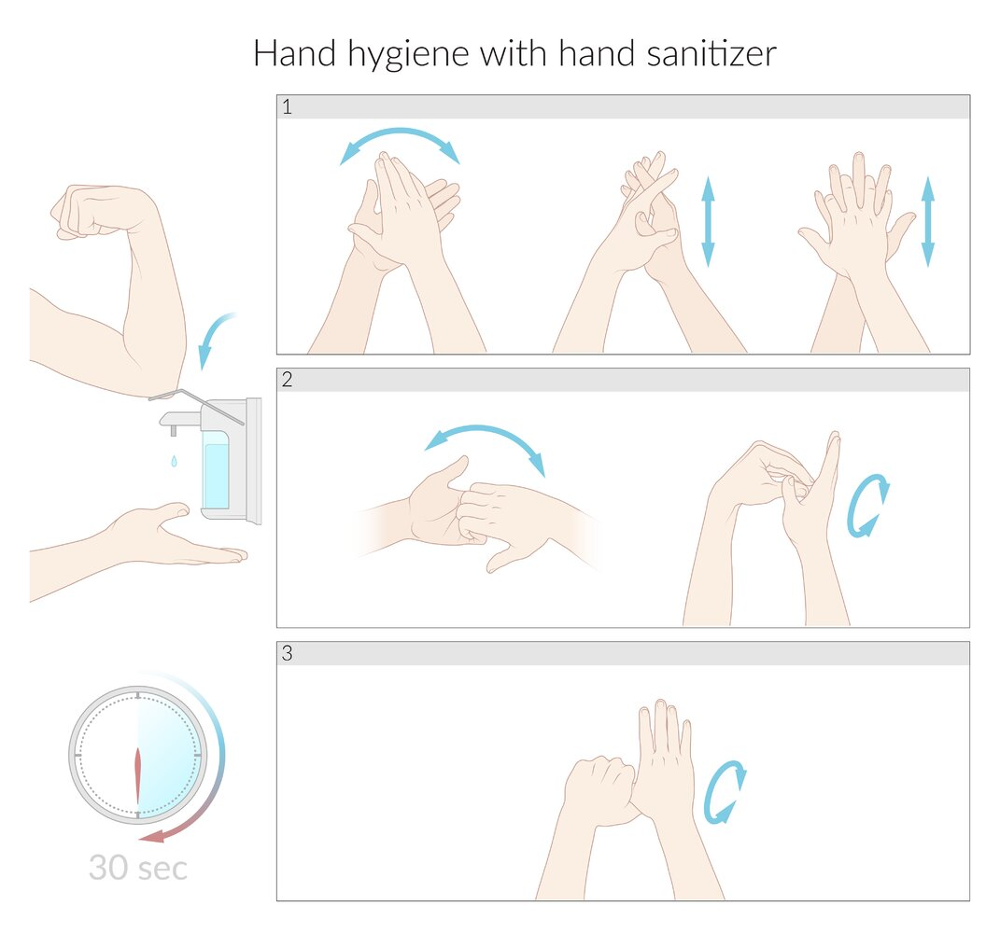

Hygienic hand rub (antiseptic hand rub)

### <u>COVID-19 vaccines</u> [[85]](https://coursology-qbank.com/amboss/article/6tdje70)

* Types: Three <u>COVID-19 vaccines</u> are available in the US.

* <u>Pfizer-BioNTech COVID-19 vaccine</u>

* <u>Moderna COVID-19 vaccine</u>

* <u>Novavax COVID-19 vaccine</u> (approved only for ≥ 12 years of age)

* Indication

* All individuals ≥ 6 months of age

* Defer <u>vaccination</u> in patients with recent or current COVID-19 until full recovery and completion of isolation.

* Schedule: See “<u>ACIP immunization schedule</u>” for details.

* Contraindication: history of a severe <u>allergic reaction</u> to any component of the <u>vaccine</u>

* Adverse effects

* Common: injection site <u>pain</u> and redness, <u>headache</u>, <u>myalgia</u>, <u>fever</u>, chills, fatigue

* Rare (these have been observed more frequently in young men) [[86]](https://coursology-qbank.com/amboss/article/a4dQ3J0)

* <u>Myocarditis</u>

* <u>Pericarditis</u>

|  COVID-19 vaccines  [[85]](https://coursology-qbank.com/amboss/article/6tdje70) (All <u>COVID-19 vaccines</u> are administered intramuscularly ) |  |  |
| --- | --- | --- |
| Name | Type | Schedule |
|  Pfizer-BioNTech COVID-19 vaccine [[87]](https://coursology-qbank.com/amboss/article/LLXwyA) |  * <u>mRNA vaccine</u>   | See “<u>ACIP immunization schedule</u>” for details. |
|  Moderna COVID-19 vaccine [[88]](https://coursology-qbank.com/amboss/article/oLX0AA) |  * <u>mRNA vaccine</u>   |  |
|  Novavax COVID-19 vaccine [[89]](https://coursology-qbank.com/amboss/article/LUWwdk0) |  * Recombinant protein <u>subunit vaccine</u>   |  |

> [!TIP]
> While vaccinated individuals can still contract COVID-19, they have a significantly lower risk of severe disease and <u>death</u> than unvaccinated individuals. [[90]](https://coursology-qbank.com/amboss/article/J-csyU0)

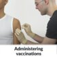

Clinical Skills: Administering Vaccinations

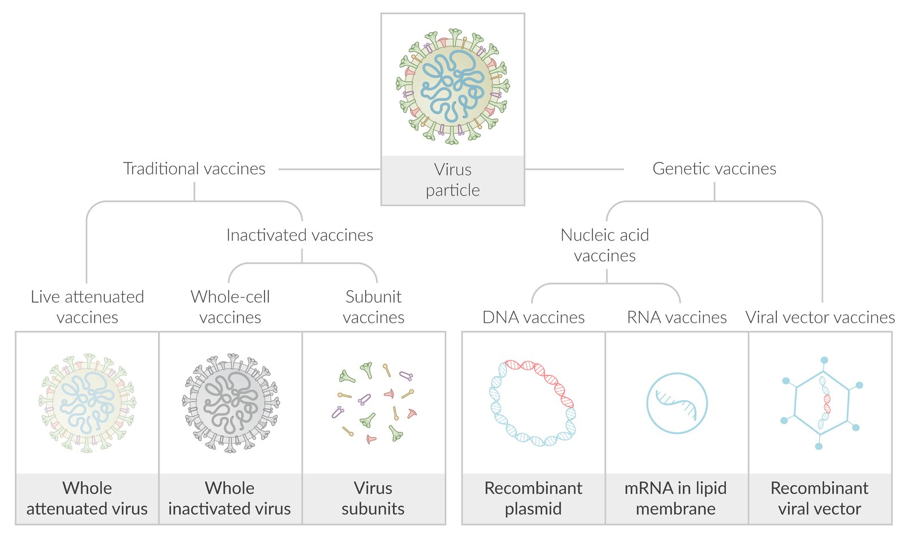

Vaccine types

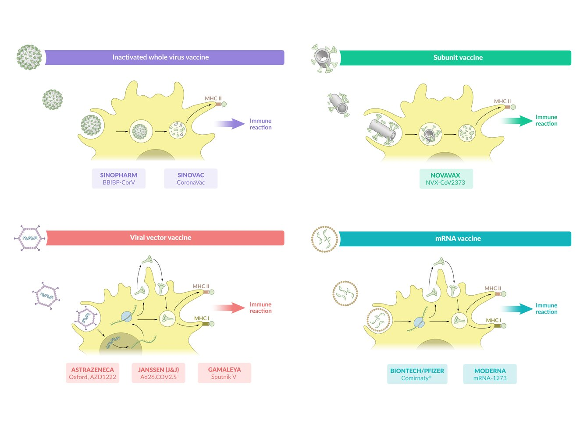

Vaccine types against COVID-19

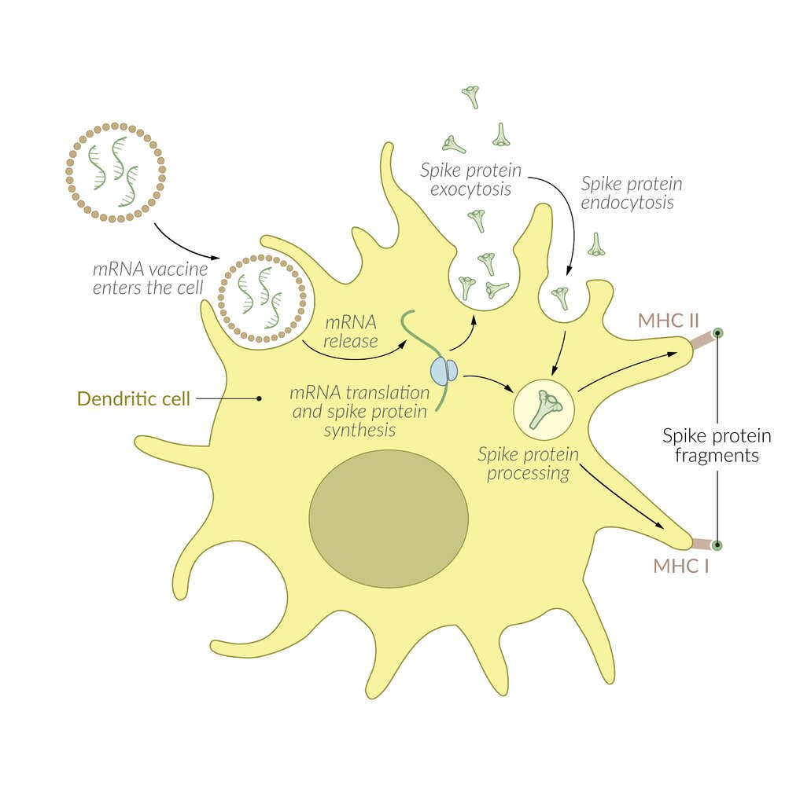

Mechanism of action of mRNA-based COVID-19 vaccines

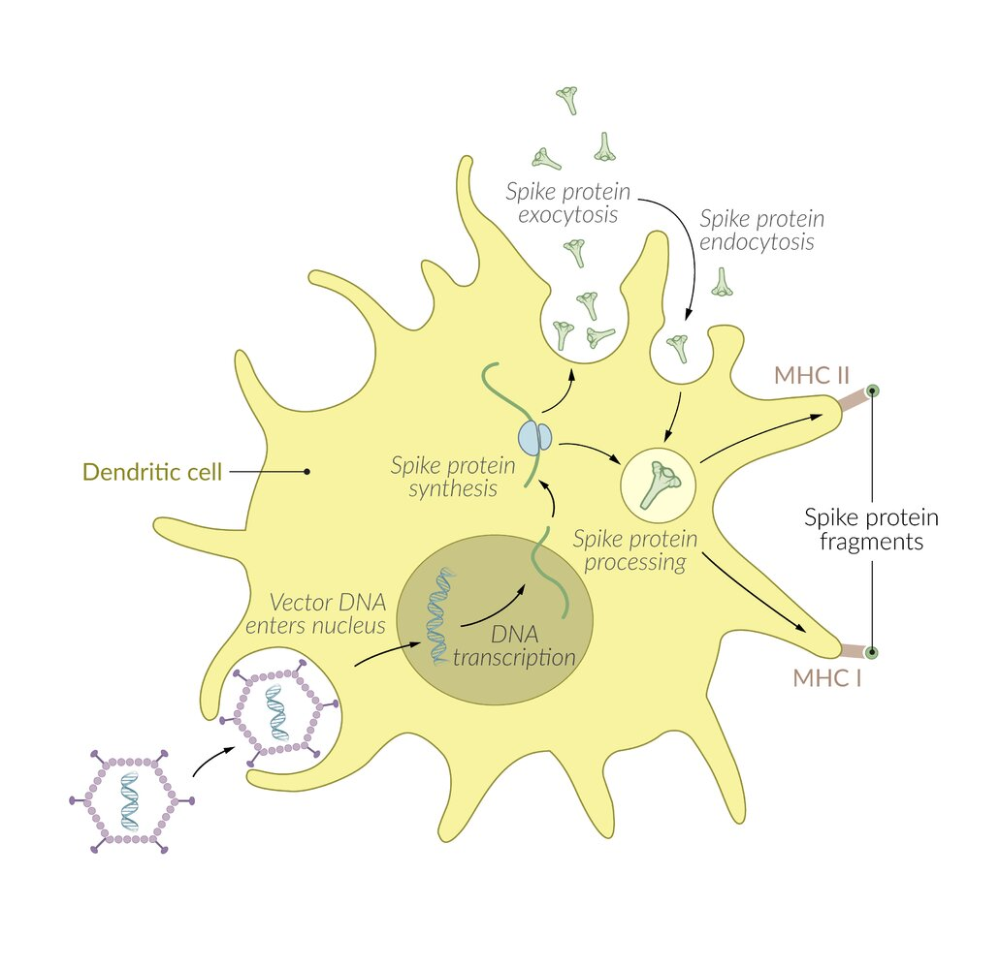

Mechanism of action of viral vector-based COVID-19 vaccines

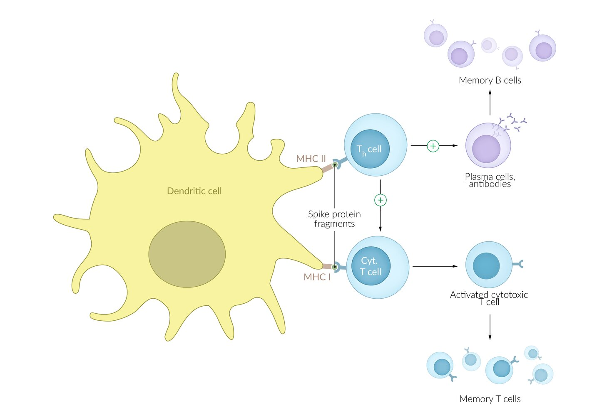

Immune reaction to COVID-19 vaccines

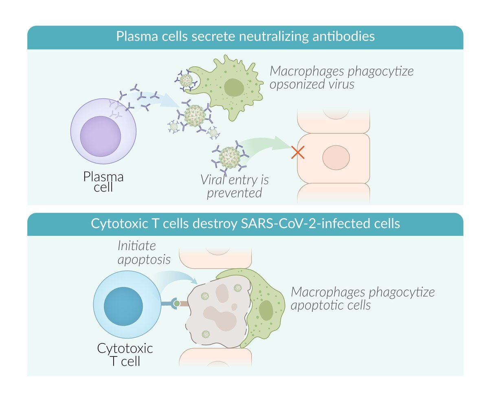

Immune reaction to SARS-CoV-2 exposure in vaccinated and recovered individuals

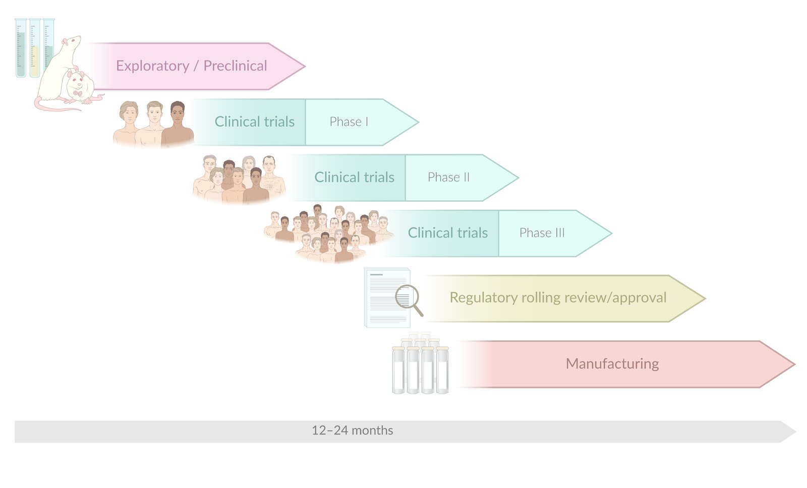

Accelerated vaccine development during the SARS-CoV-2 pandemic

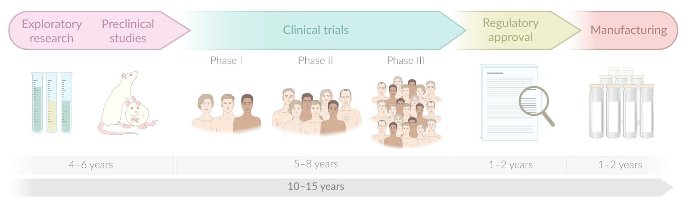

Standard vaccine development

### Management of high-risk exposures (close contact) [[91]](https://coursology-qbank.com/amboss/article/gTbFJG)

* Close contact is defined as being < 6 ft from an infectious individual for ≥ 15 min.

* Management

* <u>COVID-19 virological testing</u>

* Indicated for all vaccinated and unvaccinated individuals who have not had COVID-19 in the past 90 days

* Testing should be performed at least five days after close contact.

* The need for and duration of isolation varies by <u>vaccination</u> status: See https://www.cdc.gov/<u>coronavirus</u>/2019-ncov/your-health/<u>quarantine</u>-isolation.html for the most recent guidelines.

* All close contacts should wear well-fitting masks around others for 10 days and avoid contact with high-risk individuals.

### Preexposure prophylaxis for COVID-19 [[92]](https://coursology-qbank.com/amboss/article/sT1tHT0)

* Indications

* <u>Immunocompromised individuals</u>

* Individuals unable to be vaccinated due to severe <u>allergic reactions</u>

* Regimen: tixagevimab PLUS cilgavimab (long-acting <u>anti-SARS-CoV-2 monoclonal antibodies</u>)

### Preventing spread of COVID-19 in healthcare settings

* Consider <u>telemedicine</u> for triage and outpatient monitoring of patients with <u>mild COVID-19</u> when feasible.  [[4]](https://coursology-qbank.com/amboss/article/-AbDmw)

* <u>Personal protective equipment</u> (<u>PPE</u>) [[93]](https://coursology-qbank.com/amboss/article/I1bYRs)

* All individuals caring for patients with confirmed or suspected COVID-19 should wear appropriate <u>PPE</u>.

* See “<u>Personal protective equipment</u>” for instructions on safely putting on and <u>removing PPE</u>.

* Strategies to reduce spread in healthcare settings include: 

* Separate locations dedicated to the evaluation of patients with known or possible COVID-19

* Limiting the number of visitors allowed per patient

* Screening all people entering the <u>health care facility</u> for symptoms of COVID-19

* Nonurgent procedures and elective surgeries may be postponed to preserve hospital beds and resources.

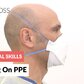

⭐ COVID-19: Putting On Personal Protective Equipment (PPE)

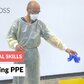

⭐ COVID-19: Removing Personal Protective Equipment (PPE)

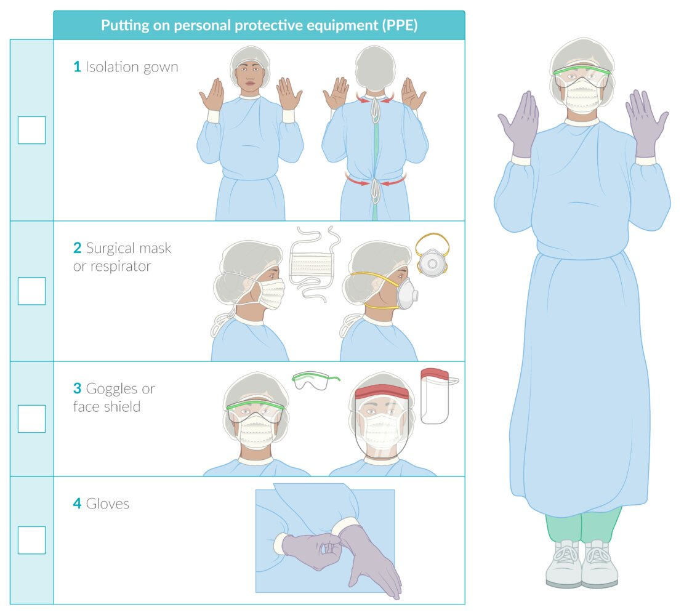

Putting on SARS-CoV-2 personal protective equipment (PPE)

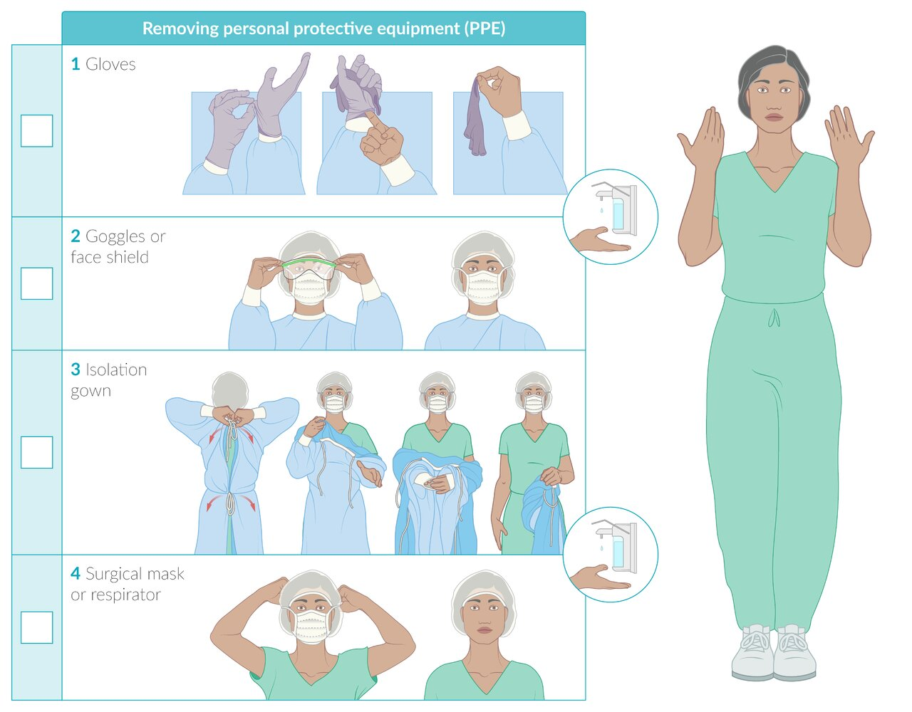

Removing SARS-CoV-2 personal protective equipment (PPE)

---