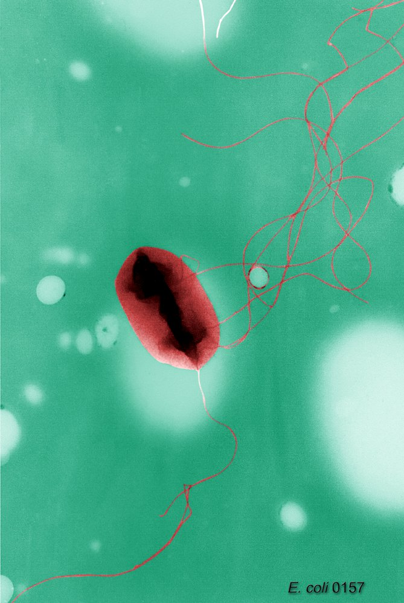

# Diarrheagenic E. coli

*Categories: Clinical knowledge > Emergency medicine > Infectious diseases > Diarrheagenic E. coli*

[Original Article Link](https://coursology-qbank.com/amboss/article/yf0dK2)

---

## Summary

<u>Escherichia coli</u> (<u>E. coli</u>) is a gram-negative, rod-shaped flagellated bacterium. Although it is an essential component of the bacterial gut flora, the disease may be caused by direct intake of a pathogenic <u>E. coli</u> subtype (e.g., in contaminated food) or spreading of the intestinal bacteria to another organ (<u>cystitis</u>, <u>pneumonia</u>). Enterohemorrhagic <u>E. coli</u> (<u>EHEC</u>), for instance, can lead to severe <u>colitis</u> and <u>hemolytic uremic syndrome</u> (<u>HUS</u>), particularly in children and <u>infants</u>. In such cases, <u>diarrhea</u> should only be treated symptomatically, as <u>antibiotics</u> can lead to increased toxin secretions that exacerbate the course of the disease. Supportive therapy without <u>antibiotic therapy</u> is also recommended for infection involving other strains of <u>E. coli</u> (<u>ETEC</u>, <u>EPEC</u>, and <u>EIEC</u>), but <u>antibiotics</u> may be indicated in certain cases.

---

## General information

* <u>Pathogen</u>: <u>Escherichia coli</u> (<u>E. coli</u>) [[1]](https://coursology-qbank.com/amboss/article/VUaGXP)

* Gram-negative, rod-shaped, <u>indole-positive</u>, and flagellated

* Various pathogenic strains of <u>E. coli</u> include:

* Shiga toxin-producing E. coli (<u>STEC</u>) 
* Enterohemorrhagic <u>E. coli</u> (<u>EHEC</u>)

* Enterotoxigenic <u>E. coli</u> (<u>ETEC</u>)

* Enteropathogenic <u>E. coli</u> (<u>EPEC</u>)

* Enteroinvasive <u>E. coli</u> (<u>EIEC</u>)

* Some strains are an essential component of the bacterial gut flora and even have a protective effect against enteropathogens.  [[2]](https://coursology-qbank.com/amboss/article/BdYzHL)

* Transmission: fecal-oral [[3]](https://coursology-qbank.com/amboss/article/SUaycP)

* Contaminated food (e.g., raw meat products, vegetables, fruits) and water

* Person-to-person

* Diagnostic steps [[4]](https://coursology-qbank.com/amboss/article/eUaxXP)

* Culture and/or <u>PCR</u> from stool samples

* Differential media (based on <u>E.coli</u> <u>lactose fermenting</u> properties)

* <u>MacConkey agar</u>: pink colonies

* <u>Eosin-methylene blue agar</u>: colonies with a metallic green sheen

* Differential diagnosis

* <u>Food poisoning</u>

* <u>Bacterial gastroenteritis</u>

* <u>Norovirus infection</u>

* <u>Rotavirus infection</u>

* General guidelines for treating E. coli infections [[5]](https://coursology-qbank.com/amboss/article/hUac1P)[[6]](https://coursology-qbank.com/amboss/article/fUakcP)

* Supportive therapy [[7]](https://coursology-qbank.com/amboss/article/gUaFcP)

* Rehydration and <u>electrolyte</u> replenishment (e.g., <u>oral rehydration salts</u> or solutions; <u>IV fluids</u>)

* Clear liquids, easy-to-digest foods

* The patient should return to a normal diet as soon as tolerated .

* Antibiotic therapy for E. coli: Although some indications exist, <u>antibiotic therapy</u> is generally not recommended and is strongly contraindicated in <u>EHEC</u>.

* Considered only in cases of severe and/or <u>persistent diarrhea</u> (see the individual sections below for specific indications)

* First-line agents in adults: <u>fluoroquinolones</u> (e.g., <u>ciprofloxacin</u>, <u>norfloxacin</u>, <u>levofloxacin</u>, and <u>moxifloxacin</u>)

* Alternative (drug of choice in children and pregnant women): <u>azithromycin</u>

> [!WARNING]
> Do not use <u>antibiotics</u> if <u>EHEC</u> is suspected.

Flagellated E. coli

---

## Enterohemorrhagic Escherichia coli (EHEC)

* <u>Pathogen</u>: enterohemorrhagic <u>E. coli</u> (<u>EHEC</u>)

* Subset of <u>Shiga toxin-producing E. coli</u> (<u>STEC</u>)

* Produces <u>Shiga toxin</u> (<u>verotoxin</u>) that causes bloody <u>diarrhea</u> and, possibly, <u>HUS</u>

* <u>O157:H7</u> is the strain most commonly associated with <u>HUS</u> worldwide.

* Transmission: fecal-oral ;  [[8]](https://coursology-qbank.com/amboss/article/b2aHTP)

* Contaminated food (associated with industrial food production in developed countries)

* Raw beef and milk

* Raw vegetables

* Contact with contaminated stool

* At-risk groups: <u>infants</u>/<u>toddlers</u> and the elderly

* Pathophysiology [[9]](https://coursology-qbank.com/amboss/article/X2a9TP)[[10]](https://coursology-qbank.com/amboss/article/c2aagP)

* <u>EHEC</u> bacteria are infected by <u>bacteriophages</u> that integrate their <u>genes</u> into the bacteria's <u>genome</u>; these <u>genes</u> then code for toxins (<u>verotoxin</u>/<u>Shiga toxin</u> 1 and 2).

* Adhesion to <u>receptors</u> of gut cells;   → Shiga toxin secretion → cleavage of <u>adenine</u> from the <u>rRNA</u> → inactivation of the <u>60S subunit</u> → <u>protein synthesis</u> inhibition → cell <u>death</u> → <u>necrosis</u> and inflammation of the GI <u>mucosa</u> → watery-bloody <u>diarrhea</u> with mucus (otherwise known as <u>dysentery</u>)

* <u>Incubation period</u>: 2–10 days

* Clinical features [[11]](https://coursology-qbank.com/amboss/article/12a2gP)

* Bloody <u>diarrhea</u>, <u>dehydration</u>, and abdominal tenderness

* Little to no <u>fever</u> [[12]](https://coursology-qbank.com/amboss/article/k2Xm3x)

* See “<u>Hemolytic uremic syndrome</u>” for its specific symptoms (e.g., decreased urine output, <u>petechiae</u>, and neurologic manifestations).

* Diagnosis [[13]](https://coursology-qbank.com/amboss/article/a2aQTP)

* Stool samples should be tested for <u>EHEC</u>:

* In all cases of community-acquired <u>diarrhea</u>

* In possible <u>HUS</u>/<u>TTP</u>

* Culture for <u>O157:H7</u> on <u>sorbitol</u> <u>MacConkey agar</u>

* Check for non-O157 <u>EHEC</u> by detection of <u>Shiga toxins</u> (via <u>enzyme immunoassay</u>) or <u>Shiga toxin</u>-encoding <u>genes</u> (via <u>polymerase chain reaction</u>)

* Treatment [[14]](https://coursology-qbank.com/amboss/article/Y2anTP)

* Provide management for <u>STEC</u>-positive illness to prevent and monitor for <u>HUS</u>.

* Avoid antiperistaltic agents (e.g., <u>diphenoxylate/atropine</u>) since they increase the risk of systemic complications.

* <u>Antibiotic therapy</u> is contraindicated.

* See “<u>General guidelines for treating E. coli infections</u>”.

* Complications: <u>HUS</u> (particularly in <u>infants</u>/<u>toddlers</u> )

* Obligation to report: <u>EHEC</u> infection and <u>HUS</u> infection are reportable in most US states.

> [!NOTE]
> EHEC leads to HUS.

> [!NOTE]
> <u>EHEC</u> is a subset of <u>STEC</u> (<u>Shiga toxin</u>-producing <u>E.coli</u>). → Undercooked STEAK is a common source of <u>EHEC</u> infection.

---

## Enterotoxigenic Escherichia coli (ETEC)

* <u>Epidemiology</u> [[15]](https://coursology-qbank.com/amboss/article/W2aPgP)

* Enterotoxigenic <u>E. coli</u> (<u>ETEC</u>) is the most common <u>pathogen</u> causing <u>traveler's diarrhea</u>.

* A major cause of <u>diarrhea</u> among children in developing countries

* Very common while traveling in Asian, African, and Latin American countries

* Pathophysiology [[16]](https://coursology-qbank.com/amboss/article/0VYeGL)

* <u>ETEC</u> produces two types of <u>enterotoxins</u>:

* Heat-labile enterotoxin (<u>AB toxin</u>; two-component protein, similar to <u>cholera toxin</u>): activation of <u>adenylate cyclase</u> → ↑ <u>cAMP</u> levels → ↑ <u>chloride</u> secretion → water efflux into the intestinal lumen → <u>secretory diarrhea</u>

* Heat-stable enterotoxin: activation of <u>guanylate cyclase</u> → ↑ <u>cGMP</u> levels → ↓ NaCl reabsorption → water efflux into the intestinal lumen → <u>secretory diarrhea</u>

* No invasion of the intestinal <u>mucosa</u> and no inflammation

* Clinical presentation: Symptoms last 3–4 days.

* Watery <u>diarrhea</u>

* Abdominal cramping

* <u>Nausea</u>; , possibly <u>vomiting</u>

* <u>Fever</u>

* Decreased appetite

* Treatment [[5]](https://coursology-qbank.com/amboss/article/hUac1P)[[15]](https://coursology-qbank.com/amboss/article/W2aPgP)

* <u>Antibiotics</u> may shorten the duration of symptoms.

* <u>Bismuth subsalicylate</u> compounds may decrease the frequency of bowel movements.

* See “<u>General guidelines for treating E. coli infections</u>”.

* Prevention [[17]](https://coursology-qbank.com/amboss/article/d2aogP)

* Practice good <u>food and water safety</u>.

* Prophylactic <u>antibiotics</u> are not recommended for most travelers.

* Prophylaxis may be considered for pregnant women and <u>immunocompromised</u> patients.

> [!NOTE]
> ETEC causes Travelers' <u>diarrhea</u>.

---

## Enteropathogenic Escherichia coli (EPEC)

* <u>Pathogen</u>: Enteropathogenic <u>E. coli</u> (<u>EPEC</u>) leads to infantile <u>diarrhea</u>.

* <u>Epidemiology</u> [[18]](https://coursology-qbank.com/amboss/article/U2abSP)

* Adults are less susceptible to <u>EPEC</u> infection.

* A common cause of <u>diarrhea</u> in children < 5 years old, especially in developing countries

* After <u>rotavirus</u> infections, <u>EPEC</u> is one of the <u>leading causes of death</u> in children in developing countries.

* Pathophysiology [[19]](https://coursology-qbank.com/amboss/article/e2axgP)

* <u>EPEC</u> blocks absorption by attaching to the apical surfaces of the intestinal <u>epithelium</u>, causing the villi to flatten.

* No toxin production is involved.

* Clinical presentation [[20]](https://coursology-qbank.com/amboss/article/f2akSP)

* 10–20 watery bowel movements per day for about 2 weeks

* <u>Vomiting</u>

* Low-grade <u>fever</u>

* Treatment [[21]](https://coursology-qbank.com/amboss/article/22aTSP)

* In cases of <u>persistent diarrhea</u> (e.g., loose stools for > 2 weeks) <u>antibiotics</u> may be used.

* See “<u>General guidelines for treating E. coli infections</u>”.

> [!NOTE]
> EPEC causes Pediatric <u>diarrhea</u>.

---

## Enteroinvasive Escherichia coli (EIEC)

* <u>Pathogen</u>: enteroinvasive <u>E. coli</u> (<u>EIEC</u>)

* Pathophysiology: invasion of gut <u>epithelium</u> → inflammation and <u>necrosis</u>

* Clinical presentation

* Watery to bloody <u>diarrhea</u>, possibly with mucus (<u>dysentery</u>)

* <u>Fever</u>, chills, <u>malaise</u>

* Abdominal cramps

* Possibly <u>vomiting</u>

* Symptoms similar to <u>shigellosis</u>

* Treatment: See “<u>Antibiotic therapy for E. coli</u>”.

> [!NOTE]
> EIEC Invades the Intestinal <u>mucosa</u>.

References:[[18]](https://coursology-qbank.com/amboss/article/U2abSP)

---