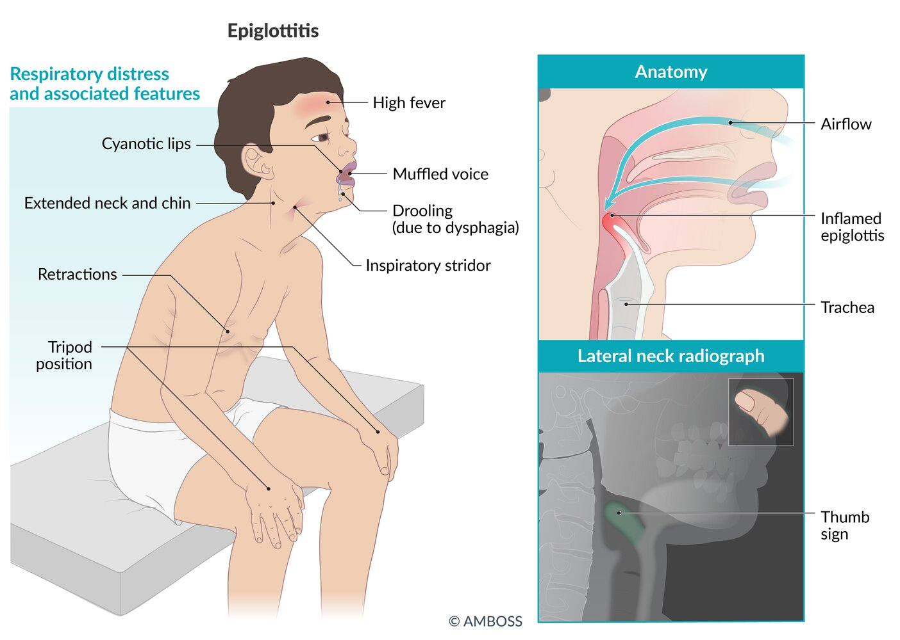
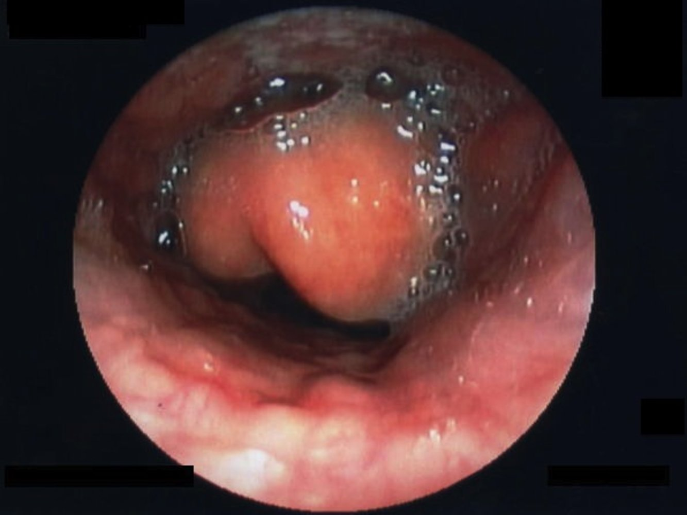
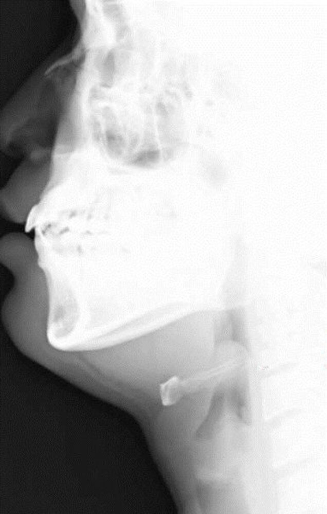

# Epiglottitis

*Categories: Clinical knowledge > Emergency medicine > Infectious diseases > Epiglottitis*

[Original Article Link](https://coursology-qbank.com/amboss/article/f50kjg)

---

## Summary

Epiglottitis is the rapid progressive inflammation of the <u>epiglottis</u> and surrounding <u>supraglottis</u> that was historically primarily caused by <u>Haemophilus influenzae</u> type b (<u>Hib</u>). Since the introduction of the <u>Hib vaccine</u> in 1985, the <u>incidence</u> of <u>Hib</u> epiglottitis has significantly decreased. Epiglottitis is now more common in adults than in children and is usually caused by other bacteria (e.g., streptococci and <u>staphylococci</u>). Children with epiglottitis typically appear acutely ill and position themselves in a tripod stance (sitting and leaning forward) in an attempt to improve their <u>airway</u> diameter. The disease is characterized by the acute onset of <u>fever</u>, drooling, <u>sore throat</u>, <u>dysphagia</u>, and, in severe cases, <u>respiratory distress</u> accompanied by inspiratory <u>retractions</u> and <u>cyanosis</u>. Impending <u>airway obstruction</u> is also accompanied by a muffled voice and restlessness. Epiglottitis is diagnosed based on clinical presentation. If the diagnosis is unclear and the patient is stable, a <u>lateral</u> cervical <u>x-ray</u> may be considered on which a <u>thumb sign</u> may be seen. If the patient is unstable, their <u>airway</u> should first be secured, after which direct laryngeal examination may be performed. Patients should be closely monitored in a hospital and receive IV <u>antibiotics</u>. Most patients make a full recovery after prompt and adequate treatment.

---

## Epidemiology

* More common in adults than children  [[1]](https://coursology-qbank.com/amboss/article/VTWGpk0)

* Peak <u>incidence</u> in children: 6–12 years  [[2]](https://coursology-qbank.com/amboss/article/1TW2pk0)

* Peak <u>incidence</u> in adults: 40–50 years [[1]](https://coursology-qbank.com/amboss/article/VTWGpk0)

Epidemiological data refers to the US, unless otherwise specified.

---

## Etiology

* Pathogens

* Traditionally: <u>Haemophilus influenzae</u> type b (<u>Hib</u>)

* Most cases now involve:

* <u>Streptococcus pyogenes</u>

* <u>Streptococcus pneumoniae</u>

* <u>Staphylococcus aureus</u>

* Nontypeable <u>H. influenzae</u>

* <u>Risk factors</u>

* Not immunized against <u>Hib</u>

* <u>Immunodeficiency</u>

References:[[3]](https://coursology-qbank.com/amboss/article/u80po3)

---

## Clinical features

* <u>Respiratory distress</u> (inspiratory <u>retractions</u>, <u>cyanosis</u>)

* <u>Inspiratory stridor</u>

* <u>Tripod position</u>: eases respiration as the <u>airway</u> diameter is increased by leaning forward and extending the neck in a seated position

* <u>Sore throat</u>

* <u>Dysphagia</u> and <u>odynophagia</u>

* Drooling

* Muffled voice (i.e., resembling a “hot-potato” voice) with painful speech

* Acute onset of high <u>fever</u> (102–104 °F (39.0–40.0 °C))

* Toxic appearance

* Restlessness and/or <u>anxiety</u>

* Absence of <u>cough</u>

* Tenderness to palpation over <u>larynx</u>/throat [[4]](https://coursology-qbank.com/amboss/article/35YSPp)

> [!NOTE]
> The hallmarks of epiglottitis are the three Ds: Dysphagia, Drooling, and Distress.

Epiglottitis

References:[[3]](https://coursology-qbank.com/amboss/article/u80po3)[[5]](https://coursology-qbank.com/amboss/article/_8c56V0)

---

## Airway management

In young children, <u>airway management</u> is a higher priority than diagnostic evaluation . <u>Advanced airway</u> placement is rarely required in adults. [[4]](https://coursology-qbank.com/amboss/article/35YSPp)

### Approach [[4]](https://coursology-qbank.com/amboss/article/35YSPp)[[6]](https://coursology-qbank.com/amboss/article/KuYUHI)[[7]](https://coursology-qbank.com/amboss/article/z0briH)

* Keep the patient sitting upright to prevent further <u>airway</u> compromise.

* Minimize external stressors and stimuli that could worsen <u>respiratory distress</u> and <u>airway</u> <u>edema</u>.

* Consult an <u>airway</u> specialist early.

* Provide <u>supplemental oxygen</u> as needed.

* Assess for:

* <u>Clinical features of airway obstruction</u> (e.g., <u>stridor</u>, <u>tachypnea</u>, <u>retractions</u>, <u>hypercapnia</u>, <u>cyanosis</u>, loss of air movement, <u>altered mental state</u>)

* <u>Risk factors</u> for acute deterioration (e.g., <u>immunocompromise</u> or <u>diabetes</u>, epiglottic <u>abscess</u>, rapid onset of symptoms, or rapid progression of severe symptoms) [[4]](https://coursology-qbank.com/amboss/article/35YSPp)

* Patients with <u>clinical features of airway obstruction</u> or <u>risk factors</u> for acute deterioration

* If there are <u>signs of acute respiratory distress</u>, begin <u>bag-mask ventilation</u> with 100% oxygen.

* Consider <u>racemic epinephrine</u> in otherwise healthy adults as a temporizing measure until a <u>definitive airway</u> is established.  [[6]](https://coursology-qbank.com/amboss/article/KuYUHI)[[8]](https://coursology-qbank.com/amboss/article/xEcEBV0)

* <u>Secure the airway</u> with emergency <u>endotracheal intubation</u> in a controlled setting by an experienced practitioner.

* Prepare to perform an <u>emergency surgical airway</u> if <u>endotracheal intubation</u> is unsuccessful.

* Patients without severe <u>airway obstruction</u> or <u>risk factors</u> for acute deterioration: <u>intubation</u> may not be required.

* Consider careful visualization of the <u>epiglottis</u> or imaging to confirm the diagnosis.

* Start <u>treatment for epiglottitis</u>.

* Monitor in an <u>ICU</u> setting for at least 12 hours.  [[5]](https://coursology-qbank.com/amboss/article/_8c56V0)

> [!TIP]
> Acute epiglottitis is an <u>airway</u> emergency. Urgently consult a physician experienced in <u>difficult airway management</u> (e.g., an emergency physician, anesthesiologist, or otolaryngologist).

### <u>Endotracheal intubation</u> [[5]](https://coursology-qbank.com/amboss/article/_8c56V0)[[7]](https://coursology-qbank.com/amboss/article/z0briH)[[9]](https://coursology-qbank.com/amboss/article/NuY-rI)

* Indications

* <u>Respiratory distress</u>

* <u>Altered mental status</u>

* Inability to swallow

* <u>Stridor</u>

* Drooling

* Voice changes

* Procedure: Should be performed by an anesthesiologist, emergency physician, or otolaryngologist, ideally in an OR, <u>ICU</u>, or resuscitation area of an emergency department.

* Ensure <u>difficult airway cart</u> is at the bedside.

* Prepare for <u>difficult intubation</u> with a backup plan, e.g., <u>emergency surgical airway</u>. 

* Use <u>video-assisted laryngoscopy</u>, if available.

* Consider <u>flexible fiberoptic intubation</u> or <u>rigid bronchoscopy</u>, if available and trained.

* Maintaining spontaneous ventilation under <u>general anesthesia</u> is preferable.

* Consider <u>rapid sequence induction</u> if there is rapid clinical deterioration.

* <u>Intubation</u> tubes

* In adults: small-sized <u>endotracheal tubes</u>

* In children: nasotracheal tubes with a small diameter

* Confirm and check the adequacy of ventilation.

* <u>Extubation</u> should be performed 2–3 days (at the earliest) after starting <u>antibiotic</u> treatment.

> [!WARNING]
> <u>Intubation</u> should be performed under direct visualization; avoid blind <u>nasotracheal intubation</u> as it risks <u>airway obstruction</u>. [[4]](https://coursology-qbank.com/amboss/article/35YSPp)

### <u>Emergency surgical airway</u> [[9]](https://coursology-qbank.com/amboss/article/NuY-rI)[[10]](https://coursology-qbank.com/amboss/article/QSbuzG)

Indicated if <u>intubation</u> is unsuccessful

* Adults and older children: <u>surgical cricothyroidotomy</u> (See “<u>Surgical airway management</u>” for details)

* Children < 8 years old: <u>needle cricothyrotomy</u>

---

## Diagnostics

### Approach [[6]](https://coursology-qbank.com/amboss/article/KuYUHI)[[11]](https://coursology-qbank.com/amboss/article/5uYi7I)[[12]](https://coursology-qbank.com/amboss/article/21bTTs)[[13]](https://coursology-qbank.com/amboss/article/f1bkTs)[[14]](https://coursology-qbank.com/amboss/article/SfbylG)

* Epiglottitis is primarily a <u>clinical diagnosis</u>.

* See “Clinical features.”

* See also “<u>Differential diagnoses of stridor</u>” and “<u>Overview of deep neck infections</u>” for the evaluation of alternate diagnoses.

* If the diagnosis is uncertain and there are no signs of impending <u>airway obstruction</u>:

* Visualize the <u>epiglottis</u> to confirm the diagnosis.

* Consider imaging to confirm the diagnosis if:

* Visualization of the <u>epiglottis</u> is unclear or unsuccessful.

* Alternate diagnoses need to be ruled out, e.g., <u>croup</u>, <u>abscess</u>, <u>foreign body aspiration</u>.

> [!WARNING]
> <u>Secure the airway</u> before initiating diagnostic studies or procedures in patients with impending <u>airway</u> compromise, especially in children.

### Visualization of the <u>epiglottis</u> [[6]](https://coursology-qbank.com/amboss/article/KuYUHI)[[11]](https://coursology-qbank.com/amboss/article/5uYi7I)[[12]](https://coursology-qbank.com/amboss/article/21bTTs)[[13]](https://coursology-qbank.com/amboss/article/f1bkTs)[[14]](https://coursology-qbank.com/amboss/article/SfbylG)

* Indication: There is suspicion for epiglottitis but no <u>clinical features of airway obstruction</u>.

* Procedure

* Direct pharyngoscopy: oropharyngeal examination with a <u>tongue</u> blade

* <u>Direct laryngoscopy</u>: can be performed during or after <u>intubation</u>

* Indirect <u>laryngoscopy</u> (mirror examination) or <u>flexible fiberoptic laryngoscopy</u>

* Perform in an OR, <u>ICU</u>, or emergency department.

* Additional considerations

* Avoid increasing <u>anxiety</u> (especially in children). 

* Keep the patient comfortable and in a calm setting.

* Keep the patient in a sitting position at all times (do not force the patient to lie <u>supine</u>).

* If the patient is a child, let the parent/guardian hold the mask, and use distractions and humor to help keep the child relaxed.

* In children, this procedure should only be performed by a skilled otolaryngologist.

* Characteristic findings

* Direct pharyngoscopy: often normal; <u>epiglottis</u> is often not seen.

* Indirect <u>laryngoscopy</u> or <u>flexible fiberoptic laryngoscopy</u>

* Cherry-red <u>epiglottis</u>

* Pooled secretions

* Inflammation and <u>edema</u> of the <u>supraglottic</u> structure

Epiglottitis

### Imaging [[6]](https://coursology-qbank.com/amboss/article/KuYUHI)[[11]](https://coursology-qbank.com/amboss/article/5uYi7I)[[12]](https://coursology-qbank.com/amboss/article/21bTTs)[[13]](https://coursology-qbank.com/amboss/article/f1bkTs)[[14]](https://coursology-qbank.com/amboss/article/SfbylG)

#### Soft-tissue <u>lateral</u> neck <u>x-ray</u> [[15]](https://coursology-qbank.com/amboss/article/PzYWG7)

* Indication: mainly performed in children if the clinical presentation in early cases is inconclusive

* Procedure: should be carried out under the supervision of an experienced physician

* Characteristic findings

* Thumb sign (also referred to as thumbprint sign): enlarged <u>epiglottis</u> and <u>supraglottic</u> narrowing

* Narrowing or complete loss of the normal pre-epiglottic air shadow (vallecula sign)

* Thick aryepiglottic folds

Thumb and vallecula signs (epiglottitis)

#### CT of the neck with IV contrast  [[16]](https://coursology-qbank.com/amboss/article/nfb75G)

* Indication: only performed in adults, mainly to exclude other diagnoses

* Procedure: requires the <u>supine position</u>, which can compromise the <u>airway</u>

* Characteristic findings

* Thickening of any of the following may be present:

* <u>Epiglottis</u>

* Aryepiglottic folds

* <u>False vocal cords</u> and <u>true vocal cords</u>

* <u>Platysma muscle</u> and prevertebral <u>fascia</u>

* Loss of vallecular air space

* Obliteration of preepiglottic fat

Epiglottitis (supraglottitis)

### Additional diagnostic studies [[11]](https://coursology-qbank.com/amboss/article/5uYi7I)

* <u>Blood cultures</u> (2 sets)

* Swab of the <u>epiglottis</u> and epiglottic culture : to guide <u>antibiotic therapy</u>

* <u>Hib immunization</u> status of the patient (and close contacts, if applicable)

---

## Treatment

### Empiric IV <u>antibiotics</u> [[7]](https://coursology-qbank.com/amboss/article/z0briH)[[11]](https://coursology-qbank.com/amboss/article/5uYi7I)

There are no guidelines on specific <u>empiric antibiotic</u> recommendations. All patients should receive IV <u>antibiotics</u> that are active against <u>Hib</u>, <u>S. aureus</u>, <u>S. pyogenes</u>, and <u>S. pneumonia</u>. Following cultures, <u>antibiotics</u> can be narrowed according to identified organisms.

* Most sources recommend monotherapy with a third-generation <u>cephalosporin</u> (e.g., <u>cefotaxime</u>;  , <u>ceftriaxone</u>);  or a <u>beta-lactam</u> with a <u>beta-lactamase</u> inhibitor (e.g., <u>ampicillin/sulbactam</u> , <u>amoxicillin/clavulanate</u> , <u>piperacillin/tazobactam</u> ). [[6]](https://coursology-qbank.com/amboss/article/KuYUHI)[[17]](https://coursology-qbank.com/amboss/article/C3bqkt)[[18]](https://coursology-qbank.com/amboss/article/x3bEkt)[[19]](https://coursology-qbank.com/amboss/article/A3bROt)

* For patients with <u>severe penicillin allergy</u>, consider a <u>fluoroquinolone</u> (e.g., <u>levofloxacin</u> ). [[7]](https://coursology-qbank.com/amboss/article/z0briH)[[19]](https://coursology-qbank.com/amboss/article/A3bROt)

* Consider the addition of an <u>antibiotic</u> with anti-<u>MRSA</u> activity (e.g., <u>vancomycin</u> , <u>clindamycin</u> ).  [[6]](https://coursology-qbank.com/amboss/article/KuYUHI)[[18]](https://coursology-qbank.com/amboss/article/x3bEkt)[[19]](https://coursology-qbank.com/amboss/article/A3bROt)

### Adjunctive therapy [[11]](https://coursology-qbank.com/amboss/article/5uYi7I)[[14]](https://coursology-qbank.com/amboss/article/SfbylG)[[20]](https://coursology-qbank.com/amboss/article/6uYjHI)[[21]](https://coursology-qbank.com/amboss/article/rfbfnG)

* Consider empiric <u>steroids</u>.  [[21]](https://coursology-qbank.com/amboss/article/rfbfnG)

* <u>Dexamethasone</u>  [[21]](https://coursology-qbank.com/amboss/article/rfbfnG)

* OR <u>methylprednisolone</u>  [[21]](https://coursology-qbank.com/amboss/article/rfbfnG)

* <u>IV fluid resuscitation</u>: 20–30 mL/kg of isotonic fluids in children.

---

## Differential diagnoses

* See “<u>Differential diagnoses of stridor</u>” and “<u>Differential diagnosis of dyspnea</u>.”

* <u>Foreign body aspiration</u>

* <u>Anaphylactic</u> reaction

* Chemical injury or <u>thermal injury</u> (<u>burns</u>)

* <u>Laryngitis</u>

* <u>Peritonsillar abscess</u> or <u>retropharyngeal abscess</u>

The differential diagnoses listed here are not exhaustive.

---

## Prevention

* <u>Hib vaccine</u> (see “<u>Immunization schedule</u>”)

* <u>Postexposure prophylaxis</u> with <u>rifampin</u>  [[11]](https://coursology-qbank.com/amboss/article/5uYi7I)[[23]](https://coursology-qbank.com/amboss/article/T3b63t)[[24]](https://coursology-qbank.com/amboss/article/DSb1bt)
* Indications

* All <u>index patients</u> that are < 2 years of age and did not receive <u>ceftriaxone</u> or <u>cefotaxime</u> to treat <u>Hib</u> infections should receive <u>postexposure prophylaxis</u>.

* All household contacts: if any member of the household is < 4 years of age and unimmunized and/or < 18 years of age and <u>immunocompromised</u>

* All daycare attendees: if ≥ 2 cases of invasive <u>Hib</u> disease occurred within 60 days in this setting and unimmunized children attend the daycare facility

---