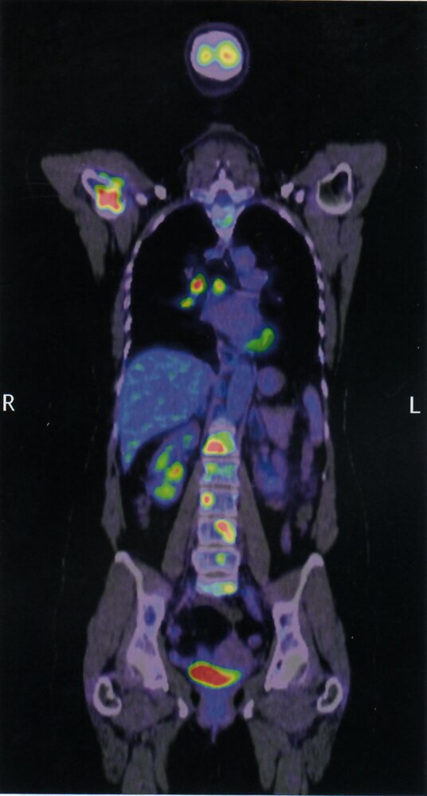
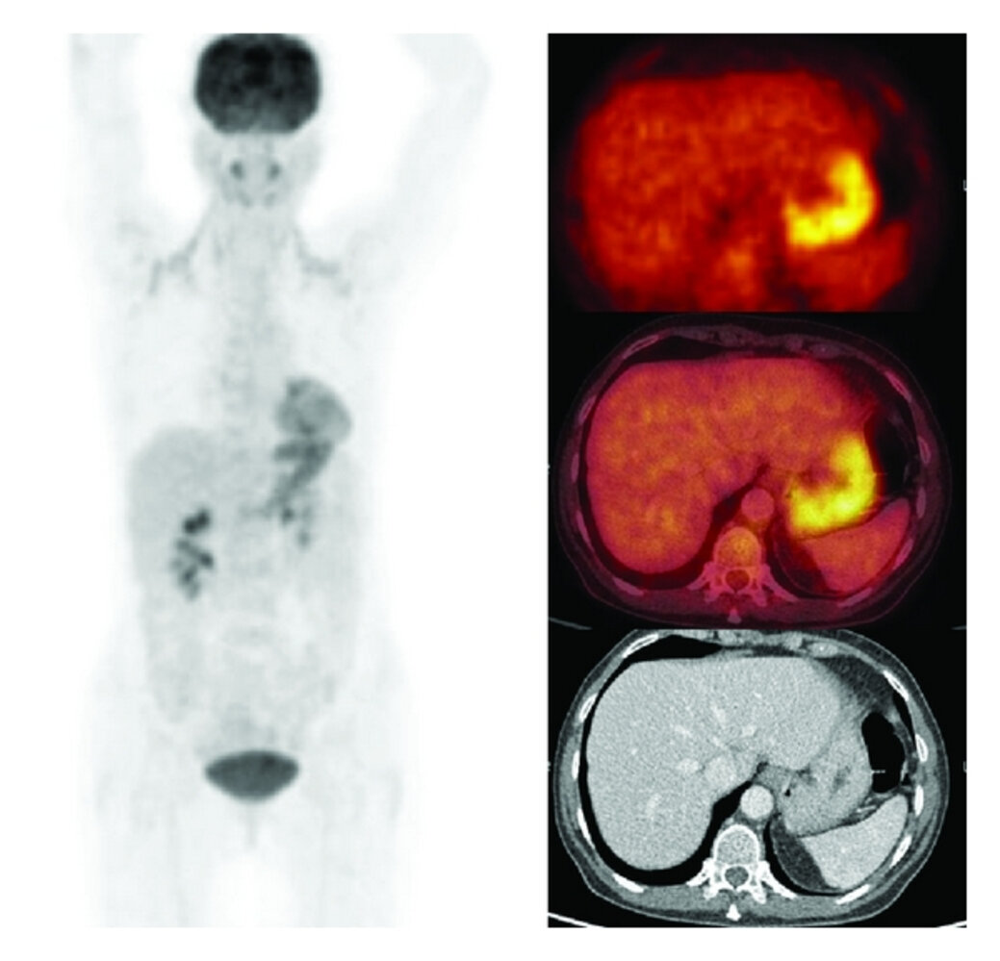
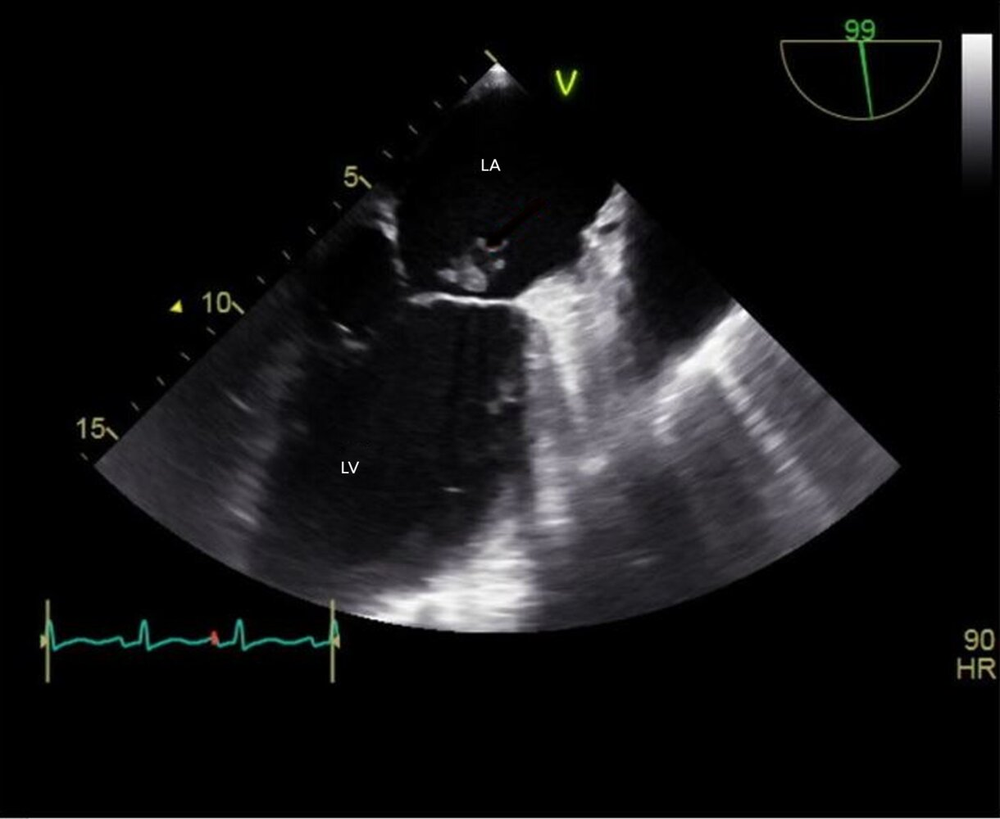
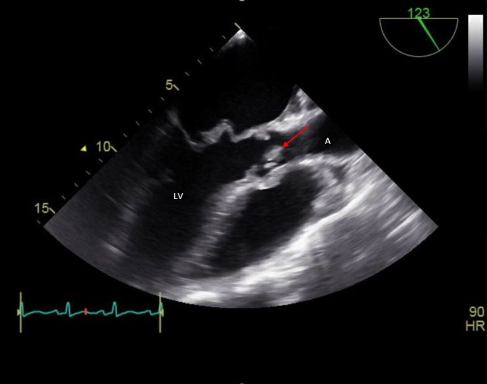

# Fever of unknown origin

*Categories: Clinical knowledge > Emergency medicine > Infectious diseases > Fever of unknown origin*

[Original Article Link](https://coursology-qbank.com/amboss/article/pr0LRh)

---

## Summary

<u>Fever</u> of unknown origin (FUO) is defined as a temperature of > 38.3°C (> 100.9°F) lasting for > 3 weeks with no clear etiology despite appropriate diagnostics. Infections, <u>malignancy</u>, and inflammatory or rheumatic conditions are the most frequent etiologies of FUO. The initial diagnostic approach to FUO should focus on a comprehensive history and <u>physical examination</u> with minimal initial diagnostics to identify diagnostic clues that can guide targeted diagnostics. If the diagnosis remains unknown, additional <u>laboratory studies</u> (e.g., <u>serology</u>, <u>electrophoresis</u>) and advanced diagnostics (e.g., <u>PET-CT</u>, tissue <u>biopsy</u>) should be considered. In a significant number of patients, the underlying etiology remains undiagnosed. <u>Antipyretics</u> and empiric therapy (e.g., <u>antibiotics</u>, <u>glucocorticoids</u>) should be avoided, if feasible, to prevent masking clinical findings and delaying the diagnosis even further. However, if a life-threatening or serious underlying condition (e.g., <u>neutropenic fever</u>, <u>miliary tuberculosis</u>, <u>giant cell arteritis</u>) is suspected, empiric therapy should be considered. The prognosis of FUO depends on the underlying cause and spontaneous remission can occur in up to 40% of patients.

“<u>Fever</u>” and “<u>Neutropenic fever</u>” are covered in detail separately.

---

## Definitions

Definitions of FUO vary in literature. Some authors exclude <u>immunocompromised</u> patients from the FUO definition because the approach to diagnosis and treatment is markedly different from that for immunocompetent patients.

* Classic FUO: temperature of : > 38.3°C (> 100.9°F) recorded on multiple occasions that lasts for > 3 weeks with no clear etiology despite investigations on 3 outpatient visits, 3 days in the hospital, or 1 week of invasive ambulatory investigation

* Nonclassic FUO is characterized by temperature > 38.3°C recorded on multiple occasions with no clear etiology after at least 2 days of culture incubation in addition the following specific features:

* Neutropenic FUO (<u>immunodeficient FUO</u>): <u>neutrophil</u> count of < 500/mm³ or an anticipated fall in <u>neutrophil</u> count to < 500/mm³ within 1–2 days

* HIV-associated FUO: <u>fever</u> that lasts for > 4 weeks (or > 3 days if hospitalized) in a patient with <u>HIV</u>

* Nosocomial FUO: <u>fever</u> that lasts for > 3 days in a hospitalized patient who was afebrile on admission

References: [[1]](https://coursology-qbank.com/amboss/article/wxXhAZ0)[[2]](https://coursology-qbank.com/amboss/article/kIYm1q)

---

## Etiology

Although there are hundreds of possible etiologies of FUO, an atypical presentation of a common condition is often accountable.

### Classic FUO [[1]](https://coursology-qbank.com/amboss/article/wxXhAZ0)[[3]](https://coursology-qbank.com/amboss/article/qHYCrq)

* Most etiologies of classic FUO can be grouped into four major categories:

* Infection

* Inflammatory (e.g., rheumatic conditions, autoimmune conditions)

* <u>Malignancy</u>

* Miscellaneous

* In 7–51% of cases, the underlying etiology remains undiagnosed.

> [!NOTE]
> In recent years, the frequency of infectious and miscellaneous causes of FUO has decreased in high-income countries, whereas the frequency of inflammatory diseases has increased. [[1]](https://coursology-qbank.com/amboss/article/wxXhAZ0)[[4]](https://coursology-qbank.com/amboss/article/iAXJj00)

|  Categories of classic FUO [[1]](https://coursology-qbank.com/amboss/article/wxXhAZ0)[[3]](https://coursology-qbank.com/amboss/article/qHYCrq)[[4]](https://coursology-qbank.com/amboss/article/iAXJj00)[[5]](https://coursology-qbank.com/amboss/article/5yXif00)  |  |  |
| --- | --- | --- |
|  Category [[1]](https://coursology-qbank.com/amboss/article/wxXhAZ0)  | Common causes | Less common causes |
|  Infection (11–55%)  |   * <u>Tuberculosis</u>  * <u>Brucellosis</u>  * <u>Q fever</u>  * <u>Subacute bacterial endocarditis</u>  * <u>Complicated UTI</u>  * <u>Abscess</u>    |   * Infrequent  * <u>Typhoid fever</u>  * <u>Toxoplasmosis</u>  * <u>Cat scratch disease</u>  * <u>Extrapulmonary tuberculosis</u>  * Viral infection (e.g., <u>EBV</u>, <u>CMV</u>, <u>HIV</u>)  * Rare  * <u>Leptospirosis</u>  * Periapical <u>dental abscess</u>  * <u>Chronic sinusitis</u>  * <u>Mastoiditis</u>  * <u>Vertebral osteomyelitis</u>  * <u>Tick-borne diseases</u>  * Chronic <u>prostatitis</u>  * Recurrent <u>cholangitis</u>  * <u>Whipple disease</u>  * Parasitic infections (e.g., <u>malaria</u>, <u>visceral leishmaniasis</u>)  * <u>Fungal infections</u> (e.g., <u>histoplasmosis</u>, <u>coccidioidomycosis</u>)    |
|  Inflammatory or rheumatic conditions (12–34%)  |   * <u>Adult-onset Still disease</u>  * <u>Temporal arteritis</u>    |   * Infrequent  * <u>SLE</u>  * Systemic <u>vasculitis</u>: e.g, <u>polyarteritis nodosa</u>  * Rare  * <u>Takayasu arteritis</u>  * <u>Kikuchi disease</u>  * <u>Behcet disease</u>  * <u>Gout</u> or <u>pseudogout</u>  * <u>Felty syndrome</u>    |
|  <u>Malignancy</u> (7–35%)[[1]](https://coursology-qbank.com/amboss/article/wxXhAZ0)[[6]](https://coursology-qbank.com/amboss/article/SacyPa0)  |   * <u>Hodgkin lymphoma</u>  * <u>Non-Hodgkin</u> <u>lymphoma</u>  * <u>Leukemia</u>  * <u>Renal cell carcinoma</u>  * <u>Melanoma</u>    |   * <u>Castleman disease</u>  * <u>Atrial myxoma</u>  * <u>Colonic</u> <u>adenocarcinoma</u>  * <u>Multiple myeloma</u>    |
|  Miscellaneous (2–20%)  |   * <u>Drug fever</u>  * <u>Cirrhosis</u>  * <u>Postmyocardial infarction syndrome</u>  * <u>Stroke</u>    |   * Infrequent  * <u>Subacute thyroiditis</u>  * <u>Inflammatory bowel disease</u>  * <u>Sarcoidosis</u>  * Rare  * <u>Pulmonary embolism</u>  * Familial periodic <u>fever</u> syndromes: e.g., <u>familial Mediterranean fever</u>  * <u>Cyclic neutropenia</u>  * <u>Factitious fever</u>    |

### Healthcare-associated FUO [[1]](https://coursology-qbank.com/amboss/article/wxXhAZ0)

In addition to the common causes of <u>fever</u>, consider the following in this group of patients:

* <u>Drug fever</u>

* <u>Intravascular catheter-related infection</u>

* <u>Venous thromboembolism</u> (<u>DVT</u>, <u>pulmonary embolism</u>)

* <u>Clostridioides difficile colitis</u>

* Inflammatory response to major <u>surgery</u>

* Occult <u>abscess</u>

* <u>Transfusion reactions</u>

* <u>Sinusitis</u>

* <u>Candidemia</u> (if critically ill)

### <u>Immunodeficiency</u>-associated FUO [[1]](https://coursology-qbank.com/amboss/article/wxXhAZ0)

In addition to the common causes of <u>fever</u>, consider the following in this group of patients:

* <u>Opportunistic infections</u> (e.g., <u>candidiasis</u>, <u>aspergillosis</u>, <u>CMV infection</u>)

* <u>Drug fever</u> (more common in <u>neutropenic</u> patients) [[1]](https://coursology-qbank.com/amboss/article/wxXhAZ0)

* <u>Malignancy</u>

* In people living with <u>HIV</u>, also consider <u>HIV-associated conditions</u> (e.g., <u>Pneumocystis pneumonia</u>, <u>MAC infection</u>, <u>Kaposi sarcoma</u>) and <u>immune reconstitution inflammatory syndrome</u>.

---

## Diagnosis

### Approach [[1]](https://coursology-qbank.com/amboss/article/wxXhAZ0)[[4]](https://coursology-qbank.com/amboss/article/iAXJj00)[[7]](https://coursology-qbank.com/amboss/article/VBXG-Z0)[[8]](https://coursology-qbank.com/amboss/article/nBX7Y00)[[9]](https://coursology-qbank.com/amboss/article/ZA0ZRi)

The evaluation of a patient with FUO should proceed in a stepwise fashion, guided by diagnostic clues obtained from the history and <u>physical examination</u>.

* Perform a comprehensive clinical evaluation. 

* Document contact with animals, travel history, diet history, <u>immunosuppression</u>, <u>family history</u>, social and <u>sexual history</u>, occupational history, drugs and medications, implants, catheters, and grafts (see “Focused history” in “<u>Fever</u>”).

* Conduct serial physical examinations (see “Focused examination” in “<u>Fever</u>” and “<u>Differential diagnosis of fever by course</u>”).

* Consider discontinuing nonessential drugs to exclude <u>drug fever</u>.

* Order minimal initial diagnostics.

* Identify hallmarks or diagnostic clues.

* See “<u>Differential diagnoses of fever by risk factors</u>.”

* See “<u>Differential diagnoses of fever by associated finding</u>.”

* Consult ophthalmology for fundoscopic evaluation.   [[3]](https://coursology-qbank.com/amboss/article/qHYCrq)

* Diagnosis evident: Order appropriate diagnostic tests (see “Targeted testing based on diagnostic clues” below).

* Etiology remains undiagnosed (FUO confirmed)

* Consider the naproxen test to differentiate between an infectious etiology and an underlying <u>malignancy</u>.

* Administer <u>naproxen</u> DOSAGE for 3 days.

* Resolution of the <u>fever</u> with <u>naproxen</u> indicates that a malignant etiology is likely. [[3]](https://coursology-qbank.com/amboss/article/qHYCrq)

* Consider measuring <u>procalcitonin</u> levels to distinguish between a bacterial infection and a noninfectious inflammatory condition.  [[10]](https://coursology-qbank.com/amboss/article/DZc1da0)

* Diagnosis remains unknown

* Perform serial physical examinations and chart review

* Order advanced tests (e.g., <u>PET CT</u>, <u>biopsies</u>) until a diagnostic <u>endpoint</u> is reached or the <u>fever</u> resolves.  [[11]](https://coursology-qbank.com/amboss/article/fAXkQ00)

> [!TIP]
> The majority of patients with FUO present with atypical symptoms of a common disease rather than common symptoms of a rare disease. [[4]](https://coursology-qbank.com/amboss/article/iAXJj00)

> [!TIP]
> Consider the possibility of <u>factitious fever</u>, especially in medical personnel. [[3]](https://coursology-qbank.com/amboss/article/qHYCrq)

### Initial diagnostics [[1]](https://coursology-qbank.com/amboss/article/wxXhAZ0)[[2]](https://coursology-qbank.com/amboss/article/kIYm1q)[[3]](https://coursology-qbank.com/amboss/article/qHYCrq)[[7]](https://coursology-qbank.com/amboss/article/VBXG-Z0)[[12]](https://coursology-qbank.com/amboss/article/m0cVga0)

#### Minimum diagnostic workup

* <u>Laboratory studies</u>

* <u>CBC with differential</u> (see “<u>Differential diagnoses of fever by associated finding</u>” and “<u>Overview of WBC parameters</u>”)

* <u>Acute phase reactants</u> : <u>erythrocyte sedimentation rate</u>;  (<u>ESR</u>)  and <u>C-reactive protein</u> (<u>CRP</u>)

* <u>Liver chemistries</u>

* Serum <u>electrolytes</u>

* <u>LDH</u>

* <u>Creatine kinase</u>

* <u>Urinalysis</u> and <u>urine culture</u>

* <u>Blood culture</u> (three sets) if <u>bacteremia</u> is suspected [[3]](https://coursology-qbank.com/amboss/article/qHYCrq)[[8]](https://coursology-qbank.com/amboss/article/nBX7Y00)

* Imaging 

* <u>X-ray</u> or CT chest

* <u>Ultrasound</u> or CT abdomen and <u>pelvis</u>

#### Additional diagnostics

The identification of diagnostic clues and/or hallmark features on initial clinical and diagnostic evaluation should guide a selective approach to diagnostic studies.

|  Targeted testing based on diagnostic clues [[1]](https://coursology-qbank.com/amboss/article/wxXhAZ0)[[2]](https://coursology-qbank.com/amboss/article/kIYm1q)[[3]](https://coursology-qbank.com/amboss/article/qHYCrq)[[9]](https://coursology-qbank.com/amboss/article/ZA0ZRi)  |  |  |  |
| --- | --- | --- | --- |
| Category |  | Diagnostic clues | Suggested testing |
| Infection |  |   * Chills  * History of recent travel  * Recent invasive procedure and/or presence of an implant  * History of animal contact  * History of <u>tuberculosis</u> (exposure or previous infection)  * <u>Immunocompromised state</u>  * Elevated <u>procalcitonin</u>    |  * Tests to identify the underlying source; for example:  * Microbiology  * Consider repeating blood and <u>urine cultures</u>.  * <u>CSF</u> culture, if indicated  * <u>Serology</u>  * <u>HIV serology</u>  * <u>Hepatitis A</u>, B, and E <u>serology</u>  * <u>Tuberculosis</u> testing  * <u>PPD skin test</u>  * <u>Tuberculosis</u> <u>IFN-γ</u> release assays  * <u>Endocarditis</u> testing  * Consider <u>echocardiography</u>.  * <u>Duke criteria</u> to supplement clinical findings   |
| Inflammatory disease |  |   * Prominent <u>arthralgia</u> or <u>arthritis</u>  * Prominent <u>myalgia</u>    |   * <u>Creatine kinase</u>  * <u>Antinuclear antibodies</u>  * <u>Rheumatoid factor</u>  * <u>Antineutrophil cytoplasmic antibodies</u> (<u>ANCA</u>)  [[13]](https://coursology-qbank.com/amboss/article/wZchda0)    |
| <u>Malignancy</u> |  |   * <u>Clinically significant unintentional weight loss</u>  * Early <u>anorexia</u>  * Other <u>B-symptoms</u>  * <u>Pruritus</u> after a hot bath  [[14]](https://coursology-qbank.com/amboss/article/GZcB1a0)  * Positive <u>naproxen test</u>  * History of <u>malignancy</u>  * Immature cells on <u>CBC</u> and <u>peripheral blood smear</u>  * Elevated <u>LDH</u>    |  * Usual recommended age-based <u>cancer screening</u> if not already performed [[7]](https://coursology-qbank.com/amboss/article/VBXG-Z0)  * <u>Cervical cancer screening</u>  * <u>Colon cancer screening</u>  * <u>Lung cancer screening</u>  * <u>Breast cancer screening</u>  * <u>Prostate cancer screening</u>   |
| Miscellaneous | <u>Subacute thyroiditis</u> |   * <u>Signs of thyrotoxicosis</u>  * Neck or <u>jaw</u> <u>pain</u>    |   * <u>Thyroid function tests</u>  * <u>Thyroid antibodies</u>    |
| Thromboembolic disease |   * Leg <u>pain</u> or swelling  * <u>Dyspnea</u>  * <u>Chest pain</u>  * <u>Risk factors for VTE</u> (including history of long-distance travel)    |   * <u>D-dimer</u>  * Determine the <u>pretest probability</u> of <u>VTE</u>.  * See “<u>Wells criteria for DVT</u>.”  * See “<u>Wells criteria for PE</u>.”  * Perform further diagnostics accordingly.  * See “<u>Diagnostic approach to suspected lower-extremity DVT</u>.”  * See “<u>Diagnostic approach to suspected PE</u>.”    |  |
|  <u>Cirrhosis</u>   |   * <u>Jaundice</u>  * <u>Splenomegaly</u>  * Altered <u>liver chemistries</u>  * <u>Ascites</u>    |  * See “<u>Diagnostics for liver cirrhosis</u>.”   |  |
|  <u>Sarcoidosis</u>   |   * Pulmonary symptoms: e.g., <u>dyspnea</u>, <u>cough</u>  * Extrapulmonary manifestations: e.g., <u>arthritis</u>, <u>uveitis</u>, <u>erythema nodosum</u>  [[15]](https://coursology-qbank.com/amboss/article/PacWka0)    |   * <u>X-ray</u> or CT chest (if not already performed)  * See “<u>Diagnostics for sarcoidosis</u>.”    |  |
| <u>Drug fever</u> |   * <u>Fever</u> coincides with the administration of a drug  * Can be associated with <u>rash</u> (e.g., <u>morbilliform drug eruption</u>)    |   * Stop nonessential drugs.  * <u>Fever</u> usually resolves within 72 hours of stopping the drug [[12]](https://coursology-qbank.com/amboss/article/m0cVga0)    |  |
|  <u>Familial Mediterranean fever</u> [[16]](https://coursology-qbank.com/amboss/article/AncRD10)  |   * Episodic <u>fever</u>  * Painful polyserositis (e.g., abdominal <u>pain</u>, <u>arthralgia</u>, <u>chest pain</u>)  * <u>Erysipelas</u>-like <u>rash</u> (uncommon)    |   * <u>Clinical diagnosis</u>  * Consider <u>genetic testing</u> for mutations in the MEFV <u>gene</u>.    |  |

### Advanced diagnostics

If the underlying etiology remains undiagnosed despite initial diagnostics, advanced diagnostics to evaluate for less common causes of FUO should be performed.

* Additional nonspecific <u>laboratory studies</u> 

* Serum <u>ferritin</u>: Highly elevated levels are suggestive of a noninfectious etiology.  [[7]](https://coursology-qbank.com/amboss/article/VBXG-Z0)[[17]](https://coursology-qbank.com/amboss/article/syXtg00)

* <u>Cryoglobulins</u>: may be positive in patients with <u>neoplastic</u> disease, inflammatory disease, or viral infection

* <u>Cold agglutinins</u>: elevated in certain infections (e.g., <u>mycoplasma pneumonia</u>, <u>EBV</u>, viral <u>hepatitis</u>), <u>malignancy</u> (e.g., <u>lymphoma</u>), or inflammatory disease

* <u>Uric acid</u>: elevated levels are suggestive of <u>malignancy</u>

* Further <u>serologic testing</u>, e.g., for <u>EBV infection</u>, <u>CMV infection</u>, <u>brucellosis</u>, <u>bartonellosis</u>

* <u>Serum protein electrophoresis</u>  [[3]](https://coursology-qbank.com/amboss/article/qHYCrq)

* Monoclonal gammopathy: e.g., <u>multiple myeloma</u>, <u>Waldenstrom macroglobulinemia</u>

* Polyclonal gammopathy: e.g., <u>HIV</u>, <u>malaria</u>, <u>SLE</u>

* Advanced imaging studies

* <u>FDG-PET scan</u>  [[18]](https://coursology-qbank.com/amboss/article/FyXgS00)[[19]](https://coursology-qbank.com/amboss/article/LBXwY00)

* Consider for all patients without a diagnosis after initial diagnostics, especially those with elevated <u>CRP</u> and/or <u>ESR</u>.  [[7]](https://coursology-qbank.com/amboss/article/VBXG-Z0)

* <u>FDG</u> uptake identifies tissues with high metabolic activity, indicating areas that warrant further investigation.

* CT or <u>MRI</u> chest and abdomen: Consider if not already obtained, <u>FDG-PET</u> is unavailable, or <u>FDG-PET</u> indicates an intrathoracic or intraabdominal abnormality.  [[3]](https://coursology-qbank.com/amboss/article/qHYCrq)[[20]](https://coursology-qbank.com/amboss/article/zy0r3i)

* <u>Transesophageal echocardiogram</u> (<u>TEE</u>): Consider for suspected bacterial <u>endocarditis</u>.   [[21]](https://coursology-qbank.com/amboss/article/tyXXS00)[[22]](https://coursology-qbank.com/amboss/article/4ac3ka0)

* Invasive tests  [[2]](https://coursology-qbank.com/amboss/article/kIYm1q)[[23]](https://coursology-qbank.com/amboss/article/QAXuj00)

* <u>Lymph node</u> <u>biopsy</u>  [[3]](https://coursology-qbank.com/amboss/article/qHYCrq)

* Consider for patients with <u>lymphadenopathy</u>.

* <u>Posterior</u> cervical, supra/infraclavicular, and epitrochlear nodes have the highest diagnostic yield.

* Avoid <u>anterior</u> cervical, axillary, and <u>inguinal node</u> <u>biopsies</u>, as histological results are usually nondiagnostic.

* <u>Temporal artery biopsy</u>: Consider in patients ≥ 55 years of age.  [[7]](https://coursology-qbank.com/amboss/article/VBXG-Z0)[[8]](https://coursology-qbank.com/amboss/article/nBX7Y00)

* <u>Liver biopsy</u>: Consider in patients with suspected hepatic involvement (e.g., those with altered <u>liver</u> enzymes or <u>liver</u> abnormalities on imaging studies).  [[7]](https://coursology-qbank.com/amboss/article/VBXG-Z0)

* <u>Bone marrow</u> studies

* Consider <u>bone marrow biopsy</u> if diagnostic clues for myeloproliferative or myelodysplastic disease are present (e.g., <u>pancytopenia</u>, <u>atypical cells</u> on <u>peripheral blood smear</u>).  [[7]](https://coursology-qbank.com/amboss/article/VBXG-Z0)

* Consider <u>bone marrow</u> culture for suspected culture-negative bacterial <u>endocarditis</u>, <u>miliary tuberculosis</u>, or <u>typhoid fever</u> if it would alter the management.  [[3]](https://coursology-qbank.com/amboss/article/qHYCrq)[[12]](https://coursology-qbank.com/amboss/article/m0cVga0)

* <u>Diagnostic laparoscopy</u> or <u>laparotomy</u>: rarely indicated unless a <u>biopsy</u> cannot be obtained using another modality  [[1]](https://coursology-qbank.com/amboss/article/wxXhAZ0)[[3]](https://coursology-qbank.com/amboss/article/qHYCrq)

PET-CT scan of metastatic lung cancer

FDG-PET-CT scan of inflammation

Bacterial endocarditis of the mitral valve

Aortic valve vegetation

---

## Treatment

### General principles [[1]](https://coursology-qbank.com/amboss/article/wxXhAZ0)[[4]](https://coursology-qbank.com/amboss/article/iAXJj00)[[24]](https://coursology-qbank.com/amboss/article/OacIka0)

* Avoid <u>antipyretics</u> if feasible.

* Avoid empiric therapy (e.g., <u>antibiotics</u>, <u>glucocorticoids</u>) unless there is rapid clinical deterioration or if a life-threatening etiology is suspected.

* If the underlying etiology remains undiagnosed and FUO persists despite advanced diagnostics:

* Specialist consultation (e.g., infectious diseases, rheumatology, oncology, and/or <u>hematology</u>) is advised.

* Consider a trial of <u>anakinra</u> in patients with a suspected <u>autoinflammatory condition</u> and rapid clinical deterioration.  [[4]](https://coursology-qbank.com/amboss/article/iAXJj00)[[25]](https://coursology-qbank.com/amboss/article/_nc5D10)

* Once a likely cause has been identified, manage accordingly (see dedicated articles for details).

> [!TIP]
> An infectious etiology is less likely in FUO of prolonged duration.

### Role of <u>antipyretics</u> and <u>glucocorticoids</u> [[2]](https://coursology-qbank.com/amboss/article/kIYm1q)[[3]](https://coursology-qbank.com/amboss/article/qHYCrq)

* <u>Antipyretics</u> and <u>glucocorticoids</u> can alter or mask specific features of certain conditions and should be largely avoided unless:

* An infectious etiology and <u>lymphoma</u> have been ruled out

* A potentially debilitating inflammatory etiology (e.g., <u>giant cell arteritis</u>) is suspected

* The patient has significant cardiovascular comorbidities

* If <u>antipyretics</u> are needed, <u>acetaminophen</u> is preferred (see “<u>Antipyretics</u>” for dosages).  [[2]](https://coursology-qbank.com/amboss/article/kIYm1q)

* Empiric <u>glucocorticoids</u> should be initiated immediately if <u>temporal arteritis</u> is suspected.

### Role of <u>empiric antibiotic therapy</u> [[1]](https://coursology-qbank.com/amboss/article/wxXhAZ0)[[3]](https://coursology-qbank.com/amboss/article/qHYCrq)[[24]](https://coursology-qbank.com/amboss/article/OacIka0)

* Avoid <u>empiric antibiotic therapy</u> in clinically stable and immunocompetent patients.

* Consider <u>empiric antibiotics</u> in the following special populations to prevent rapid deterioration:

* Suspected <u>miliary tuberculosis</u> (e.g., FUO in <u>immunosuppressed</u> individuals): See “<u>Treatment of tuberculosis</u>.”

* Suspected culture-negative <u>infective endocarditis</u> (e.g., <u>prosthetic valve endocarditis</u>): See “<u>Empiric antibiotic therapy for infective endocarditis</u>.”

* <u>Neutropenic FUO</u>: See “<u>Empiric antibiotic therapy for neutropenic fever</u>.”

* <u>Nosocomial FUO</u>: See “<u>Postoperative fever</u>” and “<u>Nosocomial infections</u>.”

* <u>HIV-associated FUO</u>: See “<u>HIV-associated conditions</u>” and “<u>HIV</u>.”

> [!TIP]
> Empiric therapy should only be considered in patients with rapid clinical deterioration, <u>neutropenic fever</u>, <u>giant cell arteritis</u>, or suspected life-threatening underlying etiology (e.g., <u>miliary tuberculosis</u>). [[24]](https://coursology-qbank.com/amboss/article/OacIka0)

> [!WARNING]
> <u>Neutropenic fever</u> is a <u>medical emergency</u> because of the impaired <u>neutrophil</u>-mediated inflammatory response to bacterial infections. Initiate <u>empiric antibiotic therapy</u> immediately after drawing blood and <u>urine cultures</u>.

---