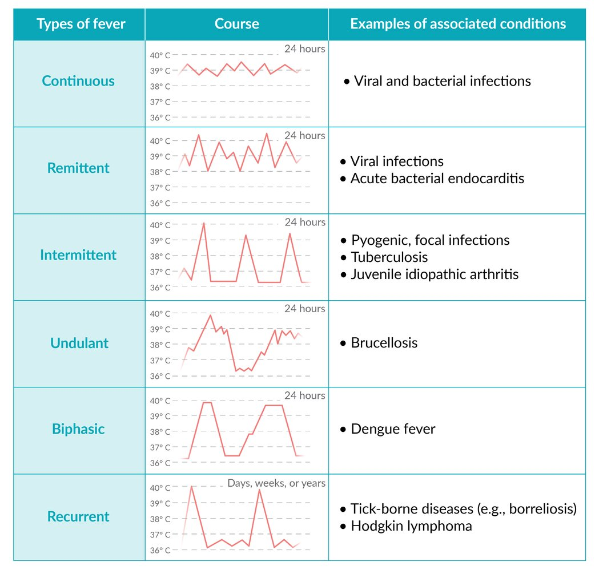

# Fever

*Categories: Clinical knowledge > Emergency medicine > Infectious diseases > Fever*

[Original Article Link](https://coursology-qbank.com/amboss/article/j50_Pg)

---

## Summary

Fever is defined as an elevation of normal body temperature, which can vary based on a number of factors (e.g., the time of day, geographical location, degree of exertion). In general, fever is defined as a temperature > 38.0°C (> 100.4°F). Fever is a nonspecific symptom that may be caused by infectious and noninfectious conditions, including malignancies, systemic rheumatic diseases, and drug reactions. History and <u>physical examination</u> alone are often sufficient to diagnose uncomplicated infectious causes of fever (e.g., <u>URI</u>, <u>gastroenteritis</u>). Laboratory tests and imaging should be guided by the <u>pretest probability</u> of the differential diagnoses. <u>Antipyretics</u> and tepid sponging may be used to decrease body temperature, but treatment of the underlying cause is the main goal when managing febrile patients. See also “<u>Neutropenic fever</u>” and “<u>Fever of unknown origin</u>.”

---

## Pathophysiology

Inflammation and/or infection → release of <u>endogenous</u> pyrogens (<u>cytokines</u>) induced by <u>exogenous</u> pyrogens (e.g, <u>proteins</u>, <u>lipopolysaccharides</u>) → <u>cytokine</u>-induced upward displacement of the set point of the <u>hypothalamic</u> <u>thermoregulatory</u> center → elevation in body temperature → ↑ immune system activity and ↓ <u>pathogen</u> growth

References:[[1]](https://coursology-qbank.com/amboss/article/U30b3f)

---

## Differential diagnoses by fever characteristics

The pattern of fever may help to determine a diagnosis, although it has limited value in comparison to more specific laboratory tests.

|  <u>Differential diagnosis of fever by course</u>   |  |  |  |
| --- | --- | --- | --- |
| Type of fever |  | Course | Associated diseases |
|  Continuous fever  |  | Temperature permanently 38.0°C (100.4°F); daily fluctuations < 1°C (< 1.8°F) | Viral and bacterial infections (e.g., <u>typhoid fever</u>, <u>lobar pneumonia</u>), <u>Kawasaki disease</u> |
| Remittent fever |  | Temperature permanently over 38.0°C (100.4°F); daily fluctuations ≥ 1°C (≥ 1.8°F) | Viral infections, <u>acute bacterial endocarditis</u> |
|  Intermittent fever [[3]](https://coursology-qbank.com/amboss/article/Fdbg7s)  |  | High spike and rapid <u>defervescence</u>   |  <u>Pyogenic</u>/focal infection, <u>TB</u>, <u>juvenile idiopathic arthritis</u>, <u>infective endocarditis</u>, <u>malaria</u>, <u>leptospira</u>, <u>borrelia</u>, <u>schistosomiasis</u>, <u>lymphoma</u>  |
|  Recurrent fever  [[4]](https://coursology-qbank.com/amboss/article/ty0XSi)  | Relapsing fever | Days of fever followed by an afebrile period of several days and then a relapse into additional days of fever, usually after 14–21 days |  Tick-borne <u>relapsing fever</u> and <u>louse</u>-borne <u>relapsing fever</u>  [[5]](https://coursology-qbank.com/amboss/article/wy0hhi)  |
| Pel-Ebstein fever | Fever lasting 1–2 weeks followed by an afebrile period of 1–2 weeks | <u>Hodgkin lymphoma</u> |  |
|  Periodical fever [[6]](https://coursology-qbank.com/amboss/article/uy0pSi)  | Fever that recurs over months or years in the absence of associated viral or bacterial infection or <u>malignancy</u>  | Periodic fever syndromes (e.g., <u>familial Mediterranean fever</u>, hyper-<u>IgD</u> syndrome) |  |
| Others |  |  <u>Still disease</u>, <u>Crohn disease</u>, <u>Behcet disease</u>, relapsing <u>malaria</u> (<u>tertian malaria</u>, <u>quartan malaria</u>), <u>drug fever</u>, <u>factitious fever</u>   |  |
| Biphasic fever |  | A fever that breaks and returns once more |  <u>Dengue fever</u> , <u>leptospirosis</u> [[7]](https://coursology-qbank.com/amboss/article/By0zhi)  |
| Undulant fever |  |  Temperature rises gradually and falls (like a wave) over days to weeks.  |  <u>Brucellosis</u> [[8]](https://coursology-qbank.com/amboss/article/Ay0R3i)[[9]](https://coursology-qbank.com/amboss/article/9g0Nx2)  |
| <u>Postoperative fever</u> |  | Has a highly variable course and many different causes; discussed in the article on <u>postoperative management</u>. |  |

Fever patterns

References:[[10]](https://coursology-qbank.com/amboss/article/3y0SUi)[[11]](https://coursology-qbank.com/amboss/article/Dy01hi)[[12]](https://coursology-qbank.com/amboss/article/Cy0qhi)[[13]](https://coursology-qbank.com/amboss/article/6bYjun)

---

## Treatment

* Antipyretics: indicated in case of intolerable fever; do not prevent <u>febrile seizures</u>

* <u>Acetaminophen</u> DOSAGE

* <u>NSAIDs</u>

* <u>Ibuprofen</u> DOSAGE

* <u>Aspirin</u> DOSAGE

* <u>Antibiotics</u> in case of suspected bacterial infection (e.g., <u>pneumonia</u>)

> [!TIP]
> <u>Acetaminophen</u> is the preferred <u>antipyretic</u> during <u>pregnancy</u> but should be avoided in patients with severe hepatic dysfunction.

> [!WARNING]
> <u>NSAIDs</u> are contraindicated in <u>pregnancy</u> and <u>hemorrhagic fevers</u>. They should be used with caution in <u>breastfeeding</u> patients and those with <u>CAD</u>.

---