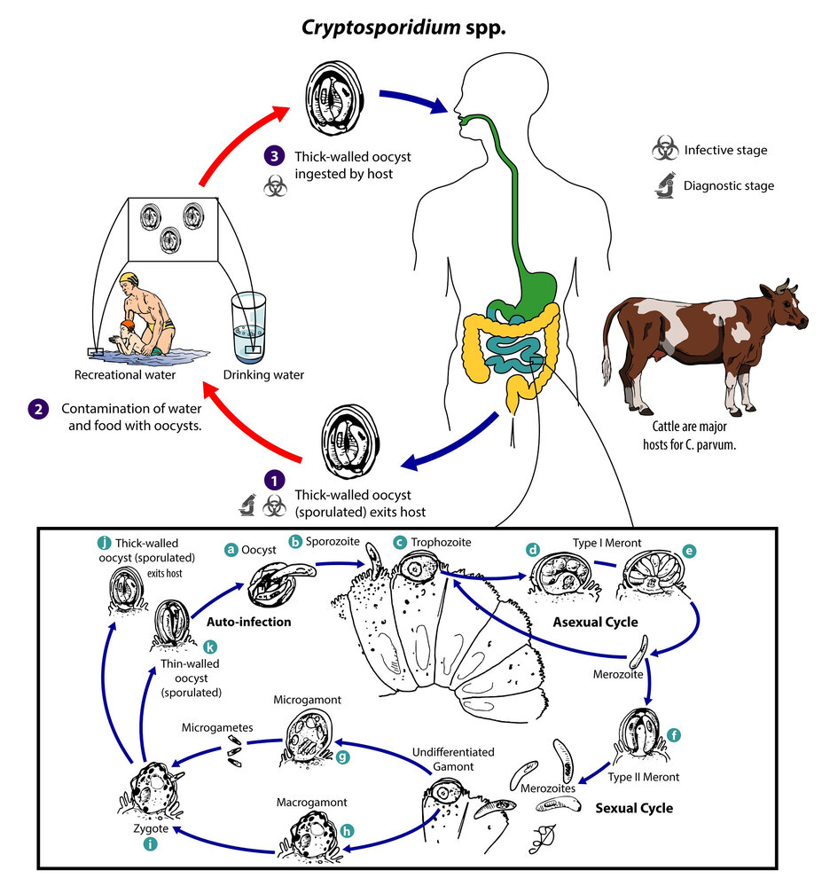
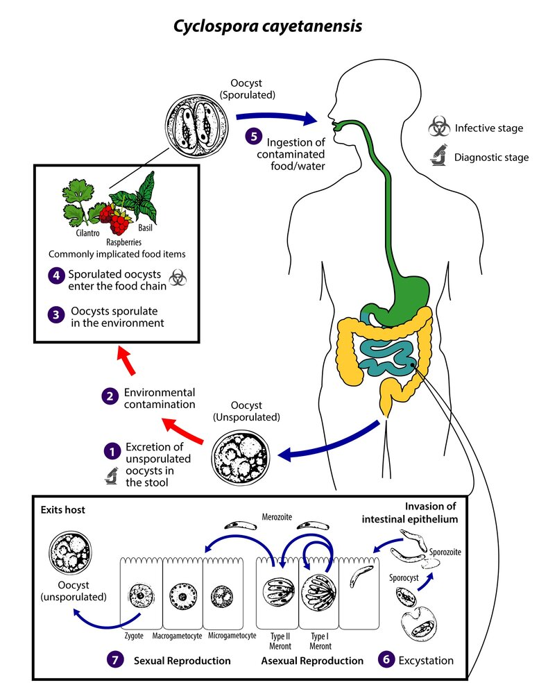

# Food poisoning

*Categories: Clinical knowledge > Emergency medicine > Infectious diseases > Food poisoning*

[Original Article Link](https://coursology-qbank.com/amboss/article/Pf0Wm2)

---

## Summary

Food poisoning is a specific subset of <u>foodborne illnesses</u> and is caused by the ingestion of any substance that is contaminated with a preformed toxin. Symptoms usually occur within hours of ingesting contaminated food and resolve over the course of 1–2 days. Common clinical features include <u>nausea</u>, <u>vomiting</u>, <u>diarrhea</u>, and abdominal cramping. Diagnostic testing is usually not required unless the symptoms are severe, prolonged, or systemic, e.g., high <u>fever</u> or <u>severe dehydration</u>. Most cases of food poisoning are <u>self-limited</u> and require only <u>supportive care</u> (e.g., oral and/or parenteral rehydration and <u>antiemetics</u>) to ensure adequate hydration. Young children, <u>immunocompromised individuals</u>, and older adults are at greater risk for developing complications related to food poisoning and may require close monitoring. <u>Seafood poisoning</u> may involve more dangerous toxins and additional treatment from <u>antihistamines</u> to <u>cardiopulmonary resuscitation</u> may be required.

For a general overview of all <u>foodborne illnesses</u>, see “<u>Overview of foodborne illnesses</u>,” for an overview of all <u>infectious gastroenteritis</u> types, see “<u>Infectious gastroenteritis</u>.”

---

## Definitions

* Food poisoning: a type of <u>foodborne illness</u> caused by the ingestion of toxins produced by bacteria in food prior to consumption [[1]](https://coursology-qbank.com/amboss/article/coWaam0)[[2]](https://coursology-qbank.com/amboss/article/MoWMcm0)[[3]](https://coursology-qbank.com/amboss/article/8sWO950)

* Toxin-producing bacteria: e.g., <u>Staphylococcus aureus</u>, <u>Clostridium perfringens</u>, <u>Bacillus cereus</u>

* Marine toxins: <u>scombroid fish poisoning</u>, <u>ciguatera fish poisoning</u>, <u>puffer fish poisoning</u> [[4]](https://coursology-qbank.com/amboss/article/cKWa2m0)

> [!WARNING]
> <u>Clostridium botulinum</u> is a rare and potentially fatal cause of food poisoning. See <u>botulism</u> for details.

---

## Overview of foodborne diseases

Foodborne illness refers to any disease following ingestion of contaminated food. Contaminants include infectious (e.g., bacteria, <u>viruses</u>) and noninfectious agents (e.g., pesticides, food additives, <u>allergens</u>, <u>mushroom poisoning</u>, <u>metal toxicity</u>). An overview of infectious <u>foodborne illnesses</u> classified according to the predominating symptoms is provided here. For details on bacterial pathogens, see the article on <u>bacterial gastroenteritis</u>. [[1]](https://coursology-qbank.com/amboss/article/coWaam0)[[2]](https://coursology-qbank.com/amboss/article/MoWMcm0)[[3]](https://coursology-qbank.com/amboss/article/8sWO950)[[5]](https://coursology-qbank.com/amboss/article/sMctJ10)

### Predominantly <u>vomiting</u>

Pathophysiology: <u>Vomiting</u> is commonly due to <u>delayed gastric emptying</u> caused by changes to gastric motility.

| Overview of pathogens predominantly causing <u>vomiting</u> |  |  |  |
| --- | --- | --- | --- |
| <u>Pathogen</u> | Foods/transmission | <u>Incubation period</u> | Treatment |
|  <u>Staphylococcus aureus</u>   |  * Canned meats, mayonnaise/potato salad, custards   |  * 1–8 hours   |  * Supportive   |
| <u>Bacillus cereus</u> |  * Reheated rice, food kept warm but not hot   |   * <u>Vomiting</u>: 30 minutes to 6 hours  * <u>Diarrhea</u>: 6–15 hours    |  * Supportive   |
|  <u>Noroviruses</u> (e.g., Norwalk <u>virus</u>)  [[6]](https://coursology-qbank.com/amboss/article/D5a1mO)  |  * Fecal-oral   |  * 12–48 hours   |  * Supportive   |

> [!NOTE]
> Symptom onset and resolution are quick in <u>S. aureus</u> and <u>B. cereus</u> <u>poisoning</u>: S. aureus and B. cereus are fast and fureus.

### Predominantly <u>diarrhea</u>

#### <u>Watery diarrhea</u> [[7]](https://coursology-qbank.com/amboss/article/eoWxam0)

* Pathophysiology: <u>enterotoxin</u> or bacterial invasion shifts water and <u>electrolyte</u> excretion/absorption in <u>proximal</u> <u>small intestine</u> → <u>watery diarrhea</u>

* Clinical features

* Mild–moderate: abdominal <u>pain</u>, <u>diarrhea</u>

* Severe

* <u>Tachycardia</u>, <u>hypotension</u>

* <u>Fever</u>

* Bloody or profuse <u>watery diarrhea</u>

* <u>Metabolic acidosis</u>

* Diagnostics: stool tests

* <u>WBC</u> negative

* No blood

| Overview of pathogens predominantly causing <u>watery diarrhea</u> |  |  |  |
| --- | --- | --- | --- |
| <u>Pathogen</u> | Foods/transmission | <u>Incubation period</u> | Treatment |
| <u>Staphylococcus aureus</u> |  * Inadequately refrigerated food   |  * 1–8 hours   |  * Supportive   |
|  <u>Clostridium perfringens</u> [[8]](https://coursology-qbank.com/amboss/article/w5ahmO)[[9]](https://coursology-qbank.com/amboss/article/2MaTLO) (Heat-labile <u>enterotoxins</u> cause the symptoms.) |   * Germination of spores in heavily contaminated food that is left standing at < 60°C for too long → vegetative bacteria  * The foods most likely to have been colonized include:  * Reheated meat dishes  * Undercooked meat and raw legumes    |  * 6–24 hours   |   * Supportive; usually resolves in 24 hours  * <u>Antibiotics</u> are not recommended.    |
|  Enterotoxic <u>Escherichia coli</u> (<u>ETEC</u>) [[10]](https://coursology-qbank.com/amboss/article/K5aUOO) (Heat-labile toxin induces <u>diarrhea</u>; most common cause of <u>traveler's diarrhea</u>) |   * Recent travel (e.g., Asia, Africa, the Middle East, Mexico, Central, or South America)  * Undercooked meat, <u>endogenous</u>  * Fecal-oral    |  * 9 h to 3 days   |   * Supportive  * <u>Fluoroquinolones</u>    |
| <u>Listeria monocytogenes</u> |  * Soft cheese, deli meats, unpasteurized milk, coleslaw, hot dogs,   |  * 1–2 days   |   * Immunocompetent patients: <u>ampicillin</u>  * <u>Immunocompromised</u> patients: <u>ampicillin</u> + <u>gentamicin</u>    |
| <u>Vibrio cholerae</u> |  * Profuse <u>secretory diarrhea</u>   |  * 0–2 days   |  * Urgent <u>fluid replacement</u>   |
|  <u>Enteric</u> <u>viruses</u> (<u>adenovirus</u>, <u>norovirus</u>, <u>rotavirus</u>)   |  * Fecal-oral   |   * <u>Adenovirus</u>: 4–5 days  * <u>Norovirus</u>: 12–48 hours  * <u>Rotavirus</u>: 1–3 days    |   * Supportive  * <u>Vaccine</u> (<u>rotavirus</u>)    |
|  Cryptosporidium [[11]](https://coursology-qbank.com/amboss/article/1Ma2nO)  |  * Fecal-oral (<u>oocysts</u> are excreted in stool and contaminate drinking water)   |  * 5–7 days   |   * Prevented by filtering water; diagnosed via <u>antigen</u> detection, <u>PCR</u>, or microscopy showing <u>oocysts</u>  * Immunocompetent individuals: <u>self-limiting</u>; <u>nitazoxanide</u> may shorten the duration  * <u>Immunocompromised individuals</u> (e.g., <u>AIDS</u>); severe; <u>antiretroviral therapy</u> to elevate the <u>CD4</u> cell count/restore the <u>immune system</u> is essential prior to eradication with antiparasitic drugs.    |
|  Cyclospora (<u>Cryptosporidium</u> <u>cyclospora</u> cayetanensis) [[12]](https://coursology-qbank.com/amboss/article/eMaxnO)[[13]](https://coursology-qbank.com/amboss/article/UMabLO)  |  * Fecal-oral   |  * 5–7 days   |   * Supportive  * <u>Trimethoprim-sulfamethoxazole</u> (<u>TMP-SMX</u>)    |
| <u>Intestinal tapeworms</u> |  * Larvae in undercooked pork/beef, raw freshwater fish   |   * 6–8 weeks  * Asymptomatic for years    |  * <u>Praziquantel</u>, niclosamide   |

Life cycle of Cryptosporidium spp.

Cryptosporidium parvum oocysts

Life cycle of Cyclospora cayetanensis

#### Invasive <u>diarrhea</u> [[14]](https://coursology-qbank.com/amboss/article/doWoam0)[[15]](https://coursology-qbank.com/amboss/article/AN1Rdh0)[[16]](https://coursology-qbank.com/amboss/article/xMYEIp)

* Pathophysiology: penetration of <u>mucosa</u> and subsequent invasion of <u>reticuloendothelial system</u> in the <u>distal</u> <u>small intestine</u> → <u>enteric fever</u>

* Diagnostics: stool tests 

* <u>WBC</u> positive (fecal mononuclear <u>leukocytes</u>)

* Blood may be present.

| Overview of pathogens predominantly causing invasive <u>diarrhea</u> |  |  |  |
| --- | --- | --- | --- |
| <u>Pathogen</u> | Foods/transmission | <u>Incubation period</u> | Treatment |
| <u>Salmonella</u> typhi or paratyphi |  * Fecal-oral   |  * Most commonly 7–14 days   |   * <u>Third-generation cephalosporins</u> (e.g., <u>ceftriaxone</u>)  * OR <u>macrolides</u> (e.g., <u>azithromycin</u>)  * OR <u>fluoroquinolones</u> (e.g., <u>ciprofloxacin</u>)    |
| <u>Yersinia</u> |   * Milk/pork  * May present as <u>pseudoappendicitis</u>    |  * 4–6 days   |  * <u>Antibiotics</u> only in severe cases: <u>TMP-SMX</u> or <u>fluoroquinolones</u> (e.g., <u>ciprofloxacin</u>)   |

#### <u>Inflammatory diarrhea</u> [[14]](https://coursology-qbank.com/amboss/article/doWoam0)[[15]](https://coursology-qbank.com/amboss/article/AN1Rdh0)[[17]](https://coursology-qbank.com/amboss/article/VoWGam0)

* Pathophysiology: damage to the <u>colonic</u> <u>mucosa</u> → blood in stool, <u>fever</u>

* Diagnostics: stool tests

* <u>WBC</u> positive (fecal <u>polymorphonuclear leukocytes</u>)

* Blood present

| Overview of pathogens predominantly causing <u>inflammatory diarrhea</u> |  |  |  |  |
| --- | --- | --- | --- | --- |
| <u>Pathogen</u> | Association | Foods/transmission | <u>Incubation period</u> | Treatment |
|  <u>Salmonella</u> (hundreds of strains, including S. enteritidis and S. typhimurium) |  * Poultry/eggs   |  * Chicken products: eggs, raw chicken   |  * 6–48 hours   |   * <u>Salmonella gastroenteritis</u>: supportive  * <u>Antibiotics</u> are not recommended.    |
|  <u>Campylobacter jejuni</u>  |  * Most common bacterial organism <u>pathogen</u> responsible for foodborne <u>gastroenteritis</u> in the US   |   * Poultry  * Fecal-oral    |  * Days   |   * Supportive treatment with fluids and <u>electrolytes</u>  * <u>Erythromycin</u> or <u>azithromycin</u> in severe cases  * Resistance to <u>penicillin</u>, <u>ciprofloxacin</u>, <u>fluoroquinolones</u>    |
| <u>Shigella dysenteriae</u> |  * Second most common association with <u>hemolytic</u>-uremic syndrome (<u>HUS</u>)   |  * Fecal-oral   |  * Days   |   * <u>Fluoroquinolones</u>, <u>azithromycin</u>, <u>TMP-SMX</u>  * Do not use <u>ampicillin</u>, as some <u>Shigella</u> strains may be resistant.    |
| <u>Yersinia enterocolitica</u> |  * More common in children and during the winter season   |  * Contaminated milk, pork   |  * Days   |   * Supportive  * <u>Fluoroquinolones</u>, <u>TMP-SMX</u>, <u>third-generation cephalosporins</u> in severe cases    |
|  Vibrio (usually parahaemolyticus)  [[18]](https://coursology-qbank.com/amboss/article/0MaeMO)[[19]](https://coursology-qbank.com/amboss/article/dMaonO)  |  * Shellfish   |  * Raw/undercooked seafood   |  * 16–72 hours   |   * Supportive  * <u>Doxycycline</u>, <u>fluoroquinolones</u> in severe cases    |
|  Enterohemorrhagic <u>Escherichia coli</u> (<u>EHEC</u>) [[10]](https://coursology-qbank.com/amboss/article/K5aUOO)   |  * <u>Hemolytic</u>-uremic syndrome (<u>HUS</u>)   |   * Undercooked meat  * Untreated water; contaminated food, such as unpasteurized dairy products (milk, soft cheese) or apple cider  * Fecal-oral    |  * 3–4 days   |   * Supportive  * <u>Antibiotics</u> are contraindicated because they increase the risk of <u>HUS</u>.    |

### Additional nongastrointestinal symptoms

|  |  |  |  |  |
| --- | --- | --- | --- | --- |
| Pathogens | Predominating symptoms | Foods/Transmission | <u>Incubation period</u> | Treatment |
| <u>Clostridium botulinum</u> |  * Descending <u>paralysis</u>   |   * Adult <u>botulism</u>: inadequately canned foods (toxins)  * <u>Wound botulism</u>: <u>contaminated wounds</u>  * <u>Infant botulism</u>: contaminated soil, raw honey (spores)    |   * Adult <u>botulism</u>: 12–36 hours  * <u>Wound botulism</u>: 10 days (range: 4–14 days)  * <u>Infant botulism</u>: 2–4 weeks    |   * Adults: <u>respiratory support</u>, <u>antitoxin</u>  * <u>Infants</u>: <u>respiratory support</u>, hyperimmune human serum  * <u>Antibiotics</u> may worsen or prolong disease    |
| <u>Histamine fish poisoning</u> |  * Flushing, <u>urticaria</u>   |  * Inadequately refrigerated fish   |  * 5 minutes to 1 hour   |   * Supportive  * <u>Antihistamines</u>    |
|  <u>Brucellosis</u> (<u>Brucella</u> spp.) [[20]](https://coursology-qbank.com/amboss/article/v5aANO)  |   * Cyclical <u>fever</u>  * <u>Arthralgias</u>    |   * Unpasteurized dairy products  * Contact with animals (e.g., hunter)    |  * 2–4 weeks (range: 5 days to 5 months)   |   * <u>Doxycycline</u>  * PLUS one of the following: [[21]](https://coursology-qbank.com/amboss/article/D_W1qL0)[[22]](https://coursology-qbank.com/amboss/article/UZdbao0)  * <u>Aminoglycoside</u> (<u>streptomycin</u> OR <u>gentamicin</u>)  * OR <u>rifampin</u>    |
|  <u>Hepatitis A</u> (<u>Hepatitis A virus</u>) [[23]](https://coursology-qbank.com/amboss/article/G5aBlO)  |  * <u>Jaundice</u>, commonly following initial GI symptoms   |  * Fecal-oral   |  * 28 days (range 14–50 days)   |   * Supportive (generally <u>self-limiting</u>)  * Immune serum globulin  * <u>Vaccine</u>    |
|  <u>Vibrio vulnificus</u> [[24]](https://coursology-qbank.com/amboss/article/t5aXNO)[[25]](https://coursology-qbank.com/amboss/article/85aONO)  |   * <u>Sepsis</u> (especially in <u>immunocompromised individuals</u>)  * <u>Cellulitis</u> (from wound infections)  * <u>Self-limiting</u> <u>gastroenteritis</u>    |   * Oysters, undercooked seafood  * Contact with contaminated water or shellfish (wound infections)    |  * 1–7 days   |  * <u>Doxycycline</u> PLUS third-generation <u>cephalosporins</u>   |
| <u>Salmonella</u> typhi and paratyphi |  * <u>Typhoid fever</u> or <u>paratyphoid fever</u> (<u>endemic</u> in developing countries)   |  * Fecal-oral   |  * Most commonly 7–14 days   |  * <u>Third-generation cephalosporins</u> (e.g., <u>ceftriaxone</u>) OR <u>macrolides</u> (e.g., <u>azithromycin</u>) OR <u>fluoroquinolones</u> (e.g., <u>ciprofloxacin</u>)   |
| <u>Ciguatoxin</u> |   * <u>Hypotension</u>, <u>heart block</u>, <u>bradycardia</u>  * <u>Diarrhea</u>, <u>nausea</u>, <u>vomiting</u>  * Numbness of mouth, <u>lips</u>, extremities    |  * Reef fish containing Gambierdiscus toxicus   |  * 6–24 hours   |  * Supportive   |

> [!NOTE]
> Common sources of fecal-oral transmission in intestinal diseases are the 5 F's: fingers, feces, food, fluids, flies.

---

## Staphylococcal food poisoning

<u>Staphylococcal food poisoning</u> is one of the most common confirmed source of <u>foodborne illness</u>.  [[26]](https://coursology-qbank.com/amboss/article/PKWWgm0)[[27]](https://coursology-qbank.com/amboss/article/-7WDo50)

* <u>Pathogen</u>: <u>Staphylococcus aureus</u>

* Gram-positive bacterium

* Some strains produce heat-stable staphylococcal enterotoxins that cause food poisoning and, in severe cases, <u>toxic shock syndrome</u>. [[1]](https://coursology-qbank.com/amboss/article/coWaam0)

* Transmission

* Ingestion of preformed toxins in contaminated food

* Bacteria proliferate in inadequately refrigerated food (meat, mayonnaise, potato salad, custards).

* While <u>Staphylococcus aureus</u> is destroyed by cooking, the <u>heat-stable enterotoxins</u> are not.

* Onset after ingestion: typically has a short <u>latency period</u> of 1–6 hours  [[27]](https://coursology-qbank.com/amboss/article/-7WDo50)

* Duration: 24–48 hours [[7]](https://coursology-qbank.com/amboss/article/eoWxam0)

* Clinical features

* Severe <u>vomiting</u> (often with sudden onset)

* Abdominal cramping

* <u>Diarrhea</u>

* Treatment [[7]](https://coursology-qbank.com/amboss/article/eoWxam0)[[15]](https://coursology-qbank.com/amboss/article/AN1Rdh0)[[27]](https://coursology-qbank.com/amboss/article/-7WDo50)

* Supportive: Follow <u>management of food poisoning</u>.

* <u>Antibiotics</u> are not indicated in uncomplicated illness.

---

## Bacillus cereus infection

<u>Bacillus cereus</u> can produce two different <u>enterotoxins</u> which cause two distinct food poisoning syndromes. [[1]](https://coursology-qbank.com/amboss/article/coWaam0)[[7]](https://coursology-qbank.com/amboss/article/eoWxam0)

* <u>Pathogen</u>: Bacillus cereus, a heat-stable, <u>spore-forming</u>   gram-positive rod

* Transmission: ingestion of bacteria growing in heated food that is improperly refrigerated

* Emetic form [[30]](https://coursology-qbank.com/amboss/article/ZHWZK50)

* A <u>heat-stable toxin</u> (<u>cereulide</u>) is produced by bacteria in food and survives cooking.

* Commonly associated with reheated rice: Spores survive the cooking process, germinate in warm rice, and produce more <u>enterotoxin</u>.

* Onset after ingestion: 1–3 hours

* Duration: 6–24 hours

* Clinical features: <u>Nausea and vomiting</u> predominate.

* <u>Diarrheal</u> form

* A thermolabile toxin is produced by organisms during the growth phase in the intestine.

* Associated with a broad range of food, e.g., meat, vegetables, milk products

* Onset after ingestion: 8–16 hours

* Duration: 12–24 hours

* Clinical features: abdominal <u>pain</u>, <u>diarrhea</u>, <u>nausea</u>

* Treatment: both forms [[5]](https://coursology-qbank.com/amboss/article/sMctJ10)[[15]](https://coursology-qbank.com/amboss/article/AN1Rdh0)

* Supportive: Follow <u>management of food poisoning</u>.

* <u>Antibiotics</u> are not effective against toxins.

> [!NOTE]
> <u>Poisoning</u> from reheated rice can be serious (<u>B. cereus</u>).

---

## Seafood poisoning

### Histamine fish poisoning (<u>scombroid poisoning</u>) [[2]](https://coursology-qbank.com/amboss/article/MoWMcm0)[[15]](https://coursology-qbank.com/amboss/article/AN1Rdh0)[[31]](https://coursology-qbank.com/amboss/article/vNWA1N0)

* Transmission: ingestion of contaminated, inadequately refrigerated dark-meat fish, e.g., mackerel, bonito, mahi-mahi, and tuna

* Mechanism of action: <u>Histidine</u> (found in high concentrations in these fish) is converted into <u>histamine</u> by <u>histidine decarboxylase</u> in the bacteria that normally colonize the fish.

* Onset after ingestion: 20–30 minutes

* Duration: 6–8 hours (<u>malaise</u> may last longer)

* Clinical features: usually mild and <u>self-limited</u>

* <u>Erythema</u>, <u>facial flushing</u>, itching, <u>urticaria</u>

* Burning sensation in the mouth

* <u>Diarrhea</u>, abdominal cramping, <u>vomiting</u>

* Severe <u>headache</u>

* <u>Palpitations</u>

* Severe reactions (similar to <u>anaphylaxis</u>) are rare but can include:

* <u>Angioedema</u>

* <u>Hypotension</u>

* <u>Bronchospasm</u> and/or <u>respiratory distress</u>

* Diagnosis: usually a <u>clinical diagnosis</u>

* Treatment [[2]](https://coursology-qbank.com/amboss/article/MoWMcm0)[[15]](https://coursology-qbank.com/amboss/article/AN1Rdh0)[[31]](https://coursology-qbank.com/amboss/article/vNWA1N0)

* All patients: Follow <u>management of food poisoning</u> for supportive treatment.

* Mild symptoms: <u>antihistamines</u>, e.g., <u>diphenhydramine</u> DOSAGE (<u>off-label</u>) [[15]](https://coursology-qbank.com/amboss/article/AN1Rdh0)[[31]](https://coursology-qbank.com/amboss/article/vNWA1N0)

* Severe symptoms: <u>epinephrine</u>, <u>bronchodilators</u>, <u>IV fluid resuscitation</u> [[2]](https://coursology-qbank.com/amboss/article/MoWMcm0)[[31]](https://coursology-qbank.com/amboss/article/vNWA1N0)

> [!TIP]
> <u>Scombroid poisoning</u> is often confused with fish <u>allergy</u>; offer patient education on <u>histamine fish poisoning</u> and/or <u>skin</u> testing after symptoms have resolved. [[31]](https://coursology-qbank.com/amboss/article/vNWA1N0)

> [!WARNING]
> Individuals taking <u>isoniazid</u> or <u>monoamine oxidase inhibitors</u> are at increased risk for <u>histamine fish poisoning</u> because these drugs impair <u>histamine</u> metabolism. [[31]](https://coursology-qbank.com/amboss/article/vNWA1N0)

### Reef fish poisoning (<u>ciguatera fish poisoning</u>) [[2]](https://coursology-qbank.com/amboss/article/MoWMcm0)[[15]](https://coursology-qbank.com/amboss/article/AN1Rdh0)[[32]](https://coursology-qbank.com/amboss/article/-NWDdN0)

* Transmission: ingestion of reef fish containing ciguatoxins produced by Gambierdiscus toxicus  ;  [[33]](https://coursology-qbank.com/amboss/article/_NW5dN0)

* Most common in large predatory fish: barracuda, moray eel, snapper, sea bass, amberjack

* Over 400 species of fish can carry <u>ciguatoxin</u>.

* Mechanism of action: ingestion of <u>ciguatoxin</u> → opening of Na+ channels → <u>depolarization</u>

* Onset after ingestion: 4–6 hours (delay of up to 24 hours not uncommon)

* Duration

* Gastrointestinal symptoms: 2–5 days

* Neurologic symptoms: 1–2 weeks (residual symptoms may persist for months)

* Clinical features [[34]](https://coursology-qbank.com/amboss/article/1nW2HN0)[[35]](https://coursology-qbank.com/amboss/article/tKWXRm0)

* Gastrointestinal: <u>diarrhea</u>, <u>nausea</u>, <u>vomiting</u>, abdominal cramping (initial symptoms)

* Cardiovascular: <u>hypotension</u>, <u>heart block</u>, <u>bradycardia</u> (early onset)

* Neurologic (delayed for 1–2 days)

* Cold <u>allodynia</u>: contact with cold objects causes <u>dysesthesia</u>; <u>pathognomonic</u> for <u>reef fish poisoning</u>

* <u>Dysesthesia</u> and <u>paresthesia</u> of mouth, <u>lips</u>, throat

* <u>Paresthesias</u> resembling <u>peripheral neuropathy</u>

* <u>Ataxia</u>, <u>vertigo</u>, <u>hallucinations</u>, <u>coma</u>

* Diagnosis: <u>clinical diagnosis</u>

* Treatment [[2]](https://coursology-qbank.com/amboss/article/MoWMcm0)[[15]](https://coursology-qbank.com/amboss/article/AN1Rdh0)[[32]](https://coursology-qbank.com/amboss/article/-NWDdN0)

* Supportive treatment: Follow <u>management of food poisoning</u>.

* Patients with severe symptoms: Consider calling the local Poison Control Center for specialist treatments (e.g., IV <u>mannitol</u>).

* <u>Bradycardia</u> and/or <u>hypotension</u>: Follow the “<u>Adult unstable bradycardia algorithm</u>.” [[15]](https://coursology-qbank.com/amboss/article/AN1Rdh0)[[32]](https://coursology-qbank.com/amboss/article/-NWDdN0)

* <u>Dysesthesias</u> and/or <u>pruritus</u>: Consider <u>antihistamine</u>, e.g., <u>diphenhydramine</u> DOSAGE (<u>off-label</u>), or <u>amitriptyline</u> DOSAGE (<u>off-label</u>). [[15]](https://coursology-qbank.com/amboss/article/AN1Rdh0)[[32]](https://coursology-qbank.com/amboss/article/-NWDdN0)

> [!TIP]
> Recommend avoidance of <u>alcohol</u> and nuts for 3–6 months after <u>poisoning</u> as they may exacerbate residual symptoms. [[2]](https://coursology-qbank.com/amboss/article/MoWMcm0)

### Puffer fish poisoning [[2]](https://coursology-qbank.com/amboss/article/MoWMcm0)[[36]](https://coursology-qbank.com/amboss/article/TmW6UN0)

* Transmission: ingestion of puffer fish containing  tetrodotoxin produced by bacteria inhabiting the animal's gut [[37]](https://coursology-qbank.com/amboss/article/DsW1C50)

* Mechanism of action: <u>Tetrodotoxin</u> is a <u>neurotoxin</u> that blocks <u>voltage-gated sodium channels</u>, which inhibits <u>action potential</u> propagation.

* Onset: 5–45 minutes

* Duration: days

* Clinical features: dose-dependent

* Neurological

* <u>Paresthesias</u> (usually the first reported symptom)

* <u>Muscle weakness</u>, <u>paralysis</u>, loss of reflexes

* <u>CNS depression</u>, <u>coma</u>

* Gastrointestinal: <u>nausea</u>, <u>diarrhea</u>

* Cardiopulmonary

* <u>Respiratory failure</u>, <u>cyanosis</u>

* <u>Hypotension</u>, <u>bradycardia</u>, <u>heart failure</u>

* Diagnosis: <u>clinical diagnosis</u>

* Treatment [[2]](https://coursology-qbank.com/amboss/article/MoWMcm0)[[36]](https://coursology-qbank.com/amboss/article/TmW6UN0)[[38]](https://coursology-qbank.com/amboss/article/ZGWZB50)

* Initiate <u>supportive care</u> as soon as possible: <u>Death</u> may occur within minutes.

* <u>Respiratory distress</u>: early <u>intubation</u> and <u>mechanical ventilation</u>

* <u>Hemodynamic instability</u>: <u>IV fluid resuscitation</u> and <u>inoconstrictors</u>

* Consider calling the local Poison Control Center for specialist treatments (e.g., <u>gastrointestinal decontamination</u>, <u>hemodialysis</u>).

> [!TIP]
> No <u>antidote</u> exists for <u>tetrodotoxin</u>, but recovery is likely if the patient survives the first 24 hours. [[38]](https://coursology-qbank.com/amboss/article/ZGWZB50)

---