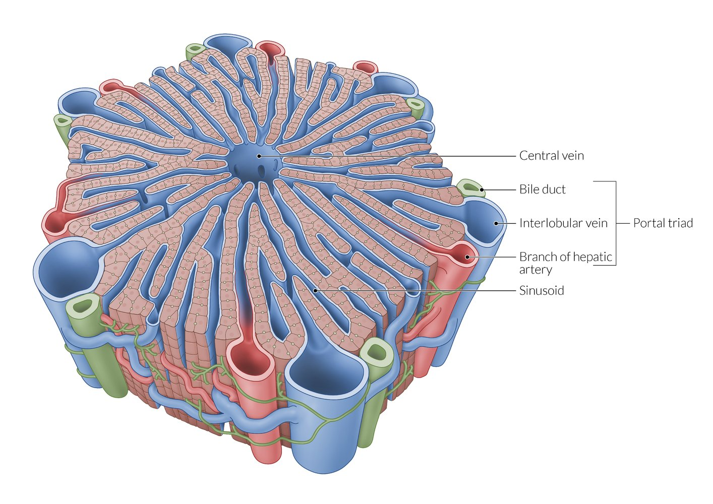
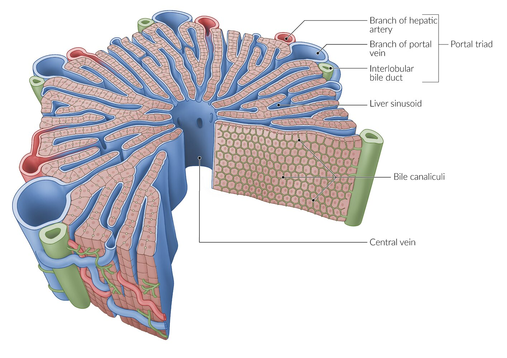
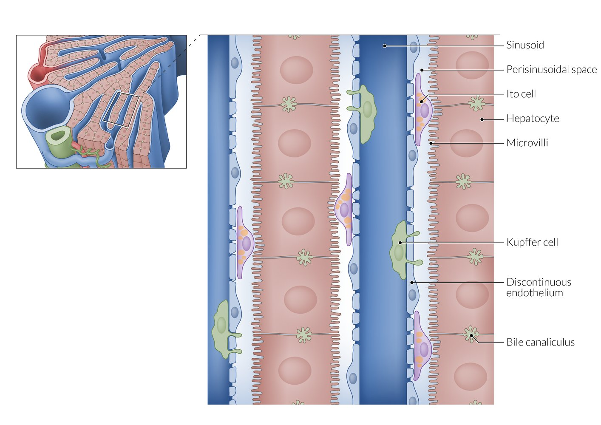
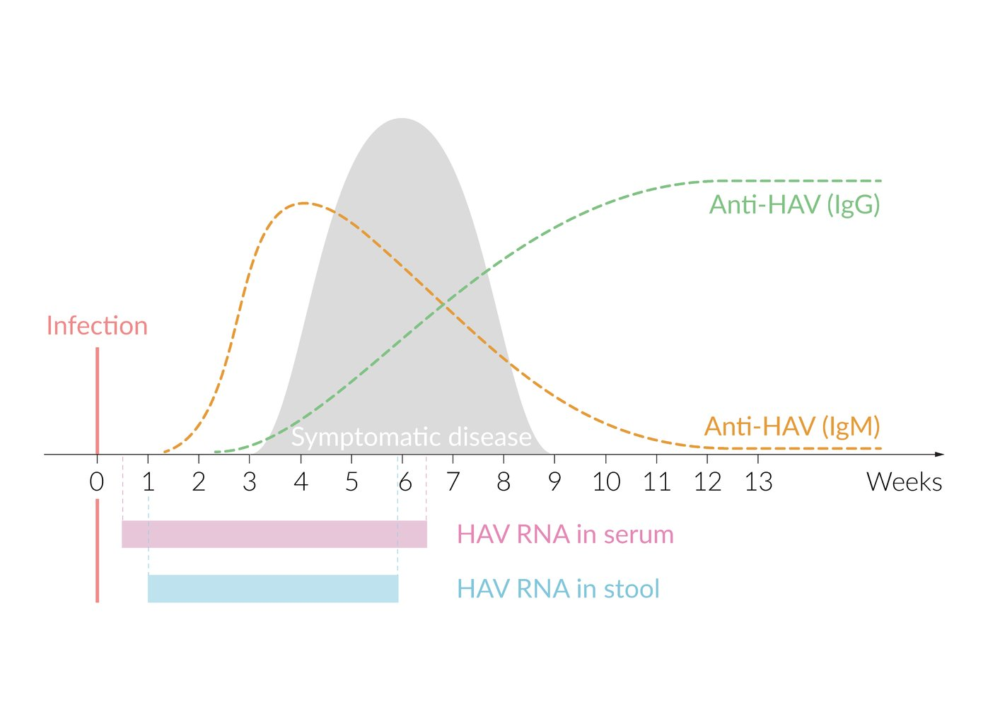

# Hepatitis A

*Categories: Clinical knowledge > Emergency medicine > Infectious diseases > Hepatitis A*

[Original Article Link](https://coursology-qbank.com/amboss/article/kS0m-2)

---

## Summary

<u>Hepatitis</u> A is a viral disease caused by the hepatotropic <u>hepatitis A virus</u> (<u>HAV</u>) and usually spreads through <u>fecal-oral transmission</u>. About half of all patients with <u>hepatitis</u> A in the US acquire the <u>HAV</u> during visits to countries in which <u>HAV</u> is <u>endemic</u> (tropical or subtropical regions). <u>HAV</u> infection can cause <u>acute viral hepatitis</u>, which initially manifests with <u>prodromal</u> symptoms (<u>fever</u> and <u>malaise</u>), followed by <u>jaundice</u>. The laboratory findings in <u>hepatitis</u> A are similar to those observed in other forms of <u>acute viral hepatitis</u> and include high serum <u>transaminase</u> levels and <u>mixed hyperbilirubinemia</u>. Serological detection of <u>anti-HAV IgM</u> <u>antibodies</u> confirms the diagnosis of <u>hepatitis</u> A. While <u>prodromal</u> symptoms typically resolve within a few weeks, <u>jaundice</u> may persist for 1–3 months. <u>Hepatitis</u> A is typically <u>self-limited</u> with no chronic sequelae, and <u>acute liver failure</u> rarely occurs; therefore, only <u>supportive care</u> is typically required. In the US, <u>routine immunization</u> against <u>HAV</u> is recommended for all children > 12 months of age. Individuals at increased risk of infection, such as travelers to areas in which <u>HAV</u> is <u>endemic</u>, as well as individuals at increased risk of severe disease, such as those with <u>chronic liver disease</u>, should also be immunized against <u>HAV</u> if they have not been previously vaccinated. The <u>hepatitis</u> A <u>immunization</u> series generally provides long-term <u>immunity</u>, without the need for booster doses.

Viral Hepatitis: Comparing Hepatitis A, B, C, D, and E

---

## Epidemiology

* <u>Incidence</u> (in the US): ∼ 2,000 cases per year (50% acquired during travels abroad) [[1]](https://coursology-qbank.com/amboss/article/KfaUMP)

* <u>Hepatitis</u> A <u>virus</u> is the second most common cause of acute <u>hepatitis</u> in the US.

* <u>Hepatitis</u> A is very common in tropical and subtropical regions.

* Age: <u>Vaccination</u> programs have made the disease fairly rare in children; infection is now more widespread in adults. [[2]](https://coursology-qbank.com/amboss/article/p30Ljf)

Epidemiological data refers to the US, unless otherwise specified.

---

## Etiology

* <u>Pathogen</u>: <u>hepatitis</u> A <u>virus</u> [[2]](https://coursology-qbank.com/amboss/article/p30Ljf)

* Belongs to the family of <u>Picornaviridae</u> and the genus <u>Hepatovirus</u>

* Small (27 nm in diameter), non-enveloped <u>virus</u> with single-stranded, <u>positive-sense</u> <u>RNA</u>

* Resistant to <u>denaturation</u> by <u>gastric acid</u>, heat, and chemicals, and can remain viable for months in fresh and saltwater

* Humans are the only reservoir for the <u>hepatitis</u> A <u>virus</u>. [[3]](https://coursology-qbank.com/amboss/article/vfaALP)

* Route of transmission: fecal-oral ;  [[4]](https://coursology-qbank.com/amboss/article/U30b3f)

* Contaminated water and food (e.g., raw shellfish)

* Risk groups: international travelers, <u>nursing home</u> residents, prison inmates, <u>men who have sex with men</u>, IV drug users.

* <u>Infectious period</u>: 2 weeks before to 1 week after the onset of the illness [[3]](https://coursology-qbank.com/amboss/article/vfaALP)

> [!NOTE]
> When it comes to viral <u>hepatitis</u>, vowels (A and E) are bowels (transmitted feco-orally).

---

## Pathophysiology

<u>HAV</u> is not cytopathic in itself; research suggests that <u>liver</u> damage is caused by <u>cellular immunity</u> (especially <u>CD8+ T cells</u>). [[2]](https://coursology-qbank.com/amboss/article/p30Ljf)

Hepatic microstructure: hepatic lobule

Hepatic microstructure: hepatic lobule showing bile canaliculi

Hepatic microstructure: sinusoids, perisinusoidal space, and hepatocytes

---

## Clinical features

<u>HAV</u> infection in children is typically asymptomatic. The risk of symptomatic disease increases with age and <u>coinfection</u> (e.g., with <u>hepatitis B</u>).

* <u>Incubation period</u>: : 2–6 weeks

* Phases of <u>acute viral hepatitis</u> [[2]](https://coursology-qbank.com/amboss/article/p30Ljf)[[4]](https://coursology-qbank.com/amboss/article/U30b3f)
1. * <u>Prodromal</u> phase: 1–2 weeks

* <u>Right upper quadrant</u> <u>pain</u>, tender <u>hepatomegaly</u>

* <u>Fever</u>, <u>malaise</u>

* <u>Anorexia</u>, <u>nausea</u>, <u>vomiting</u>
2. * Icteric phase: ∼ 2 weeks 

* <u>Jaundice</u>

* Dark urine and pale stools

* <u>Pruritus</u>
3. * Resolution of symptoms

* Potential complications: <u>cholestasis</u>, relapsing <u>HAV</u> infection, and <u>autoimmune hepatitis</u>

* Prognosis [[1]](https://coursology-qbank.com/amboss/article/KfaUMP)

* The <u>mortality rate</u> is 0.1–0.3% because few patients progress to <u>acute liver failure</u>.

* Individuals affected with <u>hepatitis</u> A (unlike with <u>hepatitis B</u> and <u>hepatitis C</u>) do not become carriers nor do they develop chronic <u>hepatitis</u>.

> [!NOTE]
> When it comes to viral <u>hepatitis</u>, vowels (A and E) cause only AcutE <u>hepatitis</u> while Consonants (B, C, and D) may have Chronic sequelae as well.

---

## Diagnosis

### Laboratory testing [[5]](https://coursology-qbank.com/amboss/article/eMbxn8)[[6]](https://coursology-qbank.com/amboss/article/vpXAr_)[[7]](https://coursology-qbank.com/amboss/article/TJX6t_)

* Routine studies 

* ↑ Serum <u>transaminase</u> levels (<u>AST</u>, <u>ALT</u>)

* <u>AST/ALT ratio</u> is usually < 1  [[8]](https://coursology-qbank.com/amboss/article/erXxTz)

* ↑ Total <u>bilirubin</u> and urine <u>bilirubin</u>  [[9]](https://coursology-qbank.com/amboss/article/UrXbgz)

* ↑ <u>ALP</u>, ↑ <u>GGT</u>

* <u>Confirmatory testing</u>

* ↑ Anti-HAV IgM antibodies: present in patients with active infection 

* Usually detectable 5–10 days after exposure and 5–10 days before clinical symptoms develop

* Levels peak commonly ∼ 1 month after infection.

* May persist for up to 6 months after infection

* ↑ Anti-HAV IgG antibodies

* Develop during active infection and persist indefinitely after infection or <u>vaccination</u>

* Production begins within 2–3 weeks of infection.

* <u>HAV</u> <u>RNA</u> can be detected in stool and serum samples using <u>PCR</u>.

> [!TIP]
> The presence of <u>anti-HAV IgM antibodies</u> or <u>HAV</u> <u>RNA</u> confirms active <u>hepatitis</u> A. Detection of <u>anti-HAV IgG antibodies</u> in the absence of <u>anti-HAV IgM antibodies</u> indicates <u>immunity</u> against <u>HAV</u> due to prior infection or <u>vaccination</u>. [[6]](https://coursology-qbank.com/amboss/article/vpXAr_)

Serology of hepatitis A virus (HAV) infection

### Further testing

Further diagnostic testing is not routinely necessary but may be used to rule out differential diagnoses or in <u>fulminant hepatitis</u>. If performed, additional tests may show the following findings if <u>acute viral hepatitis</u> is present:

* <u>Liver biopsy</u>: not routinely indicated [[10]](https://coursology-qbank.com/amboss/article/2rXTgz)

* Periportal inflammation (<u>mononuclear cell</u> infiltration) [[11]](https://coursology-qbank.com/amboss/article/X7X94z)

* <u>Hepatocyte</u> swelling

* Ballooning degeneration

* <u>Bridging necrosis</u>

* <u>Councilman bodies</u> (<u>apoptotic</u> <u>hepatocytes</u>) [[12]](https://coursology-qbank.com/amboss/article/IrXYiz)

* <u>Ultrasound</u> [[13]](https://coursology-qbank.com/amboss/article/8TaOsP)

* Increased brightness of <u>portal vein</u> radicle walls

* <u>Decreased echogenicity</u> of the <u>liver</u>

---

## Differential diagnoses

For an overview comparing the different types of viral <u>hepatitis</u> see “<u>Overview of viral hepatitides</u>.”

The differential diagnoses listed here are not exhaustive.

---

## Treatment

* <u>Hepatitis</u> A is generally <u>self-limited</u>.

* Offer <u>supportive care</u>. [[5]](https://coursology-qbank.com/amboss/article/eMbxn8)

* Recommend rest as needed.

* Consider symptomatic treatment, e.g., <u>antiemetics</u>.

* Inability to maintain hydration with oral fluids can be an indication for <u>parenteral fluid therapy</u> and hospitalization.

* Recommend <u>alcohol</u> avoidance.

* Use medications that are metabolized by the <u>liver</u> with caution (e.g., <u>acetaminophen</u>).

* More intensive treatment may be required in rare cases in which <u>hepatitis</u> A leads to <u>acute liver failure</u>.

---

## Prevention

### Hepatitis A preexposure prophylaxis [[6]](https://coursology-qbank.com/amboss/article/vpXAr_)[[7]](https://coursology-qbank.com/amboss/article/TJX6t_)

* Advise all travelers to follow primary preventive measures such as <u>food and water safety</u>.

#### Hepatitis A vaccine

See “<u>ACIP immunization schedule</u>” for scheduling details.

* Recommend routine <u>active immunization</u> for: 

* All children > 12 months of age

* Individuals at increased risk of HAV infection, including those who:

* Are traveling to a country in which <u>HAV</u> is <u>endemic</u>

* Expect to be in close contact with an adoptee from a country in which <u>HAV</u> is <u>endemic</u>

* Have a potential <u>occupational exposure</u> to <u>HAV</u>

* Are <u>men who have sex with men</u>

* Use injection or noninjection drugs

* Have unstable housing

* Individuals at increased risk of severe disease

* Individuals with <u>chronic liver disease</u>

* Adults and children > 12 months of age with <u>HIV</u>

* Any individual requesting to be vaccinated

* Consider <u>active immunization</u> for:

* Individuals in settings with people at increased risk of infection (e.g., homeless shelters, <u>needle exchange programs</u>, group homes)

* Individuals at <u>increased risk of HAV infection</u>, including currently or recently incarcerated individuals, during <u>outbreaks</u>

* Two single-<u>antigen</u> inactivated <u>hepatitis</u> A <u>vaccines</u> and one combination <u>hepatitis</u> A and <u>hepatitis B</u> <u>inactivated vaccine</u> are available in the US.

> [!TIP]
> <u>Hepatitis A vaccination</u> is considered suitable for use during <u>pregnancy</u> in previously unvaccinated individuals with an increased risk of infection or severe disease. [[6]](https://coursology-qbank.com/amboss/article/vpXAr_)

### Hepatitis A postexposure prophylaxis [[6]](https://coursology-qbank.com/amboss/article/vpXAr_)

<u>Postexposure prophylaxis</u> is indicated for all previously unvaccinated individuals who have been in contact with an individual with serologically confirmed <u>hepatitis</u> A within the past two weeks. <u>Hepatitis</u> A is a <u>notifiable disease</u>.

| Recommended regimens for <u>hepatitis</u> A <u>postexposure prophylaxis</u> |  |
| --- | --- |
| Type of <u>postexposure prophylaxis</u> | Indications |
| <u>Active immunization</u> |  * Healthy individuals who are 1–40 years of age   |
|  <u>Passive immunization</u> with <u>immune globulin</u> DOSAGE  |   * Individuals with <u>contraindications for vaccination</u>  * <u>Infants</u> < 12 months of age  [[6]](https://coursology-qbank.com/amboss/article/vpXAr_)    |
| Both active and <u>passive immunization</u> |   * Individuals with <u>chronic liver disease</u>  * <u>Immunocompromised individuals</u>  * Consider in adults:  * > 40 years of age  * With increased risk of infection (see “<u>Hepatitis A preexposure prophylaxis</u>”)    |

---