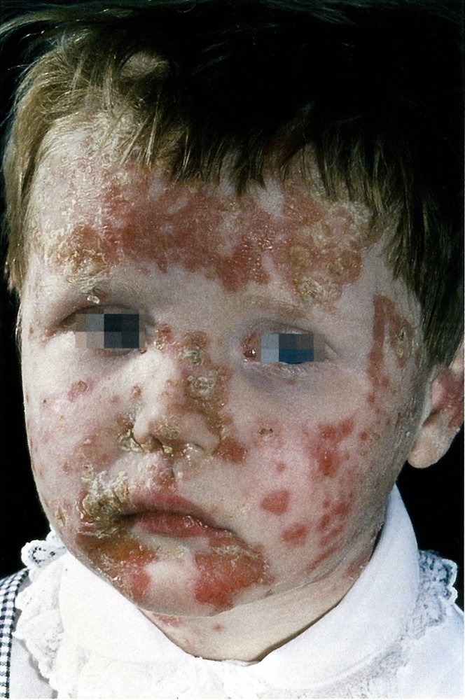
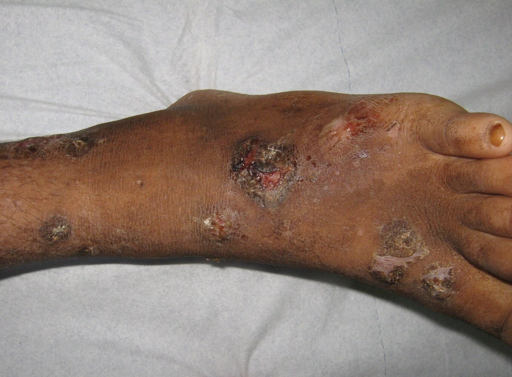
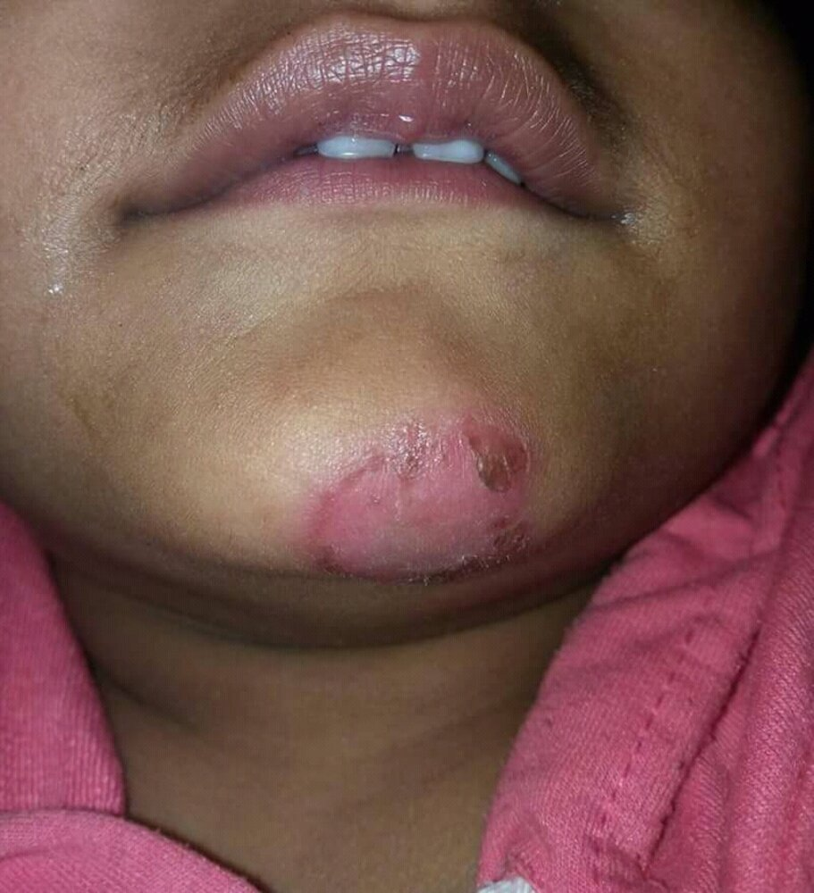
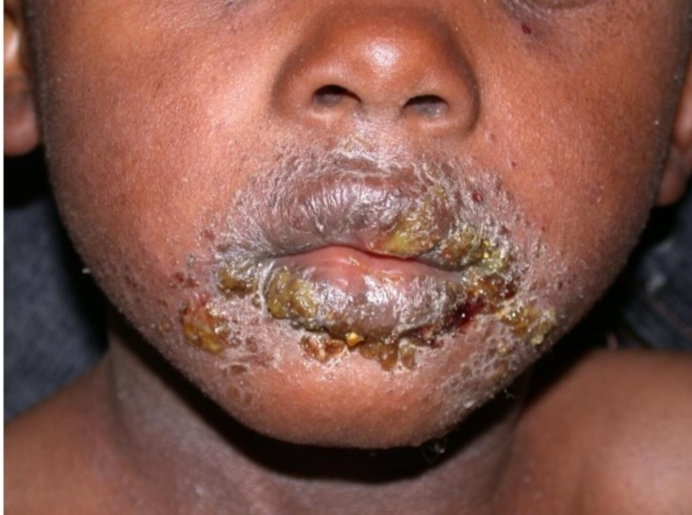
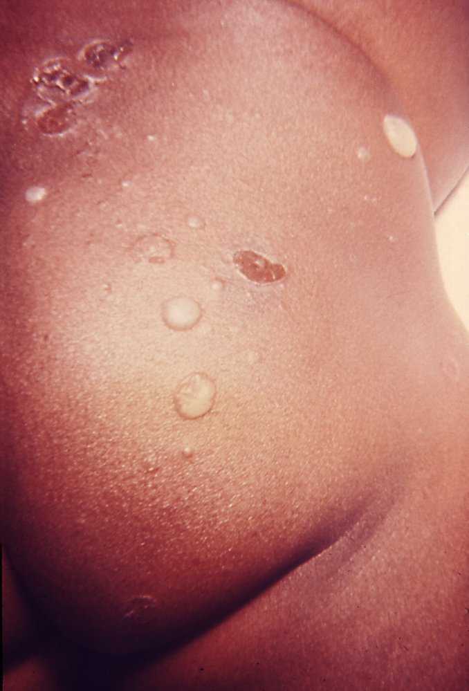
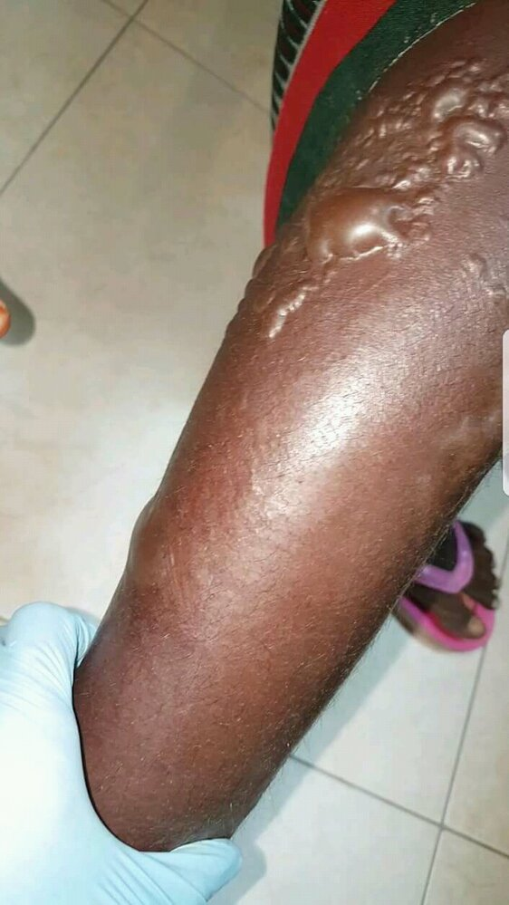
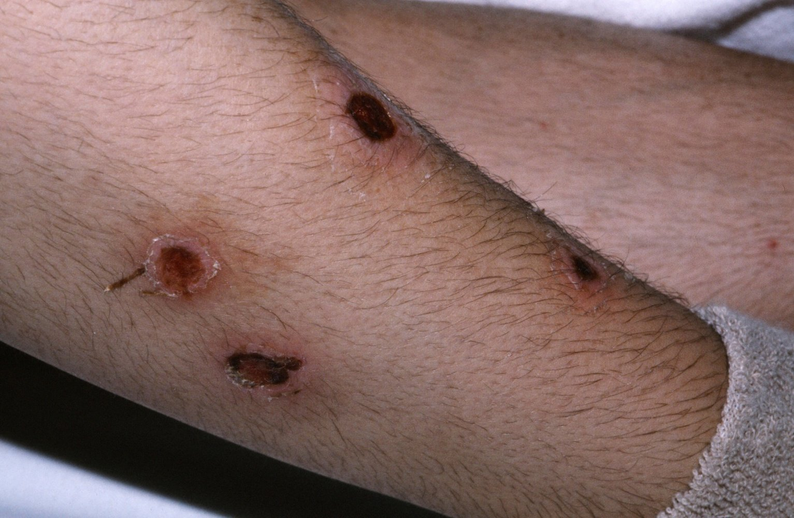

# Impetigo

*Categories: Clinical knowledge > Emergency medicine > Infectious diseases > Impetigo*

[Original Article Link](https://coursology-qbank.com/amboss/article/ak0QmT)

---

## Summary

Impetigo is an infectious <u>skin</u> disease predominantly seen in children and caused by the bacteria <u>Staphylococcus aureus</u> or, less commonly, <u>Streptococcus pyogenes</u>. Impetigo may be <u>bullous</u> or nonbullous and typically manifests with honey-colored, crusted lesions with surrounding <u>erythema</u> on the face or, occasionally, the extremities. It can often be <u>diagnosed clinically</u>, but <u>bacterial culture</u> is recommended to identify the causative <u>pathogen</u>. First-line treatment for localized impetigo is a topical <u>antibiotic</u> (e.g., <u>mupirocin</u>), which typically resolves the infection without complications. Systemic <u>antibiotics</u> may be indicated for more widespread disease or to decrease transmission during an <u>outbreak</u>.

---

## Epidemiology

* Age

* Primarily affects children (especially between 2–6 years of age) [[1]](https://coursology-qbank.com/amboss/article/jza_sM)

* Impetigo is highly contagious and can cause <u>epidemics</u> in preschools or schools. [[2]](https://coursology-qbank.com/amboss/article/2paTKl)

* <u>Prevalence</u>: high in resource-limited countries

> [!NOTE]
> Impetigo is the most common bacterial <u>skin infection</u> among children.

Epidemiological data refers to the US, unless otherwise specified.

---

## Etiology

* Pathogens: <u>superficial</u> bacterial <u>skin infection</u>

* <u>S. aureus</u>: majority of cases [[3]](https://coursology-qbank.com/amboss/article/FYdgIo0)

* Causes both <u>bullous impetigo</u> and <u>nonbullous impetigo</u>

* <u>S. aureus</u> strains that produce <u>exfoliative toxins</u> A and B are responsible for <u>bullous impetigo</u>. [[4]](https://coursology-qbank.com/amboss/article/Tpa6Kl)[[5]](https://coursology-qbank.com/amboss/article/SpayKl)

* <u>S. pyogenes</u> (<u>GAS</u>): causes <u>nonbullous impetigo</u>

* <u>S. aureus</u> and <u>GAS</u> <u>coinfection</u> may occur

* Predisposing factors [[3]](https://coursology-qbank.com/amboss/article/FYdgIo0)

* Warm and humid climate

* Crowded, unsanitary living conditions

* Poor personal hygiene

* Medical conditions

* Preexisting <u>skin</u> lesions (e.g., <u>atopic dermatitis</u>, <u>scabies</u>, <u>insect bites</u>, <u>abrasions</u>, <u>eczema</u>)

* <u>Diabetes mellitus</u>

* <u>Immunodeficiency</u> (e.g., <u>HIV</u>, post-<u>organ transplantation</u>, <u>systemic corticosteroids</u>)

* Route of infection

* Primary impetigo: bacterial infection of previously healthy <u>skin</u>

* Secondary impetigo (impetiginization): secondary infection of preexisting <u>skin</u> lesions

---

## Clinical features

|  Most common manifestations of impetigo [[3]](https://coursology-qbank.com/amboss/article/FYdgIo0)[[6]](https://coursology-qbank.com/amboss/article/hpac6l)[[7]](https://coursology-qbank.com/amboss/article/on108h0)  |  |  |
| --- | --- | --- |
|  |  Nonbullous impetigo   |  Bullous impetigo   |
|  <u>Epidemiology</u> [[8]](https://coursology-qbank.com/amboss/article/O9bInD)  |  * ∼ 70% of cases   |  * ∼ 30% of cases   |
| Lesions |   * <u>Papules</u>, which turn into small <u>vesicles</u> surrounded by <u>erythema</u>  and/or <u>pustules</u>   * <u>Vesicles</u> and <u>pustules</u> can rupture  * Oozing secretion that dries forms honey-colored crusts that heal without scarring  * May be pruritic (especially <u>pustules</u>) but is rarely painful [[9]](https://coursology-qbank.com/amboss/article/k9bmnD)  * Negative <u>Nikolsky sign</u> [[10]](https://coursology-qbank.com/amboss/article/PzaWGM)    |   * <u>Vesicles</u> that grow to form large, flaccid <u>bullae</u>, which go on to rupture and form thin, brown crusts  * Negative <u>Nikolsky sign</u>    |
| Distribution pattern |   * Face (most common), especially around the nose and mouth  * Extremities    |  * Trunk and upper extremities   |
| Other findings |  * Regional <u>lymphadenopathy</u>   |  * Systemic signs (e.g., <u>fever</u>, <u>malaise</u>, <u>weakness</u>) in severe cases   |

* Rare manifestation: ecthyma 

* Ulcerative impetigo that extends into the <u>dermis</u>

* Manifests with coin-shaped, <u>superficial</u> <u>ulcers</u> with a punched-out appearance and yellow or brown-black crusts

* May cause scarring because <u>ecthyma</u> involves the deep layers of the <u>skin</u>

> [!TIP]
> Impetigo should be suspected in children presenting with honey-colored crusts around the mouth and nose.

Nonbullous impetigo

Nonbullous impetigo

Nonbullous Impetigo

Impetigo

Bullous impetigo

Bullous impetigo

Ecthyma

---

## Diagnosis

* <u>Clinical diagnosis</u> based on <u>typical manifestations of impetigo</u> (see also “<u>Differential diagnoses of impetigo</u>”) [[11]](https://coursology-qbank.com/amboss/article/Om0Ifg)

* <u>Gram stain</u> and culture of <u>pus</u> or <u>exudate</u>: to identify causative pathogens  [[3]](https://coursology-qbank.com/amboss/article/FYdgIo0)[[11]](https://coursology-qbank.com/amboss/article/Om0Ifg)

* Consider <u>diagnostics for poststreptococcal glomerulonephritis</u> (<u>PSGN</u>) if suspected.

> [!TIP]
> <u>Gram stain</u> and culture are recommended for distinguishing <u>S. aureus</u> and/or <u>GAS</u> as the cause of impetigo; testing is not necessary in patients with typical lesions. [[11]](https://coursology-qbank.com/amboss/article/Om0Ifg)

---

## Differential diagnoses

See “<u>Differential diagnosis of scaling</u>,” “<u>Blistering skin diseases</u>,” and “<u>SSTIs</u>.” [[6]](https://coursology-qbank.com/amboss/article/hpac6l)[[12]](https://coursology-qbank.com/amboss/article/3paS6l)

* Conditions that cause localized inflammation  [[3]](https://coursology-qbank.com/amboss/article/FYdgIo0)

* <u>Atopic dermatitis</u>

* <u>Contact dermatitis</u>

* <u>Seborrheic dermatitis</u>

* Cutaneous <u>candidiasis</u>

* <u>Tinea</u>

* <u>Herpes simplex virus infection</u>

* <u>Erysipelas</u>

* <u>Folliculitis</u>

* <u>Scabies</u>

* Conditions that cause <u>bullae</u> [[3]](https://coursology-qbank.com/amboss/article/FYdgIo0)

* <u>Pemphigus vulgaris</u> and <u>bullous pemphigoid</u>

* <u>Bullous</u> <u>fixed drug reaction</u>

* <u>Insect bites</u> or <u>burns</u>

* <u>Varicella</u>

* <u>Stevens-Johnson syndrome</u>

The differential diagnoses listed here are not exhaustive.

---

## Treatment

### Topical <u>antibiotics</u> [[3]](https://coursology-qbank.com/amboss/article/FYdgIo0)[[13]](https://coursology-qbank.com/amboss/article/uYdpIo0)

* Indications: any form of impetigo with a limited area affected

* Options  [[13]](https://coursology-qbank.com/amboss/article/uYdpIo0)

* <u>Mupirocin</u> DOSAGE [[3]](https://coursology-qbank.com/amboss/article/FYdgIo0)

* <u>Retapamulin</u> DOSAGE [[3]](https://coursology-qbank.com/amboss/article/FYdgIo0)

* <u>Ozenoxacin</u> DOSAGE [[14]](https://coursology-qbank.com/amboss/article/EYd8Io0)

* <u>Fusidic acid</u> (<u>off-label</u>; not available in the US) DOSAGE [[3]](https://coursology-qbank.com/amboss/article/FYdgIo0)

### Oral <u>antibiotics</u> [[3]](https://coursology-qbank.com/amboss/article/FYdgIo0)

* Indications [[3]](https://coursology-qbank.com/amboss/article/FYdgIo0)[[11]](https://coursology-qbank.com/amboss/article/Om0Ifg)

* Impetigo with large <u>bullae</u> or widespread involvement

* <u>Ecthyma</u>

* <u>Outbreak</u> setting

* Options [[3]](https://coursology-qbank.com/amboss/article/FYdgIo0)[[11]](https://coursology-qbank.com/amboss/article/Om0Ifg)[[15]](https://coursology-qbank.com/amboss/article/Ef18LT0)

* Targeting both <u>S. aureus</u> and <u>GAS</u> 

* <u>Cephalexin</u> DOSAGE [[11]](https://coursology-qbank.com/amboss/article/Om0Ifg)

* <u>Dicloxacillin</u> DOSAGE [[3]](https://coursology-qbank.com/amboss/article/FYdgIo0)[[11]](https://coursology-qbank.com/amboss/article/Om0Ifg)

* <u>Amoxicillin/clavulanate</u> DOSAGE [[11]](https://coursology-qbank.com/amboss/article/Om0Ifg)

* Confirmed or suspected <u>MRSA</u> ;  [[11]](https://coursology-qbank.com/amboss/article/Om0Ifg)[[15]](https://coursology-qbank.com/amboss/article/Ef18LT0)

* <u>Clindamycin</u> DOSAGE [[11]](https://coursology-qbank.com/amboss/article/Om0Ifg)

* <u>TMP/SMX</u> (<u>off-label</u>) DOSAGE [[11]](https://coursology-qbank.com/amboss/article/Om0Ifg)

* <u>Doxycycline</u> (<u>off-label</u>) DOSAGE [[3]](https://coursology-qbank.com/amboss/article/FYdgIo0)

* Duration: usually 7 days

> [!WARNING]
> Treatment with <u>penicillin</u> is only recommended if cultures yield <u>GAS</u> alone. Otherwise, avoid treating impetigo with <u>penicillin</u> and <u>macrolides</u> as they are usually ineffective. [[3]](https://coursology-qbank.com/amboss/article/FYdgIo0)[[11]](https://coursology-qbank.com/amboss/article/Om0Ifg)

### <u>Supportive care</u> [[3]](https://coursology-qbank.com/amboss/article/FYdgIo0)

Provide patient and guardian education and counseling on:

* Measures to reduce contagion: e.g., <u>wound care</u>, handwashing, <u>contact precautions</u> (see “Prevention”)

* Clinical monitoring for complications (e.g., <u>cellulitis</u>, <u>sepsis</u>, <u>PSGN</u>)

> [!WARNING]
> Avoid topical <u>disinfectants</u> (e.g., <u>chlorhexidine</u>) as they are less effective than topical <u>antibiotics</u>. [[3]](https://coursology-qbank.com/amboss/article/FYdgIo0)

---

## Complications

* In <u>GAS</u> infections: acute <u>poststreptococcal glomerulonephritis</u> (<u>PSGN</u>)

* Very rarely: <u>staphylococcal scalded skin syndrome</u> (<u>SSSS</u>)

* <u>Superinfection</u> [[16]](https://coursology-qbank.com/amboss/article/gpaFKl)

We list the most important complications. The selection is not exhaustive.

---