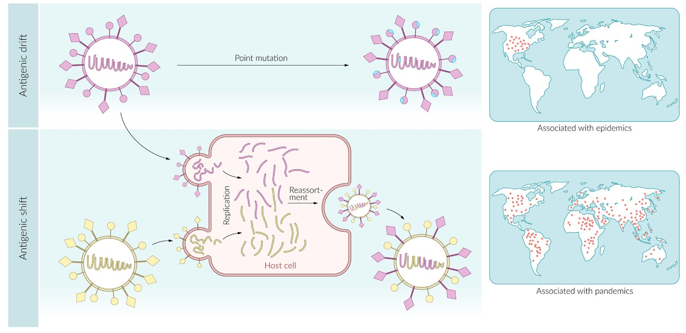
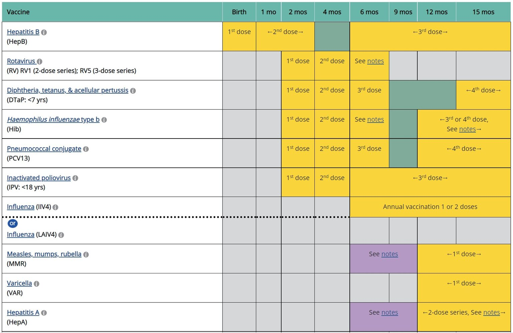

# Influenza

*Categories: Clinical knowledge > Emergency medicine > Infectious diseases > Influenza*

[Original Article Link](https://coursology-qbank.com/amboss/article/Bm0z3g)

---

## Summary

Influenza is a highly contagious viral infection that typically occurs during the winter months. It is caused by <u>influenza A</u>, B, and C <u>viruses</u>. There are various subtypes of <u>influenza A</u> <u>viruses</u>, which are classified based on their <u>hemagglutinin</u> (H) and <u>neuraminidase</u> (N) surface <u>antigens</u>. <u>Influenza viruses</u> frequently mutate, resulting in the emergence of new subtypes and strains. Symptomatic patients may present with sudden onset of high <u>fever</u>, <u>headache</u>, <u>myalgias</u>, <u>arthralgias</u>, nonproductive <u>cough</u>, and <u>malaise</u>. <u>Inflammatory markers</u> are usually normal or slightly elevated. The diagnosis can often be established based on clinical presentation, but <u>PCR</u> testing may be used to confirm the diagnosis. Usually, symptoms are <u>self-limited</u> and supportive treatment is sufficient. However, <u>antiviral therapy</u> may be considered for patients with early or severe disease, especially in those at high risk for complications. <u>Antiviral therapy</u> may reduce the severity and shorten the duration of symptoms, and reduce the risk of developing complications. Rarely, patients may develop secondary bacterial <u>pneumonia</u>, most commonly caused by <u>Staphylococcus aureus</u> or <u>Streptococcus pneumoniae</u>. <u>Hand hygiene</u>, <u>respiratory hygiene</u>, and <u>vaccination</u> can help prevent the spread of influenza. <u>Vaccination</u> is the most effective preventive measure. In select patient populations, pre- or <u>postexposure prophylaxis</u> may help prevent or mitigate the severity of influenza.

---

## Etiology

* <u>Pathogen</u>: Influenza <u>virus</u> A and B (and rarely influenza C)

* <u>RNA viruses</u> of the family <u>orthomyxoviruses</u>

* <u>Enveloped virus</u> with a helical <u>capsid</u>

* Single-stranded, negative-stranded, segmented (8 segments)

* Replication in <u>cell nucleus</u>

* Person-to-person transmission: directly via respiratory droplets (sneezing or <u>coughing</u>) or indirectly through contact with contaminated surfaces

References:[[2]](https://coursology-qbank.com/amboss/article/fVYkFL)

---

## Pathophysiology

### Replication cycle [[4]](https://coursology-qbank.com/amboss/article/gVYFFL)[[5]](https://coursology-qbank.com/amboss/article/SVYyFL)[[6]](https://coursology-qbank.com/amboss/article/PVYWuL)[[7]](https://coursology-qbank.com/amboss/article/4VY3uL)

1. * <u>Influenza viruses</u> bind to the respiratory tract <u>epithelium</u>.
2. * Viral hemagglutinin (H) binds sialic acid residues (neuraminic acid derivatives) on the host <u>cell membrane</u> → <u>virus</u> fusion with the membrane → entry into <u>the cell</u>
3. * The <u>virus</u> replicates in the <u>nucleus of the cell</u>.
4. * The new <u>virus</u> particles travel to <u>the cell</u> membrane → formation of a membrane bud around the <u>virus</u> particles (<u>budding</u>)
5. * Viral neuraminidase (N) cleaves the neuraminic acid → <u>virions</u> exit <u>the cell</u>
6. * Host cell dies → cellular breakdown triggers a strong <u>immune response</u>

### Genetic mutations [[8]](https://coursology-qbank.com/amboss/article/kVYmuL)

* Antigenic shift

* Two subtypes of <u>viruses</u> (e.g., human and <u>swine influenza</u>) infect the same cell and exchange genetic segments (<u>reassortment</u>) to create new subtypes (e.g., H3N1 → H2N1).

* Occurs in particular when human pathogenic and animal pathogenic <u>influenza viruses</u> exchange genetic information

* Causes <u>pandemics</u> (limited to a specific time period)

* Antigenic drift

* Minor changes in <u>antigenic</u> structure (<u>hemagglutinin</u> and/or <u>neuraminidase</u>) via random <u>point mutation</u>

* Does not alter the subtype (e.g., H5N1 or “<u>avian flu</u>”).

* Causes <u>epidemics</u> (limited to a specific population or region)

> [!NOTE]
> Small shifts in a panda's habitat can cause epic dread: Shifts can cause pandemics and drifts cause epidemics.

Antigenic shift and drift

---

## Clinical features

The clinical presentation of influenza infection is asymptomatic or mild in 75% of cases. Influenza presents with very characteristic features, hence the term “flu-like symptoms”.

* <u>Incubation period</u>: a few hours to several days

* Sudden onset of high <u>fever</u>, chills, <u>headache</u>, <u>arthralgia</u>, <u>myalgia</u>, fatigue, and <u>malaise</u>

* Patients often develop <u>acute bronchitis</u> with a <u>cough</u> that is usually dry but may produce small amounts of clear or blood-tinged <u>sputum</u>.

* <u>Hypotension</u> and <u>bradycardia</u> are common (especially among women and older patients)

References:[[9]](https://coursology-qbank.com/amboss/article/OVYIuL)

---

## Diagnosis

### General principles [[10]](https://coursology-qbank.com/amboss/article/IfcYnb0)[[11]](https://coursology-qbank.com/amboss/article/_Jc59W0)

* During periods of high influenza activity, a <u>clinical diagnosis</u> can often be made based on the presence of typical <u>flu-like symptoms</u>.

* In general, testing should only be carried out in outpatients if the results will influence management.  [[12]](https://coursology-qbank.com/amboss/article/FAdgls0)

* Testing should not delay treatment.

> [!TIP]
> Influenza can present in atypical ways and can also trigger exacerbations in patients with chronic cardiopulmonary diseases. [[10]](https://coursology-qbank.com/amboss/article/IfcYnb0)

### Indications for testing [[10]](https://coursology-qbank.com/amboss/article/IfcYnb0)

|  Indications for influenza testing [[10]](https://coursology-qbank.com/amboss/article/IfcYnb0)  |  |  |
| --- | --- | --- |
|  |  High influenza activity   |  Low influenza activity   |
|  Outpatients   |   * Individuals at <u>high risk for complications of influenza</u> with any respiratory symptoms  * Acute onset of respiratory symptoms and one of the following:  * Worsening of chronic cardiopulmonary disease  * Potential complications of influenza  * Consider for patients with any respiratory symptoms who are likely to be discharged home.    |  * Consider for <u>febrile</u> patients with acute respiratory illness (especially those at <u>high risk for complications of influenza</u>)   |
| Inpatients |   * Hospitalization for acute respiratory illness  or worsening of chronic cardiopulmonary disease  * Individuals at <u>high risk for complications of influenza</u> with any respiratory symptoms  * Onset of acute respiratory symptoms during hospital stay    |   * Hospitalization for acute respiratory illness and potential exposure to the <u>influenza virus</u>  * Consider for <u>febrile</u> patients with acute respiratory illness (especially those at <u>high risk for complications of influenza</u>)    |

### <u>Laboratory studies</u> [[10]](https://coursology-qbank.com/amboss/article/IfcYnb0)

* Confirmatory studies 

* <u>Molecular assays</u> are the preferred method for detecting <u>influenza virus</u> infection. ;  [[10]](https://coursology-qbank.com/amboss/article/IfcYnb0)

* <u>RT-PCR</u>: preferred test for inpatients

* Rapid <u>molecular assay</u>: preferred test for outpatients

* <u>Rapid antigen test</u>: can detect various <u>influenza A</u>/B <u>antigens</u>, usually via nasal or pharyngeal swabs

* High <u>specificity</u> but limited <u>sensitivity</u>

* Only indicated if more sensitive tests are unavailable

* Additional studies

* <u>Serologic testing</u> and viral cultures: not recommended for diagnosis

* Blood tests are not routinely indicated, but if performed, may show:

* Normal or slightly elevated <u>inflammatory markers</u>

* Relative <u>lymphocytosis</u>

> [!TIP]
> Consider bacterial <u>coinfection</u> in patients with elevated <u>inflammatory markers</u> (e.g., <u>CRP</u>). [[13]](https://coursology-qbank.com/amboss/article/Xrc9fd0)

### Further evaluation [[10]](https://coursology-qbank.com/amboss/article/IfcYnb0)

* Evaluate for <u>coinfection</u> (e.g., bacterial <u>superinfection</u>, and/or complications) if any of the following are present:

* Presentation with severe illness

* Clinical deterioration after initial improvement

* Consider evaluation if there is no improvement within 3–5 days of symptom onset.

* Evaluation should be guided by symptoms and may include:

* Blood tests: <u>CBC</u>, <u>procalcitonin</u>, <u>CRP</u>  [[10]](https://coursology-qbank.com/amboss/article/IfcYnb0)[[13]](https://coursology-qbank.com/amboss/article/Xrc9fd0)[[14]](https://coursology-qbank.com/amboss/article/Yrcnfd0)[[15]](https://coursology-qbank.com/amboss/article/brcHfd0)

* Bacterial cultures

* Chest imaging

* See “<u>Diagnosis of pneumonia</u>” for further details.

> [!TIP]
> Consider simultaneous initiation of <u>empiric antibiotic treatment</u> in patients undergoing evaluation for bacterial <u>coinfection</u>.

---

## Differential diagnoses

* <u>Common cold</u>

* <u>COVID-19</u>

* <u>Acute rhinosinusitis</u>

* <u>Acute tonsillopharyngitis</u>

* <u>Laryngitis</u>

* <u>Epiglottitis</u>

* <u>Croup</u>

* <u>Pertussis</u>

* <u>Allergic rhinitis</u>

* <u>Infectious mononucleosis</u>

* See also “<u>URTIs</u>.”

The differential diagnoses listed here are not exhaustive.

---

## Treatment

### Supportive treatment [[10]](https://coursology-qbank.com/amboss/article/IfcYnb0)

* <u>Oral rehydration therapy</u>

* <u>Antipyretics</u> and <u>oral analgesics</u>  [[11]](https://coursology-qbank.com/amboss/article/_Jc59W0)

* <u>Antitussives</u> to relieve dry <u>cough</u>

### Antiviral therapy for influenza

Most cases of influenza are <u>self-limited</u> and do not require specific treatment. If antiviral treatment is indicated, treatment should be initiated as soon as possible.

#### Indications [[10]](https://coursology-qbank.com/amboss/article/IfcYnb0)[[12]](https://coursology-qbank.com/amboss/article/FAdgls0)

The quality of some of the underlying evidence for the use of <u>neuraminidase inhibitors</u> is part of an ongoing and controversial debate. [[16]](https://coursology-qbank.com/amboss/article/9a1N520)[[17]](https://coursology-qbank.com/amboss/article/UY1bo20)

* All patients with suspected or documented influenza and ≥ 1 of the following: 

* Severe or progressive illness

* Hospitalization required

* <u>High risk for complications of influenza</u>

* Consider treating patients with suspected or confirmed influenza and ≥ 1 of the following:

* Onset ≤ 48 hours prior to presentation

* Close contact with <u>infants</u> < 6 months of age or high-risk patients  [[12]](https://coursology-qbank.com/amboss/article/FAdgls0)

> [!TIP]
> Do not delay the initiation of <u>antiviral therapy</u> while awaiting the results of testing. [[12]](https://coursology-qbank.com/amboss/article/FAdgls0)

#### Treatment options [[10]](https://coursology-qbank.com/amboss/article/IfcYnb0)[[12]](https://coursology-qbank.com/amboss/article/FAdgls0)

The medications listed below are <u>FDA</u>-approved for use within 48 hours of symptom onset; however, they may be used <u>off-label</u> in patients with symptom onset > 48 hours before presentation.

* <u>Neuraminidase inhibitors</u>

* Mechanism of action: inhibits the release of <u>viruses</u> from the host cell

* Greatest benefit if started within the first 48 hours of symptom onset  [[18]](https://coursology-qbank.com/amboss/article/Urcbgd0)

* Commonly used agents

* Oral <u>oseltamivir</u> DOSAGE: preferred agent in case of hospitalization or severe influenza and in children with <u>influenza A</u> or B [[12]](https://coursology-qbank.com/amboss/article/FAdgls0)

* Inhaled <u>zanamivir</u>  DOSAGE: acute, uncomplicated influenza [[10]](https://coursology-qbank.com/amboss/article/IfcYnb0)[[12]](https://coursology-qbank.com/amboss/article/FAdgls0)

* Intravenous <u>peramivir</u> (<u>off-label</u> in children < 2 years) DOSAGE: acute, uncomplicated influenza [[10]](https://coursology-qbank.com/amboss/article/IfcYnb0)[[12]](https://coursology-qbank.com/amboss/article/FAdgls0)

* Cap-dependent <u>endonuclease</u> inhibitor
* Oral <u>baloxavir</u> DOSAGE: acute, uncomplicated influenza [[12]](https://coursology-qbank.com/amboss/article/FAdgls0)[[19]](https://coursology-qbank.com/amboss/article/fLckC10)

> [!TIP]
> Consider a longer duration of antiviral treatment in patients with <u>immunosuppression</u> and those who require hospitalization.

> [!WARNING]
> Do not use <u>amantadine</u> to treat influenza because of the risk of <u>antimicrobial resistance</u>. [[10]](https://coursology-qbank.com/amboss/article/IfcYnb0)

---

## Complications

### Individuals at high risk for complications of influenza [[10]](https://coursology-qbank.com/amboss/article/IfcYnb0)[[12]](https://coursology-qbank.com/amboss/article/FAdgls0)[[20]](https://coursology-qbank.com/amboss/article/-PdDhJ0)[[21]](https://coursology-qbank.com/amboss/article/kY1m620)

* Adults ≥ 50 years of age, especially those ≥ 65 years of age [[20]](https://coursology-qbank.com/amboss/article/-PdDhJ0)

* Children < 5 years of age, especially those < 2 years of age, and those who were born preterm or near term [[12]](https://coursology-qbank.com/amboss/article/FAdgls0)

* Children aged 6 months–18 years on long-term <u>salicylate</u> therapy  [[12]](https://coursology-qbank.com/amboss/article/FAdgls0)[[20]](https://coursology-qbank.com/amboss/article/-PdDhJ0)

* Individuals who are or will be pregnant or ≤ 2 weeks postpartum during <u>influenza season</u> [[20]](https://coursology-qbank.com/amboss/article/-PdDhJ0)[[22]](https://coursology-qbank.com/amboss/article/TjW6-O0)

* Individuals with chronic medical conditions (e.g., <u>asthma</u>; , <u>heart</u> disease, <u>CKD</u>, <u>diabetes mellitus</u>, neurologic and <u>neurodevelopmental disorders</u>)

* <u>Immunocompromised individuals</u>

* Individuals with a <u>BMI</u> ≥ 40 kg/m2 (adults) or <u>BMI</u> ≥ 95th<u>percentile</u> (children) [[12]](https://coursology-qbank.com/amboss/article/FAdgls0)

* Residents of <u>nursing homes</u> or long-term care facilities

* American Indian, Alaska Native, Black, and Hispanic individuals  [[12]](https://coursology-qbank.com/amboss/article/FAdgls0)[[21]](https://coursology-qbank.com/amboss/article/kY1m620)[[23]](https://coursology-qbank.com/amboss/article/mLcVy10)

### <u>Pneumonia</u> [[24]](https://coursology-qbank.com/amboss/article/lLcvB10)[[25]](https://coursology-qbank.com/amboss/article/-rcDPd0)[[26]](https://coursology-qbank.com/amboss/article/y7cdod0)

#### Primary influenza pneumonia [[27]](https://coursology-qbank.com/amboss/article/MVYMEL)

* Description

* Caused by direct infection of the <u>lung parenchyma</u> by the <u>influenza virus</u> [[27]](https://coursology-qbank.com/amboss/article/MVYMEL)[[28]](https://coursology-qbank.com/amboss/article/O2aI3P)

* Hemorrhagic <u>pneumonia</u>; associated with a poor prognosis

* <u>Epidemiology</u>: less common than secondary bacterial <u>bronchitis</u> or <u>pneumonia</u>

* Clinical features

* Acute clinical deterioration 2–5 days after the onset of <u>flu-like symptoms</u> [[27]](https://coursology-qbank.com/amboss/article/MVYMEL)

* <u>Dyspnea</u>, <u>hypoxemia</u>, <u>cyanosis</u> [[25]](https://coursology-qbank.com/amboss/article/-rcDPd0)

* May progress to <u>acute respiratory distress syndrome</u> (<u>ARDS</u>) and <u>multiorgan failure</u>

* Diagnostics

* Blood tests may show <u>leukocytosis</u> or <u>leukopenia</u>; <u>ESR</u> is usually normal.

* <u>Chest x-ray</u> may show perihilar congestion and diffuse or multifocal infiltrates.

* See “<u>Diagnosis of pneumonia</u>” for further details.

* Management

* <u>Antiviral therapy for influenza</u>

* <u>Lung protective ventilation</u> is often necessary. [[27]](https://coursology-qbank.com/amboss/article/MVYMEL)

* See “<u>Management of ARDS</u>” for further details.

#### Secondary bacterial <u>bronchitis</u> and <u>pneumonia</u> (postinfluenza pneumonia)

* Etiology: Common causative pathogens include <u>S. pneumoniae</u>, <u>S. aureus</u> (including <u>MRSA</u>), <u>S. pyogenes</u>, and <u>H. influenzae</u>. [[29]](https://coursology-qbank.com/amboss/article/KpcUqW0)

* Clinical features

* Development of a <u>purulent</u>, productive <u>cough</u>;  ∼ 4–14 days  after an initial period of improvement [[24]](https://coursology-qbank.com/amboss/article/lLcvB10)

* <u>Recurrent fever</u>

* Symptoms similar to <u>community-acquired pneumonia</u>

* Postinfluenza <u>S. aureus</u> <u>pneumonia</u> can manifest with: [[30]](https://coursology-qbank.com/amboss/article/frckgd0)

* Hyperacute onset of symptoms

* <u>Hypoxemia</u> and <u>cyanosis</u>

* <u>Hemoptysis</u>

* <u>Hypotension</u>

* Diagnostics

* <u>Laboratory studies</u> may show <u>leukocytosis</u> with <u>left shift</u> or <u>leukopenia</u>; <u>ESR</u> is typically elevated.

* In <u>pneumonia</u> caused by <u>S. aureus</u>, a <u>chest x-ray</u> may show cavitations and <u>pneumatoceles</u>.

* See “<u>Diagnosis of pneumonia</u>” for further details.

* Treatment [[29]](https://coursology-qbank.com/amboss/article/KpcUqW0)

* <u>Empiric antibiotic therapy for community-acquired pneumonia</u>

* Should include coverage for <u>MRSA</u>

### Other complications [[24]](https://coursology-qbank.com/amboss/article/lLcvB10)

* <u>Upper respiratory tract infections</u>

* <u>Acute otitis media</u>

* <u>Sinusitis</u>

* <u>Croup</u> (especially in children) [[31]](https://coursology-qbank.com/amboss/article/i8cJmV0)

* <u>Parotitis</u> [[32]](https://coursology-qbank.com/amboss/article/R8clmV0)

* Exacerbation of chronic diseases: e.g., <u>COPD</u>, <u>asthma</u>, underlying <u>ischemic heart disease</u>, <u>congestive heart failure</u>

* <u>Acute kidney injury</u>

* Rare complications: include cardiac (e.g., <u>pericarditis</u>, <u>myocarditis</u>), musculoskeletal (e.g., <u>myositis</u>, <u>rhabdomyolysis</u>), and neurological complications (e.g., <u>encephalopathy</u>, <u>encephalomyelitis</u>, <u>transverse myelitis</u>, <u>aseptic meningitis</u>, <u>Guillain-Barré syndrome</u>)

We list the most important complications. The selection is not exhaustive.

---

## Prevention

### <u>Vaccination</u> [[12]](https://coursology-qbank.com/amboss/article/FAdgls0)[[20]](https://coursology-qbank.com/amboss/article/-PdDhJ0)[[33]](https://coursology-qbank.com/amboss/article/Bedza60)

#### Influenza vaccine

* To account for <u>antigenic drift</u>, <u>vaccines</u> are modified prior to each <u>influenza season</u> to include expected circulating strains.

* The 2025-2026 <u>influenza vaccines</u> are trivalent, containing influenza <u>hemagglutinin</u> <u>proteins</u>, which are surface glycoproteins, for two flu A strains, and one flu B strain.  [[12]](https://coursology-qbank.com/amboss/article/FAdgls0)[[20]](https://coursology-qbank.com/amboss/article/-PdDhJ0)

|  Types of influenza vaccines [[20]](https://coursology-qbank.com/amboss/article/-PdDhJ0)[[33]](https://coursology-qbank.com/amboss/article/Bedza60)[[34]](https://coursology-qbank.com/amboss/article/e4WxRl0)  |  |  |  |
| --- | --- | --- | --- |
|  |  | Recommended age for administration | Route of administration |
| <u>Inactivated vaccines</u> |  Inactivated influenza vaccine (can be egg-based or cell culture-based) |  * ≥ 6 months   |  * Intramuscular injection   |
|  Adjuvanted influenza vaccine (egg-based)   |   * ≥ 65 years  * <u>Off-label</u> for individuals aged 18–64 years who have received a <u>solid organ transplant</u> and are on <u>immunosuppressants</u>    |  |  |
|  High-dose influenza vaccine (egg-based)   |   * ≥ 65 years  * <u>Off-label</u> for individuals aged 18–64 years who have received a <u>solid organ transplant</u> and are on <u>immunosuppressants</u>    |  |  |
|  Live-attenuated influenza vaccine (egg-based) |  |  * 2 years–49 years [[20]](https://coursology-qbank.com/amboss/article/-PdDhJ0)   |  * Intranasal spray (may be administered at home if necessary) [[12]](https://coursology-qbank.com/amboss/article/FAdgls0)   |
|  Recombinant influenza vaccine (synthetically created without the use of any egg products)  [[35]](https://coursology-qbank.com/amboss/article/grcFgd0)  |  |   * ≥ 9 years [[12]](https://coursology-qbank.com/amboss/article/FAdgls0)  * One of the preferred <u>vaccines</u> for individuals aged ≥ 65 years [[20]](https://coursology-qbank.com/amboss/article/-PdDhJ0)    |  * Intramuscular injection   |

> [!NOTE]
> The attenuated <u>virus</u> is temperature-sensitive and can replicate in the nose but not in the <u>lung</u>. [[36]](https://coursology-qbank.com/amboss/article/U4Wbil0)

> [!TIP]
> In adults ≥ 65 years, <u>adjuvanted inactivated influenza vaccine</u>, <u>high-dose inactivated influenza vaccine</u>, or <u>recombinant influenza vaccine</u> are preferred over other formulations. [[20]](https://coursology-qbank.com/amboss/article/-PdDhJ0)

> [!WARNING]
> Do not delay <u>influenza vaccination</u> to obtain a specific formulation (e.g., a thimerosal-free product). Use any licensed <u>age-appropriate influenza vaccine</u>. [[37]](https://coursology-qbank.com/amboss/article/gDdFdH0)

#### Indications

* All individuals ≥ 6 months of age: annually, ideally prior to each <u>flu season</u>  [[33]](https://coursology-qbank.com/amboss/article/Bedza60)#35752]

* Especially in the following groups: ;  [[20]](https://coursology-qbank.com/amboss/article/-PdDhJ0)[[38]](https://coursology-qbank.com/amboss/article/1gW28k0)

* Individuals at or in close contact with those at <u>high risk for complications of influenza</u>

* Close contacts or caregivers of <u>infants</u> < 6 months of age

* <u>Health care professionals</u>

* Individuals traveling to areas with influenza activity  [[39]](https://coursology-qbank.com/amboss/article/z7Wro50)

#### Contraindications and precautions [[12]](https://coursology-qbank.com/amboss/article/FAdgls0)[[20]](https://coursology-qbank.com/amboss/article/-PdDhJ0)

|  Contraindications and precautions for influenza vaccines [[12]](https://coursology-qbank.com/amboss/article/FAdgls0)[[20]](https://coursology-qbank.com/amboss/article/-PdDhJ0)  |  |  |
| --- | --- | --- |
|  | Contraindications | Precautions |
| All <u>influenza vaccines</u> |   * History of <u>anaphylaxis</u> after <u>vaccination</u> for influenza  * History of severe <u>allergic reaction</u> to any <u>influenza vaccine</u> component (excluding egg protein <u>allergy</u>)  [[40]](https://coursology-qbank.com/amboss/article/-F1Dki0)[[41]](https://coursology-qbank.com/amboss/article/Z81ZOi0)[[42]](https://coursology-qbank.com/amboss/article/24WTil0)    |   * Moderate or severe concurrent acute illness  [[12]](https://coursology-qbank.com/amboss/article/FAdgls0)  * A history of <u>Guillain-Barré syndrome</u> that occurred ≤ 6 weeks after an <u>influenza vaccine</u>    |
| <u>Live attenuated influenza vaccine</u> |   * Adults ≥ 50 years  * Children:  * < 2 years of age  * 2–4 years of age with <u>asthma</u> or <u>wheezing</u> in the last 12 months  * On long-term <u>salicylate</u> therapy  [[43]](https://coursology-qbank.com/amboss/article/MdWMq40)  * Any individual with: [[12]](https://coursology-qbank.com/amboss/article/FAdgls0)  * <u>Cochlear implants</u>  * Active <u>CSF leaks</u>  * Any <u>contraindication to live vaccines</u>, including close contacts of severely <u>immunosuppressed</u> individuals  * Recent influenza antiviral treatment  [[12]](https://coursology-qbank.com/amboss/article/FAdgls0)[[20]](https://coursology-qbank.com/amboss/article/-PdDhJ0)    |   * Chronic medical conditions with increased likelihood of flu complications  * Individuals ≥ 5 years of age with <u>asthma</u>    |

> [!TIP]
> Egg <u>allergy</u> of any severity is not a contraindication for <u>influenza vaccines</u>. [[12]](https://coursology-qbank.com/amboss/article/FAdgls0)[[20]](https://coursology-qbank.com/amboss/article/-PdDhJ0)

> [!WARNING]
> Individuals (including <u>health care personnel</u>) who receive the <u>live attenuated influenza vaccine</u> should avoid contact with severely <u>immunosuppressed</u> individuals for 7 days after <u>vaccination</u>. [[42]](https://coursology-qbank.com/amboss/article/24WTil0)

#### <u>Immunization schedule</u>

* See “<u>ACIP immunization schedule</u>” for details.

ACIP routine immunization schedule: children and adolescents ≤ 18 years of age

ACIP immunization schedule by medical indication: children and adolescents ≤ 18 years of age

ACIP catch-up immunization schedule: children and adolescents ≤ 18 years of age

ACIP routine immunization schedule: adults ≥ 19 years of age

ACIP immunization schedule by medical or other indications: adults ≥ 19 years of age

### <u>Infection prevention and control</u>

* <u>Standard precautions</u>

* Educate patients on the importance of <u>hand hygiene</u> and <u>respiratory hygiene</u>.

* Advise outpatients to stay at home until they have been afebrile for at least 24 hours.

* Use <u>personal protective equipment</u> (including masks).

* Clean surfaces with <u>alcohol</u>-based or aldehyde-based <u>disinfectants</u>.

* <u>Isolation precautions</u>

* Isolate or cohort patients.

* See “<u>Droplet precautions</u>” for further details.

### <u>Chemoprophylaxis</u>

#### Preexposure prophylaxis [[10]](https://coursology-qbank.com/amboss/article/IfcYnb0)

* Not routinely recommended

* Indications: Consider if <u>vaccination</u> is not possible in the following situations. 

* Individuals at very <u>high risk for complications of influenza</u>

* People who are in close contact with unvaccinated, very high-risk individuals

* Agents: Administer either <u>oseltamivir</u> or <u>zanamivir</u> for the entire <u>influenza season</u>.  [[10]](https://coursology-qbank.com/amboss/article/IfcYnb0)

#### <u>Postexposure prophylaxis</u> [[10]](https://coursology-qbank.com/amboss/article/IfcYnb0)[[12]](https://coursology-qbank.com/amboss/article/FAdgls0)

* Not routinely recommended

* Indications: Consider in the following situations for individuals ≥ 3 months if <u>antiviral agents</u> can be initiated within 48 hours of exposure. [[10]](https://coursology-qbank.com/amboss/article/IfcYnb0)[[12]](https://coursology-qbank.com/amboss/article/FAdgls0)

* Individuals at <u>high risk for complications of influenza</u> in whom <u>vaccination</u> is contraindicated, unavailable, or likely to be ineffective  [[10]](https://coursology-qbank.com/amboss/article/IfcYnb0)[[12]](https://coursology-qbank.com/amboss/article/FAdgls0)

* Unvaccinated close contacts of:

* Individuals at <u>high risk for complications of influenza</u>

* Unvaccinated children < 24 months of age [[12]](https://coursology-qbank.com/amboss/article/FAdgls0)

* Vaccinated close contacts of children at high risk of complications for influenza if circulating <u>influenza virus</u> strains in the community are not well-matched with the <u>seasonal influenza vaccine</u> [[12]](https://coursology-qbank.com/amboss/article/FAdgls0)

* Agents

* <u>Oseltamivir</u> (<u>off-label</u> in children < 1 year and not recommended in children aged < 3 months) DOSAGE: preferred option in children  [[10]](https://coursology-qbank.com/amboss/article/IfcYnb0)[[37]](https://coursology-qbank.com/amboss/article/gDdFdH0)[[44]](https://coursology-qbank.com/amboss/article/QnduGq0)

* <u>Zanamivir</u> DOSAGE  [[10]](https://coursology-qbank.com/amboss/article/IfcYnb0)[[37]](https://coursology-qbank.com/amboss/article/gDdFdH0)[[44]](https://coursology-qbank.com/amboss/article/QnduGq0)

* <u>Baloxavir</u> DOSAGE [[45]](https://coursology-qbank.com/amboss/article/zPdrhJ0)

> [!TIP]
> <u>Peramivir</u> is not approved for use in the <u>prevention of influenza</u>. [[12]](https://coursology-qbank.com/amboss/article/FAdgls0)

---

## Special patient groups

### Influenza during pregnancy

* Maternal effects

* Associated with higher rates of hospitalization and admission to <u>intensive care unit</u>, more severe clinical course, and higher mortality [[46]](https://coursology-qbank.com/amboss/article/2ncTs10)[[47]](https://coursology-qbank.com/amboss/article/fncks10)

* Increased risk of <u>preterm delivery</u> and <u>spontaneous abortion</u> [[48]](https://coursology-qbank.com/amboss/article/Tnc6s10)[[49]](https://coursology-qbank.com/amboss/article/gncFs10)

* Fetal effects: associated with an increased risk of <u>birth</u> defects (e.g., <u>congenital heart defects</u>, <u>cleft lip</u>, <u>neural tube defects</u>), fetal <u>death</u>, lower mean <u>birth</u> weight, and small size for <u>gestational age</u> [[50]](https://coursology-qbank.com/amboss/article/RnclG10)

---