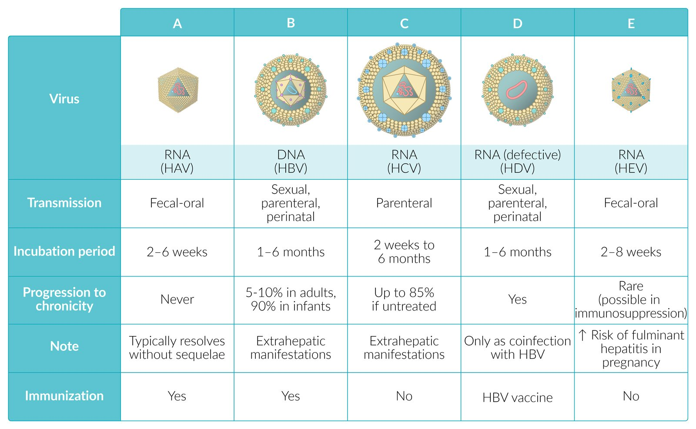

# Overview of viral hepatitides

*Categories: Clinical knowledge > Emergency medicine > Infectious diseases > Overview of viral hepatitides*

[Original Article Link](https://coursology-qbank.com/amboss/article/480353)

---

## Summary

Viral hepatitides comprise the infectious diseases <u>hepatitis A</u>, B, C, D, and E, which have various routes of transmission (e.g., fecal-oral, sexual, parenteral, and <u>perinatal transmission</u>). Most patients are either asymptomatic or experience mild symptoms, which usually resolve spontaneously within weeks to months. However, patients with <u>hepatitis B virus</u> (<u>HBV</u>) infection, <u>hepatitis C virus</u> (<u>HCV</u>) infection, or <u>hepatitis D virus</u> (<u>HDV</u>) infection may experience a chronic disease course, increasing the risk of <u>cirrhosis</u> and <u>hepatocellular carcinoma</u> (<u>HCC</u>). Pregnant individuals with <u>hepatitis E virus</u> (<u>HEV</u>) infection have an increased risk of developing <u>fulminant hepatic failure</u>. Diagnostic studies include <u>liver function</u> tests, viral <u>serologic testing</u>, and measurement of viral load. Treatment of acute <u>hepatitis</u> primarily involves <u>supportive care</u>. <u>HCV infection</u> can be effectively treated with early <u>direct-acting antivirals</u>. Treatment of chronic <u>hepatitis</u> involves antivirals to reduce viral replication and <u>infectivity</u>. <u>Vaccination</u> is available against <u>hepatitis A</u> and <u>hepatitis B</u>.

This article contains an overview of viral hepatitides as well as <u>hepatitis D</u> and <u>hepatitis E</u>. See also “<u>Hepatitis A</u>,” “<u>Hepatitis B</u>,” and “<u>Hepatitis C</u>.”

Viral Hepatitis: Comparing Hepatitis A, B, C, D, and E

---

## Overview

| Overview of viral hepatitis |  |  |  |  |  |
| --- | --- | --- | --- | --- | --- |
|  | <u>Hepatitis A virus</u> (<u>HAV</u>) | <u>Hepatitis B virus</u> (<u>HBV</u>) | <u>Hepatitis C virus</u> (<u>HCV</u>) | <u>Hepatitis D virus</u> (<u>HDV</u>) | <u>Hepatitis E virus</u> (<u>HEV</u>) |
| Route of transmission |  * Fecal-oral   |   * Sexual  * Parenteral  * <u>Perinatal</u>    |   * Parenteral  * <u>Perinatal</u>  * Sexual (rare)    |   * <u>HBV</u> required for <u>HDV</u> entry into <u>hepatocytes</u>  * Parenteral  * Sexual or <u>perinatal</u> (rare)    |   * Fecal-oral  * Parenteral  * <u>Perinatal</u>    |
| <u>Incubation period</u> |  * 2–6 weeks   |  * 1–6 months   |  * 2 weeks to 6 months   |   * <u>Coinfection</u> (<u>HDV</u> and <u>HBV</u>): 1–6 months  * <u>Superinfection</u> (<u>HDV</u> after <u>HBV</u>): 2–8 weeks    |  * 2–8 weeks   |
| Clinical course |   * Adults: acute and <u>self-limited</u>  * Children: typically asymptomatic    |   * Varies significantly  * Subclinical <u>hepatitis</u> in 70% of cases  * Can develop into a chronic infection    |   * Typically asymptomatic  * Most patients develop <u>chronic HCV infection</u> if untreated.    |   * Similar to <u>HBV</u>  * <u>Coinfection</u>: usually leads to severe acute <u>hepatitis</u>  * <u>Superinfection</u>: increased risk of <u>liver cirrhosis</u>    |   * Asymptomatic  * Similar to <u>HAV</u>, but milder  * Increased risk of <u>acute liver failure</u> in pregnant individuals    |
| Increased risk of <u>HCC</u> |  * No   |  * Yes   |  |  |  * No   |
| Amenable to treatment with <u>antiviral therapy</u> |  * No   |   * Acute: no  * Chronic: yes    |  * Yes   |  * Yes   |   * Acute: no  * Chronic: yes    |
| <u>Immunization</u> |  * <u>HAV vaccination</u>   |  * <u>HBV vaccination</u>   |  * Not available   |  * <u>HBV vaccination</u>   |  * Not available   |

> [!NOTE]
> Vowels (A and E) are transmitted via the bowels (fecal-oral) and usually only cause AcutE <u>hepatitis</u>.

Overview of viral hepatitis

---

## Hepatitis D

* <u>Pathogen</u>: hepatitis D virus (<u>HDV</u>)

* Belongs to the <u>Deltaviridae</u> family and the genus <u>Deltavirus</u>

* Defective, circular, single-stranded <u>RNA virus</u>

* Incomplete viral particle resembling a viroid

* Comprises an outer <u>lipoprotein</u> envelope made of the <u>hepatitis B surface antigen</u> (<u>HBsAg</u>) for entry into host cells and an inner ribonucleoprotein structure in which the <u>HDV</u> <u>genome</u> resides

* <u>Epidemiology</u>: 5% of all patients with <u>chronic HBV infection</u> carry <u>HDV</u>.

* Route of transmission: sexual, parenteral, <u>perinatal</u>

* <u>Risk factors</u>

* <u>Men who have sex with men</u>

* History of <u>STIs</u>

* Multiple sexual partners

* Sex workers

* Injection drug use

* Multiple <u>blood transfusions</u>

* Individuals born in countries with a high <u>prevalence</u> of <u>HDV infection</u>

* <u>Incubation period</u>

* Acute <u>coinfection</u> (acute <u>HBV</u> and <u>HDV infection</u>): 1–6 months

* Acute <u>HDV</u> <u>superinfection</u> (<u>HDV</u> after <u>HBV</u>): 2–8 weeks

* Clinical features: similar to <u>acute HBV infection</u>

* Clinical course 

* Acute <u>coinfection</u> with <u>HBV</u> usually leads to severe acute <u>hepatitis</u>.

* Two peaks of <u>ALT</u> and <u>AST</u> elevation may be observed. [[3]](https://coursology-qbank.com/amboss/article/1Mb2n8)

* Approximately 5% of patients with <u>coinfection</u> progress to chronic <u>HDV infection</u>. [[4]](https://coursology-qbank.com/amboss/article/3MbSo8)

* <u>HDV</u> <u>superinfection</u> in patients with <u>chronic hepatitis B</u> increases the risk of <u>liver cirrhosis</u> and <u>HCC</u>.

* More than 80% of patients with <u>superinfection</u> progress to chronic <u>HDV infection</u>. [[4]](https://coursology-qbank.com/amboss/article/3MbSo8)

* The development of chronic <u>HDV infection</u> can exacerbate hepatic injury caused by <u>HBV</u>.

* Diagnostics: The presence of <u>HBsAg</u> is necessary for the diagnosis because of the dependence of <u>HDV</u> on <u>HBV</u>.

* <u>Confirmatory testing</u>

* Presence of <u>HBsAg</u> and <u>IgM anti-HBc</u>

* Anti-<u>HDV</u> <u>antibodies</u>

* Serum <u>HDV</u> <u>RNA</u>

* <u>Liver biopsy</u> (not routinely indicated): See “<u>Pathology of viral hepatitis</u>.”

* Treatment

* Acute <u>hepatitis D</u>: <u>supportive care</u>

* Chronic <u>hepatitis D</u>

* <u>Pegylated interferon alfa</u> (<u>PEG-IFN-α</u>)

* Indicated in patients with active <u>liver</u> disease and detectable <u>HDV</u> <u>RNA</u>

* Complications: same as <u>complications of hepatitis B</u>

* Prevention

* <u>HBV vaccination</u>

* <u>Measures to prevent HBV transmission</u>

* Prognosis

* Patients with <u>superinfection</u> have a poor prognosis.

* While most patients with acute <u>coinfection</u> successfully recover from both <u>HBV</u> and <u>HDV infection</u>, <u>coinfection</u> presents a greater risk of <u>acute liver failure</u> compared to <u>acute HBV infection</u> alone.

> [!NOTE]
> Remember the 3 Ds of <u>hepatitis</u> D: Defective Deltavirus Dependent on <u>HBV</u> <u>HBsAg</u> coat for entry.

---

## Hepatitis E

* <u>Pathogen</u>: hepatitis E virus (<u>HEV</u>)

* Belongs to the <u>Hepeviridae</u> family and the genus Orthohepevirus

* Small (34 nm in diameter), <u>nonenveloped virus</u> with single-stranded, <u>positive-sense RNA</u>

* <u>HEV</u> <u>genotypes</u> 1 and 2 are found only in humans; <u>genotypes</u> 3 and 4 are <u>zoonotic diseases</u> with reservoirs in both humans and animals such as pigs, monkeys, and dogs. [[7]](https://coursology-qbank.com/amboss/article/LcXw1C)

* <u>Epidemiology</u>

* Uncommon in the US

* An important cause of <u>endemic</u> viral <u>hepatitis</u> in developing countries and equatorial regions (e.g., India, western and northern Africa, Middle East, Mexico)

* Route of transmission

* Fecal-oral: contaminated water and food (e.g., uncooked meat)

* Parenteral: <u>blood transfusions</u>

* <u>Perinatal</u>: <u>vertical transmission</u>

* <u>Incubation period</u>: 2–8 weeks

* Clinical features

* Similar to clinical features of acute <u>hepatitis A</u>

* In the majority of cases, the disease is <u>self-limited</u>.

* Symptoms resolve after 2–4 weeks.

* Diagnostics

* <u>Confirmatory testing</u> 

* Anti-<u>HEV</u> <u>IgM antibodies</u>: active infection

* Anti-<u>HEV</u> <u>IgG antibodies</u>: past infection

* <u>PCR</u>: can detect <u>HEV</u> <u>RNA</u> in stool and serum samples

* <u>Liver biopsy</u> (not routinely indicated): See “<u>Pathology of viral hepatitis</u>.”

* Treatment

* Acute: <u>supportive care</u>

* Chronic: <u>ribavirin</u>

* Complications

* Chronic <u>HEV infection</u> in <u>immunosuppressed</u> individuals (e.g., due to <u>transplantation</u>, <u>HIV infection</u>) [[8]](https://coursology-qbank.com/amboss/article/WMbPn8)[[9]](https://coursology-qbank.com/amboss/article/iMbJo8)

* <u>Fulminant hepatic failure</u>

* Prevention

* Advise all travelers to follow primary preventive measures such as <u>food and water safety</u>.

* No <u>HEV</u> <u>vaccine</u> is available.

* Prognosis

* In most cases, <u>HEV infection</u> is <u>self-limited</u>; patients should make a full recovery.

* High mortality risk in pregnant individuals with <u>fulminant hepatitis</u>

> [!NOTE]
> Women who are Expecting a child should be FULly aware of the risks: <u>Hepatitis</u> E can lead to FULminant hepatitic failure.

> [!WARNING]
> A fulminant course occurs in up to 20% of pregnant individuals with <u>HEV infection</u>; it is life-threatening for both the mother and fetus.

---