# Pericarditis

*Categories: Clinical knowledge > Emergency medicine > Infectious diseases > Pericarditis*

[Original Article Link](https://coursology-qbank.com/amboss/article/Yo0n0S)

---

## Summary

Pericarditis is inflammation of the <u>pericardium</u> and may be acute or chronic. <u>Acute pericarditis</u> is most commonly caused by a viral infection; however, a number of conditions can cause an inflammatory response in the <u>pericardium</u>. <u>Acute pericarditis</u> typically manifests with low-grade <u>fever</u>, <u>pleuritic chest pain</u>, and a <u>pericardial friction rub</u> on <u>auscultation</u>. In adults and children, diagnosis is established based on clinical findings, although diffuse <u>ST segment elevations</u> on <u>ECG</u> and imaging may support the diagnosis. <u>Acute pericarditis</u> is usually <u>self-limited</u>, lasting days to weeks, and is typically managed with anti-inflammatory medication (e.g., <u>NSAIDs</u>, <u>colchicine</u>). If pericarditis lasts longer than 3 months, it is described as <u>chronic pericarditis</u>. <u>Chronic pericarditis</u> is typically either constrictive or effusive-constrictive. <u>Constrictive pericarditis</u> is characterized by thickening and rigidity of the <u>pericardium</u>, resulting in both backward and forward failure. Patients typically present with fatigue, <u>jugular vein distention</u>, <u>peripheral edema</u>, and a characteristic <u>pericardial knock</u> on <u>auscultation</u>, which is caused by a sudden stop in ventricular <u>diastolic</u> filling. <u>Effusive-constrictive pericarditis</u> is characterized by a thickened <u>pericardium</u> with an effusion; this can lead to <u>cardiac tamponade</u>. It may manifest with symptoms similar to <u>constrictive pericarditis</u>, symptoms of <u>pericardial effusion</u>, or <u>cardiac tamponade</u>. In both constrictive and <u>effusive-constrictive pericarditis</u>, imaging is used to confirm the diagnosis. Management consists of <u>treatment of heart failure</u> (e.g., <u>diuretics</u>) and <u>pericardiectomy</u>.

---

## Definitions

* Acute pericarditis: inflammation of the <u>pericardium</u> that either occurs as an isolated process or with concurrent <u>myocarditis</u> (<u>myopericarditis</u>).  [[2]](https://coursology-qbank.com/amboss/article/SBYyZ7)
* Perimyocarditis: condition predominantly affecting the <u>myocardium</u> with <u>pericardial</u> involvement

* Relapsing/recurrent pericarditis: recurrence of symptoms after a symptom-free period of 4–6 weeks

* Transient <u>constrictive pericarditis</u>: <u>constrictive pericarditis</u> that lasts < 3 months

* Chronic pericarditis: inflammation of the <u>pericardium</u> that lasts > 3 months  [[3]](https://coursology-qbank.com/amboss/article/AxYR_r)[[4]](https://coursology-qbank.com/amboss/article/VBYG-r)

* Constrictive pericarditis is characterized by compromised cardiac function caused by a thickened, rigid, and fibrous <u>pericardium</u> secondary to <u>acute pericarditis</u>.

* Effusive-constrictive pericarditis: <u>Pericardial effusion</u> occurs in addition to a thickened <u>pericardium</u>, which can lead to tamponade. [[5]](https://coursology-qbank.com/amboss/article/mFYViI)

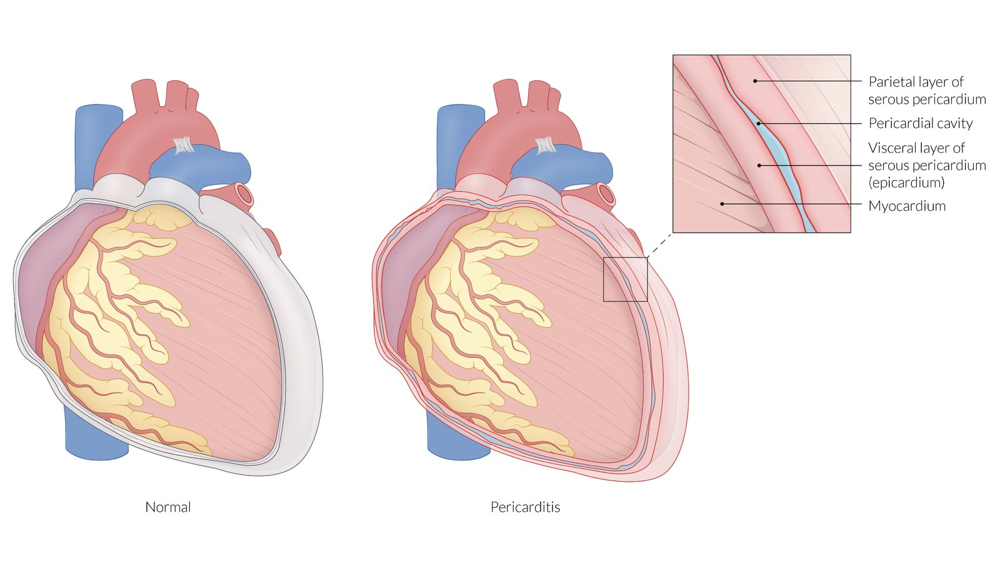

Acute pericarditis

---

## Etiology

* <u>Idiopathic</u>

* Infectious

* Most commonly viral (e.g., <u>coxsackie B virus</u>) [[6]](https://coursology-qbank.com/amboss/article/eBYx-r)

* Bacterial;  (e.g., <u>Staphylococcus</u> spp., <u>Streptococcus</u> spp., or <u>M. tuberculosis</u>)

* Fungal

* <u>Toxoplasmosis</u>

* <u>Myocardial infarction</u>

* <u>Postinfarction fibrinous pericarditis</u>:  within 1–3 days as an immediate reaction

* <u>Dressler syndrome</u>; : weeks to months after an <u>acute myocardial infarction</u>

* Postoperative (<u>postpericardiotomy syndrome</u>): due to blunt or sharp trauma to the <u>pericardium</u>

* <u>Uremia</u>: e.g., due to acute or <u>chronic renal failure</u>

* Radiation

* <u>Exudative</u> pericarditis: develops acutely during or after <u>radiation therapy</u> [[7]](https://coursology-qbank.com/amboss/article/Qb1ut20)

* <u>Constrictive pericarditis</u>: develops several years after <u>radiation therapy</u> [[8]](https://coursology-qbank.com/amboss/article/ib1Jt20)

* <u>Neoplasms</u> (e.g., <u>Hodgkin lymphoma</u>)

* <u>Autoimmune connective tissue diseases</u> (e.g., <u>rheumatoid arthritis</u>, systemic <u>lupus</u>, <u>scleroderma</u>)

* Trauma

* Following <u>mRNA</u> <u>vaccination</u> (e.g., <u>COVID-19 vaccination</u>)  [[9]](https://coursology-qbank.com/amboss/article/oFd0Q70)[[10]](https://coursology-qbank.com/amboss/article/GEdBC70)

Fibrinous pericarditis in uremia

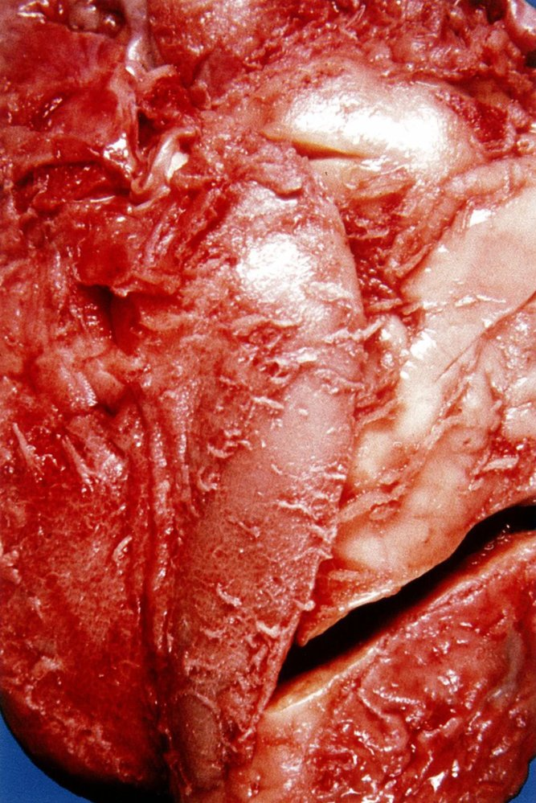

Fibrinous pericarditis

---

## Clinical features

### <u>Acute pericarditis</u> [[11]](https://coursology-qbank.com/amboss/article/kIYm1q)

* <u>Chest pain</u>

* Pleuritic chest pain

* Acute, sharp retrosternal <u>pain</u> caused by inflammation of the <u>parietal pleura</u>

* Typically aggravated by <u>coughing</u>, <u>swallowing</u>, or deep inspiration

* Other causes of <u>pleuritic chest pain</u> include <u>pulmonary embolism</u>, <u>myocardial infarction</u>, and <u>pneumothorax</u>.

* Improves on sitting and leaning forward

* Can radiate to the neck and shoulders (most commonly to the left side)

* Pericardial friction rub: high-pitched scratching on <u>auscultation</u>

* Indicates friction between the <u>visceral</u> and parietal <u>pericardial</u> tissue [[12]](https://coursology-qbank.com/amboss/article/HbbKEH)

* Best heard over the left sternal border during expiration while the patient is sitting up and leaning forward [[13]](https://coursology-qbank.com/amboss/article/sbbtEH)

* Occurs in atrial and ventricular <u>systole</u>, as well as early <u>diastole</u> [[14]](https://coursology-qbank.com/amboss/article/GbbBEH)

* Present in 85% of patients with <u>acute pericarditis</u>. [[15]](https://coursology-qbank.com/amboss/article/_dY5sL)

* <u>Pericardial effusion</u>

* Faint <u>heart sounds</u>

* <u>Ewart sign</u>

* Low-grade <u>intermittent fever</u>, <u>tachypnea</u>, <u>dyspnea</u>, nonproductive <u>cough</u>

> [!TIP]
> <u>Acute pericarditis</u> classically presents with sharp, retrosternal <u>chest pain</u> that is exacerbated by deep inspiration and lessened by sitting up or leaning forward. [[16]](https://coursology-qbank.com/amboss/article/6pYjqJ)[[17]](https://coursology-qbank.com/amboss/article/Jmcsg10)

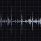

Pericardial Friction Rub Recording & Waveform | Eko Health

### <u>Chronic pericarditis</u>

#### <u>Constrictive pericarditis</u> [[6]](https://coursology-qbank.com/amboss/article/eBYx-r)[[11]](https://coursology-qbank.com/amboss/article/kIYm1q)

* Symptoms of <u>fluid overload</u> (i.e., backward failure)

* <u>Jugular vein distention</u>, ↑ jugular venous pressure

* Prominent <u>x descents</u> and <u>y descents</u> in <u>jugular venous pressure</u>  [[11]](https://coursology-qbank.com/amboss/article/kIYm1q)

* <u>Kussmaul sign</u>

* <u>Hepatic vein</u> congestion: <u>hepatomegaly</u>, painful <u>liver capsule</u> distention, <u>hepatojugular reflux</u>

* <u>Peripheral edema</u> or <u>anasarca</u>, <u>ascites</u> with abdominal discomfort

* Symptoms of reduced <u>cardiac output</u> (i.e., forward failure)

* Fatigue, <u>dyspnea on exertion</u>

* <u>Tachycardia</u>

* Pericardial knock: sudden cessation of <u>ventricular filling</u> during early <u>diastole</u> that is heard best at the left sternal border

* <u>Pulsus paradoxus</u>: decreased blood pressure amplitude by at least 10 mm Hg during deep inspiration   [[15]](https://coursology-qbank.com/amboss/article/_dY5sL)

> [!TIP]
> The majority of patients with <u>constrictive pericarditis</u> present with <u>symptoms of heart failure</u> (predominantly <u>dyspnea on exertion</u> and <u>edema</u>). [[18]](https://coursology-qbank.com/amboss/article/JEcs9V0)

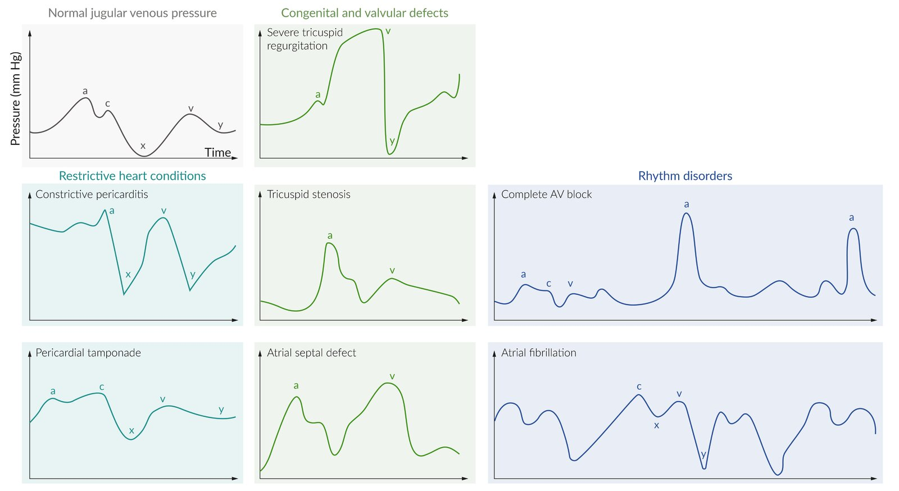

Jugular venous pressure waveforms in common cardiac conditions

#### <u>Effusive-constrictive pericarditis</u> [[5]](https://coursology-qbank.com/amboss/article/mFYViI)

<u>Effusive-constrictive pericarditis</u> is characterized by symptoms of chronic <u>constrictive pericarditis</u>, <u>pericardial effusion</u>, or a mixture of both.

* Smaller or slow-growing effusions: Patients may be asymptomatic.

* Large effusions or rapidly growing effusions: symptoms of <u>cardiac tamponade</u>

* <u>Beck triad</u>

* Dullness at the left base of the <u>lung</u> due to compression

---

## Subtypes and variants

### Purulent pericarditis

* Definition: infection of the <u>pericardium</u> with macroscopic or microscopic evidence of <u>pus</u> in the <u>pericardial space</u>

* Etiology

* Most commonly a complication of thoracic <u>surgery</u> or cardiac injury

* Typically caused by <u>Staphylococcus</u> spp., <u>Streptococcus</u> spp., or <u>Mycobacterium tuberculosis</u>

* Clinical features

* High <u>fever</u>, <u>tachycardia</u>

* <u>Chest pain</u>

* <u>Dyspnea</u>, <u>cough</u>

* Diagnosis

* <u>Physical examination</u>: <u>pericardial friction rub</u> and/or faint <u>heart sounds</u> on <u>auscultation</u>

* <u>ECG</u>: See “<u>ECG features of pericarditis</u>” below.

* <u>Echocardiography</u>: <u>pericardial effusion</u>

* Pathology: gross <u>pus</u> or microscopic evidence of <u>purulence</u> in the <u>pericardial space</u>

* Management

* <u>Pericardiocentesis</u> to evacuate <u>pericardial effusion</u>; order cultures of <u>pericardial</u> fluid and blood

* Empiric intravenous <u>antibiotic therapy</u> (e.g., <u>vancomycin</u>, <u>ceftriaxone</u>, or <u>meropenem</u>) that is subsequently adjusted according to <u>antibiotic sensitivities</u>

* In case of <u>loculations</u>: surgical drainage and/or <u>intrapericardial fibrinolysis</u>

---

## Diagnosis

### <u>Acute pericarditis</u> [[6]](https://coursology-qbank.com/amboss/article/eBYx-r)

#### Approach

* Check <u>ECG</u>, <u>TTE</u> to determine if diagnostic criteria are met.

* If <u>TTE</u> is inconclusive, consider CT or <u>cardiac MRI</u> to confirm <u>pericardial</u> inflammation/effusion.

* Determine whether any further diagnostic evaluation is indicated based on suspected etiology (see “Additional diagnostic evaluation” below).

> [!WARNING]
> Rule out other <u>causes of acute chest pain</u> (e.g., <u>myocardial infarction</u>, <u>myocarditis</u>) before making a diagnosis of <u>acute pericarditis</u>. [[17]](https://coursology-qbank.com/amboss/article/Jmcsg10)

#### Diagnostic criteria for acute pericarditis [[5]](https://coursology-qbank.com/amboss/article/mFYViI)

At least two of the following four criteria must be present for a diagnosis of <u>acute pericarditis</u>:

* Characteristic <u>chest pain</u>

* <u>Pericardial friction rub</u>

* Typical <u>ECG features of pericarditis</u>

* New or worsening <u>pericardial effusion</u>

#### ECG features of pericarditis

Not all patients go through all stages and manifestations may vary. In particular, pericarditis due to <u>uremia</u> may not involve characteristic <u>ECG</u> changes. [[19]](https://coursology-qbank.com/amboss/article/iBYJ07)

* Stage 1: diffuse <u>ST elevations</u>; , <u>ST depression</u> in aVR and V1, <u>PR segment</u> <u>depression</u>

* Stage 2: <u>ST segment</u> normalizes in ∼ 1 week.

* Stage 3: inverted <u>T waves</u>

* Stage 4: <u>ECG</u> returns to normal baseline (as prior to onset of pericarditis) after weeks to months.

> [!TIP]
> In contrast to <u>myocardial infarction</u>, pericarditis is characterized by a diffuse distribution of <u>ST elevations</u> on <u>ECG</u>. See also “<u>Differential diagnoses of ST elevations on ECG</u>.”

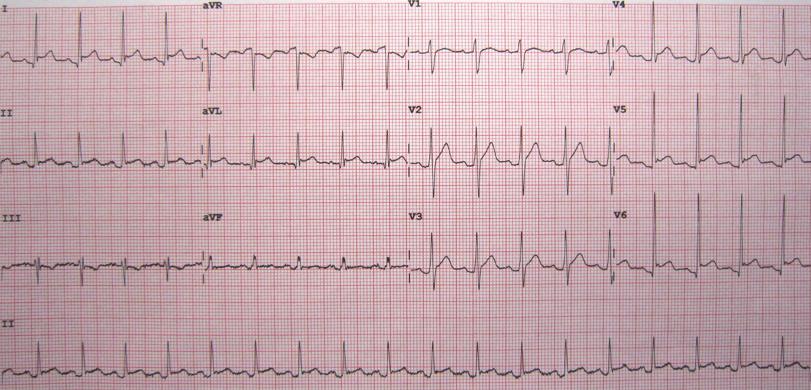

Acute pericarditis

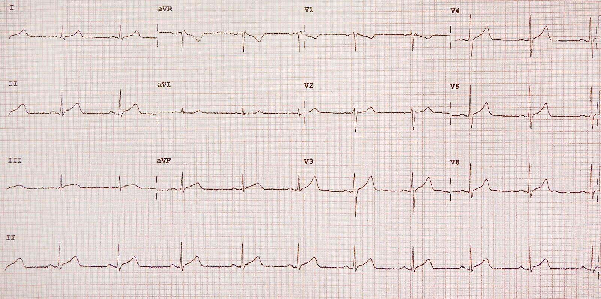

Acute pericarditis

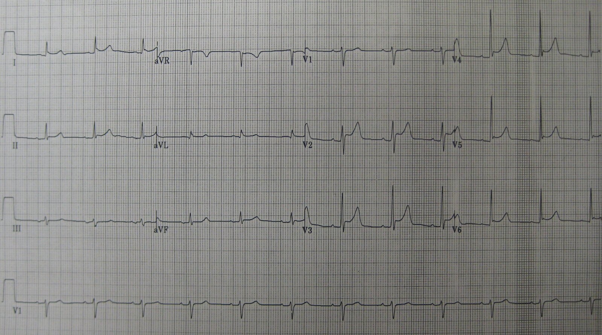

Pericarditis

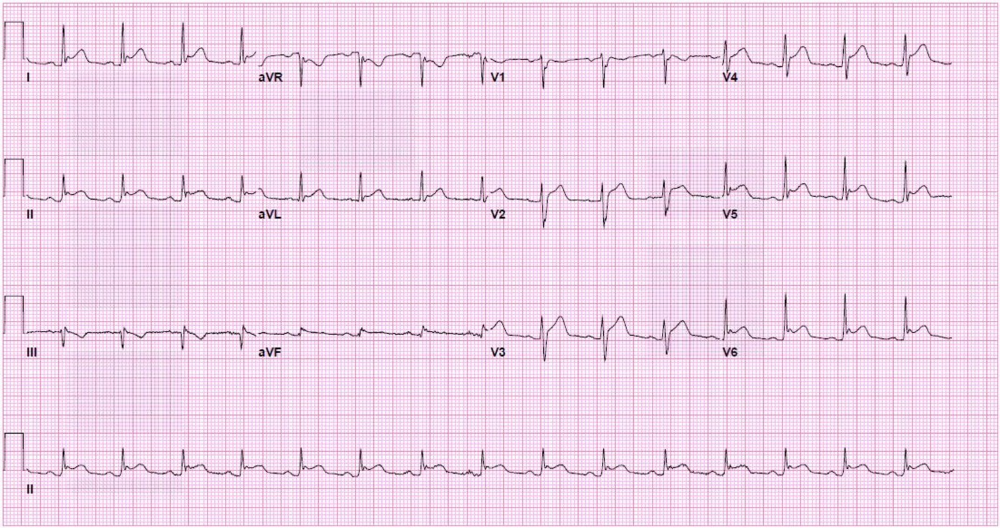

Acute pericarditis

#### Imaging [[5]](https://coursology-qbank.com/amboss/article/mFYViI)[[6]](https://coursology-qbank.com/amboss/article/eBYx-r)

The goal of imaging is to identify any new <u>pericardial effusion</u> and rule out alternative etiologies.

* <u>Echocardiography</u>

* Indications: considered first-line study to evaluate for <u>pericardial</u> disease [[5]](https://coursology-qbank.com/amboss/article/mFYViI)[[6]](https://coursology-qbank.com/amboss/article/eBYx-r)

* Findings: <u>pericardial</u> effusion may be present, often normal

* See “Subxiphoid view” of the “<u>FAST scan</u>” in “<u>Point-of-care ultrasound</u>” for a technique to screen for <u>pericardial effusions</u> at the bedside.

* <u>Cardiac MRI</u>

* Indications: Consider if diagnosis is uncertain; preferred imaging modality to assess <u>pericardium</u>. [[5]](https://coursology-qbank.com/amboss/article/mFYViI)

* Findings

* Thickened <u>pericardium</u>, <u>pericardial</u> <u>enhancement</u>, <u>pericardial effusion</u>  [[20]](https://coursology-qbank.com/amboss/article/0bbeHH)

* May show associated <u>myocarditis</u> [[20]](https://coursology-qbank.com/amboss/article/0bbeHH)

* <u>CT scan</u> with IV contrast

* Indications: Consider if the diagnosis is uncertain.

* Findings: thickened <u>pericardial</u> layers, <u>pericardial effusion</u>

* <u>Chest x-ray</u>: usually normal; may show an enlarged <u>cardiac silhouette</u>

> [!TIP]
> <u>Echocardiography</u> is often normal in patients with pericarditis but is needed to rule out <u>pericardial tamponade</u> and <u>pericardial</u> constriction. [[17]](https://coursology-qbank.com/amboss/article/Jmcsg10)

> [!WARNING]
> <u>Cardiac tamponade</u> can occur with relatively small <u>pericardial effusions</u> if <u>pericardial</u> fluid accumulation is rapid. [[21]](https://coursology-qbank.com/amboss/article/H6YKmJ)

Pericardial effusion

AMBOSS POCUS series | Pericardial effusion

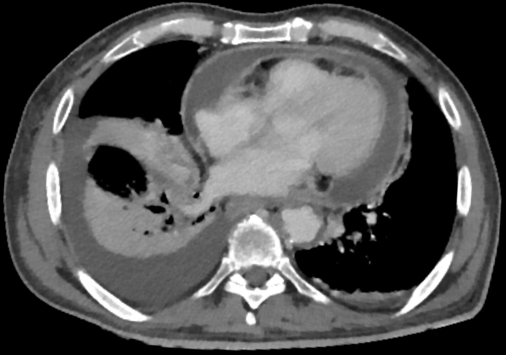

Pericarditis

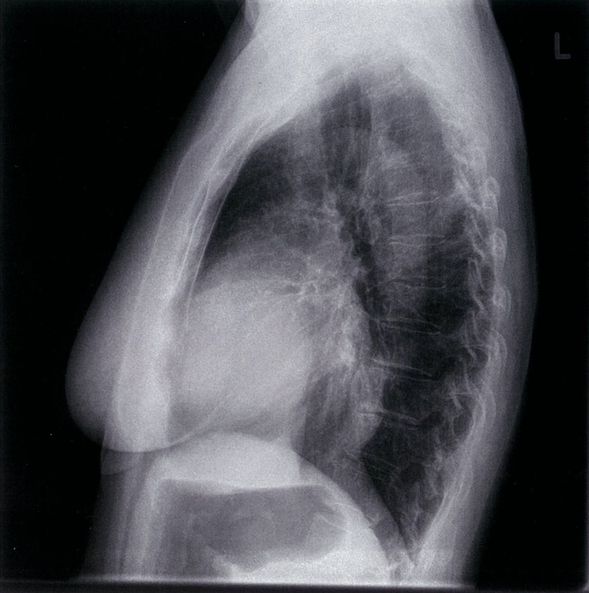

Pericardial effusion

#### <u>Laboratory studies</u>

Elevation of <u>inflammatory markers</u> may support the <u>diagnosis of pericarditis</u> but are not considered to be a part of the diagnostic criteria. [[5]](https://coursology-qbank.com/amboss/article/mFYViI)

* <u>CBC</u>: <u>leukocytosis</u>

* ↑ <u>Troponin I</u>

* ↑ <u>ESR</u>

* ↑ <u>CRP</u>

* ↑ <u>Creatinine</u> <u>kinase</u>

> [!TIP]
> <u>Troponin</u> elevation is not predictive of negative outcomes in pericarditis but does suggest some degree of <u>myocarditis</u>. Significant elevation should raise concern for <u>acute coronary syndrome</u>. [[22]](https://coursology-qbank.com/amboss/article/Zb1ZH20)

#### Additional diagnostic evaluation

* <u>Pericardiocentesis</u> with <u>pericardial fluid analysis</u> [[15]](https://coursology-qbank.com/amboss/article/_dY5sL)

* Indications: large effusion, tamponade, suspected malignant or <u>purulent pericarditis</u> [[6]](https://coursology-qbank.com/amboss/article/eBYx-r)

* Investigations depend on suspected etiology.

* <u>Gram stain</u>

* <u>Bacterial culture</u>

* <u>Acid-fast bacilli smear microscopy</u> and culture

* <u>Polymerase chain reaction</u>

* <u>Cytology</u>

* Additional workup based on suspected etiology

* <u>Uremic pericarditis</u>: <u>BUN</u>, <u>creatinine</u>, <u>electrolytes</u>

* Bacterial pericarditis: <u>blood cultures</u> (2 sets)

* <u>Tuberculous pericarditis</u>: <u>interferon-γ</u> release assay, <u>HIV test</u>

* Autoimmune pericarditis: <u>ANA</u>, <u>rheumatoid factor</u>

### <u>Chronic pericarditis</u>

The diagnostic approach and findings for <u>chronic pericarditis</u> are similar to <u>acute pericarditis</u> but <u>ECG</u>, <u>echocardiography</u>, and imaging findings may vary.

* Additional <u>laboratory studies</u>

* <u>BNP</u>: normal  [[23]](https://coursology-qbank.com/amboss/article/-YbD7H)

* <u>LFT</u>: may show <u>elevated transaminases</u> and low <u>albumin</u>  [[24]](https://coursology-qbank.com/amboss/article/ZbbZHH)

* Investigation of the underlying cause: See “Additional diagnostic evaluation” above.

#### <u>Constrictive pericarditis</u> [[6]](https://coursology-qbank.com/amboss/article/eBYx-r)[[11]](https://coursology-qbank.com/amboss/article/kIYm1q)

The diagnosis of <u>constrictive pericarditis</u> is based on characteristic imaging findings (most commonly <u>echocardiography</u> but <u>MRI</u> and CT may be used).

* <u>Echocardiography</u>

* ↑ <u>Pericardial</u> thickness

* Abnormal <u>ventricular filling</u> with sudden halt during early <u>diastole</u>

* Variation in <u>ventricular filling</u> with inspiration

* Across the <u>tricuspid valve</u>: The <u>velocity</u> of blood flow increases.

* Across the <u>mitral valve</u>: The <u>velocity</u> of blood flow decreases.

* Moderate <u>biatrial enlargement</u> [[25]](https://coursology-qbank.com/amboss/article/tbbXvH)

* Excludes <u>right ventricular hypertrophy</u> and <u>cardiomyopathy</u>

* Imaging

* CT and <u>cardiac MRI</u>

* <u>Pericardial</u> thickening > 2 mm

* Calcifications

* Normal <u>cardiac silhouette</u>

* Chest <u>x-ray</u> (PA and <u>lateral</u> views) [[24]](https://coursology-qbank.com/amboss/article/ZbbZHH)

* <u>Heart</u> size: normal or slightly increased

* <u>Pericardial</u> calcifications

* Clear <u>lung</u> fields

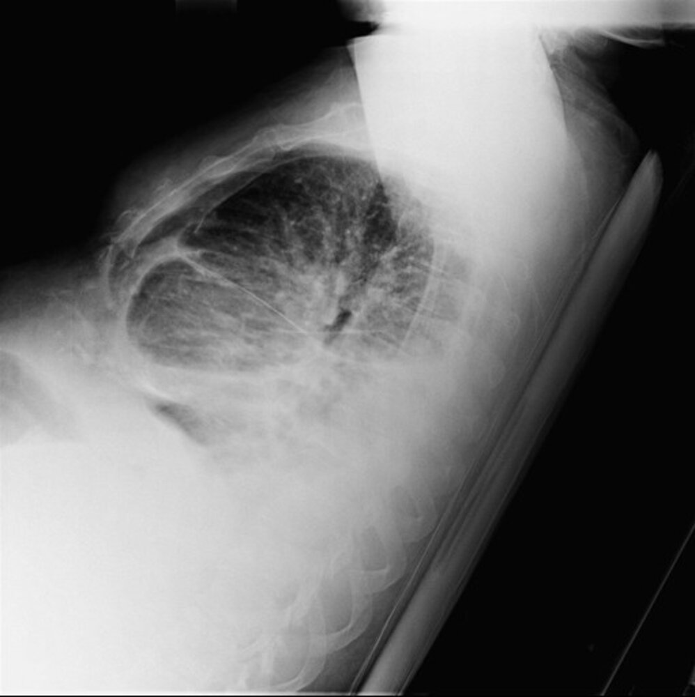

Pericardial thickening and calcification

Constrictive pericarditis

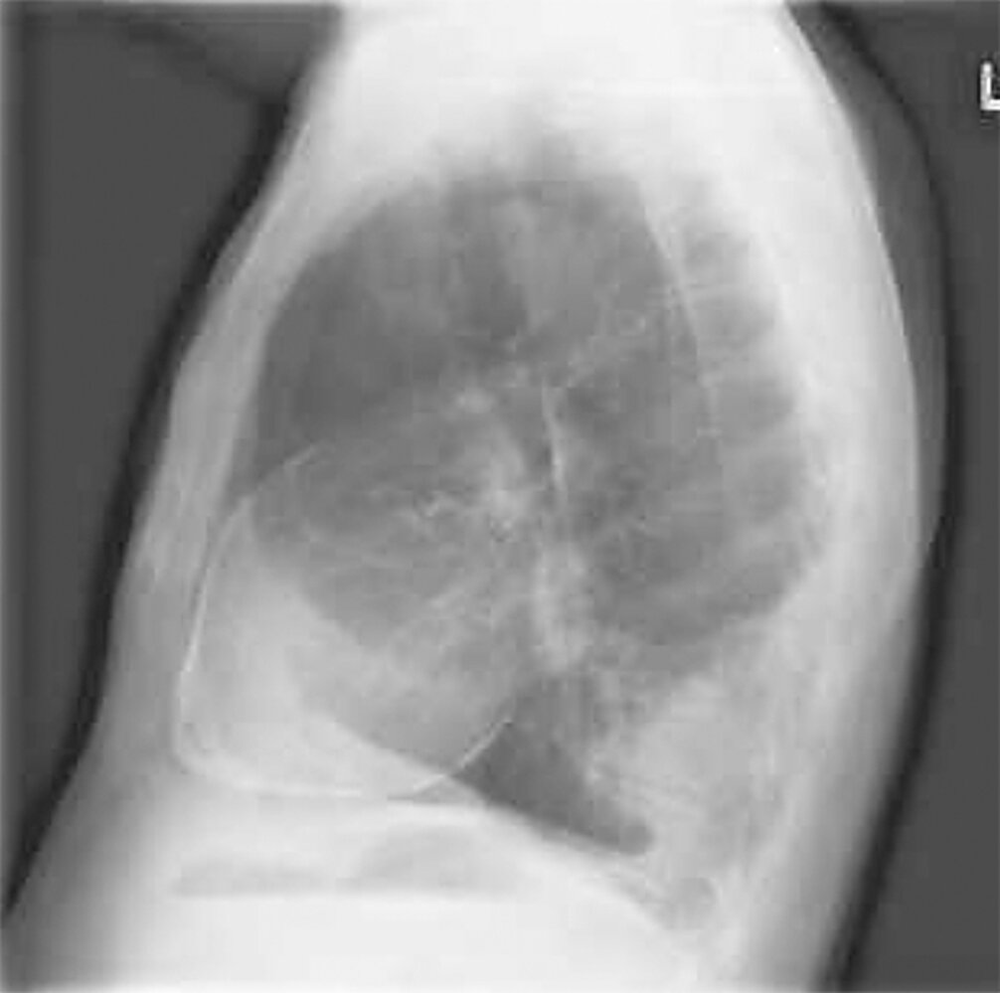

Calcific pericarditis

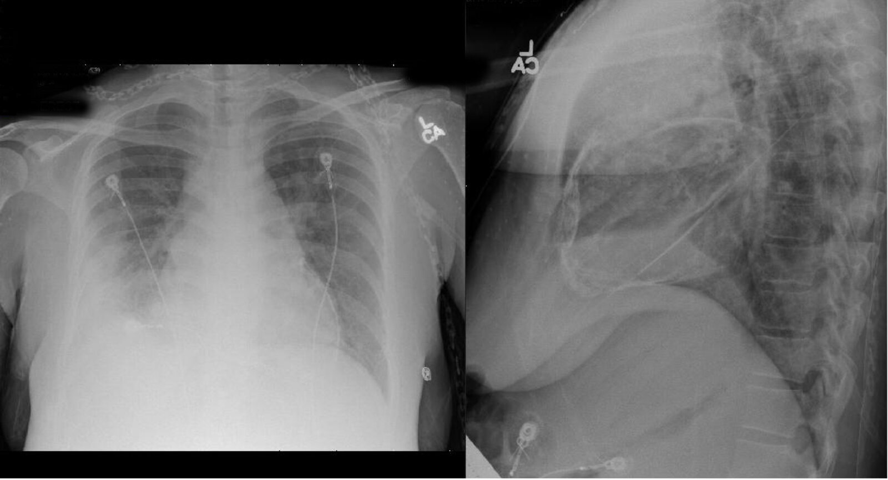

* <u>Cardiac catheterization</u>

* Indications: if noninvasive methods have failed to provide a definitive diagnosis [[5]](https://coursology-qbank.com/amboss/article/mFYViI)

* Findings [[26]](https://coursology-qbank.com/amboss/article/yebdYG)

* Similar pressures in the left and <u>right atria</u> and <u>right ventricle</u> at the end of <u>diastole</u> (e.g., “equalization of pressures”)

* Normal <u>pulmonary artery systolic pressure</u> < 40 mm Hg

* Mean right arterial pressure > 15 mm Hg

* Square root sign [[5]](https://coursology-qbank.com/amboss/article/mFYViI)

* Also known as dip-and-plateau waveform

* Sudden dip in the right and <u>left ventricular</u> pressure in early <u>diastole</u> followed by a plateau during the last stage of <u>diastole</u>

* <u>ECG</u>

* No conclusive findings: generalized flat/inverted <u>T waves</u>, <u>low QRS voltage</u>

* <u>Atrial fibrillation</u> can occur in severe disease. [[27]](https://coursology-qbank.com/amboss/article/hBYc07)

#### <u>Effusive-constrictive pericarditis</u>

The diagnostic findings of effusive-constrictive pericarditis are similar to those of <u>pericardial effusion</u>, with the exception that in addition to <u>pericardial effusion</u>, <u>pericardial</u> thickening may also be seen. Elevation of right atrial pressures despite <u>pericardiocentesis</u> is strongly suggestive of effusive-constrictive. [[28]](https://coursology-qbank.com/amboss/article/UBYbZ7)

* <u>Echocardiography</u>, CT, and/or <u>cardiac MRI</u>: <u>pericardial effusion</u> ; <u>pericardial</u> thickening may also be present [[29]](https://coursology-qbank.com/amboss/article/2BYTZ7)[[30]](https://coursology-qbank.com/amboss/article/gBYFZ7)

* <u>Pericardiocentesis</u> with <u>cardiac catheterization</u>: <u>right atrial pressure</u> remains persistently elevated after <u>pericardiocentesis</u>.  [[5]](https://coursology-qbank.com/amboss/article/mFYViI)

* Other findings consistent with <u>pericardial effusion</u>

* <u>ECG</u>: Low <u>ECG</u> <u>voltage</u> and <u>electrical alternans</u> may be present.

* Chest <u>x-ray</u> (PA and <u>lateral</u> views) [[5]](https://coursology-qbank.com/amboss/article/mFYViI)[[31]](https://coursology-qbank.com/amboss/article/fBYkZ7)

* PA: may show a globular-shaped <u>heart</u> and sharp cardiophrenic angles

* <u>Lateral</u>: may show the “fat pad” sign

* See also “Diagnostics” in <u>pericardial effusion</u>.

---

## Treatment

The mainstays of therapy include anti-inflammatories to control <u>pain</u> and prevent a recurrence, and treatment of the underlying cause (if found).

### Medical therapy

<u>Acute pericarditis</u> is often <u>self-limited</u> but <u>NSAIDs</u> can alleviate symptoms and prevent a recurrence. Consider anti-inflammatory therapy also for <u>chronic pericarditis</u> (transient <u>constrictive pericarditis</u> may respond). [[15]](https://coursology-qbank.com/amboss/article/_dY5sL)

### Pharmacotherapy

* <u>NSAID</u> therapy  

* <u>Aspirin</u> DOSAGE

* <u>Ibuprofen</u> DOSAGE

* <u>Indomethacin</u> DOSAGE

* Consider <u>colchicine</u>;  (<u>off-label</u>) DOSAGE in combination with <u>NSAIDs</u> or as a monotherapy.   [[5]](https://coursology-qbank.com/amboss/article/mFYViI)

* Only consider <u>prednisone</u> DOSAGE  in severe cases or in pericarditis caused by <u>uremia</u>, <u>connective tissue disease</u>, or autoreactivity.

* Consider gastroprotective therapy (e.g., <u>omeprazole</u> DOSAGE) in patients at risk for <u>GI bleeding</u>

#### Supportive therapy

* Treat any known underlying causes. 

* <u>Antibiotics</u> for bacterial causes

* <u>Tuberculosis therapy</u>

* <u>Immunosuppressants</u> in autoimmune disease

* Dialysis (in the case of <u>uremia</u>)

* Restrict physical activity in patients with <u>acute pericarditis</u>. [[5]](https://coursology-qbank.com/amboss/article/mFYViI)[[32]](https://coursology-qbank.com/amboss/article/jBY_07)

* Nonathletes: until symptoms have resolved and <u>CRP</u> has normalized

* Athletes: until symptoms have resolved, <u>CRP</u> has normalized, and <u>ECG</u> and <u>echocardiogram</u> findings have normalized

* Initiate <u>treatment of heart failure</u> if present. [[5]](https://coursology-qbank.com/amboss/article/mFYViI)[[33]](https://coursology-qbank.com/amboss/article/bbbHHH)

* <u>Diuretics</u>, e.g., <u>furosemide</u> DOSAGE

* <u>Sodium</u> restriction < 2 g/day

* Treatment of concurrent <u>atrial fibrillation</u> with <u>digoxin</u> DOSAGE

#### Special circumstances [[17]](https://coursology-qbank.com/amboss/article/Jmcsg10)

* <u>Postmyocardial infarction pericarditis</u>: Avoid <u>NSAIDs</u> other than <u>aspirin</u>.  [[34]](https://coursology-qbank.com/amboss/article/AY1R720)

* <u>Perimyocarditis</u>: Consider lower doses of <u>NSAIDs</u> , adding a <u>beta blocker</u> , and the avoidance of strenuous physical activity for 6 months.  [[22]](https://coursology-qbank.com/amboss/article/Zb1ZH20)

* <u>Constrictive pericarditis</u> with effusion: Use caution when sedating patients or initiating <u>positive pressure ventilation</u>. [[35]](https://coursology-qbank.com/amboss/article/rEcfCV0)

* <u>Cardiac output</u> may drop precipitously with even small changes in <u>preload</u>, <u>afterload</u>, or <u>heart rate</u>.

* <u>Ketamine</u>, <u>midazolam</u>, and <u>etomidate</u> are the preferred <u>anesthetic</u> <u>agents for procedural sedation</u>.

> [!WARNING]
> Administration of sedatives and/or the initiation of <u>positive pressure ventilation</u> may precipitate hemodynamic collapse in patients with <u>constrictive pericarditis</u> or <u>effusive-constrictive pericarditis</u>. [[35]](https://coursology-qbank.com/amboss/article/rEcfCV0)[[36]](https://coursology-qbank.com/amboss/article/7Ec4CV0)

> [!WARNING]
> <u>Beta blockers</u> and <u>calcium channel blockers</u> should be avoided in <u>constrictive pericarditis</u>, as they may worsen <u>heart failure</u> by slowing a compensatory <u>tachycardia</u>!

### Surgical therapy

* <u>Pericardiocentesis</u>: indicated for <u>cardiac tamponade</u>, large <u>pericardial effusion</u>, acute management of effusive-constrictive pericarditis [[5]](https://coursology-qbank.com/amboss/article/mFYViI)

* Pericardiectomy: complete removal of the <u>pericardium</u> [[5]](https://coursology-qbank.com/amboss/article/mFYViI)[[28]](https://coursology-qbank.com/amboss/article/UBYbZ7)[[37]](https://coursology-qbank.com/amboss/article/6BYjb7)

* Indications: constrictive or effusive-constrictive pericarditis with persistent <u>symptoms of heart failure</u> (<u>NYHA</u> class III or IV)

* Contraindications

* Mild disease

* Very advanced/end-stage <u>constrictive pericarditis</u>

* Radiation-induced <u>constrictive pericarditis</u>

* Risks: <u>mortality rate</u> 6–12% [[5]](https://coursology-qbank.com/amboss/article/mFYViI)

### Disposition [[5]](https://coursology-qbank.com/amboss/article/mFYViI)[[11]](https://coursology-qbank.com/amboss/article/kIYm1q)[[15]](https://coursology-qbank.com/amboss/article/_dY5sL)[[38]](https://coursology-qbank.com/amboss/article/oBY0b7)

* <u>Acute pericarditis</u>

* Most well patients with no indicators of poor prognosis can be managed on an outpatient basis.

* Consider inpatient admission for the following:

* Indicators of poor prognosis in <u>acute pericarditis</u> are present. [[5]](https://coursology-qbank.com/amboss/article/mFYViI)

* <u>Fever</u> > 38°C

* Subacute onset

* Large <u>pericardial effusion</u> (> 20 mm on <u>echocardiography</u>) [[17]](https://coursology-qbank.com/amboss/article/Jmcsg10)

* <u>Immunosuppression</u>

* <u>Anticoagulant</u> therapy

* Elevated <u>troponin</u>

* Recurrent pericarditis

* Signs of hemodynamic compromise (e.g., <u>hypotension</u>, <u>jugular venous distention</u>)

* No response to <u>NSAIDs</u> after one week

* Suspicion of specific etiologies (e.g., <u>tuberculosis</u>, <u>malignancy</u>, or bacterial infection)

* <u>Chronic pericarditis</u>: Consider admission in patients who have symptoms of <u>congestive heart failure</u>, or in whom further diagnostic evaluation is necessary.

---

## Complications

* <u>Constrictive pericarditis</u>

* <u>Cardiac tamponade</u>

We list the most important complications. The selection is not exhaustive.

---