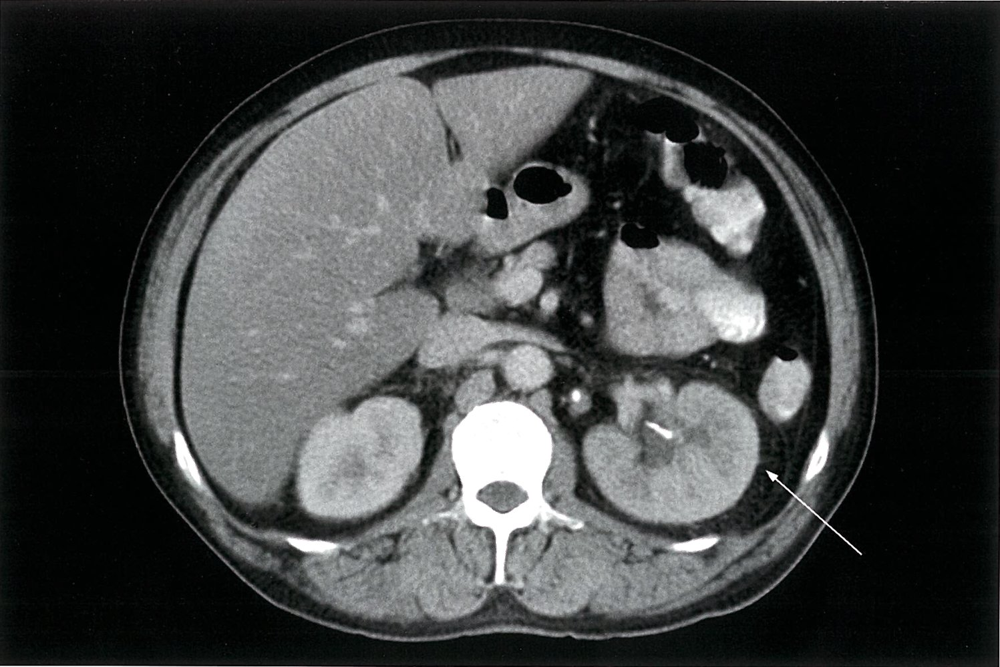

# Perinephric abscess

*Categories: Clinical knowledge > Emergency medicine > Infectious diseases > Perinephric abscess*

[Original Article Link](https://coursology-qbank.com/amboss/article/si0tGf)

---

## Summary

A perinephric <u>abscess</u> is a <u>purulent</u> infection located in the perinephric space between the <u>kidney</u> and the <u>Gerota fascia</u>. It is typically secondary to acute <u>pyelonephritis</u> but may also be caused by the hematogenous spread of bacteria from elsewhere in the body (e.g., in individuals who inject drugs). <u>Risk factors</u> include <u>diabetes mellitus</u>, <u>pregnancy</u>, and <u>urinary tract obstruction</u> or abnormalities. Perinephric <u>abscess</u> typically has an insidious onset, with nonspecific symptoms that include flank or abdominal <u>pain</u>, <u>fever</u>, chills, and <u>dysuria</u>. <u>Costovertebral angle tenderness</u> is often present on examination. Abdominal CT is the preferred method for confirming the diagnosis. <u>Abscess</u> drainage and <u>antibiotic therapy</u> are the cornerstones of treatment. <u>Antibiotic therapy</u> alone may be considered in select patients with small <u>abscesses</u> (< 3 cm). Complications include extension of the <u>abscess</u> beyond the <u>Gerota fascia</u>, into the <u>retroperitoneum</u> (<u>paranephric abscess</u>), then <u>sepsis</u>.

---

## Etiology

* Route of infection

* Most commonly due to local spread of infection in patients with acute <u>pyelonephritis</u>

* Hematogenous spread of infection from elsewhere in the body

* Pathogens

* Most commonly <u>Enterobacteriaceae</u> (gram-negative rods)

* <u>Escherichia coli</u>

* <u>Klebsiella pneumoniae</u>

* Gram-positive bacteria (<u>Staphylococcus aureus</u>)  [[1]](https://coursology-qbank.com/amboss/article/_OY5E6)

* <u>Candida</u> infection (especially in <u>immunocompromised</u> patients and patients with <u>diabetes</u>) [[2]](https://coursology-qbank.com/amboss/article/zOYrE6)

* <u>Risk factors</u>

* Metabolic: <u>diabetes mellitus</u> (30–45% of patients with a perinephric <u>abscess</u> are diabetic)  [[3]](https://coursology-qbank.com/amboss/article/-OYDE6)

* Infection: conditions that predispose individuals to <u>urinary tract infection</u> and <u>pyelonephritis</u>, such as <u>pregnancy</u> (see <u>pyelonephritis in pregnancy</u>)

* Obstruction: <u>urinary tract obstruction</u>, e.g., <u>nephrolithiasis</u>, or abnormality, e.g., <u>vesicoureteral reflux</u>

* <u>Iatrogenic</u>: <u>surgery</u> (e.g., <u>renal transplantation</u>)

---

## Clinical features

Onset is often insidious and symptoms are nonspecific, but they may include:

* <u>Constitutional symptoms</u> (e.g., <u>fever</u>, chills, fatigue)

* Flank <u>pain</u>, abdominal <u>pain</u>, and/or <u>back pain</u>, with <u>costovertebral angle tenderness</u> on examination (usually unilateral)

* <u>Dysuria</u> as well as other <u>symptoms of cystitis</u> (e.g., increased <u>urinary frequency</u>, urgency)

* Palpable unilateral flank mass

---

## Diagnosis

### Approach [[4]](https://coursology-qbank.com/amboss/article/K01US20)[[5]](https://coursology-qbank.com/amboss/article/601jS20)

* Suspect perinephric <u>abscess</u> in patients with:

* Concerning clinical features

* <u>Pyelonephritis</u> that does not improve with <u>antibiotics</u>

* Obtain imaging of the abdomen to confirm the diagnosis.

* Obtain cultures (blood, urine, drainage if possible) to identify the <u>pathogen</u> and guide treatment.

> [!TIP]
> Perinephric <u>abscess</u> is only correctly diagnosed on presentation in approximately one-third of patients. A low threshold for imaging is recommended. [[6]](https://coursology-qbank.com/amboss/article/cT1apT0)

### <u>Laboratory studies</u> [[4]](https://coursology-qbank.com/amboss/article/K01US20)[[5]](https://coursology-qbank.com/amboss/article/601jS20)

Routine <u>laboratory studies</u> are not required for diagnosis but may show the following nonspecific findings.

* Routine studies

* <u>CBC</u>: ↑ <u>WBC</u>, ↓ <u>Hb</u>

* <u>BMP</u>: ↑ <u>creatinine</u>, ↑ <u>BUN</u>, ↓ <u>GFR</u>

* <u>Inflammatory markers</u>: ↑ <u>CRP</u>, ↑ <u>ESR</u>

* <u>Urinalysis</u>: <u>urinalysis findings of UTI</u> (e.g., <u>pyuria</u>, <u>bacteriuria</u>, <u>hematuria</u>), <u>proteinuria</u>

* Cultures 

* <u>Blood cultures</u>

* <u>Urine cultures</u>

* <u>Abscess</u> cultures (from <u>perinephric abscess drainage</u>)

### Imaging [[4]](https://coursology-qbank.com/amboss/article/K01US20)[[7]](https://coursology-qbank.com/amboss/article/o010S20)

* <u>Ultrasound kidneys</u> and <u>retroperitoneum</u>

* Often used as an initial study

* Findings: <u>hypoechoic</u> or <u>anechoic</u>, thick and/or irregular-walled structure that may be multiloculated

* CT abdomen and <u>pelvis</u> with contrast (preferred)

* Indications

* Confirmation of diagnosis and follow-up evaluation

* Exclusion of other diagnoses (e.g., <u>urinoma</u>)

* Assessment of the extent of infection and involvement of adjacent structures (e.g., <u>psoas</u>, <u>pelvis</u>, <u>liver</u>)

* Findings [[8]](https://coursology-qbank.com/amboss/article/J01sS20)

* <u>Hypodense</u> perinephric space with <u>rim enhancement</u>

* Thickened septa and perinephric <u>fascia</u>

* <u>Fat stranding</u>

* Gas <u>inclusions</u> (in <u>emphysematous</u> infections)

* <u>MRI</u> abdomen: indications and findings similar to CT

Acute pyelonephritis and renal calculi

---

## Treatment

There is limited recent, high-quality literature on the management of perinephric <u>abscess</u>. Treatment decisions should be made in consultation with urology, interventional radiology, and infectious diseases.

### Approach [[4]](https://coursology-qbank.com/amboss/article/K01US20)[[7]](https://coursology-qbank.com/amboss/article/o010S20)

* Arrange <u>abscess</u> drainage as indicated for most patients.

* Start intravenous <u>empiric antibiotic treatment</u> as soon as possible, ideally after obtaining cultures.

* Identify and treat underlying diseases and <u>risk factors</u>, e.g.:

* <u>Obstructive uropathy</u>: may require <u>percutaneous nephrostomy</u>

* <u>Urolithiasis</u>: Treat in patients with <u>renal obstruction</u> due to <u>urinary stones</u> (e.g., with <u>percutaneous nephrolithotomy</u>)

* <u>Nephrectomy</u> may be required in some patients with persistent infection and extensive <u>kidney</u> damage. [[7]](https://coursology-qbank.com/amboss/article/o010S20)

> [!WARNING]
> If possible, drain the <u>abscess</u> and obtain cultures prior to starting <u>empiric antibiotics</u>. If drainage is not immediately feasible, start <u>antibiotic</u> treatment without delay.

> [!TIP]
> Management of perinephric <u>abscess</u> is similar to that of renal abscess. For small renal <u>abscesses</u>, there is strong evidence for, and clear guidance on, <u>conservative management</u>. [[7]](https://coursology-qbank.com/amboss/article/o010S20)

### <u>Antibiotic</u> treatment [[4]](https://coursology-qbank.com/amboss/article/K01US20)[[7]](https://coursology-qbank.com/amboss/article/o010S20)[[9]](https://coursology-qbank.com/amboss/article/Rf1lNT0)

Most recommendations are based on early studies; choose treatment in consultation with a specialist.

* <u>Empiric antibiotic treatment</u> should cover common pathogens, i.e., <u>gram-negative organisms</u> (including <u>Enterobacteriaceae</u>) and <u>S. aureus</u>

* Example regimen: <u>piperacillin/tazobactam</u> DOSAGE with or without <u>gentamicin</u> DOSAGE [[4]](https://coursology-qbank.com/amboss/article/K01US20)[[6]](https://coursology-qbank.com/amboss/article/cT1apT0)[[10]](https://coursology-qbank.com/amboss/article/1T12pT0)

* Consider adding <u>vancomycin</u> DOSAGE if <u>MRSA</u> is suspected.

* Other agents used in <u>empiric antibiotic therapy for complicated pyelonephritis</u> may be used.

* Switch to directed <u>antibiotics</u> once culture results are available.

* Determine the duration of <u>antibiotic</u> treatment based on clinical response.

### Perinephric abscess drainage [[4]](https://coursology-qbank.com/amboss/article/K01US20)[[7]](https://coursology-qbank.com/amboss/article/o010S20)

* Indicated for most patients for diagnostic and therapeutic purposes.

* <u>Antibiotic</u> treatment alone may be sufficient for the treatment of small <u>abscesses</u> (< 3 cm).  [[6]](https://coursology-qbank.com/amboss/article/cT1apT0)[[10]](https://coursology-qbank.com/amboss/article/1T12pT0)

* Preferred method: percutaneous drainage (guided by CT or <u>ultrasound</u>)

* Surgical drainage may be indicated in certain situations, e.g.:

* Percutaneous approach fails or is contraindicated

* Large <u>abscess</u>

* Multiloculated <u>abscess</u>

> [!NOTE]
> “Ubi <u>pus</u>, ibi evacua” (Latin aphorism): Where there is <u>pus</u>, evacuate it.

---

## Complications

* Paranephric abscess

* Rupture of the <u>Gerota fascia</u>, leading to the secondary spread of <u>purulent</u> infection into the <u>retroperitoneum</u>

* Treatment: as with perinephric <u>abscess</u>

* <u>Sepsis</u> (<u>urosepsis</u>)

We list the most important complications. The selection is not exhaustive.

---