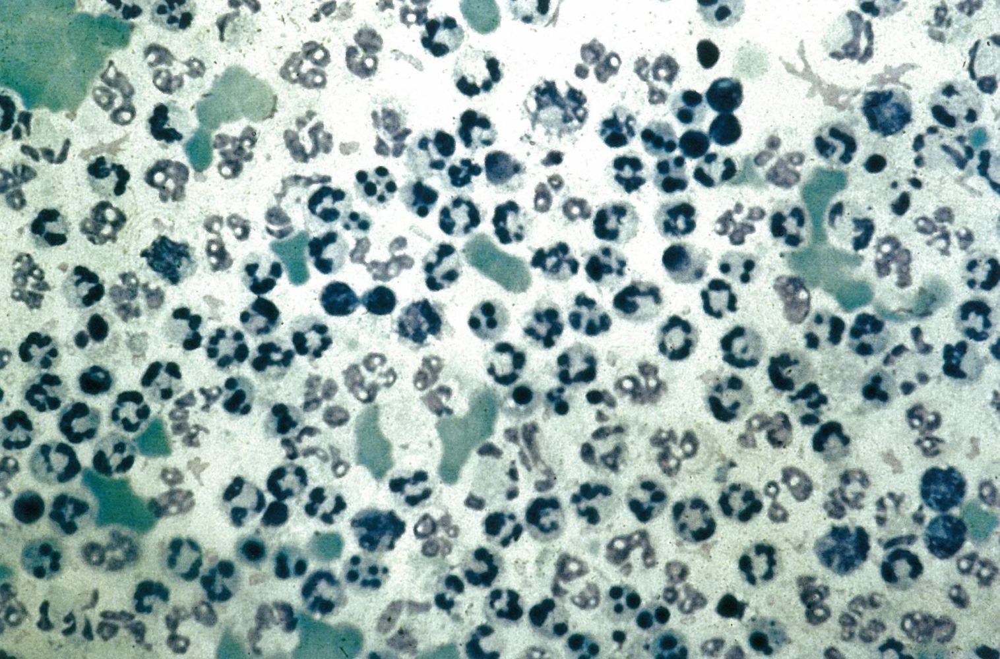
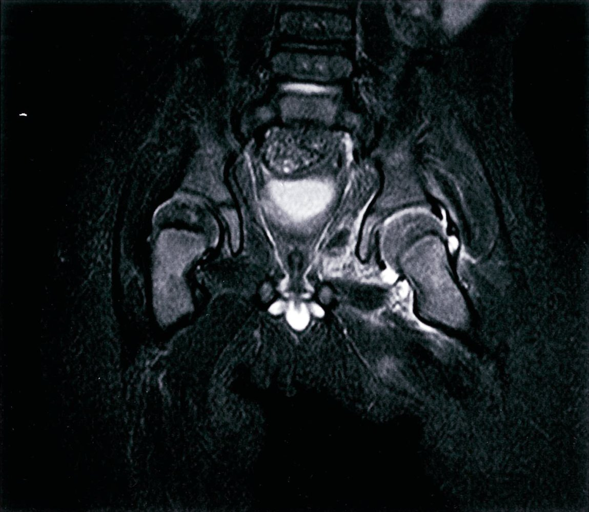
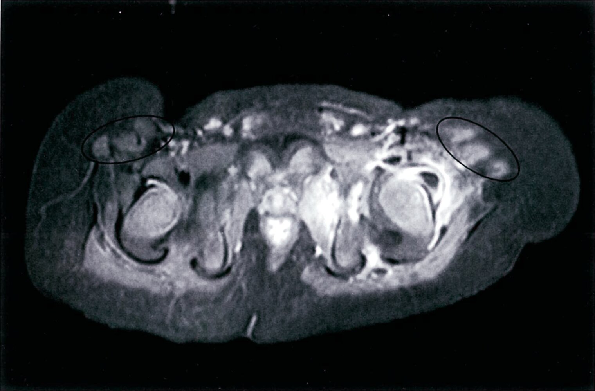
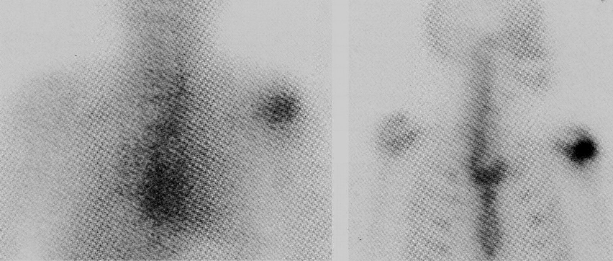
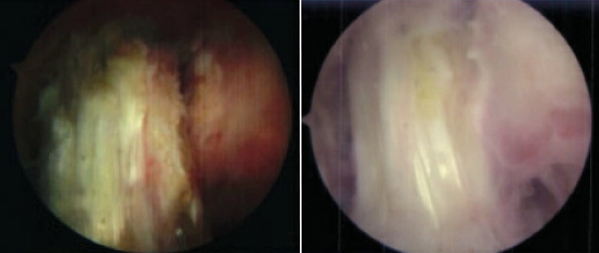

# Septic arthritis

*Categories: Clinical knowledge > Emergency medicine > Infectious diseases > Septic arthritis*

[Original Article Link](https://coursology-qbank.com/amboss/article/0M0eMg)

---

## Summary

<u>Septic</u> (infectious) <u>arthritis</u> is an infection of the <u>joint</u> space, which can occur in a native <u>joint</u> or a prosthetic <u>joint</u>. Patients with underlying <u>joint</u> diseases (e.g., <u>rheumatoid arthritis</u>) are at an increased risk of <u>septic</u> <u>arthritis</u>. Routes of infection include hematogenous spread (most common), direct <u>inoculation</u> (e.g., <u>iatrogenic</u>, <u>penetrating trauma</u>), and contiguous spread. Patients with native <u>joint</u> infections usually present with an acutely swollen, painful <u>joint</u>, limited <u>range of motion</u>, and <u>fever</u>, whereas patients with <u>prosthetic joint infections</u> (<u>PJIs</u>) usually have a milder, chronic course, which often makes diagnosis more challenging. All patients with suspected <u>septic</u> <u>arthritis</u> should undergo prompt <u>arthrocentesis</u> for <u>synovial fluid analysis</u>. Early administration of <u>empiric antibiotic therapy</u> and therapeutic <u>arthrocentesis</u> is indicated for native <u>joint</u> infections to prevent <u>cartilage</u> destruction. <u>PJIs</u> typically require <u>surgical debridement</u>, including removal of the prosthesis in some cases; <u>empiric antibiotics</u> are not recommended unless the patient is critically ill. <u>Targeted antibiotics</u> should be initiated in all patients once <u>culture and sensitivity</u> results are available.

Arthritis & Osteoarthritis - Part 4: Joint Involvement Patterns in Rheumatic Diseases

---

## Etiology

### Routes of spread

* Hematogenous spread (most common)

* From a distant site (e.g., <u>abscesses</u>, wound infection, septicemia)

* Disseminated infection (e.g., <u>gonorrhea</u>)

* Direct contamination

* <u>Iatrogenic</u> (e.g., <u>joint injection</u>, <u>arthrocentesis</u> , <u>arthroscopy</u> ) [[1]](https://coursology-qbank.com/amboss/article/ROalHk)

* Trauma (e.g., <u>open wounds</u> around the <u>joint</u> , <u>penetrating trauma</u>)

* Contiguous spread (e.g., <u>septic bursitis</u>, <u>osteomyelitis</u>)

### Risk factors for septic arthritis

* Prosthetic implant

* Interventions (e.g., intra-articular injections)

* Underlying <u>joint</u> disease, especially <u>rheumatoid arthritis</u>

* <u>Immunosuppressed state</u>

* <u>Diabetes mellitus</u>

* Age > 80 years

* Chronic <u>skin infections</u>

* IV drug use

* <u>Endocarditis</u> (polyarticular <u>septic</u> <u>arthritis</u>)

### Causative organisms

For etiology in children, see “<u>Septic arthritis in children</u>.”

* <u>Staphylococcus aureus</u>

* Most common in adults

* Frequently found in patients with <u>arthritis</u> following invasive <u>joint</u> procedures [[2]](https://coursology-qbank.com/amboss/article/8UXOUx)

* <u>Streptococci</u>

* <u>Neisseria gonorrheae</u>

* <u>Gram-negative rods</u> esp. <u>E. coli</u> and <u>P. aeruginosa</u>

* <u>S. epidermidis</u>

* <u>H. influenzae</u>

* <u>M. tuberculosis</u> and atypical <u>mycobacteria</u>

---

## Clinical features

* Acute onset

* Classical triad of <u>fever</u>, <u>joint</u> <u>pain</u>, and restricted <u>range of motion</u>

* <u>Arthritis</u>

* Usually monoarticular

* Most commonly affected <u>joints</u>: knees (followed by hip, wrists, shoulders, and ankles)

* <u>Joints</u> are swollen, red, warm, and painful.

Knee effusion

---

## Subtypes and variants

### Prosthetic joint infection (<u>PJI</u>) [[3]](https://coursology-qbank.com/amboss/article/Ycanaj)[[4]](https://coursology-qbank.com/amboss/article/ccaaYj)

* Etiology

* Early onset (< 3 months of placement): most commonly <u>S. aureus</u>

* Delayed onset (3–12 months of placement); : <u>coagulase-negative staphylococci</u>, particularly <u>S. epidermidis</u>

* Late onset (> 12 months of placement): most commonly <u>S. aureus</u>

* Clinical features

* Usually prolonged, low-grade course

* Minimal swelling, with or without a sinus that drains <u>pus</u>

* Can present acutely (see “Clinical features” above)

* Management: See “Diagnostics” and “Treatment” sections.

> [!WARNING]
> In order to avoid infection, strict aseptic precautions should be ensured in any procedure that involves penetration of the <u>joint</u> space.

### Bacterial coxitis [[5]](https://coursology-qbank.com/amboss/article/Xca9aj)

* Description: <u>septic arthritis of the hip</u> (rare)

* Etiology: <u>S. aureus</u> and group A <u>streptococcus</u> account for the majority of cases

* Clinical findings

* <u>Joint</u> <u>pain</u> (may be referred to the groin or knee)

* Patient's hip is often flexed and <u>externally rotated</u> (this decreases intraarticular pressure and alleviates <u>pain</u>)

* See “Clinical features” above

* Management: See “Diagnostics” and “Treatment” sections.

> [!WARNING]
> <u>Bacterial coxitis</u> is an orthopedic emergency that requires urgent management to avoid <u>joint</u> destruction.

### <u>Gonococcal arthritis</u>

* <u>Gonococcal arthritis</u> may often present in sexually active young adults.

* See “<u>Purulent gonococcal arthritis</u>” and “<u>Arthritis-dermatitis syndrome</u>.”

* See “<u>Targeted antimicrobial therapy for septic arthritis</u>.”

> [!TIP]
> In a young, sexually active adult presenting with classic <u>symptoms of septic arthritis</u>, <u>gonococcal infection</u> must be ruled out.

---

## Diagnosis

### Approach

Any red, painful <u>joint</u> with a reduced <u>range of motion</u> should be considered infectious until proven otherwise. The absence of <u>fever</u> does not rule out a <u>diagnosis of septic arthritis</u>. [[6]](https://coursology-qbank.com/amboss/article/GXcBza0)

* All patients [[6]](https://coursology-qbank.com/amboss/article/GXcBza0)[[7]](https://coursology-qbank.com/amboss/article/YccnaY0)[[8]](https://coursology-qbank.com/amboss/article/6ccjWY0)

* <u>Arthrocentesis</u> with <u>synovial fluid analysis</u> and culture (<u>gold standard</u>)

* <u>Blood cultures</u> in patients with <u>fever</u> or acute onset of symptoms

* <u>X-rays</u> of the affected <u>joint</u>

* Suspected <u>PJI</u> [[7]](https://coursology-qbank.com/amboss/article/YccnaY0)

* <u>Diagnostic criteria for PJIs</u> can be used alongside clinical features to establish a diagnosis. [[9]](https://coursology-qbank.com/amboss/article/accQaY0)

* Prompt specialist consultation is recommended (e.g., orthopedic <u>surgery</u>, infectious diseases).

* Advanced imaging (e.g., <u>MRI</u>, nuclear medicine studies) may be necessary.

* Intraoperative samples (e.g., of infected periprosthetic tissue) for culture are usually required.

* Suspected <u>gonococcal arthritis</u>  [[10]](https://coursology-qbank.com/amboss/article/PL0WBg)

* Additional cultures and <u>PCR</u> testing of swabs from <u>mucosal</u> sites are recommended.

* See also “<u>Disseminated gonococcal infection</u>.”

> [!TIP]
> Maintain a high index of suspicion for <u>septic</u> <u>arthritis</u> in patients with underlying <u>joint</u> diseases (e.g., <u>osteoarthritis</u>, <u>rheumatoid arthritis</u>) who present with <u>joint</u> <u>pain</u>, as the signs and symptoms of an acute flare and an infection often overlap. [[6]](https://coursology-qbank.com/amboss/article/GXcBza0)

### <u>Arthrocentesis</u> [[11]](https://coursology-qbank.com/amboss/article/tXcX-a0)

* Indication: : all patients with suspected <u>septic</u> <u>arthritis</u>   [[7]](https://coursology-qbank.com/amboss/article/YccnaY0)

* Procedure: See “<u>Arthrocentesis steps</u>.”

* Additional considerations

* Consider specialist input prior to <u>arthrocentesis</u> in patients receiving <u>anticoagulants</u>.

* Consider inoculating <u>synovial fluid</u> into <u>blood culture</u> bottles to improve the <u>sensitivity</u> of cultures.  [[6]](https://coursology-qbank.com/amboss/article/GXcBza0)

> [!TIP]
> Do not delay <u>joint aspiration</u> in suspected <u>septic</u> <u>arthritis</u> as early detection and treatment are imperative to prevent <u>cartilage</u> destruction. [[12]](https://coursology-qbank.com/amboss/article/B_Xzq00)

#### Synovial fluid analysis in septic arthritis

See “<u>Interpretation of synovial fluid analysis</u>” for comparative findings of differential diagnoses.

* Appearance: : often yellow-green and turbid (nonspecific) [[6]](https://coursology-qbank.com/amboss/article/GXcBza0)

* Cell count

* ↑ <u>WBC count</u> (e.g., > 50,000/mm³)    [[6]](https://coursology-qbank.com/amboss/article/GXcBza0)[[10]](https://coursology-qbank.com/amboss/article/PL0WBg)

* <u>Neutrophil</u> (<u>PMN</u>) dominance of > 90%

* <u>Glucose</u> levels: lower than blood <u>glucose</u> levels

* <u>Gram stain</u>  [[6]](https://coursology-qbank.com/amboss/article/GXcBza0)[[10]](https://coursology-qbank.com/amboss/article/PL0WBg)[[13]](https://coursology-qbank.com/amboss/article/0cceaY0)

* To guide <u>empiric antibiotic therapy</u> for native <u>joint</u> infection

* A negative <u>Gram stain</u> does not rule out <u>septic</u> <u>arthritis</u>.

* <u>Culture and sensitivity testing</u>: to guide <u>targeted antibiotic therapy</u> [[6]](https://coursology-qbank.com/amboss/article/GXcBza0)

> [!TIP]
> <u>Synovial fluid</u> <u>WBC count</u> may be much lower in <u>PJI</u> than <u>septic</u> <u>arthritis</u> in a native <u>joint</u>. > 1,100/mm³ (≥ 64%) should raise suspicion for <u>PJI</u>. [[10]](https://coursology-qbank.com/amboss/article/PL0WBg)

> [!WARNING]
> <u>Neutrophil</u> predominant <u>leukocytosis</u> on <u>SFA</u> may also be present in <u>crystal arthropathy</u> (e.g., <u>acute gout</u> flare). Interpret <u>SFA</u> in close conjunction with clinical features and <u>risk factors</u>.

Synovial fluid in septic arthritis

### <u>Laboratory studies</u> [[6]](https://coursology-qbank.com/amboss/article/GXcBza0)[[8]](https://coursology-qbank.com/amboss/article/6ccjWY0)[[10]](https://coursology-qbank.com/amboss/article/PL0WBg)

#### Routine studies

* <u>Blood cultures</u> (for aerobic and anaerobic organisms)

* Obtain in patients with <u>fever</u> or acute onset of symptoms. [[7]](https://coursology-qbank.com/amboss/article/YccnaY0)

* Positive in 25–50% of cases of <u>septic</u> <u>arthritis</u> and 25–70% of cases of <u>gonococcal arthritis</u> [[10]](https://coursology-qbank.com/amboss/article/PL0WBg)

* <u>CBC</u>, <u>CRP</u>, <u>ESR</u>: <u>Leukocytosis</u> and elevated <u>inflammatory markers</u> may be seen (nonspecific).

* <u>BMP</u> and <u>liver chemistries</u>: to guide <u>antibiotic</u> selection [[8]](https://coursology-qbank.com/amboss/article/6ccjWY0)

#### Additional studies

* Serum <u>procalcitonin</u> [[6]](https://coursology-qbank.com/amboss/article/GXcBza0)

* Consider if diagnostic <u>arthrocentesis</u> is not feasible or in patients with comorbid inflammatory <u>arthritis</u>.

* Levels 0.2–0.3 ng/mL provide supportive evidence of a bacterial infection of bones or <u>joints</u>.

* <u>Coagulation panel</u>: Perform prior to <u>arthrocentesis</u> in patients on anticoagulation.

* Culture and <u>PCR</u> testing for <u>N. gonorrhoeae</u> : For suspected <u>gonococcal arthritis</u> [[10]](https://coursology-qbank.com/amboss/article/PL0WBg)

> [!TIP]
> <u>Uric acid</u> levels have no diagnostic value in the evaluation of swollen <u>joints</u>. [[8]](https://coursology-qbank.com/amboss/article/6ccjWY0)

> [!WARNING]
> <u>Inflammatory markers</u> may be normal in <u>septic</u> <u>arthritis</u>. [[10]](https://coursology-qbank.com/amboss/article/PL0WBg)

### Imaging of the affected <u>joint</u> [[6]](https://coursology-qbank.com/amboss/article/GXcBza0)[[10]](https://coursology-qbank.com/amboss/article/PL0WBg)[[14]](https://coursology-qbank.com/amboss/article/Clbq_F)

* Imaging findings of septic arthritis are nonspecific and should be interpreted in conjunction with the clinical picture.

* May be useful to evaluate for other causes of acute <u>joint</u> <u>pain</u> (e.g., <u>fractures</u>, <u>osteomyelitis</u>, <u>chondrocalcinosis</u>).

* <u>Ultrasound</u> and <u>fluoroscopy</u> is also useful to guide <u>arthrocentesis</u> in difficult <u>joints</u>, e.g., hip, <u>sacroiliac joint</u>. [[14]](https://coursology-qbank.com/amboss/article/Clbq_F)

#### <u>X-ray</u>

* Indication: preferred initial imaging modality (prosthetic and native <u>joints</u>)  [[6]](https://coursology-qbank.com/amboss/article/GXcBza0)[[14]](https://coursology-qbank.com/amboss/article/Clbq_F)

* Supportive findings

* May be unremarkable in early <u>septic</u> <u>arthritis</u>

* <u>Soft tissue</u> swelling, gas within periarticular <u>soft tissue</u>, and synovial effusion may be seen [[11]](https://coursology-qbank.com/amboss/article/tXcX-a0)

* Radiodense foreign bodies can be detected

* <u>Osteolysis</u> may be seen in concurrent <u>osteomyelitis</u> (2–3 weeks after onset). [[14]](https://coursology-qbank.com/amboss/article/Clbq_F)[[15]](https://coursology-qbank.com/amboss/article/-XcD0Y0)

* Loosening of the prosthesis and <u>periosteal reactions</u> may be seen in <u>PJIs</u>.

#### <u>Ultrasound</u>

* Indication: Consider in patients with suspected foreign body (e.g., history of <u>penetrating trauma</u>) and negative <u>x-rays</u>. [[14]](https://coursology-qbank.com/amboss/article/Clbq_F)

* Supportive findings [[14]](https://coursology-qbank.com/amboss/article/Clbq_F)[[15]](https://coursology-qbank.com/amboss/article/-XcD0Y0)[[16]](https://coursology-qbank.com/amboss/article/wccheY0)

* <u>Joint effusion</u> with or without synovial thickening

* Inflammatory changes in periarticular <u>soft tissue</u>

* Effusions and small collections

* Can detect <u>radiolucent</u> foreign bodies, if present.

#### CT or <u>MRI</u>

* Indications: Consider CT or <u>MRI</u> in the following situations [[6]](https://coursology-qbank.com/amboss/article/GXcBza0)[[14]](https://coursology-qbank.com/amboss/article/Clbq_F)

* Chronic infection and/or suspected <u>osteomyelitis</u>

* History of <u>penetrating trauma</u> or suspected foreign body (as an alternative to <u>ultrasound</u>)

* Supportive findings [[10]](https://coursology-qbank.com/amboss/article/PL0WBg)[[14]](https://coursology-qbank.com/amboss/article/Clbq_F)

* Similar to <u>ultrasound</u> findings

* <u>Bone marrow</u> <u>edema</u>

* Can detect intra- or periarticular foreign bodies

Left hip joint effusion

Left hip joint effusion

#### Nuclear medicine studies (e.g., <u>scintigraphy</u>, <u>PET-CT</u>) [[7]](https://coursology-qbank.com/amboss/article/YccnaY0)[[17]](https://coursology-qbank.com/amboss/article/ZccZaY0)

* Indication: Consider in the workup of <u>PJIs</u> (not routinely recommended).

* Findings: focal increase in radiotracer uptake in the affected <u>joint</u>

Septic arthritis of the shoulder

> [!TIP]
> Nuclear medicine studies can not distinguish between <u>septic</u> <u>arthritis</u> and inflammatory <u>arthritis</u> and are hence not recommended in the diagnostic workup of <u>septic</u> <u>arthritis</u> in a native <u>joint</u>. [[14]](https://coursology-qbank.com/amboss/article/Clbq_F)

### Diagnostic criteria for prosthetic joint infections

There are several <u>diagnostic criteria for PJI</u> that can be used alongside clinical features to establish a diagnosis. Clinical judgment plays an important role in determining the likelihood of <u>PJI</u> even in patients who do not fulfill the diagnostic criteria. [[7]](https://coursology-qbank.com/amboss/article/YccnaY0)[[9]](https://coursology-qbank.com/amboss/article/accQaY0)

#### Infectious Diseases Society of America (<u>IDSA</u>) <u>diagnostic criteria for PJI</u> (for all <u>joints</u>) [[7]](https://coursology-qbank.com/amboss/article/YccnaY0)

|  2013 IDSA diagnostic criteria for PJI [[7]](https://coursology-qbank.com/amboss/article/YccnaY0)  |  |
| --- | --- |
|  Definitive <u>PJI</u> |  * Presence of any of the following:  * Sinus tract that communicates with the prosthesis  * <u>Purulence</u> surrounding the prosthesis with no other identified cause  * ≥ 2 positive cultures from periprosthetic tissue isolating the same organism   |
|  High likelihood of <u>PJI</u> |  * Presence of any of the following:  * <u>Acute inflammation</u> on histopathological examination of periprosthetic tissue  * Growth of a <u>virulent</u> organism, e.g., <u>Staphylococcus aureus</u>, in a single culture   |

#### Musculoskeletal Infection Society (MSIS) for hip and/or knee <u>PJI</u> [[9]](https://coursology-qbank.com/amboss/article/accQaY0)

|  MSIS diagnostic criteria for prosthetic hip and/or knee infections [[9]](https://coursology-qbank.com/amboss/article/accQaY0)  |  |
| --- | --- |
| Major criteria |   * Presence of a sinus tract communicating with the prosthesis  * ≥ 2 positive cultures from periprosthetic tissue isolating the same organism    |
| Minor criteria |   * ↑ Serum <u>ESR</u> or <u>CRP</u>  * ↑ <u>WBC count</u> in the <u>synovial fluid</u>  * ↑ <u>Neutrophil</u> (<u>PMN</u>) percentage in the <u>synovial fluid</u>  * <u>Synovial fluid</u> has a <u>purulent</u> appearance.  * One positive fluid or tissue culture from periprosthetic tissue  * <u>Acute inflammation</u> on histopathological examination of periprosthetic tissue    |
|   * Definitive <u>PJI</u>: ≥ 1 major criterion OR ≥ 4 minor criteria  * <u>PJI</u> possible: < 4 minor criteria    |  |

> [!TIP]
> A diagnosis of <u>PJI</u> can be made even if the <u>IDSA</u> and/or MSIS criteria are not fulfilled. Clinical judgment based on clinical features and diagnostic findings plays an important role in determining the diagnosis. [[7]](https://coursology-qbank.com/amboss/article/YccnaY0)

---

## Differential diagnoses

### Based on clinical features and imaging

See also “<u>Differential diagnoses of inflammatory arthritis</u>.”

#### Viral arthritis

* Etiology: <u>parvovirus B19</u>, <u>hepatitis B virus</u>, <u>hepatitis C virus</u>, <u>rubella virus</u>, <u>HIV</u>

* Pathophysiology

* Direct invasion of the <u>virus</u> (e.g., <u>rubella</u>, <u>enteroviruses</u>)

* <u>Immune complex</u> formation (e.g., <u>hepatitis B</u>, <u>hepatitis C</u>, <u>parvovirus</u>)

* Clinical features

* Symmetric involvement of multiple <u>small joints</u>

* Sudden onset

* Possibly accompanied by <u>rash</u> and <u>fever</u>

* Usually no destruction of the <u>joint</u>

* Diagnostics

* History and clinical findings are the mainstays of establishing a diagnosis

* <u>Serology</u>: <u>antibodies</u> against the suspected <u>virus</u>

* <u>Synovial joint</u> analysis

* Very variable (can be normal or inflammatory)

* Not routinely used since viral isolation is usually not successful

* For other diagnostic tests, see “Diagnostics” above.

* Therapy

* Supportive treatment only (usually <u>self-limited</u>)

* See “<u>Hepatitis B</u>”, “<u>Hepatitis C</u>“, “<u>Rubella</u>“, “<u>Parvovirus B19-associated arthritis</u>”, and “<u>HIV</u>-associated arthritis.”

#### Fungal arthritis [[18]](https://coursology-qbank.com/amboss/article/Scaybj)

* Etiology: <u>Histoplasma</u> species, <u>Sporothrix schenckii</u>, <u>Blastomyces</u> species, <u>Coccidioides</u> species

* Clinical features

* Very variable with acute and chronic courses

* Often with symptoms of disseminated infection (e.g., pulmonary symptoms)

* Diagnostics

* <u>Synovial fluid analysis</u> may show normal, inflammatory, or <u>septic</u> findings

* <u>Synovial fluid</u> culture

* Possibly <u>serologic studies</u>: positive <u>antibodies</u> against the <u>pathogen</u> (e.g., in coccidioidal <u>arthritis</u>)

* See also: “<u>Overview of fungal infections</u>” in the “<u>General mycology</u>”

#### Miscellaneous

* <u>Avascular osteonecrosis</u>

* <u>Bursitis</u>

### Based on <u>synovial fluid analysis</u> [[10]](https://coursology-qbank.com/amboss/article/PL0WBg)

Synovial fluid analysis comprises a group of tests that examine <u>synovial fluid</u> to help differentiate between subtypes of <u>arthritis</u>.

|  Interpretation of synovial fluid analysis [[10]](https://coursology-qbank.com/amboss/article/PL0WBg)  |  |  |  |  |  |  |
| --- | --- | --- | --- | --- | --- | --- |
| Type of <u>arthritis</u> | Appearance | <u>WBC count</u> (<u>PMN</u>) | <u>Gram stain</u> | Crystals |  |  <u>Glucose</u> levels (compared to blood <u>glucose</u> levels) |
| No <u>arthritis</u> |   * Transparent  * Clear and viscous    |  * < 200/mm³ (< 25%)   |  * Negative   |  * None   |  |  * Nearly equal   |
|  Noninflammatory <u>arthritis</u> E.g., <u>osteoarthritis</u>  |   * Transparent  * Yellow and viscous    |  * 200–2000 /mm³ (< 25%)   |  * Negative   |  * <u>Calcium</u> <u>phosphate</u> crystals (apatite): present in 30–60% of <u>osteoarthritis</u> cases [[19]](https://coursology-qbank.com/amboss/article/occ0WY0)   |  |  * Nearly equal   |
|  Inflammatory <u>arthritis</u> E.g., <u>rheumatoid arthritis</u>, <u>SLE</u>, <u>gout</u>, <u>pseudogout</u>  |   * Translucent-opaque  * Yellow and watery    |  * > 2000/mm³ (≥ 50%)   |  * Negative   |   * <u>Monosodium urate crystals</u>: <u>gout</u> [[20]](https://coursology-qbank.com/amboss/article/xnaEvO)  * <u>Calcium pyrophosphate crystals</u>: <u>pseudogout</u> [[21]](https://coursology-qbank.com/amboss/article/0fbekG)    |  |  * ↓   |
|  <u>Septic</u> <u>arthritis</u> [[10]](https://coursology-qbank.com/amboss/article/PL0WBg) E.g., caused by bacterial infections |   * Cloudy-opaque  * Yellow or green with variable viscosity    |   * > 50,000/mm³ (≥ 75%)  * Delayed or late-onset <u>prosthetic joint infection</u>: > 1100/mm³ (≥ 64%)    |   * Positive in 60–80% of cases of nongonococcal <u>septic</u> <u>arthritis</u>  * Positive in < 50% of cases of <u>gonococcal arthritis</u>    |  * None, unless the patient has concurrent <u>gout</u> [[22]](https://coursology-qbank.com/amboss/article/qxbCxD)   |  |  * ↓↓   |
|  <u>Lyme arthritis</u> [[23]](https://coursology-qbank.com/amboss/article/AN1Rdh0)  |  * Yellow and cloudy   |  * Mean of 25,000/mm³, or up to 60,000/mm³ in children (> 50%)  [[24]](https://coursology-qbank.com/amboss/article/f81kNi0)[[25]](https://coursology-qbank.com/amboss/article/prWLR50)   |  * Negative   |  * Negative   |  |  * Nearly equal   |
|  <u>Hemarthrosis</u> [[26]](https://coursology-qbank.com/amboss/article/AXcR0Y0) E.g., caused by trauma  |   * Red with variable viscosity  * Synovial <u>Hct</u> can be compared to simultaneous serum <u>Hct</u> to determine the amount of blood in the <u>synovial fluid</u>    |   * Variable  * Difficult to rule out a concurrent inflammatory process based on <u>SFA</u> alone.    |  * Negative [[26]](https://coursology-qbank.com/amboss/article/AXcR0Y0)   |  * None   |  |  * Nearly equal   |

The differential diagnoses listed here are not exhaustive.

---

## Treatment

### Approach

* Native <u>joint</u> infection

* Serial therapeutic <u>arthrocentesis</u>

* <u>Empiric antibiotic therapy</u> guided by <u>Gram stain</u> and clinical features

* <u>Targeted antibiotic therapy</u> once <u>antibiotic sensitivities</u> are known

* <u>Prosthetic joint infection</u> (<u>PJI</u>)

* Orthopedic consultation for surgical intervention (<u>debridement</u> with/without exchange <u>arthroplasty</u>)

* Infectious disease consultation for <u>targeted antibiotic therapy</u> once <u>antibiotic sensitivities</u> are known

* All patients require a prolonged course of <u>pathogen</u>-specific systemic <u>antibiotics</u>. [[7]](https://coursology-qbank.com/amboss/article/YccnaY0)

> [!TIP]
> Evacuation of <u>purulent</u> material from the <u>joint</u> and systemic <u>antibiotic therapy</u> are the mainstays of treatment in <u>septic</u> <u>arthritis</u>.

### <u>Joint</u> drainage

#### Native <u>joints</u> [[8]](https://coursology-qbank.com/amboss/article/6ccjWY0)

* Therapeutic <u>arthrocentesis</u> (drained to dryness) is indicated in all patients.

* Repeat <u>arthrocentesis</u> as often as needed; <u>SFA</u> should be performed at each <u>aspiration</u>.

* Signs of improvement include a reduction in <u>synovial fluid</u> volume, cell count, and percentage of <u>PMNs</u> with each <u>aspiration</u>. [[8]](https://coursology-qbank.com/amboss/article/6ccjWY0)[[16]](https://coursology-qbank.com/amboss/article/wccheY0)

* Consider surgical drainage if symptoms persist despite serial <u>arthrocentesis</u> ; ; examples of <u>surgery</u> include: [[8]](https://coursology-qbank.com/amboss/article/6ccjWY0)[[10]](https://coursology-qbank.com/amboss/article/PL0WBg)

* Serial lavage via <u>arthroscopy</u> or <u>tidal irrigation</u> systems [[16]](https://coursology-qbank.com/amboss/article/wccheY0)

* Arthrotomy and open <u>debridement</u>  [[8]](https://coursology-qbank.com/amboss/article/6ccjWY0)[[16]](https://coursology-qbank.com/amboss/article/wccheY0)

Acute septic arthritis

> [!TIP]
> If effusion persists beyond 7 days of <u>arthrocentesis</u>, <u>arthroscopic</u> or open drainage is indicated. [[16]](https://coursology-qbank.com/amboss/article/wccheY0)

#### Prosthetic <u>joints</u> [[7]](https://coursology-qbank.com/amboss/article/YccnaY0)

<u>Surgery</u> to remove <u>pus</u> and infected tissue from the affected <u>joint</u> is typically required; examples include:

* <u>Debridement</u> of infected periarticular tissue with retention of prosthesis

* Exchange <u>arthroplasty</u> (e.g., <u>one-stage exchange arthroplasty</u>, <u>two-stage exchange arthroplasty</u>)

* <u>Arthrodesis</u>

> [!TIP]
> Consult orthopedic <u>surgery</u> early in patients with suspected <u>prosthetic joint infection</u>.

### <u>Empiric antibiotic therapy</u>

* Indication: <u>septic</u> <u>arthritis</u> of a native <u>joint</u> (after diagnostic <u>arthrocentesis</u> has been performed)  [[10]](https://coursology-qbank.com/amboss/article/PL0WBg)

* <u>Antibiotic</u> coverage

* Should be guided by <u>Gram stain</u> results on <u>SFA</u>

* In patients with negative <u>Gram stain</u> but a high likelihood of <u>septic</u> <u>arthritis</u>, select <u>empiric antibiotics</u> based on clinical features and <u>patient history</u>.

* Special patient groups: Consult infectious diseases for appropriate <u>antibiotic</u> selection in the following groups of patients. [[8]](https://coursology-qbank.com/amboss/article/6ccjWY0)

* Patients with <u>risk factors</u> for atypical infection

* Patients with <u>risk factors</u> for <u>methicillin-resistant Staphylococcus aureus</u> (<u>MRSA</u>)

* Patients at high risk for Gram-negative infections

> [!TIP]
> <u>Empiric antibiotic therapy</u> is not routinely recommended for <u>PJIs</u>.

#### Adult patients

|  Empiric antibiotic therapy for adults with septic arthritis of native joints [[10]](https://coursology-qbank.com/amboss/article/PL0WBg)[[27]](https://coursology-qbank.com/amboss/article/LMbw68)  |  |  |
| --- | --- | --- |
| Causative <u>pathogen</u> |  | Suggested regimens |
| <u>Gram-positive cocci</u> |  |   * <u>Vancomycin</u> DOSAGE  * PLUS a <u>third-generation cephalosporin</u> (e.g., <u>cefotaxime</u> DOSAGE) if <u>risk factors for MRSA</u> are present    |
| <u>Gram-negative cocci</u> |  |   * <u>Ceftriaxone</u> DOSAGE  * OR <u>aminoglycosides</u> (e.g., <u>gentamicin</u> DOSAGE)    |
| <u>Gram-negative bacilli</u> |  |   * <u>Cefepime</u> DOSAGE  * OR <u>meropenem</u> DOSAGE    |
| <u>Gram stain</u> negative |  Concern for <u>gonococcal arthritis</u> [[28]](https://coursology-qbank.com/amboss/article/2NcT010)  |   * <u>Ceftriaxone</u> DOSAGE  * OR <u>cefotaxime</u> DOSAGE  * OR ceftizoxime DOSAGE  * If <u>chlamydia</u> has not been excluded, add oral <u>doxycycline</u> DOSAGE    |
| No concern for <u>gonococcal arthritis</u> |   * <u>Vancomycin</u> DOSAGE  * PLUS either  * <u>Ceftriaxone</u> DOSAGE  * OR <u>cefepime</u> DOSAGE    |  |

> [!WARNING]
> <u>Intraarticular injection</u> of <u>antibiotics</u> is not recommended. [[27]](https://coursology-qbank.com/amboss/article/LMbw68)

### <u>Targeted antibiotic therapy</u>

Switch from <u>empiric antibiotic therapy</u> to culture-specific <u>antibiotics</u> once <u>antibiotic sensitivities</u> are known in patients with native <u>joint</u> infections. Initiation of <u>targeted antibiotic therapy</u> directly (i.e., without preceding empiric therapy) is sufficient for <u>PJI</u>. Specialist consultation is advised especially in patients with <u>PJIs</u>.

#### Agents

|  Targeted antimicrobial therapy for adults with septic arthritis (native <u>joint</u> infection and <u>PJI</u>)  [[7]](https://coursology-qbank.com/amboss/article/YccnaY0)[[8]](https://coursology-qbank.com/amboss/article/6ccjWY0)  |  |  |
| --- | --- | --- |
| Microorganism |  | Example regimens |
| <u>Staphylococcus aureus</u> | <u>MSSA</u> |   * <u>Penicillinase-resistant penicillins</u> (e.g., <u>nafcillin</u> DOSAGE)  * OR <u>cefazolin</u> DOSAGE  * OR <u>ceftriaxone</u> DOSAGE    |
| <u>MRSA</u> |   * <u>Vancomycin</u> DOSAGE  * OR <u>daptomycin</u> DOSAGE [[29]](https://coursology-qbank.com/amboss/article/rD0ffR)  * Consider adding <u>rifampin</u> DOSAGE in addition to <u>vancomycin</u> or <u>daptomycin</u>.  [[27]](https://coursology-qbank.com/amboss/article/LMbw68)[[29]](https://coursology-qbank.com/amboss/article/rD0ffR)    |  |
| <u>Enterococci</u> | <u>Penicillin</u>-susceptible |   * <u>Penicillin G</u> DOSAGE  * OR <u>ampicillin</u> DOSAGE    |
| <u>Penicillin</u>-resistant |   * <u>Vancomycin</u> DOSAGE  * OR <u>linezolid</u> DOSAGE    |  |
| <u>Pseudomonas aeruginosa</u> |  |   * <u>Cefepime</u> DOSAGE  * OR <u>meropenem</u> DOSAGE    |
| <u>Enterobacter</u> spp. |  |   * <u>Cefepime</u> DOSAGE  * OR <u>ertapenem</u> DOSAGE    |
| <u>Enterobacteriaceae</u> |  |   * IV <u>beta-lactam antibiotics</u> based on in vitro susceptibilities  * OR <u>ciprofloxacin</u> DOSAGE    |
| <u>Beta-hemolytic</u> <u>streptococci</u> |  |   * <u>Penicillin G</u> DOSAGE  * OR <u>ceftriaxone</u> DOSAGE    |
| <u>Propionibacterium acnes</u> |  |   * <u>Penicillin G</u> DOSAGE  * OR <u>ceftriaxone</u> DOSAGE    |
|  <u>N. gonorrhoeae</u> [[27]](https://coursology-qbank.com/amboss/article/LMbw68)  |  |   * <u>Ceftriaxone</u> DOSAGE  * OR <u>cefotaxime</u> DOSAGE  * OR ceftizoxime DOSAGE  * Treat all patients with <u>Chlamydia trachomatis</u> <u>coinfection</u> with either:  * <u>Azithromycin</u> DOSAGE  * OR <u>doxycycline</u> DOSAGE [[27]](https://coursology-qbank.com/amboss/article/LMbw68)  * Evaluate sexual partners; see also “Diagnostics” in “<u>Gonorrhea</u>.” [[10]](https://coursology-qbank.com/amboss/article/PL0WBg)    |

#### Duration of therapy [[8]](https://coursology-qbank.com/amboss/article/6ccjWY0)

The total duration of <u>antibiotic therapy</u> is variable and should be adjusted according to signs of clinical and laboratory evidence of improvement.

* Native <u>joint</u> infections [[27]](https://coursology-qbank.com/amboss/article/LMbw68)

* Nongonococcal <u>arthritis</u>: 4–6 weeks

* <u>Gonococcal arthritis</u>: typically 7 days

* <u>PJI</u>: weeks to months

### Supportive therapy

* Acute phase

* <u>Analgesics</u> and <u>immobilization</u> for <u>pain</u> relief

* <u>VTE prophylaxis</u> as needed

* <u>Perioperative management</u> if <u>surgery</u> is indicated

* Optimal <u>joint</u> positioning to prevent deformation and <u>contractures</u>  [[16]](https://coursology-qbank.com/amboss/article/wccheY0)

* Following the acute phase

* Early mobilization  [[16]](https://coursology-qbank.com/amboss/article/wccheY0)[[30]](https://coursology-qbank.com/amboss/article/YhcncX0)

* <u>Physiotherapy</u>

---

## Complications

* <u>Joint</u> destruction  [[31]](https://coursology-qbank.com/amboss/article/EUX8Ux)

* <u>Osteomyelitis</u>

* <u>Sepsis</u>

We list the most important complications. The selection is not exhaustive.

---

## Septic arthritis in children

### Etiology [[32]](https://coursology-qbank.com/amboss/article/QBdu0s0)[[33]](https://coursology-qbank.com/amboss/article/iBdJ0s0)

The etiology of septic arthritis in children varies by age.

* <u>Infants</u> < 6 months of age [[32]](https://coursology-qbank.com/amboss/article/QBdu0s0)

* <u>Group B streptococci</u> (<u>S. agalactiae</u>)

* <u>Enterobacteriaceae</u>

* Older <u>infants</u> and preschool children (6 months to 4 years of age)

* <u>Kingella kingae</u> (most common) [[32]](https://coursology-qbank.com/amboss/article/QBdu0s0)[[33]](https://coursology-qbank.com/amboss/article/iBdJ0s0)

* <u>S. aureus</u>

* Children ≥ 4 years of age

* <u>S. aureus</u> (most common) [[32]](https://coursology-qbank.com/amboss/article/QBdu0s0)

* <u>Group A beta-hemolytic streptococci</u> (<u>S. pyogenes</u>)

* <u>N. gonorrhoeae</u> (in sexually active <u>adolescents</u>)

> [!TIP]
> <u>Septic</u> <u>arthritis</u> due to <u>Streptococcus pneumoniae</u> and <u>H. influenzae type b</u> is uncommon in highly immunized populations. [[33]](https://coursology-qbank.com/amboss/article/iBdJ0s0)

### Clinical features [[33]](https://coursology-qbank.com/amboss/article/iBdJ0s0)

<u>Clinical features of septic arthritis</u> are similar in children and adults with the following additional considerations in children.

* The most common presentation is <u>monoarthritis</u> of the hip or knee.  [[33]](https://coursology-qbank.com/amboss/article/iBdJ0s0)[[34]](https://coursology-qbank.com/amboss/article/Bedza60)

* Children may refuse to move or bear weight on the affected limb (pseudoparalysis).

* Clinical features may indicate the causative organism. [[33]](https://coursology-qbank.com/amboss/article/iBdJ0s0)

* <u>S. aureus</u>: acute onset with rapidly progressing <u>joint</u> <u>pain</u> over 1–2 days

* <u>K. kingae</u>: indolent course; systemic symptoms may be absent and localizing features hard to elicit.

### Diagnostics [[32]](https://coursology-qbank.com/amboss/article/QBdu0s0)[[33]](https://coursology-qbank.com/amboss/article/iBdJ0s0)

#### Approach

* In patients with <u>sepsis</u> or rapidly progressive infection, initiate <u>empiric antibiotics</u> immediately.

* Obtain routine <u>laboratory studies</u> and imaging.

* In patients with hip <u>arthritis</u>, consider prediction rules (e.g., <u>Kocher criteria for septic arthritis</u>) to distinguish between <u>transient synovitis</u> and <u>septic</u> <u>arthritis</u>.

* Refer to a specialist for <u>arthrocentesis</u>.

* Consider additional studies (e.g., <u>Lyme serology</u>) as indicated.

> [!WARNING]
> In patients with <u>sepsis</u> or rapidly progressive infection, initiate <u>empiric antibiotics</u> immediately, before performing <u>synovial fluid</u> collection and other diagnostics. [[33]](https://coursology-qbank.com/amboss/article/iBdJ0s0)

Kocher criteria for septic arthritis

#### Routine studies

* <u>Laboratory studies</u>

* <u>CBC</u>: may show <u>leukocytosis</u>

* <u>CRP</u>: typically elevated

* <u>Blood cultures</u>  [[33]](https://coursology-qbank.com/amboss/article/iBdJ0s0)

* Imaging [[33]](https://coursology-qbank.com/amboss/article/iBdJ0s0)[[35]](https://coursology-qbank.com/amboss/article/6Bdjbs0)

* Modalities: <u>x-ray</u>, <u>ultrasound</u>, or <u>MRI</u> (without and with IV contrast) of the affected <u>joint</u>  [[33]](https://coursology-qbank.com/amboss/article/iBdJ0s0)[[35]](https://coursology-qbank.com/amboss/article/6Bdjbs0)

* Findings: See “<u>Imaging findings of septic arthritis</u>.”

* Follow-up: Additional imaging is required if <u>x-rays</u> and/or <u>ultrasound</u> are normal but clinical suspicion for <u>septic</u> <u>arthritis</u> persists.

* <u>Arthrocentesis</u>

* Refer to a specialist for <u>synovial fluid</u> collection.

* Perform <u>synovial fluid analysis in septic arthritis</u>.

#### Additional studies

* Molecular testing of <u>joint</u> fluid for <u>K. kingae</u>: Consider if <u>Gram stain</u> or aerobic <u>bacterial culture</u> are negative, especially in children aged 6 months to 4 years.

* <u>Lyme serology</u> for <u>features suggesting Lyme arthritis</u>

* Culture for atypical pathogens  in children with:

* <u>Immunocompromised state</u>

* <u>Penetrating injuries</u>

* Insufficient response to <u>empiric antibiotic therapy</u>

### Differential diagnoses [[23]](https://coursology-qbank.com/amboss/article/AN1Rdh0)[[33]](https://coursology-qbank.com/amboss/article/iBdJ0s0)[[35]](https://coursology-qbank.com/amboss/article/6Bdjbs0)

See also “<u>Common causes of hip pain in children</u>.”

* <u>Transient synovitis</u>

* <u>Fractures</u> including <u>nonaccidental trauma</u>

* <u>Juvenile idiopathic arthritis</u>

* <u>Lyme arthritis</u>

* <u>Reactive arthritis</u>

* <u>Legg-Calvé-Perthes disease</u>

* <u>Slipped capital femoral epiphysis</u>

* <u>Acute rheumatic fever</u>

### Treatment [[33]](https://coursology-qbank.com/amboss/article/iBdJ0s0)

If adjacent <u>osteomyelitis</u> is detected, manage accordingly; see “<u>Osteomyelitis in children</u>.”

#### Approach

* Initial treatment includes both of the following: 

* <u>Joint</u> drainage (via <u>arthrocentesis</u>, <u>arthroscopy</u>, or arthrotomy)

* <u>Empiric antibiotic therapy</u>

* Switch to definitive <u>antibiotic therapy</u> based on <u>culture and sensitivity</u> results.

* Monitor for response to therapy based on clinical improvement and downtrending <u>CRP</u> levels.

* Poor response

* Perform <u>MRI</u> if not already obtained.

* Consult orthopedics for possible repeat <u>joint</u> drainage.

* Good response: Transition to oral <u>antibiotics</u>.

* Determine total duration of therapy in consultation with infectious diseases. [[32]](https://coursology-qbank.com/amboss/article/QBdu0s0)[[33]](https://coursology-qbank.com/amboss/article/iBdJ0s0)

* Typically 10–14 days

* Longer courses (up to 4 weeks) may be required if response to therapy is slow.

* Routine monitoring is not typically required after <u>antibiotic therapy</u> is completed.

#### Empiric antibiotic therapy for children with septic arthritis [[33]](https://coursology-qbank.com/amboss/article/iBdJ0s0)

* Consult infectious diseases for <u>antibiotic</u> selection for:

* <u>Neonates</u>

* Suspected atypical pathogens

* Severe infection

* In <u>adolescents</u>, consider <u>ceftriaxone</u> DOSAGE to cover for <u>N. gonorrhoeae</u>. [[33]](https://coursology-qbank.com/amboss/article/iBdJ0s0)

* Tailor <u>empiric antibiotic therapy</u> to local and/or hospital <u>antibiograms</u>.

|  Empiric parenteral <u>antibiotic therapy</u> for children with <u>septic</u> <u>arthritis</u> [[33]](https://coursology-qbank.com/amboss/article/iBdJ0s0)  |  |  |
| --- | --- | --- |
| Area <u>prevalence</u> of <u>MRSA</u> | Patient age | Recommended regimen |
|  Low (≤ 10%) | 6 months to 4 years |  * <u>First-generation cephalosporin</u>, e.g., <u>cefazolin</u> (<u>off-label</u>) DOSAGE [[33]](https://coursology-qbank.com/amboss/article/iBdJ0s0)   |
| Other ages |   * <u>First-generation cephalosporin</u>, e.g., <u>cefazolin</u> (<u>off-label</u>) DOSAGE [[33]](https://coursology-qbank.com/amboss/article/iBdJ0s0)  * OR <u>nafcillin</u> (<u>off-label</u>) DOSAGE [[33]](https://coursology-qbank.com/amboss/article/iBdJ0s0)  * OR <u>oxacillin</u> (<u>off-label</u>) DOSAGE [[33]](https://coursology-qbank.com/amboss/article/iBdJ0s0)    |  |
|  Moderate or high (> 10%) | All ages |   * Preferred: <u>clindamycin</u> DOSAGE [[33]](https://coursology-qbank.com/amboss/article/iBdJ0s0)  * Alternatives if local <u>clindamycin</u> resistance rates are high:  * <u>Vancomycin</u> (<u>off-label</u>) DOSAGE [[33]](https://coursology-qbank.com/amboss/article/iBdJ0s0)  * <u>Linezolid</u> (<u>off-label</u>) DOSAGE [[33]](https://coursology-qbank.com/amboss/article/iBdJ0s0)  * <u>Ceftaroline</u> (<u>off-label</u>) DOSAGE [[33]](https://coursology-qbank.com/amboss/article/iBdJ0s0)  * In children aged 6 months to 4 years using <u>clindamycin</u>, <u>vancomycin</u>, or <u>linezolid</u>, add one of the following to cover for <u>K. kingae</u>:  * <u>Ampicillin</u> DOSAGE [[33]](https://coursology-qbank.com/amboss/article/iBdJ0s0)  * <u>Cephalosporin</u> (e.g., <u>cefazolin</u> DOSAGE, <u>ceftriaxone</u> DOSAGE) [[33]](https://coursology-qbank.com/amboss/article/iBdJ0s0)    |

> [!TIP]
> <u>Antibiotic therapy</u> should routinely cover <u>S. aureus</u>; in children aged ≥ 6 months and < 4 years, additional coverage for <u>K. kingae</u> is recommended. [[33]](https://coursology-qbank.com/amboss/article/iBdJ0s0)

### Complications [[33]](https://coursology-qbank.com/amboss/article/iBdJ0s0)

* Similar to <u>complications of septic arthritis</u> in adults

* Growth arrest of the bone can also occur in children.

* Long-term sequelae are more common if there is adjacent <u>osteomyelitis</u>.

---