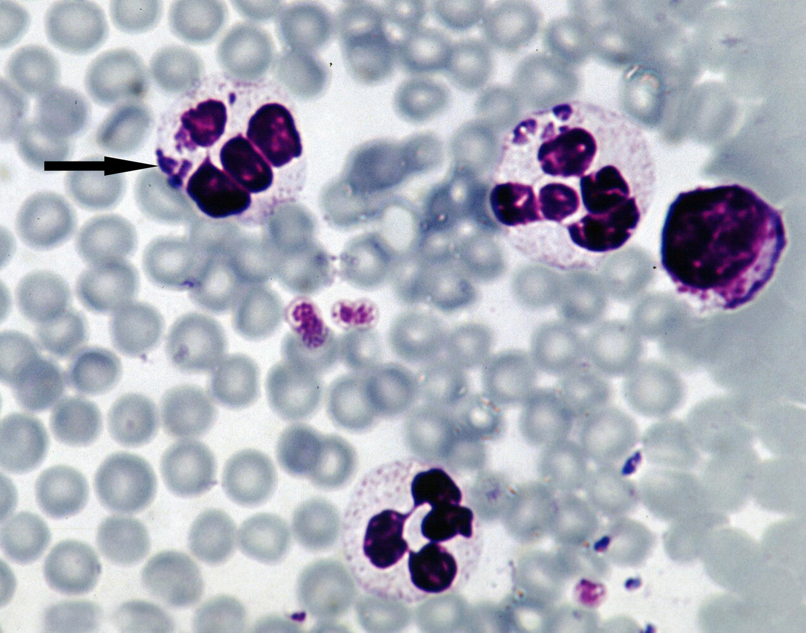
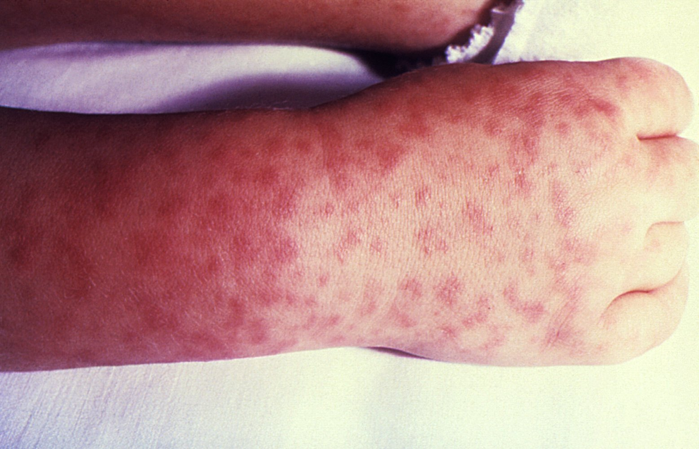
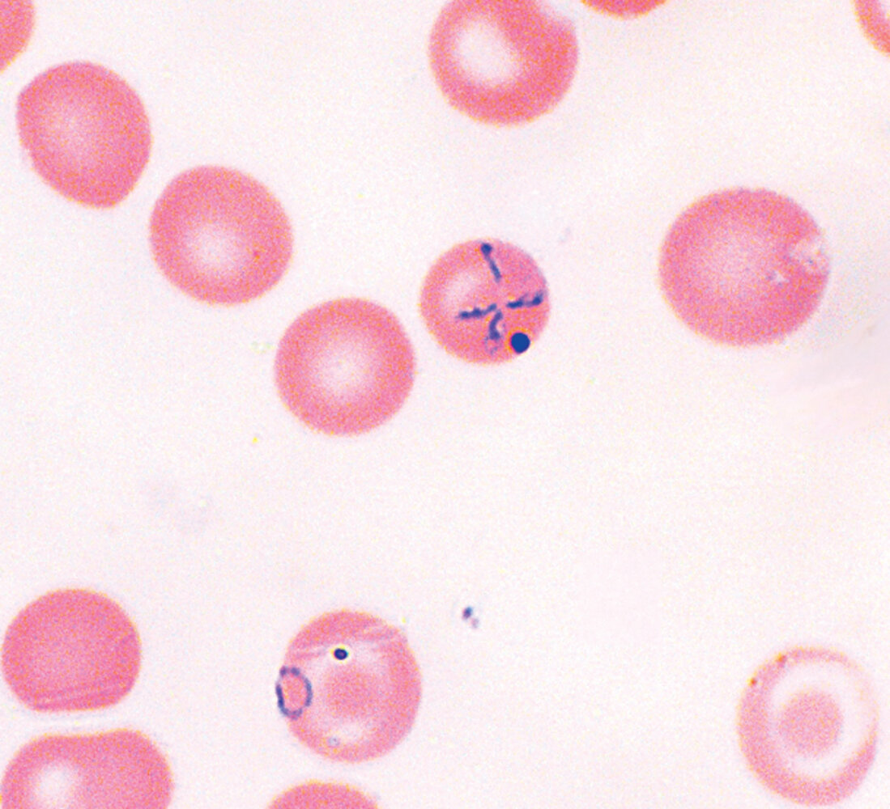

# Tick-borne diseases

*Categories: Clinical knowledge > Emergency medicine > Infectious diseases > Tick-borne diseases*

[Original Article Link](https://coursology-qbank.com/amboss/article/P70WNh)

---

## Summary

Tick-borne diseases are predominantly caused by pathogens that are transmitted by ticks (and sometimes other <u>vectors</u>), with the exception of <u>tick paralysis</u>, which is caused by a <u>neurotoxin</u> produced by the tick itself. Tick-borne diseases are typically associated with specific geographical regions. The most clinically significant tick-borne diseases in the US include <u>Lyme disease</u>, <u>Rocky Mountain spotted fever</u> (<u>RMSF</u>), <u>babesiosis</u>, <u>ehrlichiosis</u>, <u>anaplasmosis</u>, <u>tularemia</u>, <u>Colorado tick fever</u>, <u>tick-borne relapsing fever</u>, <u>southern tick‑associated rash illness</u>, <u>tick paralysis</u>, and the more recently recognized <u>alpha-gal syndrome</u>. While manifestations of these conditions vary, common symptoms include <u>fever</u>, <u>flu-like symptoms</u>, and <u>skin</u> rashes. Most tick-borne diseases are treated with <u>antibiotics</u>, and patients usually respond well to treatment.

<u>Lyme disease</u> is covered in more detail in its own article.

---

## Overview

|  Overview of tick-borne diseases [[2]](https://coursology-qbank.com/amboss/article/_aY5Mn) |  |  |  |  |  |
| --- | --- | --- | --- | --- | --- |
|  | <u>Pathogen</u>/cause | US distribution | Clinical features | Diagnostics | Treatment |
| <u>Lyme disease</u> |  * <u>Borrelia burgdorferi</u>   |  * Upper midwestern and northeastern US   |   * Early <u>Lyme disease</u>  * <u>Fever</u> and other <u>flu-like symptoms</u>  * <u>Erythema migrans</u>  * Disseminated <u>Lyme disease</u>  * Migratory <u>arthralgia</u>  * <u>Facial nerve palsy</u>, <u>meningitis</u>, <u>polyneuropathy</u>  * <u>Myocarditis</u>, <u>pericarditis</u>, conduction blocks  * Late <u>Lyme disease</u>  * Chronic <u>arthritis</u>  * <u>Late neuroborreliosis</u> (e.g., progressive <u>encephalomyelitis</u>)    |  * <u>IgM</u> or <u>IgG antibodies</u> against <u>B. burgdorferi</u>  * Initial test: <u>ELISA</u>  * <u>Confirmatory test</u>: <u>Western blot</u>   |   * No neurological manifestations: <u>doxycycline</u>, <u>amoxicillin</u>, OR <u>cefuroxime</u>  * Neurological manifestations: IV <u>ceftriaxone</u>    |
| <u>Rocky Mountain spotted fever</u> (<u>RMSF</u>) |  * <u>Rickettsia rickettsii</u>   |  * Midwestern, northeastern, and southern US   |   * <u>Fever</u> and other <u>flu-like symptoms</u>  * Blanching <u>maculopapular rash</u> that begins on the wrists and ankles  * Rapid clinical deterioration with <u>shock</u> and <u>multiorgan dysfunction</u>    |  * <u>PCR</u>, <u>IFA test</u>, or <u>immunohistochemical</u> staining of <u>R. rickettsii</u> in a <u>biopsy</u> specimen   |  * <u>Doxycycline</u>   |
|  <u>Babesiosis</u> [[3]](https://coursology-qbank.com/amboss/article/6wWjPn0) |  * <u>Babesia</u> species   |  * Midwestern (especially Minnesota and Wisconsin) and northeastern US   |   * <u>Fever</u> and other <u>flu-like symptoms</u>  * <u>Hemolytic anemia</u>  * Mild <u>splenomegaly</u> and/or <u>hepatomegaly</u>  * Gastrointestinal symptoms  * Typically no <u>rash</u>    |   * <u>CBC</u>: ↓ <u>hematocrit</u>, <u>thrombocytopenia</u>, ↑ <u>reticulocyte count</u>  * <u>Peripheral blood smear</u> showing intraerythrocyte rings and/or <u>Maltese cross</u>  * <u>Babesia</u> <u>DNA</u> detection by <u>PCR</u> of blood sample    |  * <u>Atovaquone</u> PLUS <u>azithromycin</u>   |
| <u>Ehrlichiosis</u> |   * <u>Ehrlichia chaffeensis</u>  * <u>Ehrlichia ewingii</u>  * <u>Ehrlichia</u> muris eauclairensis    |   * Mainly east of the Rocky Mountains  * Some cases in the Southwest    |   * <u>Fever</u> and other <u>flu-like symptoms</u>  * Gastrointestinal symptoms  * Rarely, <u>symptoms of meningitis</u>/<u>encephalitis</u>  * Typically no <u>rash</u>    |   * <u>Peripheral blood smear</u>: <u>monocytes</u> with clustered <u>inclusion bodies</u> (resemble a mulberry)  * <u>Ehrlichia</u> <u>DNA</u> detection by <u>PCR</u> or <u>IFA test</u>    |  * <u>Doxycycline</u>   |
| <u>Anaplasmosis</u> |  * <u>Anaplasma phagocytophilum</u>   |   * Upper midwestern and northeastern US  * Growing number of cases on the West Coast    |   * <u>Fever</u> and other <u>flu-like symptoms</u>  * Gastrointestinal symptoms  * <u>Cough</u>  * Typically no <u>rash</u>    |   * <u>CBC</u>: <u>mild anemia</u>, <u>thrombocytopenia</u>, <u>leukopenia</u>  * <u>Peripheral blood smear</u>: <u>morulae</u> within <u>granulocytes</u>    |  * <u>Doxycycline</u>   |
|  <u>Tularemia</u> [[4]](https://coursology-qbank.com/amboss/article/LZYwXn) |  * <u>Francisella tularensis</u> (<u>facultative intracellular bacterium</u>)   |  * All states except Hawaii   |   * High <u>fever</u>  * <u>Skin ulcer</u> at the entry site of <u>F. tularensis</u>  * Tender regional <u>lymphadenopathy</u>    |  * Positive culture (e.g., on <u>charcoal yeast extract agar</u>)   |  * <u>Gentamicin</u>, <u>ciprofloxacin</u>, <u>doxycycline</u> OR <u>streptomycin</u>   |
|  <u>Colorado tick fever</u> (<u>CTF</u>) [[5]](https://coursology-qbank.com/amboss/article/nZY7Xn) |  * <u>Colorado tick fever</u> <u>virus</u>   |  * Western US   |   * <u>Flu-like symptoms</u>  * Possibly <u>conjunctival injection</u>, pharyngeal <u>erythema</u>, and <u>cervical lymphadenopathy</u>  * <u>Petechial</u> or <u>maculopapular rash</u>    |   * < 2 weeks after onset of symptoms: viral <u>RNA</u> detection by <u>RT-PCR</u> of blood sample  * > 2 weeks after onset of symptoms: serum assay to detect CTFV-specific <u>IgM antibodies</u>    |  * Supportive management only   |
|  <u>Tick-borne relapsing fever</u> [[6]](https://coursology-qbank.com/amboss/article/MZYMXn) |  * <u>Borrelia</u> hermsii   |  * Western US and Texas   |   * Recurring episodes of high <u>fever</u> for 3 days and an afebrile period of 7 days  * <u>Arthralgia</u>  * Gastrointestinal symptoms  * <u>Macular rash</u> or scattered <u>petechiae</u>    |   * Direct observation of <u>spirochetes</u> in <u>peripheral blood smears</u>, <u>bone marrow</u>, or <u>CSF</u>  * <u>IFA test</u>: increase in <u>Borrelia</u>-specific <u>antibodies</u>    |   * No <u>CNS</u> involvement: <u>tetracycline</u>  * <u>CNS</u> involvement: <u>ceftriaxone</u>    |
| <u>Southern tick‑associated rash illness</u> (<u>STARI</u>) |  * Unknown   |  * Southeastern and eastern US   |   * <u>Erythema migrans</u>-like lesion and possibly <u>flu-like symptoms</u>  * Not associated with clinical features of early disseminated (e.g., <u>facial nerve palsy</u>) or late <u>Lyme disease</u> (e.g., progressive <u>encephalomyelitis</u>).    |   * No <u>confirmatory test</u>  * Clinically determined by ruling out <u>Lyme disease</u>.    |  * <u>Doxycycline</u>, <u>amoxicillin</u>, OR <u>cefuroxime</u>   |
| <u>Tick paralysis</u> |  * <u>Tick neurotoxin</u>   |  * Rocky Mountains and northwestern US   |   * Symptoms begin within 2–7 days of the initial <u>tick bite</u>.  * Typically starts with <u>weakness</u> in the lower extremities  * Escalates to ascending <u>flaccid paralysis</u> that progresses rapidly and can lead to <u>respiratory failure</u>    |   * No <u>confirmatory test</u>  * Clinically determined by finding a tick attached to the body and/or ruling out other tick-borne diseases (e.g., <u>Lyme disease</u>, <u>Q fever</u>).    |   * <u>Remove the tick</u>  * Supportive therapy    |
|  <u>Alpha-gal syndrome</u>[[7]](https://coursology-qbank.com/amboss/article/k7WmN50) |  * <u>Type I hypersensitivity</u> to mammalian-derived products after <u>Lone star tick</u> bite (<u>Amblyomma americanum</u>)   |  * Midwest, southeastern and eastern US   |   * Symptoms begin 2–6 hours after ingestion of mammalian-derived products.  * Can present as <u>anaphylaxis</u>, <u>urticaria</u>, and/or GI symptoms (e.g., abdominal <u>pain</u>, <u>vomiting</u>, <u>diarrhea</u>)    |  * <u>Clinical diagnosis</u> supported by  * ↑ <u>IgE</u> against alpha-gal in serum  * Clinical response to alpha-gal avoidance diet   |  * Alpha-gal avoidance diet   |

Anaplasmosis

---

## Rocky Mountain spotted fever (RMSF)

### Background

* <u>Epidemiology</u>: ∼ 5500 cases were reported in 2018 [[8]](https://coursology-qbank.com/amboss/article/EJX8D_)

* <u>Pathogen</u>: : <u>Rickettsia rickettsii</u>

* <u>Vector</u>

* American dog tick (<u>Dermacentor variabilis</u>)

* <u>Rocky Mountain wood tick</u> (Dermacentor andersoni)

* <u>Brown dog tick</u> (Rhipicephalus sanguineus)

* Distribution

* Cases reported across the contiguous US

* Higher density especially in the midwestern, northeastern, and southern US

* Pathophysiology:  <u>Rickettsia</u> species invade <u>capillary</u> <u>endothelium</u> → inflammation → small vessel <u>vasculitis</u>

### Clinical features [[9]](https://coursology-qbank.com/amboss/article/wJXhw_)[[10]](https://coursology-qbank.com/amboss/article/hS1czT0)

* <u>Incubation period</u>: 3–12 days

* <u>Flu-like symptoms</u> (e.g., <u>fever</u>, <u>headache</u>)

* Blanching <u>maculopapular rash</u>: begins on the wrists and ankles 

* Spreads to the trunk, palms, and soles

* May become <u>petechial</u> and/or hemorrhagic

* Ankle and/or wrist swelling

* Gastrointestinal symptoms (e.g., <u>nausea</u>, <u>vomiting</u>, abdominal <u>pain</u>)

* <u>Meningitis</u>, <u>focal neurological deficits</u>

* Rapid clinical deterioration with <u>shock</u> and <u>multiorgan dysfunction</u>, e.g., <u>disseminated intravascular coagulation</u> (<u>DIC</u>)

> [!TIP]
> The <u>rash</u> may be less obvious in dark-skinned individuals; therefore, close inspection and a high degree of clinical suspicion are required. [[11]](https://coursology-qbank.com/amboss/article/35YSPp)

Rocky Mountain spotted fever rash

### Diagnostics [[10]](https://coursology-qbank.com/amboss/article/hS1czT0)[[11]](https://coursology-qbank.com/amboss/article/35YSPp)[[12]](https://coursology-qbank.com/amboss/article/Eg18CT0)

<u>RMSF</u> is a <u>clinical diagnosis</u>.

* <u>Laboratory studies</u> [[12]](https://coursology-qbank.com/amboss/article/Eg18CT0)

* <u>CBC</u>: typically normal <u>WBC count</u>, <u>thrombocytopenia</u>

* <u>BMP</u>: ↓ Na, ↓ renal function in severe cases

* Mildly ↑ <u>AST</u> and/or <u>ALT</u>

* ↑ <u>PT</u>, ↑ <u>INR</u>, ↑ <u>PTT</u>

* Other supportive studies: <u>ECG</u> , <u>CXR</u>  [[11]](https://coursology-qbank.com/amboss/article/35YSPp)

* Confirmatory studies: should be performed in all patients  [[10]](https://coursology-qbank.com/amboss/article/hS1czT0)

* <u>Indirect fluorescent antibody</u> (<u>IFA</u>) test (<u>gold standard</u>): four-fold increase in <u>IgG</u>-specific <u>antibodies</u>

* <u>PCR</u>: detection of <u>R. rickettsii</u> <u>DNA</u> in a <u>skin biopsy</u> specimen or acute phase whole blood specimen

* <u>Immunohistochemical</u> staining of <u>R. rickettsii</u> in a <u>skin biopsy</u> specimen

* <u>Lumbar puncture</u>: to rule out <u>meningitis</u> in patients with neurological features  [[12]](https://coursology-qbank.com/amboss/article/Eg18CT0)

* <u>Pleocytosis</u> with <u>lymphocytic</u> or <u>monocytic</u> predominance

* ↑ Protein

* Normal <u>glucose</u>

> [!WARNING]
> Do not delay treatment while waiting for confirmatory studies and do not discontinue treatment based solely on the results. [[10]](https://coursology-qbank.com/amboss/article/hS1czT0)

> [!TIP]
> <u>RMSF</u> is a nationally <u>notifiable disease</u> in the US. Notify the local or state health department if a case is suspected. [[11]](https://coursology-qbank.com/amboss/article/35YSPp)

### Differential diagnosis [[10]](https://coursology-qbank.com/amboss/article/hS1czT0)

* <u>Meningococcemia</u>

* <u>Lyme disease</u>

* <u>Endocarditis</u>

* <u>Hemorrhagic fever</u> (e.g., <u>Ebola fever</u>, <u>Hanta fever</u>)

* <u>Vasculitis</u>

### Treatment [[10]](https://coursology-qbank.com/amboss/article/hS1czT0)[[13]](https://coursology-qbank.com/amboss/article/Bedza60)

* For severely ill patients, e.g., with <u>septic shock</u>, <u>DIC</u>, <u>acute respiratory distress syndrome</u> (<u>ARDS</u>), and/or <u>acute renal failure</u>

* Consult critical care and infectious diseases.

* Manage associated complications.

* Admit patients with any of the following to the hospital:

* <u>Clinical features of sepsis</u>

* <u>Altered mental status</u>

* <u>Risk factors for poor adherence</u>

* Start <u>empiric antibiotic treatment</u> immediately. [[10]](https://coursology-qbank.com/amboss/article/hS1czT0)[[14]](https://coursology-qbank.com/amboss/article/PNcWY10)

* <u>Doxycycline</u> DOSAGE: preferred agent for adults and children, including pregnant individuals [[10]](https://coursology-qbank.com/amboss/article/hS1czT0)

* <u>Chloramphenicol</u> may be considered as an alternative in selected patients, e.g.: 

* Individuals with severe <u>doxycycline</u> <u>allergy</u>

* Pregnant individuals during the first and <u>second trimester</u> based on <u>shared decision-making</u>  [[10]](https://coursology-qbank.com/amboss/article/hS1czT0)

* Continue <u>antibiotics</u> for minimum of 5–7 days until patient meets the following criteria:

* Afebrile for at least 3 days

* Symptoms are improving

> [!TIP]
> For patients receiving outpatient treatment, arrange close follow-up to monitor for worsening symptoms. [[10]](https://coursology-qbank.com/amboss/article/hS1czT0)

> [!WARNING]
> Start treatment immediately if <u>RMSF</u> is suspected as the disease can be fatal if not treated early. [[10]](https://coursology-qbank.com/amboss/article/hS1czT0)

### Prognosis [[15]](https://coursology-qbank.com/amboss/article/DJX1w_)

* If treated within the first 5 days, patients typically fully recover without hospitalization.

* If treated after the first 5 days, symptoms are more severe and often require hospitalization. There is also a greater risk for long-term consequences of <u>ischemia</u> (e.g., <u>amputations</u>, <u>paralysis</u>, <u>hearing loss</u>, <u>intellectual disability</u>).

* If not treated early enough, the disease can be fatal.

---

## Babesiosis

### Background

* <u>Epidemiology</u>: > 2000 cases reported annually in the US [[3]](https://coursology-qbank.com/amboss/article/6wWjPn0)

* <u>Pathogen</u>: Babesia species (e.g., Babesia microti)

* <u>Vector</u>: <u>deer tick</u> (<u>Ixodes scapularis</u>)

* <u>Ixodes</u> is also the <u>vector</u> for <u>Borrelia burgdorferi</u> and <u>Anaplasma</u> species.

* Ticks are often <u>coinfected</u>; patients with <u>babesiosis</u> often also have <u>Lyme disease</u>. [[3]](https://coursology-qbank.com/amboss/article/6wWjPn0)

* Distribution

* In the US, <u>B. microti</u> causes <u>endemic disease</u> in Midwestern (especially Minnesota and Wisconsin) and Northeastern states.

* Other species of <u>Babesia</u> cause disease sporadically throughout the world. [[16]](https://coursology-qbank.com/amboss/article/qxWCxn0)

* Transmission [[3]](https://coursology-qbank.com/amboss/article/6wWjPn0)

* <u>Tick bite</u> (most common)

* Exposure to infected blood (e.g., through <u>transfusions</u>, <u>organ transplantation</u>, <u>perinatal</u> infection)

* <u>Incubation period</u>: 1–4 weeks after a <u>tick bite</u> or 1–9 weeks after exposure to infected blood [[17]](https://coursology-qbank.com/amboss/article/7wW44n0)[[18]](https://coursology-qbank.com/amboss/article/CRXq6B)

* <u>Risk factors</u> for severe <u>babesiosis</u> [[3]](https://coursology-qbank.com/amboss/article/6wWjPn0)

* <u>Asplenia</u>

* <u>Malignancy</u>

* <u>Heart failure</u>

* <u>HIV infection</u>

* Use of <u>immunosuppressive drugs</u>

* Age < 28 days or > 50 years [[17]](https://coursology-qbank.com/amboss/article/7wW44n0)

### Clinical features [[3]](https://coursology-qbank.com/amboss/article/6wWjPn0)[[17]](https://coursology-qbank.com/amboss/article/7wW44n0)

Clinical features of <u>babesiosis</u> are nonspecific.

* <u>Fever</u> and other <u>flu-like symptoms</u>

* <u>Anorexia</u>

* Nonproductive <u>cough</u>

* Dark urine and/or <u>jaundice</u> due to <u>hemolytic anemia</u>

* Mild <u>splenomegaly</u> and/or <u>hepatomegaly</u>

* Gastrointestinal symptoms (e.g., <u>nausea</u>, <u>vomiting</u>, abdominal <u>pain</u>)

* Typically no <u>rash</u>; possible <u>petechiae</u>, <u>ecchymoses</u>

### Diagnostics [[3]](https://coursology-qbank.com/amboss/article/6wWjPn0)[[17]](https://coursology-qbank.com/amboss/article/7wW44n0)

* Supportive laboratory findings

* <u>CBC</u>: ↓ <u>hematocrit</u>, <u>thrombocytopenia</u>

* Findings of <u>kidney injury</u>: ↑ <u>BUN</u>, ↑ <u>creatinine</u>; <u>proteinuria</u> [[18]](https://coursology-qbank.com/amboss/article/CRXq6B)

* <u>Evidence of hemolysis</u>: ↑ <u>reticulocyte count</u>, ↓ serum <u>haptoglobin</u>, ↑ <u>LDH</u>, ↑ total and <u>indirect bilirubin</u>

* <u>Elevated transaminases</u>

* Diagnostic confirmation

* Indication: suggestive clinical features, supportive laboratory findings, and relevant exposure history  [[3]](https://coursology-qbank.com/amboss/article/6wWjPn0)

* Modalities

* <u>Peripheral blood smear</u> showing <u>Babesia</u> as intraerythrocytic rings and/or Maltese cross

* Detection of <u>Babesia</u> <u>DNA</u> in a blood sample (e.g., using <u>PCR</u>)

Babesia microti (blood smear)

Babesiosis

### Differential diagnoses

* <u>Malaria</u>

* <u>Lyme disease</u>

* <u>Ehrlichiosis</u>

### Treatment [[3]](https://coursology-qbank.com/amboss/article/6wWjPn0)

Consult an infectious disease specialist for guidance.

* <u>Antibiotic</u> regimens for immunocompetent adults and children

* Mild to moderate disease;  (ambulatory patients): oral <u>atovaquone</u> (<u>off-label</u>) DOSAGE PLUS oral <u>azithromycin</u> (<u>off-label</u>) DOSAGE for 7–10 days [[3]](https://coursology-qbank.com/amboss/article/6wWjPn0)

* Severe disease;  (hospitalized patients): oral <u>atovaquone</u> (<u>off-label</u>) DOSAGE PLUS IV <u>azithromycin</u> (<u>off-label</u>) DOSAGE for 7–10 days [[3]](https://coursology-qbank.com/amboss/article/6wWjPn0)

* Alternative regimen: <u>quinine</u> (<u>off-label</u>) PLUS <u>clindamycin</u> (<u>off-label</u>)

* <u>Exchange transfusion</u>: Consider in consultation with <u>hematology</u> for patients with parasitemia > 10% and/or severe disease.  [[3]](https://coursology-qbank.com/amboss/article/6wWjPn0)

> [!TIP]
> Patients who are <u>immunocompromised</u> may require a higher dose of <u>azithromycin</u> (e.g., 500–1000 mg daily) and a longer duration of treatment (e.g., ≥ 6 weeks). [[3]](https://coursology-qbank.com/amboss/article/6wWjPn0)

### Complications [[3]](https://coursology-qbank.com/amboss/article/6wWjPn0)

* <u>Warm agglutinin hemolytic anemia</u>

* <u>DIC</u>

* <u>Shock</u>

* <u>ARDS</u>

* <u>Acute kidney injury</u>

* <u>Heart failure</u>

* <u>Acute liver failure</u>

* <u>Splenic infarction</u>, <u>splenic rupture</u>

---

## Ehrlichiosis

* Pathogens

* <u>Ehrlichia chaffeensis</u>

* <u>Ehrlichia ewingii</u>

* <u>Ehrlichia</u> muris eauclairensis

* <u>Vectors</u>

* <u>Lone star tick</u> (<u>Amblyomma americanum</u>): <u>E. chaffeensis</u> and <u>E. ewingii</u>

* <u>Deer tick</u> (<u>Ixodes scapularis</u>): E. muris eauclairensis

* Distribution

* Mainly east of the Rocky Mountains

* Also some cases in the Southwest

* Clinical features

* <u>Incubation period</u>: 1–2 weeks [[19]](https://coursology-qbank.com/amboss/article/BJXzw_)

* <u>Flu-like symptoms</u> (e.g., <u>fever</u>, <u>myalgia</u>)

* Gastrointestinal symptoms (e.g., <u>nausea</u>, <u>vomiting</u>, abdominal <u>pain</u>)

* <u>Hepatomegaly</u>

* Rarely, <u>symptoms of meningitis</u> and/or <u>encephalitis</u> (e.g., <u>headache</u>, <u>altered mental status</u>, stiff neck, neurological deficits)

* Sometimes an <u>erythematous</u> <u>maculopapular</u> or <u>petechial</u> <u>rash</u> [[20]](https://coursology-qbank.com/amboss/article/Scaybj)

* Adults: ∼ 30% of cases

* Children: ∼ 60% of cases

* Diagnostics [[10]](https://coursology-qbank.com/amboss/article/hS1czT0)

* <u>Ehrlichiosis</u> is a <u>clinical diagnosis</u>.

* <u>Laboratory studies</u>

* <u>CBC</u>: <u>anemia</u>, <u>thrombocytopenia</u>, <u>leukopenia</u>

* Mild to moderate ↑ <u>AST</u> and/or <u>ALT</u>

* <u>BMP</u>: mild to moderate ↓ Na

* <u>Peripheral blood smear</u> (with <u>Wright stain</u> or <u>Giemsa stain</u>): <u>leukocytes</u> with <u>morulae</u> (clustered <u>inclusion bodies</u> that resemble a mulberry) ;  [[10]](https://coursology-qbank.com/amboss/article/hS1czT0)[[21]](https://coursology-qbank.com/amboss/article/xJXEw_)

* <u>E. chaffeensis</u> infection: <u>morulae</u> within <u>monocytes</u>

* <u>E. ewingii</u> infection: <u>morulae</u> within <u>granulocytes</u>

* <u>Confirmatory tests</u>: should be performed in all patients 

* <u>IFA test</u> (<u>gold standard</u>): four-fold increase in <u>IgG</u>-specific <u>antibodies</u>

* <u>PCR</u>: detection of <u>Ehrlichia</u> <u>DNA</u> in a whole blood sample

* Differential diagnosis: <u>RMSF</u>

* Treatment: : <u>doxycycline</u> DOSAGE  [[10]](https://coursology-qbank.com/amboss/article/hS1czT0)[[22]](https://coursology-qbank.com/amboss/article/rCYftr)

* Disposition: In selected cases, consider discharge with oral <u>antibiotics</u>.  [[10]](https://coursology-qbank.com/amboss/article/hS1czT0)

> [!TIP]
> <u>Ehrlichiosis</u> is a nationally <u>notifiable disease</u> in the US. Notify the local or state health department if a case is suspected. [[11]](https://coursology-qbank.com/amboss/article/35YSPp)

---

## Anaplasmosis

* <u>Pathogen</u>: Anaplasma phagocytophilum

* <u>Vector</u>

* <u>Deer tick</u> (<u>Ixodes scapularis</u>)

* Western <u>black-legged tick</u> (<u>Ixodes pacificus</u>)

* <u>Ixodes</u> is also the <u>vector</u> for <u>Borrelia burgdorferi</u> and <u>Babesia</u> species, so <u>coinfection</u> is possible.

* Reservoir: deer and mice

* Distribution

* Upper midwestern and northeastern US

* Growing number of cases on the West Coast

* Clinical features

* <u>Incubation period</u>: 1–2 weeks [[23]](https://coursology-qbank.com/amboss/article/lzbvGw)

* <u>Fever</u> and other <u>flu-like symptoms</u> (<u>headache</u>, chills, muscle aches)

* Gastrointestinal symptoms (e.g., <u>nausea</u>, <u>vomiting</u>, abdominal <u>pain</u>)

* <u>Cough</u>

* Typically no <u>rash</u>

* Diagnostics [[10]](https://coursology-qbank.com/amboss/article/hS1czT0)

* <u>Anaplasmosis</u> is a <u>clinical diagnosis</u>.

* <u>Laboratory studies</u>

* <u>CBC</u>: <u>mild anemia</u>, <u>thrombocytopenia</u>, <u>leukopenia</u>

* Mild to moderate ↑ <u>AST</u> and/or <u>ALT</u>

* <u>Peripheral blood smear</u> may show <u>morulae</u> within <u>granulocytes</u>.

* <u>Confirmatory tests</u>: should be performed in all patients 

* <u>IFA test</u> (<u>gold standard</u>): four-fold increase in <u>IgG</u>-specific <u>antibodies</u>

* <u>PCR</u>: detection of <u>Anaplasma</u> <u>DNA</u> in a whole blood sample

* Treatment: : <u>doxycycline</u> DOSAGE  [[10]](https://coursology-qbank.com/amboss/article/hS1czT0)

* Disposition: In selected cases, consider discharge with oral <u>antibiotics</u>.  [[10]](https://coursology-qbank.com/amboss/article/hS1czT0)

> [!TIP]
> <u>Anaplasmosis</u> is a nationally <u>notifiable disease</u> in the US. Notify the local or state health department if a case is suspected. [[11]](https://coursology-qbank.com/amboss/article/35YSPp)

Anaplasmosis

---

## Tularemia

<u>Tularemia</u> is a nationally <u>notifiable disease</u> in the US. Notify the local or state health department if a case is suspected. [[4]](https://coursology-qbank.com/amboss/article/LZYwXn)

### Background [[4]](https://coursology-qbank.com/amboss/article/LZYwXn)

* <u>Epidemiology</u>: ∼ 250 cases per year in the US [[4]](https://coursology-qbank.com/amboss/article/LZYwXn)

* <u>Pathogen</u>: Francisella tularensis (<u>facultative intracellular bacterium</u>)

* Distribution

* <u>F. tularensis</u> tularensis is a highly <u>virulent</u> subspecies found in all US states except Hawaii.

* Less <u>virulent</u> species (e.g., <u>F. tularensis</u> holarctica) have a wider distribution in the northern hemisphere.  [[24]](https://coursology-qbank.com/amboss/article/ZqXZC_)

* Reservoir: rabbits, hares, and rodents (e.g., voles, muskrats)

* <u>Vectors</u>

* Ticks (<u>Amblyomma americanum</u>, Dermacentor spp.)

* Deer flies (Chrysops spp.)

* Transmission

* Bite from a <u>vector</u> (most common)

* Direct contact with the <u>pathogen</u>, e.g.:

* Inhalation of contaminated dust or aerosols (may result in pulmonary disease)

* Ingestion of contaminated food or water

* <u>Skin</u> contact with an infected animal

* Exposure of laboratory personnel to diagnostic cultures [[24]](https://coursology-qbank.com/amboss/article/ZqXZC_)

* <u>Incubation period</u>: typically 3–5 days (range 1–21 days) [[4]](https://coursology-qbank.com/amboss/article/LZYwXn)

> [!TIP]
> <u>Tularemia</u> is highly contagious and easily disseminated; it is in the highest risk category for use as a potential bioweapon. [[25]](https://coursology-qbank.com/amboss/article/FwWgkn0)

### Clinical features of tularemia [[4]](https://coursology-qbank.com/amboss/article/LZYwXn)

* General symptoms

* <u>Flu-like symptoms</u>

* High <u>fever</u>

* <u>Anorexia</u>

* <u>Cough</u>

* <u>Sore throat</u>

* Abdominal <u>pain</u>, <u>vomiting</u>, <u>diarrhea</u>

* Specific manifestations

* <u>Ulceroglandular tularemia</u> (most common form)

* Tender localized <u>lymphadenopathy</u>

* <u>Skin ulcer</u> at the <u>F. tularensis</u> entry site

* Glandular <u>tularemia</u>: tender regional <u>lymphadenopathy</u> with no <u>skin ulcer</u>

* Oculoglandular <u>tularemia</u> 

* <u>Conjunctivitis</u>

* <u>Pain</u>

* Excessive <u>lacrimation</u>

* <u>Photophobia</u>

* Tender preauricular and/or <u>cervical lymphadenopathy</u>

* Oropharyngeal <u>tularemia</u> 

* Severe <u>sore throat</u>

* Mouth <u>ulcers</u>

* <u>Exudative</u> <u>tonsillitis</u> or <u>pharyngitis</u>

* Tender cervical, preparotid, or retropharyngeal <u>lymphadenopathy</u>

* Pneumonic <u>tularemia</u> (most severe form)  

* <u>Cough</u>

* <u>Pleuritic chest pain</u>

* Chest tightness

* <u>Dyspnea</u>

* Typhoidal <u>tularemia</u>: <u>fever</u>, nonlocalizing features

### Diagnostics for tularemia [[4]](https://coursology-qbank.com/amboss/article/LZYwXn)

Consult an infectious diseases specialist for guidance on appropriate diagnostic testing and specimen handling.

* Diagnostic confirmation

* Positive culture (e.g., on <u>charcoal yeast extract agar</u>) from a tissue sample

* <u>IgM</u> and/or <u>IgG</u> <u>seroconversion</u> in paired acute and convalescent serum samples [[4]](https://coursology-qbank.com/amboss/article/LZYwXn)

* Supportive laboratory findings [[24]](https://coursology-qbank.com/amboss/article/ZqXZC_)

* <u>CBC</u>: normal or ↑ <u>leukocyte count</u>, <u>thrombocytopenia</u>

* <u>Elevated transaminases</u>

* Chest imaging (e.g., <u>CXR</u>, CT): Findings in pneumonic <u>tularemia</u> are consistent with features of <u>pneumonia</u> (e.g., pulmonary infiltrates, hilar <u>lymphadenopathy</u>, and <u>pleural effusion</u>). [[25]](https://coursology-qbank.com/amboss/article/FwWgkn0)

> [!TIP]
> <u>F. tularensis</u> <u>antibodies</u> may be undetectable until 2–3 weeks after symptom onset and may remain detectable for years after recovery. [[4]](https://coursology-qbank.com/amboss/article/LZYwXn)

### Differential diagnoses

* <u>Cat scratch disease</u>

* <u>Brucellosis</u>

* <u>Community-acquired pneumonia</u>

### Treatment of tularemia [[13]](https://coursology-qbank.com/amboss/article/Bedza60)[[26]](https://coursology-qbank.com/amboss/article/pxdLxH0)

Consult an infectious disease specialist.

* <u>Antibiotic</u> regimens for adults [[26]](https://coursology-qbank.com/amboss/article/pxdLxH0)

* <u>Gentamicin</u> (<u>off-label</u>) DOSAGE for 10–14 days

* <u>Ciprofloxacin</u> (<u>off-label</u>) DOSAGE for 10–14 days

* <u>Doxycycline</u> DOSAGE for 14–21 days[[4]](https://coursology-qbank.com/amboss/article/LZYwXn)

* <u>Antibiotic</u> regimens for children [[13]](https://coursology-qbank.com/amboss/article/Bedza60)

* Preferred: <u>gentamicin</u> (<u>off-label</u>) DOSAGE for 10–14 days [[13]](https://coursology-qbank.com/amboss/article/Bedza60)

* Alternatives: <u>ciprofloxacin</u> (<u>off-label</u>), <u>doxycycline</u> [[26]](https://coursology-qbank.com/amboss/article/pxdLxH0)

* Isolation: <u>standard precautions</u>

> [!TIP]
> <u>Gentamicin</u> is preferred for severe disease, but combination therapy may be necessary (e.g., in patients with <u>meningitis</u>). [[26]](https://coursology-qbank.com/amboss/article/pxdLxH0)

> [!TIP]
> <u>Streptomycin</u> is <u>FDA</u>-approved for the <u>treatment of tularemia</u> but is no longer recommended by the <u>CDC</u>. [[26]](https://coursology-qbank.com/amboss/article/pxdLxH0)

---

## Tick paralysis

* Definition: a rare syndrome caused by the salivary <u>neurotoxin</u> of certain ticks, characterized by acute <u>ataxia</u>, that progresses to ascending <u>paralysis</u>

* <u>Epidemiology</u>: most commonly occurs in children and women

* Etiology: > 40 tick species are associated with <u>tick paralysis</u>

* Most common in the US: Dermacentor species (e.g., <u>Rocky Mountain wood tick</u>)

* Others: <u>Lone star tick</u> (<u>Amblyomma americanum</u>), <u>deer tick</u> (<u>Ixodes scapularis</u>)

* Distribution: most commonly in the Rocky Mountains and northwestern US

* Pathophysiology

* <u>Paralysis</u> is caused by tick neurotoxin, which is produced in the tick's <u>salivary gland</u> and introduced into the person's blood.

* Possible mechanisms:

* Dermacentor species: inhibition of <u>sodium</u> flux across axonal membranes

* <u>Ixodes</u> species: inhibition of <u>acetylcholine</u> release at the <u>neuromuscular junction</u>

* <u>Tick neurotoxin</u> → impairment of motor nerve transmission → <u>muscle weakness</u> → <u>paralysis</u>

* Clinical features

* Symptoms begin within 2–7 days of the initial <u>tick bite</u>.

* Typically starts with <u>weakness</u> in the lower extremities

* Escalates to ascending <u>flaccid paralysis</u> that progresses rapidly and can lead to <u>respiratory failure</u> due to <u>respiratory muscle weakness</u>

* Sensory deficits are usually absent.

* <u>Cranial nerve palsies</u> may occur (e.g., <u>CN III palsy</u>).

* No <u>fever</u> or <u>rash</u>

* Diagnostics

* Clinically determined by finding a tick attached to the body and/or ruling out other tick-borne diseases associated with neurological deficits (e.g., <u>Lyme disease</u>, <u>Q fever</u>).

* <u>CSF</u> examination is usually normal in <u>tick-borne paralysis</u>.

* Differential diagnosis

* <u>Guillain-Barré syndrome</u>

* <u>Botulism</u>

* <u>Poliomyelitis</u>

* <u>Myasthenia gravis</u>

* <u>Spinal cord lesion</u>

* Treatment

* Locate and <u>remove the tick</u>.

* Supportive therapy (e.g., ventilatory support for patients with <u>respiratory failure</u>)

References: [[32]](https://coursology-qbank.com/amboss/article/uJXpD_)

---