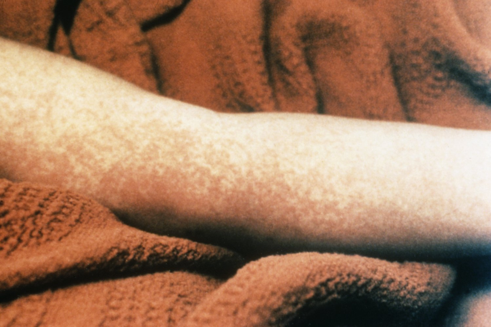
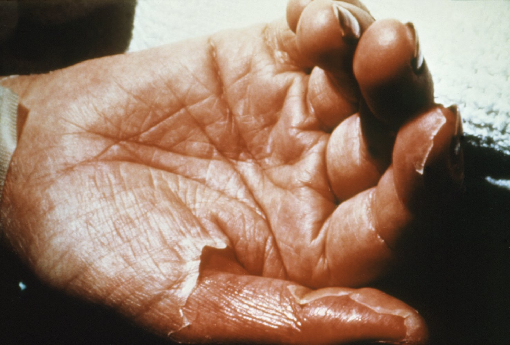
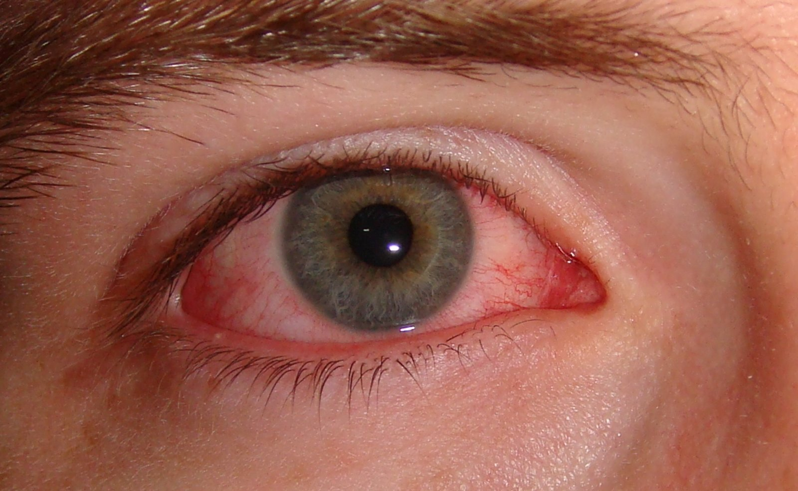
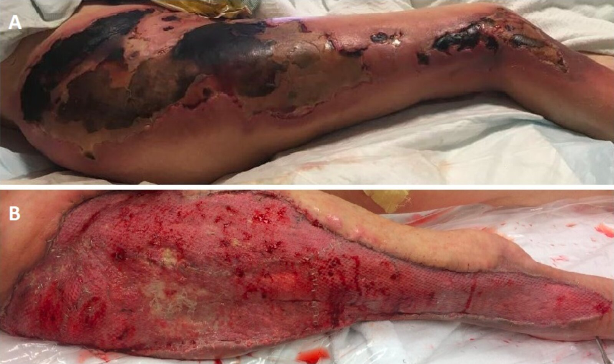
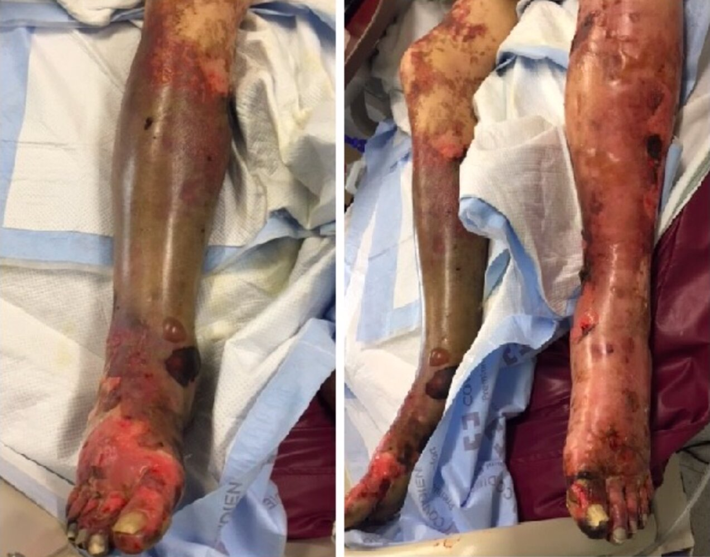
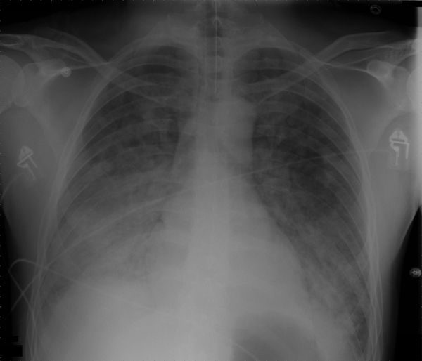
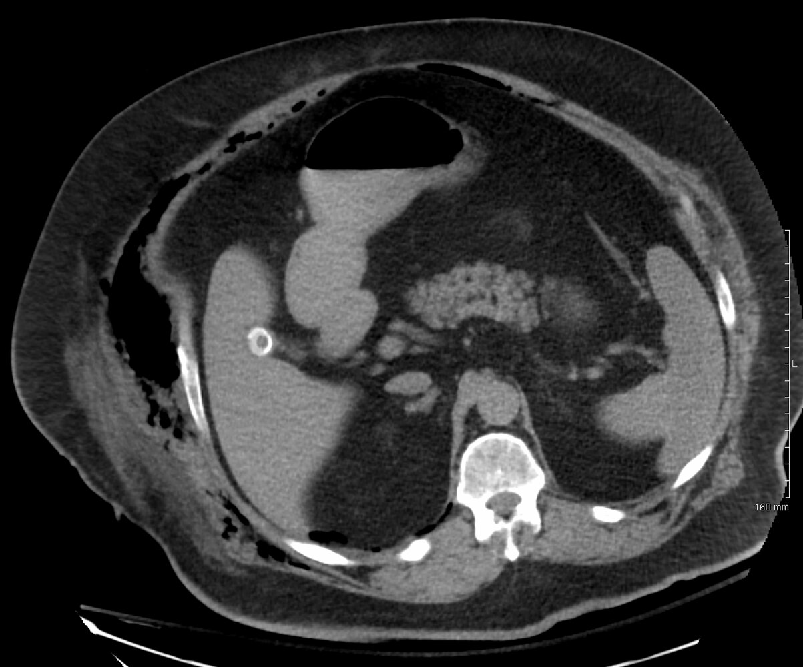

# Toxic shock syndrome

*Categories: Clinical knowledge > Emergency medicine > Infectious diseases > Toxic shock syndrome*

[Original Article Link](https://coursology-qbank.com/amboss/article/5q0i_S)

---

## Summary

Toxic <u>shock</u> syndrome (TSS) is a rare toxin-mediated life-threatening acute condition caused by toxin-producing strains of <u>Streptococcus pyogenes</u> and <u>Staphylococcus aureus</u>. These bacterial strains produce <u>superantigenic</u> <u>exotoxins</u>, which trigger massive <u>cytokine</u> release and cause <u>endothelial</u> <u>cell wall</u> damage; this can lead to <u>capillary leak</u> syndrome and end-organ damage. <u>Risk factors for TSS</u> include prolonged tampon placement, wounds (including surgical wounds), and invasive/aggressive Group A <u>Streptococcus</u> (<u>GAS</u>) infections (e.g., <u>necrotizing fasciitis</u>). TSS initially manifests with <u>flu-like</u> <u>prodromal</u> symptoms followed rapidly by symptoms of a <u>systemic inflammatory response syndrome</u>, which may progress to <u>shock</u> and <u>multiple organ failure</u>. Diagnostic studies often demonstrate end-organ dysfunction, and positive cultures can help narrow <u>antibiotic therapy</u>. TSS is a <u>clinical diagnosis</u> and treatment should be initiated as soon as TSS is suspected. Rapid recognition of TSS, followed by <u>fluid resuscitation</u>, appropriate <u>antibiotic</u> selection, reduction/neutralization of the toxin load, and removal of the infection source are essential for the <u>management of TSS</u>. TSS can be fatal if treatment is not initiated promptly; <u>streptococcal TSS</u> has a <u>mortality rate</u> of ∼ 30–80%.

---

## Overview

<u>Streptococcus pyogenes</u> and <u>Staphylococcus aureus</u> both cause TSS; however, <u>streptococcal TSS</u> and <u>staphylococcal TSS</u> often differ in their etiologies, clinical presentation, laboratory findings, and <u>mortality rates</u>.

| Overview of toxic <u>shock</u> syndrome (TSS) |  |  |  |
| --- | --- | --- | --- |
|  | Streptococcal TSS | Staphylococcal TSS |  |
| Menstrual TSS | Nonmenstrual TSS |  |  |
| Etiology and <u>risk factors</u> |   * Invasive <u>GAS infections</u>  * <u>NSAID</u> use with a <u>soft tissue</u> injury    |   * High-absorbency tampons  * Prolonged placement of tampons, menstrual cups, and vaginal sponges    |   * Postsurgical wound packing (especially <u>nasal packing</u>)  * Burn and wound infections  * Postpartum or postabortion infections    |
|  Superantigens implicated in TSS [[1]](https://coursology-qbank.com/amboss/article/QpXu6_)[[2]](https://coursology-qbank.com/amboss/article/eqXxx_)  |  * <u>Streptococcal pyrogenic exotoxins</u> (<u>SPE</u>) <u>serotypes</u>: ∼ 100% of cases  [[3]](https://coursology-qbank.com/amboss/article/8JXOD_)[[4]](https://coursology-qbank.com/amboss/article/VFXGS-)[[5]](https://coursology-qbank.com/amboss/article/RuXlI-)  * <u>SPE</u>-A  * <u>SPE</u>-B  * <u>SPE</u>-C  * <u>SPE</u>-F  * <u>SPE</u>-G   |  * <u>Toxic shock syndrome toxin-1</u> (<u>TSST-1</u>): ∼ 95% of cases  [[3]](https://coursology-qbank.com/amboss/article/8JXOD_)[[6]](https://coursology-qbank.com/amboss/article/VqXGx_)[[7]](https://coursology-qbank.com/amboss/article/UqXbB_)   |   * <u>TSST-1</u>: ∼ 50% of cases [[7]](https://coursology-qbank.com/amboss/article/UqXbB_)  * <u>Staphylococcal enterotoxin</u> (SE) <u>serotypes</u>: ∼ 50% [[1]](https://coursology-qbank.com/amboss/article/QpXu6_)[[3]](https://coursology-qbank.com/amboss/article/8JXOD_)[[7]](https://coursology-qbank.com/amboss/article/UqXbB_)  * <u>SEB</u>  * SEC    |
| Onset |  * Variable   |  * Peak onset: days 3–4 of <u>menstruation</u>  [[1]](https://coursology-qbank.com/amboss/article/QpXu6_)[[6]](https://coursology-qbank.com/amboss/article/VqXGx_)   |  * Typically within 48 hours postsurgery or postpartum [[8]](https://coursology-qbank.com/amboss/article/MtXMV-)   |
| Characteristic clinical features |   * <u>Fever</u> ≥ 38.9°C (≥ 102°F)  * Features of underlying invasive <u>GAS infection</u>  * Renal impairment [[9]](https://coursology-qbank.com/amboss/article/lpXvp_)  * Desquamating <u>rash</u> (uncommon;∼ 10%)    |   * <u>Fever</u> ≥ 38.9°C (≥ 102°F)  * Diffuse desquamating <u>rash</u> involving palms and soles (common;∼ 90%)  * <u>CNS</u> involvement  * <u>Mucosal</u> (<u>conjunctival</u>, oral, vaginal) involvement    |  |
| <u>Blood cultures</u> |  * Typically positive (∼ 60%) [[3]](https://coursology-qbank.com/amboss/article/8JXOD_)   |  * Typically negative (positive in < 5%)  [[3]](https://coursology-qbank.com/amboss/article/8JXOD_)[[10]](https://coursology-qbank.com/amboss/article/ltXvd-)   |  |
| Management |   * Administer <u>empiric antibiotic therapy for TSS</u> as soon as TSS is suspected.  * <u>Antibiotic</u> regime should include:  * A <u>beta-lactam antibiotic</u> or <u>vancomycin</u> to cover <u>S. aureus</u> and <u>S. pyogenes</u>  * PLUS a <u>protein synthesis</u>-inhibiting <u>antibiotic</u> (<u>clindamycin</u> or <u>linezolid</u>) to block toxin production  * Manage the source of infection (e.g., remove tampon, <u>surgical debridement</u> of infected tissue).    |  |  |
| <u>Mortality rates</u> |  * 30–80%  [[1]](https://coursology-qbank.com/amboss/article/QpXu6_)[[3]](https://coursology-qbank.com/amboss/article/8JXOD_)   |  * < 5% [[3]](https://coursology-qbank.com/amboss/article/8JXOD_)[[7]](https://coursology-qbank.com/amboss/article/UqXbB_)[[10]](https://coursology-qbank.com/amboss/article/ltXvd-)   |  * Up to 20% [[3]](https://coursology-qbank.com/amboss/article/8JXOD_)[[7]](https://coursology-qbank.com/amboss/article/UqXbB_)[[10]](https://coursology-qbank.com/amboss/article/ltXvd-)   |

---

## Etiology

TSS is most commonly caused by toxin-producing strains of <u>Streptococcus pyogenes</u> and <u>Staphylococcus aureus</u> [[3]](https://coursology-qbank.com/amboss/article/8JXOD_)

|  Risk factors for TSS [[1]](https://coursology-qbank.com/amboss/article/QpXu6_)  |  |  |
| --- | --- | --- |
| <u>Streptococcal TSS</u> |  Invasive <u>GAS infections</u> [[3]](https://coursology-qbank.com/amboss/article/8JXOD_)[[9]](https://coursology-qbank.com/amboss/article/lpXvp_)[[12]](https://coursology-qbank.com/amboss/article/b8XHO-)  |   * <u>Soft tissue infections</u> (<u>necrotizing fasciitis</u> and <u>myositis</u>)  * <u>Bacteremia</u>  * <u>Postpartum sepsis</u>  * <u>Pneumonia</u>    |
| Noninvasive <u>GAS infections</u> |   * <u>Cellulitis</u>  * Infected cuts    |  |
| Others |  * <u>NSAID</u> use with a <u>soft tissue</u> injury  [[9]](https://coursology-qbank.com/amboss/article/lpXvp_)[[13]](https://coursology-qbank.com/amboss/article/5qXi__)   |  |
| <u>Staphylococcal TSS</u> |  Menstrual factors (∼ 50% of cases)[[14]](https://coursology-qbank.com/amboss/article/dFXoS-)  |   * High-absorbency tampons  * Prolonged placement of tampons, menstrual cups, and vaginal sponges    |
|  Nonmenstrual factors [[1]](https://coursology-qbank.com/amboss/article/QpXu6_)  |   * Burn and wound infections  * Postpartum or postabortion infections  * Postsurgical wound packing    |  |
| Both | Underlying medical conditions |   * <u>Diabetes</u>  * <u>Alcohol use disorder</u>    |
|  Recent viral infections  [[8]](https://coursology-qbank.com/amboss/article/MtXMV-)[[15]](https://coursology-qbank.com/amboss/article/LqXw__)[[16]](https://coursology-qbank.com/amboss/article/oqX0z_)  |   * <u>Varicella</u>  * <u>Influenza</u>    |  |

---

## Pathophysiology

TSS is a systemic inflammatory response, similar to <u>sepsis</u>; see also “Pathophysiology” in “<u>Sepsis</u>.”

* <u>Superantigen</u> production: Causative organisms (<u>S. pyogenes</u> and <u>S. aureus</u>) produce <u>superantigens</u> (see “<u>Superantigens implicated in TSS</u>”)

* Superantigen-mediated T-cell activation [[1]](https://coursology-qbank.com/amboss/article/QpXu6_)

* <u>Superantigens</u> bypass processing and presentation by <u>antigen-presenting cells</u>.

* <u>Superantigens</u> directly connect the <u>MHC class II</u> molecule on <u>antigen</u>-presenting cells to the <u>T-cell</u> <u>receptor</u> on <u>T-cells</u> by forming a bridge outside of the normal binding sites → nonspecific <u>T-cell</u> activation  → rapid activation of excessive numbers of <u>T cells</u> → massive <u>cytokine</u> release  [[1]](https://coursology-qbank.com/amboss/article/QpXu6_)[[2]](https://coursology-qbank.com/amboss/article/eqXxx_)[[3]](https://coursology-qbank.com/amboss/article/8JXOD_)

* <u>SIRS</u>: ↑↑↑ <u>Cytokines</u> → generalized <u>endothelial</u> disruption → <u>capillary</u> leak syndrome → generalized <u>edema</u> → <u>intravascular</u> <u>hypovolemia</u> → organ dysfunction and <u>disseminated intravascular coagulation</u> (<u>DIC</u>)

> [!NOTE]
> Very small amounts of <u>superantigens</u> can rapidly activate excessive numbers of <u>T cells</u>, triggering a massive release of <u>proinflammatory cytokines</u>, resulting in <u>SIRS</u>

---

## Clinical features

TSS typically manifests as a <u>prodrome</u> of nonspecific symptoms, followed by <u>hypotension</u> and rapid progression (8–12 hours) to end-organ involvement. [[3]](https://coursology-qbank.com/amboss/article/8JXOD_)

### Onset

* <u>Streptococcal TSS</u>: variable onset

* <u>Staphylococcal TSS</u>

* Menstrual etiology: peak onset on days 3–4 of <u>menstruation</u>  [[1]](https://coursology-qbank.com/amboss/article/QpXu6_)[[11]](https://coursology-qbank.com/amboss/article/FJXgD_)

* Postsurgical and postpartum TSS: typically < 48 hours after <u>surgery</u> or delivery [[8]](https://coursology-qbank.com/amboss/article/MtXMV-)[[17]](https://coursology-qbank.com/amboss/article/S9Yy5r)

### <u>Prodrome</u> [[1]](https://coursology-qbank.com/amboss/article/QpXu6_)

* <u>Flu-like</u> symptoms: high <u>fever</u>, chills, <u>myalgia</u>, <u>headache</u>, <u>nausea</u>, <u>vomiting</u>, <u>diarrhea</u>

* <u>Dermal</u> <u>rash</u>: more common in menstrual <u>staphylococcal TSS</u> than in nonmenstrual <u>staphylococcal TSS</u> and <u>streptococcal TSS</u> ;  [[7]](https://coursology-qbank.com/amboss/article/UqXbB_)[[18]](https://coursology-qbank.com/amboss/article/gFXFh-)

* Transient <u>erythematous</u> macular (<u>sunburn</u>-like) <u>rash</u>

* Commonly involves the palms and soles

* Typically desquamates 1–2 weeks after onset.

* <u>Mucosal</u> involvement  [[8]](https://coursology-qbank.com/amboss/article/MtXMV-)[[19]](https://coursology-qbank.com/amboss/article/35YSPp)

* <u>Strawberry tongue</u>

* Nonpurulent <u>conjunctivitis</u>

* Oropharyngeal <u>hyperemia</u>

* Evidence of points of entry: <u>superficial</u> cuts or <u>burns</u>; surgical wounds [[3]](https://coursology-qbank.com/amboss/article/8JXOD_)

* Evidence of underlying <u>GAS infections</u>: deep infections, e.g., <u>cellulitis</u>, <u>myositis</u>, <u>necrotizing fasciitis</u> (may occur following <u>blunt trauma</u>)

Diffuse maculopapular exanthema in toxic shock syndrome

Desquamation in toxic shock syndrome

Strawberry tongue

Conjunctival hyperemia

Necrotizing fasciitis

> [!WARNING]
> Suspect underlying <u>necrotizing fasciitis</u> or <u>myositis</u> in patients with <u>pain out of proportion</u> to physical findings on examination.

### <u>Shock</u> and <u>end-organ dysfunction</u> [[3]](https://coursology-qbank.com/amboss/article/8JXOD_)

* Early: : <u>tachycardia</u>, <u>tachypnea</u>, high <u>fever</u>, <u>altered mental status</u>  [[10]](https://coursology-qbank.com/amboss/article/ltXvd-)[[20]](https://coursology-qbank.com/amboss/article/OtXId-)

* Late

* <u>Hypotension</u>

* Delayed <u>capillary refill</u>

* Worsening <u>altered mental status</u>

* Evidence of organ failure

* Signs of deranged clotting, e.g., <u>purpura fulminans</u>

* <u>Mucosal</u> <u>ulceration</u>

Purpura fulminans

Purpura fulminans

---

## Diagnosis

### General principles

* Suspect TSS in a previously healthy individual presenting with <u>hypotension</u> and rapidly progressive <u>multiorgan dysfunction</u> preceded by <u>fever</u> with or without a <u>rash</u>.

* The presence of any <u>risk factor for TSS</u>  should further raise suspicion of TSS.

* Obtain <u>blood cultures</u> and initiate <u>empiric antibiotic therapy for TSS</u> as soon as TSS is suspected.

* <u>Workup for sepsis</u> and obtain additional focused cultures based on the suspected site(s) of primary infection.

* Consider <u>differential diagnoses of TSS</u> and obtain diagnostics as needed.

* Consider imaging to assess for alternate diagnoses, underlying conditions, and complications.

* Consider toxin studies in patients with suspected <u>staphylococcal TSS</u>.

> [!WARNING]
> Initiate <u>empiric antibiotic therapy for TSS</u> as soon as TSS is suspected; do not wait for the results of <u>laboratory studies</u>.

### <u>Laboratory studies</u> [[21]](https://coursology-qbank.com/amboss/article/PpXWp_)[[22]](https://coursology-qbank.com/amboss/article/4pX3p_)

#### <u>Workup for sepsis</u>

Findings are typically nonspecific but may show evidence of infection and end-organ involvement.

* <u>CBC</u>

* Normal or ↑ <u>WBC</u> with significant <u>left shift</u>

* <u>Anemia</u>  [[9]](https://coursology-qbank.com/amboss/article/lpXvp_)

* <u>Thrombocytopenia</u>

* <u>Coagulation screen</u>: ↑ <u>PT</u>, ↑ <u>PTT</u>, ↓ <u>fibrinogen</u>, ↑ <u>fibrin degradation products</u>

* <u>Liver chemistries</u>: ↑ <u>ALT</u>/<u>AST</u>, ↑ total <u>bilirubin</u>, ↓ <u>albumin</u>, ↓ total protein

* Basal metabolic panel  [[9]](https://coursology-qbank.com/amboss/article/lpXvp_)

* Serum: ↑ <u>BUN</u>, ↑ <u>creatinine</u>

* <u>Hypocalcemia</u>  [[23]](https://coursology-qbank.com/amboss/article/4tX3d-)

* <u>VBG</u>/<u>ABG</u>: ↑ <u>lactate</u>; <u>ABG</u> may show <u>signs of respiratory failure</u>

* <u>Inflammatory markers</u>: ↑ <u>ESR</u>, ↑ <u>CRP</u>

* <u>Creatine kinase</u>: may be elevated

* <u>Urinalysis</u>: <u>urinary sediment</u>, ↑ urine <u>leukocytes</u> without <u>UTI</u> (<u>sterile pyuria</u>)

#### Bacteriology

* <u>Blood cultures</u>: Obtain <u>blood cultures</u> in all patients, preferably before administering <u>empiric antibiotics</u>.

* <u>Streptococcal TSS</u>: typically positive (∼ 60% of cases)

* <u>Staphylococcal TSS</u>: typically negative (positive in < 5% of cases)

* Focused cultures

* Perform a complete <u>physical examination</u> to identify any potential primary sites of infection.

* Obtain cultures from any suspected source(s) of infection (e.g., <u>skin</u>, <u>vagina</u>, nares, wounds)

* <u>CSF</u> culture: Consider to rule out alternative diagnoses (e.g., <u>meningitis</u>, <u>encephalitis</u>) in patients with <u>fever</u> and <u>altered mental status</u>.

> [!TIP]
> <u>Blood cultures</u> are typically negative in <u>staphylococcal TSS</u>.

#### Toxin-specific studies

* <u>TSST-1</u> assay of <u>S. aureus</u> culture isolate [[24]](https://coursology-qbank.com/amboss/article/P8XW5-)

* Consider in patients with suspected <u>staphylococcal TSS</u>.

* A positive <u>TSST-1</u> assay supports a diagnosis of <u>staphylococcal TSS</u>.

* TSST-1 antibody titers [[1]](https://coursology-qbank.com/amboss/article/QpXu6_)[[3]](https://coursology-qbank.com/amboss/article/8JXOD_)[[11]](https://coursology-qbank.com/amboss/article/FJXgD_)[[24]](https://coursology-qbank.com/amboss/article/P8XW5-)

* Consider in patients with <u>menstrual TSS</u> or recurrent <u>staphylococcal TSS</u>.

* Undetectable or low <u>antibody</u> <u>titers</u> indicate an increased risk of <u>recurrent TSS</u>.

* Approximately 90% of patients with <u>menstrual TSS</u> have low or undetectable <u>TSST-1</u> <u>antibody</u> levels during the illness.

* Up to two-thirds of these patients do not develop protective <u>antibodies</u> following recovery.

### Imaging

Imaging is not needed to make a diagnosis of TSS, but it may be considered if patients have the following symptoms:

* Severe muscle <u>pain</u>: CT or <u>MRI</u> of the affected region to evaluate for <u>myositis</u>, <u>necrotizing fasciitis</u> , or an <u>abscess</u>

* <u>Altered mental status</u>: CT head to rule out an alternate intracranial cause  [[25]](https://coursology-qbank.com/amboss/article/4KY3gJ)

* Respiratory symptoms: <u>CXR</u> to evaluate for concurrent <u>pneumonia</u> or the development of <u>ARDS</u>

Diffuse airspace opacification

Soft tissue gas

---

## Treatment

### Approach [[1]](https://coursology-qbank.com/amboss/article/QpXu6_)[[3]](https://coursology-qbank.com/amboss/article/8JXOD_)[[11]](https://coursology-qbank.com/amboss/article/FJXgD_)[[26]](https://coursology-qbank.com/amboss/article/jpX_6_)

* <u>Hemodynamic resuscitation</u> as needed

* Identify and manage the source of infection; obtain cultures of the suspected primary site(s) of infection.

* Initiate <u>empiric antibiotic therapy for TSS</u> within 1 hour of presentation; consider IVIG as adjunctive therapy in <u>streptococcal TSS</u>.

* Consider measures to prevent <u>recurrent TSS</u>, especially in patients with <u>staphylococcal TSS</u>.

* TSS is a <u>reportable disease</u> in the US; see “<u>Public health surveillance</u>” below for details.

> [!TIP]
> TSS is a life-threatening emergency that requires early diagnosis and a multidisciplinary approach to management.

### <u>Hemodynamic resuscitation</u>

* Urgent <u>IV fluid resuscitation</u> is indicated for <u>hemodynamically unstable</u> patients.

* <u>Hypotension</u> refractory to fluids: Administer <u>vasopressors for septic shock</u>.

* See “<u>Management of sepsis</u>” for further guidance.

### Management of source(s) of infection [[3]](https://coursology-qbank.com/amboss/article/8JXOD_)[[8]](https://coursology-qbank.com/amboss/article/MtXMV-)

* Examine for <u>skin</u> lesions and wounds.

* Remove any foreign bodies (e.g., tampons, nasal packs, surgical packs).

* Drain infected fluid collections (e.g., <u>abscess</u>).

* Urgent surgical consult for suspected <u>necrotizing fasciitis</u>/<u>myositis</u>.

> [!TIP]
> Obtain cultures from any potential site(s) of infection.

### <u>Antibiotic therapy</u> [[11]](https://coursology-qbank.com/amboss/article/FJXgD_)[[27]](https://coursology-qbank.com/amboss/article/LMbw68)[[28]](https://coursology-qbank.com/amboss/article/Om0Ifg)

* Indication: all patients with suspected TSS; preferably initiated within an hour of presentation

* Coverage required

* A <u>bactericidal</u> <u>antibiotic</u> that covers both <u>S. pyogenes</u> and <u>S. aureus</u> (i.e., <u>vancomycin</u>, <u>beta-lactam antibiotic</u>)

* PLUS a protein-synthesis inhibitor (e.g., <u>clindamycin</u>, <u>linezolid</u>).

* Tailor <u>antibiotic therapy</u> to the <u>antibiotic sensitivities</u> once known.

* For patients with <u>penicillin</u> <u>allergy</u>, replace the <u>beta-lactam antibiotic</u> with <u>vancomycin</u>.

* Total duration of <u>antibiotic therapy</u>: not well-defined; 2 weeks minimum

* Treat concurrent or underlying infection: e.g., see “<u>Antibiotic therapy for skin and soft tissue infection</u>”

> [!NOTE]
> <u>Protein synthesis</u>-inhibiting <u>antibiotics</u> inhibit toxin production but as they are <u>bacteriostatic</u>, they should be used in combination with a <u>bactericidal</u> antistreptococcal and/or antistaphylococcal <u>antibiotic</u>.

|  Empiric antibiotic therapy for TSS [[11]](https://coursology-qbank.com/amboss/article/FJXgD_)[[27]](https://coursology-qbank.com/amboss/article/LMbw68)[[28]](https://coursology-qbank.com/amboss/article/Om0Ifg)  |  |  |
| --- | --- | --- |
|  Causative organism unclear (or <u>penicillin</u> <u>allergy</u> in confirmed TSS) [[11]](https://coursology-qbank.com/amboss/article/FJXgD_)[[28]](https://coursology-qbank.com/amboss/article/Om0Ifg)[[29]](https://coursology-qbank.com/amboss/article/O8XI5-)  |  |   * <u>Vancomycin</u> DOSAGE  * PLUS <u>clindamycin</u> DOSAGE OR <u>linezolid</u> DOSAGE    |
|  Based on suspected <u>pathogen</u> (i.e., based on history, clinical features, <u>Gram stain</u>, or cultures)   |  Suspected <u>streptococcal TSS</u> [[28]](https://coursology-qbank.com/amboss/article/Om0Ifg)  |   * <u>Penicillin G</u> DOSAGE  * PLUS <u>clindamycin</u> DOSAGE    |
|  Suspected <u>staphylococcal TSS</u> [[11]](https://coursology-qbank.com/amboss/article/FJXgD_)[[28]](https://coursology-qbank.com/amboss/article/Om0Ifg)  |   * <u>MSSA</u> (suspected/confirmed)   * <u>Oxacillin</u> DOSAGE  OR <u>nafcillin</u> DOSAGE  * PLUS <u>clindamycin</u> DOSAGE  * <u>MRSA</u> (suspected/confirmed)  * <u>Vancomycin</u> DOSAGE  * PLUS <u>clindamycin</u> DOSAGE    |  |

### Adjunctive therapy [[11]](https://coursology-qbank.com/amboss/article/FJXgD_)

* Consider IVIG DOSAGE in adults with <u>streptococcal TSS</u> (e.g., those with <u>hypotension</u> refractory to <u>vasopressors</u>).  [[3]](https://coursology-qbank.com/amboss/article/8JXOD_)[[27]](https://coursology-qbank.com/amboss/article/LMbw68)

### Consults and disposition

* Urgent consultation of appropriate specialists:

* Based on the location of the infection: ENT, <u>OB/GYN</u>, <u>surgery</u>, orthopedics

* To guide medical management: critical care and infectious disease

* Consider admission to an <u>intensive care unit</u>, as patients can deteriorate rapidly.

---