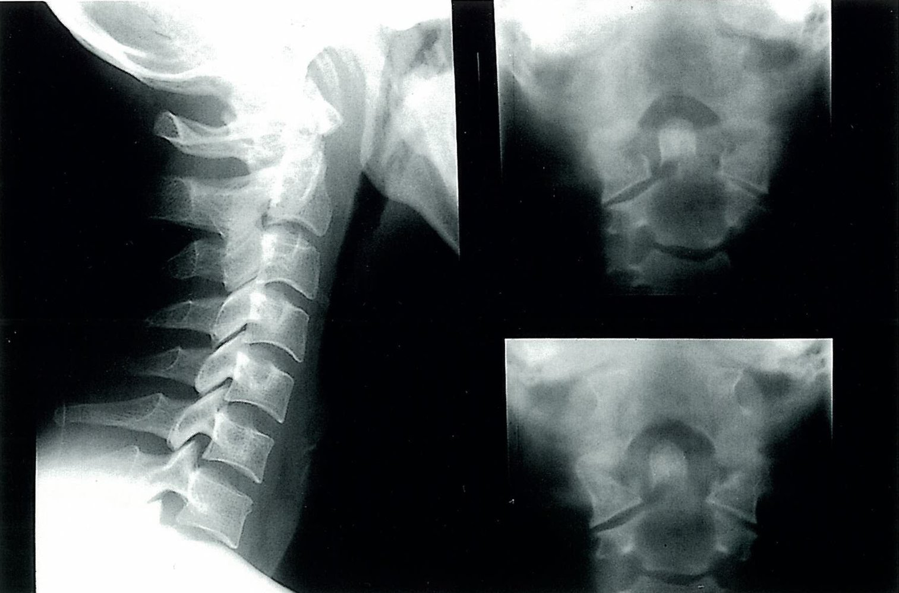

# Neck sprain

*Categories: Clinical knowledge > Emergency medicine > Musculoskeletal and rheumatic disorders > Neck sprain*

[Original Article Link](https://coursology-qbank.com/amboss/article/P80W53)

---

## Summary

Neck <u>sprains</u> and <u>whiplash</u> injuries are commonly caused by direct impact or abnormal neck movement. Neck <u>sprains</u> occur due to overstretching, while <u>whiplash</u> injuries result from abrupt <u>flexion</u>/extension of the neck. Both conditions are <u>diagnosed clinically</u>. After acute injury, <u>cervical spine precautions</u> are maintained until the clinical assessment is complete. <u>Clinical decision rules</u> (e.g., <u>NEXUS C-spine criteria</u>, Canadian <u>C-spine</u> rule) are used to determine whether imaging is required to rule out significant <u>cervical spine injury</u>. Treatment of uncomplicated neck <u>sprains</u> and <u>whiplash</u> injuries involves <u>pain management</u> with nonopiate <u>analgesics</u>, early mobilization, and <u>physiotherapy</u>. Clinically significant <u>cervical spine injuries</u> require urgent specialist consultation.

---

## Definitions

* Neck <u>sprain</u>: neck <u>ligament injury</u> and/or <u>muscle strain</u> due to overstretching [[1]](https://coursology-qbank.com/amboss/article/ueWp0k0)

* Whiplash injury: injury pattern caused by abrupt <u>flexion</u>/extension movement of the neck   [[2]](https://coursology-qbank.com/amboss/article/9VWN940)[[3]](https://coursology-qbank.com/amboss/article/lNWvYN0)

> [!TIP]
> <u>Whiplash</u> injuries are a common cause of cervical strain and <u>sprain</u>.

---

## Etiology

* <u>Motor vehicle crashes</u>  [[2]](https://coursology-qbank.com/amboss/article/9VWN940)[[5]](https://coursology-qbank.com/amboss/article/B3WzkO0)

* Falls

* <u>Sports injuries</u>

* Work-related injuries

* Physical assault

---

## Clinical features

### Common features [[1]](https://coursology-qbank.com/amboss/article/ueWp0k0)[[2]](https://coursology-qbank.com/amboss/article/9VWN940)

Any of the following may occur immediately or appear hours to days following injury:

* <u>Neck pain</u>, stiffness, and tenderness

* Reduced neck <u>range of motion</u>

* Palpable shoulder and neck muscle tension

* Occipital <u>headaches</u>

* Upper back, shoulder, and upper limb <u>pain</u> and/or <u>paresthesia</u>

* <u>Dizziness</u>, fatigue, <u>insomnia</u>, visual disturbances, <u>tinnitus</u>, difficulty concentrating

> [!TIP]
> <u>Whiplash injury</u> and <u>mTBI</u> can occur simultaneously and have overlapping symptoms such as <u>headaches</u>, <u>dizziness</u>, and visual disturbances. [[6]](https://coursology-qbank.com/amboss/article/AN1Rdh0)

### <u>Red flags</u> [[4]](https://coursology-qbank.com/amboss/article/KnbU88)[[6]](https://coursology-qbank.com/amboss/article/AN1Rdh0)

The following <u>red flags</u> in post-<u>trauma patients</u> are concerning for <u>C-spine fracture</u> or <u>neurovascular injury</u> and should prompt further investigation:

* <u>Neck pain</u> after major trauma

* <u>Signs of vertebral fractures</u>, e.g., paravertebral <u>hematoma</u>

* Features of vascular injury, e.g., arterial <u>bruit</u> or symptoms of cerebral <u>ischemia</u>

* Neurological features, e.g., <u>hypesthesia</u> or <u>Horner syndrome</u>

> [!WARNING]
> The absence of neurologic deficits does not rule out clinically significant <u>cervical spine injury</u>.

---

## Diagnosis

### Approach [[2]](https://coursology-qbank.com/amboss/article/9VWN940)[[6]](https://coursology-qbank.com/amboss/article/AN1Rdh0)

* Neck <u>sprain</u> and <u>whiplash injury</u> are <u>clinical diagnoses</u>.

* Determine the need for CT to rule out significant <u>C-spine injury</u> using a validated <u>clinical decision rule</u>, e.g.:

* <u>NEXUS C-spine criteria</u>

* Canadian <u>C-spine</u> rule

* Consider additional imaging to assess for <u>fractures</u>, <u>dislocation</u>, <u>ligament</u> damage, and/or <u>neurovascular injury</u>.

* Consult <u>spine</u> <u>surgery</u> urgently for any evidence of <u>vertebral fractures</u> or <u>cervical facet dislocation</u>.

* See “<u>Diagnosis of C-spine injury</u>” for details.

> [!WARNING]
> Following acute trauma, maintain <u>C-spine precautions</u> until the initial assessment is complete.

> [!WARNING]
> Obtain imaging of the <u>cervical spine</u> in any patient with <u>polytrauma</u> or <u>altered mental status</u> after acute trauma.

NEXUS C-Spine Criteria

Canadian C-Spine Rule

### Imaging [[6]](https://coursology-qbank.com/amboss/article/AN1Rdh0)[[7]](https://coursology-qbank.com/amboss/article/CVWq940)

Imaging may be used to rule out <u>fractures</u>, <u>dislocations</u>, <u>ligament</u> damage, and <u>neurovascular injury</u> (see “<u>Diagnostics for C-spine injury</u>”).

* CT <u>cervical spine</u> without IV contrast

* Initial test of choice in most patients with acute nonpenetrating trauma to the neck

* Also indicated to evaluate any abnormal <u>x-ray</u> findings

* <u>MRI</u> <u>C-spine</u> without IV contrast

* Alternative to CT for initial testing

* Also used to evaluate persistent clinical suspicion of ligamentous or neurologic injury despite normal CT

* <u>X-ray</u> <u>cervical spine</u> 

* Rarely indicated  [[7]](https://coursology-qbank.com/amboss/article/CVWq940)

* Views: <u>lateral</u>, anteroposterior, and open-mouth view of the odontoid

* Vascular studies (e.g., <u>CTA</u> neck, <u>MRA</u> neck): if clinical or imaging findings suggest arterial injury

Odontoid (dens) fracture

---

## Treatment

After <u>vertebral fractures</u> and <u>cervical facet dislocations</u> have been excluded, the <u>treatment of neck sprain and whiplash injury</u> is mainly supportive. [[4]](https://coursology-qbank.com/amboss/article/KnbU88)[[6]](https://coursology-qbank.com/amboss/article/AN1Rdh0)

* Offer reassurance.

* Provide adequate <u>non-opioid</u> <u>pain control</u>. [[8]](https://coursology-qbank.com/amboss/article/NNW-YN0)

* Encourage early mobilization and refer to <u>physiotherapy</u>.  [[6]](https://coursology-qbank.com/amboss/article/AN1Rdh0)[[9]](https://coursology-qbank.com/amboss/article/kQYmwK)

* Arrange follow-up with a primary care provider.

---